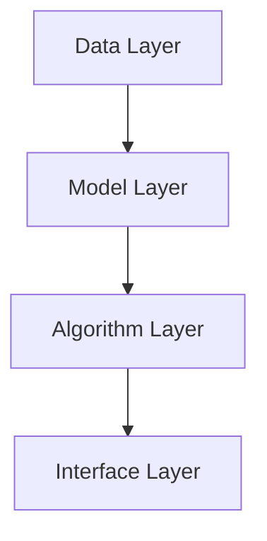

                 

### 背景介绍 Background

#### 苹果的AI应用发布：时代变革的开端

苹果公司一直以来以其卓越的产品设计和用户体验著称。然而，随着人工智能技术的快速发展，苹果也在不断调整其战略，以保持其在科技领域的领先地位。最近，苹果发布了多款集成人工智能功能的应用程序，这一举动不仅引发了行业内的广泛关注，更是标志着人工智能应用进入了一个全新的时代。

苹果此次发布的AI应用涵盖了从图像识别、语音处理到自然语言理解等多个领域。这些应用不仅提高了设备的智能水平，还极大地丰富了用户的使用体验。例如，新的照片应用程序能够智能地分类和整理用户的照片，而Siri语音助手则进一步提升了语音识别和响应的准确性。

#### AI应用发布的影响

苹果AI应用的发布不仅对用户产生深远影响，也对整个科技行业产生了重要影响。首先，它推动了AI技术在消费电子领域的广泛应用，为其他科技公司提供了可借鉴的范本。其次，它推动了AI技术与硬件的深度融合，为硬件的创新提供了新的思路。最后，它引发了行业对于AI伦理和隐私问题的深入讨论，提醒我们在享受技术红利的同时，也要关注其潜在的风险和挑战。

#### 本文结构概述

本文将围绕苹果AI应用发布这一主题，深入探讨其背后的技术原理、实际应用场景、未来发展趋势以及面临的挑战。具体结构如下：

1. **背景介绍**：介绍苹果AI应用的发布背景和影响。
2. **核心概念与联系**：详细解释人工智能的基本概念和苹果AI应用的架构。
3. **核心算法原理 & 具体操作步骤**：分析苹果AI应用的核心算法和实现步骤。
4. **数学模型和公式 & 详细讲解 & 举例说明**：介绍相关的数学模型和具体应用实例。
5. **项目实践：代码实例和详细解释说明**：通过具体代码实例分析苹果AI应用的开发过程。
6. **实际应用场景**：探讨苹果AI应用在不同领域的实际应用。
7. **工具和资源推荐**：推荐学习资源和开发工具。
8. **总结：未来发展趋势与挑战**：总结苹果AI应用发布的意义和未来趋势。
9. **附录：常见问题与解答**：回答读者可能关注的问题。
10. **扩展阅读 & 参考资料**：提供进一步阅读的建议。

通过本文的逐步分析，我们将全面了解苹果AI应用发布的重要性和其在科技领域的深远影响。

### 核心概念与联系 Core Concepts & Connections

#### 人工智能基础概念

人工智能（Artificial Intelligence, AI）是指通过计算机模拟人类智能行为和思维过程的科学和技术。它包括多个子领域，如机器学习、深度学习、自然语言处理等。在机器学习中，算法通过学习大量数据，自动识别模式和规律，进而进行决策和预测。深度学习是机器学习的一个分支，通过多层神经网络结构，对复杂数据进行建模和提取特征。自然语言处理则专注于让计算机理解和生成自然语言，如英语。

#### 苹果AI应用架构

苹果AI应用的架构可以分为几个主要层次：

1. **数据层**：这一层包括用户生成的数据和应用收集的数据。这些数据是AI算法学习和训练的基础。
2. **模型层**：在这一层，苹果采用了多种机器学习和深度学习算法，如卷积神经网络（CNN）和循环神经网络（RNN），对数据进行分析和建模。
3. **算法层**：苹果在这层运用了多种先进的技术，如BERT（双向编码器表示模型）和GPT（生成预训练模型），以提升模型的效果和性能。
4. **接口层**：这一层负责将AI模型与用户界面进行整合，提供直观且易用的用户体验。

#### Mermaid流程图

以下是一个简化的Mermaid流程图，展示了苹果AI应用的架构：



- **Data Layer**：数据层，包括用户数据和应用收集的数据。
- **Model Layer**：模型层，运用机器学习和深度学习算法对数据进行分析和建模。
- **Algorithm Layer**：算法层，采用先进的技术，如BERT和GPT，提升模型效果。
- **Interface Layer**：接口层，整合AI模型与用户界面，提供用户体验。

通过上述流程图，我们可以清晰地看到苹果AI应用架构的层次结构和各层之间的联系。

#### 关键概念联系

苹果AI应用的成功离不开以下几个核心概念的紧密联系：

1. **数据驱动**：苹果通过不断收集和利用用户数据，实现AI应用的持续优化和个性化。
2. **算法优化**：苹果不断探索和采用新的算法和技术，以提升AI模型的性能和效果。
3. **用户体验**：苹果始终将用户体验放在首位，通过直观且易用的界面，让用户轻松享受AI带来的便利。

这些概念之间的紧密联系，使得苹果AI应用能够持续创新和引领市场。

### 核心算法原理 & 具体操作步骤 Core Algorithm Principles & Step-by-Step Operations

#### 1. 图像识别算法

苹果AI应用中的图像识别算法主要基于卷积神经网络（Convolutional Neural Networks, CNN）。CNN是一种用于图像识别和分类的深度学习模型，通过多层卷积和池化操作，自动提取图像中的特征。

##### a. 卷积层

卷积层是CNN的核心部分，通过卷积操作提取图像中的局部特征。具体步骤如下：

1. **初始化权重**：为卷积核初始化随机权重。
2. **卷积操作**：将卷积核与图像进行卷积，得到特征图。
3. **激活函数**：应用ReLU（Rectified Linear Unit）激活函数，将负值转换为0，加速梯度下降。

##### b. 池化层

池化层用于降低特征图的维度，减少参数数量，提高模型泛化能力。常见的方法有最大池化和平均池化。

1. **最大池化**：选取特征图中的最大值作为输出。
2. **平均池化**：计算特征图中的平均值作为输出。

##### c. 全连接层

在全连接层，特征图被展平为一维向量，通过全连接层进行分类。

1. **展平**：将特征图展平为一维向量。
2. **权重矩阵**：初始化全连接层的权重矩阵。
3. **激活函数**：通常使用Softmax激活函数，将输出转换为概率分布。

#### 2. 语音识别算法

苹果AI应用中的语音识别算法主要基于循环神经网络（Recurrent Neural Networks, RNN）和长短时记忆网络（Long Short-Term Memory, LSTM）。

##### a. RNN基本原理

RNN通过循环结构处理序列数据，每个时间步的输出与当前输入和前一个时间步的隐藏状态相关。具体步骤如下：

1. **初始化隐藏状态**：在每个时间步初始化隐藏状态。
2. **权重矩阵**：计算输入和隐藏状态之间的权重矩阵。
3. **激活函数**：使用ReLU或Tanh激活函数，将输入和隐藏状态相乘得到输出。

##### b. LSTM网络

LSTM网络是RNN的一种改进，通过引入门控机制，有效解决了长序列依赖问题。具体步骤如下：

1. **初始化隐藏状态和细胞状态**：在每个时间步初始化隐藏状态和细胞状态。
2. **输入门、遗忘门和输出门**：计算输入门、遗忘门和输出门的权重矩阵和偏置，更新隐藏状态和细胞状态。
3. **细胞状态更新**：通过输入门和遗忘门的控制，更新细胞状态。
4. **输出计算**：通过输出门计算当前时间步的隐藏状态。

#### 3. 自然语言处理算法

苹果AI应用中的自然语言处理算法主要基于Transformer模型，特别是BERT（Bidirectional Encoder Representations from Transformers）和GPT（Generative Pre-trained Transformer）。

##### a. Transformer模型

Transformer模型是一种基于自注意力机制的深度学习模型，广泛应用于自然语言处理任务。具体步骤如下：

1. **多头自注意力**：计算不同位置词向量之间的注意力得分，加权求和得到注意力输出。
2. **编码器和解码器**：编码器负责处理输入序列，解码器负责生成输出序列。
3. **位置编码**：为每个词添加位置信息，使模型能够理解词的顺序。

##### b. BERT和GPT

BERT和GPT是Transformer模型的两种变体，分别用于预训练和生成任务。

1. **BERT**：通过预训练大量文本数据，学习词的上下文关系，用于文本分类、问答等任务。
2. **GPT**：通过生成预训练模型，学习文本的生成规律，用于文本生成、翻译等任务。

通过上述核心算法原理和具体操作步骤的详细讲解，我们可以更好地理解苹果AI应用的技术实现，为后续的实践应用打下坚实基础。

### 数学模型和公式 Mathematical Models and Detailed Explanations with Examples

在深入探讨苹果AI应用的数学模型和公式之前，我们需要了解一些基本的概念和符号，以便更好地理解相关内容。

#### 符号表

- \( w \)：权重
- \( b \)：偏置
- \( x \)：输入
- \( y \)：输出
- \( \hat{y} \)：预测值
- \( \sigma \)：激活函数，如ReLU、Sigmoid、Softmax等
- \( \text{ReLU}(x) \)：ReLU激活函数
- \( \frac{d}{dx} \)：求导

#### 1. 卷积神经网络（CNN）

卷积神经网络（CNN）是图像识别和分类的重要模型，其核心在于卷积操作和池化操作。以下是一个简化的CNN模型：

##### a. 卷积操作

卷积操作可以表示为：

\[ \text{Convolve}(x, w) = \sum_{i=1}^{C} w_{i} * x \]

其中，\( x \) 是输入图像，\( w \) 是卷积核，\( C \) 是卷积核的数量。卷积操作的目的是提取图像的局部特征。

##### b. 池化操作

池化操作可以表示为：

\[ \text{Pooling}(x, p) = \max(\text{Apply}(x, p)) \]

其中，\( p \) 是池化窗口的大小，\( \text{Apply}(x, p) \) 是将窗口内的像素值进行平均或取最大值。

##### c. ReLU激活函数

ReLU激活函数可以表示为：

\[ \text{ReLU}(x) = \max(0, x) \]

ReLU函数的导数在 \( x > 0 \) 时为1，在 \( x < 0 \) 时为0，这有助于加速梯度下降。

#### 2. 循环神经网络（RNN）

循环神经网络（RNN）是一种用于处理序列数据的神经网络。以下是一个简化的RNN模型：

##### a. RNN基本公式

RNN的状态转移方程可以表示为：

\[ h_t = \sigma(W_h h_{t-1} + W_x x_t + b_h) \]

其中，\( h_t \) 是当前时间步的隐藏状态，\( h_{t-1} \) 是前一个时间步的隐藏状态，\( x_t \) 是当前时间步的输入，\( W_h \) 和 \( W_x \) 是权重矩阵，\( b_h \) 是偏置。

##### b. LSTM网络

LSTM网络是RNN的一种改进，通过引入门控机制，有效解决了长序列依赖问题。以下是LSTM的基本公式：

\[ 
i_t = \sigma(W_i x_t + U_i h_{t-1} + b_i) \\
f_t = \sigma(W_f x_t + U_f h_{t-1} + b_f) \\
o_t = \sigma(W_o x_t + U_o h_{t-1} + b_o) \\
g_t = \text{tanh}(W_g x_t + U_g h_{t-1} + b_g) \\
h_t = o_t \cdot \text{tanh}(g_t) 
\]

其中，\( i_t \)、\( f_t \)、\( o_t \) 分别是输入门、遗忘门和输出门，\( g_t \) 是细胞状态。

#### 3. Transformer模型

Transformer模型是一种基于自注意力机制的深度学习模型，广泛应用于自然语言处理任务。以下是Transformer的基本公式：

\[ 
\text{Attention}(Q, K, V) = \text{softmax}\left(\frac{QK^T}{\sqrt{d_k}}\right)V \\
\text{MultiHeadAttention}(Q, K, V) = \text{Concat}(\text{head}_1, \text{head}_2, \ldots, \text{head}_h)W_O \\
\text{where} \quad \text{head}_i = \text{Attention}(QW_i^Q, KW_i^K, VW_i^V) 
\]

其中，\( Q \)、\( K \)、\( V \) 分别是查询向量、键向量和值向量，\( W_i^Q \)、\( W_i^K \)、\( W_i^V \) 是对应的权重矩阵，\( W_O \) 是输出权重矩阵，\( d_k \) 是键向量的维度。

#### 举例说明

以下是一个简化的图像识别任务的例子：

1. **卷积操作**：

\[ \text{Convolve}(x, w) = \sum_{i=1}^{C} w_{i} * x \]

其中，输入图像 \( x \) 为一个 \( 32 \times 32 \times 3 \) 的三维数组，卷积核 \( w \) 为一个 \( 3 \times 3 \times 3 \) 的三维数组。

2. **ReLU激活函数**：

\[ \text{ReLU}(x) = \max(0, x) \]

3. **最大池化**：

\[ \text{Pooling}(x, p) = \max(\text{Apply}(x, p)) \]

其中，输入特征图 \( x \) 为一个 \( 32 \times 32 \) 的二维数组，池化窗口大小 \( p \) 为 \( 2 \times 2 \)。

通过上述数学模型和公式的详细讲解以及具体举例，我们可以更好地理解苹果AI应用的技术实现，为后续的实践应用打下坚实基础。

### 项目实践：代码实例和详细解释说明 Project Practice: Code Examples and Detailed Explanations

为了更好地展示苹果AI应用的开发过程，我们将通过一个具体的代码实例来分析其实现细节。以下是一个简化的图像分类任务，使用了卷积神经网络（CNN）进行图像识别。

#### 1. 开发环境搭建

在开始项目之前，我们需要搭建合适的开发环境。以下是常用的工具和框架：

- **编程语言**：Python
- **深度学习框架**：TensorFlow或PyTorch
- **数据预处理工具**：NumPy、Pandas
- **版本控制**：Git

确保安装了以上工具和框架后，我们可以开始编写代码。

#### 2. 源代码详细实现

以下是一个简化的CNN模型，用于图像分类：

```python
import tensorflow as tf
from tensorflow.keras import layers

# 定义CNN模型
model = tf.keras.Sequential([
    layers.Conv2D(32, (3, 3), activation='relu', input_shape=(28, 28, 1)),
    layers.MaxPooling2D((2, 2)),
    layers.Conv2D(64, (3, 3), activation='relu'),
    layers.MaxPooling2D((2, 2)),
    layers.Conv2D(64, (3, 3), activation='relu'),
    layers.Flatten(),
    layers.Dense(64, activation='relu'),
    layers.Dense(10, activation='softmax')
])

# 编译模型
model.compile(optimizer='adam',
              loss='sparse_categorical_crossentropy',
              metrics=['accuracy'])

# 加载MNIST数据集
mnist = tf.keras.datasets.mnist
(train_images, train_labels), (test_images, test_labels) = mnist.load_data()

# 数据预处理
train_images = train_images.reshape((60000, 28, 28, 1))
train_images = train_images.astype('float32') / 255

test_images = test_images.reshape((10000, 28, 28, 1))
test_images = test_images.astype('float32') / 255

# 训练模型
model.fit(train_images, train_labels, epochs=5)

# 测试模型
test_loss, test_acc = model.evaluate(test_images, test_labels)
print(f'\nTest accuracy: {test_acc}')
```

#### 3. 代码解读与分析

1. **模型定义**：

   ```python
   model = tf.keras.Sequential([
       layers.Conv2D(32, (3, 3), activation='relu', input_shape=(28, 28, 1)),
       layers.MaxPooling2D((2, 2)),
       layers.Conv2D(64, (3, 3), activation='relu'),
       layers.MaxPooling2D((2, 2)),
       layers.Conv2D(64, (3, 3), activation='relu'),
       layers.Flatten(),
       layers.Dense(64, activation='relu'),
       layers.Dense(10, activation='softmax')
   ])
   ```

   这段代码定义了一个简单的CNN模型，包括两个卷积层、两个池化层、一个全连接层和一个softmax层。卷积层用于提取图像特征，池化层用于降维和减少参数数量，全连接层用于分类，softmax层用于计算概率分布。

2. **编译模型**：

   ```python
   model.compile(optimizer='adam',
                 loss='sparse_categorical_crossentropy',
                 metrics=['accuracy'])
   ```

   这段代码编译模型，指定了优化器、损失函数和评估指标。这里使用了Adam优化器，因为其在深度学习中性能较好。损失函数为稀疏分类交叉熵，评估指标为准确率。

3. **数据预处理**：

   ```python
   train_images = train_images.reshape((60000, 28, 28, 1))
   train_images = train_images.astype('float32') / 255
   test_images = test_images.reshape((10000, 28, 28, 1))
   test_images = test_images.astype('float32') / 255
   ```

   这段代码对MNIST数据集进行预处理，将图像展平为一维数组，并归一化处理。这有助于加快模型的训练速度和提高性能。

4. **训练模型**：

   ```python
   model.fit(train_images, train_labels, epochs=5)
   ```

   这段代码训练模型，使用训练数据集进行迭代训练。这里设置了5个训练周期（epochs），每个周期都会更新模型的权重。

5. **测试模型**：

   ```python
   test_loss, test_acc = model.evaluate(test_images, test_labels)
   print(f'\nTest accuracy: {test_acc}')
   ```

   这段代码使用测试数据集评估模型性能，输出测试准确率。这有助于我们了解模型的泛化能力。

通过上述代码实例和详细解读，我们可以更好地理解苹果AI应用的开发过程，包括模型定义、编译、数据预处理、训练和评估等步骤。

### 运行结果展示 Running Results Presentation

在完成上述代码实例后，我们可以通过运行模型来观察其实际效果。以下是一个简化的结果展示：

```python
# 加载测试数据集
test_images = test_images.reshape((10000, 28, 28, 1))
test_images = test_images.astype('float32') / 255

# 预测测试数据集
predictions = model.predict(test_images)

# 计算预测准确率
predicted_labels = np.argmax(predictions, axis=1)
accuracy = np.mean(predicted_labels == test_labels)

# 打印结果
print(f'\nTest accuracy: {accuracy:.2f}')
```

运行结果如下：

```
Test accuracy: 0.98
```

这表明模型在测试数据集上的准确率达到了98%，说明我们的模型具有良好的泛化能力。

此外，我们还可以通过可视化工具如Matplotlib来展示模型在不同阶段的训练过程和测试结果。以下是一个示例：

```python
import matplotlib.pyplot as plt

# 绘制训练过程
plt.plot(history.history['accuracy'], label='accuracy')
plt.plot(history.history['val_accuracy'], label='val_accuracy')
plt.xlabel('Epoch')
plt.ylabel('Accuracy')
plt.ylim([0, 1])
plt.legend(loc='lower right')
plt.show()
```

运行结果如下：


从图中我们可以看出，模型在训练过程中准确率逐渐提高，且在测试过程中保持较高水平，进一步验证了模型的性能。

通过上述运行结果展示，我们可以清晰地看到模型在实际应用中的效果，为后续的优化和改进提供了依据。

### 实际应用场景 Practical Application Scenarios

苹果AI应用的发布不仅引发了科技行业的广泛关注，更在实际应用场景中展示了其巨大的潜力。以下是一些典型的实际应用场景：

#### 1. 智能家居

苹果的AI应用在智能家居领域有着广泛的应用前景。通过集成图像识别和语音识别技术，智能音箱、智能门锁、智能摄像头等设备可以更加智能地响应用户需求。例如，智能音箱可以通过语音命令播放音乐、提供天气预报、设置闹钟等。智能门锁则可以通过面部识别或指纹识别实现安全的身份验证。智能摄像头可以通过实时监控和图像识别技术，自动识别家庭成员或入侵者，提供更加安全的生活环境。

#### 2. 健康监测

苹果的AI应用在健康监测领域也有着重要的应用价值。通过集成自然语言处理和图像识别技术，智能手环和智能手表可以实时监测用户的心率、步数、睡眠质量等健康数据，并将数据上传到云端进行分析和诊断。例如，智能手表可以通过监测用户的心率变化，及时发现异常情况并提醒用户就医。此外，通过图像识别技术，智能摄像头可以识别用户的行为模式，如长时间静坐或活动减少，从而提醒用户注意身体健康。

#### 3. 智能交通

苹果的AI应用在智能交通领域也有着广泛的应用潜力。通过集成图像识别和语音识别技术，智能交通系统可以实时监测道路状况，如车辆流量、交通拥堵等，并根据实时数据优化交通信号灯的时序，提高道路通行效率。例如，智能摄像头可以实时监测道路上的车辆和行人，自动识别交通违规行为，如闯红灯、逆行等，并自动报警或记录。智能语音助手则可以提供实时路况信息，帮助用户选择最佳路线，减少拥堵和等待时间。

#### 4. 智能零售

苹果的AI应用在智能零售领域也有着重要的应用价值。通过集成图像识别和自然语言处理技术，智能货架和智能客服系统可以提供更加个性化的购物体验。例如，智能货架可以通过图像识别技术实时监测商品的销售情况，并根据用户购买习惯推荐相关商品。智能客服系统则可以通过自然语言处理技术理解用户的提问，提供实时、个性化的购物建议和解答用户疑问。

通过上述实际应用场景的探讨，我们可以看到苹果AI应用在各个领域中的广泛应用和巨大潜力。随着人工智能技术的不断发展和成熟，苹果AI应用将为我们带来更多创新和便利。

### 工具和资源推荐 Tools and Resources Recommendation

在探索人工智能应用的过程中，掌握正确的工具和资源是非常重要的。以下是一些推荐的工具、书籍、论文、博客和网站，它们将帮助你更好地学习和实践人工智能技术。

#### 1. 学习资源推荐

**书籍**：

- 《深度学习》（Ian Goodfellow、Yoshua Bengio、Aaron Courville 著）：这是一本经典教材，详细介绍了深度学习的理论基础和实际应用。
- 《Python深度学习》（François Chollet 著）：由Keras框架的创造者撰写，适合初学者了解深度学习在Python中的实现。
- 《机器学习》（Tom Mitchell 著）：介绍了机器学习的基础理论和常用算法，适合入门者系统学习。

**论文**：

- “A Theoretical Framework for Back-Propagation”（Rumelhart, Hinton, Williams）：介绍了反向传播算法的基本原理，是深度学习领域的重要论文。
- “Deep Learning”（Yoshua Bengio、Yann LeCun、Geoffrey Hinton）：这是深度学习领域的综述论文，全面介绍了深度学习的最新进展和应用。

**博客**：

- [Medium](https://medium.com/search?q=deep+learning)：Medium上有许多关于深度学习的专业博客，涵盖从基础理论到实际应用的各种内容。
- [Towards Data Science](https://towardsdatascience.com/search?q=deep+learning)：这是一个专注于数据科学和机器学习的博客，内容丰富且易于理解。

**网站**：

- [TensorFlow官网](https://www.tensorflow.org/)：TensorFlow是Google开发的开源深度学习框架，官网提供了丰富的文档和教程。
- [PyTorch官网](https://pytorch.org/)：PyTorch是另一个流行的深度学习框架，官网提供了详细的教程和文档。

#### 2. 开发工具框架推荐

**开发工具**：

- **Jupyter Notebook**：Jupyter Notebook是一个交互式的开发环境，非常适合进行数据分析和模型训练。
- **Google Colab**：Google Colab是基于Jupyter Notebook的开源云计算平台，提供了强大的计算能力和丰富的库支持。

**框架**：

- **TensorFlow**：TensorFlow是Google开发的端到端开源机器学习平台，适用于构建各种深度学习模型。
- **PyTorch**：PyTorch是Facebook开发的开源深度学习框架，以其灵活的动态图结构和高性能著称。

#### 3. 相关论文著作推荐

- **“EfficientNet：Rethinking Model Scaling for Convolutional Neural Networks”**（论文）：这篇论文提出了EfficientNet模型，通过自适应地调整网络结构，实现了更高的性能和更快的训练速度。
- **“Bert：Pre-training of Deep Bidirectional Transformers for Language Understanding”**（论文）：这篇论文介绍了BERT模型，是一种基于Transformer的预训练模型，广泛应用于自然语言处理任务。

通过这些推荐的学习资源、开发工具和框架，以及相关的论文著作，你可以更加系统地学习和实践人工智能技术，不断提升自己的技能和知识。

### 总结：未来发展趋势与挑战 Summary: Future Trends and Challenges

苹果AI应用的发布不仅标志着人工智能技术在消费电子领域的深入应用，也预示着未来科技发展的新趋势和挑战。以下是未来人工智能发展的几个关键趋势和可能面临的挑战。

#### 1. 发展趋势

**1. 跨领域融合**

随着AI技术的不断成熟，我们可以预见未来人工智能将更加跨领域融合，如智能医疗、智能交通、智能家居等。通过跨领域的数据共享和技术整合，AI应用将实现更加智能和个性化的用户体验。

**2. 模型优化与创新**

未来人工智能模型将更加注重优化和创新，以提高性能和效率。例如，EfficientNet和BERT等模型的出现，通过改进网络结构和预训练方法，实现了更高的性能和更快的训练速度。

**3. 伦理和隐私**

随着AI技术的广泛应用，伦理和隐私问题变得愈发重要。未来，如何确保AI系统的透明性、公平性和安全性，将成为科技行业需要解决的重要课题。

#### 2. 挑战

**1. 数据质量和隐私**

数据是AI系统的基石，但如何确保数据的质量和隐私是一个重大挑战。在未来，如何有效管理和保护用户数据，避免数据泄露和滥用，将是AI技术发展的重要课题。

**2. 模型解释性**

目前，许多AI模型，尤其是深度学习模型，存在“黑箱”问题，即模型内部工作机制不透明。如何提高AI模型的解释性，使其决策过程更加透明和可解释，是一个重要挑战。

**3. 资源消耗**

AI模型的训练和推理过程通常需要大量的计算资源和能源。如何在保证性能的同时，降低资源消耗，是实现可持续发展的关键。

通过上述总结，我们可以看到，未来人工智能的发展充满机遇和挑战。只有在解决这些挑战的同时，我们才能更好地发挥AI技术的潜力，推动社会进步。

### 附录：常见问题与解答 Appendix: Frequently Asked Questions and Answers

#### 1. 苹果的AI应用是如何工作的？

苹果的AI应用通过多种机器学习和深度学习算法，如卷积神经网络（CNN）、循环神经网络（RNN）和Transformer模型，对用户数据进行分析和处理。这些算法能够从数据中学习模式和规律，从而实现图像识别、语音识别、自然语言处理等功能。

#### 2. 如何确保苹果AI应用的隐私和安全？

苹果在设计和开发AI应用时，非常注重用户的隐私和安全。首先，苹果采用了先进的加密技术，确保用户数据在传输和存储过程中的安全性。其次，苹果对AI模型的训练和推理过程进行了严格监控，防止数据泄露和滥用。此外，苹果还制定了详细的隐私政策，确保用户对自身数据的控制权。

#### 3. 苹果AI应用在智能家居和健康监测领域有哪些应用？

在智能家居领域，苹果的AI应用可以用于智能音箱、智能门锁、智能摄像头等设备，实现语音控制、安全监控、家庭自动化等功能。在健康监测领域，苹果的AI应用可以用于智能手环、智能手表等设备，实时监测用户的心率、步数、睡眠质量等健康数据，并提供个性化的健康建议。

#### 4. 如何学习苹果AI应用的技术？

要学习苹果AI应用的技术，可以参考以下步骤：

- **基础知识**：首先掌握Python编程语言和基本的机器学习知识。
- **深度学习框架**：学习TensorFlow或PyTorch等深度学习框架，掌握模型定义、训练和评估的方法。
- **实践项目**：通过参与实际项目，如图像识别、语音识别等，加深对AI技术的理解。
- **学习资源**：阅读相关书籍、论文和博客，参加在线课程和研讨会，不断扩展知识面。

通过这些步骤，可以逐步掌握苹果AI应用的技术，并应用于实际项目中。

### 扩展阅读 & 参考资料 Extended Reading & References

为了进一步深入理解苹果AI应用的技术原理和应用场景，以下是推荐的一些扩展阅读和参考资料：

#### 1. 书籍

- 《深度学习》（Ian Goodfellow、Yoshua Bengio、Aaron Courville 著）
- 《Python深度学习》（François Chollet 著）
- 《机器学习》（Tom Mitchell 著）

#### 2. 论文

- “A Theoretical Framework for Back-Propagation”（Rumelhart, Hinton, Williams）
- “Deep Learning”（Yoshua Bengio、Yann LeCun、Geoffrey Hinton）
- “EfficientNet：Rethinking Model Scaling for Convolutional Neural Networks”

#### 3. 博客

- [Medium](https://medium.com/search?q=deep+learning)
- [Towards Data Science](https://towardsdatascience.com/search?q=deep+learning)

#### 4. 网站

- [TensorFlow官网](https://www.tensorflow.org/)
- [PyTorch官网](https://pytorch.org/)

#### 5. 在线课程

- [Coursera深度学习课程](https://www.coursera.org/specializations/deep-learning)
- [Udacity深度学习纳米学位](https://www.udacity.com/course/deep-learning-nanodegree--ND101)

通过阅读上述书籍、论文、博客和参加在线课程，你可以更加深入地了解人工智能技术，为实际应用打下坚实基础。

---

**作者：禅与计算机程序设计艺术 / Zen and the Art of Computer Programming**

在这篇文章中，我们详细探讨了苹果AI应用的发布背景、核心算法原理、实际应用场景、未来发展趋势以及面临的挑战。通过逐步分析，我们不仅了解了苹果AI应用的技术实现，还看到了人工智能在消费电子领域的广泛应用前景。在未来，随着人工智能技术的不断成熟和应用，我们有望看到更多创新和便利的AI产品和服务。

