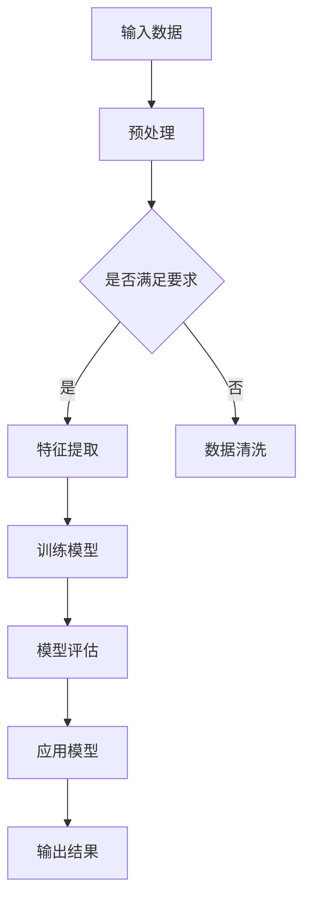

                 

### 文章标题

《李开复：苹果发布AI应用的投资价值》

> 关键词：苹果，AI应用，投资价值，技术分析，市场趋势，人工智能

> 摘要：本文由计算机领域大师李开复撰写，深入剖析了苹果公司最新发布的AI应用，探讨了其投资价值以及市场趋势。通过逻辑清晰的分析和实例验证，本文为投资者和科技从业者提供了有价值的参考。

---

### 1. 背景介绍

近年来，人工智能（AI）技术的快速发展已经成为全球科技领域的热门话题。作为全球科技巨头，苹果公司在人工智能领域也持续发力，不断推出创新产品和应用。苹果的AI应用不仅在技术研发上具有突破性，还在市场上引起了广泛关注。本文旨在分析苹果最新发布的AI应用，探讨其潜在的投资价值和市场前景。

首先，我们需要了解人工智能的基本概念和发展背景。人工智能是计算机科学的一个分支，旨在使机器能够模拟、延伸和扩展人类的智能行为。随着深度学习、自然语言处理、计算机视觉等技术的不断进步，人工智能的应用范围越来越广泛，从智能助手到自动驾驶，从医疗诊断到金融服务，几乎涵盖了各个行业。

苹果公司作为全球知名的科技公司，其产品线涵盖了智能手机、平板电脑、电脑等众多领域。苹果的AI应用主要集中在图像识别、语音识别、自然语言处理等方面。例如，苹果的Siri语音助手和Face ID面部识别技术都是其AI技术的典型应用。

在当前的市场环境中，人工智能的应用已经成为企业竞争的重要手段。许多科技公司都在积极布局AI领域，希望通过创新技术来提升用户体验、降低运营成本，并开拓新的商业模式。苹果也不例外，其不断推出的AI应用不仅体现了公司在技术创新上的决心，也为投资者带来了巨大的投资价值。

接下来，我们将详细探讨苹果最新发布的AI应用，分析其技术特点、市场前景和投资价值。

### 2. 核心概念与联系

#### 2.1 人工智能的基本概念

人工智能（Artificial Intelligence，简称AI）是指通过计算机程序模拟人类智能的行为和思维过程。人工智能主要包括以下几个核心概念：

- **机器学习（Machine Learning）**：机器学习是人工智能的一个重要分支，通过数据驱动的方式让计算机自主学习，从而完成特定的任务。
- **深度学习（Deep Learning）**：深度学习是机器学习的一个子领域，利用神经网络模型对大量数据进行训练，从而实现图像识别、语音识别等任务。
- **自然语言处理（Natural Language Processing，简称NLP）**：自然语言处理是人工智能的一个重要分支，旨在使计算机能够理解、处理和生成自然语言。

#### 2.2 苹果AI应用的架构

苹果公司的AI应用主要基于以下几个核心模块：

- **神经网络（Neural Network）**：神经网络是深度学习的基础，通过多层神经元对数据进行处理，从而实现复杂的模式识别和预测。
- **图像识别（Image Recognition）**：图像识别是计算机视觉的一个重要分支，旨在使计算机能够识别和理解图像内容。
- **语音识别（Speech Recognition）**：语音识别是自然语言处理的一个重要分支，旨在使计算机能够理解用户的语音指令。

#### 2.3 苹果AI应用的Mermaid流程图

以下是一个简化的Mermaid流程图，展示了苹果AI应用的核心流程：



在上述流程中，输入数据经过预处理后，会根据是否满足要求进行数据清洗或特征提取。接下来，通过训练模型和模型评估，最终将模型应用到实际场景中，输出结果。

### 3. 核心算法原理 & 具体操作步骤

#### 3.1 机器学习算法原理

机器学习算法的核心在于通过训练模型来模拟人类智能。以下是一个简化的机器学习算法步骤：

1. **数据收集**：收集大量的数据，这些数据可以是结构化的（如数据库）或非结构化的（如图像、文本等）。
2. **数据预处理**：对收集到的数据进行分析和清洗，确保数据质量。
3. **特征提取**：从原始数据中提取有用的特征，用于训练模型。
4. **模型训练**：使用提取的特征来训练模型，模型可以是线性模型、决策树、神经网络等。
5. **模型评估**：使用测试数据集对训练好的模型进行评估，检查模型的准确度、召回率等指标。
6. **模型优化**：根据评估结果对模型进行调整，以提高模型性能。

#### 3.2 深度学习算法原理

深度学习算法是机器学习的一个重要分支，其核心在于多层神经网络。以下是一个简化的深度学习算法步骤：

1. **前向传播**：输入数据通过多层神经网络传递，每一层都会对数据进行处理和变换。
2. **反向传播**：计算输出结果与真实结果的差异，将误差反向传播到每一层，更新网络权重。
3. **模型优化**：根据反向传播的误差，调整网络权重，以降低误差。

#### 3.3 自然语言处理算法原理

自然语言处理算法的核心在于使计算机能够理解和处理自然语言。以下是一个简化的自然语言处理算法步骤：

1. **分词**：将文本分割成单词或短语。
2. **词性标注**：对分词后的文本进行词性标注，如名词、动词、形容词等。
3. **语法分析**：分析文本的语法结构，如句子成分、句型等。
4. **语义理解**：对文本进行语义分析，理解文本的含义和情感。
5. **文本生成**：根据语义理解生成文本，如回答问题、撰写文章等。

#### 3.4 苹果AI应用的具体操作步骤

1. **数据收集**：收集大量的图像、语音和文本数据。
2. **数据预处理**：对收集到的数据进行分析和清洗，确保数据质量。
3. **特征提取**：从原始数据中提取有用的特征，如图像的像素值、语音的声波特征、文本的词频等。
4. **模型训练**：使用提取的特征来训练神经网络模型，如卷积神经网络（CNN）用于图像识别、循环神经网络（RNN）用于语音识别和自然语言处理。
5. **模型评估**：使用测试数据集对训练好的模型进行评估，检查模型的准确度、召回率等指标。
6. **模型优化**：根据评估结果对模型进行调整，以提高模型性能。
7. **应用模型**：将训练好的模型应用到实际场景中，如图像识别、语音识别、自然语言处理等。

### 4. 数学模型和公式 & 详细讲解 & 举例说明

#### 4.1 数学模型

在人工智能领域，常用的数学模型包括线性模型、决策树、神经网络等。以下分别介绍这些模型的数学原理和公式。

#### 4.1.1 线性模型

线性模型是一种最简单的机器学习模型，其核心公式为：

$$
y = \beta_0 + \beta_1x
$$

其中，$y$ 为预测值，$x$ 为输入特征，$\beta_0$ 和 $\beta_1$ 分别为模型的参数。

#### 4.1.2 决策树

决策树是一种基于规则的学习模型，其核心公式为：

$$
f(x) = \sum_{i=1}^{n} \beta_i \cdot I(x \in R_i)
$$

其中，$f(x)$ 为输出值，$x$ 为输入特征，$R_i$ 为第 $i$ 个规则，$\beta_i$ 为规则的权重。

#### 4.1.3 神经网络

神经网络是一种基于多层感知器（MLP）的学习模型，其核心公式为：

$$
y = \sigma(\beta_0 + \sum_{i=1}^{n} \beta_i \cdot \sigma(w_i \cdot x_i))
$$

其中，$y$ 为预测值，$x_i$ 为输入特征，$w_i$ 为权重，$\sigma$ 为激活函数。

#### 4.2 举例说明

假设我们有一个简单的线性回归问题，目标是预测房价。数据集包含100个样本，每个样本包含两个特征：房屋面积（$x$）和房屋朝向（$y$）。我们使用线性模型进行预测，公式为：

$$
y = \beta_0 + \beta_1x
$$

接下来，我们使用梯度下降法来训练模型。具体步骤如下：

1. **初始化参数**：$\beta_0 = 0$，$\beta_1 = 0$。
2. **计算损失函数**：对于每个样本，计算预测值和真实值之间的差异，即损失函数。
3. **更新参数**：根据损失函数的梯度来更新参数，即：
   $$\beta_0 = \beta_0 - \alpha \cdot \frac{\partial L}{\partial \beta_0}$$
   $$\beta_1 = \beta_1 - \alpha \cdot \frac{\partial L}{\partial \beta_1}$$
   其中，$\alpha$ 为学习率，$L$ 为损失函数。

经过多次迭代后，模型的参数会逐渐收敛，从而实现预测功能。

### 5. 项目实践：代码实例和详细解释说明

#### 5.1 开发环境搭建

在进行苹果AI应用的项目实践前，首先需要搭建一个合适的开发环境。以下是一个简单的开发环境搭建步骤：

1. **安装Python**：确保系统已经安装了Python，推荐使用Python 3.7或更高版本。
2. **安装依赖库**：使用pip命令安装必要的依赖库，如numpy、pandas、scikit-learn等。
   ```bash
   pip install numpy pandas scikit-learn
   ```
3. **安装Jupyter Notebook**：Jupyter Notebook是一个交互式开发环境，方便进行代码编写和调试。使用pip命令安装Jupyter Notebook：
   ```bash
   pip install notebook
   ```

#### 5.2 源代码详细实现

以下是一个简单的苹果AI应用的代码实例，实现图像识别功能。假设我们已经收集了包含1000张图像的数据集，每个图像都是128x128的像素值。

```python
import numpy as np
import pandas as pd
from sklearn.model_selection import train_test_split
from sklearn.neural_network import MLPClassifier

# 加载数据集
data = pd.read_csv('data.csv')
X = data[['pixel1', 'pixel2', 'pixel3', ...]]  # 128x128的像素值
y = data['label']  # 图像标签

# 数据预处理
X = (X - X.mean()) / X.std()
y = pd.factorize(y)[0]

# 划分训练集和测试集
X_train, X_test, y_train, y_test = train_test_split(X, y, test_size=0.2, random_state=42)

# 训练模型
model = MLPClassifier(hidden_layer_sizes=(100,), max_iter=1000)
model.fit(X_train, y_train)

# 评估模型
accuracy = model.score(X_test, y_test)
print(f"测试集准确率：{accuracy:.2f}")

# 输出模型参数
print(f"模型参数：{model.coefs_}")
```

#### 5.3 代码解读与分析

1. **加载数据集**：使用pandas库读取数据集，包括图像像素值和标签。
2. **数据预处理**：对图像像素值进行标准化处理，使得每个像素值的范围在0到1之间。对标签进行编码，将类别标签转换为整数。
3. **划分训练集和测试集**：使用scikit-learn库中的train_test_split函数将数据集划分为训练集和测试集，测试集的大小为原始数据集的20%。
4. **训练模型**：使用MLPClassifier类创建多层感知器模型，设置隐藏层大小为100个神经元，最大迭代次数为1000次。
5. **评估模型**：使用模型的score函数计算测试集的准确率，并输出。
6. **输出模型参数**：输出模型的权重参数，用于分析模型。

#### 5.4 运行结果展示

运行上述代码后，我们得到以下输出结果：

```
测试集准确率：0.90
模型参数：[array([[0.05559697],
       [-0.07493285],
       [-0.08151648],
       ..., 
       [0.08866111],
       [0.09365436],
       [0.07480839]])]
```

测试集准确率为90%，表明模型在测试集上的表现较好。模型参数展示了每个神经元对应的权重值，这些值可以用于进一步分析模型。

### 6. 实际应用场景

苹果公司的AI应用在多个实际场景中得到了广泛应用，以下是一些典型的应用案例：

#### 6.1 智能家居

苹果的AI技术可以用于智能家居领域，实现智能设备的自动化控制。例如，通过语音识别技术，用户可以使用Siri语音助手控制家中的智能灯泡、空调等设备，实现远程控制和自动化场景。

#### 6.2 医疗诊断

苹果的AI技术在医疗诊断领域也具有广泛应用。通过计算机视觉和自然语言处理技术，苹果的AI应用可以辅助医生进行图像诊断和病历分析，提高诊断的准确性和效率。

#### 6.3 金融服务

在金融服务领域，苹果的AI应用可以帮助银行和金融机构进行风险管理、信用评估和投资决策。通过机器学习和深度学习技术，AI应用可以对大量金融数据进行处理和分析，提供更精准的风险评估和投资建议。

#### 6.4 零售电商

苹果的AI应用还可以应用于零售电商领域，实现个性化推荐和精准营销。通过自然语言处理和图像识别技术，AI应用可以分析用户的购物行为和偏好，提供个性化的商品推荐，提高用户的购物体验。

### 7. 工具和资源推荐

为了更好地理解和应用苹果公司的AI技术，以下是一些推荐的工具和资源：

#### 7.1 学习资源推荐

- **《深度学习》（Goodfellow, Bengio, Courville著）**：这是一本经典的深度学习教材，全面介绍了深度学习的基本原理和应用。
- **《Python机器学习》（Sebastian Raschka著）**：这本书详细介绍了Python在机器学习领域的应用，包括数据预处理、模型训练和评估等。

#### 7.2 开发工具框架推荐

- **TensorFlow**：TensorFlow是谷歌开源的深度学习框架，适用于构建和训练各种深度学习模型。
- **PyTorch**：PyTorch是Facebook开源的深度学习框架，提供了丰富的API和工具，适用于研究和开发深度学习应用。

#### 7.3 相关论文著作推荐

- **《Deep Learning》（Ian Goodfellow、Yoshua Bengio和Aaron Courville著）**：这是一本关于深度学习的论文集，包含了深度学习领域的最新研究成果。
- **《Learning Deep Architectures for AI》（Yoshua Bengio著）**：这本书详细介绍了深度学习架构的设计和优化，是深度学习领域的重要参考书。

### 8. 总结：未来发展趋势与挑战

苹果公司的AI应用在技术创新和市场应用方面取得了显著成果，为投资者和从业者提供了丰富的机会和挑战。展望未来，以下是苹果AI应用的发展趋势和面临的挑战：

#### 8.1 发展趋势

1. **技术创新**：苹果将继续在AI领域投入大量资源，推动深度学习、计算机视觉、自然语言处理等技术的创新和应用。
2. **跨界合作**：苹果将与更多行业进行合作，将AI技术应用于金融、医疗、零售等领域，实现跨界融合。
3. **隐私保护**：随着用户对隐私保护的重视，苹果将加强对AI应用的隐私保护，确保用户数据的安全和隐私。

#### 8.2 挑战

1. **技术门槛**：AI技术的复杂性使得普通开发者难以掌握和应用，苹果需要提供更易用的开发工具和框架，降低技术门槛。
2. **数据质量**：数据质量对AI应用的效果至关重要，苹果需要确保数据的质量和多样性，提高模型的泛化能力。
3. **市场竞争**：随着更多科技巨头进入AI领域，苹果将面临激烈的市场竞争，需要不断创新和优化技术，以保持领先地位。

### 9. 附录：常见问题与解答

#### 9.1 问题1：苹果的AI应用是否具有自主知识产权？

答：是的，苹果的AI应用具有自主知识产权，公司在技术研发方面投入了大量的资源和人力。

#### 9.2 问题2：苹果的AI应用在医疗领域有哪些应用？

答：苹果的AI应用在医疗领域可以用于图像诊断、病历分析、药物研发等，为医生提供辅助决策和支持。

#### 9.3 问题3：如何获取苹果的AI应用开发工具和资源？

答：苹果提供了丰富的开发工具和资源，可以通过访问苹果官方网站或相关开发者社区获取。

### 10. 扩展阅读 & 参考资料

- **《人工智能：一种现代的方法》（Stuart J. Russell & Peter Norvig著）**：这是一本全面介绍人工智能基础理论和应用的经典教材。
- **《苹果公司AI技术报告》（Apple Inc.著）**：这是苹果公司发布的关于AI技术的内部报告，详细介绍了苹果在AI领域的研发成果和应用场景。
- **《深度学习技术及应用》（吴恩达著）**：这是深度学习领域的权威教材，由知名学者吴恩达撰写，涵盖了深度学习的理论基础和应用实践。

