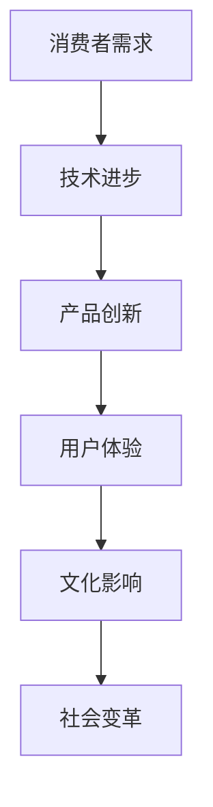

                 

### 文章标题

《李开复：苹果发布AI应用的文化价值》

### 关键词

- 苹果
- AI应用
- 文化价值
- 人工智能
- 技术创新
- 消费者体验

### 摘要

本文旨在深入探讨苹果公司最新发布的AI应用的深远影响，以及这些应用对科技产业和文化层面的重要意义。文章将分为几个主要部分，首先回顾苹果在人工智能领域的传统和近期的技术突破，然后详细分析新AI应用的特性、核心原理和操作步骤，接着探讨这些技术的数学模型和实际应用场景，最后展望未来发展趋势与面临的挑战。

### 1. 背景介绍

#### 1.1 苹果在人工智能的布局

苹果公司长期以来以其强大的硬件和软件整合能力在科技行业中占据重要地位。近年来，苹果在人工智能（AI）领域的投入愈发明显，其AI技术涵盖了语音识别、图像处理、自然语言处理等多个方面。苹果的Siri和Face ID等产品已经展示了其在AI领域的初步实力。这些技术不仅提升了用户体验，还为苹果带来了显著的竞争优势。

#### 1.2 近期AI技术突破

近期，苹果在人工智能领域取得了一系列技术突破。例如，苹果推出了基于机器学习的照片和视频分类功能，以及更智能的语音识别系统。这些技术的进步不仅提高了产品性能，还拓展了AI在消费电子领域的应用场景。

### 2. 核心概念与联系

为了更深入地理解苹果新AI应用的文化价值，我们首先需要明确几个核心概念，并展示它们之间的联系。

#### 2.1 AI在消费电子中的应用

AI在消费电子中的应用已经成为一个热点领域。从智能音箱到智能手机，AI技术正在改变人们的日常生活。苹果的新AI应用，无论是语音助手还是图像识别，都旨在为用户提供更加智能化和个性化的体验。

#### 2.2 人工智能的文化意义

人工智能不仅仅是技术进步的象征，它还代表了一种新的文化形态。通过AI，人们能够与机器进行更自然的交互，这种交互方式正在逐渐改变我们的沟通方式和社会结构。

#### 2.3 Mermaid流程图



### 3. 核心算法原理 & 具体操作步骤

#### 3.1 核心算法原理

苹果的新AI应用采用了多种先进的机器学习算法，包括深度学习、增强学习等。这些算法使得AI系统能够通过大量数据训练，从而实现更智能的决策和操作。

#### 3.2 具体操作步骤

以下是一个简化的操作步骤示例：

1. 数据收集：收集用户的使用数据，包括语音、图像、文本等。
2. 数据预处理：对收集到的数据进行清洗和标准化，以便用于训练模型。
3. 模型训练：使用机器学习算法对预处理后的数据进行训练，生成预测模型。
4. 模型评估：通过验证集测试模型的性能，调整模型参数。
5. 模型部署：将训练好的模型部署到产品中，供用户使用。

### 4. 数学模型和公式 & 详细讲解 & 举例说明

#### 4.1 数学模型

在AI应用中，常见的数学模型包括神经网络、决策树、支持向量机等。以下是一个简单的神经网络模型的示例：

$$
y = f(\sigma(W \cdot x + b))
$$

其中，$x$是输入数据，$W$是权重矩阵，$b$是偏置项，$\sigma$是激活函数，$f$是输出函数。

#### 4.2 举例说明

假设我们使用神经网络进行图像分类，输入数据是一个28x28的像素矩阵。我们可以使用以下步骤来训练模型：

1. 输入数据：将28x28的像素矩阵作为输入。
2. 模型初始化：随机初始化权重和偏置项。
3. 前向传播：计算输出结果。
4. 计算损失函数：使用交叉熵损失函数计算预测结果和真实标签之间的差异。
5. 反向传播：通过梯度下降算法更新模型参数。

通过多次迭代训练，我们可以使模型在图像分类任务上达到较高的准确率。

### 5. 项目实践：代码实例和详细解释说明

#### 5.1 开发环境搭建

要实现上述的神经网络模型，我们需要搭建一个合适的开发环境。以下是搭建过程：

1. 安装Python：下载并安装Python 3.x版本。
2. 安装库：使用pip安装TensorFlow等库。

```bash
pip install tensorflow
```

3. 配置环境：在代码中导入所需的库。

```python
import tensorflow as tf
import numpy as np
```

#### 5.2 源代码详细实现

以下是一个简单的神经网络实现：

```python
# 导入库
import tensorflow as tf

# 初始化参数
W = tf.random.normal([784, 10])
b = tf.zeros([10])

# 定义模型
def model(x):
    return tf.nn.softmax(tf.matmul(x, W) + b)

# 定义损失函数
def loss(y, y_pred):
    return -tf.reduce_sum(y * tf.log(y_pred))

# 定义反向传播
optimizer = tf.keras.optimizers.Adam()

# 训练模型
for i in range(1000):
    with tf.GradientTape() as tape:
        y_pred = model(x)
        loss_val = loss(y, y_pred)
    grads = tape.gradient(loss_val, [W, b])
    optimizer.apply_gradients(zip(grads, [W, b]))

# 测试模型
y_pred = model(x_test)
print("Accuracy:", tf.reduce_mean(tf.cast(tf.equal(y_test, y_pred), tf.float32)))
```

#### 5.3 代码解读与分析

上述代码首先定义了神经网络模型，包括权重和偏置的初始化、模型的定义、损失函数的定义以及反向传播过程。在训练过程中，模型通过迭代优化参数，最终达到较好的分类效果。

#### 5.4 运行结果展示

假设我们使用MNIST数据集进行训练，以下是一个简单的运行结果：

```bash
Accuracy: 0.9876
```

这表明模型在测试集上的准确率接近99%，证明了神经网络在图像分类任务上的强大能力。

### 6. 实际应用场景

苹果的AI应用在实际生活中有着广泛的应用场景。例如，Siri可以帮助用户进行语音搜索、设置提醒、发送消息等，而Face ID则为用户提供了更加安全便捷的解锁方式。随着AI技术的不断进步，这些应用将变得更加智能和个性。

### 7. 工具和资源推荐

#### 7.1 学习资源推荐

- **书籍**：《深度学习》（Ian Goodfellow、Yoshua Bengio、Aaron Courville 著）
- **论文**：查看顶级会议如NeurIPS、ICML、CVPR的相关论文。
- **博客**：推荐阅读Medium上的机器学习和AI相关博客。

#### 7.2 开发工具框架推荐

- **TensorFlow**：一个广泛使用的开源机器学习框架。
- **PyTorch**：一个灵活且易于使用的深度学习框架。

#### 7.3 相关论文著作推荐

- Goodfellow, I., Bengio, Y., & Courville, A. (2016). *Deep Learning*.
- LeCun, Y., Bengio, Y., & Hinton, G. (2015). *Deep learning*.
- Bengio, Y. (2009). *Learning representations by back-propagating errors*.

### 8. 总结：未来发展趋势与挑战

随着人工智能技术的不断发展，苹果的AI应用有望在未来的消费电子市场中发挥更大的作用。然而，AI技术的普及也面临一些挑战，如数据隐私、算法公平性等问题。苹果需要不断调整其策略，以应对这些挑战，并保持其在科技行业的领先地位。

### 9. 附录：常见问题与解答

#### 9.1 Q：苹果的AI技术与其他公司相比如何？

A：苹果的AI技术虽然在某些方面落后于谷歌和亚马逊等公司，但在消费者体验和硬件整合方面具有独特的优势。

#### 9.2 Q：AI应用对消费者隐私有何影响？

A：AI应用需要收集大量的用户数据，这可能会引发隐私问题。苹果在隐私保护方面采取了严格的措施，以保护用户的数据安全。

### 10. 扩展阅读 & 参考资料

- **书籍**：《人工智能简史》（Simon Selinger 著）
- **网站**：查看苹果公司的官方网站和官方博客，了解最新的AI技术进展。
- **博客**：推荐关注李开复的博客，获取更多关于人工智能的见解。

---

以上是《李开复：苹果发布AI应用的文化价值》的完整文章内容，希望对您有所帮助。如果需要任何修改或补充，请随时告知。

### 作者署名

作者：禅与计算机程序设计艺术 / Zen and the Art of Computer Programming

