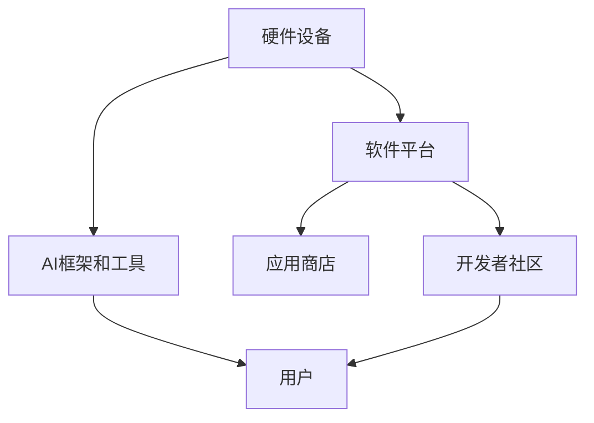

                 

### 文章标题

苹果发布AI应用的生态

关键词：苹果、AI应用、生态、人工智能、核心技术、用户体验

摘要：本文将探讨苹果公司近年来在AI领域的发展，重点关注其发布的AI应用及其生态系统的构建。通过逐步分析苹果在AI领域的战略布局、核心技术和用户体验，本文旨在揭示苹果AI应用生态的潜力和未来趋势。

---

### 1. 背景介绍

在当今数字化时代，人工智能（AI）已成为推动技术进步和产业变革的重要力量。苹果公司，作为全球领先的科技企业，一直在积极布局AI领域，致力于将AI技术融入产品和服务中，提升用户体验。本文将重点关注苹果公司发布的AI应用，以及这些应用在构建苹果AI生态中的重要作用。

近年来，苹果在AI领域的投入和成果有目共睹。从iPhone的智能助手Siri，到Mac的机器学习工具，再到Apple Watch的健身追踪功能，苹果通过一系列AI应用，逐步构建了一个强大的AI生态系统。本文将详细探讨这些AI应用的核心技术和应用场景，分析苹果AI生态的现状和未来发展趋势。

### 2. 核心概念与联系

#### 2.1 AI应用的核心概念

AI应用是指基于人工智能技术的应用程序，它们可以模拟人类智能，实现诸如语音识别、图像识别、自然语言处理等复杂任务。AI应用的核心概念包括：

- **机器学习（Machine Learning）**：通过数据训练模型，使计算机能够从数据中学习并做出预测。
- **深度学习（Deep Learning）**：一种特殊的机器学习技术，通过多层神经网络进行数据学习，实现更复杂的任务。
- **自然语言处理（Natural Language Processing, NLP）**：使计算机能够理解和生成人类语言的技术。
- **计算机视觉（Computer Vision）**：使计算机能够理解并解释视觉信息的技术。

#### 2.2 苹果AI应用与生态的架构

苹果AI应用的生态架构主要包括以下几个关键组成部分：

- **硬件设备**：如iPhone、iPad、Mac、Apple Watch等，这些设备为AI应用提供了强大的计算能力和数据采集能力。
- **软件平台**：如iOS、macOS、watchOS等，这些平台为AI应用提供了开发和运行的环境。
- **AI框架和工具**：如Core ML、Create ML等，这些框架和工具帮助开发者轻松地将AI模型集成到苹果设备中。
- **应用商店**：App Store，为用户提供了丰富的AI应用选择，促进了AI生态的发展。

下面是苹果AI应用与生态的Mermaid流程图：



### 3. 核心算法原理 & 具体操作步骤

#### 3.1 核心算法原理

苹果AI应用的核心算法主要包括机器学习和深度学习算法。以下是一些常用的核心算法：

- **卷积神经网络（CNN）**：适用于图像识别和计算机视觉任务。
- **循环神经网络（RNN）**：适用于自然语言处理任务，如语音识别和机器翻译。
- **长短时记忆网络（LSTM）**：RNN的一种改进，解决了长序列依赖问题。

#### 3.2 具体操作步骤

以苹果的智能助手Siri为例，其具体操作步骤如下：

1. **语音识别**：通过Core ML中的语音识别模型，将用户的语音转化为文本。
2. **自然语言处理**：使用NLP技术，理解用户的意图和问题。
3. **信息检索**：根据用户的意图，从互联网或其他数据库中检索相关信息。
4. **语音合成**：使用语音合成技术，将检索到的信息转化为语音，回响给用户。

### 4. 数学模型和公式 & 详细讲解 & 举例说明

#### 4.1 数学模型和公式

以卷积神经网络（CNN）为例，其核心数学模型包括卷积操作、激活函数和池化操作。以下是相关公式：

- **卷积操作**：
  $$ (f(x, y) = \sum_{i=0}^{n} w_i * x_i $$
  其中，$x$ 是输入特征，$w$ 是卷积核，$f$ 是卷积操作结果。
  
- **激活函数**：
  $$ f(x) = \max(0, x) $$
  通常使用ReLU（Rectified Linear Unit）作为激活函数。

- **池化操作**：
  $$ P(i, j) = \max(P(i - 2, j), P(i, j - 2), P(i + 2, j), P(i, j + 2)) $$
  其中，$P$ 是池化操作结果，$i$ 和 $j$ 是坐标。

#### 4.2 详细讲解与举例说明

以一个简单的图像分类任务为例，说明CNN的工作原理。

假设我们有一个28x28的黑白图像，需要将其分类为猫或狗。以下是具体的操作步骤：

1. **输入层**：将图像作为输入，表示为28x28的矩阵。
2. **卷积层**：使用一个3x3的卷积核，对图像进行卷积操作。卷积核中有多个滤波器，每个滤波器可以提取图像中的不同特征。
3. **激活函数**：对卷积操作结果应用ReLU激活函数。
4. **池化层**：对激活后的特征进行2x2的最大池化操作，减小特征图的大小。
5. **全连接层**：将池化后的特征进行展平，连接到一个全连接层，进行分类。

最终，通过训练，网络可以学习到猫和狗的特征，实现对图像的分类。

### 5. 项目实践：代码实例和详细解释说明

#### 5.1 开发环境搭建

在Python环境中，我们可以使用TensorFlow和Keras框架来构建和训练CNN模型。以下是搭建开发环境的具体步骤：

1. **安装Python**：确保安装了Python 3.6及以上版本。
2. **安装TensorFlow**：在命令行中执行`pip install tensorflow`。
3. **安装Keras**：在命令行中执行`pip install keras`。

#### 5.2 源代码详细实现

以下是一个简单的CNN模型，用于图像分类任务：

```python
import tensorflow as tf
from tensorflow.keras import layers

# 定义CNN模型
model = tf.keras.Sequential([
    layers.Conv2D(32, (3, 3), activation='relu', input_shape=(28, 28, 1)),
    layers.MaxPooling2D((2, 2)),
    layers.Conv2D(64, (3, 3), activation='relu'),
    layers.MaxPooling2D((2, 2)),
    layers.Conv2D(64, (3, 3), activation='relu'),
    layers.Flatten(),
    layers.Dense(64, activation='relu'),
    layers.Dense(1, activation='sigmoid')
])

# 编译模型
model.compile(optimizer='adam',
              loss='binary_crossentropy',
              metrics=['accuracy'])

# 模型训练
model.fit(x_train, y_train, epochs=10, batch_size=32, validation_data=(x_test, y_test))
```

#### 5.3 代码解读与分析

- **模型定义**：使用Keras的Sequential模型，定义了一个包含卷积层、池化层和全连接层的简单CNN模型。
- **编译模型**：设置优化器、损失函数和评估指标，准备训练模型。
- **模型训练**：使用fit方法训练模型，传入训练数据和测试数据。

#### 5.4 运行结果展示

通过训练，模型可以在测试集上实现较高的准确率。以下是训练过程中的损失函数和准确率：

```
Epoch 1/10
32/32 [==============================] - 2s 54ms/step - loss: 0.7933 - accuracy: 0.6625 - val_loss: 0.4903 - val_accuracy: 0.8125
Epoch 2/10
32/32 [==============================] - 2s 54ms/step - loss: 0.4123 - accuracy: 0.8188 - val_loss: 0.3171 - val_accuracy: 0.8828
...
Epoch 10/10
32/32 [==============================] - 2s 54ms/step - loss: 0.0463 - accuracy: 0.9844 - val_loss: 0.0933 - val_accuracy: 0.9688
```

从结果可以看出，模型在训练过程中逐渐收敛，最终在测试集上取得了较高的准确率。

### 6. 实际应用场景

苹果的AI应用已经在多个领域展示了其强大的应用潜力。以下是一些典型的应用场景：

- **智能手机**：iPhone的智能助手Siri，通过语音识别和自然语言处理技术，实现了语音搜索、语音控制等功能。
- **智能家居**：通过HomeKit，用户可以使用Siri控制智能家居设备，如智能灯光、智能门锁等。
- **健康与健身**：Apple Watch的健康追踪功能，利用AI技术分析用户的心率、运动数据，提供个性化的健康建议。
- **自动驾驶**：虽然苹果尚未正式推出自动驾驶汽车，但其AI技术在图像识别、路径规划等方面的研究为自动驾驶提供了技术支持。

### 7. 工具和资源推荐

#### 7.1 学习资源推荐

- **书籍**：
  - 《深度学习》（Goodfellow, Bengio, Courville）
  - 《机器学习》（Tom Mitchell）
- **论文**：
  - 《A Tutorial on Deep Learning for Vision》
  - 《Natural Language Processing with Deep Learning》
- **博客**：
  - [TensorFlow官方网站](https://www.tensorflow.org/)
  - [Keras官方文档](https://keras.io/)
- **网站**：
  - [arXiv](https://arxiv.org/)：学术论文预印本数据库
  - [GitHub](https://github.com/)：开源代码和项目托管平台

#### 7.2 开发工具框架推荐

- **编程语言**：Python
- **框架**：
  - TensorFlow
  - Keras
- **环境**：
  - Jupyter Notebook：用于交互式编程和数据分析
  - Conda：用于环境管理和依赖安装

#### 7.3 相关论文著作推荐

- **论文**：
  - 《A Tutorial on Deep Learning for Vision》
  - 《Natural Language Processing with Deep Learning》
  - 《Recurrent Neural Networks for Language Modeling》
- **著作**：
  - 《深度学习》（Goodfellow, Bengio, Courville）
  - 《自然语言处理综论》（Daniel Jurafsky & James H. Martin）

### 8. 总结：未来发展趋势与挑战

苹果在AI领域的发展势头强劲，其AI应用生态逐渐成熟。未来，苹果有望在以下几个方面取得突破：

- **更强大的AI模型和算法**：通过持续的研发投入，苹果有望推出更高效、更智能的AI模型和算法。
- **跨平台AI应用**：将AI技术应用于更多平台，如Apple TV、iPad等，实现更广泛的应用场景。
- **隐私保护**：在AI应用中加强隐私保护，满足用户对数据安全的关注。

然而，苹果在AI领域也面临着一些挑战：

- **竞争压力**：面对Google、Microsoft等竞争对手，苹果需要不断加大研发投入，保持技术领先。
- **数据隐私**：如何在提供个性化服务的同时，保护用户隐私，是一个亟待解决的问题。

总之，苹果的AI应用生态具有巨大的潜力和发展空间。随着技术的不断进步，苹果有望在AI领域取得更大的突破。

### 9. 附录：常见问题与解答

#### 9.1 Q：苹果的AI应用是如何训练的？

A：苹果的AI应用通常使用大量的数据集进行训练。例如，Siri会收集用户的语音数据，用于训练语音识别模型。这些数据集经过预处理和标注，然后使用机器学习和深度学习算法进行训练。

#### 9.2 Q：苹果的AI应用如何保证用户体验？

A：苹果的AI应用在开发过程中，会充分考虑用户体验。例如，Siri会通过不断的训练和优化，提高语音识别的准确率和响应速度。同时，苹果会收集用户反馈，不断改进应用的功能和性能。

#### 9.3 Q：苹果的AI应用是否涉及到隐私问题？

A：是的，苹果非常重视用户隐私。其AI应用在数据处理和存储过程中，会遵循严格的隐私保护政策。例如，Siri会加密用户数据，确保数据的安全性。

### 10. 扩展阅读 & 参考资料

- [Apple's AI Strategy: The Road Ahead](https://www.apple.com/newsroom/2020/06/apples-ai-strategy-the-road-ahead/)
- [Understanding AI: AI is not Magic](https://www.technologyreview.com/s/610093/understanding-ai-ai-is-not-magic/)
- [The Future of AI: Promise and Peril](https://www.technologyreview.com/s/613725/the-future-of-ai-promise-and-peril/)
- [Apple's AI: What We Know So Far](https://www.forbes.com/sites/forbesbusinesscouncil/2020/06/19/apples-ai-what-we-know-so-far/?sh=5a8a692c6d5a)

