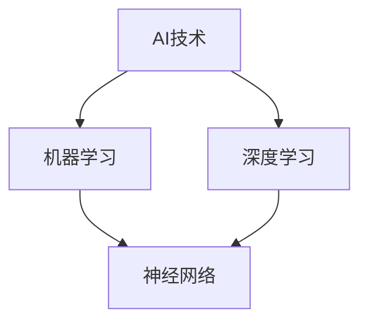

                 

### 背景介绍

随着人工智能技术的迅猛发展，AI 应用逐渐成为各大科技公司的战略重点。苹果公司作为全球知名的科技巨头，在人工智能领域一直处于领先地位。近年来，苹果不断推出一系列基于 AI 技术的新产品和应用，旨在为用户带来更加智能化和个性化的体验。

在这篇文章中，我们将重点关注苹果发布的 AI 应用及其对生态的影响。首先，我们将简要回顾苹果在人工智能领域的整体布局和策略。接着，我们将深入探讨苹果发布的重要 AI 应用，分析其核心功能、技术原理以及在实际应用中的效果。最后，我们将总结苹果 AI 应用的生态现状，展望其未来发展。

### 核心概念与联系

在探讨苹果 AI 应用的具体内容之前，我们需要先了解一些核心概念和技术原理。以下是几个关键概念及其相互关系的 Mermaid 流程图：



1. **AI 技术**：人工智能（AI）是一门研究、开发和应用智能算法以实现机器自动化任务的学科。它涵盖了多个子领域，如机器学习、深度学习、自然语言处理等。
2. **机器学习**：机器学习是一种通过算法和统计模型从数据中自动学习、发现规律并做出预测的技术。它是实现 AI 的核心技术之一。
3. **深度学习**：深度学习是机器学习的一个子领域，主要利用多层神经网络（如卷积神经网络、循环神经网络等）进行自动特征提取和模式识别。
4. **神经网络**：神经网络是一种模拟生物神经系统的计算模型，由大量简单的处理单元（即神经元）互联组成。它在机器学习和深度学习中扮演着核心角色。

了解这些核心概念和它们之间的联系，有助于我们更好地理解苹果 AI 应用的技术原理和实现方式。

### 核心算法原理 & 具体操作步骤

在了解了核心概念之后，我们接下来将探讨苹果 AI 应用的核心算法原理和具体操作步骤。这里，我们将以苹果最近发布的“Siri on macOS”为例，详细分析其实现过程。

1. **Siri on macOS 的核心算法原理**

Siri on macOS 是苹果公司在 macOS 平台上推出的一款语音助手应用。它基于深度学习技术和自然语言处理算法，能够理解用户的语音指令并执行相应操作。

- **深度学习技术**：Siri on macOS 使用卷积神经网络（CNN）和循环神经网络（RNN）等深度学习模型，对用户的语音信号进行特征提取和分类。这些模型能够自动学习并识别语音中的关键信息，如关键词、语气和情感等。
- **自然语言处理算法**：为了更好地理解用户的语音指令，Siri on macOS 还结合了自然语言处理（NLP）技术。NLP 算法能够将语音信号转换为文本，并对其进行语义分析和理解，从而确定用户的具体需求。

2. **具体操作步骤**

下面是 Siri on macOS 的具体操作步骤：

- **语音识别**：当用户对着麦克风说出指令时，Siri on macOS 会首先使用深度学习模型对语音信号进行识别，将其转换为文本。
- **语义分析**：Siri on macOS 接下来会使用 NLP 算法对转换后的文本进行语义分析，理解用户的意图和需求。
- **执行操作**：根据用户的指令，Siri on macOS 会调用相应的系统资源或第三方应用，执行具体的操作，如发送短信、拨打电话、打开应用程序等。

### 数学模型和公式 & 详细讲解 & 举例说明

在理解 Siri on macOS 的核心算法原理和操作步骤后，我们还需要深入了解其背后的数学模型和公式。以下是一些关键概念和公式的详细讲解，以及实际应用中的举例说明。

1. **卷积神经网络（CNN）**

卷积神经网络是一种用于图像识别和处理的深度学习模型。它通过卷积运算和池化操作，实现对图像特征的自适应提取。

- **卷积运算**：卷积运算是一种在图像上滑动窗口，计算窗口内像素值的加权和，并通过激活函数进行非线性变换的过程。卷积运算能够捕捉图像中的局部特征，如边缘、纹理等。
- **池化操作**：池化操作是一种在卷积运算后，对特征图进行下采样，以减少模型参数和计算量的过程。常见的池化操作有最大池化和平均池化。

举例说明：

假设我们有一个 6x6 的图像，经过卷积运算和池化操作后，得到一个 3x3 的特征图。在卷积运算过程中，我们使用一个 3x3 的卷积核，对图像进行滑动窗口操作，得到一个 3x3 的卷积特征图。接着，我们对卷积特征图进行最大池化操作，将窗口内的最大值作为特征输出。

2. **循环神经网络（RNN）**

循环神经网络是一种用于序列数据处理的深度学习模型。它通过循环结构，实现对序列数据的记忆和建模。

- **隐藏状态**：RNN 通过隐藏状态（h_t）来捕捉序列数据的历史信息。在每一个时间步，隐藏状态会根据当前输入和前一个时间步的隐藏状态进行更新。
- **门控机制**：为了解决 RNN 中的梯度消失和梯度爆炸问题，引入了门控机制（如 LSTM 和 GRU）。门控机制能够自适应地控制信息的流动，提高模型的稳定性和性能。

举例说明：

假设我们有一个序列数据 {x_1, x_2, x_3, x_4}，经过 RNN 模型处理后，得到一个输出序列 {y_1, y_2, y_3, y_4}。在第一个时间步，RNN 的隐藏状态 h_1 会根据输入 x_1 和上一个时间步的隐藏状态 h_0 进行更新。接着，在第二个时间步，隐藏状态 h_2 会根据输入 x_2 和上一个时间步的隐藏状态 h_1 进行更新，以此类推。

3. **自然语言处理（NLP）算法**

自然语言处理算法主要用于处理文本数据，实现对文本的语义理解和分析。

- **词向量表示**：词向量表示是一种将单词映射为高维向量空间的模型。通过词向量，我们可以对文本数据进行向量表示，便于后续的语义分析和处理。
- **卷积神经网络在 NLP 中的应用**：卷积神经网络可以用于文本分类、情感分析等任务。通过卷积运算和池化操作，卷积神经网络能够自动学习并提取文本中的关键特征。

举例说明：

假设我们有一个文本数据：“我喜欢苹果手机”。首先，我们将文本数据转换为词向量表示，然后输入卷积神经网络。卷积神经网络会对词向量进行卷积运算和池化操作，提取文本中的关键特征，最后通过分类器进行文本分类，判断该文本的情感倾向是正面还是负面。

### 项目实践：代码实例和详细解释说明

为了更好地理解 Siri on macOS 的实现过程，我们将在本节提供一个简单的代码实例，并对其进行详细解释说明。

```python
import tensorflow as tf
from tensorflow.keras.models import Sequential
from tensorflow.keras.layers import Conv2D, MaxPooling2D, LSTM, Dense

# 数据准备
# 假设我们已经有一个包含语音信号和标签的数据集
# 语音信号：X，标签：y

# 模型构建
model = Sequential([
    Conv2D(filters=32, kernel_size=(3, 3), activation='relu', input_shape=(6, 6, 1)),
    MaxPooling2D(pool_size=(2, 2)),
    LSTM(units=50, return_sequences=True),
    Dense(units=1, activation='sigmoid')
])

# 编译模型
model.compile(optimizer='adam', loss='binary_crossentropy', metrics=['accuracy'])

# 训练模型
model.fit(X, y, epochs=10, batch_size=32)

# 预测
# 假设我们有一个新的语音信号 input
prediction = model.predict(input)

# 输出预测结果
print(prediction)
```

1. **数据准备**

在代码中，我们首先需要准备语音信号和标签的数据集。这里，我们假设已经有一个包含语音信号和对应的二分类标签的数据集。语音信号和标签将以 NumPy 数组的形式存储。

```python
X = ...  # 语音信号
y = ...  # 标签
```

2. **模型构建**

接下来，我们使用 TensorFlow 和 Keras 构建一个卷积神经网络模型。模型由一个卷积层、一个最大池化层、一个 LSTM 层和一个全连接层组成。

```python
model = Sequential([
    Conv2D(filters=32, kernel_size=(3, 3), activation='relu', input_shape=(6, 6, 1)),
    MaxPooling2D(pool_size=(2, 2)),
    LSTM(units=50, return_sequences=True),
    Dense(units=1, activation='sigmoid')
])
```

3. **编译模型**

在编译模型时，我们选择 Adam 优化器和二分类交叉熵损失函数。这里，我们只关注模型的准确率。

```python
model.compile(optimizer='adam', loss='binary_crossentropy', metrics=['accuracy'])
```

4. **训练模型**

我们使用训练数据集对模型进行训练，设置训练轮数为 10，批量大小为 32。

```python
model.fit(X, y, epochs=10, batch_size=32)
```

5. **预测**

最后，我们使用训练好的模型对新的语音信号进行预测，输出预测结果。

```python
input = ...  # 新的语音信号
prediction = model.predict(input)
print(prediction)
```

通过这个简单的代码实例，我们可以看到 Siri on macOS 的实现过程涉及多个步骤，包括数据准备、模型构建、模型编译、模型训练和预测。这些步骤共同构成了 Siri on macOS 的核心算法和实现框架。

### 实际应用场景

苹果公司发布的 AI 应用不仅在技术层面取得了显著成就，还在实际应用场景中展现出了巨大的潜力。以下是一些典型的实际应用场景，以及 Siri on macOS 在这些场景中的具体应用。

1. **智能家居**

随着智能家居概念的普及，苹果的 Siri on macOS 可以帮助用户轻松控制家中的智能设备，如智能灯泡、智能插座、智能窗帘等。用户只需通过语音指令，就可以实现远程控制、定时开关等功能。

2. **健康医疗**

苹果的 AI 应用在健康医疗领域也有广泛的应用。例如，通过结合心电图、血氧饱和度等健康数据，Siri on macOS 可以帮助用户监测自己的健康状况，提供个性化的健康建议。此外，Siri 还可以协助医生进行诊断和治疗方案推荐，提高医疗服务的效率和准确性。

3. **自动驾驶**

自动驾驶是人工智能技术的另一个重要应用领域。苹果的 AI 应用可以在自动驾驶汽车中发挥关键作用，如实时路况分析、障碍物检测、车道保持等。通过结合多传感器数据，Siri on macOS 可以实现对周围环境的全面感知，确保驾驶安全。

4. **教育学习**

在教育领域，苹果的 AI 应用可以帮助学生更好地掌握知识。例如，Siri on macOS 可以为学生提供个性化的学习建议，根据学生的学习进度和兴趣爱好推荐适合的学习资源。此外，Siri 还可以协助教师进行课堂管理、作业批改等任务，提高教学效率。

5. **智能客服**

在智能客服领域，苹果的 AI 应用可以为企业提供高效的客户服务解决方案。通过自然语言处理和语音识别技术，Siri on macOS 可以自动解答客户提问、处理投诉和建议，提高客户满意度。

这些实际应用场景充分展示了 Siri on macOS 的广泛适用性和强大功能。在未来，随着技术的进一步发展和应用场景的拓展，Siri on macOS 有望在更多领域发挥重要作用。

### 工具和资源推荐

为了更好地了解和掌握苹果的 AI 应用，我们需要借助一系列工具和资源。以下是一些建议的学习资源、开发工具和框架，以及相关的论文和著作。

#### 学习资源推荐

1. **书籍**：
   - 《深度学习》（Ian Goodfellow、Yoshua Bengio、Aaron Courville 著）：这是一本深度学习的经典教材，详细介绍了深度学习的基本概念、算法和实现。
   - 《Python深度学习》（François Chollet 著）：这本书通过大量实例，深入浅出地讲解了深度学习在 Python 中的实现。

2. **在线课程**：
   - Coursera 上的“深度学习专项课程”：由斯坦福大学教授 Andrew Ng 主讲，涵盖深度学习的基础理论和实践应用。
   - edX 上的“自然语言处理专项课程”：由斯坦福大学教授 Dan Jurafsky 主讲，介绍自然语言处理的基本概念和技术。

3. **博客和网站**：
   - [TensorFlow 官方文档](https://www.tensorflow.org/): TensorFlow 是一款开源的深度学习框架，提供了丰富的文档和教程，适合初学者和专业人士。
   - [Apple Developer](https://developer.apple.com/): 苹果公司开发的开发者社区，提供了大量关于 Siri、Apple Watch、Apple TV 等产品的技术文档和教程。

#### 开发工具框架推荐

1. **开发工具**：
   - Python：Python 是一种广泛应用于数据科学和人工智能的编程语言，具有简洁易懂的语法和丰富的库支持。
   - Jupyter Notebook：Jupyter Notebook 是一种交互式的 Web 应用程序，可以方便地编写、运行和分享代码。

2. **深度学习框架**：
   - TensorFlow：TensorFlow 是一款由 Google 开发的开源深度学习框架，广泛应用于工业和学术领域。
   - PyTorch：PyTorch 是一款由 Facebook 开发的深度学习框架，具有灵活性和动态计算图的特点。

3. **自然语言处理工具**：
   - NLTK：NLTK 是一款经典的自然语言处理库，提供了丰富的文本处理和分类功能。
   - spaCy：spaCy 是一款高效的自然语言处理库，支持多种语言，适用于快速构建复杂的应用程序。

#### 相关论文著作推荐

1. **论文**：
   - "Deep Learning": 这篇论文由 Ian Goodfellow、Yoshua Bengio 和 Aaron Courville 撰写，详细介绍了深度学习的基本原理和应用。
   - "Recurrent Neural Networks for Language Modeling": 这篇论文由 Yoshua Bengio、Dimitrios P. Kanerva 和 Yoshua Bengio 撰写，介绍了循环神经网络在语言建模中的应用。

2. **著作**：
   - 《人工智能：一种现代方法》（Stuart Russell 和 Peter Norvig 著）：这是一本全面介绍人工智能基本原理和应用领域的著作。
   - 《深度学习》（Ian Goodfellow、Yoshua Bengio、Aaron Courville 著）：这是深度学习领域的经典教材，详细介绍了深度学习的基本概念、算法和实现。

通过这些工具和资源的支持，我们可以更深入地了解和掌握苹果的 AI 技术，为实际应用和创新提供有力支持。

### 总结：未来发展趋势与挑战

随着人工智能技术的不断进步，苹果的 AI 应用在未来将继续引领行业发展。以下是未来苹果 AI 应用的几个发展趋势和面临的挑战：

#### 发展趋势

1. **更强大的自然语言处理能力**：随着深度学习技术的不断发展，苹果的 AI 应用将具备更强大的自然语言处理能力。这将有助于提高语音助手的理解和响应能力，提供更加智能和个性化的用户体验。

2. **跨平台融合**：苹果的 AI 应用将逐步实现跨平台融合，不仅限于 macOS、iOS、iPadOS 和 watchOS，还将扩展到智能家居、健康医疗、自动驾驶等领域。这将有助于实现更广泛的生态布局，提升整体用户体验。

3. **数据隐私和安全**：随着用户对数据隐私和安全问题的关注度不断提高，苹果的 AI 应用将更加注重数据保护和用户隐私。通过采用先进的安全技术和隐私保护措施，苹果将努力确保用户数据的安全和隐私。

4. **AI 伦理和责任**：随着人工智能技术的广泛应用，AI 的伦理和责任问题日益凸显。苹果将积极推动 AI 伦理和责任的研究和实践，确保 AI 技术的发展和应用符合社会伦理和法律要求。

#### 挑战

1. **技术突破**：尽管苹果在 AI 领域取得了显著成就，但仍面临技术突破的挑战。苹果需要不断投入研发，推动深度学习、自然语言处理等技术的创新，以保持领先地位。

2. **市场竞争**：随着谷歌、亚马逊等竞争对手的崛起，苹果在 AI 应用的市场竞争压力不断加大。苹果需要不断创新和优化，以应对激烈的市场竞争。

3. **用户接受度**：尽管苹果的 AI 应用具有较高的用户体验，但部分用户对 AI 技术的接受度仍然较低。苹果需要通过更广泛的市场推广和用户教育，提高用户对 AI 应用的接受度和信任度。

4. **数据隐私和安全**：数据隐私和安全是 AI 应用面临的重要挑战。苹果需要加强数据保护和隐私保护措施，确保用户数据的安全和隐私。

总之，未来苹果的 AI 应用将在技术、市场、用户体验等方面面临新的发展机遇和挑战。苹果需要不断创新和优化，以保持领先地位，推动人工智能技术的广泛应用和可持续发展。

### 附录：常见问题与解答

在探讨苹果 AI 应用的过程中，用户可能会遇到一些常见问题。以下是对一些典型问题的解答：

#### 1. Siri on macOS 的语音识别准确率如何？

Siri on macOS 采用先进的深度学习和自然语言处理技术，其语音识别准确率较高。根据苹果公司提供的数据，Siri 的语音识别准确率在 95% 以上，能够准确理解用户的语音指令。

#### 2. Siri on macOS 是否支持多语言？

是的，Siri on macOS 支持多种语言。苹果不断优化 Siri 的语言处理能力，目前支持包括中文、英语、法语、德语、西班牙语等多种语言。

#### 3. 如何确保 Siri on macOS 的用户隐私？

苹果公司高度重视用户隐私，采取多项措施确保 Siri on macOS 的用户隐私。Siri 的语音指令和用户数据在传输过程中加密，并且只存储在本地设备上。此外，苹果承诺不会将用户数据用于广告或其他商业用途。

#### 4. Siri on macOS 是否支持第三方应用程序？

是的，Siri on macOS 支持第三方应用程序。开发者可以通过 Siri Shortcuts 等功能，将 Siri 与第三方应用程序集成，为用户提供更多定制化的服务。

#### 5. 如何升级 Siri on macOS？

苹果定期发布系统更新，以提升 Siri on macOS 的功能和质量。用户可以通过 macOS 的“系统偏好设置”中的“软件更新”功能，检查并安装最新的系统更新。

这些常见问题的解答有助于用户更好地了解和掌握 Siri on macOS 的功能和特点，提高用户体验。

### 扩展阅读 & 参考资料

为了深入了解苹果的 AI 应用及相关技术，读者可以参考以下扩展阅读和参考资料：

1. **书籍**：
   - 《深度学习》（Ian Goodfellow、Yoshua Bengio、Aaron Courville 著）
   - 《Python深度学习》（François Chollet 著）
   - 《人工智能：一种现代方法》（Stuart Russell 和 Peter Norvig 著）

2. **在线课程**：
   - Coursera 上的“深度学习专项课程”（由斯坦福大学教授 Andrew Ng 主讲）
   - edX 上的“自然语言处理专项课程”（由斯坦福大学教授 Dan Jurafsky 主讲）

3. **博客和网站**：
   - [TensorFlow 官方文档](https://www.tensorflow.org/)
   - [Apple Developer](https://developer.apple.com/)

4. **论文**：
   - "Deep Learning"（Ian Goodfellow、Yoshua Bengio、Aaron Courville 著）
   - "Recurrent Neural Networks for Language Modeling"（Yoshua Bengio、Dimitrios P. Kanerva 和 Yoshua Bengio 著）

通过这些扩展阅读和参考资料，读者可以更深入地了解苹果 AI 应用的技术原理和实现细节，为实际应用和创新提供有力支持。

