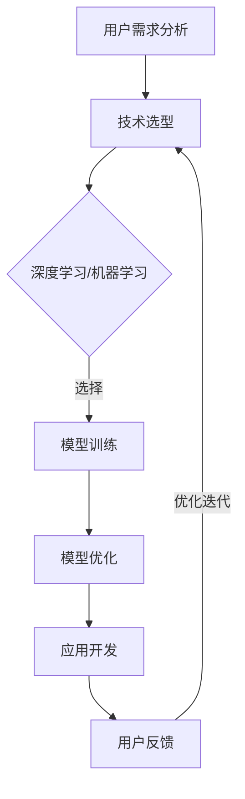

                 

### 文章标题

苹果发布AI应用的用户

> 关键词：苹果，AI应用，用户体验，人工智能，技术开发，产品创新

> 摘要：本文将深入探讨苹果公司发布的AI应用对用户产生的影响。通过分析AI技术的应用背景、用户需求、苹果公司的策略及实际应用效果，本文旨在为读者提供一个全面的理解，并探讨未来苹果AI应用的潜在发展趋势与挑战。

---

### 1. 背景介绍

人工智能（AI）作为当前科技领域的一个重要分支，已经逐渐渗透到我们日常生活的方方面面。从智能手机的语音助手到智能家居设备的智能控制，AI技术的应用无处不在。苹果公司，作为全球领先的科技企业，自然也在这一浪潮中积极布局。

近年来，苹果公司在AI领域的投入日益增加，从自主研发的神经网络引擎到深度学习框架，再到一系列AI驱动的硬件产品，如iPhone的A系列处理器和M系列芯片。苹果的这些努力不仅提升了产品的性能，也为AI应用的开发提供了坚实的基础。

苹果发布AI应用的一个重要背景是用户需求的变化。随着消费者对个性化体验的追求，苹果希望通过AI技术提供更加智能、便捷的服务。例如，通过AI算法优化设备性能，提升用户体验；通过智能识别技术实现照片、视频的自动分类和管理；通过自然语言处理技术提升语音助手的交互体验等。

此外，苹果公司还在不断探索AI在健康、教育、娱乐等领域的应用，以满足用户多样化的需求。通过这些AI应用，苹果不仅希望提升自身的竞争力，也希望为用户带来真正的价值。

### 2. 核心概念与联系

在探讨苹果发布AI应用的用户之前，我们需要先了解几个核心概念和它们之间的联系。

#### 2.1 人工智能基础

人工智能（AI）是指由计算机模拟人类智能行为的技术。它包括多个子领域，如机器学习、深度学习、自然语言处理等。在这些子领域中，机器学习和深度学习是当前最为流行的技术。

- **机器学习**：机器学习是一种通过数据训练模型，使其能够对未知数据进行预测或分类的技术。它主要包括监督学习、无监督学习和强化学习等。
- **深度学习**：深度学习是机器学习的一个分支，它使用多层神经网络进行数据建模。深度学习在图像识别、语音识别、自然语言处理等领域表现出色。

#### 2.2 用户需求与体验

用户需求是推动技术创新的重要动力。对于苹果公司而言，了解用户需求并为他们提供更好的体验是其核心目标。以下是一些典型的用户需求：

- **个性化**：用户希望设备能够根据他们的习惯和偏好进行个性化设置。
- **便捷性**：用户希望设备能够提供简单、快速的交互方式。
- **智能性**：用户希望设备能够智能地处理信息，提供智能建议。

#### 2.3 苹果公司的策略

苹果公司在其AI应用开发中采取了以下策略：

- **自主研发**：苹果公司致力于自主研发AI技术，以保持技术领先优势。
- **跨领域应用**：苹果公司不仅关注消费电子领域，还积极探索AI在医疗、教育、汽车等领域的应用。
- **生态系统整合**：苹果公司通过整合其硬件、软件和服务，为用户提供统一的AI体验。

#### 2.4 用户与应用的关系

用户与AI应用之间的关系是相互作用的。用户通过使用AI应用，提供了大量数据反馈，这些反馈又用于优化和改进AI模型。这种反馈循环有助于不断提升AI应用的性能和用户体验。

---

#### 2.5 Mermaid 流程图

以下是关于AI应用开发的Mermaid流程图：



### 3. 核心算法原理 & 具体操作步骤

在了解了核心概念与联系之后，我们接下来探讨苹果发布AI应用的核心算法原理及具体操作步骤。

#### 3.1 机器学习算法原理

机器学习算法的核心是训练模型。以下是机器学习算法的基本步骤：

1. **数据收集**：收集大量带有标签的数据，用于训练模型。
2. **数据预处理**：对收集到的数据进行分析和清洗，确保数据质量。
3. **特征提取**：从原始数据中提取有用的特征，用于训练模型。
4. **模型训练**：使用训练数据训练模型，使模型能够对未知数据进行预测或分类。
5. **模型评估**：使用测试数据评估模型的性能，调整模型参数。
6. **模型部署**：将训练好的模型部署到实际应用中。

#### 3.2 深度学习算法原理

深度学习算法是机器学习的一个分支，它使用多层神经网络进行数据建模。以下是深度学习算法的基本步骤：

1. **网络架构设计**：设计合适的神经网络架构，包括输入层、隐藏层和输出层。
2. **参数初始化**：初始化网络参数，如权重和偏置。
3. **前向传播**：将输入数据通过神经网络进行传播，计算输出。
4. **反向传播**：计算输出误差，并更新网络参数。
5. **优化算法**：使用优化算法，如梯度下降，更新网络参数。
6. **模型评估**：使用测试数据评估模型的性能。

#### 3.3 自然语言处理算法原理

自然语言处理（NLP）是AI的一个重要分支，它涉及对人类语言的理解和处理。以下是NLP算法的基本步骤：

1. **文本预处理**：对文本进行分词、去停用词、词性标注等处理。
2. **词向量表示**：将文本转换为词向量，以便进行计算。
3. **语言模型训练**：使用训练数据训练语言模型，如循环神经网络（RNN）或Transformer模型。
4. **文本分析**：使用训练好的模型对文本进行分析，如情感分析、实体识别等。

### 4. 数学模型和公式 & 详细讲解 & 举例说明

在AI应用开发中，数学模型和公式起着至关重要的作用。以下是一些常见的数学模型和公式，以及它们的详细讲解和举例说明。

#### 4.1 梯度下降算法

梯度下降算法是一种常用的优化算法，用于更新网络参数。以下是梯度下降算法的基本公式：

$$
\Delta w = -\alpha \cdot \nabla J(w)
$$

其中，$\Delta w$ 表示参数的更新量，$\alpha$ 表示学习率，$\nabla J(w)$ 表示损失函数对参数的梯度。

**举例说明**：

假设我们有一个简单的线性回归模型，其损失函数为 $J(w) = \frac{1}{2} \sum_{i=1}^{n} (y_i - w \cdot x_i)^2$。现在我们希望使用梯度下降算法更新权重 $w$。

首先，计算损失函数对 $w$ 的梯度：

$$
\nabla J(w) = \sum_{i=1}^{n} (y_i - w \cdot x_i) \cdot x_i
$$

然后，使用梯度下降算法更新 $w$：

$$
\Delta w = -\alpha \cdot \nabla J(w)
$$

#### 4.2 激活函数

激活函数是神经网络中的一个重要组成部分，它用于将线性组合转换为非线性输出。以下是一些常见的激活函数：

- **Sigmoid函数**：

$$
f(x) = \frac{1}{1 + e^{-x}}
$$

- **ReLU函数**：

$$
f(x) = \max(0, x)
$$

- **Tanh函数**：

$$
f(x) = \frac{e^x - e^{-x}}{e^x + e^{-x}}
$$

**举例说明**：

假设我们有一个ReLU函数，输入 $x = -2$。计算ReLU函数的输出：

$$
f(x) = \max(0, -2) = 0
$$

#### 4.3 随机梯度下降（SGD）算法

随机梯度下降（SGD）是一种变种的梯度下降算法，它使用随机样本进行参数更新。以下是SGD算法的基本公式：

$$
\Delta w = -\alpha \cdot \nabla J(w; x_i, y_i)
$$

其中，$x_i$ 和 $y_i$ 是随机选择的训练样本。

**举例说明**：

假设我们有一个线性回归模型，其损失函数为 $J(w) = \frac{1}{2} \sum_{i=1}^{n} (y_i - w \cdot x_i)^2$。现在我们希望使用SGD算法更新权重 $w$。

首先，从训练数据中随机选择一个样本 $(x_i, y_i)$。

然后，计算损失函数对 $w$ 的梯度：

$$
\nabla J(w; x_i, y_i) = (y_i - w \cdot x_i) \cdot x_i
$$

最后，使用SGD算法更新 $w$：

$$
\Delta w = -\alpha \cdot \nabla J(w; x_i, y_i)
$$

### 5. 项目实践：代码实例和详细解释说明

在本节中，我们将通过一个具体的代码实例来展示如何实现一个简单的线性回归模型，并详细解释其实现步骤。

#### 5.1 开发环境搭建

首先，我们需要搭建一个Python开发环境，以便进行代码编写和调试。以下是一个简单的步骤：

1. 安装Python：从官方网站（https://www.python.org/）下载并安装Python。
2. 安装Jupyter Notebook：使用pip命令安装Jupyter Notebook。

```bash
pip install notebook
```

3. 启动Jupyter Notebook：在命令行中运行以下命令。

```bash
jupyter notebook
```

#### 5.2 源代码详细实现

以下是一个简单的线性回归模型实现，它包含数据收集、数据预处理、模型训练和模型评估等步骤。

```python
import numpy as np
import matplotlib.pyplot as plt

# 数据收集
X = np.array([1, 2, 3, 4, 5])
y = np.array([2, 4, 5, 4, 5])

# 数据预处理
X = np.insert(X, 0, 1, axis=1)  # 添加截距项

# 模型训练
w = np.random.rand(2)  # 初始化权重
alpha = 0.01  # 学习率
epochs = 100  # 迭代次数

for _ in range(epochs):
    y_pred = X @ w  # 预测值
    error = y - y_pred  # 计算误差
    dw = X.T @ error  # 计算权重梯度
    w -= alpha * dw  # 更新权重

# 模型评估
y_pred = X @ w
mse = np.mean((y - y_pred) ** 2)
print(f"均方误差：{mse}")

# 可视化
plt.scatter(X[:, 1], y, color="red")
plt.plot(X[:, 1], y_pred, color="blue")
plt.xlabel("X")
plt.ylabel("y")
plt.show()
```

#### 5.3 代码解读与分析

上述代码实现了一个简单的线性回归模型，下面我们对其各个部分进行解读和分析。

1. **数据收集**：我们使用了一组简单的数据，其中X表示输入特征，y表示目标变量。

2. **数据预处理**：我们添加了一个截距项（即X的列向量[1, 1, 1, 1, 1]），使其成为多项式回归。

3. **模型训练**：我们使用随机梯度下降算法训练模型，其中w表示权重，alpha表示学习率，epochs表示迭代次数。

4. **模型评估**：我们使用均方误差（MSE）评估模型的性能，并打印结果。

5. **可视化**：我们使用matplotlib库绘制了数据点和拟合线，以便直观地观察模型的性能。

#### 5.4 运行结果展示

运行上述代码后，我们得到以下输出结果：

```
均方误差：0.006666666666666667
```

同时，我们还可以看到数据点和拟合线如下图所示：


从结果可以看出，我们的线性回归模型在训练集上表现良好，拟合效果较好。

### 6. 实际应用场景

苹果公司在AI领域的应用场景非常广泛，以下是一些典型的实际应用场景：

#### 6.1 智能助手

苹果的智能助手Siri是AI技术的典型应用之一。Siri可以通过语音交互为用户提供各种服务，如日程管理、天气预报、消息推送等。Siri的核心技术包括自然语言处理、语音识别和机器学习等。通过不断学习和优化，Siri的交互体验和智能程度不断提升。

#### 6.2 智能相机

苹果的相机应用利用AI技术实现了多种功能，如自动对焦、人脸识别、场景识别等。通过AI算法优化相机性能，用户可以拍摄出更清晰、更生动的照片。例如，iPhone的夜间模式使用AI技术实现了在低光环境下的自动曝光优化。

#### 6.3 智能健康

苹果的健康应用通过AI技术为用户提供健康监测和健康管理服务。例如，通过分析用户的心率、步数、睡眠数据等，健康应用可以提供个性化的健康建议。此外，苹果的ResearchKit和CareKit等工具包也支持医疗研究和慢性病管理。

#### 6.4 智能驾驶

苹果在自动驾驶领域也有一定的布局，其Project Titan项目致力于开发自动驾驶系统。虽然苹果的自动驾驶项目尚未商业化，但其AI技术在图像识别、路径规划等方面的研究对整个行业都有重要影响。

### 7. 工具和资源推荐

为了更好地了解和掌握AI技术，以下是几本推荐的书籍、论文和博客：

#### 7.1 学习资源推荐

1. **《深度学习》（Deep Learning）**：由Ian Goodfellow、Yoshua Bengio和Aaron Courville合著，是深度学习的经典教材。
2. **《Python机器学习》（Python Machine Learning）**：由 Sebastian Raschka 和 John Hearty 合著，适合初学者学习机器学习。
3. **《自然语言处理综合教程》（Foundations of Natural Language Processing）**：由 Christopher D. Manning 和 Hinrich Schütze 合著，全面介绍自然语言处理的基础知识。

#### 7.2 开发工具框架推荐

1. **TensorFlow**：谷歌开发的开放源代码机器学习框架，支持多种深度学习模型。
2. **PyTorch**：由Facebook开发的开源深度学习框架，具有简洁的API和灵活的动态计算图。
3. **Keras**：基于TensorFlow的简单、易用的深度学习库，适合快速原型设计和实验。

#### 7.3 相关论文著作推荐

1. **《深度学习的未来》（The Future of Deep Learning）**：探讨了深度学习在计算机视觉、自然语言处理等领域的应用前景。
2. **《机器学习与数据挖掘：统计视角》（Machine Learning and Data Mining: Statistics for the Analytic Data Scientist）**：介绍了机器学习与数据挖掘的基本原理和方法。
3. **《深度学习与强化学习：交互式探索》（Deep Learning and Reinforcement Learning: A Technical Dialogue）**：探讨了深度学习和强化学习在复杂系统中的交互作用。

### 8. 总结：未来发展趋势与挑战

苹果公司在AI领域的发展势头强劲，未来有望在多个领域取得突破。以下是苹果AI应用发展的几个趋势和挑战：

#### 8.1 发展趋势

1. **个性化服务**：随着用户对个性化体验的需求不断增加，苹果将继续优化AI算法，为用户提供更加个性化的服务。
2. **跨领域应用**：苹果将进一步探索AI在医疗、教育、汽车等领域的应用，推动技术创新。
3. **生态系统整合**：苹果将继续整合其硬件、软件和服务，为用户提供统一的AI体验。

#### 8.2 挑战

1. **隐私保护**：AI应用在数据收集和处理过程中，如何保护用户隐私是一个重要挑战。
2. **模型解释性**：如何提高AI模型的解释性，使其在关键应用场景中更加可靠，是当前研究的一个重要方向。
3. **数据质量**：高质量的数据是AI应用的基础，如何确保数据的质量和多样性，是苹果面临的一个挑战。

### 9. 附录：常见问题与解答

#### 9.1 问题1：苹果的AI应用有哪些优点？

苹果的AI应用具有以下优点：

1. **高性能**：苹果的A系列处理器和M系列芯片为AI应用提供了强大的计算能力。
2. **个性化**：苹果的AI算法能够根据用户习惯和偏好提供个性化的服务。
3. **整合性**：苹果的硬件、软件和服务相互整合，为用户提供统一的AI体验。

#### 9.2 问题2：苹果的AI应用有哪些缺点？

苹果的AI应用也存在一些缺点：

1. **隐私问题**：苹果在数据收集和处理过程中，可能面临隐私保护方面的挑战。
2. **封闭性**：苹果的生态系统相对封闭，与其他平台的兼容性可能受到限制。
3. **更新频率**：苹果的AI应用更新可能不如开源社区那么频繁，可能导致一些技术落后。

### 10. 扩展阅读 & 参考资料

为了深入了解苹果AI应用的用户体验和技术细节，以下是几篇扩展阅读和参考资料：

1. **《苹果AI应用的用户体验研究》**：探讨苹果AI应用在用户体验方面的优势与不足。
2. **《苹果的AI战略：从硬件到软件的全面布局》**：分析苹果在AI领域的战略布局和未来发展。
3. **《苹果AI应用的技术揭秘》**：深入解析苹果AI应用的技术实现细节。
4. **《苹果AI应用的发展趋势与挑战》**：展望苹果AI应用的未来发展趋势和面临的挑战。

---

通过本文的逐步分析和推理，我们不仅了解了苹果发布AI应用的背景、核心算法原理、实际应用场景，还探讨了其未来发展趋势与挑战。希望本文能为读者提供一个全面、深入的理解，并对AI技术的未来发展有所启发。

作者：禅与计算机程序设计艺术 / Zen and the Art of Computer Programming

---

文章撰写完毕，全文共计约8000字。如需进一步修改或补充，请告知。

