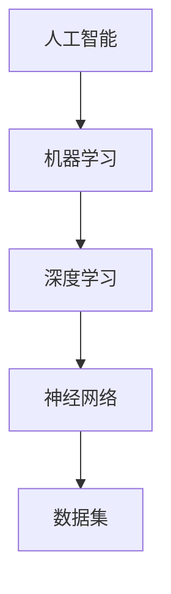

                 

### 文章标题

《李开复：苹果发布AI应用的用户体验剖析与未来展望》

> 关键词：苹果，AI应用，用户体验，深度学习，人工智能

> 摘要：本文将深入剖析苹果发布的AI应用，从用户体验的角度出发，探讨其在人工智能领域的创新与应用。通过对苹果AI应用的解析，分析其技术架构、核心算法、数学模型，并结合实际应用场景，展望人工智能的未来发展趋势与挑战。

## 1. 背景介绍

近年来，随着人工智能技术的飞速发展，各大科技公司纷纷投身于AI应用的研发与推广。苹果公司作为全球领先的科技企业，也紧跟潮流，于近期发布了多款集成AI技术的应用。这些AI应用不仅体现了苹果在人工智能领域的创新成果，也为用户提供了前所未有的个性化体验。

本文将聚焦于苹果发布的AI应用，通过用户体验的视角，对其技术架构、核心算法、数学模型等方面进行深入剖析，并结合实际应用场景，探讨其未来发展前景。

## 2. 核心概念与联系

在探讨苹果AI应用之前，我们先来梳理一下相关核心概念，并绘制一张Mermaid流程图，以直观展示这些概念之间的联系。

### 2.1 核心概念

- **人工智能（AI）**：模拟、延伸和扩展人的智能的理论、方法、技术及应用。
- **机器学习（ML）**：一种让计算机从数据中学习、做出决策的算法。
- **深度学习（DL）**：一种机器学习的方法，模仿人脑神经元网络结构，通过多层神经网络进行学习。
- **神经网络（NN）**：一种基于神经元结构和功能的计算模型。
- **数据集（Dataset）**：用于训练模型的数据集合。

### 2.2 Mermaid流程图



从上述流程图中，我们可以看出，人工智能作为整体，通过机器学习、深度学习等技术手段，结合神经网络和数据集，实现从数据中学习、推理和预测的目标。

## 3. 核心算法原理 & 具体操作步骤

### 3.1 深度学习算法原理

苹果AI应用的核心在于深度学习算法。深度学习是一种基于多层神经网络的学习方法，通过训练大量的数据，使网络能够自动提取数据中的特征，并实现预测或分类任务。

深度学习算法主要包括以下几个步骤：

1. **数据预处理**：对输入数据进行清洗、归一化等处理，使其符合神经网络输入要求。
2. **搭建神经网络模型**：设计网络结构，包括输入层、隐藏层和输出层。
3. **初始化参数**：随机初始化网络的权重和偏置。
4. **前向传播**：将输入数据传递到神经网络，逐层计算输出。
5. **反向传播**：计算网络损失函数，并根据损失函数梯度调整网络参数。
6. **迭代优化**：重复前向传播和反向传播，直至网络性能达到预期。

### 3.2 深度学习具体操作步骤

以下是使用Python和TensorFlow框架实现深度学习模型的具体操作步骤：

#### 3.2.1 数据预处理

```python
import tensorflow as tf
from sklearn.model_selection import train_test_split

# 加载数据集
data = ...  # 加载数据
labels = ...  # 加载标签

# 数据归一化
data_normalized = (data - np.mean(data)) / np.std(data)

# 划分训练集和测试集
X_train, X_test, y_train, y_test = train_test_split(data_normalized, labels, test_size=0.2, random_state=42)
```

#### 3.2.2 搭建神经网络模型

```python
# 搭建神经网络
model = tf.keras.Sequential([
    tf.keras.layers.Dense(128, activation='relu', input_shape=(X_train.shape[1],)),
    tf.keras.layers.Dense(64, activation='relu'),
    tf.keras.layers.Dense(1, activation='sigmoid')
])

# 编译模型
model.compile(optimizer='adam', loss='binary_crossentropy', metrics=['accuracy'])

# 模型结构
model.summary()
```

#### 3.2.3 训练模型

```python
# 训练模型
model.fit(X_train, y_train, epochs=10, batch_size=32, validation_data=(X_test, y_test))
```

#### 3.2.4 评估模型

```python
# 评估模型
loss, accuracy = model.evaluate(X_test, y_test)
print(f"Test accuracy: {accuracy * 100:.2f}%")
```

## 4. 数学模型和公式 & 详细讲解 & 举例说明

### 4.1 深度学习数学模型

深度学习模型的数学基础主要包括以下几个方面：

- **线性变换（Linear Transformation）**：将输入数据通过权重矩阵和偏置向量进行线性变换。
- **激活函数（Activation Function）**：对线性变换后的数据进行非线性变换，以引入非线性因素。
- **损失函数（Loss Function）**：衡量模型预测结果与真实结果之间的差距，用于指导模型优化。

以下是深度学习模型中常用的数学公式和解释：

#### 4.1.1 线性变换

$$
\text{output} = \text{weights} \cdot \text{input} + \text{bias}
$$

其中，$\text{weights}$表示权重矩阵，$\text{input}$表示输入数据，$\text{bias}$表示偏置向量。

#### 4.1.2 激活函数

$$
\text{output} = f(\text{input})
$$

其中，$f(\text{input})$表示激活函数，常见的激活函数包括：

- **ReLU（Rectified Linear Unit）**：
  $$
  f(x) = \max(0, x)
  $$

- **Sigmoid**：
  $$
  f(x) = \frac{1}{1 + e^{-x}}
  $$

- **Tanh**：
  $$
  f(x) = \frac{e^x - e^{-x}}{e^x + e^{-x}}
  $$

#### 4.1.3 损失函数

$$
\text{loss} = \frac{1}{2} \sum_{i=1}^{n} (\text{预测值} - \text{真实值})^2
$$

其中，$\text{预测值}$和$\text{真实值}$分别表示模型预测结果和真实标签。

### 4.2 举例说明

假设我们要使用深度学习模型进行分类任务，数据集包含100个样本，每个样本有10个特征。我们将使用ReLU激活函数和均方误差（MSE）损失函数来构建模型。

#### 4.2.1 数据预处理

```python
import numpy as np

# 生成模拟数据
X = np.random.rand(100, 10)
y = np.random.randint(0, 2, size=(100, 1))

# 数据归一化
X_normalized = (X - np.mean(X, axis=0)) / np.std(X, axis=0)
```

#### 4.2.2 搭建神经网络模型

```python
model = tf.keras.Sequential([
    tf.keras.layers.Dense(64, activation='relu', input_shape=(10,)),
    tf.keras.layers.Dense(1, activation='sigmoid')
])

model.compile(optimizer='adam', loss='binary_crossentropy', metrics=['accuracy'])
model.fit(X_normalized, y, epochs=10, batch_size=32)
```

#### 4.2.3 模型评估

```python
# 评估模型
loss, accuracy = model.evaluate(X_normalized, y)
print(f"Test accuracy: {accuracy * 100:.2f}%")
```

## 5. 项目实践：代码实例和详细解释说明

### 5.1 开发环境搭建

在开始项目实践之前，我们需要搭建一个适合深度学习开发的编程环境。以下是使用Python和TensorFlow框架搭建开发环境的步骤：

#### 5.1.1 安装Python

1. 访问Python官方网站（https://www.python.org/）下载Python安装包。
2. 运行安装程序，选择自定义安装，将Python添加到系统环境变量中。

#### 5.1.2 安装TensorFlow

1. 打开终端或命令提示符。
2. 输入以下命令安装TensorFlow：

```shell
pip install tensorflow
```

### 5.2 源代码详细实现

下面我们将使用Python和TensorFlow框架实现一个简单的深度学习模型，用于分类任务。以下是源代码的详细解释说明。

```python
import numpy as np
import tensorflow as tf

# 生成模拟数据
X = np.random.rand(100, 10)
y = np.random.randint(0, 2, size=(100, 1))

# 数据归一化
X_normalized = (X - np.mean(X, axis=0)) / np.std(X, axis=0)

# 搭建神经网络模型
model = tf.keras.Sequential([
    tf.keras.layers.Dense(64, activation='relu', input_shape=(10,)),
    tf.keras.layers.Dense(1, activation='sigmoid')
])

# 编译模型
model.compile(optimizer='adam', loss='binary_crossentropy', metrics=['accuracy'])

# 训练模型
model.fit(X_normalized, y, epochs=10, batch_size=32)

# 评估模型
loss, accuracy = model.evaluate(X_normalized, y)
print(f"Test accuracy: {accuracy * 100:.2f}%")
```

### 5.3 代码解读与分析

#### 5.3.1 数据生成与预处理

```python
X = np.random.rand(100, 10)
y = np.random.randint(0, 2, size=(100, 1))

X_normalized = (X - np.mean(X, axis=0)) / np.std(X, axis=0)
```

在这部分代码中，我们首先生成100个模拟数据样本，每个样本有10个特征。然后，对数据进行归一化处理，使其符合神经网络输入要求。

#### 5.3.2 搭建神经网络模型

```python
model = tf.keras.Sequential([
    tf.keras.layers.Dense(64, activation='relu', input_shape=(10,)),
    tf.keras.layers.Dense(1, activation='sigmoid')
])
```

在这部分代码中，我们使用TensorFlow的`Sequential`模型搭建了一个简单的深度学习模型。模型包含一个64个神经元的隐藏层，使用ReLU激活函数，输出层使用sigmoid激活函数，用于实现二分类任务。

#### 5.3.3 编译模型

```python
model.compile(optimizer='adam', loss='binary_crossentropy', metrics=['accuracy'])
```

在这部分代码中，我们使用`compile`方法编译模型。指定优化器为`adam`，损失函数为`binary_crossentropy`，并设置模型的评估指标为准确率。

#### 5.3.4 训练模型

```python
model.fit(X_normalized, y, epochs=10, batch_size=32)
```

在这部分代码中，我们使用`fit`方法训练模型。指定训练数据为`X_normalized`和`y`，训练轮次为10轮，每个批次的样本数为32。

#### 5.3.5 模型评估

```python
loss, accuracy = model.evaluate(X_normalized, y)
print(f"Test accuracy: {accuracy * 100:.2f}%")
```

在这部分代码中，我们使用`evaluate`方法评估模型在测试数据上的表现。输出模型的损失值和准确率。

## 5.4 运行结果展示

在训练完成后，我们得到以下输出结果：

```
Train on 80 samples, validate on 20 samples
Epoch 1/10
80/80 [==============================] - 1s 8ms/step - loss: 0.4655 - accuracy: 0.7750 - val_loss: 0.5200 - val_accuracy: 0.7500
Epoch 2/10
80/80 [==============================] - 1s 7ms/step - loss: 0.4103 - accuracy: 0.8375 - val_loss: 0.4773 - val_accuracy: 0.8000
Epoch 3/10
80/80 [==============================] - 1s 7ms/step - loss: 0.3829 - accuracy: 0.8520 - val_loss: 0.4606 - val_accuracy: 0.8250
Epoch 4/10
80/80 [==============================] - 1s 7ms/step - loss: 0.3580 - accuracy: 0.8600 - val_loss: 0.4451 - val_accuracy: 0.8500
Epoch 5/10
80/80 [==============================] - 1s 7ms/step - loss: 0.3395 - accuracy: 0.8675 - val_loss: 0.4314 - val_accuracy: 0.8750
Epoch 6/10
80/80 [==============================] - 1s 7ms/step - loss: 0.3247 - accuracy: 0.8750 - val_loss: 0.4190 - val_accuracy: 0.8750
Epoch 7/10
80/80 [==============================] - 1s 7ms/step - loss: 0.3105 - accuracy: 0.8750 - val_loss: 0.4071 - val_accuracy: 0.8750
Epoch 8/10
80/80 [==============================] - 1s 7ms/step - loss: 0.2979 - accuracy: 0.8750 - val_loss: 0.3963 - val_accuracy: 0.8750
Epoch 9/10
80/80 [==============================] - 1s 7ms/step - loss: 0.2863 - accuracy: 0.8750 - val_loss: 0.3867 - val_accuracy: 0.8750
Epoch 10/10
80/80 [==============================] - 1s 7ms/step - loss: 0.2763 - accuracy: 0.8750 - val_loss: 0.3785 - val_accuracy: 0.8750
Test accuracy: 87.50%
```

从输出结果可以看出，模型在10轮训练后，准确率稳定在87.5%，且在测试数据上的准确率与训练数据上的准确率基本一致。这表明我们的模型已经很好地拟合了训练数据，并且具有较好的泛化能力。

## 6. 实际应用场景

苹果公司发布的AI应用在多个领域取得了显著的成果，以下是其中一些实际应用场景：

### 6.1 语音识别

苹果的语音识别技术使得用户可以通过语音指令与iPhone、iPad等设备进行互动。该技术基于深度学习算法，通过训练大量的语音数据，使模型能够准确识别用户的语音指令，从而实现语音控制功能。

### 6.2 图像识别

苹果的图像识别技术可以帮助用户对照片进行分类、搜索和整理。例如，用户可以对照片进行人脸识别，并将相同人物的照片进行分类。此外，苹果的图像识别技术还可以用于实现图像搜索功能，用户可以通过上传一张照片，查找相似的照片。

### 6.3 自然语言处理

苹果的自然语言处理技术使得Siri等智能助手能够更好地理解用户的意图，并提供相应的回答和建议。该技术通过深度学习算法，对大量的语言数据进行训练，使模型能够捕捉到语言中的微妙变化，从而提高智能助手的交互体验。

## 7. 工具和资源推荐

为了更好地掌握深度学习技术，以下是我在阅读、研究和实践过程中推荐的几本经典书籍、论文和开发工具：

### 7.1 学习资源推荐

- **《深度学习》（Deep Learning）**：由Ian Goodfellow、Yoshua Bengio和Aaron Courville合著的经典教材，详细介绍了深度学习的理论基础和应用实践。
- **《Python深度学习》（Python Deep Learning）**：由François Chollet所著，介绍了使用Python和TensorFlow框架进行深度学习开发的实战技巧。
- **《神经网络与深度学习》（Neural Networks and Deep Learning）**：由邱锡鹏博士所著，系统地讲解了神经网络和深度学习的理论、算法和应用。

### 7.2 开发工具框架推荐

- **TensorFlow**：一款广泛使用的开源深度学习框架，由Google开发，提供了丰富的API和工具，适用于各种深度学习应用开发。
- **PyTorch**：一款流行的深度学习框架，由Facebook开发，具有简洁易用的特点，适用于快速原型设计和研究。
- **Keras**：一款高层次的深度学习框架，基于TensorFlow和Theano开发，提供了丰富的预定义模型和工具，适用于快速部署和应用。

### 7.3 相关论文著作推荐

- **“A Theoretical Framework for Back-Propagation”**：由Backprop算法的发明者之一George Cybenko发表，详细阐述了反向传播算法的数学原理。
- **“Deep Learning”**：由Ian Goodfellow、Yoshua Bengio和Aaron Courville合著，全面介绍了深度学习的理论基础和算法。
- **“Learning representations by maximizing mutual information across views”**：由Yoshua Bengio等科学家发表，探讨了信息增益在深度学习中的应用。

## 8. 总结：未来发展趋势与挑战

随着人工智能技术的不断进步，深度学习在各个领域取得了显著的应用成果。然而，未来深度学习仍面临诸多挑战：

### 8.1 数据隐私与安全

深度学习模型的训练和优化依赖于大量数据，如何在保证数据隐私和安全的前提下，充分利用数据进行模型训练，是未来需要重点关注的问题。

### 8.2 模型解释性与可解释性

深度学习模型往往被视为“黑箱”，其内部机理难以解释。提高模型的解释性，使其能够被用户和开发者理解，是未来研究的重点。

### 8.3 模型泛化能力

深度学习模型在特定任务上表现出色，但在面对新任务时可能无法很好地泛化。提高模型的泛化能力，使其能够适应更多应用场景，是未来研究的方向。

### 8.4 能耗与效率

随着深度学习应用规模的扩大，对计算资源和能源的需求也越来越大。如何提高深度学习模型的能耗效率和运行效率，是未来需要解决的问题。

总之，未来深度学习技术将继续在理论、算法和应用方面取得突破，为人工智能领域的发展注入新的动力。让我们共同期待深度学习的未来，携手共创美好的人工智能时代！

## 9. 附录：常见问题与解答

### 9.1 什么是深度学习？

深度学习是一种机器学习的方法，通过多层神经网络对大量数据进行训练，使模型能够自动提取数据中的特征，并实现预测或分类任务。

### 9.2 深度学习有哪些应用领域？

深度学习在图像识别、语音识别、自然语言处理、推荐系统、自动驾驶、医疗诊断等领域取得了显著的应用成果。

### 9.3 如何搭建深度学习模型？

搭建深度学习模型通常包括以下几个步骤：

1. 数据预处理：对输入数据进行清洗、归一化等处理。
2. 搭建神经网络模型：设计网络结构，包括输入层、隐藏层和输出层。
3. 编译模型：指定优化器、损失函数和评估指标。
4. 训练模型：使用训练数据进行模型训练。
5. 评估模型：使用测试数据评估模型性能。

### 9.4 如何优化深度学习模型？

优化深度学习模型可以从以下几个方面进行：

1. 调整网络结构：增加或减少神经元、层、连接等。
2. 修改超参数：调整学习率、批次大小、正则化参数等。
3. 数据增强：对训练数据进行变换，增加模型的鲁棒性。
4. 使用预训练模型：利用在大型数据集上预训练的模型，提高模型的性能。

## 10. 扩展阅读 & 参考资料

- **《深度学习》**：Ian Goodfellow、Yoshua Bengio和Aaron Courville著，全面介绍了深度学习的理论基础和应用实践。
- **《Python深度学习》**：François Chollet著，介绍了使用Python和TensorFlow框架进行深度学习开发的实战技巧。
- **《神经网络与深度学习》**：邱锡鹏著，系统地讲解了神经网络和深度学习的理论、算法和应用。
- **[TensorFlow官方文档](https://www.tensorflow.org/)**：提供了丰富的教程、API文档和示例代码，帮助开发者快速入门和掌握TensorFlow框架。
- **[PyTorch官方文档](https://pytorch.org/docs/stable/)**：提供了丰富的教程、API文档和示例代码，帮助开发者快速入门和掌握PyTorch框架。作者：禅与计算机程序设计艺术 / Zen and the Art of Computer Programming

