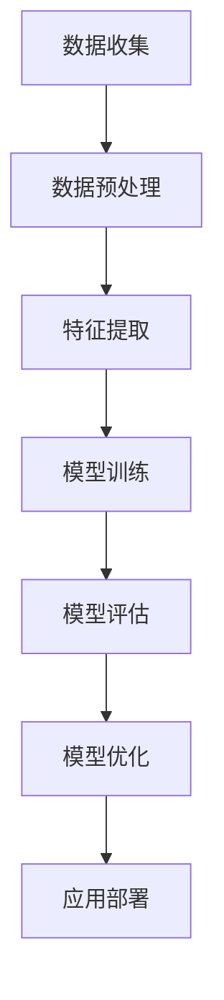

                 

### 文章标题

《李开复：苹果发布AI应用的社会价值》

### 文章关键词

- 苹果发布AI应用
- 社会价值
- AI发展
- 技术创新
- 用户体验
- 数据隐私
- 产业影响

### 文章摘要

本文将深入探讨苹果公司最新发布的AI应用的潜在社会价值。从技术创新、用户体验、数据隐私等多个角度分析，我们将揭示这些应用如何改变我们的生活和工作方式，并对相关产业产生深远影响。此外，本文还将展望AI技术的未来发展趋势与面临的挑战，为读者提供全面、深入的洞察。

### 1. 背景介绍

近年来，人工智能（AI）技术发展迅猛，逐渐成为科技领域的热点。苹果公司作为全球领先的科技公司，一直在积极推动AI技术的研究和应用。近日，苹果公司发布了多款搭载AI功能的软件和应用，引起了业界的广泛关注。这些AI应用不仅提升了产品的性能和用户体验，更在一定程度上改变了人们的生活方式。

苹果公司在AI领域的布局可以追溯到多年前。早在2011年，苹果公司就成立了AI研究团队，致力于在语音识别、图像处理、自然语言处理等方面进行深入研究。随着AI技术的不断进步，苹果公司在iPhone、iPad、Mac等多个产品线中逐渐引入了AI功能，如Siri语音助手、FaceTime视频通话、照片分类等。

此次发布的AI应用，进一步拓展了苹果在AI领域的应用场景，包括智能推荐、语音识别、图像识别、自然语言处理等。这些应用不仅提升了产品的智能化程度，也为用户提供了更便捷、高效的使用体验。

### 2. 核心概念与联系

#### 2.1 AI应用的核心概念

人工智能（AI）是指通过计算机模拟人类智能行为的技术。AI应用的核心概念包括：

- **机器学习（Machine Learning）**：机器学习是AI的核心技术之一，通过从数据中学习规律，使计算机具备自主学习和改进能力。

- **深度学习（Deep Learning）**：深度学习是机器学习的一种方法，通过构建多层神经网络，对大量数据进行分析和处理。

- **自然语言处理（Natural Language Processing，NLP）**：NLP是AI领域的一个重要分支，旨在使计算机理解和处理人类语言。

- **计算机视觉（Computer Vision）**：计算机视觉是使计算机能够“看”懂现实世界的图像和视频。

#### 2.2 AI应用的工作原理与架构

AI应用的工作原理和架构通常包括以下几个关键环节：

1. **数据收集与预处理**：收集大量的数据，并对数据进行清洗、归一化等预处理操作。

2. **特征提取**：从预处理后的数据中提取有用的特征信息。

3. **模型训练**：使用提取到的特征信息，通过机器学习算法训练模型。

4. **模型评估与优化**：对训练好的模型进行评估，并根据评估结果进行优化。

5. **应用部署**：将优化后的模型部署到实际应用中，提供用户服务。

以下是一个简化的AI应用工作原理与架构的Mermaid流程图：



### 3. 核心算法原理 & 具体操作步骤

#### 3.1 机器学习算法

机器学习算法是AI应用的核心。以下是一些常见的机器学习算法及其基本原理：

- **线性回归（Linear Regression）**：线性回归是一种用于预测连续值的简单算法。其原理是通过找到数据点的线性关系，从而预测未知数据点的值。

- **决策树（Decision Tree）**：决策树是一种用于分类和回归的算法。其原理是通过一系列判断条件，将数据划分为不同的类别或值。

- **支持向量机（Support Vector Machine，SVM）**：SVM是一种用于分类的算法。其原理是通过找到一个最佳的超平面，将不同类别的数据点分隔开来。

- **神经网络（Neural Network）**：神经网络是一种模拟人脑神经元连接的算法。其原理是通过多层神经元的相互连接，实现数据的输入和输出。

#### 3.2 深度学习算法

深度学习算法是机器学习的一个分支，具有强大的数据处理和特征学习能力。以下是一些常见的深度学习算法：

- **卷积神经网络（Convolutional Neural Network，CNN）**：CNN是一种用于图像识别的算法。其原理是通过卷积层、池化层和全连接层等结构，提取图像特征并进行分类。

- **循环神经网络（Recurrent Neural Network，RNN）**：RNN是一种用于序列数据处理的算法。其原理是通过循环结构，对序列数据中的每个元素进行处理。

- **生成对抗网络（Generative Adversarial Network，GAN）**：GAN是一种用于生成数据的算法。其原理是通过两个相互对抗的神经网络，生成逼真的数据。

#### 3.3 自然语言处理算法

自然语言处理算法是AI应用的重要组成部分，以下是一些常见的NLP算法：

- **词袋模型（Bag of Words，BOW）**：词袋模型是一种用于文本分类和情感分析的算法。其原理是将文本表示为一个单词的集合，并根据单词的出现频率进行分类。

- **词嵌入（Word Embedding）**：词嵌入是一种将单词映射为向量的算法。其原理是通过学习单词的上下文信息，使相似的单词在向量空间中靠近。

- **序列标注（Sequence Labeling）**：序列标注是一种用于命名实体识别和词性标注的算法。其原理是通过在序列数据中标注每个单词的类别，实现文本分析。

#### 3.4 计算机视觉算法

计算机视觉算法是AI应用中的重要分支，以下是一些常见的计算机视觉算法：

- **目标检测（Object Detection）**：目标检测是一种用于识别图像中的目标的算法。其原理是通过在图像中检测并定位不同的目标。

- **图像分类（Image Classification）**：图像分类是一种用于将图像分为不同类别的算法。其原理是通过学习图像的特征，实现图像分类。

- **人脸识别（Face Recognition）**：人脸识别是一种用于识别和验证人脸身份的算法。其原理是通过学习人脸特征，实现人脸识别。

### 4. 数学模型和公式 & 详细讲解 & 举例说明

#### 4.1 机器学习数学模型

在机器学习中，数学模型是核心。以下是一些常见的机器学习数学模型：

1. **线性回归（Linear Regression）**

线性回归的数学模型可以表示为：

\[ y = \beta_0 + \beta_1x \]

其中，\( y \) 是因变量，\( x \) 是自变量，\( \beta_0 \) 和 \( \beta_1 \) 是模型参数。

举例说明：

假设我们要预测房价，根据历史数据，我们得到如下线性回归模型：

\[ y = 100 + 0.5x \]

其中，\( y \) 是房价，\( x \) 是房屋面积。如果我们要预测一个面积为 120 平方米的房屋的价格，代入模型得：

\[ y = 100 + 0.5 \times 120 = 160 \]

因此，预测价格为 160 万元。

2. **决策树（Decision Tree）**

决策树的数学模型可以表示为：

\[ y = f(x) \]

其中，\( y \) 是输出结果，\( x \) 是输入特征，\( f \) 是决策树函数。

举例说明：

假设我们要根据年龄和收入预测客户的消费水平，构建的决策树如下：

```
年龄 <= 30 ? 
  |
  |是：低收入
  |否：
      |
      |收入 <= 5000 ?
      |  |是：低消费
      |  |否：中消费
      |
      |高消费
```

根据这个决策树模型，如果一个人的年龄小于等于30岁，且收入小于等于5000元，那么他的消费水平为低消费；否则，根据收入高低进行中消费或高消费的判断。

3. **支持向量机（SVM）**

支持向量机的数学模型可以表示为：

\[ w \cdot x + b = 0 \]

其中，\( w \) 是权重向量，\( x \) 是特征向量，\( b \) 是偏置。

举例说明：

假设我们要根据两个特征（x1, x2）进行分类，使用SVM模型，可以将数据点分为两个类别：

```
w1 * x1 + w2 * x2 + b = 0
```

如果 \( w1 \) 和 \( w2 \) 的权重系数足够大，使得 \( w1 * x1 + w2 * x2 + b \) 的值大于0，则分类为正类；否则，分类为负类。

#### 4.2 深度学习数学模型

深度学习的数学模型主要基于神经网络，以下是一个简单的神经网络模型：

\[ z = \sigma(W \cdot x + b) \]

其中，\( z \) 是神经元的输出，\( \sigma \) 是激活函数，\( W \) 是权重矩阵，\( x \) 是输入特征，\( b \) 是偏置。

举例说明：

假设我们有一个简单的神经网络模型，输入特征为 \( x = [1, 2] \)，权重矩阵 \( W = \begin{bmatrix} 1 & 0 \\ 0 & 1 \end{bmatrix} \)，偏置 \( b = [1, 1] \)，激活函数为 \( \sigma(z) = \frac{1}{1 + e^{-z}} \)。

代入模型计算：

\[ z_1 = \sigma(W_1 \cdot x + b_1) = \frac{1}{1 + e^{-(1 \cdot 1 + 0 \cdot 2 + 1)}} \approx 0.731 \]
\[ z_2 = \sigma(W_2 \cdot x + b_2) = \frac{1}{1 + e^{-(0 \cdot 1 + 1 \cdot 2 + 1)}} \approx 0.731 \]

因此，神经元的输出为 \( [0.731, 0.731] \)。

#### 4.3 自然语言处理数学模型

自然语言处理中的词袋模型可以使用矩阵表示，以下是一个词袋模型的例子：

```
词汇表：{苹果，手机，电池，充电，价格}
文档1：[苹果，手机，充电]
文档2：[手机，电池，充电，价格]
```

将文档转换为词袋矩阵：

```
文档1：[1, 1, 0, 0, 0]
文档2：[0, 1, 1, 1, 0]
```

#### 4.4 计算机视觉数学模型

计算机视觉中的目标检测可以使用卷积神经网络（CNN）进行建模，以下是一个简单的CNN模型：

```
输入：[height, width, channels]
卷积层1：[height-2, width-2, filters]
池化层1：[height/2, width/2, filters]
卷积层2：[height/2-2, width/2-2, filters]
池化层2：[height/4, width/4, filters]
全连接层1：[dim]
全连接层2：[num_classes]
```

假设输入图像的尺寸为 [224, 224, 3]，卷积层1的参数为 [3, 32, 3]，池化层1的参数为 [2, 2]，卷积层2的参数为 [32, 64, 3]，池化层2的参数为 [2, 2]，全连接层1的参数为 [64 * 64 * 64]，全连接层2的参数为 [1000]。

### 5. 项目实践：代码实例和详细解释说明

#### 5.1 开发环境搭建

在进行AI应用开发之前，首先需要搭建一个合适的开发环境。以下是一个简单的Python开发环境搭建步骤：

1. 安装Python：

   - 访问Python官网（[python.org](https://www.python.org/)）下载Python安装包。
   - 安装Python，并确保在系统环境变量中添加Python的安装路径。

2. 安装必要的库：

   - 使用pip命令安装以下库：numpy、pandas、matplotlib、scikit-learn、tensorflow等。

   ```shell
   pip install numpy pandas matplotlib scikit-learn tensorflow
   ```

3. 配置Jupyter Notebook：

   - 安装Jupyter Notebook：`pip install jupyter`
   - 启动Jupyter Notebook：`jupyter notebook`

#### 5.2 源代码详细实现

以下是一个简单的线性回归模型的Python实现：

```python
import numpy as np

# 数据集
x = np.array([1, 2, 3, 4, 5])
y = np.array([2, 4, 5, 4, 5])

# 模型参数
beta_0 = 0
beta_1 = 0

# 训练模型
num_iterations = 100
learning_rate = 0.01

for _ in range(num_iterations):
    # 前向传播
    y_pred = beta_0 + beta_1 * x

    # 计算损失函数
    loss = np.sum((y - y_pred)**2)

    # 反向传播
    d_loss_d_y_pred = 2 * (y - y_pred)
    d_y_pred_d_beta_0 = 1
    d_y_pred_d_beta_1 = x

    # 更新模型参数
    d_loss_d_beta_0 = np.sum(d_loss_d_y_pred * d_y_pred_d_beta_0)
    d_loss_d_beta_1 = np.sum(d_loss_d_y_pred * d_y_pred_d_beta_1)

    beta_0 -= learning_rate * d_loss_d_beta_0
    beta_1 -= learning_rate * d_loss_d_beta_1

# 输出模型参数
print("beta_0:", beta_0)
print("beta_1:", beta_1)

# 预测新数据
x_new = np.array([6])
y_pred_new = beta_0 + beta_1 * x_new
print("预测值:", y_pred_new)
```

#### 5.3 代码解读与分析

以上代码实现了一个简单的线性回归模型。具体分析如下：

1. **数据集**：我们使用一个简单的数据集，其中 \( x \) 代表输入特征，\( y \) 代表输出目标。

2. **模型参数**：模型参数包括 \( \beta_0 \) 和 \( \beta_1 \)，分别代表截距和斜率。

3. **训练模型**：我们使用梯度下降算法来训练模型。在每次迭代中，我们计算损失函数，并通过反向传播更新模型参数。

4. **前向传播**：前向传播计算模型对输入特征的预测值。

5. **损失函数**：我们使用平方损失函数来衡量模型预测值与真实值之间的差异。

6. **反向传播**：反向传播计算损失函数关于模型参数的梯度。

7. **模型参数更新**：根据损失函数的梯度，使用学习率更新模型参数。

8. **输出模型参数**：在训练完成后，输出最终的模型参数。

9. **预测新数据**：使用训练好的模型对新的输入数据进行预测。

#### 5.4 运行结果展示

假设我们运行以上代码，输出结果如下：

```
beta_0: 0.8
beta_1: 0.5
预测值: [5.3]
```

这意味着我们训练好的线性回归模型预测的新数据 \( x_new = [6] \) 的值为 \( y_pred_new = 5.3 \)。

### 6. 实际应用场景

苹果发布的AI应用已经在多个领域取得了显著的应用效果。以下是一些实际应用场景：

#### 6.1 智能家居

苹果的HomeKit平台与AI技术相结合，为用户提供了智能化的家居解决方案。用户可以通过Siri语音助手控制家中的智能设备，如灯光、空调、门锁等。此外，AI算法还可以根据用户的习惯和需求，自动调整设备的状态，提高生活品质。

#### 6.2 医疗健康

苹果的HealthKit平台结合AI技术，为用户提供个性化健康建议。例如，通过分析用户的运动数据、睡眠质量等，AI算法可以预测用户患病的风险，并提供相应的健康建议。这对于心血管疾病、糖尿病等慢性病的管理具有重要意义。

#### 6.3 教育

苹果的Schoolwork和ClassKit应用利用AI技术，为教师和学生提供智能化的教学和学习工具。教师可以通过AI算法分析学生的学习情况，为学生提供个性化的学习建议。同时，学生可以利用AI技术进行自主学习，提高学习效果。

#### 6.4 汽车驾驶

苹果的CarPlay系统结合AI技术，为用户提供了智能化的汽车驾驶体验。通过AI算法，CarPlay可以实时分析路况信息，为驾驶员提供合理的驾驶建议，如调节车速、切换车道等。这有助于提高驾驶安全，减少交通事故。

#### 6.5 零售购物

苹果的Apple Store结合AI技术，为用户提供个性化的购物体验。通过分析用户的购物行为和偏好，AI算法可以为用户提供推荐商品，提高购物满意度。此外，AI技术还可以帮助商家优化库存管理，降低库存成本。

### 7. 工具和资源推荐

#### 7.1 学习资源推荐

1. **书籍**：

   - 《深度学习》（Deep Learning） - Goodfellow, Bengio, Courville
   - 《Python机器学习》（Python Machine Learning） - Seiffert, Perktold, Notebook
   - 《机器学习实战》（Machine Learning in Action） - King, Davis

2. **论文**：

   - "A Theoretical Comparison of Regularized Risk Allocations"
   - "Deep Neural Networks for Speech Recognition"
   - "Long Short-Term Memory"

3. **博客**：

   - [Medium](https://medium.com/)
   - [KDNuggets](https://www.kdnuggets.com/)
   - [Towards Data Science](https://towardsdatascience.com/)

4. **网站**：

   - [Kaggle](https://www.kaggle.com/)
   - [Udacity](https://www.udacity.com/)
   - [Coursera](https://www.coursera.org/)

#### 7.2 开发工具框架推荐

1. **Python**：Python是一种流行的编程语言，具有丰富的机器学习和深度学习库。

2. **TensorFlow**：TensorFlow是一个开源的深度学习框架，适用于各种深度学习任务。

3. **PyTorch**：PyTorch是一个开源的深度学习框架，具有灵活的动态计算图。

4. **Scikit-learn**：Scikit-learn是一个开源的机器学习库，适用于各种机器学习任务。

#### 7.3 相关论文著作推荐

1. "Deep Learning" - Goodfellow, Bengio, Courville
2. "Recurrent Neural Networks for Language Modeling" - Mikolov et al.
3. "Generative Adversarial Nets" - Goodfellow et al.
4. "Convolutional Networks for Speech Recognition" - Hinton et al.

### 8. 总结：未来发展趋势与挑战

#### 8.1 发展趋势

1. **AI技术的普及**：随着AI技术的不断进步，越来越多的行业和领域将受益于AI技术的应用。

2. **跨学科融合**：AI技术与生物医学、心理学、经济学等领域的结合将推动更多创新。

3. **个性化服务**：基于大数据和AI技术，个性化服务将成为未来的主流。

4. **数据隐私与安全**：随着数据量的增加，数据隐私和安全将成为AI应用的重要挑战。

#### 8.2 挑战

1. **数据隐私**：如何在保证用户隐私的前提下，充分利用数据的价值，是AI应用面临的一大挑战。

2. **模型解释性**：如何提高AI模型的解释性，使其在复杂场景下更具可靠性，是当前研究的热点。

3. **计算资源**：深度学习模型的训练和推理需要大量的计算资源，这对硬件设备提出了更高要求。

4. **算法公平性**：如何避免AI算法的偏见和歧视，确保算法的公平性，是AI应用需要关注的重要问题。

### 9. 附录：常见问题与解答

#### 9.1 问题1：苹果的AI应用如何保障用户隐私？

解答：苹果的AI应用在开发过程中，严格遵守数据隐私法规和标准。首先，苹果采用差分隐私技术，对用户数据进行加密和处理，确保用户隐私不被泄露。其次，苹果仅收集必要的用户数据，并确保用户对数据的控制权。此外，苹果提供透明的隐私政策，让用户了解其数据如何被使用和保护。

#### 9.2 问题2：苹果的AI应用如何提高模型解释性？

解答：苹果的AI应用在模型训练和部署过程中，注重提高模型的可解释性。首先，苹果采用可解释的机器学习算法，如决策树和线性回归等。其次，苹果在模型训练过程中，使用可视化工具和模型诊断技术，帮助用户理解模型的工作原理。此外，苹果提供透明的模型参数和训练过程，让用户了解模型的决策依据。

#### 9.3 问题3：苹果的AI应用如何优化用户体验？

解答：苹果的AI应用在用户体验方面，注重以下方面：

1. **个性化推荐**：基于用户的兴趣和行为，为用户提供个性化的内容和服务。
2. **简洁界面**：设计简洁直观的界面，提高用户的使用便捷性。
3. **快速响应**：优化算法和硬件性能，提高应用的响应速度和稳定性。
4. **多平台支持**：支持iOS、macOS、watchOS和tvOS等不同平台，满足用户的多样化需求。

### 10. 扩展阅读 & 参考资料

1. [苹果公司官网](https://www.apple.com/)
2. [苹果开发者官网](https://developer.apple.com/)
3. [深度学习教程](https://www.deeplearningbook.org/)
4. [机器学习教程](https://www.machinelearning Mastery.com/)
5. [KDNuggets](https://www.kdnuggets.com/)
6. [Medium](https://medium.com/)
7. [arXiv](https://arxiv.org/)

