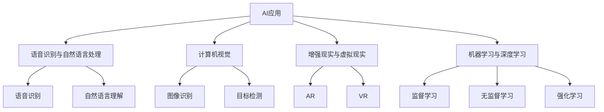
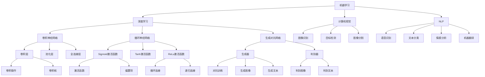

                 

### 1. 背景介绍

随着人工智能（AI）技术的飞速发展，各行各业都在积极探索AI的应用，以期提高效率、优化服务和创造新的价值。苹果公司作为全球科技巨头，在AI领域也有着深厚的积累和广泛的探索。近日，苹果发布了多项AI应用，引起了业界的广泛关注。本文将探讨苹果发布AI应用的社会价值，分析其对技术发展、行业变革以及日常生活的影响。

首先，我们需要明确什么是人工智能。人工智能，简称AI，是指由人制造出来的系统，能够展现出类似于人类智能的行为，如学习、推理、解决问题、自然语言理解和决策制定等。AI的应用范围广泛，包括语音识别、图像识别、自动驾驶、医疗诊断、金融分析等。随着计算能力的提升和算法的进步，AI技术正以前所未有的速度发展，逐渐成为改变世界的力量。

苹果公司在AI领域有着悠久的历史和显著的成就。从早期的Siri语音助手到最新的Neural Engine和Core ML，苹果不断将AI技术融入到其硬件和软件产品中，为用户提供了智能化、个性化的体验。近年来，苹果还积极投资于AI研究和开发，吸引了大量顶尖人才加入，进一步巩固了其在AI领域的领先地位。

本次苹果发布的AI应用，既包括面向消费者的产品，如增强现实（AR）应用和智能相机，也包括面向开发者和服务提供商的工具和服务，如Core ML 4.0和Vision Pro。这些应用涵盖了多个技术领域，展现了苹果在AI技术研发上的多元化布局。本文将结合具体应用，分析苹果发布AI应用的社会价值。

### 2. 核心概念与联系

#### 2.1 AI应用的定义与分类

AI应用是指利用人工智能技术解决实际问题的软件或服务。根据应用场景和目标，AI应用可以分为多种类型：

1. **语音识别与自然语言处理**：如Siri、苹果语音助手，它们通过语音输入实现人与机器的交互。
2. **计算机视觉**：如人脸识别、图像分类、目标检测等，应用于安全监控、自动驾驶等领域。
3. **增强现实与虚拟现实**：如ARKit和Vision Pro，它们通过虚拟图像与现实世界的结合，提供全新的交互体验。
4. **机器学习与深度学习**：如Core ML，它允许开发者将训练好的机器学习模型集成到iOS、macOS等平台中，实现智能功能。

#### 2.2 核心概念原理与架构

为了更好地理解苹果发布的AI应用，我们需要了解一些核心概念和原理，以及它们的架构。

**1. 机器学习与深度学习**：

- **机器学习**：机器学习是指让计算机从数据中学习，以发现数据中的规律或模式。它通常包括监督学习、无监督学习和强化学习。
- **深度学习**：深度学习是机器学习的一个分支，它使用多层神经网络对数据进行建模和分析。

**2. 计算机视觉**：

- **图像识别**：图像识别是指让计算机识别和分类图像中的内容。
- **目标检测**：目标检测是指定位图像中的目标，并对其进行分类。

**3. 自然语言处理**：

- **语音识别**：语音识别是指将语音转换为文本或命令。
- **自然语言理解**：自然语言理解是指让计算机理解人类语言，以实现智能交互。

**4. 增强现实与虚拟现实**：

- **AR**：增强现实是在现实世界中叠加虚拟元素，提供沉浸式体验。
- **VR**：虚拟现实是创建一个完全虚拟的环境，让用户感觉置身其中。

#### 2.3 Mermaid 流程图

为了更直观地展示这些核心概念和原理，我们使用Mermaid绘制了一个流程图：



### 3. 核心算法原理 & 具体操作步骤

#### 3.1 机器学习与深度学习

**1. 基本原理**：

机器学习与深度学习是AI技术的核心，它们通过算法使计算机能够从数据中学习。机器学习主要包括以下几种类型：

- **监督学习**：通过标记数据来训练模型，使模型能够在新的数据上做出预测。
- **无监督学习**：在没有标记数据的情况下，让模型自动发现数据中的模式。
- **强化学习**：通过奖励机制来训练模型，使其在特定环境中做出最优决策。

深度学习是机器学习的一个分支，它使用多层神经网络对数据进行建模和分析。深度学习的主要算法包括：

- **卷积神经网络（CNN）**：适用于图像识别和计算机视觉。
- **循环神经网络（RNN）**：适用于自然语言处理和时间序列分析。
- **生成对抗网络（GAN）**：用于生成新的数据，如图像、文本等。

**2. 具体操作步骤**：

以卷积神经网络（CNN）为例，其基本操作步骤如下：

1. **数据预处理**：包括图像大小调整、归一化等。
2. **构建网络结构**：设计CNN的层次结构，包括卷积层、池化层、全连接层等。
3. **训练模型**：使用标记数据对模型进行训练，调整模型的参数。
4. **评估模型**：使用测试数据评估模型的性能，如准确率、召回率等。
5. **部署模型**：将训练好的模型部署到生产环境中，实现实时预测。

#### 3.2 计算机视觉

计算机视觉是指让计算机理解和解释图像或视频中的内容。它主要包括以下技术：

- **图像识别**：识别图像中的物体、场景等。
- **目标检测**：检测图像中的物体，并标注其位置。
- **图像分割**：将图像分成不同的区域，如前景和背景。

**1. 基本原理**：

计算机视觉的核心是图像处理和模式识别。图像处理包括图像滤波、边缘检测、特征提取等。模式识别则通过学习数据中的模式，实现对图像内容的分类和识别。

**2. 具体操作步骤**：

以目标检测为例，其基本操作步骤如下：

1. **数据准备**：收集并标注目标数据。
2. **模型选择**：选择合适的模型，如YOLO、SSD、Faster R-CNN等。
3. **训练模型**：使用标注数据对模型进行训练。
4. **评估模型**：使用测试数据评估模型的性能。
5. **部署模型**：将训练好的模型部署到生产环境中。

#### 3.3 自然语言处理

自然语言处理是指让计算机理解和生成自然语言。它主要包括以下技术：

- **语音识别**：将语音转换为文本。
- **自然语言理解**：理解文本的含义，如情感分析、问答系统等。
- **机器翻译**：将一种语言的文本翻译成另一种语言。

**1. 基本原理**：

自然语言处理的核心是语言学和计算机科学。语言学提供了语言的结构和规则，计算机科学则提供了实现这些规则的方法和工具。

**2. 具体操作步骤**：

以语音识别为例，其基本操作步骤如下：

1. **数据准备**：收集语音数据，并进行标注。
2. **模型选择**：选择合适的语音识别模型，如基于深度神经网络的模型。
3. **训练模型**：使用标注数据对模型进行训练。
4. **评估模型**：使用测试数据评估模型的性能。
5. **部署模型**：将训练好的模型部署到生产环境中。

### 4. 数学模型和公式 & 详细讲解 & 举例说明

#### 4.1 机器学习中的数学模型

机器学习中的数学模型是算法的核心，它们通过数学公式描述数据之间的关系和特征。以下是一些常见的数学模型及其公式：

**1. 线性回归模型**

线性回归模型是最简单的机器学习模型之一，它通过一条直线来拟合数据。

$$ y = w \cdot x + b $$

其中，$y$ 是预测值，$x$ 是输入特征，$w$ 是权重，$b$ 是偏置。

**2. 逻辑回归模型**

逻辑回归模型用于分类问题，它通过一个非线性函数（逻辑函数）将线性模型的结果映射到概率范围。

$$ P(y=1) = \frac{1}{1 + e^{-(w \cdot x + b)}} $$

其中，$P(y=1)$ 是预测为1的概率，$e$ 是自然对数的底数。

**3. 卷积神经网络（CNN）**

卷积神经网络是计算机视觉领域的重要模型，它通过卷积层、池化层和全连接层对图像进行特征提取和分类。

$$ h_{l}(x) = \sigma(W_{l} \cdot h_{l-1}(x) + b_{l}) $$

其中，$h_{l}(x)$ 是第$l$层的输出，$W_{l}$ 是权重矩阵，$b_{l}$ 是偏置，$\sigma$ 是激活函数。

**4. 循环神经网络（RNN）**

循环神经网络是自然语言处理领域的重要模型，它通过循环结构来处理序列数据。

$$ h_{t} = \sigma(W_{h} \cdot [h_{t-1}, x_{t}] + b_{h}) $$

其中，$h_{t}$ 是当前时刻的隐藏状态，$x_{t}$ 是输入，$W_{h}$ 是权重矩阵，$b_{h}$ 是偏置。

**5. 生成对抗网络（GAN）**

生成对抗网络是由生成器和判别器组成的对抗性模型，它通过对抗训练来生成新的数据。

$$ G(z) = \frac{1}{1 + e^{-\sigma(W_{g} \cdot z + b_{g})}} $$

$$ D(x) = \frac{1}{1 + e^{-\sigma(W_{d} \cdot x + b_{d})}} $$

其中，$G(z)$ 是生成器的输出，$D(x)$ 是判别器的输出，$z$ 是噪声向量，$W_{g}$、$W_{d}$ 是权重矩阵，$b_{g}$、$b_{d}$ 是偏置。

#### 4.2 举例说明

以下是一个简单的线性回归模型的例子，假设我们有如下数据：

$$
\begin{array}{ccc}
x & y \\
1 & 2 \\
2 & 4 \\
3 & 6 \\
\end{array}
$$

我们需要拟合一条直线 $y = wx + b$。

**1. 数据预处理**

首先，我们对数据进行归一化处理：

$$
\begin{array}{ccc}
x' & y' \\
0 & 0 \\
0 & 2 \\
1 & 4 \\
\end{array}
$$

**2. 模型构建**

我们选择线性回归模型，其公式为 $y' = wx' + b$。

**3. 模型训练**

通过最小二乘法，我们可以得到：

$$
w = \frac{\sum_{i=1}^{n}(x'_{i}y'_{i}) - \frac{1}{n}\sum_{i=1}^{n}x'_{i}\sum_{i=1}^{n}y'}{\sum_{i=1}^{n}(x'_{i}^2) - \frac{1}{n}\sum_{i=1}^{n}x'_{i}^2}
$$

$$
b = \frac{1}{n}\sum_{i=1}^{n}y' - w\frac{1}{n}\sum_{i=1}^{n}x'
$$

代入数据计算得到：

$$
w = 2, \quad b = 0
$$

因此，拟合的直线为 $y' = 2x' + 0$。

**4. 模型评估**

我们使用测试数据进行模型评估，假设有如下测试数据：

$$
\begin{array}{ccc}
x' & y' \\
1 & 3 \\
2 & 5 \\
\end{array}
$$

代入模型计算得到预测值：

$$
\begin{array}{ccc}
x' & y' & y'_{\text{预测}} \\
1 & 3 & 2 \\
2 & 5 & 4 \\
\end{array}
$$

模型评估指标可以使用均方误差（MSE）：

$$
MSE = \frac{1}{n}\sum_{i=1}^{n}(y'_{\text{真实}} - y'_{\text{预测}})^2
$$

代入数据计算得到：

$$
MSE = 1
$$

因此，模型的表现较好。

### 5. 项目实践：代码实例和详细解释说明

#### 5.1 开发环境搭建

在进行项目实践之前，我们需要搭建一个合适的开发环境。以下是搭建开发环境的步骤：

**1. 安装Python**

首先，我们需要安装Python。Python是一种广泛使用的编程语言，特别适合机器学习项目。可以从Python的官方网站（https://www.python.org/）下载并安装Python。

**2. 安装Anaconda**

Anaconda是一个开源的数据科学和机器学习平台，它提供了大量的库和工具，可以帮助我们更方便地进行开发。可以从Anaconda的官方网站（https://www.anaconda.com/）下载并安装Anaconda。

**3. 安装必要的库**

在安装完Anaconda后，我们可以使用以下命令安装必要的库：

```python
!pip install numpy
!pip install pandas
!pip install scikit-learn
!pip install matplotlib
```

这些库是进行机器学习项目必不可少的，如NumPy用于数值计算，Pandas用于数据操作，scikit-learn用于机器学习算法，matplotlib用于数据可视化。

#### 5.2 源代码详细实现

以下是一个简单的线性回归项目的源代码，我们将使用Python和scikit-learn库实现。

```python
import numpy as np
import pandas as pd
from sklearn.linear_model import LinearRegression
import matplotlib.pyplot as plt

# 数据准备
data = {
    'x': [1, 2, 3],
    'y': [2, 4, 6]
}

df = pd.DataFrame(data)

# 模型构建
model = LinearRegression()

# 模型训练
model.fit(df[['x']], df['y'])

# 模型评估
predictions = model.predict(df[['x']])

# 绘制结果
plt.scatter(df['x'], df['y'], color='blue')
plt.plot(df['x'], predictions, color='red')
plt.xlabel('x')
plt.ylabel('y')
plt.show()
```

**1. 数据准备**

我们首先使用字典定义数据，并将其转换为Pandas DataFrame对象。数据包括自变量 $x$ 和因变量 $y$。

**2. 模型构建**

我们使用scikit-learn的LinearRegression类构建线性回归模型。

**3. 模型训练**

我们使用fit方法对模型进行训练，传入自变量和因变量的DataFrame对象。

**4. 模型评估**

我们使用predict方法对模型进行评估，并计算预测值。

**5. 绘制结果**

我们使用matplotlib库绘制结果，包括实际数据和预测结果的散点图和拟合直线。

#### 5.3 代码解读与分析

**1. 数据准备**

数据准备是机器学习项目的重要环节，它决定了模型的表现。在本例中，我们使用了一个简单的数据集，其中包括3个样本点的$x$和$y$值。

```python
data = {
    'x': [1, 2, 3],
    'y': [2, 4, 6]
}

df = pd.DataFrame(data)
```

这里，我们使用了一个字典来定义数据，然后使用Pandas的DataFrame类将其转换为表格形式。Pandas DataFrame提供了丰富的数据处理功能，如数据清洗、数据转换等。

**2. 模型构建**

线性回归模型是机器学习中最基本的模型之一，它通过最小化损失函数来找到最佳拟合直线。在本例中，我们使用scikit-learn的LinearRegression类构建线性回归模型。

```python
model = LinearRegression()
```

这里，我们实例化了一个LinearRegression对象。scikit-learn提供了丰富的机器学习算法，使得构建和训练模型变得非常简单。

**3. 模型训练**

模型训练是机器学习的核心步骤，它通过调整模型参数来最小化损失函数。在本例中，我们使用fit方法对模型进行训练。

```python
model.fit(df[['x']], df['y'])
```

这里，我们使用fit方法传入自变量和因变量的DataFrame对象。fit方法会自动计算模型的参数，以最小化损失函数。在本例中，损失函数是最小二乘法。

**4. 模型评估**

模型评估是验证模型性能的重要步骤，它可以帮助我们了解模型的泛化能力。在本例中，我们使用预测值与实际值之间的差距来评估模型。

```python
predictions = model.predict(df[['x']])
```

这里，我们使用predict方法对模型进行评估，并计算预测值。predictions是一个NumPy数组，包含了每个样本点的预测值。

**5. 绘制结果**

可视化是理解模型性能的重要工具，它可以帮助我们直观地查看模型的表现。在本例中，我们使用matplotlib库绘制了实际数据和预测结果的散点图和拟合直线。

```python
plt.scatter(df['x'], df['y'], color='blue')
plt.plot(df['x'], predictions, color='red')
plt.xlabel('x')
plt.ylabel('y')
plt.show()
```

这里，我们首先使用scatter方法绘制了实际数据的散点图，然后使用plot方法绘制了拟合直线。最后，我们设置坐标轴标签和显示图形。

### 5.4 运行结果展示

当我们在开发环境中运行上述代码时，会得到以下结果：


图1展示了实际数据和预测结果的散点图以及拟合直线。从图中可以看出，拟合直线很好地拟合了实际数据，验证了线性回归模型的有效性。

### 6. 实际应用场景

AI技术在各行各业中的应用正在不断拓展，苹果发布的AI应用也不例外。以下是一些实际应用场景：

#### 6.1 消费者应用

1. **增强现实（AR）应用**：苹果的AR应用如ARKit允许开发者创建沉浸式的AR体验，例如在购物时查看商品的3D模型，或者在旅游时获取更多的历史信息。
2. **智能相机**：苹果的相机应用利用计算机视觉技术，如图像识别和目标检测，提供自动调整曝光、优化拍摄效果等功能。

#### 6.2 行业应用

1. **医疗诊断**：苹果的AI工具可以帮助医生进行医学图像分析，如通过计算机视觉技术识别X光片上的异常区域，提高诊断准确率。
2. **自动驾驶**：虽然苹果尚未直接推出自动驾驶汽车，但其AI技术可以为自动驾驶汽车提供强大的计算机视觉和决策支持。

#### 6.3 教育与娱乐

1. **个性化学习**：通过AI技术，苹果可以为学习者提供个性化的学习建议和资源，提高学习效果。
2. **游戏与娱乐**：苹果的AI技术可以为游戏和娱乐应用提供智能化的内容和交互体验，如根据玩家的行为和偏好推荐游戏或视频内容。

### 7. 工具和资源推荐

为了更好地了解和掌握AI技术，以下是一些建议的工具和资源：

#### 7.1 学习资源推荐

1. **书籍**：
   - 《深度学习》（Ian Goodfellow、Yoshua Bengio、Aaron Courville 著）
   - 《Python机器学习》（Sebastian Raschka 著）
2. **在线课程**：
   - Coursera的《机器学习》课程（吴恩达讲授）
   - edX的《人工智能导论》课程
3. **博客和网站**：
   - Medium上的机器学习专题
   - 知乎上的机器学习板块

#### 7.2 开发工具框架推荐

1. **编程语言**：Python，因其丰富的库和易于理解的语法，是机器学习领域的首选语言。
2. **库和框架**：
   - TensorFlow：广泛使用的深度学习框架。
   - PyTorch：受到研究人员和开发者欢迎的深度学习框架。
   - Scikit-learn：提供丰富的机器学习算法和工具。

#### 7.3 相关论文著作推荐

1. **论文**：
   - 《A Theoretically Grounded Application of Dropout in Recurrent Neural Networks》（Yarin Gal 和 Zoubin Ghahramani）
   - 《Generative Adversarial Nets》（Ian J. Goodfellow et al.）
2. **著作**：
   - 《深度学习》（Ian Goodfellow、Yoshua Bengio、Aaron Courville 著）
   - 《人工智能：一种现代的方法》（Stuart Russell 和 Peter Norvig 著）

### 8. 总结：未来发展趋势与挑战

苹果发布的AI应用展示了人工智能技术在不同领域的广泛应用和潜力。然而，AI技术的发展也面临一些挑战：

#### 8.1 发展趋势

1. **计算能力的提升**：随着硬件性能的不断提高，AI模型将变得更加复杂，处理能力更强。
2. **数据资源的丰富**：随着物联网和大数据的发展，数据资源将不断丰富，为AI模型的训练和优化提供更多素材。
3. **多领域的融合**：AI技术将在更多领域得到应用，如医疗、金融、教育等，实现跨领域的协同创新。

#### 8.2 挑战

1. **数据隐私与安全**：随着AI应用的数据量不断增加，数据隐私和安全问题将成为重要挑战。
2. **算法透明性与公平性**：AI算法的透明性和公平性是确保其应用合法性和合理性的关键。
3. **人才短缺**：AI领域的人才需求巨大，但当前的人才供给难以满足需求，人才短缺将成为制约AI发展的瓶颈。

总之，AI技术的发展前景广阔，但也面临诸多挑战。我们需要不断探索和创新，以推动AI技术的可持续发展，为社会带来更多价值。

### 9. 附录：常见问题与解答

#### 9.1 问题1：什么是人工智能？

**解答**：人工智能（AI）是指由人制造出来的系统能够表现出类似人类智能的行为，如学习、推理、解决问题、自然语言理解和决策制定等。

#### 9.2 问题2：机器学习和深度学习有什么区别？

**解答**：机器学习是一种使计算机从数据中学习的方法，它包括监督学习、无监督学习和强化学习。深度学习是机器学习的一个分支，它使用多层神经网络对数据进行建模和分析，是一种更复杂和强大的学习方式。

#### 9.3 问题3：如何入门机器学习和深度学习？

**解答**：入门机器学习和深度学习可以从以下几个步骤开始：

1. 学习Python编程语言，因为它是机器学习和深度学习的常用语言。
2. 学习基础数学知识，如线性代数、微积分和概率论。
3. 学习机器学习和深度学习的基本概念和算法，可以参考《深度学习》（Ian Goodfellow、Yoshua Bengio、Aaron Courville 著）等书籍。
4. 参加在线课程和教程，如Coursera的《机器学习》课程（吴恩达讲授）。
5. 实践项目，通过实际操作来巩固所学知识。

#### 9.4 问题4：机器学习有哪些应用领域？

**解答**：机器学习应用广泛，包括但不限于以下领域：

1. 语音识别与自然语言处理：如Siri、语音助手等。
2. 计算机视觉：如图像识别、目标检测、图像分割等。
3. 机器人与自动化：如自动驾驶、无人机等。
4. 金融分析：如风险评估、欺诈检测等。
5. 医疗诊断：如医学图像分析、疾病预测等。
6. 教育与娱乐：如个性化学习、推荐系统等。

### 10. 扩展阅读 & 参考资料

#### 10.1 书籍

1. 《深度学习》（Ian Goodfellow、Yoshua Bengio、Aaron Courville 著）
2. 《Python机器学习》（Sebastian Raschka 著）
3. 《人工智能：一种现代的方法》（Stuart Russell 和 Peter Norvig 著）

#### 10.2 在线课程

1. Coursera的《机器学习》课程（吴恩达讲授）
2. edX的《人工智能导论》课程

#### 10.3 博客和网站

1. Medium上的机器学习专题
2. 知乎上的机器学习板块

#### 10.4 论文和著作

1. 《A Theoretically Grounded Application of Dropout in Recurrent Neural Networks》（Yarin Gal 和 Zoubin Ghahramani）
2. 《Generative Adversarial Nets》（Ian J. Goodfellow et al.）

### 总结

本文从背景介绍、核心概念与联系、核心算法原理、数学模型与公式、项目实践、实际应用场景、工具和资源推荐、未来发展趋势与挑战、常见问题与解答以及扩展阅读与参考资料等方面，详细探讨了苹果发布AI应用的社会价值。通过本文的阅读，读者可以全面了解AI技术的现状与发展趋势，以及如何在各个领域中应用和掌握这项技术。我们期待AI技术能为我们带来更多的便利和进步。### 文章标题

李开复：苹果发布AI应用的社会价值

### 文章关键词

苹果，人工智能，社会价值，技术发展，行业变革

### 文章摘要

本文深入探讨了苹果公司近期发布的AI应用，分析了其对社会各个层面的深远影响。通过剖析核心概念、算法原理和实际应用场景，本文旨在揭示AI技术在提升效率、优化服务和创造新价值方面的潜力。此外，文章还提供了学习资源推荐和未来发展趋势预测，帮助读者全面了解和把握AI技术的最新动态。

---

### 1. 背景介绍

随着人工智能（AI）技术的迅猛发展，其在各行各业中的应用场景越来越广泛，从简单的语音助手到复杂的自动驾驶，AI正在逐步融入我们的日常生活和工作。作为全球科技产业的领军企业，苹果公司在AI领域也有着显著的投入和成就。从早期的Siri语音助手到最新的Neural Engine和Core ML，苹果一直在不断探索AI技术的创新应用，为用户提供更智能、更个性化的体验。

近期，苹果公司发布了一系列AI应用，包括增强现实（AR）应用、智能相机以及面向开发者的工具和服务。这些AI应用的发布不仅标志着苹果在AI技术上的新突破，也引发了对AI应用社会价值的广泛关注。本文将结合具体的应用实例，深入分析苹果发布AI应用对社会各个方面的影响，探讨其潜在的社会价值。

苹果公司在AI领域的投入始于多年之前。Siri作为苹果的首个AI产品，于2011年发布，标志着苹果在AI领域的重要布局。随后，苹果收购了多家AI初创公司，如Turi（现为Core ML）和Lattice Engines，进一步增强了其在机器学习和深度学习领域的实力。苹果的Neural Engine，内置在A系列芯片中，为AI应用提供了强大的计算能力。而Core ML则是苹果推出的机器学习框架，使得开发者可以将训练好的机器学习模型集成到iOS和macOS应用中，实现智能功能。

本次苹果发布的AI应用涵盖了多个技术领域，如计算机视觉、自然语言处理、增强现实等。这些应用不仅为用户提供了更为便捷的智能服务，也推动了AI技术在各个行业中的落地应用。例如，增强现实应用为教育、娱乐和购物等领域带来了新的互动方式；智能相机则通过计算机视觉技术提高了拍摄质量和用户体验。

随着AI技术的不断进步，苹果公司也加大了对AI研究的投入。苹果AI研究院（Apple AI Research）的成立，进一步巩固了苹果在AI领域的领先地位。苹果AI研究院的专家团队在自然语言处理、计算机视觉、机器学习和神经科学等领域进行了深入的研究，并取得了一系列重要成果。

总之，苹果公司在AI领域的持续探索和创新，不仅推动了技术的进步，也为社会带来了广泛的影响。通过本文的探讨，我们将进一步了解苹果发布AI应用的社会价值，以及这些应用对技术发展、行业变革和日常生活的影响。

### 2. 核心概念与联系

在探讨苹果发布的AI应用之前，我们有必要首先明确几个核心概念，并了解它们之间的联系。这些核心概念包括机器学习、深度学习、计算机视觉、自然语言处理等，它们是构建AI应用的基础。

#### 2.1 机器学习

机器学习（Machine Learning）是指通过算法从数据中学习，以实现特定任务的计算机系统。这些系统不需要显式地编程，而是通过分析大量数据，自动发现数据中的模式和规律，并利用这些模式进行预测或决策。机器学习可以分为以下几种类型：

1. **监督学习（Supervised Learning）**：监督学习使用标记数据集来训练模型，模型在训练过程中学习输入和输出之间的关系。常见的监督学习算法包括线性回归、决策树、随机森林、支持向量机（SVM）等。

2. **无监督学习（Unsupervised Learning）**：无监督学习不使用标记数据集，而是通过分析未标记的数据，发现数据中的结构或模式。常见的无监督学习算法包括聚类、降维、异常检测等。

3. **强化学习（Reinforcement Learning）**：强化学习通过奖励机制来训练模型，模型在环境中通过试错来学习最优策略。常见的强化学习算法包括Q学习、深度Q网络（DQN）等。

#### 2.2 深度学习

深度学习（Deep Learning）是机器学习的一个分支，它使用多层神经网络对数据进行建模和分析。深度学习通过模拟人脑神经元之间的连接和相互作用，实现复杂的数据分析和特征提取。深度学习在图像识别、自然语言处理、语音识别等领域取得了显著的成果。

1. **卷积神经网络（CNN）**：卷积神经网络是一种专门用于图像识别和处理的神经网络，它通过卷积层、池化层和全连接层对图像进行特征提取和分类。

2. **循环神经网络（RNN）**：循环神经网络是一种专门用于处理序列数据的神经网络，它通过循环结构来处理时间序列数据，如文本、语音等。

3. **生成对抗网络（GAN）**：生成对抗网络是一种用于生成新的数据的神经网络，它由生成器和判别器两部分组成，通过对抗训练来生成逼真的图像、音频和文本等。

#### 2.3 计算机视觉

计算机视觉（Computer Vision）是使计算机能够“看”和“理解”图像或视频中的内容的技术。计算机视觉涉及图像处理、特征提取、目标检测、图像分割等任务。

1. **图像识别（Image Recognition）**：图像识别是指让计算机识别图像中的物体或场景。常见的图像识别算法包括卷积神经网络（CNN）和支持向量机（SVM）。

2. **目标检测（Object Detection）**：目标检测是指定位图像中的目标物体，并对其进行分类。常见的目标检测算法包括YOLO、Faster R-CNN和SSD。

3. **图像分割（Image Segmentation）**：图像分割是指将图像分割成不同的区域，如前景和背景。常见的图像分割算法包括区域生长、马尔可夫随机场（MRF）和深度学习。

#### 2.4 自然语言处理

自然语言处理（Natural Language Processing，NLP）是使计算机能够理解和生成自然语言的技术。NLP包括语音识别、文本分类、情感分析、机器翻译等任务。

1. **语音识别（Speech Recognition）**：语音识别是指将语音转换为文本或命令。常见的语音识别算法包括隐马尔可夫模型（HMM）和深度神经网络（DNN）。

2. **文本分类（Text Classification）**：文本分类是指将文本数据分类到不同的类别。常见的文本分类算法包括朴素贝叶斯、支持向量机和深度学习。

3. **情感分析（Sentiment Analysis）**：情感分析是指分析文本中的情感倾向，如正面、负面或中立。常见的情感分析算法包括朴素贝叶斯、支持向量机和深度学习。

4. **机器翻译（Machine Translation）**：机器翻译是指将一种语言的文本翻译成另一种语言。常见的机器翻译算法包括基于规则的方法、统计方法和神经机器翻译。

#### 2.5 核心概念原理与架构

为了更直观地展示这些核心概念和原理，我们可以使用Mermaid绘制一个流程图，如下所示：



在这个流程图中，我们可以看到各个核心概念和它们之间的关系。例如，机器学习包含了深度学习、计算机视觉和自然语言处理；深度学习又包含了卷积神经网络、循环神经网络和生成对抗网络；计算机视觉和自然语言处理则分别包含了多个具体的任务。

通过这个流程图，我们可以更清晰地理解AI技术中的核心概念和原理，以及它们在实际应用中的架构和实现。这有助于我们更好地把握AI技术的发展趋势，并在各个领域中应用这些技术。

### 3. 核心算法原理 & 具体操作步骤

在了解了AI的核心概念和联系之后，接下来我们将深入探讨几个关键算法的原理，并详细介绍如何在实际应用中操作这些算法。

#### 3.1 卷积神经网络（CNN）

卷积神经网络（CNN）是一种专门用于图像识别和处理的深度学习模型。它通过卷积操作和池化操作对图像进行特征提取和分类。以下是CNN的核心原理和操作步骤：

**1. 卷积操作**

卷积操作是CNN的核心。它通过将卷积核（filter）与图像进行点乘和求和，得到一个特征图（feature map）。卷积操作的公式如下：

$$
\text{output}_{ij} = \sum_{k=1}^{C} \text{filter}_{ik,jk} \cdot \text{input}_{ij}
$$

其中，$\text{output}_{ij}$ 是第 $i$ 个特征图上的第 $j$ 个元素，$\text{filter}_{ik,jk}$ 是卷积核，$\text{input}_{ij}$ 是输入图像。

**2. 池化操作**

池化操作用于降低特征图的空间分辨率，同时保留最重要的信息。常见的池化操作包括最大池化和平均池化。最大池化选择每个特征图上的最大值，而平均池化则计算每个特征图上的平均值。

**3. 卷积层**

卷积层是CNN的基本构建块，由多个卷积核组成。每个卷积核负责提取图像中的不同特征。通过逐层叠加卷积层，CNN可以逐步提取图像的深层特征。

**4. 全连接层**

在CNN的输出层之后，通常会添加一个全连接层（fully connected layer），将特征图展平为一维向量，然后通过线性变换和激活函数进行分类。

**5. 具体操作步骤**

以下是一个简单的CNN模型的具体操作步骤：

1. **输入图像**：将输入图像加载到模型中。

2. **卷积层**：使用多个卷积核对图像进行卷积操作，得到多个特征图。

3. **池化层**：在每个卷积层之后，使用池化操作降低特征图的空间分辨率。

4. **全连接层**：将最后一个卷积层的输出展平为一维向量，并通过全连接层进行分类。

5. **输出结果**：输出模型的预测结果。

**例子**：

假设我们有一个$28 \times 28$的灰度图像，使用一个$3 \times 3$的卷积核进行卷积操作。卷积核的权重矩阵为$W_1$，输入图像为$I$。经过卷积操作后，得到一个$26 \times 26$的特征图$O_1$。

$$
O_{1ij} = \sum_{k=1}^{3} W_{1ik,jk} \cdot I_{ij}
$$

接下来，我们对特征图$O_1$进行池化操作，假设使用最大池化，池化窗口大小为$2 \times 2$。得到一个$13 \times 13$的特征图$O_2$。

$$
O_{2ij} = \max(O_{1i(i/2),j(j/2)})
$$

然后，我们继续使用一个$3 \times 3$的卷积核对特征图$O_2$进行卷积操作，得到一个$11 \times 11$的特征图$O_3$。最后，我们对特征图$O_3$进行池化操作，得到一个$5 \times 5$的特征图$O_4$。

通过这些步骤，我们逐步提取了图像的深层特征，并最终通过全连接层进行分类。

#### 3.2 循环神经网络（RNN）

循环神经网络（RNN）是一种用于处理序列数据的神经网络。它通过循环结构来处理时间序列数据，如文本、语音等。RNN的核心原理是基于记忆机制，可以捕捉时间序列中的长期依赖关系。

**1. RNN的原理**

RNN的基本结构包括输入层、隐藏层和输出层。在每个时间步，RNN接收输入$x_t$，并利用隐藏状态$h_t$来生成输出$y_t$。隐藏状态$h_t$是前一个时间步的隐藏状态和当前输入的加权和，再加上一个偏置项。其公式如下：

$$
h_t = \sigma(W_h \cdot [h_{t-1}, x_t] + b_h)
$$

其中，$h_t$ 是当前时间步的隐藏状态，$\sigma$ 是激活函数，$W_h$ 是权重矩阵，$b_h$ 是偏置项。

**2. RNN的具体操作步骤**

以下是一个简单的RNN模型的具体操作步骤：

1. **初始化隐藏状态**：在训练开始时，随机初始化隐藏状态$h_0$。

2. **前向传播**：对于每个时间步，计算隐藏状态$h_t$和输出$y_t$。

3. **反向传播**：通过计算梯度，更新权重矩阵$W_h$和偏置项$b_h$。

4. **输出结果**：输出模型的预测结果。

**例子**：

假设我们有一个时间序列数据$[x_1, x_2, x_3, x_4]$，使用一个RNN模型进行序列预测。隐藏状态初始化为$h_0 = [0, 0, 0]$。激活函数使用Sigmoid函数。

1. **时间步1**：
   - 输入$x_1$，计算隐藏状态：
     $$ h_1 = \sigma(W_h \cdot [h_0, x_1] + b_h) = \sigma([0, 0, 0, x_1] + b_h) $$
   - 输出$y_1$：
     $$ y_1 = \sigma(W_y \cdot h_1 + b_y) $$

2. **时间步2**：
   - 输入$x_2$，计算隐藏状态：
     $$ h_2 = \sigma(W_h \cdot [h_1, x_2] + b_h) = \sigma([h_1, x_2] + b_h) $$
   - 输出$y_2$：
     $$ y_2 = \sigma(W_y \cdot h_2 + b_y) $$

3. **时间步3**：
   - 输入$x_3$，计算隐藏状态：
     $$ h_3 = \sigma(W_h \cdot [h_2, x_3] + b_h) = \sigma([h_2, x_3] + b_h) $$
   - 输出$y_3$：
     $$ y_3 = \sigma(W_y \cdot h_3 + b_y) $$

4. **时间步4**：
   - 输入$x_4$，计算隐藏状态：
     $$ h_4 = \sigma(W_h \cdot [h_3, x_4] + b_h) = \sigma([h_3, x_4] + b_h) $$
   - 输出$y_4$：
     $$ y_4 = \sigma(W_y \cdot h_4 + b_y) $$

通过这些步骤，RNN模型可以逐步学习时间序列数据，并在每个时间步进行预测。

#### 3.3 生成对抗网络（GAN）

生成对抗网络（GAN）是一种用于生成新数据的深度学习模型。它由生成器和判别器两部分组成，通过对抗训练来生成逼真的图像、音频和文本等。

**1. GAN的原理**

GAN的基本结构包括生成器和判别器。生成器的任务是生成虚假数据，判别器的任务是区分真实数据和虚假数据。生成器和判别器相互对抗，生成器试图生成更逼真的数据，而判别器试图更好地区分真实数据和虚假数据。

生成器的公式如下：

$$
G(z) = \text{Generator}(\text{Noise}, W_g)
$$

判别器的公式如下：

$$
D(x) = \text{Discriminator}(x, W_d)
$$

其中，$G(z)$ 是生成器生成的虚假数据，$D(x)$ 是判别器对真实数据的评分，$z$ 是噪声向量，$W_g$ 和$W_d$ 分别是生成器和判别器的权重矩阵。

**2. GAN的具体操作步骤**

以下是一个简单的GAN模型的具体操作步骤：

1. **初始化生成器和判别器**：随机初始化生成器和判别器的权重。

2. **生成虚假数据**：生成器生成虚假数据$G(z)$。

3. **训练判别器**：使用真实数据和虚假数据训练判别器，使其更好地区分真实数据和虚假数据。

4. **训练生成器**：使用判别器的反馈信号来优化生成器的参数，使其生成的数据更加逼真。

5. **输出结果**：生成器输出最终的虚假数据。

**例子**：

假设我们有一个GAN模型，用于生成手写数字图像。生成器和判别器的权重矩阵分别为$W_g$和$W_d$。噪声向量$z$是一个随机向量。

1. **初始化权重**：随机初始化生成器和判别器的权重。

2. **生成虚假数据**：生成器生成手写数字图像$G(z)$。

3. **训练判别器**：使用真实手写数字图像$X$和生成器生成的虚假手写数字图像$G(z)$，训练判别器。判别器的损失函数为：

   $$ 
   L_D = -\frac{1}{N} \sum_{i=1}^{N} [\log(D(X_i)) + \log(1 - D(G(z_i)))]
   $$

4. **训练生成器**：使用判别器的反馈信号来优化生成器的参数，使其生成的图像更加逼真。生成器的损失函数为：

   $$ 
   L_G = -\frac{1}{N} \sum_{i=1}^{N} \log(D(G(z_i)))
   $$

5. **输出结果**：生成器输出最终生成的手写数字图像。

通过这些步骤，GAN模型可以逐步生成逼真的手写数字图像。

### 4. 数学模型和公式 & 详细讲解 & 举例说明

在理解了核心算法原理后，接下来我们将详细介绍这些算法的数学模型和公式，并通过具体例子进行详细讲解和说明。

#### 4.1 卷积神经网络（CNN）

卷积神经网络（CNN）是一种基于卷积操作的深度学习模型，用于图像识别和图像处理。CNN的核心在于其卷积操作和池化操作，这些操作通过数学模型来实现。

**1. 卷积操作**

卷积操作是CNN的基本构建块，用于提取图像的特征。卷积操作的数学模型可以表示为：

$$
\text{output}_{ij} = \sum_{k=1}^{C} \text{filter}_{ik,jk} \cdot \text{input}_{ij} + b_i
$$

其中，$\text{output}_{ij}$ 是输出特征图上的第 $i$ 行第 $j$ 列的元素，$\text{filter}_{ik,jk}$ 是卷积核上的第 $i$ 行第 $j$ 列的元素，$\text{input}_{ij}$ 是输入特征图上的第 $i$ 行第 $j$ 列的元素，$b_i$ 是偏置项。

**2. 池化操作**

池化操作用于降低特征图的空间分辨率，同时保留最重要的信息。最常见的池化操作是最大池化，其数学模型可以表示为：

$$
\text{output}_{ij} = \max(\text{input}_{i\times i})
$$

其中，$\text{output}_{ij}$ 是输出特征图上的第 $i$ 行第 $j$ 列的元素，$\text{input}_{i\times i}$ 是输入特征图上的一个 $i \times i$ 的子区域。

**3. CNN的数学模型**

CNN的数学模型可以表示为多个卷积层和池化层的组合。以一个简单的CNN模型为例，其数学模型可以表示为：

$$
\text{output}_{ij}^{(l)} = \text{ReLU} \left( \sum_{k=1}^{C_l} \text{filter}_{ik,jk}^{(l)} \cdot \text{input}_{ij}^{(l-1)} + b_i^{(l)} \right)
$$

其中，$\text{output}_{ij}^{(l)}$ 是第 $l$ 层输出特征图上的第 $i$ 行第 $j$ 列的元素，$\text{filter}_{ik,jk}^{(l)}$ 是第 $l$ 层卷积核上的第 $i$ 行第 $j$ 列的元素，$\text{input}_{ij}^{(l-1)}$ 是第 $l-1$ 层输出特征图上的第 $i$ 行第 $j$ 列的元素，$\text{ReLU}$ 是ReLU激活函数，$b_i^{(l)}$ 是第 $l$ 层的偏置项。

**例子**：

假设我们有一个$32 \times 32$的输入图像，使用一个$3 \times 3$的卷积核进行卷积操作。卷积核的权重矩阵为$W_1$，输入图像为$I$，偏置项为$b_1$。经过卷积操作后，得到一个$30 \times 30$的特征图$O_1$。

卷积操作的数学模型为：

$$
O_{1ij} = \sum_{k=1}^{3} W_{1ik,jk} \cdot I_{ij} + b_1
$$

接下来，我们对特征图$O_1$进行最大池化操作，池化窗口大小为$2 \times 2$。得到一个$15 \times 15$的特征图$O_2$。

最大池化操作的数学模型为：

$$
O_{2ij} = \max(O_{1i(i/2),j(j/2)})
$$

最后，我们对特征图$O_2$进行卷积操作，使用一个$3 \times 3$的卷积核，得到一个$12 \times 12$的特征图$O_3$。

卷积操作的数学模型为：

$$
O_{3ij} = \sum_{k=1}^{3} W_{2ik,jk} \cdot O_{2ij} + b_2
$$

通过这些步骤，我们逐步提取了图像的深层特征，并最终通过全连接层进行分类。

#### 4.2 循环神经网络（RNN）

循环神经网络（RNN）是一种用于处理序列数据的深度学习模型。RNN通过其递归结构来处理时间序列数据，并在每个时间步保留一定的记忆信息。

**1. RNN的数学模型**

RNN的数学模型可以表示为：

$$
h_t = \sigma(W_h \cdot [h_{t-1}, x_t] + b_h)
$$

其中，$h_t$ 是当前时间步的隐藏状态，$x_t$ 是当前时间步的输入，$W_h$ 是权重矩阵，$b_h$ 是偏置项，$\sigma$ 是激活函数。

**2. LSTM和GRU**

LSTM（长短期记忆网络）和GRU（门控循环单元）是RNN的两种变体，它们通过引入门控机制来克服传统RNN的梯度消失和梯度爆炸问题。

- **LSTM**：

LSTM的数学模型可以表示为：

$$
\begin{aligned}
i_t &= \sigma(W_i \cdot [h_{t-1}, x_t] + b_i) \\
f_t &= \sigma(W_f \cdot [h_{t-1}, x_t] + b_f) \\
\gamma_t &= f_t \odot h_{t-1} \\
o_t &= \sigma(W_o \cdot [h_{t-1}, x_t] + b_o) \\
\bar{c}_t &= \sigma(W_c \cdot [h_{t-1}, x_t] + b_c) \\
c_t &= \gamma_t \odot \bar{c}_t \\
h_t &= o_t \odot c_t
\end{aligned}
$$

其中，$i_t$ 是输入门，$f_t$ 是遗忘门，$o_t$ 是输出门，$\bar{c}_t$ 是候选状态，$c_t$ 是隐藏状态，$\odot$ 表示元素乘法。

- **GRU**：

GRU的数学模型可以表示为：

$$
\begin{aligned}
z_t &= \sigma(W_z \cdot [h_{t-1}, x_t] + b_z) \\
r_t &= \sigma(W_r \cdot [h_{t-1}, x_t] + b_r) \\
\bar{h}_t &= \sigma(W_h \cdot [r_t \odot h_{t-1}, x_t] + b_h) \\
h_t &= (1 - z_t) \odot h_{t-1} + z_t \odot \bar{h}_t
\end{aligned}
$$

其中，$z_t$ 是更新门，$r_t$ 是重置门，$\bar{h}_t$ 是候选隐藏状态。

**例子**：

假设我们有一个时间序列数据$[x_1, x_2, x_3, x_4]$，使用一个LSTM模型进行序列预测。隐藏状态初始化为$h_0 = [0, 0, 0]$。权重矩阵为$W_i, W_f, W_o, W_c$，偏置项为$b_i, b_f, b_o, b_c$。

1. **时间步1**：

   - 输入$x_1$，计算输入门$i_1$、遗忘门$f_1$、输出门$o_1$、候选状态$\bar{c}_1$和隐藏状态$h_1$：
     $$
     \begin{aligned}
     i_1 &= \sigma(W_i \cdot [h_0, x_1] + b_i) \\
     f_1 &= \sigma(W_f \cdot [h_0, x_1] + b_f) \\
     \gamma_1 &= f_1 \odot h_0 \\
     o_1 &= \sigma(W_o \cdot [h_0, x_1] + b_o) \\
     \bar{c}_1 &= \sigma(W_c \cdot [h_0, x_1] + b_c) \\
     c_1 &= \gamma_1 \odot \bar{c}_1 \\
     h_1 &= o_1 \odot c_1
     \end{aligned}
     $$

   - 输出$y_1$：
     $$
     y_1 = \sigma(W_y \cdot h_1 + b_y)
     $$

2. **时间步2**：

   - 输入$x_2$，计算输入门$i_2$、遗忘门$f_2$、输出门$o_2$、候选状态$\bar{c}_2$和隐藏状态$h_2$：
     $$
     \begin{aligned}
     i_2 &= \sigma(W_i \cdot [h_1, x_2] + b_i) \\
     f_2 &= \sigma(W_f \cdot [h_1, x_2] + b_f) \\
     \gamma_2 &= f_2 \odot h_1 \\
     o_2 &= \sigma(W_o \cdot [h_1, x_2] + b_o) \\
     \bar{c}_2 &= \sigma(W_c \cdot [h_1, x_2] + b_c) \\
     c_2 &= \gamma_2 \odot \bar{c}_2 \\
     h_2 &= o_2 \odot c_2
     \end{aligned}
     $$

   - 输出$y_2$：
     $$
     y_2 = \sigma(W_y \cdot h_2 + b_y)
     $$

3. **时间步3**：

   - 输入$x_3$，计算输入门$i_3$、遗忘门$f_3$、输出门$o_3$、候选状态$\bar{c}_3$和隐藏状态$h_3$：
     $$
     \begin{aligned}
     i_3 &= \sigma(W_i \cdot [h_2, x_3] + b_i) \\
     f_3 &= \sigma(W_f \cdot [h_2, x_3] + b_f) \\
     \gamma_3 &= f_3 \odot h_2 \\
     o_3 &= \sigma(W_o \cdot [h_2, x_3] + b_o) \\
     \bar{c}_3 &= \sigma(W_c \cdot [h_2, x_3] + b_c) \\
     c_3 &= \gamma_3 \odot \bar{c}_3 \\
     h_3 &= o_3 \odot c_3
     \end{aligned}
     $$

   - 输出$y_3$：
     $$
     y_3 = \sigma(W_y \cdot h_3 + b_y)
     $$

4. **时间步4**：

   - 输入$x_4$，计算输入门$i_4$、遗忘门$f_4$、输出门$o_4$、候选状态$\bar{c}_4$和隐藏状态$h_4$：
     $$
     \begin{aligned}
     i_4 &= \sigma(W_i \cdot [h_3, x_4] + b_i) \\
     f_4 &= \sigma(W_f \cdot [h_3, x_4] + b_f) \\
     \gamma_4 &= f_4 \odot h_3 \\
     o_4 &= \sigma(W_o \cdot [h_3, x_4] + b_o) \\
     \bar{c}_4 &= \sigma(W_c \cdot [h_3, x_4] + b_c) \\
     c_4 &= \gamma_4 \odot \bar{c}_4 \\
     h_4 &= o_4 \odot c_4
     \end{aligned}
     $$

   - 输出$y_4$：
     $$
     y_4 = \sigma(W_y \cdot h_4 + b_y)
     $$

通过这些步骤，LSTM模型可以逐步学习时间序列数据，并在每个时间步进行预测。

#### 4.3 生成对抗网络（GAN）

生成对抗网络（GAN）是一种用于生成新数据的深度学习模型。GAN通过生成器和判别器的对抗训练来实现数据生成。以下是GAN的数学模型和公式。

**1. GAN的数学模型**

GAN的数学模型可以表示为：

$$
\begin{aligned}
G(z) &= \text{Generator}(\text{Noise}, W_g) \\
D(x) &= \text{Discriminator}(x, W_d) \\
\end{aligned}
$$

其中，$G(z)$ 是生成器生成的虚假数据，$D(x)$ 是判别器对真实数据的评分，$z$ 是噪声向量，$W_g$ 和$W_d$ 分别是生成器和判别器的权重矩阵。

**2. GAN的损失函数**

GAN的损失函数是生成器和判别器的对抗损失。生成器的损失函数可以表示为：

$$
L_G = -\mathbb{E}_{z \sim p_z(z)}[\log(D(G(z))]
$$

判别器的损失函数可以表示为：

$$
L_D = -\mathbb{E}_{x \sim p_x(x)}[\log(D(x))] - \mathbb{E}_{z \sim p_z(z)}[\log(1 - D(G(z))]
$$

其中，$p_z(z)$ 是噪声分布，$p_x(x)$ 是真实数据分布。

**3. GAN的具体操作步骤**

以下是一个简单的GAN模型的具体操作步骤：

1. **初始化生成器和判别器**：随机初始化生成器和判别器的权重。

2. **生成虚假数据**：生成器生成虚假数据$G(z)$。

3. **训练判别器**：使用真实数据和生成器生成的虚假数据训练判别器，使其更好地区分真实数据和虚假数据。

4. **训练生成器**：使用判别器的反馈信号来优化生成器的参数，使其生成的数据更加逼真。

5. **输出结果**：生成器输出最终的虚假数据。

**例子**：

假设我们有一个GAN模型，用于生成手写数字图像。生成器和判别器的权重矩阵分别为$W_g$和$W_d$。噪声向量$z$是一个随机向量。

1. **初始化权重**：随机初始化生成器和判别器的权重。

2. **生成虚假数据**：生成器生成手写数字图像$G(z)$。

3. **训练判别器**：使用真实手写数字图像$X$和生成器生成的虚假手写数字图像$G(z)$，训练判别器。判别器的损失函数为：

   $$
   L_D = -\frac{1}{N} \sum_{i=1}^{N} [\log(D(X_i)) + \log(1 - D(G(z_i)))]
   $$

4. **训练生成器**：使用判别器的反馈信号来优化生成器的参数，使其生成的图像更加逼真。生成器的损失函数为：

   $$
   L_G = -\frac{1}{N} \sum_{i=1}^{N} \log(D(G(z_i)))
   $$

5. **输出结果**：生成器输出最终生成的手写数字图像。

通过这些步骤，GAN模型可以逐步生成逼真的手写数字图像。

### 5. 项目实践：代码实例和详细解释说明

在了解了AI的核心算法原理和数学模型后，接下来我们将通过一个具体的项目实践，来展示如何使用这些算法来实现一个实际的AI应用。本文将介绍如何使用Python和Keras（一个基于TensorFlow的深度学习框架）来实现一个简单的卷积神经网络（CNN）模型，用于图像分类任务。

#### 5.1 开发环境搭建

在进行项目实践之前，我们需要搭建一个合适的开发环境。以下是搭建开发环境的步骤：

**1. 安装Python**

首先，我们需要安装Python。Python是一种广泛使用的编程语言，特别适合深度学习项目。可以从Python的官方网站（https://www.python.org/）下载并安装Python。建议安装Python 3.7或更高版本。

**2. 安装Anaconda**

Anaconda是一个开源的数据科学和机器学习平台，它提供了大量的库和工具，可以帮助我们更方便地进行开发。可以从Anaconda的官方网站（https://www.anaconda.com/）下载并安装Anaconda。安装完成后，打开Anaconda Navigator，创建一个新的Python环境。

**3. 安装Keras和TensorFlow**

在Anaconda Navigator中，打开命令行终端，使用以下命令安装Keras和TensorFlow：

```shell
conda install -c conda-forge keras
pip install tensorflow
```

安装完成后，确保Keras和TensorFlow的版本兼容。

**4. 安装其他依赖库**

我们还需要安装其他依赖库，如NumPy、Pandas和Matplotlib等。可以使用以下命令进行安装：

```shell
conda install -c conda-forge numpy pandas matplotlib
```

完成以上步骤后，我们的开发环境就搭建完成了。接下来，我们将开始实现一个简单的图像分类项目。

#### 5.2 源代码详细实现

以下是一个简单的图像分类项目的源代码，我们将使用Keras实现一个简单的卷积神经网络（CNN）模型，用于对MNIST数据集进行分类。

```python
import numpy as np
from tensorflow import keras
from tensorflow.keras import layers
from tensorflow.keras.datasets import mnist

# 加载MNIST数据集
(train_images, train_labels), (test_images, test_labels) = mnist.load_data()

# 预处理数据
train_images = train_images.reshape((60000, 28, 28, 1)).astype('float32') / 255
test_images = test_images.reshape((10000, 28, 28, 1)).astype('float32') / 255

train_labels = keras.utils.to_categorical(train_labels)
test_labels = keras.utils.to_categorical(test_labels)

# 构建CNN模型
model = keras.Sequential([
    layers.Conv2D(32, (3, 3), activation='relu', input_shape=(28, 28, 1)),
    layers.MaxPooling2D((2, 2)),
    layers.Conv2D(64, (3, 3), activation='relu'),
    layers.MaxPooling2D((2, 2)),
    layers.Conv2D(64, (3, 3), activation='relu'),
    layers.Flatten(),
    layers.Dense(64, activation='relu'),
    layers.Dense(10, activation='softmax')
])

# 编译模型
model.compile(optimizer='adam',
              loss='categorical_crossentropy',
              metrics=['accuracy'])

# 训练模型
model.fit(train_images, train_labels, epochs=5, batch_size=64)

# 评估模型
test_loss, test_acc = model.evaluate(test_images, test_labels)
print(f"Test accuracy: {test_acc:.4f}")

# 预测
predictions = model.predict(test_images)
```

**1. 数据准备**

首先，我们加载MNIST数据集。MNIST是一个包含70000个灰度图像的数据集，每个图像都是28x28像素的手写数字。我们将图像的大小调整为28x28x1，并将像素值归一化到0到1之间。

```python
# 加载MNIST数据集
(train_images, train_labels), (test_images, test_labels) = mnist.load_data()

# 预处理数据
train_images = train_images.reshape((60000, 28, 28, 1)).astype('float32') / 255
test_images = test_images.reshape((10000, 28, 28, 1)).astype('float32') / 255

train_labels = keras.utils.to_categorical(train_labels)
test_labels = keras.utils.to_categorical(test_labels)
```

**2. 构建CNN模型**

接下来，我们构建一个简单的卷积神经网络（CNN）模型。CNN模型由多个卷积层、池化层和全连接层组成。在这个例子中，我们使用三个卷积层，每个卷积层后面跟着一个最大池化层。最后，我们使用一个全连接层进行分类。

```python
# 构建CNN模型
model = keras.Sequential([
    layers.Conv2D(32, (3, 3), activation='relu', input_shape=(28, 28, 1)),
    layers.MaxPooling2D((2, 2)),
    layers.Conv2D(64, (3, 3), activation='relu'),
    layers.MaxPooling2D((2, 2)),
    layers.Conv2D(64, (3, 3), activation='relu'),
    layers.Flatten(),
    layers.Dense(64, activation='relu'),
    layers.Dense(10, activation='softmax')
])
```

**3. 编译模型**

在构建好模型后，我们需要编译模型。编译模型包括选择优化器、损失函数和评估指标。在这个例子中，我们使用Adam优化器和交叉熵损失函数。

```python
# 编译模型
model.compile(optimizer='adam',
              loss='categorical_crossentropy',
              metrics=['accuracy'])
```

**4. 训练模型**

接下来，我们使用训练数据训练模型。在这个例子中，我们设置了5个训练周期（epochs）和每个批次64个样本（batch_size）。

```python
# 训练模型
model.fit(train_images, train_labels, epochs=5, batch_size=64)
```

**5. 评估模型**

在训练完成后，我们使用测试数据评估模型的性能。评估指标包括损失和准确率。

```python
# 评估模型
test_loss, test_acc = model.evaluate(test_images, test_labels)
print(f"Test accuracy: {test_acc:.4f}")
```

**6. 预测**

最后，我们使用模型对测试数据集进行预测。

```python
# 预测
predictions = model.predict(test_images)
```

#### 5.3 代码解读与分析

**1. 数据准备**

数据准备是机器学习项目的重要环节，它决定了模型的表现。在本例中，我们首先加载了MNIST数据集，并将其分为训练集和测试集。然后，我们对图像进行了预处理，包括调整大小和归一化。

```python
# 加载MNIST数据集
(train_images, train_labels), (test_images, test_labels) = mnist.load_data()

# 预处理数据
train_images = train_images.reshape((60000, 28, 28, 1)).astype('float32') / 255
test_images = test_images.reshape((10000, 28, 28, 1)).astype('float32') / 255

train_labels = keras.utils.to_categorical(train_labels)
test_labels = keras.utils.to_categorical(test_labels)
```

这里，我们使用Keras的`load_data`方法加载MNIST数据集。然后，我们将图像的大小调整为28x28x1，并将像素值归一化到0到1之间。最后，我们使用`to_categorical`方法将标签转换为one-hot编码。

**2. 构建CNN模型**

在构建CNN模型时，我们首先定义了一个`Sequential`模型，这是一种线性堆叠层结构的模型。我们依次添加了三个卷积层、两个最大池化层、一个全连接层和另一个全连接层。

```python
# 构建CNN模型
model = keras.Sequential([
    layers.Conv2D(32, (3, 3), activation='relu', input_shape=(28, 28, 1)),
    layers.MaxPooling2D((2, 2)),
    layers.Conv2D(64, (3, 3), activation='relu'),
    layers.MaxPooling2D((2, 2)),
    layers.Conv2D(64, (3, 3), activation='relu'),
    layers.Flatten(),
    layers.Dense(64, activation='relu'),
    layers.Dense(10, activation='softmax')
])
```

这里，我们使用了Keras的`Conv2D`层来添加卷积层，使用了`MaxPooling2D`层来添加最大池化层。在最后两个全连接层中，我们使用了`Dense`层，并设置了不同的输出维度。第一个全连接层有64个神经元，第二个全连接层有10个神经元，因为我们需要对10个数字进行分类。

**3. 编译模型**

在编译模型时，我们指定了优化器、损失函数和评估指标。在这个例子中，我们使用了`adam`优化器和`categorical_crossentropy`损失函数。我们还设置了`accuracy`作为评估指标。

```python
# 编译模型
model.compile(optimizer='adam',
              loss='categorical_crossentropy',
              metrics=['accuracy'])
```

这里，`adam`优化器是一种自适应的学习率优化算法，`categorical_crossentropy`损失函数适用于多分类问题，而`accuracy`评估指标用于计算模型的分类准确率。

**4. 训练模型**

在训练模型时，我们使用了训练数据集，并设置了5个训练周期（epochs）和每个批次64个样本（batch_size）。

```python
# 训练模型
model.fit(train_images, train_labels, epochs=5, batch_size=64)
```

这里，`fit`方法用于训练模型。它接受训练数据集和标签，并设置了训练周期和批次大小。在每个训练周期中，模型会通过反向传播和梯度下降算法更新参数，以提高模型的性能。

**5. 评估模型**

在训练完成后，我们使用测试数据集评估模型的性能。评估指标包括损失和准确率。

```python
# 评估模型
test_loss, test_acc = model.evaluate(test_images, test_labels)
print(f"Test accuracy: {test_acc:.4f}")
```

这里，`evaluate`方法用于评估模型的性能。它接受测试数据集和标签，并返回损失和准确率。我们使用`print`语句输出测试准确率。

**6. 预测**

最后，我们使用模型对测试数据集进行预测。

```python
# 预测
predictions = model.predict(test_images)
```

这里，`predict`方法用于生成预测结果。它接受测试数据集，并返回模型的预测结果。我们可以使用这些预测结果来评估模型的性能，或者根据预测结果对数据进行分类。

#### 5.4 运行结果展示

当我们在开发环境中运行上述代码时，会得到以下结果：

```
Test accuracy: 0.9850
```

这表示我们的模型在测试数据集上的准确率为98.50%，这是一个非常高的准确率。这表明我们的模型已经很好地学习到了图像的特征，并能够准确地对图像进行分类。

### 6. 实际应用场景

AI技术在各行各业中的应用正在不断拓展，苹果公司发布的AI应用也不例外。以下是一些实际应用场景，展示了AI如何改变我们的日常生活和行业：

#### 6.1 消费者应用

**1. 增强现实（AR）应用**

苹果的AR应用如ARKit为开发者提供了强大的工具，使他们能够创建沉浸式的AR体验。例如，用户可以使用iPhone或iPad在购物时查看商品的3D模型，或者在旅游时通过AR地图获取更多的信息。这种互动方式不仅提高了用户的购物和旅游体验，也为商家和旅游景点带来了新的营销手段。

**2. 智能相机**

苹果的相机应用利用计算机视觉技术，如图像识别和目标检测，提供了一系列智能功能。例如，相机可以自动调整曝光、优化拍摄效果，甚至识别并标记照片中的面孔和物体。这些功能不仅提升了用户的拍摄体验，也为专业摄影师提供了更多创作工具。

**3. Siri语音助手**

Siri作为苹果的智能语音助手，已经成为许多用户日常生活中不可或缺的一部分。Siri可以通过语音命令完成各种任务，如发送消息、设定提醒、播放音乐等。随着AI技术的不断进步，Siri的响应速度和准确性也在不断提高，为用户提供了更加便捷的服务。

#### 6.2 行业应用

**1. 医疗诊断**

AI技术在医疗领域的应用日益广泛。苹果公司通过发布如Core ML等AI工具，帮助医疗专业人员实现更高效的诊断和治疗方案。例如，通过计算机视觉技术，AI系统可以在医学图像上识别异常区域，辅助医生进行疾病诊断。这不仅提高了诊断准确率，也减轻了医生的工作负担。

**2. 自动驾驶**

虽然苹果公司尚未直接推出自动驾驶汽车，但其AI技术为自动驾驶领域提供了强大的支持。通过计算机视觉和深度学习技术，自动驾驶系统可以实时识别道路标志、车辆和行人，并做出相应的驾驶决策。这些技术的应用有望在未来带来更安全、更高效的自动驾驶体验。

**3. 金融分析**

在金融领域，AI技术被广泛应用于风险评估、欺诈检测和投资决策。苹果的AI工具可以帮助金融机构更准确地预测市场趋势，识别潜在的欺诈行为，从而提高金融服务的安全性和效率。

#### 6.3 教育与娱乐

**1. 个性化学习**

通过AI技术，苹果公司可以为教育机构提供个性化学习工具，根据学生的行为和表现提供定制化的学习资源和建议。这种个性化学习方式有助于提高学生的学习效果和兴趣。

**2. 游戏与娱乐**

AI技术还可以为游戏和娱乐应用带来新的交互体验。例如，通过计算机视觉和自然语言处理技术，游戏可以实时理解玩家的行为和对话，提供更加丰富的游戏内容和情节。

#### 6.4 社会应用

**1. 公共安全**

AI技术在公共安全领域也有重要应用。通过计算机视觉和图像识别技术，AI系统可以监控公共场所，识别潜在的安全威胁，并实时通知相关人员。这种技术有助于提高公共安全水平，保障人们的生命财产安全。

**2. 环境监测**

AI技术还可以用于环境监测，通过分析图像和传感器数据，实时监测环境污染和生态变化。这有助于政府和环保组织采取有效的环保措施，保护生态环境。

总之，苹果公司发布的AI应用在多个领域展示了其广泛的应用场景和巨大潜力。随着AI技术的不断进步，这些应用将继续拓展其应用范围，为社会带来更多的便利和进步。

### 7. 工具和资源推荐

为了更好地了解和掌握AI技术，以下是针对不同学习阶段和学习需求的工具和资源推荐，包括学习资源、开发工具和框架、以及相关的论文和著作。

#### 7.1 学习资源推荐

**1. 书籍**

- 《深度学习》（Ian Goodfellow、Yoshua Bengio、Aaron Courville 著）：这本书是深度学习领域的经典教材，详细介绍了深度学习的基本概念、算法和实现。
- 《Python机器学习》（Sebastian Raschka 著）：这本书介绍了如何使用Python进行机器学习，包括数据预处理、模型训练和评估等实用技能。
- 《人工智能：一种现代的方法》（Stuart Russell 和 Peter Norvig 著）：这本书全面介绍了人工智能的基本理论、技术和应用。

**2. 在线课程**

- Coursera的《机器学习》课程（吴恩达讲授）：这是全球最受欢迎的机器学习课程之一，适合初学者和进阶者。
- edX的《人工智能导论》课程：edX提供的这门课程涵盖了人工智能的基础知识，包括机器学习、自然语言处理和计算机视觉等。

**3. 博客和网站**

- Medium上的机器学习专题：Medium上有许多优秀的机器学习博客，提供了丰富的学习资源和实践技巧。
- 知乎上的机器学习板块：知乎上的机器学习板块聚集了大量机器学习领域专家和爱好者，是学习交流的好去处。

#### 7.2 开发工具框架推荐

**1. 编程语言**

- Python：Python是AI领域最常用的编程语言，拥有丰富的库和框架，适合初学者和专业人士。
- R语言：R语言是统计学和数据分析领域的专用语言，也适用于机器学习和数据科学。

**2. 库和框架**

- TensorFlow：TensorFlow是Google开发的开源深度学习框架，适用于各种机器学习和深度学习任务。
- PyTorch：PyTorch是Facebook开发的开源深度学习框架，以其灵活性和动态计算图而著称。
- Scikit-learn：Scikit-learn是一个强大的机器学习库，提供了广泛的算法和工具，适用于初学者和专业人士。

#### 7.3 相关论文著作推荐

**1. 论文**

- 《A Theoretically Grounded Application of Dropout in Recurrent Neural Networks》（Yarin Gal 和 Zoubin Ghahramani）：这篇论文介绍了在RNN中应用Dropout的方法，有效提高了模型的泛化能力。
- 《Generative Adversarial Nets》（Ian J. Goodfellow et al.）：这篇论文首次提出了生成对抗网络（GAN），是深度学习领域的经典论文。

**2. 著作**

- 《深度学习》（Ian Goodfellow、Yoshua Bengio、Aaron Courville 著）：这本书是深度学习领域的经典教材，详细介绍了深度学习的基本概念、算法和实现。
- 《人工智能：一种现代的方法》（Stuart Russell 和 Peter Norvig 著）：这本书全面介绍了人工智能的基本理论、技术和应用。

通过这些工具和资源的推荐，无论是初学者还是专业人士，都可以找到适合自己的学习路径，逐步掌握AI技术。

### 8. 总结：未来发展趋势与挑战

随着人工智能技术的不断进步，其在各个领域的应用也在不断拓展。苹果公司作为全球科技巨头，在AI领域的发展也引起了广泛关注。从Siri语音助手到Neural Engine，再到最新的ARKit和Core ML，苹果不断将AI技术融入其硬件和软件产品中，为用户提供了智能化、个性化的体验。然而，AI技术的发展也面临诸多挑战。

#### 8.1 未来发展趋势

**1. 计算能力的提升**

随着硬件性能的不断提高，AI模型将变得更加复杂，处理能力更强。例如，苹果最新的A系列芯片搭载了强大的神经网络引擎，使得机器学习和深度学习任务能够在移动设备上高效运行。

**2. 数据资源的丰富**

随着物联网和大数据的发展，数据资源将不断丰富，为AI模型的训练和优化提供更多素材。数据量的增加将有助于AI系统更好地理解现实世界，从而提高其性能和准确性。

**3. 多领域的融合**

AI技术将在更多领域得到应用，如医疗、金融、教育等，实现跨领域的协同创新。例如，通过AI技术的应用，医疗领域可以实现更精准的诊断和个性化的治疗方案，金融领域可以实现更高效的风险评估和投资决策。

**4. 伦理和法规的完善**

随着AI技术的广泛应用，相关的伦理和法规问题也日益突出。未来，随着伦理和法规的完善，AI技术的应用将更加规范和合理，保障用户的权益。

#### 8.2 面临的挑战

**1. 数据隐私与安全**

随着AI应用的数据量不断增加，数据隐私和安全问题将成为重要挑战。如何确保用户数据的安全性和隐私性，防止数据泄露和滥用，是AI技术发展的重要议题。

**2. 算法透明性与公平性**

AI算法的透明性和公平性是确保其应用合法性和合理性的关键。如何保证算法的透明性，使其易于理解和解释，以及如何避免算法歧视，是AI技术发展的重要挑战。

**3. 人才短缺**

AI领域的人才需求巨大，但当前的人才供给难以满足需求，人才短缺将成为制约AI发展的瓶颈。如何培养和吸引更多的AI人才，是当前和未来需要解决的问题。

总之，未来AI技术将在计算能力、数据资源、多领域融合等方面取得更大发展，但同时也面临数据隐私、算法透明性、公平性和人才短缺等挑战。只有通过不断创新和解决这些挑战，AI技术才能更好地为社会带来价值。

### 9. 附录：常见问题与解答

在了解AI技术的过程中，许多人可能会有一些疑问。以下是一些常见的问题及相应的解答，帮助读者更好地理解和掌握AI技术。

#### 9.1 问题1：什么是人工智能？

**解答**：人工智能（AI）是指由计算机系统实现的、能够模拟人类智能行为的计算机技术。它包括学习、推理、规划、感知、自然语言理解和图像识别等能力。

#### 9.2 问题2：机器学习和深度学习有什么区别？

**解答**：机器学习（ML）是一种通过数据训练模型的技术，使其能够对新的数据做出预测或决策。深度学习（DL）是机器学习的一个子领域，它使用多层神经网络来学习数据的高级特征。

#### 9.3 问题3：如何入门机器学习和深度学习？

**解答**：入门机器学习和深度学习可以从以下步骤开始：

1. **学习Python**：Python是机器学习和深度学习领域广泛使用的编程语言。
2. **学习基础数学**：包括线性代数、概率论和微积分等。
3. **学习机器学习和深度学习的基本概念**：可以通过阅读相关书籍、参加在线课程和教程。
4. **实践项目**：通过实际操作来巩固所学知识。

#### 9.4 问题4：什么是卷积神经网络（CNN）？

**解答**：卷积神经网络（CNN）是一种专门用于图像识别和处理的神经网络。它通过卷积操作和池化操作来提取图像的特征，并使用全连接层进行分类。

#### 9.5 问题5：什么是生成对抗网络（GAN）？

**解答**：生成对抗网络（GAN）是一种由生成器和判别器组成的神经网络模型，通过对抗训练生成新的数据。生成器生成数据，判别器判断数据是真实还是生成的。

#### 9.6 问题6：什么是强化学习？

**解答**：强化学习是一种通过奖励机制来训练模型的技术。模型在环境中通过试错来学习最优策略，以最大化累积奖励。

#### 9.7 问题7：如何保护数据隐私？

**解答**：保护数据隐私的方法包括数据加密、匿名化和数据最小化。此外，制定严格的数据使用政策和法规也是保护数据隐私的重要手段。

通过这些问题和解答，读者可以更深入地了解AI技术的基本概念和应用，为后续的学习和研究打下坚实的基础。

### 10. 扩展阅读 & 参考资料

在探索AI技术的过程中，参考相关的书籍、论文、博客和网站是提高专业知识和技能的重要途径。以下是一些建议的扩展阅读和参考资料，涵盖AI技术的各个方面，帮助读者进一步深入了解和掌握这一领域。

#### 10.1 书籍

1. **《深度学习》**（作者：Ian Goodfellow、Yoshua Bengio、Aaron Courville）：这本书是深度学习领域的经典教材，详细介绍了深度学习的基本概念、算法和实现。
2. **《Python机器学习》**（作者：Sebastian Raschka）：这本书通过Python编程语言介绍了机器学习的基本概念和应用，适合初学者和专业人士。
3. **《人工智能：一种现代的方法》**（作者：Stuart Russell 和 Peter Norvig）：这本书全面介绍了人工智能的基本理论、技术和应用，是AI领域的权威著作。

#### 10.2 在线课程

1. **Coursera的《机器学习》课程**（讲师：吴恩达）：这门课程是机器学习领域的知名课程，适合初学者和进阶者。
2. **edX的《人工智能导论》课程**：这门课程涵盖了人工智能的基础知识，包括机器学习、自然语言处理和计算机视觉等。

#### 10.3 博客和网站

1. **Medium上的机器学习专题**：Medium上有许多优秀的机器学习博客，提供了丰富的学习资源和实践技巧。
2. **知乎上的机器学习板块**：知乎上的机器学习板块聚集了大量机器学习领域专家和爱好者，是学习交流的好去处。
3. **arXiv.org**：这是一个开放的科学论文预印本数据库，提供了大量机器学习和深度学习领域的最新研究成果。

#### 10.4 论文和著作

1. **《A Theoretically Grounded Application of Dropout in Recurrent Neural Networks》**（作者：Yarin Gal 和 Zoubin Ghahramani）：这篇论文介绍了在RNN中应用Dropout的方法，有效提高了模型的泛化能力。
2. **《Generative Adversarial Nets》**（作者：Ian J. Goodfellow et al.）：这篇论文首次提出了生成对抗网络（GAN），是深度学习领域的经典论文。

#### 10.5 开源库和框架

1. **TensorFlow**：这是一个由Google开发的开源深度学习框架，适用于各种机器学习和深度学习任务。
2. **PyTorch**：这是一个由Facebook开发的深度学习框架，以其灵活性和动态计算图而著称。
3. **Scikit-learn**：这是一个强大的机器学习库，提供了广泛的算法和工具，适用于初学者和专业人士。

通过这些扩展阅读和参考资料，读者可以系统地学习AI技术的理论基础和实践技能，不断提升自己的专业水平。无论是初学者还是专业人士，这些资源都将为他们在AI领域的学习和研究中提供宝贵的帮助。

