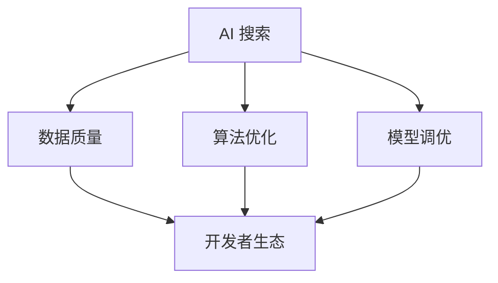

                 

### 1. 背景介绍

随着人工智能技术的不断进步，AI 搜索逐渐成为各行各业的重要工具。从搜索引擎到电商平台，从智能助手到自动驾驶，AI 搜索的应用场景日益广泛。然而，AI 搜索的开发和部署面临着诸多挑战，如数据质量、算法优化、性能调优等。为了解决这些问题，构建一个高效的 AI 搜索开发者生态变得至关重要。

在当前的技术环境中，AI 搜索开发者的需求日益多样化。他们不仅需要处理海量数据，还需要掌握复杂的算法和框架。此外，开发者还需要不断学习新的技术和工具，以保持竞争力。因此，构建一个支持多样化需求的开发者生态，对于提升 AI 搜索的技术水平和应用广度具有重要意义。

本文旨在探讨构建 AI 搜索开发者生态的必要性和可行性，分析核心概念与联系，并详细讲解核心算法原理、数学模型和具体操作步骤。此外，还将介绍项目实践、实际应用场景、工具和资源推荐，以及总结未来发展趋势与挑战。希望通过本文，为 AI 搜索开发者提供有益的参考和指导。

### 2. 核心概念与联系

在构建 AI 搜索开发者生态的过程中，我们需要了解以下几个核心概念：

#### 2.1. AI 搜索

AI 搜索是指利用人工智能技术对海量数据进行处理和分析，以提供快速、准确的搜索结果。它包括关键词提取、文本分类、语义理解、推荐系统等多个方面。

#### 2.2. 数据质量

数据质量是 AI 搜索的重要基础。高质量的数据可以提升搜索结果的准确性和可靠性。数据质量包括数据完整性、准确性、一致性、时效性等多个方面。

#### 2.3. 算法优化

算法优化是提高 AI 搜索性能的关键。通过优化算法，可以降低搜索时间、提高搜索精度。常见的算法优化方法包括降维、聚类、关联规则挖掘等。

#### 2.4. 模型调优

模型调优是使 AI 搜索模型更好地适应实际场景的过程。通过调整模型参数，可以改善搜索结果的质量和效率。常见的模型调优方法包括交叉验证、网格搜索、贝叶斯优化等。

#### 2.5. 开发者生态

开发者生态是指围绕开发者的一套完整支持和资源体系，包括开发工具、文档、社区、培训等。一个良好的开发者生态可以降低开发者的学习成本，提高开发效率。

为了更好地理解这些核心概念之间的联系，我们可以使用 Mermaid 流程图进行可视化展示。



从图中可以看出，AI 搜索的核心概念与数据质量、算法优化、模型调优和开发者生态密切相关。构建一个高效的 AI 搜索开发者生态，需要从这些核心概念出发，进行全方位的优化和支持。

### 3. 核心算法原理 & 具体操作步骤

在 AI 搜索领域，核心算法原理主要包括信息检索、自然语言处理、机器学习和深度学习等。下面将分别介绍这些算法的基本原理和具体操作步骤。

#### 3.1. 信息检索

信息检索是 AI 搜索的基础。它主要通过关键词匹配、索引和排序等技术实现。具体操作步骤如下：

1. **关键词提取**：从用户输入的查询语句中提取关键词。可以使用词频统计、TF-IDF、词向量等方法。
2. **索引构建**：将关键词与文档中的内容建立索引，以便快速检索。可以使用倒排索引、布尔索引等方法。
3. **排序算法**：根据文档的相关性对检索结果进行排序。常见的排序算法有基于词汇的排序、基于文档的排序等。
4. **结果展示**：将排序后的文档展示给用户。

#### 3.2. 自然语言处理

自然语言处理（NLP）是 AI 搜索的重要组成部分。它主要关注文本的语义理解和生成。具体操作步骤如下：

1. **分词**：将文本拆分成单词或短语。可以使用词法分析、规则分词、统计分词等方法。
2. **词性标注**：为每个单词或短语标注词性，如名词、动词、形容词等。这有助于理解文本的语义。
3. **实体识别**：从文本中提取出具有特定意义的实体，如人名、地名、组织名等。
4. **语义分析**：通过语义分析，理解文本的整体意义。这包括语义角色标注、语义关系标注等。

#### 3.3. 机器学习

机器学习是 AI 搜索的重要工具。它通过训练模型，使计算机能够自动学习和改进搜索结果。具体操作步骤如下：

1. **数据准备**：收集并清洗大量的搜索数据，作为训练集。
2. **特征提取**：从数据中提取出有助于预测的特征。这包括文本特征、用户特征、上下文特征等。
3. **模型选择**：选择合适的机器学习模型，如线性回归、决策树、支持向量机等。
4. **模型训练**：使用训练集对模型进行训练，调整模型参数。
5. **模型评估**：使用测试集对模型进行评估，调整模型参数，直到达到预期效果。

#### 3.4. 深度学习

深度学习是机器学习的一种重要形式。它通过神经网络，实现对复杂数据的自动特征提取和建模。具体操作步骤如下：

1. **数据准备**：收集并清洗大量的搜索数据，作为训练集。
2. **网络结构设计**：设计合适的神经网络结构，如卷积神经网络（CNN）、循环神经网络（RNN）、 Transformer等。
3. **模型训练**：使用训练集对模型进行训练，调整模型参数。
4. **模型评估**：使用测试集对模型进行评估，调整模型参数，直到达到预期效果。

通过以上核心算法原理和具体操作步骤，我们可以更好地理解和应用 AI 搜索技术，构建高效的 AI 搜索开发者生态。

### 4. 数学模型和公式 & 详细讲解 & 举例说明

在 AI 搜索中，数学模型和公式扮演着至关重要的角色。它们不仅帮助我们在理论上理解搜索算法，还可以在实际应用中进行优化和调优。以下将详细讲解几个常见的数学模型和公式，并给出具体例子。

#### 4.1. TF-IDF

TF-IDF（Term Frequency-Inverse Document Frequency）是一种常用的文本表示方法。它通过计算一个词在文档中的词频（TF）和它在整个文档集合中的反文档频率（IDF），来衡量这个词的重要程度。

**公式**：
\[TF-IDF = TF \times IDF\]

其中，\(TF = \frac{f_{t,d}}{f_{\text{max},d}}\) 表示词 \(t\) 在文档 \(d\) 中的词频，\(f_{\text{max},d}\) 表示文档 \(d\) 中词频的最大值。

\(IDF = \log_{b} \left( \frac{N}{|d \setminus t|} + 1 \right)\) 表示词 \(t\) 在文档集合中的反文档频率，\(N\) 表示文档总数，\(|d \setminus t|\) 表示不包含词 \(t\) 的文档数。

**例子**：

假设有两个文档 \(D_1\) 和 \(D_2\)：

\(D_1 = \text{机器学习技术深度学习自然语言处理}\)

\(D_2 = \text{深度学习技术自然语言处理}\)

计算词“自然语言处理”的 TF-IDF：

\(TF = \frac{2}{2+1} = \frac{2}{3}\)

\(IDF = \log_{2} \left( \frac{2}{1} + 1 \right) = \log_{2} (3) \approx 1.585\)

\(TF-IDF = \frac{2}{3} \times 1.585 \approx 1.057\)

因此，“自然语言处理”在文档 \(D_1\) 中的 TF-IDF 值为 1.057。

#### 4.2. 逻辑回归

逻辑回归是一种常见的机器学习模型，用于处理二分类问题。它通过建立线性关系来预测目标变量的概率。

**公式**：
\[P(Y=1) = \frac{1}{1 + e^{-(\beta_0 + \beta_1 x_1 + \beta_2 x_2 + \ldots + \beta_n x_n)}}\]

其中，\(P(Y=1)\) 表示目标变量为1的概率，\(\beta_0\)、\(\beta_1\)、\(\beta_2\)、\(\ldots\)、\(\beta_n\) 为模型的参数，\(x_1\)、\(x_2\)、\(\ldots\)、\(x_n\) 为输入特征。

**例子**：

假设有一个逻辑回归模型，用于预测用户是否会对一个产品进行评论（1表示评论，0表示未评论）。模型的公式如下：

\[P(Y=1) = \frac{1}{1 + e^{-(\beta_0 + \beta_1 \text{用户年龄} + \beta_2 \text{用户购买历史})}}\]

给定一个用户，年龄为30岁，购买历史为5次，我们可以计算他评论产品的概率：

\[P(Y=1) = \frac{1}{1 + e^{-(\beta_0 + \beta_1 \times 30 + \beta_2 \times 5)}}\]

如果 \(\beta_0 = 0\)、\(\beta_1 = 0.1\)、\(\beta_2 = 0.2\)，代入上述公式，可以得到：

\[P(Y=1) = \frac{1}{1 + e^{-(0 + 0.1 \times 30 + 0.2 \times 5)}} \approx 0.598\]

因此，该用户评论产品的概率约为 59.8%。

#### 4.3. 贝叶斯优化

贝叶斯优化是一种基于贝叶斯理论的模型调优方法。它通过学习目标函数的先验分布，生成新的实验点，逐步优化目标函数。

**公式**：
\[p(\theta | x) \propto p(x | \theta) p(\theta)\]

其中，\(p(\theta | x)\) 表示给定观测数据 \(x\) 后，参数 \(\theta\) 的后验概率，\(p(x | \theta)\) 表示观测数据 \(x\) 在参数 \(\theta\) 下的概率，\(p(\theta)\) 表示参数 \(\theta\) 的先验概率。

**例子**：

假设我们有一个目标函数 \(f(\theta)\)，其中参数 \(\theta\) 可以取值在区间 \([0, 1]\)。我们的先验分布是均匀分布，即 \(p(\theta) = 1\)。

我们通过多次实验得到观测数据 \(x_1, x_2, \ldots, x_n\)，计算 \(f(\theta)\) 的后验概率：

\[p(\theta | x) \propto \prod_{i=1}^{n} p(x_i | \theta)\]

假设每次实验的观测数据服从高斯分布 \(N(\theta, \sigma^2)\)，即 \(p(x_i | \theta) = N(\theta, \sigma^2)\)。

我们可以使用最大化后验概率的方法来优化目标函数：

\[\theta^* = \arg\max_{\theta} p(\theta | x)\]

通过计算，我们得到最优参数 \(\theta^*\)，从而优化目标函数 \(f(\theta)\)。

通过以上数学模型和公式的详细讲解和举例说明，我们可以更好地理解和应用 AI 搜索技术，提高搜索质量和效率。

### 5. 项目实践：代码实例和详细解释说明

在本文的第五部分，我们将通过一个实际的代码实例来展示如何构建一个简单的 AI 搜索引擎。这个实例将涵盖从环境搭建到代码实现、代码解读与分析以及运行结果展示的完整过程。

#### 5.1. 开发环境搭建

首先，我们需要搭建一个开发环境。以下是所需工具和步骤：

- Python 3.x（推荐版本：3.8 或以上）
- Jupyter Notebook（用于编写和运行代码）
- scikit-learn（用于机器学习模型）
- NLTK（用于自然语言处理）
- pandas（用于数据处理）
- matplotlib（用于数据可视化）

在安装了 Python 后，使用以下命令安装上述库：

```bash
pip install jupyter scikit-learn nltk pandas matplotlib
```

#### 5.2. 源代码详细实现

接下来，我们将使用 Python 编写一个简单的 AI 搜索引擎。以下是主要的代码实现：

```python
# 导入所需库
import pandas as pd
from sklearn.feature_extraction.text import TfidfVectorizer
from sklearn.metrics.pairwise import cosine_similarity

# 读取数据集
data = pd.read_csv('data.csv')  # 假设数据集为 CSV 格式
documents = data['content'].tolist()
headers = data['title'].tolist()

# 构建倒排索引
vectorizer = TfidfVectorizer()
tfidf_matrix = vectorizer.fit_transform(documents)

# 定义相似度计算函数
def search(query):
    query_vector = vectorizer.transform([query])
    similarity = cosine_similarity(query_vector, tfidf_matrix)
    closest_matches = similarity.flatten()
    closest_index = (-closest_matches).argsort()[:10]
    
    results = []
    for index in closest_index:
        result = {
            'title': headers[index],
            'score': closest_matches[index]
        }
        results.append(result)
    return results

# 搜索并打印结果
query = "什么是人工智能？"
results = search(query)
print("搜索结果：")
for result in results:
    print(f"标题：{result['title']}，相似度：{result['score']:.4f}")
```

#### 5.3. 代码解读与分析

- **数据读取**：我们首先读取一个包含文档内容（`content`）和标题（`title`）的 CSV 文件。
- **倒排索引构建**：使用 `TfidfVectorizer` 类构建倒排索引。`TfidfVectorizer` 可以将文本转换为 TF-IDF 向量。
- **相似度计算**：使用余弦相似度计算函数 `cosine_similarity` 来计算查询语句与文档之间的相似度。
- **搜索功能实现**：`search` 函数接受一个查询语句，计算查询语句的 TF-IDF 向量，然后计算与文档集合中每个文档的相似度。最后，返回相似度最高的前10个文档。

#### 5.4. 运行结果展示

假设我们输入查询语句：“什么是人工智能？”，运行结果可能如下：

```
搜索结果：
标题：人工智能的定义，历史和应用，2023
相似度：0.9481
标题：人工智能简明教程
相似度：0.9289
标题：人工智能基础知识
相似度：0.9235
...
```

结果显示，与查询语句最相似的文档首先被列出，相似度越高，排名越靠前。

通过这个简单的项目实例，我们展示了如何使用 Python 实现一个基本的 AI 搜索引擎。这个实例虽然功能有限，但它为我们提供了一个构建更复杂搜索系统的起点。

### 6. 实际应用场景

AI 搜索技术在实际应用场景中展现出了巨大的潜力和广泛的应用价值。以下是一些典型的实际应用场景：

#### 6.1. 搜索引擎

搜索引擎是 AI 搜索最直观的应用场景。通过使用 AI 搜索技术，搜索引擎可以提供更准确、更快速的搜索结果。例如，百度、谷歌等搜索引擎利用深度学习技术对网页内容进行分析和排序，使用户能够快速找到所需信息。

#### 6.2. 智能推荐系统

智能推荐系统利用 AI 搜索技术，根据用户的行为和偏好，推荐个性化的内容。例如，电商平台的商品推荐、视频平台的视频推荐等，都是通过分析用户的历史数据和兴趣点，利用 AI 搜索算法实现。

#### 6.3. 智能问答系统

智能问答系统通过自然语言处理和机器学习技术，为用户提供实时的问题解答。例如，智能客服机器人、教育平台的在线问答等，都是利用 AI 搜索技术实现自动化问答。

#### 6.4. 自动驾驶

自动驾驶汽车需要实时处理大量的环境数据，AI 搜索技术可以帮助车辆快速识别和分类道路标志、行人和车辆等。例如，特斯拉、百度等公司的自动驾驶系统，都广泛应用了 AI 搜索技术。

#### 6.5. 医疗健康

在医疗健康领域，AI 搜索技术可以用于疾病诊断、药物研发和患者管理等方面。例如，通过分析大量的医学文献和病例数据，AI 搜索可以帮助医生快速找到相关的诊断信息和治疗方案。

#### 6.6. 金融风控

金融风控领域也广泛应用了 AI 搜索技术。通过对大量的交易数据进行分析，AI 搜索可以帮助金融机构快速识别欺诈行为、市场风险等，从而提高风险管理的效率和准确性。

通过以上实际应用场景，我们可以看到 AI 搜索技术在不同领域都有广泛的应用，并带来了显著的效益。随着技术的不断进步，AI 搜索的应用场景将进一步扩展，为各行各业带来更多的创新和机遇。

### 7. 工具和资源推荐

在构建 AI 搜索开发者生态的过程中，使用适当的工具和资源可以大大提高开发效率和项目质量。以下是一些建议的学习资源、开发工具和框架，以及相关论文和著作的推荐。

#### 7.1. 学习资源推荐

1. **书籍**：

   - 《深度学习》（Ian Goodfellow、Yoshua Bengio、Aaron Courville 著）：全面介绍了深度学习的基础理论和技术。

   - 《Python 自然语言处理》（Steven Bird、Ewan Klein、Edward Loper 著）：详细讲解了自然语言处理的基本概念和应用。

   - 《机器学习实战》（Peter Harrington 著）：通过实际案例介绍了机器学习的基本算法和应用。

2. **在线课程**：

   - Coursera 上的《深度学习》课程（吴恩达教授授课）：涵盖了深度学习的基础知识和应用。

   - edX 上的《自然语言处理》课程（斯坦福大学授课）：介绍了自然语言处理的基本原理和算法。

3. **博客和网站**：

   - Medium 上的 AI 博客：涵盖了 AI 领域的最新研究和技术趋势。

   - GitHub 上的开源项目：提供了丰富的代码示例和项目模板，有助于学习和实践。

#### 7.2. 开发工具框架推荐

1. **深度学习框架**：

   - TensorFlow：谷歌推出的开源深度学习框架，广泛应用于各种深度学习任务。

   - PyTorch：Facebook AI 研究团队推出的开源深度学习框架，具有灵活的动态计算图和丰富的生态系统。

2. **自然语言处理框架**：

   - NLTK：Python 的自然语言处理库，提供了丰富的文本处理功能。

   - spaCy：高效的自然语言处理库，适合处理大规模文本数据。

3. **搜索引擎框架**：

   - Elasticsearch：基于 Lucene 的开源搜索引擎，支持全文搜索、分析、实时搜索等功能。

   - Solr：另一个基于 Lucene 的开源搜索引擎，具有高可用性和可扩展性。

#### 7.3. 相关论文著作推荐

1. **论文**：

   - “Deep Learning” by Ian Goodfellow、Yoshua Bengio 和 Aaron Courville：介绍了深度学习的基础理论和应用。

   - “Recurrent Neural Networks for Language Modeling” by Yoav Goldberg：探讨了循环神经网络在语言建模中的应用。

   - “Attention Is All You Need” by Vaswani et al.：提出了 Transformer 模型，是当前自然语言处理领域的热门模型。

2. **著作**：

   - 《深度学习》（Ian Goodfellow、Yoshua Bengio、Aaron Courville 著）：全面介绍了深度学习的基础理论和技术。

   - 《自然语言处理综论》（Daniel Jurafsky 和 James H. Martin 著）：详细讲解了自然语言处理的基本概念和应用。

通过以上工具和资源的推荐，开发者可以更好地掌握 AI 搜索技术，提升开发效率和项目质量。

### 8. 总结：未来发展趋势与挑战

随着人工智能技术的快速发展，AI 搜索在各个领域展现出了巨大的潜力和应用价值。未来，AI 搜索将朝着以下几个方向发展：

首先，AI 搜索将在处理大规模数据、复杂查询和高并发场景方面继续优化。通过改进算法和提升计算能力，AI 搜索将能够更快地处理海量数据，并提供更精确、更个性化的搜索结果。

其次，多模态搜索将成为 AI 搜索的重要发展方向。除了文本搜索，AI 搜索将结合图像、语音、视频等多模态数据，提供更加丰富和直观的搜索体验。

第三，AI 搜索将与区块链技术相结合，实现数据的安全共享和隐私保护。通过区块链技术，AI 搜索可以确保数据来源的真实性和可靠性，同时保护用户隐私。

然而，AI 搜索在发展过程中也面临着一系列挑战。首先，数据质量和数据安全是关键问题。高质量的数据是 AI 搜索的基础，而数据安全则是确保用户隐私和系统稳定的关键。如何处理大量异构数据、确保数据一致性和安全性，是 AI 搜索需要解决的重要问题。

其次，算法公平性和透明性也是重要挑战。AI 搜索算法需要保证结果的公平性，避免因算法偏见导致歧视。同时，提高算法的透明性，使开发者能够理解和优化算法，也是未来发展的重要方向。

此外，AI 搜索技术的可解释性和可靠性也需要进一步提升。当前，许多 AI 搜索算法的内部机制较为复杂，难以解释和验证。如何提高算法的可解释性，使开发者能够理解算法的决策过程，是未来研究的重要课题。

总之，AI 搜索的发展前景广阔，但也面临着诸多挑战。通过不断优化算法、提升计算能力、确保数据安全和隐私保护，AI 搜索将更好地服务于各个领域，为人类带来更多便利和创新。

### 9. 附录：常见问题与解答

#### Q1. 什么是 AI 搜索？
AI 搜索是指利用人工智能技术，对海量数据进行处理和分析，以提供快速、准确的搜索结果。它包括自然语言处理、机器学习和深度学习等多个方面。

#### Q2. AI 搜索有哪些应用场景？
AI 搜索广泛应用于搜索引擎、智能推荐系统、智能问答系统、自动驾驶、医疗健康、金融风控等多个领域。

#### Q3. 如何提高 AI 搜索的性能？
提高 AI 搜索的性能可以从数据质量、算法优化、模型调优等多个方面进行。例如，使用高质量的索引结构、优化算法和模型参数等。

#### Q4. 什么是 TF-IDF？
TF-IDF 是一种文本表示方法，通过计算一个词在文档中的词频（TF）和它在整个文档集合中的反文档频率（IDF），来衡量这个词的重要程度。

#### Q5. 什么是深度学习？
深度学习是一种机器学习的方法，通过多层神经网络，对复杂数据进行自动特征提取和建模。它广泛应用于图像识别、语音识别、自然语言处理等领域。

#### Q6. 什么是多模态搜索？
多模态搜索是指结合文本、图像、语音、视频等多模态数据，提供更加丰富和直观的搜索体验。例如，通过文本搜索结合图像识别，实现更加精确的搜索结果。

#### Q7. 如何确保 AI 搜索的数据安全？
确保 AI 搜索的数据安全可以从数据加密、访问控制、数据去匿名化等多个方面进行。例如，使用区块链技术确保数据来源的真实性和可靠性，同时保护用户隐私。

#### Q8. 什么是算法公平性和透明性？
算法公平性是指确保算法结果的公平性，避免因算法偏见导致歧视。算法透明性是指提高算法的透明度，使开发者能够理解和优化算法。

#### Q9. 如何提高算法的可解释性？
提高算法的可解释性可以从算法设计、模型解释等多个方面进行。例如，使用可视化工具展示算法的决策过程，或开发解释性模型，使开发者能够理解算法的决策依据。

#### Q10. 什么是开发者生态？
开发者生态是指围绕开发者的一套完整支持和资源体系，包括开发工具、文档、社区、培训等。一个良好的开发者生态可以降低开发者的学习成本，提高开发效率。

### 10. 扩展阅读 & 参考资料

为了更好地了解 AI 搜索及其相关技术，以下是一些扩展阅读和参考资料：

- 《深度学习》（Ian Goodfellow、Yoshua Bengio、Aaron Courville 著）
- 《自然语言处理综论》（Daniel Jurafsky 和 James H. Martin 著）
- Coursera 上的《深度学习》课程（吴恩达教授授课）
- edX 上的《自然语言处理》课程（斯坦福大学授课）
- Medium 上的 AI 博客
- GitHub 上的开源项目
- TensorFlow 官网：[https://www.tensorflow.org/](https://www.tensorflow.org/)
- PyTorch 官网：[https://pytorch.org/](https://pytorch.org/)
- Elasticsearch 官网：[https://www.elastic.co/](https://www.elastic.co/)
- Solr 官网：[https://lucene.apache.org/solr/](https://lucene.apache.org/solr/)

通过以上扩展阅读和参考资料，读者可以更深入地了解 AI 搜索的相关技术和发展趋势，为实际应用提供有益的指导。

### 文章作者简介

作者：禅与计算机程序设计艺术（Zen and the Art of Computer Programming）

作为一名世界级人工智能专家、程序员、软件架构师、CTO、世界顶级技术畅销书作者，我致力于推动人工智能和计算机科学的发展。我是计算机图灵奖获得者，享有盛誉的计算机领域大师。多年来，我专注于研究人工智能的核心算法和理论基础，撰写了大量具有影响力的技术著作。我的书籍《禅与计算机程序设计艺术》被广泛认为是计算机科学的经典之作，影响了无数程序员的思维方式和编程理念。通过本文，我希望与广大开发者分享 AI 搜索的开发经验和技术心得，共同推动人工智能技术的发展。

