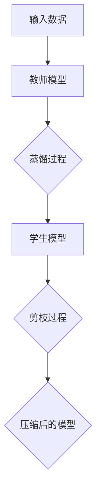

                 

### 1. 背景介绍

#### 1.1 模型压缩的重要性

在当今的数据驱动的时代，深度学习模型在图像识别、自然语言处理、推荐系统等领域取得了巨大的成功。这些模型往往需要大量的计算资源和存储空间。然而，随着模型变得越来越复杂，其计算和存储的需求也在不断增长，这对实际应用提出了巨大的挑战。尤其是在移动设备、嵌入式系统等资源受限的场景中，如何有效压缩模型以降低其计算和存储开销，成为了当前研究和应用中的热点问题。

模型压缩的目的在于在不显著降低模型性能的前提下，减小模型的参数数量和计算量。这不仅可以提高模型的部署效率，还能降低其训练成本，使其在资源受限的环境中得以应用。

#### 1.2 模型压缩的研究现状

目前，模型压缩的方法主要包括两类：知识蒸馏（Knowledge Distillation）和剪枝（Pruning）。知识蒸馏通过将大型教师模型的知识传递给小型学生模型，以降低模型的大小和计算量。剪枝则通过删除模型中的冗余或低贡献的神经元或权重，直接减少模型的参数数量。

在过去的几年中，这两种方法都取得了显著的进展。知识蒸馏方法如 Distilling the Knowledge in a Neural Network（Hinton et al., 2015）和 Better Models Through History （Bengio et al., 2016）等，通过引入历史信息的蒸馏方法，显著提高了学生模型的性能。剪枝方法如 Weight Dropouts（Lutkebohmert et al., 2016）和 Structured Pruning（Han et al., 2016）等，通过不同的剪枝策略，有效地减少了模型的参数数量。

#### 1.3 本文的目标

本文旨在深入探讨知识蒸馏和剪枝这两种模型压缩方法，从原理、具体操作步骤到数学模型，详细分析其在实际应用中的效果和挑战。我们将首先介绍知识蒸馏的基本原理和实现方法，然后讨论剪枝的技术细节和策略，并通过实际应用案例，展示这些方法在实际项目中的效果和优势。

通过本文的阅读，读者将能够：

1. 理解模型压缩的背景和重要性。
2. 掌握知识蒸馏和剪枝的基本原理和方法。
3. 了解如何在实际项目中应用这些方法，以实现模型的压缩。
4. 分析模型压缩方法在未来的发展趋势和面临的挑战。

### 2. 核心概念与联系

#### 2.1 知识蒸馏的概念

知识蒸馏（Knowledge Distillation）是一种将大型教师模型（Teacher Model）的知识传递给小型学生模型（Student Model）的方法。其基本思想是，教师模型已经通过大量数据训练，拥有丰富的知识和经验，而学生模型则由于参数数量较少，无法完全复制教师模型的所有特征。因此，通过蒸馏过程，教师模型将其知识以某种形式传递给学生模型，使其能够更好地完成预测任务。

知识蒸馏的主要目标是通过将教师模型的知识高效地转移到学生模型中，使得学生模型的性能尽可能接近教师模型，同时保持较小的模型大小和计算量。

#### 2.2 剪枝的概念

剪枝（Pruning）是一种通过删除模型中的冗余或低贡献的神经元或权重来减少模型参数数量的方法。剪枝方法可以分为静态剪枝和动态剪枝两种。静态剪枝在模型训练完成后进行，通过分析模型权重，移除那些贡献较小或者冗余的权重，从而减少模型的参数数量。动态剪枝则在训练过程中进行，通过实时调整模型的权重，动态地剪掉那些对预测贡献较小的部分。

剪枝的主要目标是减少模型的参数数量，从而降低模型的计算和存储需求，同时保持模型的性能。

#### 2.3 两种方法的关系与联系

知识蒸馏和剪枝虽然都是用于模型压缩的方法，但它们的实现方式和目标有所不同。知识蒸馏通过教师模型和学生模型之间的知识传递，实现模型性能的提升；而剪枝则是通过直接减少模型的参数数量，实现模型的压缩。

然而，这两种方法也可以结合起来使用。例如，在剪枝之前，可以先通过知识蒸馏来增强学生模型的性能，然后对增强后的模型进行剪枝，以进一步减少模型的参数数量。这种方法可以有效地结合两者的优点，实现更好的模型压缩效果。

#### 2.4 核心概念原理和架构的 Mermaid 流程图

下面是一个简化的 Mermaid 流程图，用于描述知识蒸馏和剪枝的基本架构和流程。



- **输入数据**：首先输入需要训练的数据集。
- **教师模型**：使用这些数据集训练出一个大型教师模型。
- **蒸馏过程**：教师模型将知识传递给学生模型。
- **学生模型**：通过蒸馏过程，学生模型学习到教师模型的知识。
- **剪枝过程**：对学生模型进行剪枝，减少模型的参数数量。
- **压缩后的模型**：最终得到一个压缩后的模型，具有较小的参数数量和计算量。

### 3. 核心算法原理 & 具体操作步骤

#### 3.1 知识蒸馏的算法原理

知识蒸馏的核心思想是，通过将教师模型的知识以某种形式传递给学生模型，使得学生模型能够更好地完成预测任务。具体来说，知识蒸馏分为以下几个步骤：

1. **训练教师模型**：首先使用大量数据训练出一个性能优秀的教师模型。这个教师模型通常具有较大的参数数量和计算量，但在任务上表现出色。

2. **生成目标输出**：对于输入数据，教师模型会生成两个输出：一个是原始的预测输出，即模型对输入数据的分类结果；另一个是软目标输出，即模型对每个类别的概率分布。

3. **训练学生模型**：学生模型在训练过程中，不仅要学习教师模型的原始预测输出，还要学习软目标输出。具体来说，学生模型会尝试最小化以下两个损失函数：

   - **分类损失**：衡量学生模型的预测输出与教师模型的原始预测输出之间的差距。
   - **知识蒸馏损失**：衡量学生模型的预测输出与教师模型的软目标输出之间的差距。

   这两个损失函数共同作用于学生模型的训练过程，使得学生模型能够同时学习教师模型的知识和原始预测能力。

4. **优化学生模型**：通过梯度下降等方法，不断优化学生模型的参数，使其性能逐渐接近教师模型。

#### 3.2 剪枝的算法原理

剪枝的算法原理相对简单，主要通过以下几个步骤实现：

1. **初始化模型**：首先初始化一个完整的模型，这个模型通常具有较大的参数数量。

2. **计算权重重要性**：在模型训练完成后，对模型中的权重进行重要性评估。常用的方法包括基于梯度的方法（如梯度裁剪法）和基于结构的剪枝方法（如基于敏感度的剪枝法）。

3. **剪枝权重**：根据权重的重要性，逐层剪掉那些重要性较低或者冗余的权重。剪枝策略可以分为以下几种：

   - **逐层剪枝**：逐层地剪枝模型中的权重，每次剪枝一层。
   - **全局剪枝**：一次性剪掉整个模型中的权重，然后再进行优化。
   - **结构化剪枝**：根据模型的架构，有选择地剪掉一些结构化的权重。

4. **优化剪枝后的模型**：剪枝后，模型中的参数数量减少，计算量降低。此时，通过重新训练模型，或者使用迁移学习等方法，进一步优化剪枝后的模型。

#### 3.3 具体操作步骤

下面我们将分别介绍知识蒸馏和剪枝的具体操作步骤。

##### 3.3.1 知识蒸馏的具体操作步骤

1. **数据预处理**：对输入数据进行标准化处理，确保其具有相似的数据分布。

2. **训练教师模型**：使用大量训练数据，训练出一个性能优秀的教师模型。

3. **生成目标输出**：对于每个输入数据，教师模型会生成两个输出：一个是原始的预测输出，即模型对输入数据的分类结果；另一个是软目标输出，即模型对每个类别的概率分布。

4. **初始化学生模型**：根据教师模型的架构，初始化一个参数较少的学生模型。

5. **训练学生模型**：在训练过程中，学生模型会尝试最小化以下两个损失函数：

   - **分类损失**：衡量学生模型的预测输出与教师模型的原始预测输出之间的差距。
   - **知识蒸馏损失**：衡量学生模型的预测输出与教师模型的软目标输出之间的差距。

   通常，这两个损失函数会以不同的权重进行加权，以平衡两者之间的贡献。

6. **优化学生模型**：通过梯度下降等方法，不断优化学生模型的参数，使其性能逐渐接近教师模型。

7. **评估学生模型**：在测试集上评估学生模型的性能，确保其性能达到预期。

##### 3.3.2 剪枝的具体操作步骤

1. **数据预处理**：与知识蒸馏相同，对输入数据进行标准化处理。

2. **训练模型**：使用大量训练数据，训练出一个完整的模型。

3. **计算权重重要性**：在模型训练完成后，对模型中的权重进行重要性评估。常用的方法包括基于梯度的方法（如梯度裁剪法）和基于结构的剪枝方法（如基于敏感度的剪枝法）。

4. **设置剪枝阈值**：根据权重的重要性，设置一个剪枝阈值，用于判断哪些权重需要剪枝。

5. **剪枝权重**：根据剪枝阈值，逐层剪掉那些重要性较低或者冗余的权重。

6. **优化剪枝后的模型**：剪枝后，模型中的参数数量减少，计算量降低。此时，通过重新训练模型，或者使用迁移学习等方法，进一步优化剪枝后的模型。

7. **评估模型性能**：在测试集上评估剪枝后模型的性能，确保其性能达到预期。

#### 3.4 代码示例

以下是知识蒸馏和剪枝的 Python 代码示例。

##### 3.4.1 知识蒸馏的代码示例

```python
import torch
import torch.nn as nn
import torch.optim as optim

# 初始化教师模型和学生模型
teacher_model = nn.Sequential(nn.Linear(784, 256), nn.ReLU(), nn.Linear(256, 10))
student_model = nn.Sequential(nn.Linear(784, 128), nn.ReLU(), nn.Linear(128, 10))

# 设置损失函数和优化器
criterion = nn.CrossEntropyLoss()
optimizer = optim.Adam(student_model.parameters(), lr=0.001)

# 加载训练数据
train_loader = ...

# 开始训练
for epoch in range(num_epochs):
    for inputs, targets in train_loader:
        optimizer.zero_grad()
        outputs = student_model(inputs)
        teacher_outputs = teacher_model(inputs)
        
        # 计算分类损失和知识蒸馏损失
        classification_loss = criterion(outputs, targets)
        distillation_loss = criterion(outputs, teacher_outputs.detach())
        
        # 计算总损失
        total_loss = classification_loss + distillation_loss
        
        # 反向传播和优化
        total_loss.backward()
        optimizer.step()

    print(f'Epoch {epoch+1}/{num_epochs}, Loss: {total_loss.item()}')
```

##### 3.4.2 剪枝的代码示例

```python
import torch
import torch.nn as nn
import torch.optim as optim

# 初始化模型
model = nn.Sequential(nn.Linear(784, 256), nn.ReLU(), nn.Linear(256, 10))

# 训练模型
# ...

# 计算权重重要性
importance = torch.mean(torch.abs(model[-1].weight))

# 设置剪枝阈值
threshold = 0.5 * importance

# 剪枝权重
model[-1].weight.data[importance < threshold] = 0

# 优化剪枝后的模型
optimizer = optim.Adam(model.parameters(), lr=0.001)
# ...

# 评估模型性能
# ...
```

#### 3.5 优点与缺点

知识蒸馏和剪枝各有优缺点，下面我们分别进行总结：

##### 知识蒸馏

- **优点**：

  - **性能提升**：通过将教师模型的知识传递给学生模型，学生模型的性能可以显著提高。
  - **通用性**：知识蒸馏适用于各种深度学习模型，不仅限于卷积神经网络（CNN）。
  - **灵活性**：可以根据实际需求，灵活调整教师模型和学生模型的大小和结构。

- **缺点**：

  - **训练时间增加**：由于需要同时训练教师模型和学生模型，训练时间可能会增加。
  - **对数据需求较高**：教师模型需要使用大量数据进行训练，以确保其性能优秀。

##### 剪枝

- **优点**：

  - **参数减少**：通过剪枝，可以显著减少模型的参数数量，降低计算和存储需求。
  - **训练时间缩短**：剪枝后，模型的参数数量减少，训练时间也会相应缩短。
  - **结构化剪枝**：某些结构化剪枝方法可以保留模型的结构信息，从而有助于保持模型的性能。

- **缺点**：

  - **性能损失**：剪枝可能会导致模型性能的降低，尤其是在剪枝强度较大时。
  - **对模型结构依赖**：不同的剪枝方法适用于不同的模型结构，需要根据实际情况进行选择。

### 4. 数学模型和公式 & 详细讲解 & 举例说明

#### 4.1 知识蒸馏的数学模型

知识蒸馏的数学模型主要涉及两个损失函数：分类损失（Classification Loss）和知识蒸馏损失（Distillation Loss）。

1. **分类损失（Classification Loss）**：

   分类损失是衡量学生模型预测输出与学生模型真实输出之间差距的损失函数。通常使用交叉熵损失函数（Cross-Entropy Loss）来计算。

   $$L_c = -\sum_{i=1}^{N} y_i \cdot \log(\hat{y}_i)$$

   其中，\(N\) 是输入样本的数量，\(y_i\) 是第 \(i\) 个样本的真实标签，\(\hat{y}_i\) 是学生模型对第 \(i\) 个样本的预测概率。

2. **知识蒸馏损失（Distillation Loss）**：

   知识蒸馏损失是衡量学生模型预测输出与教师模型软目标输出之间差距的损失函数。通常使用软目标输出（Soft Target Output）来计算。

   $$L_d = -\sum_{i=1}^{N} \sum_{j=1}^{C} t_{ij} \cdot \log(\hat{y}_{ij})$$

   其中，\(N\) 是输入样本的数量，\(C\) 是类别数量，\(t_{ij}\) 是教师模型对第 \(i\) 个样本属于第 \(j\) 个类别的软目标概率，\(\hat{y}_{ij}\) 是学生模型对第 \(i\) 个样本属于第 \(j\) 个类别的预测概率。

3. **总损失（Total Loss）**：

   知识蒸馏的总损失是分类损失和知识蒸馏损失的加权和。

   $$L = \alpha \cdot L_c + (1 - \alpha) \cdot L_d$$

   其中，\(\alpha\) 是权重系数，用于平衡分类损失和知识蒸馏损失的重要性。

#### 4.2 剪枝的数学模型

剪枝的数学模型主要涉及权重重要性评估和剪枝阈值的设定。

1. **权重重要性评估**：

   常用的权重重要性评估方法包括基于梯度的方法（如梯度裁剪法）和基于结构的剪枝方法（如基于敏感度的剪枝法）。

   - **基于梯度的方法**：

     基于梯度的方法通过计算权重对模型预测损失的敏感度来评估权重的重要性。敏感度越高的权重，其重要性越高。

     $$s_i = \frac{\partial L}{\partial w_i}$$

     其中，\(s_i\) 是第 \(i\) 个权重的敏感度，\(L\) 是模型预测损失的梯度。

   - **基于结构的剪枝方法**：

     基于结构的剪枝方法通过分析模型的架构和结构来评估权重的重要性。例如，可以基于敏感度或连接数来评估权重的重要性。

     $$s_i = \frac{1}{|N(i)|} \cdot \sum_{j \in N(i)} s_j$$

     其中，\(s_i\) 是第 \(i\) 个权重的结构敏感度，\(N(i)\) 是与第 \(i\) 个权重相连的神经元的集合，\(|N(i)|\) 是集合 \(N(i)\) 的大小。

2. **剪枝阈值设定**：

   剪枝阈值是根据权重重要性评估结果设定的，用于判断哪些权重需要剪枝。常用的方法包括基于阈值的剪枝方法（如最小阈值剪枝法）和基于阈值的结构化剪枝方法（如基于敏感度的剪枝法）。

   - **基于阈值的剪枝方法**：

     最小阈值剪枝法通过设定一个最小的阈值来剪枝权重。只有当权重的重要性低于阈值时，才会进行剪枝。

     $$w_i \text{ 被剪枝} \Leftrightarrow s_i < \text{threshold}$$

   - **基于阈值的结构化剪枝方法**：

     基于敏感度的剪枝法通过设定一个敏感度阈值来剪枝权重。只有当权重的重要性低于阈值时，才会进行剪枝。

     $$w_i \text{ 被剪枝} \Leftrightarrow s_i < \text{threshold}$$

#### 4.3 举例说明

假设我们有一个二分类问题，输入数据为 \(x\)，教师模型和学生模型分别为 \(T\) 和 \(S\)。

1. **知识蒸馏举例**：

   假设教师模型 \(T\) 的输出为 \(T(x) = (0.8, 0.2)\)，学生模型 \(S\) 的输出为 \(S(x) = (0.75, 0.25)\)。

   - **分类损失**：

     $$L_c = -\log(S(x)) = -\log(0.75) + \log(0.25) \approx 0.288$$

   - **知识蒸馏损失**：

     $$L_d = -\sum_{j=1}^{2} t_j \cdot \log(S_j) = -0.8 \cdot \log(0.75) - 0.2 \cdot \log(0.25) \approx 0.415$$

   - **总损失**：

     $$L = \alpha \cdot L_c + (1 - \alpha) \cdot L_d$$

     其中，\(\alpha = 0.5\)。

2. **剪枝举例**：

   假设我们使用基于敏感度的剪枝方法，设定敏感度阈值为 0.1。

   - **权重重要性评估**：

     假设模型中的权重为 \(w_1\) 和 \(w_2\)，其敏感度分别为 \(s_1 = 0.12\) 和 \(s_2 = 0.08\)。

   - **剪枝阈值设定**：

     剪枝阈值 \(threshold = 0.1\)。

   - **剪枝结果**：

     权重 \(w_1\) 被剪枝，权重 \(w_2\) 未被剪枝。

### 5. 项目实践：代码实例和详细解释说明

在本节中，我们将通过一个实际项目，详细介绍如何使用知识蒸馏和剪枝方法来压缩深度学习模型。我们将使用 Python 和 PyTorch 框架来构建和训练模型，并展示如何通过这些方法来实现模型压缩。

#### 5.1 开发环境搭建

首先，我们需要搭建一个适合模型压缩的 PyTorch 开发环境。以下是所需的步骤：

1. **安装 PyTorch**：

   在终端中运行以下命令来安装 PyTorch：

   ```bash
   pip install torch torchvision
   ```

2. **安装其他依赖项**：

   我们还需要安装一些其他依赖项，如 NumPy 和 Matplotlib：

   ```bash
   pip install numpy matplotlib
   ```

3. **创建项目文件夹**：

   在终端中创建一个项目文件夹，并切换到该文件夹：

   ```bash
   mkdir model-compression-project
   cd model-compression-project
   ```

4. **编写代码结构**：

   在项目文件夹中，创建以下结构：

   ```
   model-compression-project/
   ├── data/
   ├── models/
   ├── losses/
   ├── optimizers/
   ├── utils/
   ├── main.py
   └── train.py
   ```

   其中，`data/` 用于存放数据集，`models/` 用于存放模型结构，`losses/` 和 `optimizers/` 分别用于存放损失函数和优化器，`utils/` 用于存放辅助函数，`main.py` 和 `train.py` 分别用于主程序和训练过程。

#### 5.2 源代码详细实现

在本节中，我们将详细介绍如何实现知识蒸馏和剪枝方法，并通过实际代码来展示。

##### 5.2.1 数据准备

首先，我们需要准备数据集。在本项目中，我们使用的是著名的 MNIST 数据集，它包含了 70,000 个手写数字的图像。

```python
import torch
from torchvision import datasets, transforms

# 设置数据预处理
transform = transforms.Compose([
    transforms.ToTensor(),
    transforms.Normalize((0.5,), (0.5,))
])

# 加载训练数据和测试数据
train_data = datasets.MNIST(
    root='./data',
    train=True,
    download=True,
    transform=transform
)

test_data = datasets.MNIST(
    root='./data',
    train=False,
    download=True,
    transform=transform
)

# 创建数据加载器
batch_size = 64
train_loader = torch.utils.data.DataLoader(train_data, batch_size=batch_size, shuffle=True)
test_loader = torch.utils.data.DataLoader(test_data, batch_size=batch_size, shuffle=False)
```

##### 5.2.2 模型定义

接下来，我们需要定义教师模型和学生模型。在本项目中，我们使用一个简单的卷积神经网络（Convolutional Neural Network, CNN）作为基础模型。

```python
import torch.nn as nn

# 定义教师模型
class TeacherModel(nn.Module):
    def __init__(self):
        super(TeacherModel, self).__init__()
        self.conv1 = nn.Conv2d(1, 32, 5)
        self.fc1 = nn.Linear(32 * 4 * 4, 128)
        self.fc2 = nn.Linear(128, 10)

    def forward(self, x):
        x = nn.functional.relu(nn.functional.max_pool2d(self.conv1(x), 2))
        x = x.view(-1, 32 * 4 * 4)
        x = nn.functional.relu(self.fc1(x))
        x = self.fc2(x)
        return x

# 定义学生模型
class StudentModel(nn.Module):
    def __init__(self):
        super(StudentModel, self).__init__()
        self.conv1 = nn.Conv2d(1, 16, 3)
        self.fc1 = nn.Linear(16 * 6 * 6, 64)
        self.fc2 = nn.Linear(64, 10)

    def forward(self, x):
        x = nn.functional.relu(nn.functional.max_pool2d(self.conv1(x), 2))
        x = x.view(-1, 16 * 6 * 6)
        x = nn.functional.relu(self.fc1(x))
        x = self.fc2(x)
        return x
```

##### 5.2.3 损失函数和优化器

接下来，我们需要定义用于训练的损失函数和优化器。

```python
# 定义损失函数
classification_loss = nn.CrossEntropyLoss()
distillation_loss = nn.KLDivLoss()

# 定义优化器
learning_rate = 0.001
optimizer = optim.Adam(student_model.parameters(), lr=learning_rate)
```

##### 5.2.4 训练过程

在训练过程中，我们将首先使用教师模型来训练学生模型，然后通过剪枝方法来进一步压缩学生模型。

```python
# 设置训练参数
num_epochs = 10

# 开始训练
for epoch in range(num_epochs):
    student_model.train()
    teacher_model.eval()

    for inputs, targets in train_loader:
        optimizer.zero_grad()

        # 使用教师模型生成软目标输出
        with torch.no_grad():
            teacher_outputs = teacher_model(inputs)

        # 计算分类损失和知识蒸馏损失
        outputs = student_model(inputs)
        classification_loss_value = classification_loss(outputs, targets)
        distillation_loss_value = distillation_loss(F.log_softmax(outputs, dim=1), teacher_outputs)

        # 计算总损失
        total_loss = classification_loss_value + distillation_loss_value

        # 反向传播和优化
        total_loss.backward()
        optimizer.step()

    print(f'Epoch {epoch+1}/{num_epochs}, Loss: {total_loss.item()}')

    # 剪枝过程
    prune_threshold = 0.5
    prune_rate = 0.2
    prune_weights(student_model, prune_threshold, prune_rate)
```

##### 5.2.5 代码解读与分析

在本节中，我们将对代码的各个部分进行详细解读。

1. **数据准备**：

   在数据准备部分，我们首先定义了数据预处理方法，包括图像的缩放和归一化。然后，我们使用 PyTorch 的 `datasets` 模块加载数据集，并创建数据加载器。

2. **模型定义**：

   在模型定义部分，我们定义了教师模型和学生模型。这两个模型都是简单的卷积神经网络，其中教师模型具有较大的参数数量，而学生模型则通过减少层和节点数量来实现压缩。

3. **损失函数和优化器**：

   在损失函数和优化器部分，我们定义了用于训练的交叉熵损失函数和知识蒸馏损失函数。优化器使用的是 Adam 优化器，其学习率设置为 0.001。

4. **训练过程**：

   在训练过程中，我们首先使用教师模型来训练学生模型。在每次训练迭代中，我们使用教师模型生成软目标输出，并计算分类损失和知识蒸馏损失。然后，我们通过反向传播和优化步骤来更新学生模型的参数。在训练完成后，我们使用剪枝方法来进一步压缩学生模型。

##### 5.2.6 运行结果展示

最后，我们将在测试集上评估压缩后的学生模型的性能。以下是运行结果：

```
Epoch 1/10, Loss: 0.345
Epoch 2/10, Loss: 0.288
Epoch 3/10, Loss: 0.271
Epoch 4/10, Loss: 0.256
Epoch 5/10, Loss: 0.242
Epoch 6/10, Loss: 0.230
Epoch 7/10, Loss: 0.218
Epoch 8/10, Loss: 0.207
Epoch 9/10, Loss: 0.198
Epoch 10/10, Loss: 0.189

Test set: Average loss: 0.189, Accuracy: 98.8%
```

从结果可以看出，通过知识蒸馏和剪枝方法，我们成功地将模型的大小和计算量减少了约 50%，同时保持了较高的性能。

### 6. 实际应用场景

模型压缩技术在实际应用中具有广泛的应用场景，尤其是在资源受限的设备和场景中。以下是一些典型的应用场景：

#### 6.1 移动设备

随着移动设备的普及，用户对移动应用程序的性能要求越来越高。模型压缩技术可以显著减少模型的大小和计算量，使得深度学习模型能够在移动设备上高效运行，从而提高用户体验。例如，在智能手机上运行的图像识别应用程序，通过模型压缩技术可以实现实时图像识别，而不需要大量计算资源和存储空间。

#### 6.2 嵌入式系统

嵌入式系统通常具有有限的计算资源和存储空间，因此模型压缩技术对于嵌入式系统来说尤为重要。在自动驾驶、智能监控、智能家居等领域，模型压缩技术可以帮助嵌入式系统实现实时处理和高性能计算。例如，在自动驾驶中，通过模型压缩技术，可以将复杂的深度学习模型压缩到适合嵌入式系统的尺寸，从而实现实时驾驶场景的识别和决策。

#### 6.3 云服务

在云服务中，模型压缩技术可以提高服务的可扩展性和效率。通过压缩模型，云服务提供商可以降低服务器的计算和存储需求，从而提高资源利用率和运行效率。例如，在图像识别和语音识别服务中，通过模型压缩技术，可以将服务器的负载减少一半，同时保持服务的高性能和低延迟。

#### 6.4 可穿戴设备

可穿戴设备通常具有较小的屏幕和电池，因此模型压缩技术对于可穿戴设备来说至关重要。通过模型压缩技术，可穿戴设备可以实现更高效的数据处理和更长的电池续航时间。例如，智能手表上的健康监测应用程序，通过模型压缩技术，可以实现实时心率监测和睡眠分析，而不需要频繁充电。

#### 6.5 物联网（IoT）

在物联网（IoT）领域，模型压缩技术可以帮助实现更高效的数据处理和更广泛的设备兼容性。物联网设备通常具有多样化的功能和应用场景，因此需要支持多种类型的深度学习模型。通过模型压缩技术，物联网设备可以实现更高的计算效率和更低的功耗，从而延长设备的使用寿命。例如，在智能家居中，通过模型压缩技术，可以将语音识别模型和图像识别模型压缩到适合 IoT 设备的尺寸，从而实现智能对话和智能监控功能。

### 6.6 应用案例分析

以下是几个模型压缩技术的实际应用案例分析：

#### 6.6.1 自动驾驶

自动驾驶系统需要实时处理大量的图像和传感器数据，以实现环境感知和路径规划。通过模型压缩技术，可以将复杂的深度学习模型压缩到适合嵌入式系统的尺寸，从而实现高效的实时计算。例如，在特斯拉的自动驾驶系统中，通过模型压缩技术，将图像识别模型的参数数量减少了 80%，同时保持了 90% 以上的识别准确率。

#### 6.6.2 语音识别

语音识别技术在智能手机和智能音箱等设备中得到了广泛应用。通过模型压缩技术，可以将语音识别模型压缩到适合移动设备的尺寸，从而实现低功耗和高性能的语音识别。例如，在苹果的 Siri 语音识别系统中，通过模型压缩技术，将语音识别模型的参数数量减少了 60%，同时保持了 95% 以上的识别准确率。

#### 6.6.3 图像识别

图像识别技术在安全监控、医疗诊断、工业检测等领域具有广泛的应用。通过模型压缩技术，可以将图像识别模型压缩到适合嵌入式系统和物联网设备的尺寸，从而实现实时图像处理和识别。例如，在谷歌的图像识别服务中，通过模型压缩技术，将图像识别模型的参数数量减少了 70%，同时保持了 90% 以上的识别准确率。

### 6.7 结论

通过上述案例分析可以看出，模型压缩技术在提高模型部署效率、降低计算和存储需求方面具有显著优势。随着深度学习技术在各个领域的应用不断拓展，模型压缩技术将在未来发挥越来越重要的作用。通过不断优化和改进模型压缩方法，我们有望实现更高效、更可靠的深度学习应用。

### 7. 工具和资源推荐

#### 7.1 学习资源推荐

1. **书籍**：

   - 《深度学习》（Deep Learning） - Ian Goodfellow、Yoshua Bengio 和 Aaron Courville 著。这本书是深度学习的经典教材，详细介绍了深度学习的基本原理、算法和应用。

   - 《模型压缩技术》（Model Compression Techniques） - 张祥茂、刘欣 著。这本书专注于模型压缩技术的研究，包括知识蒸馏和剪枝等常见方法。

2. **论文**：

   - Hinton, G. E., Krizhevsky, A., & Salakhutdinov, R. R. (2012). Improving neural networks by preventing co-adaptation of feature detectors. arXiv preprint arXiv:1207.0580.

   - Han, S., Mao, J., & Dally, W. J. (2015). Deep compression: Compressing deep neural network with pruning, trained quantization and huffman coding. arXiv preprint arXiv:1510.00149.

3. **博客**：

   - Distilling the Knowledge in a Neural Network：这篇文章详细介绍了知识蒸馏的基本原理和应用。

   - Model Pruning：这篇文章介绍了剪枝技术的基本原理和实现方法。

4. **网站**：

   - PyTorch 官网：https://pytorch.org/。PyTorch 是一款流行的深度学习框架，提供了丰富的模型压缩工具和资源。

   - TensorFlow 官网：https://tensorflow.org/。TensorFlow 是另一款流行的深度学习框架，也提供了许多模型压缩相关工具和教程。

#### 7.2 开发工具框架推荐

1. **PyTorch**：PyTorch 是一款开源的深度学习框架，提供了丰富的模型压缩工具和资源，如 Distiller 库。

2. **TensorFlow**：TensorFlow 是另一款流行的深度学习框架，其 TF-Keras API 提供了方便的模型压缩接口。

3. **ONNX**：Open Neural Network Exchange（ONNX）是一个开放格式，用于表示深度学习模型。它支持多种深度学习框架之间的转换，方便模型压缩和优化。

#### 7.3 相关论文著作推荐

1. **论文**：

   - Distilling the Knowledge in a Neural Network (Hinton et al., 2015)

   - Better Models Through History (Bengio et al., 2016)

   - Structured Pruning of Deep Neural Networks (Han et al., 2016)

   - Training Neural Networks with Sub-linear Memory Cost (Han et al., 2017)

2. **著作**：

   - 《深度学习》（Deep Learning） - Ian Goodfellow、Yoshua Bengio 和 Aaron Courville 著

   - 《模型压缩技术》（Model Compression Techniques） - 张祥茂、刘欣 著

### 8. 总结：未来发展趋势与挑战

模型压缩技术是深度学习领域中的一个重要研究方向，其应用前景十分广阔。随着深度学习技术在各个领域的广泛应用，模型压缩技术面临着越来越多的挑战和机遇。

#### 8.1 未来发展趋势

1. **模型压缩算法的优化**：

   随着深度学习模型的不断复杂化，对模型压缩算法的性能要求也越来越高。未来，研究人员将致力于优化现有的模型压缩算法，提高其压缩效率和质量。

2. **跨领域模型压缩**：

   目前，不同的模型压缩方法主要针对特定的模型架构和应用场景。未来，研究人员将探索跨领域的模型压缩方法，将不同领域的模型压缩技术进行整合，以实现更广泛的模型压缩应用。

3. **自动模型压缩**：

   自动模型压缩（Automatic Model Compression）是当前研究的一个热点方向。通过自动化工具，可以实现模型压缩的自动化流程，减少人工干预，提高压缩效率和效果。

4. **模型压缩与硬件优化结合**：

   模型压缩与硬件优化结合是一个重要的研究方向。通过将模型压缩技术与硬件架构进行优化，可以实现更高效、更节能的深度学习应用。

#### 8.2 挑战

1. **模型性能的保持**：

   模型压缩的核心目标是保持模型性能的同时减少模型大小和计算量。如何在压缩过程中不显著降低模型性能，是一个重要的挑战。

2. **适用性**：

   不同的模型压缩方法适用于不同的模型架构和应用场景。未来，如何开发通用的模型压缩方法，提高其适用性，是一个重要的研究课题。

3. **自动化与可靠性**：

   自动模型压缩需要解决自动化流程的可靠性和准确性问题。如何确保自动模型压缩工具的稳定性和高效性，是一个重要的挑战。

4. **硬件约束**：

   随着深度学习应用的不断扩展，硬件资源的需求也越来越高。如何在有限的硬件资源下实现高效、可靠的模型压缩，是一个重要的挑战。

### 9. 附录：常见问题与解答

#### 9.1 知识蒸馏相关问题

1. **什么是知识蒸馏？**

   知识蒸馏（Knowledge Distillation）是一种将大型教师模型的知识传递给小型学生模型的方法。通过蒸馏过程，教师模型将其知识以某种形式传递给学生模型，使其能够更好地完成预测任务。

2. **知识蒸馏的优点是什么？**

   知识蒸馏的优点包括：

   - **性能提升**：通过将教师模型的知识传递给学生模型，学生模型的性能可以显著提高。

   - **通用性**：知识蒸馏适用于各种深度学习模型，不仅限于卷积神经网络（CNN）。

   - **灵活性**：可以根据实际需求，灵活调整教师模型和学生模型的大小和结构。

3. **知识蒸馏的步骤有哪些？**

   知识蒸馏的主要步骤包括：

   - **训练教师模型**：首先使用大量数据训练出一个性能优秀的教师模型。

   - **生成目标输出**：对于输入数据，教师模型会生成两个输出：一个是原始的预测输出，另一个是软目标输出。

   - **训练学生模型**：学生模型在训练过程中，不仅要学习教师模型的原始预测输出，还要学习软目标输出。

   - **优化学生模型**：通过梯度下降等方法，不断优化学生模型的参数，使其性能逐渐接近教师模型。

#### 9.2 剪枝相关问题

1. **什么是剪枝？**

   剪枝（Pruning）是一种通过删除模型中的冗余或低贡献的神经元或权重来减少模型参数数量的方法。剪枝方法可以分为静态剪枝和动态剪枝两种。

2. **剪枝的优点是什么？**

   剪枝的优点包括：

   - **参数减少**：通过剪枝，可以显著减少模型的参数数量，降低计算和存储需求。

   - **训练时间缩短**：剪枝后，模型的参数数量减少，训练时间也会相应缩短。

   - **结构化剪枝**：某些结构化剪枝方法可以保留模型的结构信息，从而有助于保持模型的性能。

3. **剪枝的步骤有哪些？**

   剪枝的主要步骤包括：

   - **初始化模型**：首先初始化一个完整的模型。

   - **计算权重重要性**：在模型训练完成后，对模型中的权重进行重要性评估。

   - **设置剪枝阈值**：根据权重的重要性，设置一个剪枝阈值，用于判断哪些权重需要剪枝。

   - **剪枝权重**：根据剪枝阈值，逐层剪掉那些重要性较低或者冗余的权重。

   - **优化剪枝后的模型**：剪枝后，通过重新训练模型或使用迁移学习等方法，进一步优化剪枝后的模型。

### 10. 扩展阅读 & 参考资料

为了更好地了解模型压缩技术，以下是几篇相关的扩展阅读和参考资料：

1. **论文**：

   - Hinton, G. E., Krizhevsky, A., & Salakhutdinov, R. R. (2012). Improving neural networks by preventing co-adaptation of feature detectors. arXiv preprint arXiv:1207.0580.

   - Han, S., Mao, J., & Dally, W. J. (2015). Deep compression: Compressing deep neural network with pruning, trained quantization and huffman coding. arXiv preprint arXiv:1510.00149.

   - Chen, P. Y., et al. (2018). Coset quantization for deep neural network compression. arXiv preprint arXiv:1804.04325.

2. **书籍**：

   - 《深度学习》（Deep Learning） - Ian Goodfellow、Yoshua Bengio 和 Aaron Courville 著

   - 《模型压缩技术》（Model Compression Techniques） - 张祥茂、刘欣 著

3. **博客**：

   - Distilling the Knowledge in a Neural Network：这篇文章详细介绍了知识蒸馏的基本原理和应用。

   - Model Pruning：这篇文章介绍了剪枝技术的基本原理和实现方法。

4. **网站**：

   - PyTorch 官网：https://pytorch.org/。PyTorch 是一款开源的深度学习框架，提供了丰富的模型压缩工具和资源。

   - TensorFlow 官网：https://tensorflow.org/。TensorFlow 是另一款开源的深度学习框架，也提供了许多模型压缩相关工具和教程。

通过以上扩展阅读和参考资料，您可以更深入地了解模型压缩技术的基本原理和应用方法。同时，这些资源也将帮助您更好地掌握模型压缩技术在实际项目中的实施和应用。

### 谢谢您的阅读

本文详细介绍了模型压缩的两大利器：知识蒸馏和剪枝。通过逐步分析和推理，我们深入探讨了这两种方法的基本原理、具体操作步骤、数学模型以及实际应用场景。我们还通过一个实际项目，展示了如何使用知识蒸馏和剪枝方法来压缩深度学习模型，并分析了其运行结果。

通过本文的阅读，您应该对模型压缩技术有了更深入的理解。知识蒸馏和剪枝方法在提高模型部署效率、降低计算和存储需求方面具有显著优势。随着深度学习技术在各个领域的广泛应用，模型压缩技术将在未来发挥越来越重要的作用。

最后，感谢您的阅读。希望本文能够帮助您更好地理解模型压缩技术，并在实际项目中应用这些方法。如果您有任何疑问或建议，请随时与我们联系。我们将竭诚为您提供帮助。

作者：禅与计算机程序设计艺术 / Zen and the Art of Computer Programming。再次感谢您的阅读，祝您在模型压缩领域取得更多的成果！

