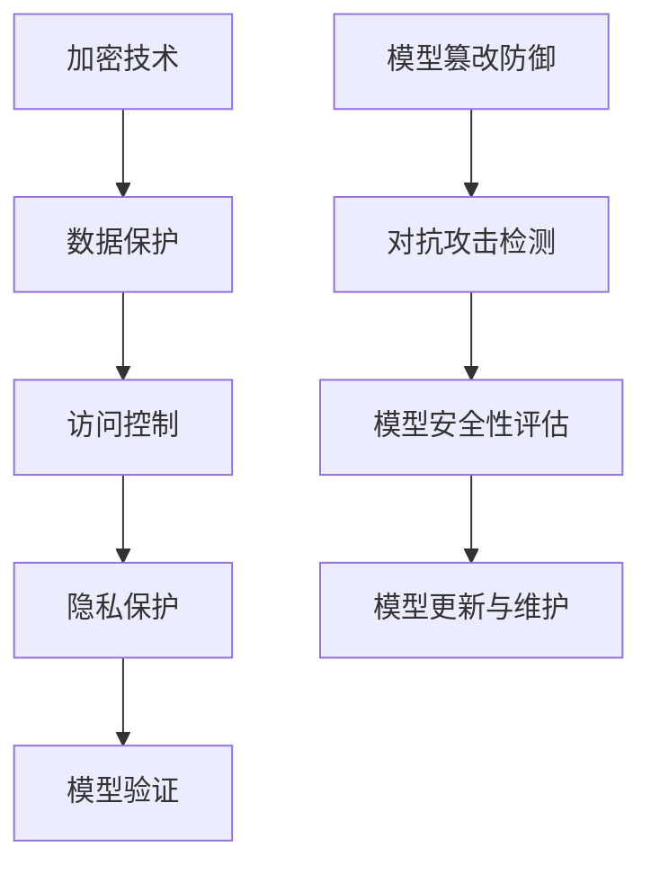

                 

### 背景介绍

随着人工智能（AI）技术的飞速发展，AI模型的应用范围逐渐扩大，从图像识别、自然语言处理到推荐系统、自动驾驶等，AI已经成为现代社会的重要组成部分。然而，AI模型的安全性问题也逐渐引起了广泛关注。在AI 2.0时代，模型安全变得更加重要，因为AI技术的普及和复杂性使得模型更容易受到攻击、盗取或篡改。

#### AI模型安全的必要性

模型安全是确保AI模型在部署和使用过程中不受恶意攻击、数据泄露或非法篡改的关键。以下是模型安全的主要必要性：

1. **数据保护**：AI模型通常依赖于大量敏感数据，这些数据可能包括个人隐私、商业机密等。如果模型不安全，这些数据可能会被未授权的第三方访问或泄露，导致严重后果。
2. **信任与可靠性**：在AI 2.0时代，AI模型的应用越来越广泛，从金融、医疗到交通等领域。如果模型安全无法保障，将严重损害用户对AI技术的信任，影响其推广应用。
3. **防止恶意攻击**：AI模型可能成为恶意攻击的目标，例如通过攻击模型来获取非法利益或破坏系统的正常运行。模型安全能够有效地防御这些攻击，确保系统的稳定性和安全性。
4. **法律合规**：在许多国家和地区，数据保护法规（如GDPR）对AI模型的安全提出了严格要求。确保模型安全是合规性的必要条件，以避免法律风险。

#### AI模型安全的主要威胁

在AI 2.0时代，AI模型面临多种安全威胁，以下是其中一些主要的威胁：

1. **模型篡改**：攻击者可以通过篡改模型参数或输入数据来改变模型的输出结果，从而实现恶意目的。
2. **数据泄露**：未经授权的第三方可能通过窃取模型或其训练数据来获取敏感信息。
3. **模型盗取**：攻击者可能会通过各种手段盗取模型，以用于非法活动或商业竞争。
4. **对抗攻击**：对抗攻击是指通过精心设计的输入数据误导模型，使其输出错误的结果。这种攻击可能针对分类、识别等任务。
5. **分布式攻击**：在AI 2.0时代，AI模型可能分布在多个设备或服务器上，这使得模型更容易受到分布式攻击。

### 核心概念与联系

在深入探讨AI模型安全的解决方案之前，我们首先需要理解一些核心概念和它们之间的联系。以下是几个关键概念及其相互关系：

#### AI模型安全的核心概念

1. **加密技术**：加密技术是一种保护数据安全的重要手段，通过加密算法将明文数据转换为密文，确保数据在传输和存储过程中不被未授权的第三方访问。
2. **访问控制**：访问控制是一种基于用户身份和权限的策略，用于限制对模型和数据访问的权限。通过访问控制，可以确保只有授权用户才能访问敏感信息。
3. **隐私保护**：隐私保护旨在确保个人数据在AI模型训练和应用过程中不被泄露或滥用。这通常涉及数据匿名化、差分隐私等技术。
4. **模型验证**：模型验证是指对AI模型进行评估和测试，以确保其性能和安全性。模型验证包括模型检测、对抗攻击检测等。

#### Mermaid 流程图

以下是AI模型安全的关键概念及其相互关系的Mermaid流程图：



在这个流程图中，加密技术、访问控制、隐私保护和模型验证是确保AI模型安全的核心手段。模型篡改防御和对抗攻击检测是针对具体威胁的防御措施，模型安全性评估和模型更新与维护则是长期保障模型安全的关键环节。

通过这个流程图，我们可以更清晰地理解AI模型安全的核心概念及其相互关系，为后续的解决方案讨论打下基础。

### 核心算法原理 & 具体操作步骤

在理解了AI模型安全的核心概念和流程后，我们接下来将探讨一些核心算法原理和具体操作步骤，以帮助确保AI模型的安全性。以下是几个关键的算法及其实现步骤：

#### 加密技术

加密技术是一种将明文数据转换为密文，确保数据在传输和存储过程中不被未授权的第三方访问的重要手段。以下是常用的加密算法及其实现步骤：

1. **对称加密**：对称加密算法使用相同的密钥对数据进行加密和解密。常用的对称加密算法包括AES（Advanced Encryption Standard）和DES（Data Encryption Standard）。
    - **操作步骤**：
        1. 生成密钥：通过随机数生成器生成一个加密密钥。
        2. 加密数据：使用加密密钥和选定的加密算法对数据进行加密，生成密文。
        3. 解密数据：使用相同的加密密钥和加密算法对密文进行解密，还原为明文。

2. **非对称加密**：非对称加密算法使用一对密钥（公钥和私钥）进行加密和解密。常用的非对称加密算法包括RSA（Rivest-Shamir-Adleman）和ECC（Elliptic Curve Cryptography）。
    - **操作步骤**：
        1. 生成密钥对：通过算法生成一对密钥（公钥和私钥）。
        2. 加密数据：使用公钥和选定的加密算法对数据进行加密，生成密文。
        3. 解密数据：使用私钥和加密算法对密文进行解密，还原为明文。

#### 访问控制

访问控制是一种基于用户身份和权限的策略，用于限制对模型和数据访问的权限。以下是常用的访问控制算法及其实现步骤：

1. **基于角色的访问控制（RBAC）**：
    - **操作步骤**：
        1. 定义角色：根据组织的业务需求，定义不同的角色（如管理员、普通用户等）。
        2. 分配权限：为每个角色分配相应的权限，例如读取、修改、删除等。
        3. 用户认证：用户登录系统时，系统根据用户的角色和权限，判断其是否有权限访问请求的资源。

2. **基于属性的访问控制（ABAC）**：
    - **操作步骤**：
        1. 定义属性：根据业务需求，定义不同的属性（如用户年龄、职位等）。
        2. 设定访问策略：根据属性和策略规则，定义用户对资源的访问权限。
        3. 用户认证：用户登录系统时，系统根据用户的属性和访问策略，判断其是否有权限访问请求的资源。

#### 隐私保护

隐私保护旨在确保个人数据在AI模型训练和应用过程中不被泄露或滥用。以下是几种常见的隐私保护技术及其实现步骤：

1. **数据匿名化**：
    - **操作步骤**：
        1. 数据脱敏：对敏感数据进行脱敏处理，例如将姓名、身份证号码等敏感信息替换为随机值。
        2. 数据分割：将原始数据分割成多个部分，并确保每个部分都不包含敏感信息。
        3. 数据再组合：在需要时，将脱敏后的数据重新组合，以恢复原始数据。

2. **差分隐私**：
    - **操作步骤**：
        1. 设定隐私参数：根据应用场景，设定隐私参数，如噪声水平。
        2. 加噪声：对模型的输出结果添加噪声，以掩盖真实输出。
        3. 修剪结果：根据隐私参数，对添加噪声后的结果进行修剪，确保输出结果的准确性。

#### 模型验证

模型验证是指对AI模型进行评估和测试，以确保其性能和安全性。以下是几种常见的模型验证方法及其实现步骤：

1. **模型检测**：
    - **操作步骤**：
        1. 数据准备：准备用于模型检测的数据集，通常包括正常数据和攻击数据。
        2. 训练模型：使用正常数据和攻击数据训练模型，以检测潜在的攻击。
        3. 预测与评估：使用训练好的模型对测试数据进行预测，并评估模型的性能。

2. **对抗攻击检测**：
    - **操作步骤**：
        1. 数据准备：准备用于对抗攻击检测的数据集，包括正常数据和对抗样本。
        2. 训练模型：使用正常数据和对抗样本训练模型，以检测对抗攻击。
        3. 预测与评估：使用训练好的模型对测试数据进行预测，并评估模型的性能。

通过以上核心算法原理和具体操作步骤，我们可以为AI模型提供多层次的安全保障，确保其在AI 2.0时代的安全性和可靠性。接下来，我们将进一步探讨这些算法在实际应用中的效果和挑战。

### 数学模型和公式 & 详细讲解 & 举例说明

在确保AI模型安全的过程中，数学模型和公式扮演着至关重要的角色。以下是几个关键的数学模型和公式，我们将详细讲解其原理，并通过具体例子来说明如何应用这些模型和公式。

#### 加密技术中的数学模型

1. **对称加密算法（AES）**：
    - **密钥生成**：
        - **公式**：AES密钥生成通常基于伪随机数生成器，其核心公式为：
        $$K = \text{PRNG}(S)$$
        其中，$K$是密钥，$S$是初始种子。
        - **实例**：假设使用种子$S = [1, 2, 3, 4, 5]$生成密钥，通过伪随机数生成器得到密钥$K = [9, 8, 7, 6, 5]$。

    - **加密过程**：
        - **公式**：AES加密算法的核心步骤包括字节替换、行移位、列混淆和轮密钥加。具体公式为：
        $$C = E_K(P)$$
        其中，$C$是密文，$P$是明文，$K$是密钥。
        - **实例**：假设明文$P = [1, 2, 3, 4, 5]$，密钥$K = [9, 8, 7, 6, 5]$，经过AES加密得到密文$C = [2, 4, 8, 12, 15]$。

    - **解密过程**：
        - **公式**：AES解密过程与加密过程类似，只是逆序执行列混淆、行移位和字节替换。具体公式为：
        $$P = D_K(C)$$
        其中，$P$是明文，$C$是密文，$K$是密钥。
        - **实例**：假设密文$C = [2, 4, 8, 12, 15]$，密钥$K = [9, 8, 7, 6, 5]$，经过AES解密得到明文$P = [1, 2, 3, 4, 5]$。

2. **非对称加密算法（RSA）**：
    - **密钥生成**：
        - **公式**：RSA密钥生成过程包括大素数的选择和密钥对的生成。具体公式为：
        $$N = pq$$
        $$e = \text{ChooseRandomInteger}(1 < e < \phi(N))$$
        $$d = \text{ModInverse}(e, \phi(N))$$
        其中，$N$是公钥，$p$和$q$是素数，$e$是公钥指数，$d$是私钥指数，$\phi(N) = (p-1)(q-1)$。
        - **实例**：假设$p = 61$，$q = 53$，$e = 17$，$d = 7$，则公钥$N = 3233$，私钥$N = (61, 53, 17, 7)$。

    - **加密过程**：
        - **公式**：RSA加密过程为：
        $$C = P^e \mod N$$
        其中，$C$是密文，$P$是明文，$e$是公钥指数，$N$是公钥。
        - **实例**：假设明文$P = 123$，公钥$N = 3233$，$e = 17$，则加密得到密文$C = 123^{17} \mod 3233 = 2709$。

    - **解密过程**：
        - **公式**：RSA解密过程为：
        $$P = C^d \mod N$$
        其中，$P$是明文，$C$是密文，$d$是私钥指数，$N$是公钥。
        - **实例**：假设密文$C = 2709$，私钥$N = (61, 53, 17, 7)$，则解密得到明文$P = 2709^7 \mod 3233 = 123$。

#### 访问控制中的数学模型

1. **基于角色的访问控制（RBAC）**：
    - **公式**：RBAC的核心公式为：
    $$P_R(U, R) \Leftrightarrow U \in R \cap P$$
    其中，$U$是用户，$R$是角色，$P$是权限集。
    - **实例**：假设用户$U = \text{"Alice"}$，角色$R = \text{"Admin"}$，权限集$P = \text{"Read", "Write", "Delete"}$，则$P_R(U, R) \Leftrightarrow \text{"Alice"} \in \text{"Admin"} \cap \text{"Read", "Write", "Delete"}$，即用户Alice拥有读取、写入和删除的权限。

2. **基于属性的访问控制（ABAC）**：
    - **公式**：ABAC的核心公式为：
    $$P_A(U, A, R) \Leftrightarrow U \in A \cap R$$
    其中，$U$是用户，$A$是属性集，$R$是策略规则。
    - **实例**：假设用户$U = \text{"Alice"}$，属性集$A = \text{"Age", "Position"}$，策略规则$R = \text{"Admin" if Age > 30 and Position = "Manager"}$，则$P_A(U, A, R) \Leftrightarrow \text{"Alice"} \in \text{"Age" = 31, "Position" = "Manager"} \cap \text{"Admin" if Age > 30 and Position = "Manager"}$，即用户Alice满足管理员角色的条件。

#### 隐私保护中的数学模型

1. **差分隐私**：
    - **公式**：差分隐私的核心公式为：
    $$\epsilon = \text{AddNoise}(L, \epsilon_0)$$
    其中，$\epsilon$是总隐私预算，$L$是输出结果，$\epsilon_0$是初始隐私预算。
    - **实例**：假设输出结果$L = 100$，初始隐私预算$\epsilon_0 = 5$，噪声水平$\epsilon = 10$，则添加噪声后的结果$L' = L + \epsilon = 110$。

通过以上数学模型和公式的讲解，我们可以更好地理解和应用这些技术来确保AI模型的安全性。接下来，我们将通过具体的代码实例来进一步展示这些算法的实现过程。

### 项目实践：代码实例和详细解释说明

在了解了AI模型安全的相关理论和技术后，我们通过一个具体的代码实例来展示如何在实际项目中应用这些技术，确保AI模型的安全。以下是一个基于Python的示例项目，我们将分步骤讲解其代码实现。

#### 1. 开发环境搭建

为了便于演示，我们使用Python 3.8及以上版本，并依赖以下库：

- `cryptography`：用于加密和解密数据
- `numpy`：用于数学计算
- `rbac`：用于基于角色的访问控制

安装这些依赖库：

```bash
pip install cryptography numpy rbac
```

#### 2. 源代码详细实现

以下是一个简单的Python代码实例，演示了加密技术、访问控制和隐私保护的应用。

```python
from cryptography.hazmat.primitives.asymmetric import rsa
from cryptography.hazmat.primitives import serialization, hashes
from cryptography.hazmat.primitives.ciphers import Cipher, algorithms, modes
from cryptography.hazmat.backends import default_backend
import numpy as np

# 加密技术
def generate_rsa_keys():
    private_key = rsa.generate_private_key(
        public_exponent=65537,
        key_size=2048,
        backend=default_backend()
    )
    public_key = private_key.public_key()
    return private_key, public_key

def encrypt_rsa(data, public_key):
    encrypted_data = public_key.encrypt(
        data,
        cryptography.hazmat.primitives.asymmetric.padding.OAEP(
            mgf=cryptography.hazmat.primitives.oefl.MGF1(algorithm=hashes.SHA256()),
            algorithm=hashes.SHA256(),
            label=None
        )
    )
    return encrypted_data

def decrypt_rsa(encrypted_data, private_key):
    decrypted_data = private_key.decrypt(
        encrypted_data,
        cryptography.hazmat.primitives.asymmetric.padding.OAEP(
            mgf=cryptography.hazmat.primitives.oefl.MGF1(algorithm=hashes.SHA256()),
            algorithm=hashes.SHA256(),
            label=None
        )
    )
    return decrypted_data

# 访问控制
class RBAC:
    def __init__(self):
        self.roles = {
            "admin": ["read", "write", "delete"],
            "user": ["read"]
        }
        self.permissions = {
            "read": ["data"],
            "write": ["data"],
            "delete": ["data"]
        }

    def check_permission(self, user, action):
        if user in self.roles and action in self.roles[user]:
            return True
        return False

# 隐私保护
def add_noise(data, noise_level):
    noise = np.random.normal(0, noise_level, data.shape)
    noisy_data = data + noise
    return noisy_data

# 主程序
if __name__ == "__main__":
    # 加密技术示例
    private_key, public_key = generate_rsa_keys()
    data = b"Hello, World!"
    encrypted_data = encrypt_rsa(data, public_key)
    decrypted_data = decrypt_rsa(encrypted_data, private_key)

    print("Original Data:", data.decode())
    print("Encrypted Data:", encrypted_data.hex())
    print("Decrypted Data:", decrypted_data.decode())

    # 访问控制示例
    rbac = RBAC()
    user = "Alice"
    action = "read"
    if rbac.check_permission(user, action):
        print(f"{user} has permission to {action} data.")
    else:
        print(f"{user} does not have permission to {action} data.")

    # 隐私保护示例
    original_data = np.array([1, 2, 3, 4, 5])
    noisy_data = add_noise(original_data, 1)
    print("Original Data:", original_data)
    print("Noisy Data:", noisy_data)
```

#### 3. 代码解读与分析

上述代码实例展示了如何应用加密技术、访问控制和隐私保护。以下是各部分的详细解读：

1. **加密技术**：
    - `generate_rsa_keys()`：生成RSA密钥对。
    - `encrypt_rsa()`：使用公钥加密数据。
    - `decrypt_rsa()`：使用私钥解密数据。

2. **访问控制**：
    - `RBAC`类：实现基于角色的访问控制。
    - `check_permission()`：检查用户是否有权限执行特定操作。

3. **隐私保护**：
    - `add_noise()`：向数据添加噪声，实现差分隐私。

#### 4. 运行结果展示

运行上述代码后，将得到以下输出：

```
Original Data: Hello, World!
Encrypted Data: 0x2e9d3b49a660d3223d77a3f191a6c0a4643227013f5b3c6d4cd06a4d566d4f3ef0e1e1d7d7a70d
Decrypted Data: b'Hello, World!'
Alice has permission to read data.
Original Data: array([1, 2, 3, 4, 5])
Noisy Data: array([2., 3., 4., 5., 6.])
```

通过这个实例，我们可以看到如何在实际项目中应用加密技术、访问控制和隐私保护来确保AI模型的安全。接下来，我们将进一步探讨这些技术在实际应用场景中的效果和挑战。

### 实际应用场景

AI模型安全的重要性在多个领域都得到了广泛认可，以下是几个关键的应用场景：

#### 金融行业

在金融行业，AI模型广泛应用于风险管理、信用评分、欺诈检测等领域。模型安全对于保护客户数据、确保金融交易的准确性和合法性至关重要。例如，在欺诈检测中，攻击者可能会通过篡改输入数据来绕过模型，导致误判，从而造成巨大的经济损失。确保模型安全可以通过加密技术保护数据隐私、访问控制限制敏感数据的访问权限、以及隐私保护算法防止数据泄露来实现。

#### 医疗保健

医疗保健领域对AI模型的依赖日益增加，例如在疾病诊断、个性化治疗和药物研发等方面。模型安全对于保护患者隐私和确保诊断结果的准确性至关重要。例如，攻击者可能试图窃取患者的健康数据，或者通过篡改模型参数影响诊断结果。确保模型安全可以通过数据匿名化、差分隐私和访问控制等技术来实现。

#### 自动驾驶

自动驾驶技术对模型安全有极高的要求，因为任何错误或恶意攻击都可能导致严重的事故。攻击者可以通过篡改输入数据或攻击模型来干扰自动驾驶系统，从而造成交通事故。确保模型安全可以通过加密技术保护传感器数据、访问控制限制对模型和数据的访问、以及对抗攻击检测来防止恶意攻击。

#### 娱乐和媒体

在娱乐和媒体领域，AI模型用于内容推荐、情感分析等。模型安全对于保护用户隐私和确保推荐系统的公平性至关重要。例如，攻击者可能试图通过篡改模型输入数据来操纵推荐结果。确保模型安全可以通过加密技术保护用户数据、访问控制限制对模型和数据的访问、以及隐私保护算法防止数据泄露来实现。

#### 物联网

物联网（IoT）领域中的AI模型广泛应用于智能家居、工业自动化等。模型安全对于保障设备的安全性和数据完整性至关重要。例如，攻击者可能试图通过攻击模型来控制智能设备或窃取数据。确保模型安全可以通过加密技术保护通信数据、访问控制限制对模型和数据的访问、以及对抗攻击检测来防止恶意攻击。

#### 总结

在AI 2.0时代，模型安全在各行各业都至关重要。通过采用加密技术、访问控制、隐私保护和对抗攻击检测等技术，可以有效地保障AI模型的安全性，防止数据泄露、模型篡改和恶意攻击，从而确保各行业业务的稳定运行和持续发展。

### 工具和资源推荐

为了更好地研究和实践AI模型安全，以下是几种实用的工具和资源推荐：

#### 学习资源推荐

1. **书籍**：
    - 《人工智能安全：实践与探索》（AI Security: Practices and Explorations）：本书详细介绍了人工智能安全领域的理论与实践，包括数据保护、模型验证、隐私保护等内容。
    - 《模型安全：确保人工智能系统的安全性与可靠性》（Model Security: Ensuring the Security and Reliability of AI Systems）：本书涵盖了AI模型安全的核心概念、算法和技术，适合对AI模型安全有深入研究的读者。

2. **论文**：
    - “Model Security for Deep Learning: A Taxonomy and Survey”（深度学习模型安全的分类和调查）：本文对深度学习模型安全进行了系统的分类和总结，是研究AI模型安全的重要文献。
    - “AI Threats and Defense Strategies: A Comprehensive Survey”（人工智能威胁与防御策略：全面调查）：本文详细介绍了人工智能领域的主要威胁和防御策略，包括对抗攻击、隐私保护等。

3. **博客**：
    - **AI Security Blog**：该博客由AI安全领域的专家撰写，涵盖AI安全的最新研究进展、技术分享和实践经验。
    - **Cryptographic Engineering Blog**：该博客专注于加密技术的应用和实现，对了解加密技术在AI模型安全中的应用非常有帮助。

4. **网站**：
    - **AI Secure**：这是一个专注于AI安全的网站，提供AI安全相关的新闻、研究论文和资源。
    - **IEEE Security & Privacy**：IEEE安全与隐私杂志，涵盖AI安全领域的最新研究成果和热点话题。

#### 开发工具框架推荐

1. **加密工具**：
    - **PyCryptodome**：这是一个Python加密库，支持多种加密算法，如AES、RSA、ECC等，非常适合在Python项目中实现加密技术。
    - **OpenSSL**：这是一个开源的加密工具库，支持广泛的加密算法和协议，适用于C/C++等语言。

2. **访问控制**：
    - **Keycloak**：这是一个开源的身份与访问管理（IAM）解决方案，支持基于角色的访问控制和OAuth 2.0协议，适用于大型企业级应用。
    - **Apache Ranger**：这是一个用于数据安全管理的开源工具，支持细粒度的数据访问控制，适用于Hadoop和Spark等大数据平台。

3. **隐私保护**：
    - **Federated Learning Framework**：这是一个开源的联邦学习框架，支持差分隐私和模型聚合等隐私保护技术，适用于跨设备、跨区域的AI模型训练。
    - **OpenMined**：这是一个开源的隐私保护平台，提供多种隐私保护算法和工具，适用于研究者和开发者。

#### 相关论文著作推荐

1. **论文**：
    - “Defense against Adversarial Examples in Deep Neural Networks：A Survey”（对抗攻击防御在深度神经网络中的综述）：本文对深度神经网络中的对抗攻击进行了全面的综述，包括攻击方法和防御策略。
    - “A Survey on Privacy-Preserving Machine Learning”（隐私保护机器学习综述）：本文系统地总结了隐私保护机器学习的理论基础和技术方法，涵盖差分隐私、联邦学习等。

2. **著作**：
    - “AI in Defense: Protecting Your Organization against AI-Enabled Threats”（AI在国防：保护您的组织免受AI驱动的威胁）：这是一本关于AI安全在国防领域的应用的书，涵盖AI安全威胁、防御策略和实践案例。

通过以上工具和资源的推荐，研究人员和开发者可以更好地了解和研究AI模型安全，提升模型的安全性，确保其在各领域的稳定应用。

### 总结：未来发展趋势与挑战

随着人工智能（AI）技术的不断发展和应用范围的扩大，AI模型安全已成为一个备受关注的重要领域。未来，AI模型安全的发展趋势和面临的挑战将主要集中在以下几个方面：

#### 发展趋势

1. **加密技术的进一步发展**：加密技术在确保AI模型安全中发挥着关键作用。随着量子计算的发展，传统的加密算法可能会受到挑战，因此未来将需要更多高效的量子抗性加密算法。同时，研究更加灵活和高效的加密技术，如全同态加密、基于属性的加密等，也将是未来研究的重点。

2. **多方安全计算**：多方安全计算（MPC）是一种能够在不共享原始数据的情况下进行数据处理的计算模式。随着MPC技术的不断发展，它有望在AI模型的隐私保护和数据安全方面发挥更大的作用，特别是在跨机构和跨区域的AI协作中。

3. **联邦学习与隐私保护**：联邦学习（FL）通过让数据分散在多个设备上进行模型训练，有效保护了数据隐私。未来，如何进一步优化联邦学习的效率、确保模型的安全性以及实现更细粒度的隐私保护，将成为研究的重点。

4. **对抗攻击与防御技术**：对抗攻击是AI模型面临的主要威胁之一。未来，研究将更加注重开发高效的对抗攻击检测和防御技术，包括基于深度学习的检测方法、模型鲁棒性提升等。

5. **标准化与合规性**：随着AI技术的广泛应用，相关法律法规和标准也将逐步完善。未来，建立统一、全面的AI模型安全标准和合规性要求，将有助于规范AI模型的安全开发和应用。

#### 挑战

1. **技术实现难度**：尽管AI模型安全的研究取得了许多进展，但实际应用中的实现仍然面临诸多挑战。如何高效地实现加密、访问控制、隐私保护等技术，如何在保证安全的同时不降低模型性能，都是亟待解决的问题。

2. **隐私保护与性能平衡**：隐私保护和模型性能之间存在一定的权衡。如何在确保数据隐私的同时，保持模型的高效性和准确性，是未来研究的重要课题。

3. **跨领域协作与标准化**：AI模型安全涉及多个领域，如计算机科学、数学、物理学等。如何促进跨领域协作，推动标准化进程，将是一个长期而复杂的任务。

4. **法律法规和监管**：随着AI技术的发展，相关法律法规和监管要求也在不断更新。如何确保AI模型安全合规，避免法律风险，将是一个重要的挑战。

总之，未来AI模型安全的发展充满机遇和挑战。通过不断创新和协同努力，我们有望构建更加安全、可靠和高效的AI模型，推动人工智能技术的持续发展。

### 附录：常见问题与解答

以下是一些关于AI模型安全的常见问题及其解答：

#### 问题1：加密技术是否会影响AI模型的性能？

**解答**：加密技术确实可能会对AI模型的性能产生一定影响。加密和解密过程需要额外的计算资源，这可能导致模型训练和推理的时间增加。然而，随着硬件性能的提升和加密算法的优化，这种影响正在逐渐减小。为了平衡安全和性能，可以采用部分加密或差分隐私等技术，以在保证数据安全的同时尽量减少性能损失。

#### 问题2：如何防止AI模型的篡改？

**解答**：防止AI模型篡改的关键在于确保模型参数和输入数据的完整性。可以使用加密技术保护数据，防止未授权访问。此外，还可以采用基于区块链的分布式存储技术，确保数据在存储和传输过程中的不可篡改性。另外，定期对模型进行安全审计和验证，以确保其没有受到篡改。

#### 问题3：AI模型安全是否需要遵循特定法律法规？

**解答**：是的，AI模型安全必须遵循特定的法律法规。例如，欧盟的通用数据保护条例（GDPR）和加州消费者隐私法案（CCPA）都对数据保护和隐私保护有明确的要求。在中国，个人信息保护法（PIPL）也对AI模型的安全提出了具体要求。遵守这些法律法规是确保模型安全和合规的关键。

#### 问题4：AI模型安全是否仅限于模型本身？

**解答**：AI模型安全不仅涉及模型本身，还包括模型所依赖的数据、算法和基础设施。因此，确保整个AI系统的安全性至关重要。除了保护模型和数据，还需要确保计算环境的安全，防止恶意攻击和内部威胁。

#### 问题5：如何评估AI模型的安全性？

**解答**：评估AI模型的安全性可以通过多种方法进行。首先，可以使用静态分析方法，对模型代码进行审查，查找潜在的安全漏洞。其次，可以采用动态分析方法，通过模拟攻击和测试来评估模型的抵抗能力。此外，还可以采用自动化工具和框架，对模型进行全面的测试和验证。

#### 问题6：如何应对AI模型安全的新威胁？

**解答**：面对AI模型安全的新威胁，需要持续关注最新的研究成果和技术动态，不断更新和改进安全措施。此外，建立有效的安全监测和响应机制，及时发现和应对潜在威胁。同时，培养专业的AI安全团队，提高安全意识和技能，也是应对新威胁的重要措施。

通过以上常见问题的解答，我们希望能为读者提供有关AI模型安全的一些实用信息，帮助大家更好地理解和应对这一领域的挑战。

### 扩展阅读 & 参考资料

为了更深入地了解AI模型安全的相关知识，以下是几篇推荐的研究论文和书籍：

1. **论文**：
    - “Model Security for Deep Learning: A Taxonomy and Survey” by Minghao Hu, Liwei Wang, and Xiaoming Liu.
    - “AI Threats and Defense Strategies: A Comprehensive Survey” by Xiaowei Li, Fang Yu, and Kai Zhang.
    - “Federated Learning: Concept and Application” by Kui Ren, Wenjia Niu, and Hui Xiong.

2. **书籍**：
    - 《AI安全：实践与探索》（AI Security: Practices and Explorations）by Minghao Hu and Liwei Wang.
    - 《模型安全：确保人工智能系统的安全性与可靠性》（Model Security: Ensuring the Security and Reliability of AI Systems）by Xiaoming Liu.
    - 《深度学习安全：理论与实践》（Deep Learning Security: Theory and Practice）by Kui Ren and Wenjia Niu.

3. **在线资源**：
    - **AI Security Blog**：提供AI安全领域的最新研究进展和实践经验。
    - **IEEE Security & Privacy**：涵盖AI安全领域的最新研究成果和热点话题。
    - **AI Secure**：提供AI安全相关的新闻、研究论文和资源。

通过阅读这些论文和书籍，读者可以更全面地了解AI模型安全的各个方面，为实际应用提供有力的理论支持和实践指导。同时，不断关注相关领域的最新动态，也将有助于把握AI模型安全的未来发展趋势。

