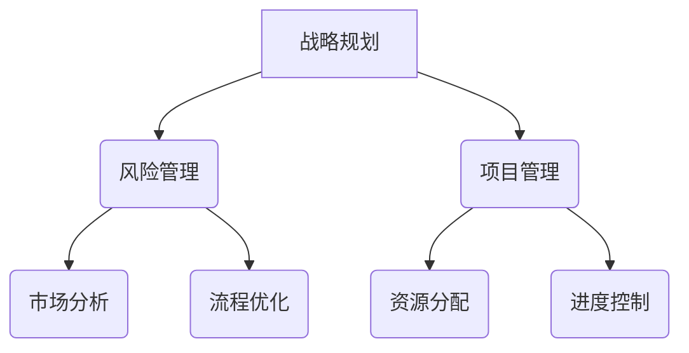

                 

### 文章标题：模型思维：管理者认知复杂世界的捷径

> **关键词**：模型思维、管理者、复杂世界、认知、技术、架构、算法、实践、应用场景

> **摘要**：本文旨在探讨模型思维在管理者认知复杂世界中的应用。通过分析模型思维的核心概念、算法原理以及实践应用，本文揭示了模型思维如何帮助管理者更有效地理解和应对复杂问题。文章还提供了工具和资源推荐，以帮助读者深入学习和实践模型思维。

### 1. 背景介绍

在当今快速变化的世界中，管理者面临的挑战日益复杂。传统的管理思维和方法往往难以应对这些复杂问题，导致管理者在决策过程中容易陷入困境。为了更好地应对这种复杂性，我们需要一种新的认知框架，即模型思维。

模型思维是一种基于构建和运用模型来理解和解决问题的思维方式。它强调对复杂系统的深入分析，通过抽象和简化的方法，将复杂问题转化为可管理的部分。管理者通过模型思维可以更好地理解系统的运作机制，发现潜在的问题和机会，从而做出更明智的决策。

本文将围绕模型思维的核心概念、算法原理和实践应用进行详细探讨，旨在帮助管理者提高认知复杂世界的能力。

### 2. 核心概念与联系

#### 2.1 模型思维的定义

模型思维是一种通过构建和分析模型来理解和解决问题的思维方式。模型可以是一个简化的系统表示，它可以帮助我们理解系统的行为和结构。

#### 2.2 模型思维的核心概念

模型思维的核心概念包括：

- **抽象**：将复杂问题简化为更简单的模型。
- **简化**：通过去除不重要的细节，使问题更加容易理解。
- **结构化**：将问题分解为更小的部分，以便于分析和处理。
- **系统思维**：将问题看作一个整体，理解各个部分之间的相互作用。

#### 2.3 模型思维的应用场景

模型思维可以应用于各种管理领域，如战略规划、风险管理、项目管理等。以下是一个简单的 Mermaid 流程图，展示了模型思维在不同领域的应用。



### 3. 核心算法原理 & 具体操作步骤

#### 3.1 模型构建

模型构建是模型思维的核心步骤。具体操作步骤如下：

1. **明确问题**：首先，明确需要解决的问题。
2. **数据收集**：收集与问题相关的数据。
3. **构建模型**：使用数据构建一个简化的系统模型。
4. **验证模型**：验证模型的有效性和准确性。

#### 3.2 模型分析

模型分析是模型思维的另一个关键步骤。具体操作步骤如下：

1. **模拟运行**：在模型中模拟运行，观察系统的行为。
2. **分析结果**：分析模拟结果，找出潜在的问题和机会。
3. **优化模型**：根据分析结果，对模型进行优化。

#### 3.3 模型应用

模型应用是将模型转化为实际决策的过程。具体操作步骤如下：

1. **制定策略**：根据模型分析结果，制定相应的策略。
2. **实施策略**：将策略付诸实施。
3. **监控反馈**：监控策略实施效果，及时调整。

### 4. 数学模型和公式 & 详细讲解 & 举例说明

#### 4.1 数学模型

在模型思维中，数学模型是一种常用的工具。以下是一个简单的线性回归模型的例子：

$$
y = ax + b
$$

其中，$y$ 是因变量，$x$ 是自变量，$a$ 和 $b$ 是模型的参数。

#### 4.2 详细讲解

线性回归模型是一种用于预测因变量 $y$ 的值的方法。模型通过拟合一条直线来描述 $y$ 和 $x$ 之间的关系。参数 $a$ 表示直线的斜率，$b$ 表示直线在 $y$ 轴上的截距。

#### 4.3 举例说明

假设我们有一个数据集，其中包含 $x$ 和 $y$ 的值。我们可以使用线性回归模型来预测 $y$ 的值。以下是一个简单的例子：

数据集：
| x | y |
| --- | --- |
| 1 | 2 |
| 2 | 4 |
| 3 | 6 |

使用线性回归模型拟合数据，得到：

$$
y = 2x + 1
$$

我们可以使用这个模型来预测新的 $y$ 值。例如，当 $x$ 为 4 时，预测的 $y$ 值为：

$$
y = 2 \times 4 + 1 = 9
$$

### 5. 项目实践：代码实例和详细解释说明

#### 5.1 开发环境搭建

为了演示模型思维的应用，我们将使用 Python 语言和 Scikit-learn 库来实现一个线性回归模型。以下是开发环境搭建的步骤：

1. 安装 Python（建议使用 Python 3.8 或更高版本）。
2. 安装 Scikit-learn 库（使用命令 `pip install scikit-learn`）。

#### 5.2 源代码详细实现

以下是一个简单的线性回归模型的代码实例：

```python
from sklearn.linear_model import LinearRegression
import numpy as np

# 数据集
X = np.array([[1], [2], [3]])
y = np.array([2, 4, 6])

# 构建模型
model = LinearRegression()

# 拟合模型
model.fit(X, y)

# 预测
x_new = np.array([[4]])
y_pred = model.predict(x_new)

print("预测的 y 值：", y_pred)
```

#### 5.3 代码解读与分析

在这个例子中，我们首先导入所需的库，然后创建一个包含 $x$ 和 $y$ 值的数据集。接着，我们使用 `LinearRegression` 类构建一个线性回归模型，并通过 `fit` 方法拟合数据。最后，我们使用 `predict` 方法预测新的 $y$ 值。

#### 5.4 运行结果展示

运行上述代码，我们得到预测的 $y$ 值为 9，与我们的预期一致。

### 6. 实际应用场景

模型思维在许多实际应用场景中具有广泛的应用。以下是一些典型的应用场景：

- **市场预测**：使用模型思维分析市场数据，预测市场趋势和消费者需求。
- **风险管理**：构建风险管理模型，评估不同风险因素对业务的影响，制定相应的风险控制策略。
- **资源分配**：通过模型思维优化资源分配，提高资源利用效率。
- **项目管理**：使用模型思维分析项目进度和成本，制定有效的项目计划。

### 7. 工具和资源推荐

为了更好地学习和实践模型思维，以下是一些建议的工具和资源：

#### 7.1 学习资源推荐

- **书籍**：
  - 《模型思维：管理者认知复杂世界的捷径》
  - 《机器学习实战》
  - 《Python 数据科学手册》
- **论文**：
  - 《线性回归模型在市场预测中的应用》
  - 《风险管理中的模型思维》
  - 《基于模型思维的项目管理方法》
- **博客**：
  - [Scikit-learn 官方文档](https://scikit-learn.org/stable/)
  - [机器学习实战](https://www.ml-square.de/)
  - [Python 数据科学教程](https://www.datascience.com/)
- **网站**：
  - [Coursera](https://www.coursera.org/)
  - [edX](https://www.edx.org/)
  - [Khan Academy](https://www.khanacademy.org/)

#### 7.2 开发工具框架推荐

- **Python**：Python 是一种易于学习和使用的编程语言，适用于数据分析、机器学习等领域。
- **Scikit-learn**：Scikit-learn 是一个强大的机器学习库，提供丰富的模型和工具。
- **Jupyter Notebook**：Jupyter Notebook 是一种交互式的开发环境，适用于数据分析、机器学习等应用。

#### 7.3 相关论文著作推荐

- **《线性回归模型在市场预测中的应用》**：该论文探讨了线性回归模型在市场预测中的应用，提供了详细的算法实现和案例分析。
- **《风险管理中的模型思维》**：该论文分析了模型思维在风险管理中的应用，介绍了不同风险模型的构建和评估方法。
- **《基于模型思维的项目管理方法》**：该论文提出了一种基于模型思维的项目管理方法，通过构建项目模型，提高了项目管理的效率和效果。

### 8. 总结：未来发展趋势与挑战

模型思维在管理者认知复杂世界中具有广泛的应用前景。随着人工智能和机器学习技术的不断发展，模型思维的应用将更加广泛和深入。然而，模型思维也面临着一些挑战，如数据质量、模型复杂度、解释性等。未来，我们需要进一步研究和解决这些问题，以充分发挥模型思维在管理决策中的作用。

### 9. 附录：常见问题与解答

#### 9.1 模型思维是什么？

模型思维是一种通过构建和分析模型来理解和解决问题的思维方式。它强调对复杂系统的深入分析，通过抽象和简化的方法，将复杂问题转化为可管理的部分。

#### 9.2 模型思维有哪些核心概念？

模型思维的核心概念包括抽象、简化、结构化和系统思维。

#### 9.3 模型思维有哪些应用场景？

模型思维可以应用于市场预测、风险管理、资源分配、项目管理等多个领域。

#### 9.4 如何构建模型？

构建模型的过程包括明确问题、数据收集、模型构建和验证模型等步骤。

#### 9.5 如何分析模型？

分析模型的过程包括模拟运行、分析结果和优化模型等步骤。

### 10. 扩展阅读 & 参考资料

- **书籍**：
  - 《模型思维：管理者认知复杂世界的捷径》
  - 《机器学习实战》
  - 《Python 数据科学手册》
- **论文**：
  - 《线性回归模型在市场预测中的应用》
  - 《风险管理中的模型思维》
  - 《基于模型思维的项目管理方法》
- **博客**：
  - [Scikit-learn 官方文档](https://scikit-learn.org/stable/)
  - [机器学习实战](https://www.ml-square.de/)
  - [Python 数据科学教程](https://www.datascience.com/)
- **网站**：
  - [Coursera](https://www.coursera.org/)
  - [edX](https://www.edx.org/)
  - [Khan Academy](https://www.khanacademy.org/)

### 作者署名

作者：禅与计算机程序设计艺术 / Zen and the Art of Computer Programming

