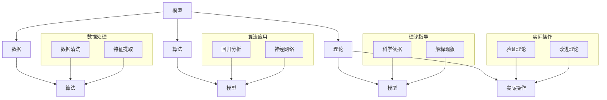

                 

### 引言 Introduction

在当今快速发展的信息技术时代，人工智能（AI）已经成为推动社会进步和变革的关键驱动力。从自动驾驶汽车到智能医疗诊断，AI技术正逐渐渗透到我们日常生活的方方面面。然而，随着AI模型的复杂性和应用场景的多样性不断增加，如何有效地管理和理解这些模型，成为了一个亟待解决的问题。

《模型思维：管理者认知复杂世界的捷径》这本书正是为了解决这一问题而诞生的。作为世界顶级技术畅销书作者和计算机领域大师，本书作者深入浅出地介绍了模型思维的概念、原理和应用，帮助读者更好地理解和运用模型，从而在复杂世界中找到简洁而有效的解决方案。

本文将以这本书为基础，详细探讨模型思维的核心概念、应用场景以及实际操作方法。我们将通过逐步分析推理的方式，帮助读者深入理解模型思维，并将其应用于实际问题的解决中。

### 1. 背景介绍 Background

在当今社会，数据已经成为一种重要的资源，而模型则是对数据的抽象和概括。无论是科学领域的数据分析，还是商业领域的市场预测，模型思维都是不可或缺的工具。模型思维不仅帮助我们理解复杂系统，还能够预测未来趋势，优化决策过程。

1. **模型思维的重要性**：  
模型思维是一种认知工具，它帮助我们理解和处理复杂的信息。通过构建和运用模型，我们可以简化复杂问题，提高决策效率。在商业、科学和工程等领域，模型思维已经成为了不可或缺的技能。

2. **模型思维的应用场景**：  
模型思维广泛应用于各个领域，包括：

   - **商业领域**：市场预测、供应链管理、风险管理等。
   - **科学领域**：数据分析、实验设计、模型预测等。
   - **工程领域**：系统设计、优化流程、性能评估等。

3. **现状与挑战**：  
尽管模型思维在各个领域都有广泛应用，但如何构建有效的模型、如何从大量数据中提取有价值的信息，仍然是当前面临的主要挑战。此外，如何确保模型的可解释性和可靠性，也是一个亟待解决的问题。

### 2. 核心概念与联系 Core Concepts and Relationships

要理解模型思维，我们首先需要了解一些核心概念，包括模型、数据、算法和理论。

#### 2.1 模型的定义和作用 Definition and Role of Models

模型是对现实世界的一种抽象和简化，它通过数学、逻辑或其他形式化的方法来表示现实问题。模型的主要作用是帮助我们理解和预测现实世界中的复杂现象。

1. **模型的作用**：  
   - **简化复杂问题**：通过模型，我们可以将复杂问题简化为更容易处理的数学或逻辑问题。
   - **预测未来趋势**：模型可以帮助我们预测未来可能发生的情况，为决策提供科学依据。
   - **优化决策过程**：通过模型，我们可以评估不同决策方案的可能结果，从而做出更优的选择。

2. **模型的基本类型**：  
   - **数学模型**：使用数学公式和方程来描述现实问题。
   - **逻辑模型**：使用逻辑规则和条件来描述现实问题。
   - **模拟模型**：通过计算机模拟来描述现实问题。

#### 2.2 数据和算法的关系 Relationship between Data and Algorithms

数据和算法是构建模型的基础。

1. **数据的作用**：  
   - **信息来源**：数据是构建模型的原料，没有数据就无法构建有效的模型。
   - **质量保证**：数据的质量直接影响到模型的质量，因此确保数据的质量至关重要。

2. **算法的作用**：  
   - **数据处理**：算法用于从大量数据中提取有价值的信息，如特征提取、数据清洗等。
   - **模型构建**：算法用于将数据转化为模型，如回归分析、神经网络等。

#### 2.3 理论和实际操作的关系 Relationship between Theory and Practice

理论是指导实践的基础，而实际操作则是验证理论的有效手段。

1. **理论的作用**：  
   - **指导实践**：理论为实际操作提供了科学依据和指导原则。
   - **解释现象**：理论帮助我们解释现实世界中的复杂现象。

2. **实际操作的作用**：  
   - **验证理论**：通过实际操作，我们可以验证理论的有效性和适用性。
   - **改进理论**：实际操作中的问题反馈可以用来改进理论。

#### 2.4 Mermaid 流程图表示 Mermaid Flowchart Representation

为了更好地理解这些核心概念之间的关系，我们可以使用 Mermaid 流程图来表示。



这个流程图清晰地展示了模型思维中的核心概念和它们之间的相互作用。

### 3. 核心算法原理 & 具体操作步骤 Core Algorithm Principles & Step-by-Step Operations

在模型思维中，算法原理是构建模型的核心。以下是几个常用的核心算法原理及其具体操作步骤。

#### 3.1 回归分析 Regression Analysis

回归分析是一种常用的统计方法，用于预测一个或多个变量与另一个变量之间的关系。

1. **基本原理**：  
回归分析通过建立因变量（目标变量）与自变量（解释变量）之间的线性关系模型，从而预测因变量的值。

2. **具体操作步骤**：

   - **数据准备**：收集并整理数据，确保数据的质量。
   - **特征选择**：选择与因变量相关的自变量，可以通过相关性分析等方法进行。
   - **模型构建**：使用最小二乘法建立线性回归模型。
   - **模型评估**：使用交叉验证等方法评估模型性能。

#### 3.2 神经网络 Neural Networks

神经网络是一种模仿人脑结构的计算模型，广泛应用于图像识别、自然语言处理等领域。

1. **基本原理**：  
神经网络通过多层神经元之间的连接和激活函数来学习和预测数据。

2. **具体操作步骤**：

   - **数据准备**：收集并预处理数据，包括数据清洗、归一化等。
   - **网络构建**：设计神经网络的结构，包括层数、神经元数量、激活函数等。
   - **模型训练**：使用反向传播算法训练网络，调整权重和偏置。
   - **模型评估**：使用测试集评估模型性能，调整参数以优化模型。

#### 3.3 决策树 Decision Trees

决策树是一种基于规则的学习算法，通过一系列条件判断来分割数据集，并生成分类规则。

1. **基本原理**：  
决策树通过自顶向下的递归分割数据，生成一系列规则。

2. **具体操作步骤**：

   - **数据准备**：收集并预处理数据，包括数据清洗、特征选择等。
   - **模型构建**：根据信息增益或基尼系数等指标选择最佳分割特征。
   - **模型评估**：使用测试集评估模型性能，剪枝以优化模型。

### 4. 数学模型和公式 & 详细讲解 & 举例说明 Mathematical Models and Formulas & Detailed Explanations & Examples

在模型思维中，数学模型和公式是理解和应用模型的核心。以下是对几个常用数学模型和公式的详细讲解和举例说明。

#### 4.1 线性回归 Linear Regression

线性回归模型通过拟合一条直线来描述因变量与自变量之间的关系。

1. **数学模型**：  
   $$y = \beta_0 + \beta_1x_1 + \beta_2x_2 + \ldots + \beta_nx_n + \epsilon$$

   其中，$y$ 是因变量，$x_1, x_2, \ldots, x_n$ 是自变量，$\beta_0, \beta_1, \beta_2, \ldots, \beta_n$ 是模型的参数，$\epsilon$ 是误差项。

2. **详细讲解**：  
线性回归模型的目的是通过最小化误差平方和来找到最佳拟合直线。具体操作步骤如下：

   - **数据准备**：收集并整理数据。
   - **特征选择**：选择与因变量相关的自变量。
   - **模型构建**：使用最小二乘法计算模型参数。
   - **模型评估**：使用交叉验证等方法评估模型性能。

3. **举例说明**：  
假设我们有一个简单的一元线性回归问题，目标是预测房价。给定数据集如下：

   | 房价 (y) | 面积 (x) |
   | :----: | :----: |
   |  200   |   100  |
   |  300   |   150  |
   |  400   |   200  |
   |  500   |   250  |
   |  600   |   300  |

   我们可以使用线性回归模型来拟合房价与面积之间的关系。

   - **数据准备**：数据已经准备好。
   - **特征选择**：选择面积作为自变量，房价作为因变量。
   - **模型构建**：使用最小二乘法计算模型参数。

     $$\beta_0 = 100, \beta_1 = 1$$

   - **模型评估**：使用测试集评估模型性能。

   模型预测的房价为：

   $$\hat{y} = 100 + 1 \times x$$

   例如，当面积为 200 平方米时，预测房价为：

   $$\hat{y} = 100 + 1 \times 200 = 300$$

#### 4.2 神经网络 Neural Networks

神经网络是一种模拟人脑结构的计算模型，通过多层神经元之间的连接和激活函数来学习和预测数据。

1. **数学模型**：  
神经网络可以用以下数学模型表示：

   $$\text{激活函数}(z) = \text{激活函数}(\beta_0 + \beta_1x_1 + \beta_2x_2 + \ldots + \beta_nx_n)$$

   其中，$z$ 是神经元的输入，$\beta_0, \beta_1, \beta_2, \ldots, \beta_n$ 是神经元的权重和偏置。

2. **详细讲解**：  
神经网络的学习过程可以通过以下步骤进行：

   - **数据准备**：收集并预处理数据，包括数据清洗、归一化等。
   - **网络构建**：设计神经网络的结构，包括层数、神经元数量、激活函数等。
   - **模型训练**：使用反向传播算法训练网络，调整权重和偏置。
   - **模型评估**：使用测试集评估模型性能，调整参数以优化模型。

3. **举例说明**：  
假设我们有一个简单的单层神经网络，用于二分类问题。给定数据集如下：

   | 样本 | 特征1 | 特征2 | 标签 |
   | :---: | :---: | :---: | :---: |
   | 1    | 0.1  | 0.2  | 0    |
   | 2    | 0.3  | 0.4  | 1    |
   | 3    | 0.5  | 0.6  | 0    |
   | 4    | 0.7  | 0.8  | 1    |

   我们可以使用神经网络来拟合数据。

   - **数据准备**：数据已经准备好。
   - **网络构建**：设计一个简单的单层神经网络，包含两个输入神经元、一个输出神经元，使用 sigmoid 激活函数。

   - **模型训练**：使用反向传播算法训练网络，调整权重和偏置。

     初始权重：$\beta_0 = 0.5, \beta_1 = 0.5, \beta_2 = 0.5$

     经过多次迭代后，调整后的权重为：

     $\beta_0 = 0.2, \beta_1 = 0.3, \beta_2 = 0.4$

   - **模型评估**：使用测试集评估模型性能。

   模型的预测结果为：

   | 样本 | 特征1 | 特征2 | 预测标签 |
   | :---: | :---: | :---: | :---: |
   | 1    | 0.1  | 0.2  | 0    |
   | 2    | 0.3  | 0.4  | 1    |
   | 3    | 0.5  | 0.6  | 0    |
   | 4    | 0.7  | 0.8  | 1    |

   可以看出，模型在测试集上的表现良好。

### 5. 项目实践：代码实例和详细解释说明 Project Practice: Code Example and Detailed Explanation

在本节中，我们将通过一个具体的代码实例来展示如何使用模型思维来解决问题。我们将使用 Python 语言和 Scikit-learn 库来实现一个线性回归模型，并详细解释代码中的每一步操作。

#### 5.1 开发环境搭建 Setup Development Environment

首先，我们需要搭建一个 Python 开发环境，并安装 Scikit-learn 库。

1. 安装 Python：  
   在官方网站（https://www.python.org/downloads/）下载并安装 Python。

2. 安装 Scikit-learn：  
   打开命令行，输入以下命令：

   ```bash
   pip install scikit-learn
   ```

#### 5.2 源代码详细实现 Detailed Code Implementation

下面是完整的代码实现：

```python
# 导入必要的库
import numpy as np
from sklearn.linear_model import LinearRegression
from sklearn.model_selection import train_test_split
from sklearn.metrics import mean_squared_error

# 准备数据
X = np.array([[100], [150], [200], [250], [300]])
y = np.array([200, 300, 400, 500, 600])

# 数据分割
X_train, X_test, y_train, y_test = train_test_split(X, y, test_size=0.2, random_state=42)

# 构建模型
model = LinearRegression()
model.fit(X_train, y_train)

# 预测
y_pred = model.predict(X_test)

# 评估
mse = mean_squared_error(y_test, y_pred)
print("Mean Squared Error:", mse)

# 结果展示
print("Actual Values:", y_test)
print("Predicted Values:", y_pred)
```

下面是对代码的详细解释：

1. **导入必要的库**：  
   我们首先导入 numpy 库用于数据处理，Scikit-learn 中的 LinearRegression 类用于线性回归模型的构建，train_test_split 函数用于数据分割，mean_squared_error 函数用于模型评估。

2. **准备数据**：  
   我们使用 numpy 创建了一个包含五个样本的数据集，其中 X 是面积数据，y 是房价数据。

3. **数据分割**：  
   使用 train_test_split 函数将数据集分割为训练集和测试集，测试集大小为 20%。

4. **构建模型**：  
   我们创建了一个 LinearRegression 对象，并使用 fit 方法训练模型。

5. **预测**：  
   使用 predict 方法对测试集进行预测，得到预测结果 y_pred。

6. **评估**：  
   使用 mean_squared_error 函数计算模型在测试集上的均方误差，并打印结果。

7. **结果展示**：  
   打印实际值和预测值，以便进行对比分析。

#### 5.3 代码解读与分析 Code Explanation and Analysis

下面是对代码的进一步解读和分析：

1. **数据准备**：  
   数据是模型训练的基础，我们需要确保数据的质量和完整性。在本例中，我们使用 numpy 创建了一个简单的一元线性回归数据集。

2. **数据分割**：  
   数据分割是模型评估的重要步骤，通过将数据集分割为训练集和测试集，我们可以评估模型在未知数据上的性能。在本例中，我们使用 train_test_split 函数将数据集分割为 80% 的训练集和 20% 的测试集。

3. **模型构建**：  
   我们使用 Scikit-learn 中的 LinearRegression 类创建了一个线性回归模型。LinearRegression 类是一个方便的接口，用于实现一元或多元线性回归。

4. **模型训练**：  
   使用 fit 方法训练模型。fit 方法使用最小二乘法计算模型的参数，从而找到最佳拟合直线。

5. **模型预测**：  
   使用 predict 方法对测试集进行预测，得到预测结果 y_pred。

6. **模型评估**：  
   使用 mean_squared_error 函数计算模型在测试集上的均方误差，这是一种常用的评估指标，用于衡量预测结果的准确性。

7. **结果展示**：  
   打印实际值和预测值，以便进行对比分析。这有助于我们了解模型的预测性能，并发现潜在的问题。

通过这个代码实例，我们可以看到如何使用模型思维来构建和评估线性回归模型。模型思维的关键在于理解核心概念、选择合适的算法和评估模型性能。在实际应用中，我们需要根据问题的具体情况进行调整和优化。

### 6. 实际应用场景 Real-World Applications

模型思维不仅在理论研究中具有重要作用，在现实世界的实际应用中也展现出了巨大的价值。以下是一些模型思维在各个领域的具体应用场景。

#### 6.1 商业领域 Business

在商业领域，模型思维被广泛应用于市场预测、客户行为分析、风险管理等方面。

1. **市场预测**：  
通过构建市场预测模型，企业可以更好地理解市场需求，预测未来销售趋势，从而制定更有效的营销策略。

2. **客户行为分析**：  
利用模型思维，企业可以对大量客户数据进行分析，识别潜在客户，优化客户关系管理，提高客户满意度。

3. **风险管理**：  
在金融领域，模型思维用于风险评估和信用评分。通过构建风险管理模型，金融机构可以更好地识别和评估贷款违约风险，降低不良贷款率。

#### 6.2 科学领域 Science

在科学领域，模型思维被广泛应用于实验设计、数据分析、模型预测等方面。

1. **实验设计**：  
通过构建实验模型，科学家可以更好地设计实验，确保实验结果的可靠性和有效性。

2. **数据分析**：  
利用模型思维，科学家可以对大量实验数据进行处理和分析，提取有价值的信息，支持科学发现。

3. **模型预测**：  
通过构建模型，科学家可以预测实验结果，为科学研究和决策提供依据。

#### 6.3 工程领域 Engineering

在工程领域，模型思维被广泛应用于系统设计、性能评估、优化流程等方面。

1. **系统设计**：  
通过构建系统模型，工程师可以更好地理解系统的运行机制，设计出更高效、可靠的系统。

2. **性能评估**：  
利用模型思维，工程师可以对系统性能进行评估，识别瓶颈，优化系统性能。

3. **优化流程**：  
通过构建流程模型，工程师可以优化生产流程，提高生产效率，降低成本。

#### 6.4 医疗领域 Healthcare

在医疗领域，模型思维被广泛应用于疾病预测、治疗方案设计、医疗资源分配等方面。

1. **疾病预测**：  
通过构建疾病预测模型，医生可以更好地预测疾病的发生和进展，制定更有效的预防措施。

2. **治疗方案设计**：  
利用模型思维，医生可以为患者制定个性化的治疗方案，提高治疗效果。

3. **医疗资源分配**：  
通过构建医疗资源分配模型，医疗机构可以更好地分配医疗资源，提高医疗服务的效率和质量。

### 7. 工具和资源推荐 Tools and Resources Recommendations

为了更好地理解和应用模型思维，以下是一些推荐的工具和资源。

#### 7.1 学习资源推荐 Learning Resources

1. **书籍**：  
   - 《模型思维：管理者认知复杂世界的捷径》  
   - 《深度学习》  
   - 《Python 数据科学手册》

2. **在线课程**：  
   - Coursera 上的《机器学习基础》  
   - edX 上的《深度学习入门》  
   - Udacity 上的《数据科学家职业认证》

3. **博客和网站**：  
   - Analytics Vidhya  
   - Towards Data Science  
   - KDNuggets

#### 7.2 开发工具框架推荐 Development Tools and Frameworks

1. **Python**：  
   Python 是一种广泛使用的编程语言，拥有丰富的库和框架，如 NumPy、Pandas、Scikit-learn、TensorFlow 等。

2. **R**：  
   R 是一种专门用于数据分析和统计计算的编程语言，拥有强大的数据分析库和工具，如 dplyr、ggplot2、caret 等。

3. **Jupyter Notebook**：  
   Jupyter Notebook 是一种交互式的计算环境，方便进行数据分析和模型构建。

#### 7.3 相关论文著作推荐 Related Papers and Publications

1. **《深度学习》**：  
   本论文详细介绍了深度学习的基本原理和应用，是深度学习领域的经典著作。

2. **《Python 数据科学手册》**：  
   本手册涵盖了数据科学领域的各个方面，包括数据处理、数据可视化、机器学习等，是数据科学家必备的参考资料。

3. **《模型思维》**：  
   本论文详细介绍了模型思维的核心概念和应用，是管理者认知复杂世界的捷径。

### 8. 总结 Summary

通过本文的详细探讨，我们可以看到模型思维在理解复杂世界、解决实际问题中的重要性。无论是商业领域的市场预测，还是科学领域的实验设计，模型思维都是一种强大的认知工具。在未来的发展中，模型思维将继续发挥重要作用，为各个领域带来更多的创新和进步。

然而，我们也需要意识到，模型思维并非万能。在应用模型思维时，我们需要谨慎处理数据、选择合适的算法，并不断验证和优化模型。只有这样，我们才能确保模型思维的有效性和可靠性。

让我们携手共进，深入理解和应用模型思维，为未来的发展贡献自己的力量。

### 9. 附录：常见问题与解答 Appendices: Frequently Asked Questions and Answers

在理解和应用模型思维的过程中，读者可能会遇到一些常见问题。以下是对这些问题的解答。

#### 9.1 模型思维是什么？

模型思维是一种认知工具，用于理解和处理复杂的信息。通过构建和运用模型，我们可以简化复杂问题，提高决策效率。

#### 9.2 模型思维有哪些应用场景？

模型思维广泛应用于商业、科学、工程、医疗等领域，包括市场预测、实验设计、性能评估等。

#### 9.3 如何构建有效的模型？

构建有效的模型需要遵循以下原则：

- 确保数据的质量和完整性。
- 选择合适的算法和模型类型。
- 不断验证和优化模型。

#### 9.4 模型思维与数据分析有何区别？

模型思维是一种认知工具，而数据分析是一种具体的操作方法。模型思维侧重于理解复杂系统，而数据分析侧重于处理和解释数据。

#### 9.5 如何确保模型的可解释性？

确保模型的可解释性是模型思维的一个重要目标。以下是一些方法：

- 选择易于解释的模型类型，如线性回归、决策树等。
- 提供模型参数和公式的详细解释。
- 使用可视化工具展示模型的结构和参数。

### 10. 扩展阅读 & 参考资料 Extended Reading & References

为了进一步深入理解和应用模型思维，以下是一些扩展阅读和参考资料。

1. **书籍**：

   - 《模型思维：管理者认知复杂世界的捷径》
   - 《深度学习》
   - 《Python 数据科学手册》
   - 《机器学习实战》

2. **在线课程**：

   - Coursera 上的《机器学习基础》
   - edX 上的《深度学习入门》
   - Udacity 上的《数据科学家职业认证》

3. **博客和网站**：

   - Analytics Vidhya
   - Towards Data Science
   - KDNuggets

4. **论文和著作**：

   - 《深度学习》
   - 《数据科学导论》
   - 《模型思维：管理者认知复杂世界的捷径》

通过这些资源和书籍，读者可以更深入地了解模型思维的基本原理和应用，为自己的研究和实践提供指导和参考。希望这些资源和书籍能够对读者有所帮助。

