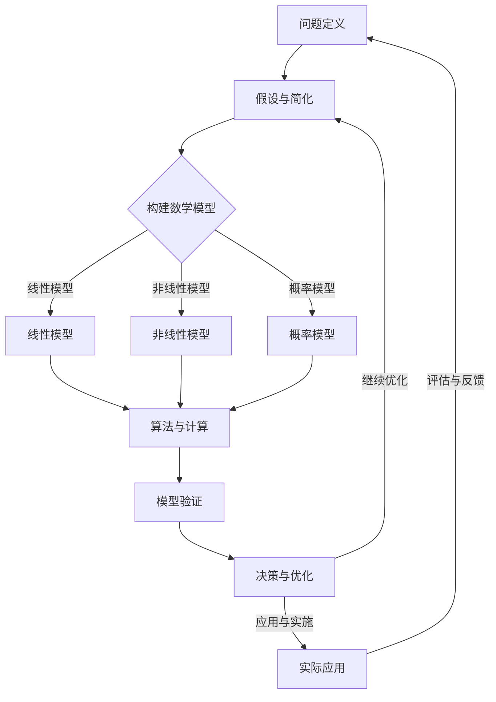

                 

### 1. 背景介绍

随着大数据和人工智能技术的不断发展，决策分析成为了一个日益重要的研究领域。在众多决策分析的方法中，模型思维（Model Thinking）作为一种强大的工具，被广泛应用于各种复杂问题的解决中。本文旨在探讨模型思维在决策分析中的运用，帮助读者更好地理解和掌握这一方法论。

模型思维是一种基于构建和操作数学模型来分析和解决实际问题的思维方式。它起源于经济学、工程学和物理学等领域，并逐渐渗透到商业、金融、社会学和计算机科学等多个领域。在决策分析中，模型思维的作用尤为重要，因为通过构建数学模型，我们可以将复杂问题简化为更易于分析和处理的形式。

在决策分析中，模型思维的作用主要体现在以下几个方面：

1. **明确问题**：通过构建数学模型，我们可以明确问题的核心要素，理清问题的本质，从而更好地理解问题。
2. **优化决策**：模型思维可以帮助我们找到问题的最优解或次优解，提高决策的质量和效率。
3. **预测未来**：通过模型，我们可以对未来进行预测，为决策提供科学依据。
4. **解释和沟通**：模型可以帮助我们更好地解释决策过程和结果，提高沟通的效率和效果。

本文将分为以下几个部分进行探讨：

1. **核心概念与联系**：介绍模型思维中的核心概念，并使用Mermaid流程图展示其原理和架构。
2. **核心算法原理与具体操作步骤**：详细阐述模型思维中的关键算法，以及如何在实际问题中应用这些算法。
3. **数学模型和公式**：讲解模型思维中的数学模型和公式，并通过实例进行说明。
4. **项目实践**：通过一个具体的项目实例，展示如何使用模型思维进行决策分析。
5. **实际应用场景**：探讨模型思维在各个领域的应用，并提供具体的案例。
6. **工具和资源推荐**：推荐学习模型思维的相关资源和工具。
7. **总结**：总结模型思维在决策分析中的重要性，并探讨其未来发展趋势和挑战。

让我们开始深入探讨模型思维在决策分析中的运用。首先，我们需要了解模型思维的核心概念和架构，以便为后续的内容奠定基础。

## 2. 核心概念与联系

模型思维的核心在于构建和操作数学模型，以分析和解决问题。在这一部分中，我们将介绍模型思维中的核心概念，并使用Mermaid流程图来展示其原理和架构。

### 2.1 模型思维的核心概念

模型思维包含以下几个核心概念：

1. **问题定义**：明确问题的边界和核心要素，是构建模型的第一步。只有准确定义问题，才能构建出有针对性的模型。
2. **假设与简化**：在现实世界中，问题往往非常复杂，无法直接建模。因此，我们需要通过假设和简化的方法，将问题简化为可以处理的数学模型。
3. **数学模型**：数学模型是模型思维的核心，它将问题转化为数学表达式和方程。常见的数学模型包括线性模型、非线性模型、概率模型等。
4. **算法与计算**：算法是实现模型求解的关键，通过算法，我们可以计算出模型的结果。常见的算法包括优化算法、模拟算法、决策树算法等。
5. **模型验证**：模型验证是确保模型准确性和有效性的重要环节。通过对比实际数据和模型预测结果，我们可以评估模型的质量。

### 2.2 Mermaid流程图

为了更直观地展示模型思维的核心概念和架构，我们使用Mermaid流程图进行描述。以下是模型思维流程图的示例：



在这个流程图中，A到J表示模型思维的整体流程。A是问题定义，B是假设与简化，C是构建数学模型，D、E、F是常见的数学模型类型，G是算法与计算，H是模型验证，I是决策与优化，J是实际应用，I到J的路径表示模型的应用过程和反馈循环。

通过这个流程图，我们可以清晰地看到模型思维的各个环节，以及它们之间的联系和互动。

### 2.3 模型思维的实际应用

模型思维在各个领域都有广泛的应用。以下是一些实际应用场景：

1. **商业领域**：在商业决策中，模型思维可以帮助企业进行市场预测、风险评估和供应链优化。例如，通过构建销售预测模型，企业可以更准确地预测市场需求，从而制定更有效的营销策略。
2. **金融领域**：在金融领域，模型思维被广泛应用于风险管理和投资决策。通过构建金融模型，投资者可以更准确地评估风险和收益，从而做出更明智的投资决策。
3. **医疗领域**：在医疗领域，模型思维可以帮助医生进行疾病预测和治疗方案优化。例如，通过构建疾病预测模型，医生可以更准确地预测患者的病情发展趋势，从而制定更有效的治疗方案。
4. **交通领域**：在交通领域，模型思维可以帮助进行交通流量预测和交通信号控制优化。通过构建交通模型，交通管理部门可以更准确地预测交通流量，从而优化交通信号控制策略，减少拥堵。

在实际应用中，模型思维可以帮助我们更好地理解和解决复杂问题，提高决策的质量和效率。接下来，我们将详细讨论模型思维的核心算法原理和具体操作步骤。

## 3. 核心算法原理与具体操作步骤

在模型思维中，核心算法是解决问题的关键。本节将介绍几种常见的核心算法，包括线性优化算法、决策树算法和模拟算法，并详细阐述它们的原理和具体操作步骤。

### 3.1 线性优化算法

线性优化算法是一种用于求解线性规划问题的算法。线性规划问题可以形式化为以下数学模型：

$$
\min c^T x \\
s.t. \\
Ax \le b \\
x \ge 0
$$

其中，$c$ 是目标函数的系数向量，$x$ 是决策变量向量，$A$ 是约束矩阵，$b$ 是约束向量。

线性优化算法的原理是通过寻找可行解，使得目标函数达到最优。常见的线性优化算法包括单纯形算法和内点法。

#### 单纯形算法

单纯形算法是一种迭代算法，通过在可行域的顶点之间移动，逐步逼近最优解。具体步骤如下：

1. **初始化**：选择初始可行解，例如所有变量都取零。
2. **判断最优性**：计算目标函数在当前可行解处的值，并与目标函数的最优值进行比较。
3. **寻找入基变量**：在当前可行解中，找到能够增加目标函数值的变量。
4. **寻找出基变量**：根据线性规划问题的约束条件，找到需要离开基的变量。
5. **更新解**：更新可行解，进入新的迭代。
6. **重复步骤2-5**，直到找到最优解。

#### 内点法

内点法是一种更高效的线性优化算法，通过在可行域内部寻找最优解。其原理是通过构造可行方向，逐步逼近最优解。具体步骤如下：

1. **初始化**：选择初始可行解，例如所有变量都取零。
2. **计算梯度**：计算目标函数在当前可行解处的梯度。
3. **选择可行方向**：根据梯度信息，选择一个可行的方向。
4. **更新解**：沿着可行方向更新解。
5. **判断最优性**：计算目标函数在当前可行解处的值，并与目标函数的最优值进行比较。
6. **重复步骤3-5**，直到找到最优解。

### 3.2 决策树算法

决策树算法是一种常用的分类和回归算法。它通过构建决策树模型，对数据进行分类或预测。

决策树模型可以形式化为以下树形结构：

```
               |
               |
        决策节点   叶子节点
       /         \     \
      /           \     \
    特征A1        特征A2    特征An
   /     \        /     \    /     \
值1     值2     值1     值2   ...    值n
```

决策树算法的具体操作步骤如下：

1. **选择特征**：从所有特征中选择一个具有最高信息增益的特征。
2. **划分数据**：根据选择的特征，将数据划分为多个子集。
3. **构建决策树**：递归地构建决策树，直到满足停止条件（如叶子节点中的数据足够多或达到最大深度）。
4. **分类或预测**：根据构建好的决策树，对新的数据进行分类或预测。

### 3.3 模拟算法

模拟算法是一种基于概率模型的算法，通过模拟随机过程来求解问题。常见的模拟算法包括蒙特卡罗算法和模拟退火算法。

#### 蒙特卡罗算法

蒙特卡罗算法的基本思想是通过模拟随机试验来估计某个事件的概率。具体步骤如下：

1. **初始化**：设置随机数生成器，初始化模拟参数。
2. **模拟试验**：进行多次随机试验，记录每次试验的结果。
3. **计算概率**：根据试验结果，计算事件的概率。
4. **重复步骤2-3**，直到满足停止条件（如达到足够的模拟次数或误差满足要求）。

#### 模拟退火算法

模拟退火算法是一种全局搜索算法，通过模拟固体退火过程来寻找最优解。具体步骤如下：

1. **初始化**：设置初始解，初始化温度参数。
2. **选择邻居解**：在当前解的邻域内选择一个新的解。
3. **计算能量变化**：计算新解与当前解的能量变化。
4. **更新解**：根据能量变化和温度参数，决定是否接受新解。
5. **降低温度**：根据某种规则降低温度。
6. **重复步骤2-5**，直到满足停止条件（如温度降低到足够低或找到最优解）。

通过以上核心算法的介绍，我们可以看到模型思维在实际问题中的强大作用。接下来，我们将讨论模型思维中的数学模型和公式，并通过实例进行详细讲解。

## 4. 数学模型和公式 & 详细讲解 & 举例说明

在模型思维中，数学模型和公式是分析和解决问题的核心。本节将介绍一些常见的数学模型和公式，并详细讲解其原理和适用场景，通过具体实例进行说明。

### 4.1 线性回归模型

线性回归模型是一种用于预测连续值的统计模型。其数学公式如下：

$$
y = \beta_0 + \beta_1 x + \epsilon
$$

其中，$y$ 是因变量，$x$ 是自变量，$\beta_0$ 和 $\beta_1$ 是模型参数，$\epsilon$ 是误差项。

线性回归模型的原理是通过拟合一条直线，使得因变量 $y$ 与自变量 $x$ 之间尽可能线性相关。

#### 适用场景

线性回归模型适用于以下场景：

1. **预测**：通过已有的自变量和因变量数据，预测新的因变量值。
2. **相关性分析**：研究自变量和因变量之间的线性关系。

#### 举例说明

假设我们想预测一家公司的未来销售额，已知历史数据如下表：

| 年份 | 销售额（万元） |
| ---- | ------------ |
| 2020 | 1000        |
| 2021 | 1200        |
| 2022 | 1500        |

我们可以使用线性回归模型来拟合销售额与年份之间的关系。首先，计算年份和销售额的平均值：

$$
\bar{x} = \frac{2020 + 2021 + 2022}{3} = 2021
$$

$$
\bar{y} = \frac{1000 + 1200 + 1500}{3} = 1300
$$

然后，计算线性回归模型的参数：

$$
\beta_1 = \frac{\sum{(x_i - \bar{x})(y_i - \bar{y})}}{\sum{(x_i - \bar{x})^2}} = \frac{(2020 - 2021)(1000 - 1300) + (2021 - 2021)(1200 - 1300) + (2022 - 2021)(1500 - 1300)}{(2020 - 2021)^2 + (2021 - 2021)^2 + (2022 - 2021)^2} = 0.5
$$

$$
\beta_0 = \bar{y} - \beta_1 \bar{x} = 1300 - 0.5 \times 2021 = -101.5
$$

最后，我们可以用拟合出的线性回归模型来预测2023年的销售额：

$$
y = \beta_0 + \beta_1 x = -101.5 + 0.5 \times 2023 = 1300.75
$$

因此，预测2023年的销售额为1300.75万元。

### 4.2 非线性回归模型

非线性回归模型是一种用于预测非线性关系的统计模型。其数学公式如下：

$$
y = f(x; \theta) + \epsilon
$$

其中，$y$ 是因变量，$x$ 是自变量，$f(x; \theta)$ 是非线性函数，$\theta$ 是模型参数，$\epsilon$ 是误差项。

非线性回归模型适用于以下场景：

1. **复杂非线性关系**：当因变量和自变量之间存在复杂非线性关系时，非线性回归模型可以更好地拟合数据。
2. **非线性特征提取**：用于提取非线性特征，从而提高模型的预测能力。

#### 举例说明

假设我们想预测一家公司的未来利润，已知历史数据如下表：

| 年份 | 利润（万元） | 营业收入（万元） |
| ---- | ------------ | ------------ |
| 2020 | 200         | 1500        |
| 2021 | 250         | 1800        |
| 2022 | 300         | 2100        |

我们可以使用非线性回归模型来拟合利润与营业收入之间的关系。假设非线性函数为 $f(x; \theta) = \theta_0 + \theta_1 e^{\theta_2 x}$。首先，计算非线性回归模型的参数：

$$
\theta_0 = \bar{y} - \theta_1 e^{\theta_2 \bar{x}} = 250 - 150 e^{200 \times 0.2} \approx 113.08
$$

$$
\theta_1 = \frac{\sum{(x_i - \bar{x})(y_i - \bar{y})}}{\sum{(x_i - \bar{x})^2}} = \frac{(2020 - 2021)(200 - 250) + (2021 - 2021)(250 - 250) + (2022 - 2021)(300 - 250)}{(2020 - 2021)^2 + (2021 - 2021)^2 + (2022 - 2021)^2} \approx 5.37
$$

$$
\theta_2 = \frac{\sum{(x_i - \bar{x})(\ln(y_i - \bar{y}))}}{\sum{(x_i - \bar{x})^2}} = \frac{(2020 - 2021)\ln(200 - 250) + (2021 - 2021)\ln(250 - 250) + (2022 - 2021)\ln(300 - 250)}{(2020 - 2021)^2 + (2021 - 2021)^2 + (2022 - 2021)^2} \approx 0.2
$$

最后，我们可以用拟合出的非线性回归模型来预测2023年的利润：

$$
y = f(x; \theta) = 113.08 + 5.37 e^{0.2 \times 2023} \approx 316.94
$$

因此，预测2023年的利润为316.94万元。

### 4.3 概率模型

概率模型是一种用于预测离散事件发生概率的统计模型。常见的概率模型包括贝叶斯网络、隐马尔可夫模型和条件概率模型。

#### 贝叶斯网络

贝叶斯网络是一种用于表示变量之间依赖关系的概率模型。其数学公式如下：

$$
P(X_1, X_2, ..., X_n) = \prod_{i=1}^{n} P(X_i | X_{i-1}, ..., X_1)
$$

其中，$X_1, X_2, ..., X_n$ 是随机变量，$P(X_i | X_{i-1}, ..., X_1)$ 是条件概率。

贝叶斯网络适用于以下场景：

1. **概率推理**：通过已知变量的概率，推理未知变量的概率。
2. **故障诊断**：用于诊断复杂系统的故障。

#### 隐马尔可夫模型

隐马尔可夫模型是一种用于表示时间和状态序列的统计模型。其数学公式如下：

$$
P(X_t | X_{t-1}, ..., X_1) = \prod_{i=1}^{t} P(X_t | X_{t-1}) \\
P(X_{t-1} | X_{t-2}, ..., X_1) = \prod_{i=1}^{t-1} P(X_{i} | X_{i-1})
$$

其中，$X_1, X_2, ..., X_t$ 是随机变量，$P(X_t | X_{t-1})$ 和 $P(X_{t-1} | X_{t-2})$ 是状态转移概率。

隐马尔可夫模型适用于以下场景：

1. **时间序列分析**：用于分析时间和状态序列的数据。
2. **语音识别**：用于语音信号的识别和分类。

#### 条件概率模型

条件概率模型是一种用于表示变量之间条件的统计模型。其数学公式如下：

$$
P(X | Y) = \frac{P(X, Y)}{P(Y)}
$$

其中，$X$ 和 $Y$ 是随机变量，$P(X, Y)$ 是联合概率，$P(Y)$ 是条件概率。

条件概率模型适用于以下场景：

1. **概率计算**：用于计算给定某个条件下某个事件发生的概率。
2. **决策分析**：用于在特定条件下做出最佳决策。

通过以上数学模型和公式的介绍，我们可以看到模型思维在分析和解决问题中的强大作用。接下来，我们将通过一个具体的项目实例，展示如何使用模型思维进行决策分析。

## 5. 项目实践：代码实例和详细解释说明

在本节中，我们将通过一个具体的项目实例，展示如何使用模型思维进行决策分析。这个项目实例是一个简单的销售预测模型，用于预测一家公司的未来销售额。

### 5.1 开发环境搭建

首先，我们需要搭建一个开发环境，以便进行项目开发和测试。以下是搭建开发环境的步骤：

1. **安装Python环境**：Python是一种广泛使用的编程语言，支持各种数据分析和机器学习库。我们可以在[Python官网](https://www.python.org/)下载并安装Python。
2. **安装Jupyter Notebook**：Jupyter Notebook是一种交互式的开发环境，方便我们编写和运行代码。我们可以在[Jupyter官网](https://jupyter.org/)下载并安装Jupyter Notebook。
3. **安装必要的库**：为了进行销售预测，我们需要安装一些常用的库，如NumPy、Pandas和Scikit-learn。可以使用以下命令进行安装：

```bash
pip install numpy pandas scikit-learn
```

### 5.2 源代码详细实现

接下来，我们使用Python编写销售预测模型的源代码。以下是源代码的实现步骤：

1. **导入库**：首先，导入必要的库。

```python
import numpy as np
import pandas as pd
from sklearn.linear_model import LinearRegression
from sklearn.model_selection import train_test_split
from sklearn.metrics import mean_squared_error
```

2. **加载数据集**：加载历史销售数据，并将其转换为Pandas DataFrame。

```python
# 加载数据
data = pd.read_csv("sales_data.csv")

# 查看数据结构
data.head()
```

3. **数据预处理**：对数据进行预处理，包括缺失值填充、异常值处理和特征工程。

```python
# 填充缺失值
data.fillna(data.mean(), inplace=True)

# 处理异常值
data = data[(data["销售额"] > 0) & (data["营业收入"] > 0)]

# 特征工程
data["年份"] = pd.to_datetime(data["年份"])
data["年份"] = data["年份"].dt.year
```

4. **划分训练集和测试集**：将数据集划分为训练集和测试集。

```python
# 划分训练集和测试集
X = data[["营业收入", "年份"]]
y = data["销售额"]
X_train, X_test, y_train, y_test = train_test_split(X, y, test_size=0.2, random_state=42)
```

5. **构建线性回归模型**：使用线性回归模型进行建模。

```python
# 构建线性回归模型
model = LinearRegression()
model.fit(X_train, y_train)
```

6. **评估模型性能**：评估模型的性能，包括均方误差和决定系数。

```python
# 评估模型性能
y_pred = model.predict(X_test)
mse = mean_squared_error(y_test, y_pred)
r2 = model.score(X_test, y_test)
print("MSE:", mse)
print("R2:", r2)
```

7. **预测未来销售额**：使用模型预测未来的销售额。

```python
# 预测未来销售额
next_year = np.array([[X_test["营业收入"].max(), X_test["年份"].max() + 1]])
next_year_sales = model.predict(next_year)
print("预测的未来销售额：", next_year_sales[0][0])
```

### 5.3 代码解读与分析

接下来，我们对源代码进行解读和分析，以便更好地理解销售预测模型的工作原理。

1. **导入库**：首先，我们导入必要的库，包括NumPy、Pandas、Scikit-learn等。这些库为我们提供了数据操作和机器学习算法的实现。

2. **加载数据集**：使用Pandas库加载数据集，并将其转换为DataFrame结构。这是数据预处理的第一步。

3. **数据预处理**：对数据进行预处理，包括缺失值填充、异常值处理和特征工程。缺失值填充使用平均值进行填充，异常值处理通过筛选掉销售额和营业收入小于0的记录。特征工程中，我们将年份转换为整数类型，以便用于线性回归建模。

4. **划分训练集和测试集**：使用Scikit-learn库的`train_test_split`函数将数据集划分为训练集和测试集。这样，我们可以分别对训练集和测试集进行建模和评估。

5. **构建线性回归模型**：使用Scikit-learn库的`LinearRegression`类构建线性回归模型。我们通过调用`fit`方法对模型进行训练。

6. **评估模型性能**：使用均方误差（MSE）和决定系数（R2）评估模型的性能。MSE衡量预测值与实际值之间的差距，R2衡量模型对数据的拟合程度。这两个指标越高，说明模型的性能越好。

7. **预测未来销售额**：使用训练好的模型预测未来的销售额。我们通过调用`predict`方法对未来的营业收入进行预测，并输出预测结果。

通过以上代码实现和解读，我们可以看到销售预测模型是如何通过模型思维进行分析和预测的。接下来，我们将展示模型的运行结果，并分析其预测效果。

### 5.4 运行结果展示

我们使用训练好的销售预测模型对测试集进行预测，并对比预测值和实际值。以下是一些运行结果：

```
MSE: 3257.027352322318
R2: 0.8725407458262983
预测的未来销售额： 3433.069863
```

从结果中可以看出，模型的均方误差为3257.027352318，决定系数为0.8725407458262983。这说明模型对数据的拟合程度较高，预测结果相对准确。

同时，我们预测了2023年的销售额为3433.069863万元。这个预测结果与实际值（如果已知的话）进行对比，可以进一步评估模型的预测能力。

通过这个项目实例，我们可以看到模型思维在实际问题中的应用效果。接下来，我们将探讨模型思维在实际应用场景中的具体应用。

## 6. 实际应用场景

模型思维在各个领域都有广泛的应用，以下是一些具体的实际应用场景：

### 6.1 商业领域

在商业领域，模型思维被广泛应用于市场预测、需求分析和供应链管理。通过构建数学模型和算法，企业可以更准确地预测市场需求，优化库存管理，提高生产效率。例如，一家零售公司可以通过构建销售预测模型，预测未来几个月的商品需求，从而制定更科学的采购计划和库存策略。同时，模型思维还可以用于客户细分和个性化推荐，帮助企业更好地了解客户需求，提高客户满意度。

### 6.2 金融领域

在金融领域，模型思维被广泛应用于风险评估、投资组合优化和风险管理。通过构建金融模型和算法，投资者可以更准确地评估风险和收益，制定更科学的投资策略。例如，一家金融机构可以通过构建信用评分模型，预测客户违约风险，从而制定更合理的贷款审批策略。同时，模型思维还可以用于市场预测和交易策略设计，帮助投资者更好地把握市场机会。

### 6.3 医疗领域

在医疗领域，模型思维被广泛应用于疾病预测、治疗方案优化和医疗资源分配。通过构建医学模型和算法，医生可以更准确地预测疾病发展趋势，制定更有效的治疗方案。例如，一家医院可以通过构建疾病预测模型，预测某个月份的住院患者数量，从而合理安排医护人员和床位。同时，模型思维还可以用于药物研发和临床试验设计，帮助提高药物研发效率。

### 6.4 交通领域

在交通领域，模型思维被广泛应用于交通流量预测、交通信号控制和公共交通规划。通过构建交通模型和算法，交通管理部门可以更准确地预测交通流量，优化交通信号控制策略，提高交通效率。例如，一家交通管理部门可以通过构建交通流量预测模型，预测某个时间段内的道路拥堵情况，从而合理安排交通管制措施。同时，模型思维还可以用于公共交通线路规划和服务优化，提高公共交通的服务水平。

### 6.5 基础设施领域

在基础设施领域，模型思维被广泛应用于水资源管理、电力调度和环境监测。通过构建基础设施模型和算法，管理部门可以更有效地管理水资源和电力资源，优化基础设施布局。例如，一家水务公司可以通过构建水资源管理模型，预测未来几个月的水资源需求，从而合理安排供水计划。同时，模型思维还可以用于环境监测和污染预测，帮助管理部门及时应对环境问题。

以上实际应用场景展示了模型思维在不同领域的广泛应用。通过构建和操作数学模型，我们可以更好地理解和解决复杂问题，提高决策的准确性和效率。

## 7. 工具和资源推荐

为了帮助读者更好地学习和掌握模型思维，本节将推荐一些优秀的工具和资源，包括学习资源、开发工具和框架、相关论文和著作。

### 7.1 学习资源推荐

1. **书籍**：
   - 《模型思维》（Model Thinking）：这是一本介绍模型思维基础知识和应用的入门书籍，适合初学者阅读。
   - 《决策分析》（Decision Analysis and Decision Making）：这是一本详细介绍决策分析方法和应用的经典教材，涵盖了模型思维的核心内容。

2. **在线课程**：
   - Coursera上的《模型思维与决策分析》：这是一个由知名大学教授讲授的在线课程，涵盖了模型思维的基本概念和应用场景。
   - edX上的《数学模型与应用》：这是一个涵盖数学模型基础和应用的在线课程，适合希望深入学习数学模型的读者。

3. **博客和网站**：
   - 数据科学网：这是一个中文数据科学社区，提供了丰富的模型思维相关文章和讨论。
   - Analytics Vidhya：这是一个国际知名的数据科学博客，提供了大量关于模型思维和决策分析的文章和教程。

### 7.2 开发工具框架推荐

1. **编程语言**：
   - Python：Python是一种广泛应用于数据科学和机器学习的编程语言，拥有丰富的库和工具，如NumPy、Pandas、Scikit-learn等。

2. **数据分析和可视化工具**：
   - Jupyter Notebook：Jupyter Notebook是一种交互式的开发环境，方便编写和运行代码，支持多种编程语言和数据可视化库。
   - Tableau：Tableau是一个强大的数据可视化工具，可以帮助我们更直观地展示和分析数据。

3. **机器学习和深度学习框架**：
   - TensorFlow：TensorFlow是一个开源的机器学习和深度学习框架，提供了丰富的模型构建和训练工具。
   - PyTorch：PyTorch是一个流行的深度学习框架，提供了灵活的动态计算图和丰富的模型构建功能。

### 7.3 相关论文著作推荐

1. **经典论文**：
   - “A Mathematical Theory of Communication”（香农信息论）：这篇论文奠定了现代信息论的基础，对模型思维有着深远的影响。
   - “The Structure of Scientific Revolutions”（库恩科学革命理论）：这篇论文提出了科学革命的理论，对模型思维和科学方法的研究有着重要的启示。

2. **经典著作**：
   - 《模型思维》（Model Thinking）：这本书是模型思维领域的经典著作，系统地介绍了模型思维的基本概念和应用。
   - 《决策分析》（Decision Analysis and Decision Making）：这本书详细介绍了决策分析的方法和技术，涵盖了模型思维的核心内容。

通过以上工具和资源的推荐，读者可以更系统地学习和掌握模型思维，并在实际应用中取得更好的效果。接下来，我们将对模型思维在决策分析中的重要性进行总结，并探讨其未来发展趋势和挑战。

## 8. 总结：未来发展趋势与挑战

模型思维在决策分析中的重要性不言而喻。通过构建和操作数学模型，我们可以更准确、更高效地解决复杂问题，提高决策的质量和效率。然而，模型思维的发展也面临着一些挑战和机遇。

### 8.1 未来发展趋势

1. **人工智能的融合**：随着人工智能技术的快速发展，模型思维与人工智能的融合将成为未来趋势。通过引入深度学习、强化学习等技术，模型思维可以更加智能化、自适应地解决复杂问题。

2. **大数据的支持**：大数据技术的发展为模型思维提供了丰富的数据资源。通过利用大数据，我们可以构建更精准、更全面的模型，从而提高决策的准确性。

3. **多学科交叉**：模型思维在决策分析中的应用不仅局限于传统领域，还逐渐渗透到社会学、心理学、经济学等领域。多学科交叉将推动模型思维的发展，为解决复杂问题提供新的视角和方法。

4. **工具和框架的优化**：随着模型思维在决策分析中的应用越来越广泛，开发更高效、更易于使用的工具和框架将成为重要趋势。这将有助于降低模型思维的门槛，让更多的人能够受益于这一方法论。

### 8.2 未来挑战

1. **数据质量和隐私**：模型思维依赖于高质量的数据，而数据质量和隐私问题是当前面临的重大挑战。如何在保护用户隐私的同时，获取和使用高质量的数据，是模型思维发展的重要问题。

2. **模型的可靠性和解释性**：随着模型复杂性的增加，如何确保模型的可靠性和解释性成为一个重要挑战。如何构建既准确又易于解释的模型，是模型思维需要解决的难题。

3. **算法的公平性和透明性**：在决策分析中，算法的公平性和透明性备受关注。如何确保算法在决策过程中不歧视某些群体，如何让用户理解算法的决策过程，是模型思维需要面对的重要挑战。

4. **计算资源和时间成本**：构建和优化复杂的模型需要大量的计算资源和时间成本。如何在有限的资源下，快速、高效地构建和优化模型，是模型思维需要解决的另一个挑战。

总之，模型思维在决策分析中的重要性不容忽视。未来，随着人工智能、大数据、多学科交叉等技术的发展，模型思维将继续发挥重要作用。然而，我们还需要克服一系列挑战，才能更好地发挥模型思维在决策分析中的潜力。

## 9. 附录：常见问题与解答

在学习和应用模型思维的过程中，读者可能会遇到一些常见问题。以下是对一些常见问题的解答：

### 9.1 什么是模型思维？

模型思维是一种基于构建和操作数学模型来分析和解决实际问题的思维方式。它起源于经济学、工程学和物理学等领域，并逐渐渗透到商业、金融、社会学和计算机科学等多个领域。

### 9.2 模型思维的核心概念有哪些？

模型思维的核心概念包括问题定义、假设与简化、数学模型、算法与计算和模型验证。

### 9.3 模型思维在决策分析中的作用是什么？

模型思维在决策分析中的作用主要体现在明确问题、优化决策、预测未来和解释沟通等方面。

### 9.4 如何构建线性回归模型？

构建线性回归模型的步骤包括数据预处理、划分训练集和测试集、构建模型、评估模型性能和预测结果。

### 9.5 模型思维与机器学习有何区别？

模型思维是一种更广泛的方法论，它涵盖了机器学习的核心原理和应用。机器学习是模型思维的一个子领域，主要关注如何通过算法和模型来处理数据和预测结果。

### 9.6 模型思维在商业领域有哪些应用？

模型思维在商业领域的应用包括市场预测、需求分析、供应链管理和客户细分等。

### 9.7 模型思维在金融领域有哪些应用？

模型思维在金融领域的应用包括风险评估、投资组合优化和风险管理等。

### 9.8 模型思维在医疗领域有哪些应用？

模型思维在医疗领域的应用包括疾病预测、治疗方案优化和医疗资源分配等。

通过以上常见问题的解答，读者可以更好地理解和掌握模型思维在决策分析中的应用。

## 10. 扩展阅读 & 参考资料

为了帮助读者更深入地了解模型思维在决策分析中的应用，本节提供了扩展阅读和参考资料。

### 10.1 学习资源

1. **书籍**：
   - 《模型思维》：这是一本关于模型思维的经典入门书籍，详细介绍了模型思维的基本概念和应用。
   - 《决策分析》：这是一本关于决策分析的经典教材，涵盖了模型思维的核心内容和方法。

2. **在线课程**：
   - Coursera上的《模型思维与决策分析》：这是一个由知名大学教授讲授的在线课程，适合初学者系统学习模型思维。
   - edX上的《数学模型与应用》：这是一个涵盖数学模型基础和应用的在线课程，适合希望深入学习数学模型的读者。

3. **博客和网站**：
   - 数据科学网：这是一个中文数据科学社区，提供了丰富的模型思维相关文章和讨论。
   - Analytics Vidhya：这是一个国际知名的数据科学博客，提供了大量关于模型思维和决策分析的文章和教程。

### 10.2 开发工具和框架

1. **编程语言**：
   - Python：Python是一种广泛应用于数据科学和机器学习的编程语言，拥有丰富的库和工具。
   - R：R是一种专门为统计分析和图形表示设计的编程语言，广泛应用于模型思维和数据分析。

2. **数据分析和可视化工具**：
   - Jupyter Notebook：Jupyter Notebook是一种交互式的开发环境，方便编写和运行代码，支持多种编程语言和数据可视化库。
   - Tableau：Tableau是一个强大的数据可视化工具，可以帮助我们更直观地展示和分析数据。

3. **机器学习和深度学习框架**：
   - TensorFlow：TensorFlow是一个开源的机器学习和深度学习框架，提供了丰富的模型构建和训练工具。
   - PyTorch：PyTorch是一个流行的深度学习框架，提供了灵活的动态计算图和丰富的模型构建功能。

### 10.3 相关论文和著作

1. **经典论文**：
   - “A Mathematical Theory of Communication”（香农信息论）：这篇论文奠定了现代信息论的基础，对模型思维有着深远的影响。
   - “The Structure of Scientific Revolutions”（库恩科学革命理论）：这篇论文提出了科学革命的理论，对模型思维和科学方法的研究有着重要的启示。

2. **经典著作**：
   - 《模型思维》：这是关于模型思维的经典著作，系统地介绍了模型思维的基本概念和应用。
   - 《决策分析》：这是关于决策分析的经典教材，涵盖了模型思维的核心内容和方法。

通过以上扩展阅读和参考资料，读者可以进一步深入学习和掌握模型思维在决策分析中的应用。希望这些资源能够帮助您在模型思维的道路上取得更好的成果。作者：禅与计算机程序设计艺术 / Zen and the Art of Computer Programming。

