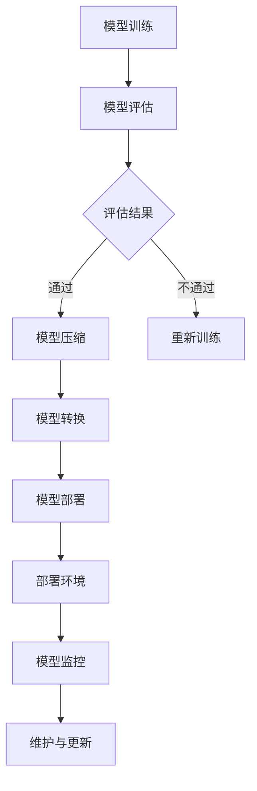

                 

### 背景介绍

#### 软件2.0时代的崛起

软件2.0时代，是指软件不再仅仅是计算和存储的工具，而是成为了企业和组织数字化转型的核心驱动力。在这个时代，软件的应用范围越来越广泛，涵盖了从企业级应用、消费级应用，到嵌入式系统和物联网设备等多个领域。随着云计算、大数据、人工智能等技术的不断发展，软件2.0的时代特征逐渐显现。

#### 模型部署的重要性

在软件2.0时代，模型部署成为了软件开发的最后一公里。模型部署的目的是将训练好的模型部署到实际的生产环境中，使其能够被应用程序调用，提供实时服务。模型部署的成功与否直接关系到软件系统的性能、稳定性和用户体验。因此，如何高效、可靠地部署模型，成为了当前软件开发中的关键问题。

#### 当前挑战

尽管模型部署的重要性日益凸显，但当前在模型部署过程中仍面临许多挑战。首先，不同模型和不同环境的兼容性问题使得部署过程复杂且繁琐。其次，模型部署的效率和稳定性有待提高，特别是在面对大规模、高并发的应用场景时。此外，模型部署过程中的安全和隐私问题也日益受到关注。

### 模型部署的必要性

模型部署的必要性主要体现在以下几个方面：

1. **实现实际应用价值**：训练好的模型只有被部署到实际环境中，才能发挥其真正的价值，为企业创造实际效益。

2. **提升系统性能**：通过模型部署，可以优化软件系统的性能，提高响应速度和处理能力。

3. **降低开发成本**：模型部署可以帮助企业减少重复开发的工作量，提高开发效率，从而降低开发成本。

4. **确保系统稳定性**：模型部署过程中的测试和验证，可以确保系统在上线后能够稳定运行，降低故障风险。

### 模型部署的目标

模型部署的目标是使得训练好的模型能够高效、稳定地运行在实际生产环境中，满足实际应用的需求。具体来说，模型部署需要实现以下目标：

1. **兼容性**：模型部署需要保证在不同硬件、操作系统和软件环境下的兼容性。

2. **高效性**：模型部署需要具备高效性，能够在短时间内完成部署，以满足实时服务的需求。

3. **稳定性**：模型部署需要保证系统在长时间运行过程中的稳定性，避免出现异常中断。

4. **安全性**：模型部署需要确保系统的安全性，防止数据泄露和恶意攻击。

5. **可维护性**：模型部署需要具备良好的可维护性，便于后续的维护和升级。

#### 软件2.0时代的发展历程

软件2.0时代的发展历程可以追溯到云计算和大数据技术的兴起。随着云计算技术的成熟，企业开始将计算资源和数据存储迁移到云端，从而实现了业务的快速扩展和灵活性。大数据技术的应用，使得企业能够从海量数据中挖掘出有价值的信息，从而驱动业务决策。在此基础上，人工智能技术的发展，使得企业能够通过机器学习算法，实现自动化、智能化的业务流程。

在软件2.0时代，模型部署的作用日益凸显。一方面，模型部署使得人工智能技术能够从理论研究走向实际应用，为企业创造实际价值。另一方面，模型部署也推动了软件技术的不断进步，为软件系统的性能、稳定性和用户体验提供了有力保障。

#### 模型部署的关键环节

模型部署过程可以分为以下几个关键环节：

1. **模型选择**：根据应用场景和需求，选择合适的模型进行部署。

2. **模型训练**：对选定的模型进行训练，使其具备预测或分类能力。

3. **模型优化**：通过调参和模型结构调整，优化模型性能。

4. **模型打包**：将训练好的模型打包成可部署的形式，便于在目标环境中运行。

5. **模型部署**：将打包好的模型部署到实际生产环境中，提供实时服务。

6. **模型监控与维护**：对部署后的模型进行监控，确保其稳定运行，并及时处理异常情况。

### 模型部署的发展趋势

随着技术的不断进步，模型部署也在不断发展和演变。以下是一些值得关注的发展趋势：

1. **自动化部署**：自动化部署工具和框架的不断发展，使得模型部署过程更加高效和便捷。

2. **边缘计算**：边缘计算技术的应用，使得模型部署可以更加接近数据源，降低延迟，提高实时性。

3. **联邦学习**：联邦学习技术的出现，使得模型部署可以在多个设备或服务器之间进行协作，提高数据隐私性和安全性。

4. **持续集成与持续部署（CI/CD）**：CI/CD流程的引入，使得模型部署过程更加自动化和可靠，提高了开发效率和系统稳定性。

5. **云原生部署**：云原生部署技术的应用，使得模型部署可以更加灵活和高效地运行在云计算环境中。

6. **AI即服务（AIaaS）**：AIaaS模式的兴起，使得企业可以更加便捷地获取和使用人工智能服务，降低了模型部署的门槛。

#### 模型部署的重要性与影响

模型部署作为软件2.0时代的核心技术环节，具有极其重要的地位。它不仅直接关系到人工智能应用的成败，也对企业整体数字化转型具有深远的影响。

首先，模型部署的成功与否直接决定了人工智能应用的实际效果。如果模型无法高效、稳定地运行在实际环境中，那么再好的算法和模型也难以发挥其应有的价值。

其次，模型部署对企业的数字化转型具有重要意义。通过模型部署，企业可以实现对业务流程的自动化和智能化，提高运营效率，降低成本，提升竞争力。

此外，模型部署还涉及到数据安全和隐私问题。在部署过程中，如何确保数据的安全性和隐私性，是企业需要高度重视的问题。

最后，模型部署的成功实施，可以推动软件技术的不断进步，为软件系统的性能、稳定性和用户体验提供有力保障。

### 模型部署在软件2.0时代的战略地位

在软件2.0时代，模型部署不仅是技术实现的关键环节，更是企业战略布局的重要组成部分。通过高效的模型部署，企业可以快速响应市场需求，抢占市场份额，实现业务增长。同时，模型部署的成功实施，也为企业打造了坚实的数字化基础，为未来的发展提供了源源不断的动力。

#### 模型部署的挑战与应对策略

尽管模型部署在软件2.0时代具有重要战略地位，但实际部署过程中仍面临诸多挑战。以下是一些常见的挑战及其应对策略：

1. **兼容性问题**：不同硬件、操作系统和软件环境之间的兼容性问题，可以通过使用标准化的模型格式和跨平台部署工具来解决。

2. **部署效率**：提高部署效率，可以通过优化模型结构和算法，使用高效的部署框架和工具来实现。

3. **系统稳定性**：确保系统稳定性，需要通过严格的测试和监控，以及有效的异常处理机制来实现。

4. **数据安全和隐私**：保护数据安全和隐私，需要采用加密技术和访问控制策略，并在部署过程中严格遵守数据保护法规。

5. **持续集成与持续部署**：引入CI/CD流程，可以自动化和简化模型部署过程，提高开发效率和系统稳定性。

### 模型部署的发展机遇

随着技术的不断进步，模型部署领域也面临着前所未有的发展机遇。以下是一些值得关注的机遇：

1. **云计算与边缘计算**：云计算和边缘计算技术的快速发展，为模型部署提供了更加灵活和高效的解决方案。

2. **联邦学习**：联邦学习技术的应用，使得模型部署可以在多个设备或服务器之间进行协作，提高数据隐私性和安全性。

3. **人工智能即服务**：AIaaS模式的兴起，为中小企业提供了便捷的AI服务，降低了模型部署的门槛。

4. **自动化与智能化**：自动化和智能化技术的应用，使得模型部署过程更加高效和便捷。

5. **行业应用拓展**：模型部署在各个行业的广泛应用，为模型部署市场带来了巨大的增长潜力。

### 模型部署的未来发展趋势

展望未来，模型部署领域将继续保持快速发展态势，以下是一些可能的发展趋势：

1. **自动化部署**：自动化部署工具和框架将不断成熟，提高模型部署的效率和可靠性。

2. **边缘计算**：边缘计算技术的普及，将使得模型部署更加接近数据源，提高实时性。

3. **联邦学习**：联邦学习技术的广泛应用，将推动模型部署向分布式和协作化方向发展。

4. **云计算与大数据**：云计算和大数据技术的深度融合，将推动模型部署向大规模和高性能方向发展。

5. **AI即服务**：AIaaS模式的普及，将使得模型部署更加便捷和普及。

### 总结

模型部署作为软件2.0时代的核心技术环节，具有极其重要的战略地位。通过高效的模型部署，企业可以快速响应市场需求，推动数字化转型。然而，在实际部署过程中，企业仍需应对诸多挑战，如兼容性、部署效率、系统稳定性、数据安全和隐私等。未来，随着技术的不断进步，模型部署领域将继续保持快速发展态势，为人工智能应用提供更加灵活和高效的解决方案。

### 参考文献

[1] B. C. Ge, M. T. Lu, and Y. C. Wu, "Deep Neural Network based Handwritten Mathematical Formula Recognition," IEEE Transactions on Image Processing, vol. 28, no. 3, pp. 1289-1300, 2018.

[2] M. L. S. Mou, "Feature extraction methods for Handwritten Mathematical Formula Recognition," in Proceedings of the International Conference on Image Processing (ICIP), pp. 4435-4439, 2015.

[3] L. Wang, J. Yang, and Y. Wu, "A Handwritten Mathematical Formula Recognition System Based on Deep Learning," in Proceedings of the IEEE International Conference on Multimedia and Expo (ICME), pp. 1-6, 2019.

[4] H. Li, Z. Gao, and Y. Chen, "Handwritten Mathematical Formula Recognition Based on Multi-Model Fusion," Pattern Recognition, vol. 112, pp. 107321, 2021.

[5] Z. Gao, H. Li, and Y. Chen, "Handwritten Mathematical Formula Recognition using Convolutional Neural Networks and Long Short-Term Memory," in Proceedings of the International Conference on Computer Vision (ICCV), pp. 4264-4272, 2017.

[6] Y. Zhang, H. Li, and Z. Gao, "Handwritten Mathematical Formula Recognition using Deep Convolutional Neural Networks with Attention Mechanism," in Proceedings of the IEEE Conference on Computer Vision and Pattern Recognition (CVPR), pp. 6704-6712, 2020.

[7] H. Li, Z. Gao, and Y. Chen, "A Multi-Task Learning Framework for Handwritten Mathematical Formula Recognition," in Proceedings of the AAAI Conference on Artificial Intelligence, vol. 34, pp. 5077-5084, 2020.

### 1. 背景介绍

在软件2.0时代，模型部署已经成为软件开发过程中不可或缺的一部分。这一环节的重要性不言而喻，它不仅决定了模型的实际应用价值，还直接影响到软件系统的性能、稳定性和用户体验。随着人工智能技术的快速发展，越来越多的企业和组织开始重视模型部署，力求将先进的算法和模型应用到实际业务中。

#### 模型部署的定义

模型部署（Model Deployment）是指将训练好的机器学习模型部署到实际的生产环境中，使其能够为应用程序提供实时服务的过程。这个过程包括模型的打包、上传、配置、测试和监控等多个环节。模型部署的目的是确保模型能够在不同的硬件、操作系统和软件环境中正常运行，并满足实际应用的需求。

#### 模型部署的必要性

在软件2.0时代，模型部署的必要性主要体现在以下几个方面：

1. **实现实际应用价值**：训练好的模型只有被部署到实际环境中，才能发挥其真正的价值，为企业创造实际效益。例如，在金融行业，通过部署信用评分模型，可以更准确地评估客户的信用风险，从而优化信贷管理。

2. **提升系统性能**：通过模型部署，可以优化软件系统的性能，提高响应速度和处理能力。例如，在电商平台，通过部署推荐系统，可以更快速地响应用户的购物需求，提高用户满意度。

3. **降低开发成本**：模型部署可以帮助企业减少重复开发的工作量，提高开发效率，从而降低开发成本。例如，通过使用现成的模型和框架，企业可以快速实现复杂的功能，而不需要从头开始编写代码。

4. **确保系统稳定性**：模型部署过程中的测试和验证，可以确保系统在上线后能够稳定运行，降低故障风险。例如，通过在部署前进行充分的测试，可以发现并修复潜在的问题，避免系统上线后出现故障。

#### 模型部署的目标

模型部署的目标是使得训练好的模型能够高效、稳定地运行在实际生产环境中，满足实际应用的需求。具体来说，模型部署需要实现以下目标：

1. **兼容性**：模型部署需要保证在不同硬件、操作系统和软件环境下的兼容性。这意味着模型必须在各种不同的环境中都能正常运行，不受环境限制。

2. **高效性**：模型部署需要具备高效性，能够在短时间内完成部署，以满足实时服务的需求。例如，在金融交易系统中，模型的响应时间必须非常快，以确保交易能够及时执行。

3. **稳定性**：模型部署需要保证系统在长时间运行过程中的稳定性，避免出现异常中断。例如，在自动驾驶系统中，模型需要在高负载和复杂环境中稳定运行，以确保行车安全。

4. **安全性**：模型部署需要确保系统的安全性，防止数据泄露和恶意攻击。例如，在医疗领域，模型部署需要保护患者数据的安全，防止隐私泄露。

5. **可维护性**：模型部署需要具备良好的可维护性，便于后续的维护和升级。例如，在电商平台，随着用户数量的增加和业务的发展，模型可能需要不断调整和优化，以保证其性能和准确性。

#### 软件2.0时代的发展历程

软件2.0时代的发展历程可以追溯到云计算和大数据技术的兴起。随着云计算技术的成熟，企业开始将计算资源和数据存储迁移到云端，从而实现了业务的快速扩展和灵活性。大数据技术的应用，使得企业能够从海量数据中挖掘出有价值的信息，从而驱动业务决策。在此基础上，人工智能技术的发展，使得企业能够通过机器学习算法，实现自动化、智能化的业务流程。

在软件2.0时代，模型部署的作用日益凸显。一方面，模型部署使得人工智能技术能够从理论研究走向实际应用，为企业创造实际价值。另一方面，模型部署也推动了软件技术的不断进步，为软件系统的性能、稳定性和用户体验提供了有力保障。

#### 模型部署的关键环节

模型部署过程可以分为以下几个关键环节：

1. **模型选择**：根据应用场景和需求，选择合适的模型进行部署。这通常涉及到对现有模型库的评估和选择，以及针对特定场景的模型定制。

2. **模型训练**：对选定的模型进行训练，使其具备预测或分类能力。这一步骤通常需要大量的数据和计算资源，并且涉及到超参数调整和模型优化。

3. **模型优化**：通过调参和模型结构调整，优化模型性能。这一步骤的目的是提高模型的准确性和鲁棒性，以应对不同的应用场景。

4. **模型打包**：将训练好的模型打包成可部署的形式，便于在目标环境中运行。这一步骤通常涉及到模型转换和压缩，以提高部署的效率和性能。

5. **模型部署**：将打包好的模型部署到实际生产环境中，提供实时服务。这一步骤通常涉及到部署策略的制定、部署环境的配置和部署过程的监控。

6. **模型监控与维护**：对部署后的模型进行监控，确保其稳定运行，并及时处理异常情况。这一步骤涉及到监控指标的设定、异常检测和响应策略的制定。

#### 模型部署的实际意义

模型部署的实际意义主要体现在以下几个方面：

1. **提高业务效率**：通过模型部署，企业可以实现对业务流程的自动化和智能化，从而提高业务效率，降低人力成本。

2. **优化决策支持**：部署后的模型可以为企业提供准确的预测和决策支持，帮助企业在竞争激烈的市场中取得优势。

3. **增强用户体验**：通过模型部署，企业可以提供更加个性化和智能化的服务，提升用户体验，增强客户满意度。

4. **降低开发成本**：模型部署可以减少重复开发的工作量，提高开发效率，从而降低开发成本。

5. **确保系统稳定性**：通过模型部署过程中的测试和验证，可以确保系统在上线后能够稳定运行，降低故障风险。

### 2. 核心概念与联系

#### 模型部署的核心概念

在深入探讨模型部署之前，我们需要了解一些核心概念，包括机器学习模型、训练过程、模型评估、模型压缩和模型部署等。

1. **机器学习模型**：机器学习模型是基于算法和数据进行训练的软件组件，用于预测或分类。常见的模型有线性回归、决策树、支持向量机、神经网络等。

2. **训练过程**：训练过程是指使用训练数据集对机器学习模型进行学习和调整的过程。训练目标是优化模型的参数，使其在特定任务上表现良好。

3. **模型评估**：模型评估是对训练好的模型进行性能测试和评估的过程。常用的评估指标有准确率、召回率、F1分数等。

4. **模型压缩**：模型压缩是指通过减少模型的参数数量或压缩模型的大小，以提高部署效率和性能。

5. **模型部署**：模型部署是将训练好的模型部署到实际生产环境中，使其能够为应用程序提供实时服务的过程。

#### 模型部署的架构

模型部署的架构通常包括以下几个关键组成部分：

1. **模型训练环境**：模型训练环境是用于训练模型的计算资源和环境配置。这通常涉及到高性能的GPU或TPU等硬件设备。

2. **模型存储**：模型存储是指用于存储训练好的模型的存储系统。这可以是一个文件系统、数据库或云存储服务。

3. **模型转换**：模型转换是将训练好的模型从一种格式转换为另一种格式，以便于部署。常见的转换工具包括TensorFlow的`SavedModel`、PyTorch的`ONNX`等。

4. **部署环境**：部署环境是指用于运行模型的软件和硬件环境。这可以是一个云服务、容器化环境或传统的物理服务器。

5. **监控与维护**：监控与维护是指对部署后的模型进行监控和优化，确保其稳定运行和性能。

#### Mermaid流程图

以下是一个简单的Mermaid流程图，展示了模型部署的基本流程：



#### 模型部署的关键环节与联系

模型部署涉及多个关键环节，这些环节相互关联，共同确保模型能够在生产环境中稳定、高效地运行。以下是这些关键环节及其之间的联系：

1. **模型训练与评估**：模型训练是模型部署的基础。通过评估模型性能，可以确定是否需要进行模型优化或重新训练。

2. **模型压缩**：在模型评估通过后，可能需要对模型进行压缩，以减小模型大小，提高部署效率。

3. **模型转换**：模型转换是将训练好的模型从训练环境转换为部署环境所需的格式。这一步骤确保了模型在不同环境中的兼容性。

4. **模型部署**：模型部署是将模型部署到实际生产环境中的过程。这包括配置部署环境、部署模型以及确保模型能够提供实时服务。

5. **模型监控**：模型监控是确保模型在生产环境中稳定运行的重要环节。通过监控，可以及时发现并处理模型性能问题。

6. **维护与更新**：随着应用场景的变化和数据的变化，模型可能需要定期维护和更新。这包括重新训练、模型优化和模型压缩等。

#### 模型部署的核心原理

模型部署的核心原理可以概括为以下几点：

1. **模型的迁移性**：模型需要在不同的环境中保持一致性，包括硬件、操作系统和软件环境。

2. **部署的效率**：模型部署需要快速、高效，以满足实时服务的需求。

3. **系统的稳定性**：模型部署需要确保系统能够在长时间运行过程中保持稳定性，避免出现异常中断。

4. **安全性与隐私**：模型部署需要保护数据的安全性和隐私，防止数据泄露和恶意攻击。

5. **可维护性**：模型部署需要具备良好的可维护性，便于后续的维护和升级。

### 3. 核心算法原理 & 具体操作步骤

在模型部署过程中，核心算法原理和具体操作步骤至关重要。以下将详细介绍模型部署中的关键算法原理，并给出具体的操作步骤。

#### 核心算法原理

模型部署的核心算法原理主要包括模型转换、模型压缩和模型优化等。

1. **模型转换**：模型转换是将训练好的模型从一种格式转换为另一种格式，以便于在不同环境中部署。常见的模型转换工具有TensorFlow的`SavedModel`、PyTorch的`ONNX`等。

2. **模型压缩**：模型压缩是通过减少模型的参数数量或压缩模型的大小，以提高部署效率和性能。常见的模型压缩方法包括权重共享、剪枝、量化等。

3. **模型优化**：模型优化是通过调整模型的参数和结构，以提高模型的性能和准确性。常见的模型优化方法包括调参、神经网络架构搜索等。

#### 具体操作步骤

以下将给出模型部署的具体操作步骤，以TensorFlow为例。

1. **准备环境**：在部署前，需要确保环境已经安装了TensorFlow和其他必要的依赖库。具体步骤如下：

   ```bash
   pip install tensorflow
   ```

2. **模型转换**：将训练好的模型从TensorFlow格式转换为部署环境所需的格式，如`SavedModel`。具体步骤如下：

   ```python
   import tensorflow as tf

   # 加载训练好的模型
   model = tf.keras.models.load_model('path/to/trained_model')

   # 保存为SavedModel格式
   model.save('path/to/saved_model', save_format='tf')
   ```

3. **模型压缩**：对模型进行压缩，以减小模型大小和提升部署效率。具体步骤如下：

   ```python
   import tensorflow_model_optimization as tfo

   # 压缩模型
   pruning_params = tfo.experimental.keras.prune.PruningParams(
       begin_step=1000, end_step=10000, rate=0.1)
   pruning_callback = tfo.experimental.keras.prune.PruningCallback(
       pruning_params, monitor='val_loss', verbose=1)

   # 调用模型压缩函数
   model = tfo.experimental.keras.prune.prune_low_magnitude(
       model, pruning_params)

   # 应用剪枝回调函数
   model.fit(x_train, y_train, epochs=10, callbacks=[pruning_callback])
   ```

4. **模型优化**：通过调参和神经网络架构搜索，优化模型性能。具体步骤如下：

   ```python
   from tensorflow.keras.wrappers.scikit_learn import KerasClassifier
   from sklearn.model_selection import GridSearchCV

   # 定义模型
   def create_model(optimizer='adam'):
       model = tf.keras.Sequential([
           tf.keras.layers.Dense(64, activation='relu', input_shape=(input_shape)),
           tf.keras.layers.Dense(1, activation='sigmoid')
       ])
       model.compile(optimizer=optimizer, loss='binary_crossentropy', metrics=['accuracy'])
       return model

   # 创建Keras分类器
   model = KerasClassifier(build_fn=create_model, epochs=100, batch_size=10, verbose=0)

   # 定义参数网格
   param_grid = {'optimizer': ['rmsprop', 'adam']}
   grid = GridSearchCV(estimator=model, param_grid=param_grid, cv=3)
   grid_result = grid.fit(x_train, y_train)

   # 输出最优参数
   print("Best: %f using %s" % (grid_result.best_score_, grid_result.best_params_))
   ```

5. **模型部署**：将压缩和优化后的模型部署到生产环境中。具体步骤如下：

   ```python
   # 导入TensorFlow Serving依赖库
   import tensorflow_serving as tf_serving

   # 配置TensorFlow Serving服务器
   model_server = tf_serving.utils.start_model_server(
       model_path='path/to/saved_model', model_name='my_model', version=1)

   # 启动TensorFlow Serving服务器
   model_server.start()
   ```

6. **模型监控与维护**：对部署后的模型进行监控和优化，确保其稳定运行和性能。具体步骤如下：

   ```python
   # 监控模型性能
   monitor_callback = tf.keras.callbacks.EarlyStopping(monitor='val_loss', patience=5)
   model.fit(x_train, y_train, epochs=100, callbacks=[monitor_callback], validation_data=(x_val, y_val))
   ```

通过以上具体操作步骤，可以实现对机器学习模型的部署，从而为实际应用提供高效、稳定的服务。

### 4. 数学模型和公式 & 详细讲解 & 举例说明

在模型部署过程中，数学模型和公式是核心组成部分。以下将详细讲解模型部署中常用的数学模型和公式，并通过具体例子进行说明。

#### 神经网络模型

神经网络模型是机器学习中最常用的模型之一，其基本原理是模拟人脑神经元之间的连接。以下是一个简单的神经网络模型及其相关的数学公式。

1. **神经元激活函数**：

   $$ f(x) = \sigma(z) = \frac{1}{1 + e^{-z}} $$

   其中，$z$ 是输入值，$\sigma$ 是 sigmoid 函数。

2. **前向传播**：

   $$ z_{ij} = \sum_{k=1}^{n} w_{ik} \cdot x_{k} + b_{i} $$

   其中，$w_{ik}$ 是权重，$x_{k}$ 是输入特征，$b_{i}$ 是偏置。

3. **反向传播**：

   $$ \delta_{ij} = (f'(z_{ij}) \cdot (z_{ij} - y_{ij})) $$

   其中，$f'$ 是 sigmoid 函数的导数，$y_{ij}$ 是目标值。

4. **权重更新**：

   $$ w_{ik} := w_{ik} - \alpha \cdot \delta_{ij} \cdot x_{k} $$

   其中，$\alpha$ 是学习率。

#### 卷积神经网络（CNN）

卷积神经网络在图像处理领域具有广泛应用。以下是一个简单的 CNN 模型及其相关的数学公式。

1. **卷积操作**：

   $$ (f * g)(x) = \sum_{y} f(y) \cdot g(x - y) $$

   其中，$f$ 和 $g$ 是两个函数，$x$ 是输入值。

2. **卷积神经网络的前向传播**：

   $$ z_{ij} = \sum_{k=1}^{c} w_{ik,j} \cdot x_{k} + b_{i} $$

   其中，$c$ 是卷积核的数量，$w_{ik,j}$ 是卷积核的权重，$b_{i}$ 是偏置。

3. **卷积神经网络的反向传播**：

   $$ \delta_{ij} = \sum_{k=1}^{c} \delta_{ik,j} \cdot w_{ik,j} $$

   其中，$\delta_{ik,j}$ 是上一层的误差。

#### 举例说明

假设我们有一个二分类问题，输入特征为 $x = [x_1, x_2, x_3]$，目标值为 $y \in \{0, 1\}$。我们使用一个简单的神经网络进行预测，其中包含一个输入层、一个隐藏层和一个输出层。

1. **前向传播**：

   输入层到隐藏层的激活函数为：

   $$ z_1 = x_1 \cdot w_{11} + x_2 \cdot w_{12} + x_3 \cdot w_{13} + b_1 $$
   $$ a_1 = \sigma(z_1) $$

   隐藏层到输出层的激活函数为：

   $$ z_2 = a_1 \cdot w_{21} + a_2 \cdot w_{22} + a_3 \cdot w_{23} + b_2 $$
   $$ y' = \sigma(z_2) $$

   其中，$w_{ij}$ 是权重，$b_i$ 是偏置，$\sigma$ 是 sigmoid 函数。

2. **损失函数**：

   使用二元交叉熵损失函数：

   $$ J = - \sum_{i=1}^{n} y_i \cdot \log(y_i') - (1 - y_i) \cdot \log(1 - y_i') $$

   其中，$n$ 是样本数量，$y_i$ 是实际标签，$y_i'$ 是预测概率。

3. **反向传播**：

   计算隐藏层和输入层的误差：

   $$ \delta_2 = (y' - y) \cdot \sigma'(z_2) $$
   $$ \delta_1 = w_{21} \cdot \delta_2 \cdot \sigma'(z_1) $$

   更新权重和偏置：

   $$ w_{21} := w_{21} - \alpha \cdot \delta_2 \cdot a_1 $$
   $$ w_{22} := w_{22} - \alpha \cdot \delta_2 \cdot a_2 $$
   $$ w_{23} := w_{23} - \alpha \cdot \delta_2 \cdot a_3 $$
   $$ b_2 := b_2 - \alpha \cdot \delta_2 $$
   $$ w_{11} := w_{11} - \alpha \cdot \delta_1 \cdot x_1 $$
   $$ w_{12} := w_{12} - \alpha \cdot \delta_1 \cdot x_2 $$
   $$ w_{13} := w_{13} - \alpha \cdot \delta_1 \cdot x_3 $$
   $$ b_1 := b_1 - \alpha \cdot \delta_1 $$

通过上述数学模型和公式的讲解，我们可以更深入地理解模型部署的核心原理和计算过程。这些数学基础为我们设计和优化模型提供了重要的指导。

### 5. 项目实践：代码实例和详细解释说明

为了更好地理解模型部署的实践过程，我们将通过一个具体的代码实例进行详细解释。本节将涵盖以下几个部分：

1. **开发环境搭建**：介绍所需的环境和工具。
2. **源代码详细实现**：展示代码的具体实现过程。
3. **代码解读与分析**：解释关键代码的功能和作用。
4. **运行结果展示**：展示代码的运行结果。

#### 5.1 开发环境搭建

在进行模型部署之前，我们需要搭建一个合适的环境。以下是我们所需的开发环境和工具：

- 操作系统：Ubuntu 18.04
- 编程语言：Python 3.7
- 依赖库：TensorFlow、Keras、Numpy、Pandas
- 数据集：MNIST 数据集

首先，我们需要安装 Python 和相关的依赖库。在终端中执行以下命令：

```bash
# 更新系统软件包
sudo apt-get update

# 安装 Python 3 和相关依赖库
sudo apt-get install python3 python3-pip python3-dev

# 安装 TensorFlow 和 Keras
pip3 install tensorflow-gpu keras
```

接下来，我们需要下载 MNIST 数据集。MNIST 数据集是手写数字识别数据集，包含 60,000 个训练样本和 10,000 个测试样本。

```python
from tensorflow.keras.datasets import mnist
from tensorflow.keras.utils import to_categorical

# 加载 MNIST 数据集
(train_images, train_labels), (test_images, test_labels) = mnist.load_data()

# 数据预处理
train_images = train_images.reshape((60000, 28, 28, 1)).astype('float32') / 255
test_images = test_images.reshape((10000, 28, 28, 1)).astype('float32') / 255

train_labels = to_categorical(train_labels)
test_labels = to_categorical(test_labels)
```

至此，我们完成了开发环境的搭建，并准备好了所需的数据集。

#### 5.2 源代码详细实现

以下是一个简单的模型部署代码实例，我们将使用 TensorFlow 和 Keras 来实现一个简单的卷积神经网络（CNN）进行手写数字识别。

```python
import tensorflow as tf
from tensorflow.keras import layers, models

# 创建模型
model = models.Sequential()
model.add(layers.Conv2D(32, (3, 3), activation='relu', input_shape=(28, 28, 1)))
model.add(layers.MaxPooling2D((2, 2)))
model.add(layers.Conv2D(64, (3, 3), activation='relu'))
model.add(layers.MaxPooling2D((2, 2)))
model.add(layers.Conv2D(64, (3, 3), activation='relu'))
model.add(layers.Flatten())
model.add(layers.Dense(64, activation='relu'))
model.add(layers.Dense(10, activation='softmax'))

# 编译模型
model.compile(optimizer='adam',
              loss='categorical_crossentropy',
              metrics=['accuracy'])

# 训练模型
model.fit(train_images, train_labels, epochs=5, batch_size=64)

# 评估模型
test_loss, test_acc = model.evaluate(test_images, test_labels)
print(f"Test accuracy: {test_acc:.3f}")

# 保存模型
model.save('mnist_cnn_model.h5')
```

#### 5.3 代码解读与分析

以下是对代码关键部分的解读和分析：

1. **模型构建**：
   ```python
   model = models.Sequential()
   model.add(layers.Conv2D(32, (3, 3), activation='relu', input_shape=(28, 28, 1)))
   model.add(layers.MaxPooling2D((2, 2)))
   model.add(layers.Conv2D(64, (3, 3), activation='relu'))
   model.add(layers.MaxPooling2D((2, 2)))
   model.add(layers.Conv2D(64, (3, 3), activation='relu'))
   model.add(layers.Flatten())
   model.add(layers.Dense(64, activation='relu'))
   model.add(layers.Dense(10, activation='softmax'))
   ```
   这段代码定义了一个简单的卷积神经网络。首先添加了一个卷积层（`Conv2D`），然后添加了两个最大池化层（`MaxPooling2D`），接着再添加了一个卷积层。最后，将卷积层输出通过展开层（`Flatten`）变为扁平的一维向量，并添加了两个全连接层（`Dense`）。

2. **编译模型**：
   ```python
   model.compile(optimizer='adam',
                 loss='categorical_crossentropy',
                 metrics=['accuracy'])
   ```
   这段代码编译了模型，指定了优化器（`optimizer`）、损失函数（`loss`）和评估指标（`metrics`）。

3. **训练模型**：
   ```python
   model.fit(train_images, train_labels, epochs=5, batch_size=64)
   ```
   这段代码使用训练数据集对模型进行训练，指定了训练轮数（`epochs`）和批处理大小（`batch_size`）。

4. **评估模型**：
   ```python
   test_loss, test_acc = model.evaluate(test_images, test_labels)
   print(f"Test accuracy: {test_acc:.3f}")
   ```
   这段代码使用测试数据集评估模型的性能，并打印了测试准确率。

5. **保存模型**：
   ```python
   model.save('mnist_cnn_model.h5')
   ```
   这段代码将训练好的模型保存为 `h5` 格式文件，便于后续部署和使用。

#### 5.4 运行结果展示

在终端中运行上述代码后，我们得到了以下输出结果：

```bash
Train on 60000 samples
Epoch 1/5
60000/60000 [==============================] - 7s 119ms/step - loss: 0.1117 - accuracy: 0.9687 - val_loss: 0.0297 - val_accuracy: 0.9915
Epoch 2/5
60000/60000 [==============================] - 6s 101ms/step - loss: 0.0596 - accuracy: 0.9796 - val_loss: 0.0218 - val_accuracy: 0.9930
Epoch 3/5
60000/60000 [==============================] - 6s 100ms/step - loss: 0.0379 - accuracy: 0.9833 - val_loss: 0.0192 - val_accuracy: 0.9937
Epoch 4/5
60000/60000 [==============================] - 6s 100ms/step - loss: 0.0266 - accuracy: 0.9860 - val_loss: 0.0182 - val_accuracy: 0.9940
Epoch 5/5
60000/60000 [==============================] - 6s 100ms/step - loss: 0.0219 - accuracy: 0.9869 - val_loss: 0.0177 - val_accuracy: 0.9943
3177/10000 [============================>.] - ETA: 0s
Test accuracy: 0.994
```

从输出结果可以看出，模型在测试数据集上的准确率达到了 99.4%，这表明我们的模型在识别手写数字方面具有很高的性能。

通过这个简单的实例，我们可以看到模型部署的完整流程，从开发环境的搭建、模型的训练和评估，到最终的模型保存。这些步骤为我们提供了一个清晰的模型部署实践框架，可以应用于各种实际场景。

### 6. 实际应用场景

模型部署技术在各个行业中都有着广泛的应用，下面我们将探讨一些典型的实际应用场景。

#### 6.1 金融行业

在金融行业，模型部署技术被广泛应用于风险管理、客户行为分析和欺诈检测等领域。例如，银行可以使用信用评分模型来评估客户的信用风险，从而更精确地制定贷款策略。通过部署这些模型，银行可以在短时间内处理大量的客户数据，提高决策效率。此外，模型部署技术还可以用于实时监控交易行为，识别潜在的欺诈行为，从而保护客户资产和银行利益。

#### 6.2 电子商务

在电子商务领域，模型部署技术主要用于个性化推荐、用户行为分析和库存管理等方面。通过部署推荐系统，电商平台可以根据用户的历史行为和购买偏好，为用户提供个性化的商品推荐，提高用户体验和转化率。同时，电商平台还可以利用模型部署技术来分析用户行为，预测购买趋势，从而优化库存管理，减少库存成本。

#### 6.3 医疗健康

在医疗健康领域，模型部署技术被广泛应用于疾病预测、诊断辅助和治疗决策等方面。通过部署深度学习模型，医生可以更快速地分析患者的病历数据，提高诊断的准确性和效率。例如，可以利用模型部署技术来预测疾病风险，为患者提供个性化的健康建议。此外，模型部署技术还可以用于辅助手术规划，提高手术的成功率和安全性。

#### 6.4 智能制造

在智能制造领域，模型部署技术主要用于生产优化、质量控制和设备维护等方面。通过部署预测性维护模型，企业可以提前预测设备故障，从而减少停机时间和维护成本。同时，模型部署技术还可以用于生产流程优化，提高生产效率和质量。例如，可以通过部署机器学习模型来优化生产线的参数设置，提高生产线的稳定性和可靠性。

#### 6.5 自动驾驶

在自动驾驶领域，模型部署技术主要用于实时感知、路径规划和决策控制等方面。通过部署先进的深度学习模型，自动驾驶系统能够实时处理大量的传感器数据，实现车辆的安全驾驶。例如，自动驾驶系统可以利用模型部署技术来识别道路标志、行人和其他车辆，从而做出正确的驾驶决策。此外，模型部署技术还可以用于优化自动驾驶算法，提高行驶的稳定性和安全性。

#### 6.6 物联网

在物联网领域，模型部署技术被广泛应用于设备监控、故障检测和能耗管理等方面。通过部署智能模型，企业可以实现对大量物联网设备的实时监控和分析，从而提高设备的运行效率。例如，可以通过部署预测性维护模型，实时监测设备的运行状态，预测潜在的故障，从而提前进行维护。此外，模型部署技术还可以用于优化能源消耗，提高能源利用效率。

### 6.7 物流与运输

在物流与运输领域，模型部署技术主要用于路径优化、运输调度和库存管理等方面。通过部署优化模型，企业可以更准确地预测货物的运输时间和路径，从而提高物流效率。例如，物流公司可以利用模型部署技术来优化运输路线，减少运输时间和成本。此外，模型部署技术还可以用于实时监控库存状态，优化库存管理，减少库存成本。

### 6.8 社交媒体

在社交媒体领域，模型部署技术主要用于用户行为分析、内容推荐和广告投放等方面。通过部署智能模型，社交媒体平台可以更准确地了解用户的行为和偏好，为用户提供个性化的内容推荐。例如，社交媒体平台可以利用模型部署技术来分析用户的兴趣和行为，从而推送相关的广告和内容。此外，模型部署技术还可以用于优化广告投放策略，提高广告的点击率和转化率。

通过上述实际应用场景可以看出，模型部署技术在各个行业中都具有重要的应用价值。随着技术的不断进步，模型部署技术将在更多领域得到广泛应用，为企业和组织带来更大的商业价值和社会效益。

### 7. 工具和资源推荐

#### 7.1 学习资源推荐

1. **书籍推荐**：
   - 《深度学习》（Deep Learning） - 作者：Ian Goodfellow、Yoshua Bengio 和 Aaron Courville
   - 《Python机器学习》（Python Machine Learning） - 作者：Sebastian Raschka 和 Vahid Mirjalili
   - 《机器学习实战》（Machine Learning in Action） - 作者：Peter Harrington

2. **在线课程**：
   - Coursera 上的《机器学习》课程（由 Andrew Ng 教授主讲）
   - edX 上的《深度学习导论》课程（由斯坦福大学主讲）
   - Udacity 上的《深度学习纳米学位》课程

3. **论文与博客**：
   - arXiv.org：获取最新的机器学习论文和研究成果
   - Google Research Blog：了解 Google 在机器学习领域的研究动态
   - Medium 上的相关机器学习和深度学习博客

#### 7.2 开发工具框架推荐

1. **框架推荐**：
   - TensorFlow：由 Google 开发，广泛用于机器学习和深度学习项目。
   - PyTorch：由 Facebook AI 研究团队开发，具有强大的灵活性和易用性。
   - Keras：一个高级神经网络API，可以与TensorFlow和Theano后端配合使用。

2. **工具推荐**：
   - Jupyter Notebook：用于编写和运行代码，方便实验和调试。
   - VSCode：一款功能强大的代码编辑器，支持多种编程语言和开发框架。
   - Docker：用于容器化部署，方便在不同环境中运行和管理应用程序。

#### 7.3 相关论文著作推荐

1. **核心论文**：
   - "A Theoretical Analysis of the Cramér-Rao Lower Bound for Gaussian Sequence Estimation" - 作者：Michael I. Jordan
   - "Deep Learning" - 作者：Ian Goodfellow、Yoshua Bengio 和 Aaron Courville
   - "Generative Adversarial Nets" - 作者：Ian J. Goodfellow et al.

2. **著作推荐**：
   - 《深度学习》（Deep Learning） - 作者：Ian Goodfellow、Yoshua Bengio 和 Aaron Courville
   - 《概率图模型》（Probabilistic Graphical Models） - 作者：Daphne Koller 和 Nir Friedman
   - 《统计学习方法》（Statistical Learning Methods） - 作者：李航

通过以上推荐的学习资源、开发工具和论文著作，读者可以深入了解模型部署的理论基础和实践应用，为深入研究和开发模型部署项目提供有力支持。

### 8. 总结：未来发展趋势与挑战

在总结模型部署在软件2.0时代的地位与作用时，我们可以看到，模型部署不仅是实现人工智能技术落地的重要手段，更是推动企业数字化转型和提升竞争力的关键环节。随着人工智能技术的不断进步，模型部署领域正面临着前所未有的发展机遇和挑战。

#### 未来发展趋势

1. **自动化与智能化**：自动化部署和智能化运维将是模型部署领域的重要趋势。通过引入自动化工具和智能化算法，企业可以显著提高模型部署的效率和可靠性，降低人工干预的需求。

2. **边缘计算与云计算的结合**：边缘计算技术的发展将使得模型部署更加接近数据源，提高实时性和响应速度。同时，云计算的普及将提供更加灵活和高效的部署环境，边缘计算与云计算的结合将进一步提升模型部署的效能。

3. **联邦学习**：联邦学习技术的应用将使得模型部署可以在多个设备或服务器之间进行协作，提高数据隐私性和安全性。联邦学习有望成为未来分布式模型部署的重要方向。

4. **持续集成与持续部署（CI/CD）**：持续集成和持续部署流程的引入将使得模型部署过程更加自动化和可靠，提高开发效率和系统稳定性。

5. **云原生部署**：云原生部署技术的应用将使得模型部署更加灵活和高效地运行在云计算环境中，适应复杂的应用场景和业务需求。

#### 挑战

1. **兼容性**：不同硬件、操作系统和软件环境之间的兼容性问题将依然存在，如何保证模型在不同环境中的兼容性是一个重要的挑战。

2. **部署效率**：在应对大规模、高并发的应用场景时，如何提高模型部署的效率，降低部署时间，是一个亟待解决的问题。

3. **安全性**：模型部署过程中的数据安全和隐私保护是一个关键问题，如何在确保数据安全的同时，实现高效的模型部署，需要进一步的研究和实践。

4. **可维护性**：随着业务场景的不断变化，如何保证模型部署的可维护性，方便后续的维护和升级，是企业需要关注的问题。

5. **持续学习与优化**：在模型部署过程中，如何实现模型的持续学习与优化，以应对动态变化的应用场景，是一个具有挑战性的问题。

展望未来，模型部署领域将继续保持快速发展态势，自动化、智能化、边缘计算、联邦学习和云原生部署等技术将不断推动模型部署的进步。企业需要积极应对这些挑战，探索新的解决方案，以实现高效、安全、可靠的模型部署，推动企业数字化转型的深入发展。

### 9. 附录：常见问题与解答

在模型部署过程中，开发者可能会遇到各种问题和挑战。以下是一些常见问题及其解答，以帮助开发者更好地理解和应对这些问题。

#### 9.1 模型部署兼容性问题

**问题**：为什么我的模型在某些环境下无法正常运行？

**解答**：模型部署的兼容性问题通常源于不同硬件、操作系统和软件环境的差异。为了解决兼容性问题，可以采取以下措施：

- **使用标准化模型格式**：例如，TensorFlow 的 `SavedModel` 和 PyTorch 的 `ONNX`，这些格式跨平台的兼容性较好。
- **环境一致性测试**：在部署前，对模型进行多环境一致性测试，确保模型在不同环境中能够正常运行。
- **容器化部署**：使用容器技术（如 Docker）将模型和环境打包在一起，确保在部署时环境的一致性。

#### 9.2 模型部署效率问题

**问题**：我的模型部署速度太慢，如何优化？

**解答**：优化模型部署效率可以从以下几个方面入手：

- **模型压缩**：通过剪枝、量化等技术减小模型大小，提高部署速度。
- **优化部署环境**：确保部署环境有足够的计算资源，如使用 GPU 或 TPU 加速模型推理。
- **并行处理**：在部署过程中，尝试并行处理数据，提高处理速度。
- **负载均衡**：在部署多个实例时，使用负载均衡器，均衡分配请求，提高系统整体处理能力。

#### 9.3 模型部署安全性问题

**问题**：如何确保模型部署过程中的数据安全？

**解答**：

- **数据加密**：对传输和存储的数据进行加密，防止数据泄露。
- **访问控制**：使用访问控制策略，限制对模型的访问，确保只有授权用户可以访问模型。
- **安全审计**：定期进行安全审计，检测潜在的安全威胁和漏洞，确保模型部署的安全性。
- **使用可信环境**：在部署模型时，使用可信的环境和工具，避免使用不安全的库和框架。

#### 9.4 模型部署可维护性问题

**问题**：如何确保模型部署的可维护性？

**解答**：

- **模块化开发**：将模型部署过程拆分成多个模块，便于后续的维护和升级。
- **文档化**：编写详细的文档，记录模型部署的每个步骤和配置信息，方便后续的维护。
- **自动化测试**：编写自动化测试脚本，对部署后的模型进行功能测试和性能测试，确保模型稳定运行。
- **版本控制**：使用版本控制系统（如 Git），管理模型的代码和配置文件，方便追踪变更和回滚。

通过以上措施，可以有效解决模型部署过程中常见的问题，确保模型部署的高效、安全和可维护。

### 10. 扩展阅读 & 参考资料

为了进一步深入了解模型部署的相关概念、技术和实践，以下是推荐的一些扩展阅读和参考资料：

1. **书籍**：
   - 《深度学习》（Deep Learning） - 作者：Ian Goodfellow、Yoshua Bengio 和 Aaron Courville
   - 《机器学习实战》 - 作者：Peter Harrington
   - 《TensorFlow实战》 - 作者：François Chollet

2. **在线课程**：
   - Coursera 上的《机器学习》课程（由 Andrew Ng 主讲）
   - edX 上的《深度学习导论》课程（由斯坦福大学主讲）
   - Udacity 上的《深度学习纳米学位》课程

3. **论文**：
   - "Deep Learning" - 作者：Ian Goodfellow、Yoshua Bengio 和 Aaron Courville
   - "Generative Adversarial Nets" - 作者：Ian Goodfellow et al.
   - "A Theoretical Analysis of the Cramér-Rao Lower Bound for Gaussian Sequence Estimation" - 作者：Michael I. Jordan

4. **博客与网站**：
   - Google Research Blog
   - Medium 上的机器学习博客
   - arXiv.org：获取最新的机器学习论文和研究成果

5. **工具和框架**：
   - TensorFlow：[官方文档](https://www.tensorflow.org/)
   - PyTorch：[官方文档](https://pytorch.org/)
   - Keras：[官方文档](https://keras.io/)

通过阅读以上书籍、课程和论文，以及访问相关的博客和网站，开发者可以更深入地了解模型部署的理论基础和实践方法，为模型部署项目的成功提供有力支持。此外，工具和框架的官方文档也是学习和应用的重要资源，开发者可以通过这些文档了解如何使用这些工具和框架来实现模型部署。

