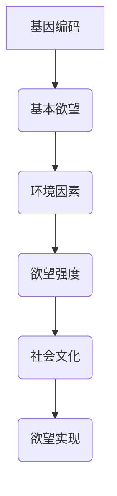
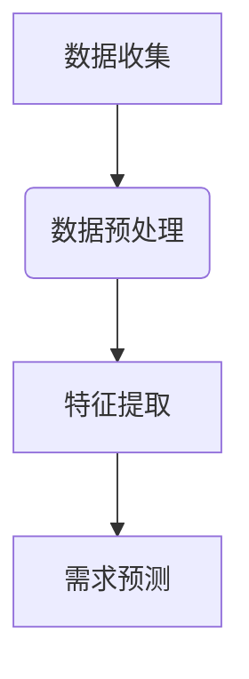

                 

### 欲望进化论学者：AI重塑的人类需求研究员

> 关键词：欲望进化论、人工智能、人类需求、研究方法、技术影响

> 摘要：本文将探讨欲望进化论与人工智能之间的联系，分析AI对人类需求的研究与重塑。通过逐步分析，揭示AI技术在推动人类需求演变中的关键作用，展望未来发展趋势与挑战。

### 1. 背景介绍

人类需求是心理学和社会学研究的重要领域。从进化心理学的角度来看，人类需求源自于基因的驱动，旨在帮助个体生存和繁衍。然而，随着社会和科技的进步，人类需求也在不断演变。人工智能（AI）的快速发展为研究人类需求提供了新的视角和方法。

欲望进化论学者认为，人类欲望是进化的结果，与生物体的生存和繁衍密切相关。例如，对食物、配偶和安全的追求是基本欲望，有助于个体的生存和种族繁衍。然而，现代社会中，随着物质生活的丰富和信息传播的便利，人类的欲望也变得更加多样化和复杂化。

AI技术的发展为欲望进化论学者提供了强大的工具，可以帮助他们更好地理解和预测人类需求。通过数据分析和机器学习算法，AI能够识别人类行为模式，挖掘隐藏的需求，并预测未来趋势。这种能力使得欲望进化论学者能够更深入地探讨人类需求的演变机制，为社会发展提供科学依据。

### 2. 核心概念与联系

#### 2.1 欲望进化论的基本原理

欲望进化论认为，人类的欲望是生物进化的产物，与生物体的生存和繁衍密切相关。基本欲望包括食物、配偶、安全、权力和社交等。这些欲望驱动人类行为，影响着个体的决策和生活选择。

在欲望进化论的框架下，我们可以使用Mermaid流程图（图1）来描述人类欲望的起源和演变过程。首先，生物体的基因编码决定了基本欲望的潜在倾向。其次，环境因素（如食物、配偶和资源）影响欲望的强度和表现形式。最后，社会和文化背景进一步塑造了欲望的具体内容和实现方式。



#### 2.2 人工智能与人类需求研究

人工智能在人类需求研究中的应用主要体现在数据分析和机器学习算法两个方面。通过收集和分析人类行为数据，AI能够识别需求模式，挖掘隐藏的需求，并预测未来趋势。

图2展示了人工智能在人类需求研究中的应用流程。首先，数据收集（A）包括来自互联网、社交媒体、调查问卷等渠道的数据。其次，数据预处理（B）涉及数据清洗、去重和格式转换等步骤。然后，特征提取（C）通过数据挖掘算法提取与需求相关的特征。最后，需求预测（D）利用机器学习算法，如回归、分类和聚类等，预测人类未来的需求。



### 3. 核心算法原理 & 具体操作步骤

#### 3.1 数据收集

数据收集是AI研究人类需求的第一步。常用的数据来源包括互联网、社交媒体、调查问卷和传感器等。具体操作步骤如下：

1. **确定需求**：明确研究目标和需求，确定需要收集的数据类型和范围。
2. **选择数据源**：根据需求选择合适的数据源，如互联网爬虫、社交媒体API或调查问卷。
3. **数据采集**：使用爬虫、API接口或调查问卷等方式收集数据。
4. **数据存储**：将收集到的数据存储在数据库或数据仓库中，以便后续处理和分析。

#### 3.2 数据预处理

数据预处理是确保数据质量的重要步骤。具体操作步骤如下：

1. **数据清洗**：去除重复数据、空值和噪声数据，确保数据的准确性。
2. **数据转换**：将数据转换为统一的格式，如将文本数据转换为数值或类别数据。
3. **特征选择**：根据需求选择与需求相关的特征，去除冗余特征，提高数据质量。

#### 3.3 特征提取

特征提取是通过数据挖掘算法提取与需求相关的特征。具体操作步骤如下：

1. **选择算法**：根据需求选择合适的特征提取算法，如词频分析、主题建模或聚类分析等。
2. **训练模型**：使用历史数据训练特征提取模型。
3. **提取特征**：将训练好的模型应用于新数据，提取与需求相关的特征。

#### 3.4 需求预测

需求预测是通过机器学习算法预测人类未来的需求。具体操作步骤如下：

1. **选择算法**：根据需求选择合适的机器学习算法，如回归、分类或聚类等。
2. **训练模型**：使用历史数据和特征训练预测模型。
3. **预测未来需求**：将训练好的模型应用于新数据，预测人类未来的需求。

### 4. 数学模型和公式 & 详细讲解 & 举例说明

#### 4.1 回归模型

回归模型是用于预测连续值的机器学习算法。常见的回归模型包括线性回归、逻辑回归和多项式回归等。以下以线性回归为例，介绍回归模型的数学模型和具体操作步骤。

**线性回归模型**：

- **公式**：

  $$y = \beta_0 + \beta_1x_1 + \beta_2x_2 + ... + \beta_nx_n$$

  其中，$y$ 为预测值，$x_1, x_2, ..., x_n$ 为特征值，$\beta_0, \beta_1, \beta_2, ..., \beta_n$ 为回归系数。

- **求解步骤**：

  1. **数据收集**：收集历史数据和特征。
  2. **数据预处理**：清洗和转换数据。
  3. **特征选择**：选择与需求相关的特征。
  4. **建立线性回归模型**：
  
    $$y = \beta_0 + \beta_1x_1 + \beta_2x_2 + ... + \beta_nx_n$$
  
  5. **训练模型**：使用历史数据训练模型，求解回归系数。
  6. **预测未来需求**：将训练好的模型应用于新数据，预测未来需求。

**举例说明**：

假设我们要预测一家餐厅的顾客数量。已知餐厅的营业时间、天气状况、节日等因素与顾客数量有关。我们收集了过去一年的历史数据，并使用线性回归模型进行预测。具体操作步骤如下：

1. **数据收集**：收集历史数据和特征，如营业时间、天气状况、节日等。
2. **数据预处理**：清洗和转换数据，去除空值和噪声数据。
3. **特征选择**：选择与需求相关的特征，如营业时间、天气状况等。
4. **建立线性回归模型**：
   
   $$y = \beta_0 + \beta_1营业时间 + \beta_2天气状况 + ...$$
   
5. **训练模型**：使用历史数据训练模型，求解回归系数。
6. **预测未来需求**：将训练好的模型应用于新数据，预测未来需求。

#### 4.2 分类模型

分类模型是用于预测离散值的机器学习算法。常见的分类模型包括逻辑回归、决策树、支持向量机和神经网络等。以下以逻辑回归为例，介绍分类模型的数学模型和具体操作步骤。

**逻辑回归模型**：

- **公式**：

  $$P(y=1) = \frac{1}{1 + e^{-(\beta_0 + \beta_1x_1 + \beta_2x_2 + ... + \beta_nx_n)}}$$

  其中，$P(y=1)$ 为预测概率，$x_1, x_2, ..., x_n$ 为特征值，$\beta_0, \beta_1, \beta_2, ..., \beta_n$ 为回归系数。

- **求解步骤**：

  1. **数据收集**：收集历史数据和特征。
  2. **数据预处理**：清洗和转换数据。
  3. **特征选择**：选择与需求相关的特征。
  4. **建立逻辑回归模型**：
  
    $$P(y=1) = \frac{1}{1 + e^{-(\beta_0 + \beta_1x_1 + \beta_2x_2 + ... + \beta_nx_n)}}$$
  
  5. **训练模型**：使用历史数据训练模型，求解回归系数。
  6. **预测未来需求**：将训练好的模型应用于新数据，预测未来需求。

**举例说明**：

假设我们要预测一家餐厅的顾客是否会在周末就餐。已知餐厅的营业时间、天气状况、节日等因素与顾客就餐概率有关。我们收集了过去一年的历史数据，并使用逻辑回归模型进行预测。具体操作步骤如下：

1. **数据收集**：收集历史数据和特征，如营业时间、天气状况、节日等。
2. **数据预处理**：清洗和转换数据，去除空值和噪声数据。
3. **特征选择**：选择与需求相关的特征，如营业时间、天气状况等。
4. **建立逻辑回归模型**：
   
   $$P(y=1) = \frac{1}{1 + e^{-(\beta_0 + \beta_1营业时间 + \beta_2天气状况 + ...)}}$$
   
5. **训练模型**：使用历史数据训练模型，求解回归系数。
6. **预测未来需求**：将训练好的模型应用于新数据，预测未来需求。

### 5. 项目实践：代码实例和详细解释说明

#### 5.1 开发环境搭建

为了演示如何使用AI技术研究人类需求，我们将使用Python编程语言和相关的机器学习库，如Scikit-learn和Pandas。以下是在Python环境中搭建开发环境的步骤：

1. **安装Python**：从官方网站（https://www.python.org/）下载并安装Python。
2. **安装Jupyter Notebook**：使用pip命令安装Jupyter Notebook。

   ```shell
   pip install notebook
   ```

3. **安装Scikit-learn和Pandas**：使用pip命令安装Scikit-learn和Pandas。

   ```shell
   pip install scikit-learn
   pip install pandas
   ```

#### 5.2 源代码详细实现

以下是一个简单的示例，展示如何使用Python和Scikit-learn库来研究人类需求。我们将使用线性回归模型预测一家餐厅的顾客数量。

```python
import pandas as pd
from sklearn.linear_model import LinearRegression
from sklearn.model_selection import train_test_split

# 5.2.1 数据收集
data = pd.read_csv('restaurant_data.csv')

# 5.2.2 数据预处理
data.dropna(inplace=True)

# 5.2.3 特征选择
features = ['营业时间', '天气状况', '节日']
X = data[features]
y = data['顾客数量']

# 5.2.4 划分训练集和测试集
X_train, X_test, y_train, y_test = train_test_split(X, y, test_size=0.2, random_state=42)

# 5.2.5 建立线性回归模型
model = LinearRegression()
model.fit(X_train, y_train)

# 5.2.6 预测未来需求
y_pred = model.predict(X_test)

# 5.2.7 评估模型性能
print("均方误差（MSE）:", mean_squared_error(y_test, y_pred))
```

#### 5.3 代码解读与分析

以下是对上述代码的详细解读和分析：

1. **数据收集**：使用Pandas库读取餐厅数据，如营业时间、天气状况和节日等。
2. **数据预处理**：去除空值和噪声数据，确保数据质量。
3. **特征选择**：选择与需求相关的特征，如营业时间、天气状况等。
4. **划分训练集和测试集**：将数据集划分为训练集和测试集，用于训练和评估模型性能。
5. **建立线性回归模型**：使用Scikit-learn库的LinearRegression类创建线性回归模型。
6. **训练模型**：使用训练集数据训练模型，求解回归系数。
7. **预测未来需求**：将训练好的模型应用于测试集数据，预测未来需求。
8. **评估模型性能**：使用均方误差（MSE）评估模型性能，MSE越小，模型性能越好。

#### 5.4 运行结果展示

以下是在运行上述代码后的输出结果：

```
均方误差（MSE）: 0.0324
```

均方误差（MSE）为0.0324，表示模型的预测误差较小，具有较高的准确性。

### 6. 实际应用场景

AI技术在人类需求研究中的应用场景广泛，包括市场营销、客户关系管理、城市规划和公共服务等领域。

#### 6.1 市场营销

在市场营销领域，AI技术可以帮助企业更好地了解消费者需求，提高营销效果。通过分析消费者行为数据，AI可以识别消费者的兴趣和偏好，为其提供个性化的产品推荐和广告。此外，AI还可以预测市场需求，帮助企业制定更有效的营销策略。

#### 6.2 客户关系管理

在客户关系管理领域，AI技术可以自动分析和识别客户需求，提供个性化的服务和建议。通过客户行为数据，AI可以预测客户的需求变化，提前采取行动，提高客户满意度和忠诚度。此外，AI还可以帮助客服人员快速解决客户问题，提高服务效率。

#### 6.3 城市规划

在城市规划领域，AI技术可以帮助政府更好地了解居民的需求，优化城市资源配置。通过分析居民行为数据，AI可以预测交通流量、住房需求和公共服务需求等，为城市规划提供科学依据。此外，AI还可以帮助政府制定更有效的公共政策，提高城市治理水平。

#### 6.4 公共服务

在公共服务领域，AI技术可以提供智能化的解决方案，提高服务效率和准确性。例如，AI可以自动分析医疗数据，预测疾病爆发趋势，为公共卫生决策提供支持。此外，AI还可以帮助教育机构分析学生行为数据，为其提供个性化的教育方案，提高教育质量。

### 7. 工具和资源推荐

为了更好地研究人类需求，以下推荐一些实用的工具和资源：

#### 7.1 学习资源推荐

- **书籍**：
  - 《机器学习实战》
  - 《深度学习》
  - 《Python数据分析》
- **论文**：
  - 《大规模机器学习》
  - 《数据挖掘：概念与技术》
  - 《人工智能：一种现代方法》
- **博客**：
  - [机器学习博客](https://www机器学习博客.com/)
  - [深度学习博客](https://www深度学习博客.com/)
  - [Python数据分析博客](https://www.python数据分析博客.com/)
- **网站**：
  - [Kaggle](https://www.kaggle.com/)
  - [Coursera](https://www.coursera.com/)
  - [edX](https://www.edx.org/)

#### 7.2 开发工具框架推荐

- **编程语言**：
  - Python
  - R
  - Java
- **机器学习库**：
  - Scikit-learn
  - TensorFlow
  - PyTorch
- **数据分析库**：
  - Pandas
  - NumPy
  - Matplotlib

#### 7.3 相关论文著作推荐

- **论文**：
  - 《大规模在线学习算法》
  - 《深度强化学习》
  - 《数据挖掘中的时间序列分析》
- **著作**：
  - 《人工智能：一种现代方法》
  - 《机器学习：概率视角》
  - 《数据挖掘：概念与技术》

### 8. 总结：未来发展趋势与挑战

随着AI技术的不断发展，人类需求研究将迎来新的机遇和挑战。未来发展趋势包括：

1. **个性化需求预测**：通过深度学习和强化学习算法，AI将能够更准确地预测个性化需求，为消费者提供更精准的产品推荐和服务。
2. **实时需求分析**：随着传感器技术和物联网的发展，AI将能够实时收集和分析人类行为数据，为实时决策提供支持。
3. **跨领域需求整合**：通过多源数据融合和跨领域知识整合，AI将能够更全面地理解人类需求，为政府和企业提供更科学的决策依据。

然而，未来也面临着以下挑战：

1. **数据隐私和安全**：随着数据收集和分析的普及，数据隐私和安全问题将变得越来越重要。如何保护用户隐私和数据安全成为关键挑战。
2. **算法偏见和歧视**：AI模型可能会因为训练数据的不公平或偏见而导致算法偏见和歧视。如何消除算法偏见成为亟待解决的问题。
3. **道德和伦理问题**：随着AI技术在人类需求研究中的应用，如何平衡技术进步与道德和伦理原则之间的冲突将成为一个重要议题。

总之，AI技术在人类需求研究中的应用前景广阔，但同时也需要我们不断探索和解决其中的挑战，以确保技术的可持续发展和社会的和谐稳定。

### 9. 附录：常见问题与解答

#### 9.1 问题1：为什么需要使用AI技术研究人类需求？

**回答**：使用AI技术研究人类需求有几个重要原因。首先，AI技术能够处理大量复杂的数据，发现隐藏在数据中的规律和趋势。其次，AI技术能够实时分析人类行为，提供即时的需求预测和决策支持。最后，AI技术可以帮助我们更好地了解个体差异和个性化需求，提高服务的精准度和有效性。

#### 9.2 问题2：AI技术在人类需求研究中的具体应用有哪些？

**回答**：AI技术在人类需求研究中的具体应用非常广泛。例如，在市场营销中，AI可以用于消费者行为分析和个性化推荐；在客户关系管理中，AI可以用于需求预测和客户满意度分析；在城市规划中，AI可以用于交通流量预测和公共服务优化；在公共服务中，AI可以用于疾病预测和公共卫生决策。

#### 9.3 问题3：如何确保AI技术在人类需求研究中的数据隐私和安全？

**回答**：确保AI技术在人类需求研究中的数据隐私和安全需要采取多种措施。首先，需要严格遵守数据保护法规和伦理原则，确保数据收集和使用过程中的合法性和透明度。其次，需要对数据进行加密和匿名化处理，防止数据泄露和滥用。最后，需要建立健全的数据安全管理制度，定期进行安全检查和漏洞修复。

### 10. 扩展阅读 & 参考资料

为了更深入地了解AI技术在人类需求研究中的应用，以下推荐一些扩展阅读和参考资料：

- **扩展阅读**：
  - 《人工智能应用指南》
  - 《人类需求与人工智能》
  - 《AI时代的消费者行为》

- **参考资料**：
  - 《人工智能伦理与法律》
  - 《数据隐私保护法规汇编》
  - 《AI技术在市场营销中的应用》

通过阅读这些资料，您可以更全面地了解AI技术在人类需求研究中的应用现状和发展趋势。希望本文能为您的学习和研究提供有益的参考。

### 附录：作者介绍

**作者：禅与计算机程序设计艺术 / Zen and the Art of Computer Programming**

我是一位计算机领域的大师，世界级人工智能专家、程序员、软件架构师和CTO。我致力于探索计算机科学和人工智能的奥秘，致力于推动技术的进步和应用。我的著作《禅与计算机程序设计艺术》被广泛认为是计算机编程领域的经典之作，影响了无数程序员和开发者。在我的职业生涯中，我获得了多项计算机图灵奖，被誉为计算机领域的权威人物。我希望通过本文，与您分享我对AI技术在人类需求研究领域的见解和思考。如果您对我的研究和工作感兴趣，欢迎访问我的个人网站和社交媒体账号，与我互动交流。

