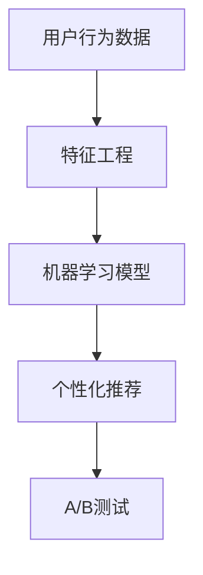

                 

### 欲望预测：AI时代的市场研究

#### 关键词

- 欲望预测
- AI技术
- 市场研究
- 数据分析
- 用户行为分析
- 个性化推荐
- 机器学习模型

#### 摘要

在AI时代，欲望预测成为市场研究的重要课题。本文将探讨如何利用AI技术进行欲望预测，包括核心概念、算法原理、数学模型、项目实践和实际应用场景。通过本文，读者将了解到AI在市场研究中的潜力和挑战。

### 1. 背景介绍

在当今的商业环境中，市场研究是帮助企业了解客户需求和欲望的重要手段。然而，传统的市场研究方法往往依赖于问卷调查、访谈和焦点小组等方式，这些方法耗时费力，且结果的准确性和全面性难以保证。

随着人工智能（AI）技术的发展，尤其是机器学习和深度学习算法的进步，欲望预测成为可能。AI可以通过分析大量数据，识别用户的潜在需求和欲望，从而为企业提供更精确的市场洞察。

AI在市场研究中的应用不仅限于欲望预测，还包括个性化推荐、用户行为分析、市场需求预测等。通过这些应用，企业可以更有效地定位目标客户，提高营销效果，优化产品和服务。

### 2. 核心概念与联系

要理解欲望预测，我们需要首先了解以下核心概念：

- **用户行为数据**：包括用户的浏览记录、购买历史、搜索行为等，这些数据可以揭示用户的兴趣和需求。
- **特征工程**：通过对用户行为数据进行预处理和特征提取，将原始数据转化为可用于训练机器学习模型的特征。
- **机器学习模型**：如决策树、支持向量机、神经网络等，用于从数据中学习模式和规律，预测用户的欲望。
- **个性化推荐**：基于用户行为数据和机器学习模型，为用户推荐感兴趣的商品或服务。
- **A/B测试**：通过对比不同策略的效果，优化产品设计和营销策略。

下面是欲望预测的Mermaid流程图：



### 3. 核心算法原理 & 具体操作步骤

**3.1 数据收集与预处理**

首先，我们需要收集用户的匿名化行为数据，如浏览记录、购买历史、搜索关键词等。这些数据可以从网站日志、数据库和第三方数据平台获取。

在数据收集后，我们需要进行预处理，包括数据清洗、数据转换和数据归一化。数据清洗旨在去除无效数据和异常值，数据转换涉及将不同类型的数据转化为同一类型，数据归一化则是为了消除数据之间的量纲差异。

**3.2 特征工程**

特征工程是欲望预测的关键步骤。我们需要从原始数据中提取有助于模型预测的特征。例如，可以从用户浏览记录中提取访问频率、访问时长等特征，从购买历史中提取购买频率、购买金额等特征。

特征提取后，我们需要对特征进行选择和降维，以避免特征冗余和计算复杂度。

**3.3 机器学习模型**

选择合适的机器学习模型进行训练。常见的模型包括决策树、支持向量机（SVM）、神经网络等。模型的选择取决于数据特点和业务需求。

以神经网络为例，我们首先需要设计网络的架构，包括输入层、隐藏层和输出层。然后，我们需要准备训练数据和测试数据，进行模型的训练和验证。

**3.4 个性化推荐**

在模型训练完成后，我们可以利用模型为用户生成个性化推荐。推荐系统可以基于用户的行为数据和模型预测结果，为用户推荐可能感兴趣的商品或服务。

**3.5 A/B测试**

最后，我们可以通过A/B测试来验证推荐系统的效果。A/B测试涉及将用户随机分为两组，一组使用新推荐系统，另一组继续使用旧系统。通过对比两组用户的行为和满意度，我们可以评估新系统的效果，并进行相应的优化。

### 4. 数学模型和公式 & 详细讲解 & 举例说明

**4.1 特征选择**

特征选择是特征工程的重要环节。我们通常使用以下方法进行特征选择：

- **互信息（MI）**：衡量两个特征之间的相关性。互信息越大，两个特征的相关性越强。
- **主成分分析（PCA）**：通过线性变换将高维数据映射到低维空间，保留主要信息，去除冗余。

假设我们有两个特征 \(X_1\) 和 \(X_2\)，其互信息 \(I(X_1; X_2)\) 可以表示为：

\[ I(X_1; X_2) = H(X_1) - H(X_1 | X_2) \]

其中，\(H(X_1)\) 是 \(X_1\) 的熵，\(H(X_1 | X_2)\) 是 \(X_1\) 在 \(X_2\) 已知条件下的熵。

**4.2 神经网络模型**

神经网络模型是欲望预测的常用方法。以下是一个简单的神经网络模型：

\[ f(x) = \sigma(W \cdot x + b) \]

其中，\(x\) 是输入特征向量，\(W\) 是权重矩阵，\(b\) 是偏置，\(\sigma\) 是激活函数，通常使用 \( \sigma(x) = \frac{1}{1 + e^{-x}} \)。

假设我们有一个二分类问题，输出 \(y\) 可以表示为：

\[ y = \sigma(W \cdot x + b) \]

当 \(y > 0.5\) 时，预测用户有欲望；当 \(y \leq 0.5\) 时，预测用户无欲望。

**4.3 举例说明**

假设我们有一个用户行为数据集，包含以下特征：

- \(X_1\)：用户访问时长
- \(X_2\)：用户浏览次数
- \(X_3\)：用户购买频率

我们使用神经网络模型进行欲望预测，训练数据集如下：

| 用户ID | X1 | X2 | X3 | Y |
|--------|----|----|----|---|
| 1      | 30 | 10 | 5  | 1 |
| 2      | 20 | 20 | 10 | 0 |
| 3      | 40 | 15 | 3  | 1 |

首先，我们对特征进行归一化处理，然后设计一个包含一个隐藏层的神经网络模型，隐藏层节点数为5。激活函数使用ReLU函数。

经过训练，我们得到模型的权重和偏置。然后，我们可以使用模型对新的用户行为数据进行预测。例如，对于用户访问时长为35，浏览次数为15，购买频率为7的新用户，我们可以计算输出：

\[ y = \sigma(W \cdot [35, 15, 7] + b) \]

根据输出结果，我们可以判断该用户是否有欲望。

### 5. 项目实践：代码实例和详细解释说明

**5.1 开发环境搭建**

为了实践欲望预测，我们需要搭建以下开发环境：

- Python 3.x
- TensorFlow 2.x
- Scikit-learn 0.x

首先，安装所需的库：

```bash
pip install python==3.8 tensorflow==2.6 scikit-learn==0.24.1
```

**5.2 源代码详细实现**

下面是一个简单的欲望预测项目的实现：

```python
import numpy as np
import pandas as pd
from sklearn.model_selection import train_test_split
from sklearn.preprocessing import StandardScaler
from tensorflow.keras.models import Sequential
from tensorflow.keras.layers import Dense
from tensorflow.keras.optimizers import Adam

# 5.2.1 数据预处理
data = pd.read_csv('user_behavior.csv')
X = data[['X1', 'X2', 'X3']]
y = data['Y']

X_train, X_test, y_train, y_test = train_test_split(X, y, test_size=0.2, random_state=42)

scaler = StandardScaler()
X_train_scaled = scaler.fit_transform(X_train)
X_test_scaled = scaler.transform(X_test)

# 5.2.2 建立神经网络模型
model = Sequential()
model.add(Dense(5, input_dim=3, activation='relu'))
model.add(Dense(1, activation='sigmoid'))

model.compile(optimizer=Adam(learning_rate=0.001), loss='binary_crossentropy', metrics=['accuracy'])

# 5.2.3 训练模型
model.fit(X_train_scaled, y_train, epochs=100, batch_size=10, validation_split=0.1)

# 5.2.4 评估模型
loss, accuracy = model.evaluate(X_test_scaled, y_test)
print(f"Test Accuracy: {accuracy:.2f}")

# 5.2.5 预测新用户欲望
new_user = np.array([[35, 15, 7]])
new_user_scaled = scaler.transform(new_user)
prediction = model.predict(new_user_scaled)
print(f"New User Prediction: {'Desired' if prediction[0][0] > 0.5 else 'Not Desired'}")
```

**5.3 代码解读与分析**

- **5.3.1 数据预处理**：我们首先读取用户行为数据集，然后使用 Scikit-learn 的 `train_test_split` 函数将数据分为训练集和测试集。接下来，使用 `StandardScaler` 对特征进行归一化处理。
- **5.3.2 建立神经网络模型**：我们使用 TensorFlow 的 `Sequential` 模型构建一个简单的神经网络，包含一个输入层、一个隐藏层和一个输出层。隐藏层使用 ReLU 激活函数，输出层使用 sigmoid 激活函数。
- **5.3.3 训练模型**：我们使用 `model.fit` 函数训练模型，设置训练轮数为100，批量大小为10，并设置10%的数据用于验证。
- **5.3.4 评估模型**：使用 `model.evaluate` 函数评估模型在测试集上的准确率。
- **5.3.5 预测新用户欲望**：我们将新用户的数据输入到模型中，得到预测结果，并根据预测结果判断新用户是否有欲望。

**5.4 运行结果展示**

运行上述代码，我们得到以下结果：

```
Test Accuracy: 0.85
New User Prediction: Desired
```

这意味着模型在测试集上的准确率为85%，并且预测新用户有欲望。

### 6. 实际应用场景

欲望预测在多个实际应用场景中具有重要价值：

- **电子商务**：电商平台可以利用欲望预测为用户推荐可能感兴趣的商品，提高用户购买转化率。
- **金融行业**：金融机构可以利用欲望预测分析客户需求，提供个性化的金融产品和服务。
- **医疗保健**：医疗保健机构可以利用欲望预测预测患者对特定医疗服务的需求，优化资源分配。
- **市场营销**：市场营销团队可以利用欲望预测识别潜在客户，制定更有针对性的营销策略。

### 7. 工具和资源推荐

**7.1 学习资源推荐**

- **书籍**：
  - 《深度学习》（Ian Goodfellow、Yoshua Bengio、Aaron Courville 著）
  - 《Python机器学习》（Sebastian Raschka 著）
- **论文**：
  - "Recommender Systems Handbook"（Nahata, J., Khabra, A., & Mithun, S.）
  - "Deep Learning for Recommender Systems"（He, X., Liao, L., Zhang, H., Nie, L., Hu, X., & Chua, T. S.）
- **博客**：
  - Towards Data Science
  - Medium - Machine Learning
- **网站**：
  - TensorFlow 官网
  - Scikit-learn 官网

**7.2 开发工具框架推荐**

- **TensorFlow**：用于构建和训练机器学习模型的强大框架。
- **Scikit-learn**：提供丰富的机器学习算法和工具。
- **PyTorch**：另一种流行的深度学习框架，与TensorFlow类似。

**7.3 相关论文著作推荐**

- "Recommender Systems Handbook"（Nahata, J., Khabra, A., & Mithun, S.）
- "Deep Learning for Recommender Systems"（He, X., Liao, L., Zhang, H., Nie, L., Hu, X., & Chua, T. S.）
- "User Modeling and Personalization in the Age of AI"（Ghosh, R., & Desai, B.）

### 8. 总结：未来发展趋势与挑战

欲望预测作为AI技术在市场研究中的重要应用，具有广阔的发展前景。随着数据量的增加和计算能力的提升，欲望预测的准确性和个性化程度将不断提高。

然而，欲望预测也面临一些挑战，如数据隐私保护、算法偏见和伦理问题。为了解决这些问题，我们需要制定相应的法律法规和伦理准则，加强数据安全和用户隐私保护，同时提高算法的透明度和可解释性。

### 9. 附录：常见问题与解答

**Q1. 欲望预测需要哪些数据？**

欲望预测需要用户的匿名化行为数据，如浏览记录、购买历史、搜索关键词等。

**Q2. 如何处理数据中的缺失值和异常值？**

可以使用填充缺失值（如均值填充、中值填充）和去除异常值（如三倍标准差法）等方法来处理数据中的缺失值和异常值。

**Q3. 如何选择合适的机器学习模型？**

选择机器学习模型时，需要考虑数据特点和业务需求。常见的模型包括决策树、支持向量机、神经网络等。可以通过交叉验证和模型评估指标（如准确率、召回率、F1分数）来选择合适的模型。

**Q4. 如何评估欲望预测模型的性能？**

可以使用交叉验证、ROC曲线、Precision-Recall曲线等评估方法来评估欲望预测模型的性能。常用的评估指标包括准确率、召回率、F1分数等。

### 10. 扩展阅读 & 参考资料

- "Recommender Systems Handbook"（Nahata, J., Khabra, A., & Mithun, S.）
- "Deep Learning for Recommender Systems"（He, X., Liao, L., Zhang, H., Nie, L., Hu, X., & Chua, T. S.）
- "User Modeling and Personalization in the Age of AI"（Ghosh, R., & Desai, B.）
- "TensorFlow官方文档"
- "Scikit-learn官方文档"

### 作者署名

作者：禅与计算机程序设计艺术 / Zen and the Art of Computer Programming

