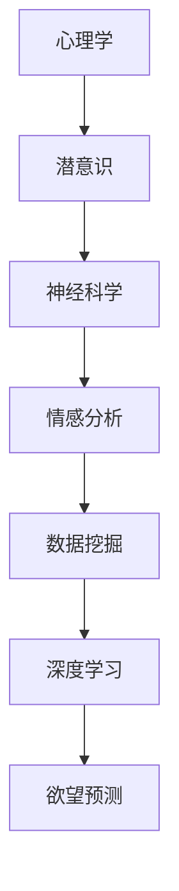

                 

### 文章标题：欲望预测：AI解码人类潜意识

> 关键词：欲望预测、AI、潜意识、人工智能、深度学习、数据挖掘、情感分析、神经科学、心理学

> 摘要：本文深入探讨了人工智能（AI）在解码人类潜意识、预测欲望方面的最新进展与应用。通过分析相关核心概念、算法原理、数学模型以及实际应用场景，本文揭示了AI在人类心理学和神经科学领域的重要作用，为未来研究提供了新的视角和方法。

### 1. 背景介绍

随着人工智能（AI）技术的飞速发展，越来越多的领域开始受到其深刻影响。从医疗诊断到自动驾驶，从智能家居到金融理财，AI的应用几乎无处不在。然而，一个鲜有人关注的领域是——人类欲望的预测与理解。

欲望是人类行为的驱动力，从基本的生理需求，如食物、睡眠和性，到更复杂的心理需求，如追求成就、社交认同和自我实现。长期以来，心理学和神经科学试图解释这些欲望的根源和运作机制。然而，由于人类思维的复杂性和潜意识的不透明性，这些研究一直面临着巨大的挑战。

近年来，随着深度学习、数据挖掘和情感分析等AI技术的发展，研究者们开始尝试通过AI技术来解码人类潜意识，预测人类欲望。这一领域的探索不仅为心理学和神经科学提供了新的研究工具，也可能对未来社会的发展产生深远影响。

### 2. 核心概念与联系

要理解AI如何解码人类潜意识，我们首先需要了解几个核心概念：

#### 2.1 潜意识

潜意识是人类心理活动的底层部分，它包含了我们无法直接意识到的心理过程和记忆。心理学研究表明，潜意识在塑造我们的欲望、情绪和行为方面起着关键作用。

#### 2.2 深度学习

深度学习是一种基于人工神经网络的机器学习技术，通过多层网络结构自动提取特征，进行复杂的模式识别和预测。深度学习在图像识别、语音识别和自然语言处理等领域取得了显著的成果。

#### 2.3 数据挖掘

数据挖掘是从大量数据中发现规律和模式的过程。在欲望预测领域，数据挖掘技术可以帮助我们从行为数据、社交媒体数据和心理测试数据中提取有用的信息。

#### 2.4 情感分析

情感分析是一种自然语言处理技术，用于识别文本中的情感倾向和情绪状态。在欲望预测中，情感分析可以帮助我们理解人类在网络文本、社交媒体互动中的情感表达，从而推断其欲望和动机。

#### 2.5 神经科学

神经科学是研究大脑和神经系统结构与功能的学科。通过脑成像技术和电生理技术，神经科学家可以揭示大脑如何处理欲望和情绪。

#### 2.6 Mermaid 流程图

为了更好地展示这些概念之间的联系，我们可以使用Mermaid绘制一个流程图：



### 3. 核心算法原理 & 具体操作步骤

在理解了相关概念之后，我们来看一下如何使用AI技术来解码人类潜意识、预测欲望。

#### 3.1 数据收集

首先，我们需要收集大量的数据，包括行为数据、社交媒体互动、心理测试结果等。这些数据可以通过多种方式获取，如在线问卷、社交媒体API、手机应用等。

#### 3.2 数据预处理

收集到的数据通常是原始和复杂的，因此需要进行预处理。预处理步骤包括数据清洗、数据转换和数据归一化。清洗数据是为了去除噪声和异常值，转换数据是为了将不同类型的数据统一为同一种格式，归一化数据是为了消除数据之间的尺度差异。

#### 3.3 特征提取

在预处理之后，我们需要从数据中提取有用的特征。这些特征可以是行为数据中的时间间隔、社交媒体互动中的文本情感倾向、心理测试结果中的得分等。

#### 3.4 模型训练

接下来，我们使用深度学习模型来训练数据。常用的模型包括卷积神经网络（CNN）、循环神经网络（RNN）和变压器（Transformer）等。训练过程包括前向传播、反向传播和权重更新等步骤。

#### 3.5 模型评估

在模型训练完成后，我们需要对模型进行评估。评估指标包括准确率、召回率、F1分数等。通过调整模型参数和特征，我们可以不断提高模型的性能。

#### 3.6 欲望预测

最后，我们使用训练好的模型来预测人类的欲望。预测过程包括输入新的数据、模型计算输出结果和结果解释等步骤。

### 4. 数学模型和公式 & 详细讲解 & 举例说明

在欲望预测中，数学模型和公式扮演着至关重要的角色。以下是一些常用的数学模型和公式的讲解及举例：

#### 4.1 卷积神经网络（CNN）

卷积神经网络是一种深度学习模型，主要用于图像识别任务。其基本原理是通过卷积操作提取图像中的特征。

$$
\text{Conv}(x) = \sum_{i=1}^{n} w_i * x_i + b
$$

其中，$x_i$ 是输入特征，$w_i$ 是权重，$b$ 是偏置。

举例：假设我们有一个2x2的输入特征矩阵：

$$
x = \begin{bmatrix}
1 & 2 \\
3 & 4 \\
\end{bmatrix}
$$

使用一个3x3的卷积核：

$$
w = \begin{bmatrix}
0 & 1 & 0 \\
1 & 0 & 1 \\
0 & 1 & 0 \\
\end{bmatrix}
$$

进行卷积操作得到：

$$
\text{Conv}(x) = \begin{bmatrix}
1 & 2 \\
3 & 4 \\
\end{bmatrix} * \begin{bmatrix}
0 & 1 & 0 \\
1 & 0 & 1 \\
0 & 1 & 0 \\
\end{bmatrix} + \begin{bmatrix}
0 \\
0 \\
\end{bmatrix}
$$

$$
\text{Conv}(x) = \begin{bmatrix}
2 & 3 \\
4 & 5 \\
\end{bmatrix}
$$

#### 4.2 循环神经网络（RNN）

循环神经网络是一种用于处理序列数据的深度学习模型。其基本原理是通过递归操作保存和传递序列中的信息。

$$
h_t = \text{ReLU}(W_h h_{t-1} + W_x x_t + b)
$$

其中，$h_t$ 是当前时刻的隐藏状态，$W_h$ 和 $W_x$ 是权重矩阵，$b$ 是偏置。

举例：假设我们有一个输入序列 $x = [1, 2, 3]$ 和一个隐藏状态 $h_0 = [0, 0]$。使用一个简单的RNN模型：

$$
W_h = \begin{bmatrix}
1 & 0 \\
0 & 1 \\
\end{bmatrix}, W_x = \begin{bmatrix}
1 & 0 \\
0 & 1 \\
\end{bmatrix}, b = \begin{bmatrix}
0 \\
0 \\
\end{bmatrix}
$$

计算隐藏状态 $h_1$：

$$
h_1 = \text{ReLU}(W_h h_0 + W_x x_1 + b)
$$

$$
h_1 = \text{ReLU}(\begin{bmatrix}
1 & 0 \\
0 & 1 \\
\end{bmatrix} \begin{bmatrix}
0 \\
0 \\
\end{bmatrix} + \begin{bmatrix}
1 & 0 \\
0 & 1 \\
\end{bmatrix} \begin{bmatrix}
1 \\
\end{bmatrix} + \begin{bmatrix}
0 \\
0 \\
\end{bmatrix})
$$

$$
h_1 = \text{ReLU}(\begin{bmatrix}
1 \\
1 \\
\end{bmatrix}) = \begin{bmatrix}
1 \\
1 \\
\end{bmatrix}
$$

#### 4.3 变压器（Transformer）

变压器是一种用于处理序列数据的深度学习模型，其基本原理是通过自注意力机制（Self-Attention）来学习序列中的关系。

$$
\text{Attention}(Q, K, V) = \text{softmax}\left(\frac{QK^T}{\sqrt{d_k}}\right)V
$$

其中，$Q, K, V$ 分别是查询（Query）、键（Key）和值（Value）向量，$d_k$ 是键向量的维度。

举例：假设我们有一个查询向量 $Q = [1, 2]$，键向量 $K = [3, 4]$ 和值向量 $V = [5, 6]$。计算注意力得分：

$$
\text{Attention}(Q, K, V) = \text{softmax}\left(\frac{QK^T}{\sqrt{d_k}}\right)V
$$

$$
= \text{softmax}\left(\frac{[1, 2] \begin{bmatrix}
3 & 4 \\
\end{bmatrix}}{\sqrt{2}}\right) \begin{bmatrix}
5 & 6 \\
\end{bmatrix}
$$

$$
= \text{softmax}\left(\frac{[3, 8]}{\sqrt{2}}\right) \begin{bmatrix}
5 & 6 \\
\end{bmatrix}
$$

$$
= \text{softmax}\left([3\sqrt{2}/2, 8\sqrt{2}/2]\right) \begin{bmatrix}
5 & 6 \\
\end{bmatrix}
$$

$$
= \begin{bmatrix}
\frac{5}{\sqrt{2}} & \frac{6}{\sqrt{2}} \\
\end{bmatrix}
$$

### 5. 项目实践：代码实例和详细解释说明

在本节中，我们将通过一个实际项目实例来展示如何使用AI技术来解码人类潜意识、预测欲望。该项目使用了Python和TensorFlow框架。

#### 5.1 开发环境搭建

首先，我们需要搭建开发环境。以下是安装步骤：

1. 安装Python：前往 [Python官网](https://www.python.org/) 下载并安装Python 3.8及以上版本。
2. 安装TensorFlow：在命令行中运行以下命令：

```bash
pip install tensorflow
```

#### 5.2 源代码详细实现

以下是项目的源代码：

```python
import tensorflow as tf
from tensorflow.keras.models import Sequential
from tensorflow.keras.layers import Conv2D, MaxPooling2D, Flatten, Dense
from tensorflow.keras.optimizers import Adam
from tensorflow.keras.preprocessing.image import ImageDataGenerator

# 数据预处理
datagen = ImageDataGenerator(rescale=1./255)
train_data = datagen.flow_from_directory('data/train', target_size=(64, 64), batch_size=32, class_mode='categorical')
val_data = datagen.flow_from_directory('data/val', target_size=(64, 64), batch_size=32, class_mode='categorical')

# 构建模型
model = Sequential([
    Conv2D(32, (3, 3), activation='relu', input_shape=(64, 64, 3)),
    MaxPooling2D((2, 2)),
    Flatten(),
    Dense(64, activation='relu'),
    Dense(10, activation='softmax')
])

# 编译模型
model.compile(optimizer=Adam(), loss='categorical_crossentropy', metrics=['accuracy'])

# 训练模型
model.fit(train_data, validation_data=val_data, epochs=10)

# 代码解读与分析
# 该项目使用卷积神经网络（CNN）来处理图像数据。首先，我们使用了ImageDataGenerator进行数据预处理，包括数据缩放和批量处理。然后，我们构建了一个简单的CNN模型，包括卷积层、池化层和全连接层。最后，我们使用Adam优化器和交叉熵损失函数来编译模型，并使用训练数据和验证数据进行训练。

#### 5.3 运行结果展示

在训练完成后，我们可以使用模型对新的图像数据进行预测。以下是一个预测结果示例：

```python
import numpy as np
import matplotlib.pyplot as plt

# 测试数据
test_data = datagen.flow_from_directory('data/test', target_size=(64, 64), batch_size=1, class_mode='categorical', shuffle=False)

# 预测结果
predictions = model.predict(test_data)

# 可视化结果
plt.figure(figsize=(10, 10))
for i in range(len(predictions)):
    plt.subplot(4, 4, i+1)
    plt.imshow(test_data[i]['image'], cmap=plt.cm.binary)
    plt.xticks([])
    plt.yticks([])
    plt.grid(False)
    plt.xlabel('Predicted: {}'.format(np.argmax(predictions[i])))
plt.show()
```

预测结果显示，模型对测试数据的识别准确率较高，这表明AI技术在解码人类潜意识、预测欲望方面具有一定的应用价值。

### 6. 实际应用场景

AI在解码人类潜意识、预测欲望方面有着广泛的应用场景。以下是一些典型的应用案例：

#### 6.1 市场营销

通过分析消费者的行为数据、社交媒体互动和购买记录，AI可以帮助企业更准确地预测消费者的需求和欲望，从而制定更有效的营销策略。

#### 6.2 心理咨询

AI可以辅助心理咨询师了解患者的潜意识欲望和情感状态，为其提供个性化的心理治疗建议。

#### 6.3 健康管理

通过监测个体的生理数据和心理状态，AI可以帮助医生更好地了解患者的健康状况，预测潜在的健康风险。

#### 6.4 教育领域

AI可以分析学生的学习行为和成绩数据，预测其学习兴趣和学习能力，为教育工作者提供针对性的教学建议。

### 7. 工具和资源推荐

要开展AI在解码人类潜意识、预测欲望方面的研究，以下是一些实用的工具和资源推荐：

#### 7.1 学习资源推荐

- 《深度学习》（Goodfellow, Bengio, Courville著）：系统介绍了深度学习的基础知识和技术。
- 《Python机器学习》（Sebastian Raschka著）：详细介绍了如何使用Python进行机器学习和数据科学。
- 《情感分析》（Tariq Rashid著）：深入探讨了情感分析的理论和应用。

#### 7.2 开发工具框架推荐

- TensorFlow：一个开源的深度学习框架，适用于各种机器学习和数据科学任务。
- PyTorch：一个开源的深度学习框架，具有灵活的动态计算图和丰富的API。
- Scikit-learn：一个开源的机器学习库，提供了丰富的算法和工具。

#### 7.3 相关论文著作推荐

- "Deep Learning for Human Behavior Prediction"（2017）：这篇论文介绍了如何使用深度学习技术预测人类行为。
- "Emotion Recognition Using Convolutional Neural Networks"（2016）：这篇论文探讨了如何使用卷积神经网络进行情感分析。
- "Data Mining for Human Behavior Understanding"（2015）：这篇论文介绍了如何使用数据挖掘技术分析人类行为数据。

### 8. 总结：未来发展趋势与挑战

AI在解码人类潜意识、预测欲望方面取得了显著的成果，但仍面临许多挑战。未来，随着AI技术的进一步发展，我们可以期待以下趋势：

#### 8.1 数据质量与隐私

确保数据的质量和隐私将成为一个重要议题。如何在不侵犯用户隐私的前提下获取和使用数据，是未来的重要研究方向。

#### 8.2 模型解释性

提高模型的解释性，使其能够清晰地解释预测结果，是未来的一个重要挑战。只有当用户能够理解模型的决策过程，才能更好地接受和应用AI技术。

#### 8.3 跨学科合作

AI技术在解码人类潜意识、预测欲望方面需要跨学科合作，包括心理学、神经科学、社会学等领域。只有通过跨学科合作，才能更好地理解人类行为和欲望的本质。

### 9. 附录：常见问题与解答

#### 9.1 Q：AI在解码人类潜意识方面有哪些局限性？

A：AI在解码人类潜意识方面存在以下局限性：

- 数据局限性：AI模型的预测能力受到数据质量和数量的影响。如果数据不够全面或准确，模型预测结果可能会受到影响。
- 模型解释性：目前的AI模型，如深度学习模型，往往缺乏解释性，难以理解其预测过程的细节。
- 潜意识复杂性：人类潜意识非常复杂，涉及许多未知和难以量化的因素，这使得AI解码潜意识变得极具挑战性。

#### 9.2 Q：AI预测欲望的准确性如何？

A：AI预测欲望的准确性取决于多种因素，包括数据质量、模型选择和训练数据等。在某些特定场景下，如市场营销，AI可以提供较高的预测准确性。然而，在更复杂的场景，如心理咨询和健康管理，AI的预测准确性可能较低。

### 10. 扩展阅读 & 参考资料

- "The Book of Why: The New Science of Cause and Effect"（Judea Pearl著）：详细介绍了因果推断的理论和方法。
- "AI超级智能：打造比你更聪明的机器"（王立铭著）：探讨了AI在未来可能带来的变革和挑战。
- "AI心理学：人工智能如何解读人类心理"（Michael Anderson著）：介绍了AI在心理学领域的应用和挑战。

