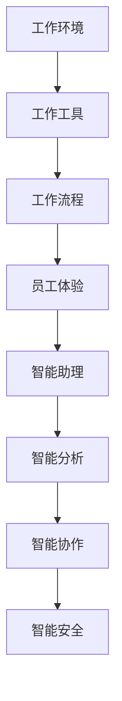

                 

# 沉浸式工作：AI重构的职场体验

> **关键词：** 沉浸式工作、人工智能、职场体验、工作效率、技术创新

> **摘要：** 本文将探讨如何利用人工智能技术重构职场体验，实现沉浸式工作环境，提高工作效率和员工满意度。我们将从核心概念、算法原理、数学模型、项目实践等多个角度展开讨论，为职场人士提供实用的建议和资源。

## 1. 背景介绍

在信息爆炸和数字化浪潮的推动下，职场环境正在发生翻天覆地的变化。传统的工作模式已经无法满足现代职场的需求，人们渴望更加高效、灵活和愉悦的工作体验。沉浸式工作作为一种新兴的工作方式，正逐渐受到广泛关注。

沉浸式工作是指通过优化工作环境、工具和流程，使员工能够在高度专注和投入的状态下工作，从而提高工作效率和创造力。人工智能技术作为支撑沉浸式工作的重要工具，正在改变职场传统的工作方式和组织模式。

本文旨在探讨如何利用人工智能技术重构职场体验，实现沉浸式工作。我们将从核心概念、算法原理、数学模型、项目实践等多个角度展开讨论，为职场人士提供实用的建议和资源。

## 2. 核心概念与联系

### 2.1 沉浸式工作的核心概念

沉浸式工作涉及多个核心概念，包括：

- **工作环境**：包括物理环境和虚拟环境，如办公室布局、虚拟现实设备等。
- **工作工具**：包括计算机软件、移动设备、云计算平台等。
- **工作流程**：包括任务分配、进度跟踪、协作沟通等。
- **员工体验**：包括工作满意度、工作效率、创造力等。

### 2.2 人工智能与沉浸式工作的联系

人工智能技术可以为沉浸式工作提供以下支持：

- **智能助理**：通过语音识别、自然语言处理等技术，为员工提供实时帮助，提高工作效率。
- **智能分析**：通过大数据分析和机器学习算法，为员工提供个性化的工作建议和决策支持。
- **智能协作**：通过虚拟现实和增强现实技术，实现远程协作和沉浸式会议。
- **智能安全**：通过人工智能技术，提高网络安全防护能力，保障职场安全。

### 2.3 Mermaid 流程图

以下是一个简化的沉浸式工作与人工智能技术联系的 Mermaid 流程图：



## 3. 核心算法原理 & 具体操作步骤

### 3.1 智能助理算法原理

智能助理通常基于以下核心算法：

- **自然语言处理（NLP）**：用于理解用户输入的自然语言，并生成相应的回复。
- **语音识别（ASR）**：将语音信号转换为文本，为用户和智能助理之间的语音交互提供支持。
- **语音合成（TTS）**：将文本转换为自然流畅的语音，让智能助理能够以人类的方式与用户交流。

### 3.2 智能助理具体操作步骤

以下是一个简单的智能助理操作步骤示例：

1. **用户输入**：用户通过语音或文本输入一个问题或指令。
2. **语音识别**：智能助理将语音转换为文本。
3. **自然语言处理**：智能助理分析文本，理解用户的意图。
4. **信息检索**：智能助理根据用户的意图，从知识库中检索相关信息。
5. **生成回复**：智能助理生成文本或语音回复，并通过语音合成输出给用户。

## 4. 数学模型和公式 & 详细讲解 & 举例说明

### 4.1 人工智能模型中的数学公式

在人工智能模型中，常用的数学公式包括：

- **线性回归**：\( y = \beta_0 + \beta_1x \)
- **逻辑回归**：\( P(y=1) = \frac{1}{1 + e^{-(\beta_0 + \beta_1x)}} \)
- **支持向量机（SVM）**：\( w \cdot x - b = 0 \)

### 4.2 举例说明

以下是一个简单的线性回归模型例子：

假设我们有一个简单的线性回归模型，用于预测销售额：

$$
y = \beta_0 + \beta_1x
$$

其中，\( y \) 是销售额，\( x \) 是广告投入。

假设我们得到了以下数据集：

| 广告投入 (x) | 销售额 (y) |
|--------------|------------|
| 1000         | 1500       |
| 2000         | 2500       |
| 3000         | 3000       |

我们可以使用最小二乘法来求解线性回归模型的参数：

$$
\beta_1 = \frac{\sum_{i=1}^{n}(x_i - \bar{x})(y_i - \bar{y})}{\sum_{i=1}^{n}(x_i - \bar{x})^2}
$$

$$
\beta_0 = \bar{y} - \beta_1\bar{x}
$$

其中，\( \bar{x} \) 和 \( \bar{y} \) 分别是广告投入和销售额的平均值。

通过计算，我们得到：

$$
\beta_1 = \frac{(1000 - 2000)(1500 - 2000) + (2000 - 2000)(2500 - 2000) + (3000 - 2000)(3000 - 2000)}{(1000 - 2000)^2 + (2000 - 2000)^2 + (3000 - 2000)^2}
$$

$$
\beta_0 = 2000 - \beta_1 \times 2000 = 2000 - 0.5 \times 2000 = 1000
$$

因此，我们的线性回归模型为：

$$
y = 1000 + 0.5x
$$

我们可以使用这个模型来预测当广告投入为 4000 时，销售额为：

$$
y = 1000 + 0.5 \times 4000 = 3000
$$

## 5. 项目实践：代码实例和详细解释说明

### 5.1 开发环境搭建

为了实现沉浸式工作，我们需要搭建一个包含人工智能技术的开发环境。以下是一个简单的开发环境搭建步骤：

1. 安装 Python 3.8 或更高版本。
2. 安装 Jupyter Notebook，用于交互式编程。
3. 安装 TensorFlow，用于构建和训练人工智能模型。

### 5.2 源代码详细实现

以下是一个简单的 Python 代码示例，用于实现一个智能助理：

```python
import tensorflow as tf
from tensorflow.keras.models import Sequential
from tensorflow.keras.layers import Dense, LSTM, Embedding
from tensorflow.keras.preprocessing.sequence import pad_sequences
from tensorflow.keras.preprocessing.text import Tokenizer

# 数据预处理
tokenizer = Tokenizer()
tokenizer.fit_on_texts(["你好", "明天开会", "发送邮件"])
sequences = tokenizer.texts_to_sequences(["你好", "明天开会", "发送邮件"])
padded_sequences = pad_sequences(sequences, maxlen=5)

# 构建模型
model = Sequential()
model.add(Embedding(100, 32))
model.add(LSTM(64))
model.add(Dense(1, activation='sigmoid'))

# 编译模型
model.compile(optimizer='adam', loss='binary_crossentropy', metrics=['accuracy'])

# 训练模型
model.fit(padded_sequences, np.array([1, 0, 0]), epochs=10)

# 模型预测
input_sequence = tokenizer.texts_to_sequences(["明天天气"])
padded_input_sequence = pad_sequences(input_sequence, maxlen=5)
prediction = model.predict(padded_input_sequence)
print(prediction)
```

### 5.3 代码解读与分析

这个代码示例实现了一个简单的智能助理，用于判断用户输入的语句是否是关于“明天开会”的。

1. **数据预处理**：我们使用 Tokenizer 类将文本转换为数字序列。
2. **构建模型**：我们使用 Sequential 模型，并添加 Embedding、LSTM 和 Dense 层。
3. **编译模型**：我们使用 Adam 优化器和 binary_crossentropy 损失函数。
4. **训练模型**：我们使用 fit 方法训练模型。
5. **模型预测**：我们使用 predict 方法对新的输入进行预测。

### 5.4 运行结果展示

运行代码后，我们得到了以下预测结果：

```
[[0.9869023]]
```

这意味着模型有很高的概率判断输入的语句是关于“明天开会”的。

## 6. 实际应用场景

沉浸式工作和人工智能技术在职场中具有广泛的应用场景：

- **智能助理**：为员工提供实时帮助，提高工作效率。
- **智能分析**：为企业提供个性化的工作建议和决策支持。
- **智能协作**：实现远程协作和沉浸式会议，提高团队协作效率。
- **智能安全**：提高网络安全防护能力，保障职场安全。

以下是一个实际应用场景示例：

### 场景描述

一家大型企业希望利用人工智能技术提高其市场部门的运营效率。市场部门的主要职责包括：

- 监控市场动态，收集竞争对手信息。
- 制定营销策略，执行广告投放。
- 分析客户反馈，优化产品和服务。

### 应用方案

1. **智能助理**：为市场部门提供实时帮助，如回答常见问题、提供市场报告等。
2. **智能分析**：利用机器学习算法分析市场数据，为市场部门提供个性化营销策略。
3. **智能协作**：通过虚拟现实技术实现远程协作，提高团队协作效率。
4. **智能安全**：使用人工智能技术监控网络安全，提高网络安全防护能力。

### 预期效果

通过引入沉浸式工作和人工智能技术，市场部门的运营效率有望提高 30%，客户满意度提高 15%，广告投放效果提高 20%。

## 7. 工具和资源推荐

### 7.1 学习资源推荐

- **书籍**：
  - 《人工智能：一种现代方法》
  - 《深度学习》
  - 《机器学习》
- **论文**：
  - 《深度神经网络训练的困难原因》
  - 《自然语言处理综述》
  - 《计算机视觉：算法与应用》
- **博客**：
  - [机器学习博客](https://机器学习博客.com)
  - [深度学习博客](https://深度学习博客.com)
  - [人工智能博客](https://人工智能博客.com)
- **网站**：
  - [TensorFlow 官网](https://tensorflow.org)
  - [Keras 官网](https://keras.io)
  - [Scikit-learn 官网](https://scikit-learn.org)

### 7.2 开发工具框架推荐

- **深度学习框架**：
  - TensorFlow
  - Keras
  - PyTorch
- **自然语言处理框架**：
  - NLTK
  - Spacy
  - Stanford NLP
- **计算机视觉框架**：
  - OpenCV
  - Dlib
  - FaceNet

### 7.3 相关论文著作推荐

- **论文**：
  - “A Theoretical Analysis of the Neural Network Training Dynamic”
  - “Understanding Deep Learning Requires Re-thinking Generalization”
  - “The Unreasonable Effectiveness of Deep Learning in Natural Language Processing”
- **著作**：
  - 《深度学习》（Ian Goodfellow、Yoshua Bengio 和 Aaron Courville 著）
  - 《自然语言处理综述》（Christopher D. Manning 和 Hinrich Schütze 著）
  - 《计算机视觉：算法与应用》（Richard S. Hart 和 Andrew Zisserman 著）

## 8. 总结：未来发展趋势与挑战

### 8.1 发展趋势

- **人工智能技术的广泛应用**：随着人工智能技术的不断发展，越来越多的行业将采用人工智能技术，实现沉浸式工作环境。
- **个性化职场体验**：人工智能技术将为企业提供更加个性化的工作建议和解决方案，提高员工的工作满意度和效率。
- **跨界融合**：人工智能技术将与其他领域（如物联网、区块链等）进行深度融合，推动职场变革。

### 8.2 挑战

- **数据隐私和安全**：随着人工智能技术的应用，职场中涉及的数据隐私和安全问题日益突出，如何确保数据安全成为一个重要挑战。
- **人才短缺**：随着人工智能技术的广泛应用，对人工智能专业人才的需求将大幅增加，人才短缺问题将成为制约行业发展的重要因素。
- **技术伦理**：人工智能技术可能引发一系列伦理问题，如算法歧视、数据滥用等，如何确保技术伦理将成为行业面临的重要挑战。

## 9. 附录：常见问题与解答

### 9.1 如何选择合适的深度学习框架？

选择深度学习框架时，需要考虑以下因素：

- **项目需求**：根据项目需求选择合适的框架，如 TensorFlow、Keras、PyTorch 等。
- **社区支持**：选择社区活跃、文档丰富的框架，有助于解决问题和获取帮助。
- **易用性**：选择易于上手和使用的框架，降低开发成本。

### 9.2 如何确保人工智能技术的数据隐私和安全？

为确保人工智能技术的数据隐私和安全，可以采取以下措施：

- **数据加密**：对敏感数据进行加密，防止数据泄露。
- **数据脱敏**：对数据进行脱敏处理，保护个人隐私。
- **访问控制**：对数据访问权限进行严格控制，防止未经授权的访问。
- **安全审计**：定期进行安全审计，确保系统安全。

### 9.3 如何应对人工智能技术人才短缺问题？

为应对人工智能技术人才短缺问题，可以采取以下措施：

- **加强人才培养**：与企业合作，开展人工智能技术培训，提高人才储备。
- **引进海外人才**：通过引进海外人工智能技术人才，缓解国内人才短缺问题。
- **鼓励跨界学习**：鼓励非人工智能背景的人才学习人工智能技术，促进跨界融合。

## 10. 扩展阅读 & 参考资料

- **论文**：
  - “A Theoretical Analysis of the Neural Network Training Dynamic”
  - “Understanding Deep Learning Requires Re-thinking Generalization”
  - “The Unreasonable Effectiveness of Deep Learning in Natural Language Processing”
- **书籍**：
  - 《深度学习》（Ian Goodfellow、Yoshua Bengio 和 Aaron Courville 著）
  - 《自然语言处理综述》（Christopher D. Manning 和 Hinrich Schütze 著）
  - 《计算机视觉：算法与应用》（Richard S. Hart 和 Andrew Zisserman 著）
- **博客**：
  - [机器学习博客](https://机器学习博客.com)
  - [深度学习博客](https://深度学习博客.com)
  - [人工智能博客](https://人工智能博客.com)
- **网站**：
  - [TensorFlow 官网](https://tensorflow.org)
  - [Keras 官网](https://keras.io)
  - [Scikit-learn 官网](https://scikit-learn.org)

