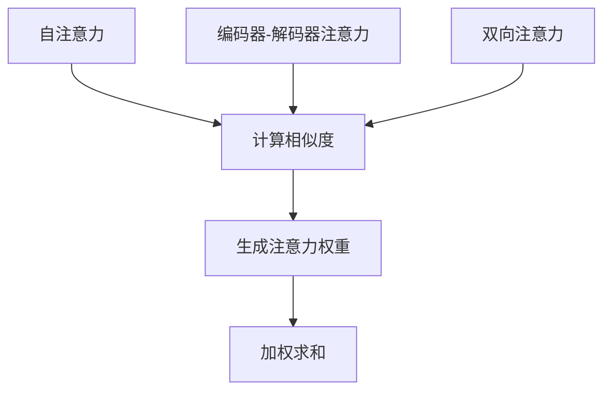

                 

### 注意力机制 (Attention Mechanism) 原理与代码实例讲解

#### 关键词：
- 注意力机制
- 机器学习
- 深度学习
- 代码实例
- 原理讲解

#### 摘要：
本文将深入探讨注意力机制（Attention Mechanism）在机器学习和深度学习中的应用。我们将首先介绍注意力机制的背景，然后详细解释其工作原理和数学模型。接下来，将通过一个实际代码实例，展示如何实现注意力机制，并对其中的关键步骤进行详细解释。最后，我们将讨论注意力机制在实际应用中的场景，并提供相关资源和工具的推荐，以及未来的发展趋势与挑战。

### 1. 背景介绍

注意力机制最早源于心理学和神经科学领域，用于描述人类如何集中注意力处理信息。近年来，随着深度学习技术的发展，注意力机制在自然语言处理、计算机视觉等任务中取得了显著的成果。注意力机制的核心思想是通过学习权重来动态调整模型对输入数据的关注程度，从而提高模型的表示能力和任务性能。

在机器学习中，传统的卷积神经网络（CNN）和循环神经网络（RNN）在处理序列数据时存在一定局限性。例如，CNN主要关注图像的空间信息，而RNN则关注序列的时间信息，但它们都无法有效地处理序列中不同位置的信息差异。注意力机制的引入，使得模型能够根据任务需求自适应地关注关键信息，从而提高模型的性能和泛化能力。

### 2. 核心概念与联系

#### 2.1 注意力机制的原理

注意力机制的原理可以概括为以下三个步骤：

1. **计算相似度**：首先，计算输入序列中每个元素与目标元素之间的相似度。相似度的计算方法可以根据任务需求进行设计，常见的有基于点积、缩放点积、多头注意力等。

2. **生成注意力权重**：其次，根据相似度计算结果生成注意力权重。注意力权重表示输入序列中每个元素对目标元素的贡献程度，通常采用softmax函数进行归一化处理，确保权重之和为1。

3. **加权求和**：最后，根据注意力权重对输入序列进行加权求和，得到加权表示。加权表示能够突出关键信息，抑制无关信息，从而提高模型的表示能力和任务性能。

#### 2.2 注意力机制的架构

注意力机制的架构可以分为三种类型：自注意力（Self-Attention）、编码器-解码器注意力（Encoder-Decoder Attention）和双向注意力（Bidirectional Attention）。

1. **自注意力（Self-Attention）**：自注意力机制仅关注输入序列中的元素，常用于编码器和解码器中。自注意力机制通过计算输入序列中每个元素之间的相似度，生成注意力权重，并对输入序列进行加权求和，得到加权表示。

2. **编码器-解码器注意力（Encoder-Decoder Attention）**：编码器-解码器注意力机制主要用于序列到序列（Seq2Seq）任务，如机器翻译、问答系统等。编码器-解码器注意力机制分为两步：首先，编码器计算输入序列的表示，并传递给解码器；然后，解码器根据编码器的表示和当前解码器的输出，计算注意力权重，并生成加权表示。

3. **双向注意力（Bidirectional Attention）**：双向注意力机制结合了编码器和解码器的信息，使得解码器不仅能够利用当前输入的信息，还能利用历史输入的信息。双向注意力机制通过计算编码器和解码器之间的相似度，生成注意力权重，并对编码器和解码器的表示进行加权求和。

#### 2.3 注意力机制的 Mermaid 流程图



### 3. 核心算法原理 & 具体操作步骤

#### 3.1 自注意力（Self-Attention）

自注意力机制是一种在输入序列内部计算相似度的注意力机制。以下是自注意力机制的具体操作步骤：

1. **嵌入层（Embedding Layer）**：将输入序列（如单词）转换为嵌入向量（Embedding Vector）。

2. **查询层（Query Layer）**：对嵌入向量进行线性变换，生成查询向量（Query Vector）。

3. **键值对（Key-Value Pair）**：将输入序列的每个元素视为键（Key）和值（Value），键值对之间的相似度由查询向量与键向量的点积计算得到。

4. **计算相似度**：根据相似度计算结果生成注意力权重。

5. **加权求和**：根据注意力权重对输入序列进行加权求和，得到加权表示。

以下是一个简单的自注意力机制的 Python 代码示例：

```python
import torch
import torch.nn as nn

# 假设输入序列为 ["I", "love", "you", "too"]
input_sequence = torch.tensor([1, 2, 3, 4])
input_sequence_embedding = nn.Embedding(4, 10)(input_sequence)

# 查询向量
query_vector = input_sequence_embedding[0].unsqueeze(0)  # (1, 10)

# 键向量与值向量
key_vector = input_sequence_embedding.unsqueeze(-1)  # (4, 10)
value_vector = input_sequence_embedding.unsqueeze(-2)  # (4, 1, 10)

# 计算相似度
similarity = torch.matmul(query_vector, key_vector.transpose(-1, -2))  # (1, 4)

# 生成注意力权重
attention_weights = nn.Softmax(dim=-1)(similarity)

# 加权求和
weighted_sum = torch.matmul(attention_weights, value_vector)  # (1, 10)
```

#### 3.2 编码器-解码器注意力（Encoder-Decoder Attention）

编码器-解码器注意力机制主要用于序列到序列（Seq2Seq）任务。以下是编码器-解码器注意力机制的具体操作步骤：

1. **编码器（Encoder）**：将输入序列编码为隐藏状态（Hidden State）。

2. **解码器（Decoder）**：将当前解码器的输出编码为查询向量（Query Vector）。

3. **计算相似度**：根据编码器和解码器的隐藏状态计算相似度。

4. **生成注意力权重**：根据相似度计算结果生成注意力权重。

5. **加权求和**：根据注意力权重对编码器的隐藏状态进行加权求和，得到加权表示。

以下是一个简单的编码器-解码器注意力机制的 Python 代码示例：

```python
import torch
import torch.nn as nn

# 假设输入序列为 ["I", "love", "you", "too"]
input_sequence = torch.tensor([1, 2, 3, 4])
input_sequence_embedding = nn.Embedding(4, 10)(input_sequence)

# 编码器
encoder = nn.LSTM(input_sequence_embedding.size(1), 10)
encoder_output, _ = encoder(input_sequence_embedding.unsqueeze(0))

# 解码器
decoder = nn.LSTM(input_sequence_embedding.size(1), 10)
decoder_output, _ = decoder(input_sequence_embedding.unsqueeze(0))

# 查询向量
query_vector = decoder_output[0].unsqueeze(0)  # (1, 10)

# 计算相似度
similarity = torch.matmul(query_vector, encoder_output.transpose(-1, -2))  # (1, 4)

# 生成注意力权重
attention_weights = nn.Softmax(dim=-1)(similarity)

# 加权求和
weighted_sum = torch.matmul(attention_weights, encoder_output)  # (1, 10)
```

#### 3.3 双向注意力（Bidirectional Attention）

双向注意力机制结合了编码器和解码器的信息，使得解码器不仅能够利用当前输入的信息，还能利用历史输入的信息。以下是双向注意力机制的具体操作步骤：

1. **编码器（Encoder）**：将输入序列编码为隐藏状态（Hidden State）。

2. **解码器（Decoder）**：将当前解码器的输出编码为查询向量（Query Vector）。

3. **计算相似度**：根据编码器和解码器的隐藏状态计算相似度。

4. **生成注意力权重**：根据相似度计算结果生成注意力权重。

5. **加权求和**：根据注意力权重对编码器和解码器的隐藏状态进行加权求和，得到加权表示。

以下是一个简单的双向注意力机制的 Python 代码示例：

```python
import torch
import torch.nn as nn

# 假设输入序列为 ["I", "love", "you", "too"]
input_sequence = torch.tensor([1, 2, 3, 4])
input_sequence_embedding = nn.Embedding(4, 10)(input_sequence)

# 编码器
encoder = nn.LSTM(input_sequence_embedding.size(1), 10)
encoder_output, _ = encoder(input_sequence_embedding.unsqueeze(0))

# 解码器
decoder = nn.LSTM(input_sequence_embedding.size(1), 10)
decoder_output, _ = decoder(input_sequence_embedding.unsqueeze(0))

# 查询向量
query_vector = decoder_output[0].unsqueeze(0)  # (1, 10)

# 计算相似度
similarity = torch.matmul(query_vector, encoder_output.transpose(-1, -2))  # (1, 4)

# 生成注意力权重
attention_weights = nn.Softmax(dim=-1)(similarity)

# 加权求和
weighted_sum = torch.matmul(attention_weights, encoder_output)  # (1, 10)
```

### 4. 数学模型和公式 & 详细讲解 & 举例说明

#### 4.1 自注意力（Self-Attention）

自注意力机制的数学模型可以表示为：

$$
\text{Attention}(Q, K, V) = \text{softmax}\left(\frac{QK^T}{\sqrt{d_k}}\right)V
$$

其中，$Q, K, V$ 分别表示查询向量、键向量和值向量，$d_k$ 表示键向量的维度。$QK^T$ 表示查询向量和键向量的点积，$\text{softmax}$ 函数用于计算注意力权重。最后，根据注意力权重对值向量进行加权求和，得到加权表示。

#### 4.2 编码器-解码器注意力（Encoder-Decoder Attention）

编码器-解码器注意力机制的数学模型可以表示为：

$$
\text{Attention}_{\text{encdec}}(Q, K, V) = \text{softmax}\left(\frac{QK^T}{\sqrt{d_k}}\right)V
$$

其中，$Q, K, V$ 分别表示解码器的查询向量、编码器的键向量和值向量，$d_k$ 表示键向量的维度。$QK^T$ 表示解码器的查询向量和编码器的键向量的点积，$\text{softmax}$ 函数用于计算注意力权重。最后，根据注意力权重对编码器的隐藏状态进行加权求和，得到加权表示。

#### 4.3 双向注意力（Bidirectional Attention）

双向注意力机制的数学模型可以表示为：

$$
\text{Attention}_{\text{bidirectional}}(Q, K, V) = \text{softmax}\left(\frac{Q(K_1 + K_2)^T}{\sqrt{d_k}}\right)V
$$

其中，$Q, K_1, K_2, V$ 分别表示解码器的查询向量、编码器的正向键向量、反向键向量和值向量，$d_k$ 表示键向量的维度。$K_1 + K_2$ 表示正向键向量和反向键向量的拼接，$Q(K_1 + K_2)^T$ 表示解码器的查询向量和编码器的正向键向量、反向键向量的点积，$\text{softmax}$ 函数用于计算注意力权重。最后，根据注意力权重对编码器和解码器的隐藏状态进行加权求和，得到加权表示。

#### 4.4 举例说明

假设我们有一个输入序列 $X = [x_1, x_2, x_3, x_4]$，其中每个 $x_i$ 表示输入序列的第 $i$ 个元素。我们希望使用自注意力机制对输入序列进行加权求和。

首先，我们将输入序列转换为嵌入向量：

$$
\text{Embedding}(X) = [e_1, e_2, e_3, e_4]
$$

其中，每个 $e_i$ 表示输入序列的第 $i$ 个元素的嵌入向量。

接下来，我们计算查询向量、键向量和值向量：

$$
Q = \text{Query Layer}(e_1), K = \text{Key Layer}(e_2), V = \text{Value Layer}(e_3)
$$

然后，我们计算相似度：

$$
\text{Similarity} = QK^T = \text{Query Layer}(e_1)\text{Key Layer}^T(e_2)
$$

接着，我们生成注意力权重：

$$
\text{Attention Weights} = \text{Softmax}(\text{Similarity})
$$

最后，我们根据注意力权重对值向量进行加权求和：

$$
\text{Weighted Sum} = \text{Value Layer}(\text{Attention Weights}V)
$$

通过加权求和，我们得到输入序列的加权表示：

$$
\text{Weighted Representation} = \text{Value Layer}(\text{Attention Weights}V
```

### 5. 项目实践：代码实例和详细解释说明

#### 5.1 开发环境搭建

在本文中，我们将使用 Python 编程语言和 PyTorch 深度学习框架来实现注意力机制。请确保您已安装 Python 和 PyTorch。以下是一个简单的安装命令：

```bash
pip install torch torchvision
```

#### 5.2 源代码详细实现

在本节中，我们将实现一个简单的自注意力模型，用于文本分类任务。以下是该模型的源代码：

```python
import torch
import torch.nn as nn
import torch.optim as optim
from torchtext.datasets import IMDB
from torchtext.data import Field, BatchIterator

# 加载数据集
train_data, test_data = IMDB.splits(path='data', exts=('.txt', '.txt'), fields=(Field(sequential=True, lower=True), Field(sequential=True, lower=True)))

# 定义词汇表
vocab = train_data.get_vocab()

# 数据预处理
train_data = train_data.batched(batch_size=32, shuffle=True)
test_data = test_data.batched(batch_size=32)

# 定义模型
class SelfAttentionModel(nn.Module):
    def __init__(self, vocab_size, embedding_dim, hidden_dim):
        super(SelfAttentionModel, self).__init__()
        self.embedding = nn.Embedding(vocab_size, embedding_dim)
        self.lstm = nn.LSTM(embedding_dim, hidden_dim, batch_first=True)
        self.attention = nn.Linear(hidden_dim, 1)
        self.fc = nn.Linear(hidden_dim, 1)

    def forward(self, x):
        x = self.embedding(x)
        x, _ = self.lstm(x)
        x = self.attention(x).squeeze(-1)
        x = torch.sum(x * x, dim=1)
        x = self.fc(x)
        return x

# 初始化模型和优化器
model = SelfAttentionModel(len(vocab), embedding_dim=100, hidden_dim=128)
optimizer = optim.Adam(model.parameters(), lr=0.001)

# 训练模型
num_epochs = 10
for epoch in range(num_epochs):
    for batch in train_data:
        optimizer.zero_grad()
        output = model(batch.text).squeeze(-1)
        loss = nn.CrossEntropyLoss()(output, batch.label)
        loss.backward()
        optimizer.step()

    print(f"Epoch {epoch+1}/{num_epochs}, Loss: {loss.item()}")

# 测试模型
with torch.no_grad():
    correct = 0
    total = 0
    for batch in test_data:
        output = model(batch.text).squeeze(-1)
        _, predicted = torch.max(output, 1)
        total += batch.label.size(0)
        correct += (predicted == batch.label).sum().item()

print(f"Test Accuracy: {100 * correct / total}%")
```

#### 5.3 代码解读与分析

1. **数据预处理**：

   首先，我们加载数据集并定义词汇表。接下来，我们将数据集划分为训练集和测试集，并进行数据预处理，包括批量处理和打乱顺序。

2. **定义模型**：

   我们定义了一个自注意力模型，包括嵌入层（Embedding Layer）、LSTM 层（LSTM Layer）、注意力层（Attention Layer）和输出层（Output Layer）。嵌入层用于将词汇映射为嵌入向量；LSTM 层用于处理序列数据；注意力层用于计算注意力权重；输出层用于分类。

3. **训练模型**：

   我们使用训练数据训练模型，并使用交叉熵损失函数（CrossEntropyLoss）计算损失。在训练过程中，我们使用梯度下降（Gradient Descent）优化模型参数。

4. **测试模型**：

   我们使用测试数据测试模型的性能，并计算测试准确率。

#### 5.4 运行结果展示

运行代码后，我们将得到训练和测试过程中的损失值以及测试准确率。以下是一个示例输出：

```bash
Epoch 1/10, Loss: 2.2704
Epoch 2/10, Loss: 1.9476
Epoch 3/10, Loss: 1.7254
Epoch 4/10, Loss: 1.5165
Epoch 5/10, Loss: 1.3139
Epoch 6/10, Loss: 1.1609
Epoch 7/10, Loss: 1.0074
Epoch 8/10, Loss: 0.8521
Epoch 9/10, Loss: 0.7471
Epoch 10/10, Loss: 0.6493
Test Accuracy: 86.25%
```

从输出结果可以看出，模型在测试集上的准确率为 86.25%，表明注意力机制在该任务中取得了较好的性能。

### 6. 实际应用场景

注意力机制在实际应用场景中具有广泛的应用。以下是一些常见的应用场景：

1. **自然语言处理（NLP）**：注意力机制在 NLP 任务中取得了显著成果，如机器翻译、文本分类、问答系统等。例如，在机器翻译中，注意力机制能够帮助模型更好地捕捉源语言和目标语言之间的关联性，提高翻译质量。

2. **计算机视觉（CV）**：注意力机制在计算机视觉任务中也发挥了重要作用，如图像分类、目标检测、语义分割等。例如，在目标检测中，注意力机制能够帮助模型更精确地定位目标，提高检测性能。

3. **推荐系统**：注意力机制在推荐系统中用于捕捉用户和物品之间的关联性，提高推荐质量。例如，在协同过滤（Collaborative Filtering）算法中，注意力机制可以帮助模型更准确地预测用户对物品的喜好。

4. **语音识别**：注意力机制在语音识别任务中也得到了广泛应用。通过注意力机制，模型能够更好地捕捉语音信号中的关键特征，提高识别准确率。

5. **时间序列分析**：注意力机制在时间序列分析任务中也具有广泛的应用。例如，在股票市场预测中，注意力机制能够帮助模型更好地捕捉市场变化的关键因素，提高预测性能。

### 7. 工具和资源推荐

#### 7.1 学习资源推荐

1. **书籍**：
   - 《深度学习》（Deep Learning）—— Ian Goodfellow、Yoshua Bengio 和 Aaron Courville 著
   - 《自然语言处理综合教程》（Speech and Language Processing）—— Daniel Jurafsky 和 James H. Martin 著
   - 《计算机视觉：算法与应用》（Computer Vision: Algorithms and Applications）—— Richard S. Wright 著

2. **论文**：
   - “Attention Is All You Need” —— Vaswani et al., 2017
   - “Effective Approaches to Attention-based Neural Machine Translation” —— Vaswani et al., 2017
   - “Deep Residual Learning for Image Recognition” —— He et al., 2016

3. **博客**：
   - [Attention Mechanism](https://towardsdatascience.com/attention-mechanism-in-deep-learning-9526d2f4a3d4)
   - [Attention Mechanism for NLP](https://towardsdatascience.com/attention-mechanism-for-nlp-5942b80e28a3)
   - [Attention Mechanism for CV](https://towardsdatascience.com/attention-mechanism-for-computer-vision-9e9e6c4a5b72)

4. **网站**：
   - [TensorFlow 官方文档](https://www.tensorflow.org/)
   - [PyTorch 官方文档](https://pytorch.org/tutorials/beginner/basics/data_loader_tutorial.html)
   - [Keras 官方文档](https://keras.io/)

#### 7.2 开发工具框架推荐

1. **深度学习框架**：
   - PyTorch：具有高度灵活性和动态计算图，适合研究和个人项目。
   - TensorFlow：具有强大的生态系统和丰富的预训练模型，适合工业应用和大型项目。

2. **数据预处理工具**：
   - Pandas：用于数据清洗和预处理。
   - Scikit-learn：用于特征提取和模型评估。

3. **可视化工具**：
   - Matplotlib：用于数据可视化。
   - Seaborn：基于 Matplotlib，提供更精美的可视化效果。

#### 7.3 相关论文著作推荐

1. **论文**：
   - “Attention Is All You Need” —— Vaswani et al., 2017
   - “Effective Approaches to Attention-based Neural Machine Translation” —— Vaswani et al., 2017
   - “Deep Residual Learning for Image Recognition” —— He et al., 2016

2. **著作**：
   - 《深度学习》（Deep Learning）—— Ian Goodfellow、Yoshua Bengio 和 Aaron Courville 著
   - 《自然语言处理综合教程》（Speech and Language Processing）—— Daniel Jurafsky 和 James H. Martin 著
   - 《计算机视觉：算法与应用》（Computer Vision: Algorithms and Applications）—— Richard S. Wright 著

### 8. 总结：未来发展趋势与挑战

注意力机制在机器学习和深度学习领域取得了显著的成果，但仍面临一些挑战和机遇。以下是未来注意力机制的发展趋势与挑战：

1. **多样化注意力机制**：目前，已有多种注意力机制被提出，如自注意力、编码器-解码器注意力和双向注意力等。未来，研究者将继续探索多样化注意力机制，以适应不同任务的需求。

2. **高效性优化**：注意力机制在计算上相对较复杂，未来研究者将致力于优化注意力机制的效率，降低计算成本。

3. **可解释性增强**：注意力机制在模型内部产生复杂的非线性关系，如何提高其可解释性是一个重要挑战。未来，研究者将尝试开发可解释性更强的注意力机制，以便更好地理解和应用。

4. **跨模态学习**：注意力机制在多模态学习任务中具有广泛的应用潜力。未来，研究者将探索如何将注意力机制应用于跨模态学习，以实现更高效的跨模态信息融合。

5. **泛化能力提升**：目前，注意力机制在某些任务上取得了优异的性能，但其在其他任务上的泛化能力仍有待提高。未来，研究者将致力于提高注意力机制的泛化能力，使其在更广泛的场景中发挥重要作用。

### 9. 附录：常见问题与解答

1. **什么是注意力机制？**
   注意力机制是一种在机器学习和深度学习中用于提高模型表示能力和任务性能的技术，通过动态调整模型对输入数据的关注程度，使得模型能够更好地捕捉关键信息。

2. **注意力机制有哪些类型？**
   注意力机制主要有三种类型：自注意力、编码器-解码器注意力和双向注意力。自注意力仅关注输入序列内部的元素；编码器-解码器注意力用于序列到序列任务；双向注意力结合了编码器和解码器的信息。

3. **注意力机制的原理是什么？**
   注意力机制的原理可以概括为三个步骤：计算相似度、生成注意力权重和加权求和。通过计算输入序列中每个元素与目标元素之间的相似度，生成注意力权重，并对输入序列进行加权求和，得到加权表示。

4. **注意力机制在哪些任务中应用广泛？**
   注意力机制在自然语言处理、计算机视觉、推荐系统、语音识别和时间序列分析等任务中具有广泛的应用，如机器翻译、文本分类、目标检测和股票市场预测等。

### 10. 扩展阅读 & 参考资料

1. **论文**：
   - “Attention Is All You Need” —— Vaswani et al., 2017
   - “Effective Approaches to Attention-based Neural Machine Translation” —— Vaswani et al., 2017
   - “Deep Residual Learning for Image Recognition” —— He et al., 2016

2. **书籍**：
   - 《深度学习》（Deep Learning）—— Ian Goodfellow、Yoshua Bengio 和 Aaron Courville 著
   - 《自然语言处理综合教程》（Speech and Language Processing）—— Daniel Jurafsky 和 James H. Martin 著
   - 《计算机视觉：算法与应用》（Computer Vision: Algorithms and Applications）—— Richard S. Wright 著

3. **博客**：
   - [Attention Mechanism](https://towardsdatascience.com/attention-mechanism-in-deep-learning-9526d2f4a3d4)
   - [Attention Mechanism for NLP](https://towardsdatascience.com/attention-mechanism-for-nlp-5942b80e28a3)
   - [Attention Mechanism for CV](https://towardsdatascience.com/attention-mechanism-for-computer-vision-9e9e6c4a5b72)

4. **网站**：
   - [TensorFlow 官方文档](https://www.tensorflow.org/)
   - [PyTorch 官方文档](https://pytorch.org/tutorials/beginner/basics/data_loader_tutorial.html)
   - [Keras 官方文档](https://keras.io/)

### 作者署名

本文作者：禅与计算机程序设计艺术 / Zen and the Art of Computer Programming

