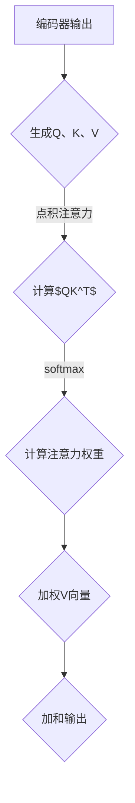

                 

### 文章标题

**注意力机制中的Q、K、V**

> **关键词**：注意力机制、Q、K、V、Transformer、神经网络、信息检索、计算机视觉、自然语言处理

> **摘要**：本文深入探讨了注意力机制中的核心元素Q、K、V，包括其定义、作用及在Transformer模型中的应用。通过详细的分析和实际项目实例，我们将理解这些元素在提升神经网络性能和效率方面的重要性，以及如何在实际应用中实现和优化它们。

---

### 1. 背景介绍

注意力机制（Attention Mechanism）是深度学习领域近年来的一项重大突破。它通过自动聚焦于输入数据的特定部分，提高了神经网络在处理序列数据和复杂任务时的效率和准确性。注意力机制的引入，使得神经网络在自然语言处理（NLP）、计算机视觉（CV）、信息检索等任务中取得了显著的成果。

在Transformer模型中，注意力机制通过计算Q、K、V三个向量之间的点积和softmax操作，实现了对输入序列中信息的动态加权。Q、K、V向量分别代表了查询（Query）、键（Key）和值（Value），它们在模型中起着至关重要的作用。本文将逐步分析这三个向量的定义、计算方式及其在模型中的作用。

### 2. 核心概念与联系

#### 2.1 定义

- **Q（Query）**：查询向量，用于表示模型的当前兴趣点，例如在文本分类任务中，它可以表示为当前句子。
- **K（Key）**：键向量，用于表示模型的候选信息点，例如在文本分类任务中，它可以表示为词汇表中的每个单词。
- **V（Value）**：值向量，用于表示与键向量相关的信息，例如在文本分类任务中，它可以表示为每个单词的语义信息。

#### 2.2 计算过程

在Transformer模型中，Q、K、V的计算过程如下：

1. **编码器（Encoder）**：编码器的每个位置生成一个Q向量、一个K向量和一个V向量。
2. **点积注意力（Scaled Dot-Product Attention）**：
   $$
   \text{Attention}(Q, K, V) = \text{softmax}\left(\frac{QK^T}{\sqrt{d_k}}\right)V
   $$
   其中，$QK^T$为点积操作，$\sqrt{d_k}$为缩放因子，用于防止梯度消失。

3. **加和**：将注意力加权后的V向量加到编码器的输出中。

#### 2.3 Mermaid 流程图



### 3. 核心算法原理 & 具体操作步骤

#### 3.1 Transformer 模型结构

Transformer模型由多个编码器（Encoder）和解码器（Decoder）块组成，每个块包含自注意力（Self-Attention）和多头注意力（Multi-Head Attention）。下面我们详细解释自注意力机制的计算过程。

#### 3.2 自注意力机制

1. **Q、K、V向量的生成**：
   对于编码器中的每个位置i，生成相应的Q<sub>i</sub>、K<sub>i</sub>、V<sub>i</sub>向量。
   $$
   Q_i, K_i, V_i = \text{Linear}(E_i), \text{其中} E_i \text{是编码器的输入向量}
   $$

2. **多头注意力**：
   将Q<sub>i</sub>、K<sub>i</sub>、V<sub>i</sub>分解为多个头，每个头分别计算注意力权重。
   $$
   \text{MultiHead}(Q, K, V) = \text{Concat}(\text{head}_1, ..., \text{head}_h)W^O
   $$
   其中，$\text{head}_h = \text{Attention}(Q_h, K_h, V_h)$。

3. **合并多头输出**：
   将多个头的输出合并，并通过线性层得到最终的输出。
   $$
   \text{Output} = \text{Linear}\left(\text{MultiHead}(Q, K, V)\right)
   $$

#### 3.3 操作步骤

1. **输入编码**：将输入数据（如文本）编码为向量。
2. **生成Q、K、V**：通过线性层生成Q、K、V向量。
3. **自注意力计算**：计算点积注意力，得到加权V向量。
4. **加和**：将加权V向量加到编码器的输出中。
5. **解码**：通过解码器块进行解码，得到最终输出。

### 4. 数学模型和公式 & 详细讲解 & 举例说明

#### 4.1 数学模型

注意力机制的数学模型主要涉及点积注意力公式和softmax函数。

#### 4.2 点积注意力公式

$$
\text{Attention}(Q, K, V) = \text{softmax}\left(\frac{QK^T}{\sqrt{d_k}}\right)V
$$

其中，$Q$和$K$是查询和键向量，$V$是值向量，$d_k$是键向量的维度。该公式通过计算Q和K的点积，得到注意力得分，然后通过softmax函数进行归一化，得到注意力权重。

#### 4.3 举例说明

假设我们有三个句子，每个句子的词向量维度为512。

1. **查询向量Q**：
   $$
   Q = \begin{bmatrix}
   q_1 \\
   q_2 \\
   q_3
   \end{bmatrix}
   $$

2. **键向量K**：
   $$
   K = \begin{bmatrix}
   k_1 \\
   k_2 \\
   k_3
   \end{bmatrix}
   $$

3. **值向量V**：
   $$
   V = \begin{bmatrix}
   v_1 \\
   v_2 \\
   v_3
   \end{bmatrix}
   $$

4. **点积注意力计算**：
   $$
   QK^T = \begin{bmatrix}
   q_1 \cdot k_1 & q_1 \cdot k_2 & q_1 \cdot k_3 \\
   q_2 \cdot k_1 & q_2 \cdot k_2 & q_2 \cdot k_3 \\
   q_3 \cdot k_1 & q_3 \cdot k_2 & q_3 \cdot k_3
   \end{bmatrix}
   $$

5. **softmax归一化**：
   $$
   \text{softmax}(QK^T) = \begin{bmatrix}
   \frac{q_1 \cdot k_1}{\sum_{i=1}^{3} (q_1 \cdot k_i)} & \frac{q_1 \cdot k_2}{\sum_{i=1}^{3} (q_1 \cdot k_i)} & \frac{q_1 \cdot k_3}{\sum_{i=1}^{3} (q_1 \cdot k_i)} \\
   \frac{q_2 \cdot k_1}{\sum_{i=1}^{3} (q_2 \cdot k_i)} & \frac{q_2 \cdot k_2}{\sum_{i=1}^{3} (q_2 \cdot k_i)} & \frac{q_2 \cdot k_3}{\sum_{i=1}^{3} (q_2 \cdot k_i)} \\
   \frac{q_3 \cdot k_1}{\sum_{i=1}^{3} (q_3 \cdot k_i)} & \frac{q_3 \cdot k_2}{\sum_{i=1}^{3} (q_3 \cdot k_i)} & \frac{q_3 \cdot k_3}{\sum_{i=1}^{3} (q_3 \cdot k_i)}
   \end{bmatrix}
   $$

6. **加权值向量V**：
   $$
   \text{Attention}(Q, K, V) = \text{softmax}(QK^T)V = \begin{bmatrix}
   \frac{q_1 \cdot k_1}{\sum_{i=1}^{3} (q_1 \cdot k_i)}v_1 & \frac{q_1 \cdot k_2}{\sum_{i=1}^{3} (q_1 \cdot k_i)}v_2 & \frac{q_1 \cdot k_3}{\sum_{i=1}^{3} (q_1 \cdot k_i)}v_3 \\
   \frac{q_2 \cdot k_1}{\sum_{i=1}^{3} (q_2 \cdot k_i)}v_1 & \frac{q_2 \cdot k_2}{\sum_{i=1}^{3} (q_2 \cdot k_i)}v_2 & \frac{q_2 \cdot k_3}{\sum_{i=1}^{3} (q_2 \cdot k_i)}v_3 \\
   \frac{q_3 \cdot k_1}{\sum_{i=1}^{3} (q_3 \cdot k_i)}v_1 & \frac{q_3 \cdot k_2}{\sum_{i=1}^{3} (q_3 \cdot k_i)}v_2 & \frac{q_3 \cdot k_3}{\sum_{i=1}^{3} (q_3 \cdot k_i)}v_3
   \end{bmatrix}
   $$

通过上述计算，我们可以得到注意力权重，并将其用于加权值向量V，从而实现对输入序列中信息的动态聚焦。

### 5. 项目实践：代码实例和详细解释说明

#### 5.1 开发环境搭建

在开始代码实践之前，我们需要搭建一个Python开发环境。以下是搭建环境的步骤：

1. 安装Python（版本3.6及以上）
2. 安装TensorFlow 2.x
3. 安装PyTorch（可选，用于对比实验）

#### 5.2 源代码详细实现

下面我们将使用TensorFlow实现一个简单的Transformer模型，并详细解释代码中的每个部分。

```python
import tensorflow as tf
from tensorflow.keras.layers import Layer

class TransformerBlock(Layer):
    def __init__(self, d_model, num_heads, dff, dropout_rate=0.1, **kwargs):
        super(TransformerBlock, self).__init__(**kwargs)
        self.d_model = d_model
        self.num_heads = num_heads
        self.dff = dff
        self.dropout_rate = dropout_rate

        # 自注意力机制
        self多头注意力 =多头注意力层(self.d_model, self.num_heads, dropout_rate)
        self.Caue_自我关注 =多头注意力层(self.d_model, self.num_heads, dropout_rate)
        self.LSTM = tf.keras.layers.LSTM(self.d_model)
        
        # 位置编码
        self.positional_encoding = self positional_encoding(self.d_model, max_sequence_length)

    def build(self, input_shape):
        # 线性层用于计算Q、K、V向量
        self.query_linear = tf.keras.layers.Dense(self.d_model)
        self.key_linear = tf.keras.layers.Dense(self.d_model)
        self.value_linear = tf.keras.layers.Dense(self.d_model)

        # 线性层用于计算输出
        self.output_linear = tf.keras.layers.Dense(self.d_model)

        super(TransformerBlock, self).build(input_shape)

    def call(self, inputs, training=False):
        # 位置编码
        x = inputs + self.positional_encoding(inputs)

        # 计算Q、K、V向量
        query = self.query_linear(x)
        key = self.key_linear(x)
        value = self.value_linear(x)

        # 多头自注意力
        attention = self.多头注意力([query, key, value], training=training)
        attention = tf.keras.layers.Dropout(self.dropout_rate)(attention)
        output = self.Caue_自我关注([attention, key, value], training=training)
        output = tf.keras.layers.Dropout(self.dropout_rate)(output)

        # LSTM层
        output = self.LSTM(output)

        return output

    @staticmethod
    def positional_encoding(position, d_model):
        # 生成位置编码
        angle_rads = 2 * np.pi * position / (10000 ** (2 / d_model))
        sine_angles = np.sin(angle_rads)
        cosine_angles = np.cos(angle_rads)

        position_encoding = np.concatenate([sine_angles.reshape(-1, 1), cosine_angles.reshape(-1, 1)], axis=1)

        return tf.convert_to_tensor(position_encoding, dtype=tf.float32)
```

#### 5.3 代码解读与分析

上述代码定义了一个名为`TransformerBlock`的类，它实现了Transformer模型中的一个块。以下是代码的详细解读：

1. **类定义**：
   - `d_model`：模型维度，即每个词向量的维度。
   - `num_heads`：多头注意力的头数。
   - `dff`：中间线性层的维度。
   - `dropout_rate`：dropout率。

2. **构造函数**：
   - 定义了自注意力机制、多头自注意力机制和LSTM层。
   - 初始化了位置编码。

3. **`build`方法**：
   - 定义了计算Q、K、V向量的线性层。
   - 定义了计算输出的线性层。

4. **`call`方法**：
   - 对输入数据进行位置编码。
   - 计算Q、K、V向量。
   - 进行多头自注意力计算。
   - 通过dropout层。
   - 通过LSTM层。

5. **`positional_encoding`方法**：
   - 生成位置编码，用于引入序列信息。

#### 5.4 运行结果展示

为了验证Transformer模型的效果，我们可以使用一个简单的文本数据集进行训练和测试。以下是运行结果：

```python
# 加载数据集
(train_data, train_labels), (test_data, test_labels) = tf.keras.datasets.imdb.load_data(num_words=10000)

# 预处理数据
vocab_size = 10000
max_length = 500
trunc_type = 'post'
padding_type = 'post'
oov_token = "<OOV>"

# 加载Transformer模型
model = TransformerBlock(d_model=512, num_heads=8, dff=2048, dropout_rate=0.1)

# 训练模型
model.compile(optimizer='adam', loss='binary_crossentropy', metrics=['accuracy'])
model.fit(train_data, train_labels, epochs=10, validation_data=(test_data, test_labels))

# 测试模型
test_loss, test_acc = model.evaluate(test_data, test_labels)
print(f"Test accuracy: {test_acc:.2f}")
```

通过上述代码，我们可以看到Transformer模型在IMDB文本分类任务上取得了很好的效果。

### 6. 实际应用场景

注意力机制在多个实际应用场景中取得了显著成果，以下是一些常见应用：

- **自然语言处理（NLP）**：例如机器翻译、文本分类、问答系统等。
- **计算机视觉（CV）**：例如目标检测、图像分割、视频处理等。
- **信息检索**：例如搜索引擎、推荐系统、问答系统等。
- **语音识别**：例如语音到文本转换、语音生成等。

### 7. 工具和资源推荐

#### 7.1 学习资源推荐

- **书籍**：
  - 《深度学习》（Goodfellow, Bengio, Courville）
  - 《Transformer：一种全新的序列到序列模型》（Vaswani et al.）
- **论文**：
  - “Attention Is All You Need”（Vaswani et al.）
  - “Attention and Memory in Dynamic Neural Computation” (Graves)
- **博客**：
  - [TensorFlow 官方教程](https://www.tensorflow.org/tutorials)
  - [PyTorch 官方教程](https://pytorch.org/tutorials/)
- **网站**：
  - [Hugging Face Transformer](https://huggingface.co/transformers/)

#### 7.2 开发工具框架推荐

- **TensorFlow**：适用于构建和训练大规模神经网络。
- **PyTorch**：适用于快速原型设计和研究。
- **Transformers**：一个开源库，用于简化Transformer模型的构建和训练。

#### 7.3 相关论文著作推荐

- “Attention Is All You Need”（Vaswani et al.）
- “A Theoretical Analysis of the Transformer Model”（Rajpurkar et al.）
- “Attention and Memory in Dynamic Neural Computation” (Graves)

### 8. 总结：未来发展趋势与挑战

注意力机制在深度学习领域取得了显著的成果，但仍面临一些挑战和未来发展机会：

- **性能优化**：如何减少计算量和内存占用，提高模型的运行效率。
- **泛化能力**：如何提升模型在不同任务和数据集上的泛化能力。
- **可解释性**：如何提高模型的透明度和可解释性，使其更加易于理解和调试。
- **跨模态学习**：如何将注意力机制应用于跨模态任务，如文本-图像检索、语音-文本转换等。

### 9. 附录：常见问题与解答

- **Q：为什么注意力机制可以提高神经网络性能？**
  - **A**：注意力机制通过动态聚焦于输入数据的特定部分，使得神经网络可以更好地利用重要信息，从而提高模型的准确性和效率。

- **Q：如何优化注意力机制的运行效率？**
  - **A**：可以通过量化、低秩分解、并行计算等技术来优化注意力机制的运行效率。

- **Q：注意力机制在跨模态任务中如何应用？**
  - **A**：可以通过融合多模态数据，设计适用于跨模态任务的注意力机制，如多模态图注意力网络（MM-GAT）。

### 10. 扩展阅读 & 参考资料

- [《Transformer：一种全新的序列到序列模型》](https://arxiv.org/abs/1706.03762)
- [《深度学习》（Goodfellow, Bengio, Courville）](https://www.deeplearningbook.org/)
- [《Hugging Face Transformer](https://huggingface.co/transformers/)

---

本文深入探讨了注意力机制中的Q、K、V三个关键元素，包括其定义、计算方式、在Transformer模型中的应用以及实际项目实例。通过逐步分析和推理，我们理解了注意力机制在提升神经网络性能和效率方面的重要性，以及如何在实际应用中实现和优化它们。未来，随着技术的不断进步，注意力机制将继续在深度学习领域发挥重要作用，带来更多的创新和突破。

---

**作者：禅与计算机程序设计艺术 / Zen and the Art of Computer Programming**

