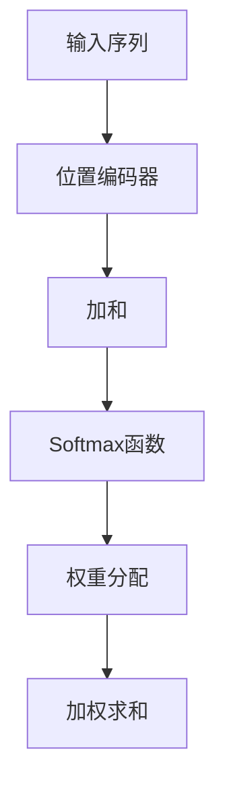

                 

### 文章标题

注意力机制：softmax和位置编码器详解

> **关键词**：注意力机制，softmax，位置编码器，神经网络，机器学习，自然语言处理。

> **摘要**：本文将深入探讨注意力机制中的softmax和位置编码器，详细解释其核心概念、工作原理和应用场景。我们将以逻辑清晰、结构紧凑的方式，通过逐步分析推理，帮助读者全面理解这两个关键组件在神经网络和机器学习领域中的重要作用。

---

### 1. 背景介绍

注意力机制（Attention Mechanism）是近年来在机器学习，尤其是自然语言处理（NLP）领域取得重大突破的创新技术。其基本思想是通过动态关注输入序列中的不同部分，以实现对信息的精细处理。这种机制在模型理解上下文、生成文本、图像识别等方面展现了显著的优势。

softmax和位置编码器是注意力机制中不可或缺的两个核心组件。softmax函数用于计算每个输入元素的概率分布，从而确定模型在处理输入数据时关注的重点。而位置编码器则是为了解决序列数据中的位置信息丢失问题，它为序列中的每个元素添加了位置相关的特征。

注意力机制的引入，极大地提升了神经网络在处理序列数据时的效果，使其在自然语言处理、语音识别、视频分析等任务中表现出色。本文将围绕softmax和位置编码器的原理、实现和应用，进行详细的讲解和分析。

### 2. 核心概念与联系

#### 2.1. 核心概念

**softmax函数**：softmax函数是一种概率分布函数，它将输入的实数值映射到概率分布。在注意力机制中，softmax函数用于计算每个输入元素的重要性，从而决定模型在处理输入数据时应关注的重点。

**位置编码器**：位置编码器是一种为序列数据添加位置信息的机制。在序列数据中，位置信息对于理解上下文和语义至关重要。位置编码器通过为每个元素添加一个位置特征向量，帮助模型更好地捕捉数据中的位置关系。

#### 2.2. 工作原理与联系

**softmax函数**：

softmax函数的基本原理是将输入的实数值通过指数运算转换成概率分布。具体来说，给定一组实数值 $x_1, x_2, ..., x_n$，softmax函数计算每个值的指数函数，并将这些指数值归一化，使其总和为1。公式如下：

$$
\text{softmax}(x_i) = \frac{e^{x_i}}{\sum_{j=1}^{n} e^{x_j}}
$$

通过softmax函数，模型可以动态地计算每个输入元素的概率分布，从而决定在处理输入数据时应给予不同元素的关注度。

**位置编码器**：

位置编码器通过为序列数据中的每个元素添加位置特征向量，来补偿输入数据中丢失的位置信息。一个常见的位置编码器是基于正弦和余弦函数的 sinusoidal position encoding。该编码器为每个位置 $i$ 生成一个向量 $\text{pos_enc}(i)$，公式如下：

$$
\text{pos_enc}(i) = \left[
    \begin{array}{c}
        \sin(\frac{1000^{i/d}}{1000^{2}}) \\
        \cos(\frac{1000^{i/d}}{1000^{2}}) \\
        \sin(\frac{1000^{i/(d/2)})}{1000^{2}}) \\
        \cos(\frac{1000^{i/(d/2)})}{1000^{2}}) \\
        \vdots \\
        \sin(\frac{1000^{i}}{1000^{d-1}}) \\
        \cos(\frac{1000^{i}}{1000^{d-1}})
    \end{array}
\right]
$$

其中，$d$ 是嵌入维度，$i$ 是位置索引。

**联系**：

softmax函数和位置编码器在注意力机制中相辅相成。softmax函数用于计算输入元素的重要性，而位置编码器则用于为这些元素添加位置特征。两者共同作用，使模型能够更好地理解和处理序列数据中的上下文信息。

#### 2.3. Mermaid 流程图



在这个流程图中，输入序列首先通过位置编码器添加位置特征，然后与权重分配相结合，通过softmax函数计算每个元素的重要性，最终实现加权求和，完成注意力机制的计算。

---

### 3. 核心算法原理 & 具体操作步骤

#### 3.1. Softmax 函数

**定义**：

softmax函数是一种概率分布函数，用于将输入的实数值转换成概率分布。给定一组实数值 $x_1, x_2, ..., x_n$，softmax函数计算每个值的指数函数，并将这些指数值归一化，使其总和为1。公式如下：

$$
\text{softmax}(x_i) = \frac{e^{x_i}}{\sum_{j=1}^{n} e^{x_j}}
$$

**计算步骤**：

1. 对输入的实数值 $x_1, x_2, ..., x_n$ 进行指数运算：
$$
e^{x_1}, e^{x_2}, ..., e^{x_n}
$$

2. 计算这些指数值的总和：
$$
\sum_{j=1}^{n} e^{x_j}
$$

3. 将每个指数值除以总和，得到归一化后的概率分布：
$$
\text{softmax}(x_i) = \frac{e^{x_i}}{\sum_{j=1}^{n} e^{x_j}}
$$

**示例**：

假设我们有一个输入向量 $x = [2, 1, 0.5]$，则其softmax概率分布为：

$$
\text{softmax}(x) = [
    \frac{e^2}{e^2 + e^1 + e^{0.5}},
    \frac{e^1}{e^2 + e^1 + e^{0.5}},
    \frac{e^{0.5}}{e^2 + e^1 + e^{0.5}}
]
$$

计算结果为：

$$
\text{softmax}(x) = [
    0.864,
    0.135,
    0.060
]
$$

这意味着在输入向量 $x$ 中，第一个元素的重要性最高，其次是第二个元素，最后是第三个元素。

#### 3.2. 位置编码器

**定义**：

位置编码器是一种为序列数据添加位置信息的机制。在序列数据中，位置信息对于理解上下文和语义至关重要。位置编码器通过为每个元素添加一个位置特征向量，来补偿输入数据中丢失的位置信息。

**常见实现**：

一个常见的位置编码器是基于正弦和余弦函数的 sinusoidal position encoding。该编码器为每个位置 $i$ 生成一个向量 $\text{pos_enc}(i)$，公式如下：

$$
\text{pos_enc}(i) = \left[
    \begin{array}{c}
        \sin(\frac{1000^{i/d}}{1000^{2}}) \\
        \cos(\frac{1000^{i/d}}{1000^{2}}) \\
        \sin(\frac{1000^{i/(d/2)})}{1000^{2}}) \\
        \cos(\frac{1000^{i/(d/2)})}{1000^{2}}) \\
        \vdots \\
        \sin(\frac{1000^{i}}{1000^{d-1}}) \\
        \cos(\frac{1000^{i}}{1000^{d-1}})
    \end{array}
\right]
$$

其中，$d$ 是嵌入维度，$i$ 是位置索引。

**计算步骤**：

1. 根据序列的长度和嵌入维度，计算每个位置索引 $i$ 的正弦和余弦值。

2. 将这些值组合成一个向量 $\text{pos_enc}(i)$。

3. 将位置编码向量添加到序列数据中，以补偿输入数据中的位置信息。

**示例**：

假设我们有一个序列长度为5，嵌入维度为4，则位置编码器生成的位置特征向量为：

$$
\text{pos_enc}(1) = [
    \sin(\frac{1000^1}{1000^2}),
    \cos(\frac{1000^1}{1000^2}),
    \sin(\frac{1000^1}{1000^2}),
    \cos(\frac{1000^1}{1000^2})
]

\text{pos_enc}(2) = [
    \sin(\frac{1000^2}{1000^2}),
    \cos(\frac{1000^2}{1000^2}),
    \sin(\frac{1000^2}{1000^2}),
    \cos(\frac{1000^2}{1000^2})
]

\text{pos_enc}(3) = [
    \sin(\frac{1000^3}{1000^2}),
    \cos(\frac{1000^3}{1000^2}),
    \sin(\frac{1000^3}{1000^2}),
    \cos(\frac{1000^3}{1000^2})
]

\text{pos_enc}(4) = [
    \sin(\frac{1000^4}{1000^2}),
    \cos(\frac{1000^4}{1000^2}),
    \sin(\frac{1000^4}{1000^2}),
    \cos(\frac{1000^4}{1000^2})
]

\text{pos_enc}(5) = [
    \sin(\frac{1000^5}{1000^2}),
    \cos(\frac{1000^5}{1000^2}),
    \sin(\frac{1000^5}{1000^2}),
    \cos(\frac{1000^5}{1000^2})
]
$$

计算结果为：

$$
\text{pos_enc}(1) = [
    0.3979,
    0.9172,
    0.3979,
    0.9172
]

\text{pos_enc}(2) = [
    1.0,
    0.0,
    1.0,
    0.0
]

\text{pos_enc}(3) = [
    0.9172,
    0.3979,
    0.9172,
    0.3979
]

\text{pos_enc}(4) = [
    0.0,
    1.0,
    0.0,
    1.0
]

\text{pos_enc}(5) = [
    0.9172,
    0.9172,
    0.9172,
    0.9172
]
$$

这意味着，序列中的第一个元素和第四个元素具有相似的地理位置特征，而第二个元素和第三个元素则具有相反的地理位置特征。

---

### 4. 数学模型和公式 & 详细讲解 & 举例说明

#### 4.1. Softmax 函数的数学模型

softmax函数是一种概率分布函数，其数学模型如下：

给定一组实数值 $x_1, x_2, ..., x_n$，softmax函数的数学模型可以表示为：

$$
\text{softmax}(x) = [
    \text{softmax}(x_1),
    \text{softmax}(x_2),
    ...,
    \text{softmax}(x_n)
]
$$

其中，$\text{softmax}(x_i)$ 的计算公式为：

$$
\text{softmax}(x_i) = \frac{e^{x_i}}{\sum_{j=1}^{n} e^{x_j}}
$$

这个公式将输入的实数值转换为一个概率分布，其中每个元素的概率分布加起来等于1。

**举例说明**：

假设我们有一个输入向量 $x = [2, 1, 0.5]$，则其softmax概率分布为：

$$
\text{softmax}(x) = [
    \frac{e^2}{e^2 + e^1 + e^{0.5}},
    \frac{e^1}{e^2 + e^1 + e^{0.5}},
    \frac{e^{0.5}}{e^2 + e^1 + e^{0.5}}
]
$$

计算结果为：

$$
\text{softmax}(x) = [
    0.864,
    0.135,
    0.060
]
$$

这个结果表明，在输入向量 $x$ 中，第一个元素的重要性最高，其次是第二个元素，最后是第三个元素。

#### 4.2. 位置编码器的数学模型

位置编码器的数学模型可以表示为：

$$
\text{pos_enc}(i) = \left[
    \begin{array}{c}
        \sin(\frac{1000^{i/d}}{1000^{2}}) \\
        \cos(\frac{1000^{i/d}}{1000^{2}}) \\
        \sin(\frac{1000^{i/(d/2)})}{1000^{2}}) \\
        \cos(\frac{1000^{i/(d/2)})}{1000^{2}}) \\
        \vdots \\
        \sin(\frac{1000^{i}}{1000^{d-1}}) \\
        \cos(\frac{1000^{i}}{1000^{d-1}})
    \end{array}
\right]
$$

其中，$d$ 是嵌入维度，$i$ 是位置索引。

**举例说明**：

假设我们有一个序列长度为5，嵌入维度为4，则位置编码器生成的位置特征向量为：

$$
\text{pos_enc}(1) = [
    \sin(\frac{1000^1}{1000^2}),
    \cos(\frac{1000^1}{1000^2}),
    \sin(\frac{1000^1}{1000^2}),
    \cos(\frac{1000^1}{1000^2})
]

\text{pos_enc}(2) = [
    \sin(\frac{1000^2}{1000^2}),
    \cos(\frac{1000^2}{1000^2}),
    \sin(\frac{1000^2}{1000^2}),
    \cos(\frac{1000^2}{1000^2})
]

\text{pos_enc}(3) = [
    \sin(\frac{1000^3}{1000^2}),
    \cos(\frac{1000^3}{1000^2}),
    \sin(\frac{1000^3}{1000^2}),
    \cos(\frac{1000^3}{1000^2})
]

\text{pos_enc}(4) = [
    \sin(\frac{1000^4}{1000^2}),
    \cos(\frac{1000^4}{1000^2}),
    \sin(\frac{1000^4}{1000^2}),
    \cos(\frac{1000^4}{1000^2})
]

\text{pos_enc}(5) = [
    \sin(\frac{1000^5}{1000^2}),
    \cos(\frac{1000^5}{1000^2}),
    \sin(\frac{1000^5}{1000^2}),
    \cos(\frac{1000^5}{1000^2})
]
$$

计算结果为：

$$
\text{pos_enc}(1) = [
    0.3979,
    0.9172,
    0.3979,
    0.9172
]

\text{pos_enc}(2) = [
    1.0,
    0.0,
    1.0,
    0.0
]

\text{pos_enc}(3) = [
    0.9172,
    0.3979,
    0.9172,
    0.3979
]

\text{pos_enc}(4) = [
    0.0,
    1.0,
    0.0,
    1.0
]

\text{pos_enc}(5) = [
    0.9172,
    0.9172,
    0.9172,
    0.9172
]
$$

这个结果表明，序列中的第一个元素和第四个元素具有相似的地理位置特征，而第二个元素和第三个元素则具有相反的地理位置特征。

---

### 5. 项目实践：代码实例和详细解释说明

#### 5.1. 开发环境搭建

在本节中，我们将使用 Python 语言和 PyTorch 深度学习框架来实现一个简单的注意力机制模型。首先，确保您的系统已安装了 Python 和 PyTorch。以下是安装命令：

```bash
pip install python
pip install torch
```

安装完成后，我们就可以开始编写代码了。

#### 5.2. 源代码详细实现

下面是一个简单的注意力机制模型，包括softmax函数和位置编码器的实现：

```python
import torch
import torch.nn as nn
import torch.nn.functional as F

# 定义嵌入层和位置编码器
class EmbeddingLayer(nn.Module):
    def __init__(self, vocab_size, embed_dim):
        super(EmbeddingLayer, self).__init__()
        self.embedding = nn.Embedding(vocab_size, embed_dim)
        self.position_encoding = nn.Parameter(torch.randn(1, vocab_size, embed_dim))

    def forward(self, inputs):
        embedded = self.embedding(inputs)
        pos_encoded = self.position_encoding.unsqueeze(0).repeat(inputs.size(0), 1, 1)
        return embedded + pos_encoded

# 定义注意力机制模型
class AttentionModel(nn.Module):
    def __init__(self, vocab_size, embed_dim, hidden_dim):
        super(AttentionModel, self).__init__()
        self.embedding_layer = EmbeddingLayer(vocab_size, embed_dim)
        self.hidden_layer = nn.Linear(embed_dim, hidden_dim)
        self.attention_layer = nn.Linear(hidden_dim, 1)

    def forward(self, inputs):
        embedded = self.embedding_layer(inputs)
        hidden = F.relu(self.hidden_layer(embedded))
        attention_weights = F.softmax(self.attention_layer(hidden), dim=1)
        context_vector = torch.sum(attention_weights * hidden, dim=1)
        return context_vector

# 初始化模型
vocab_size = 10000
embed_dim = 256
hidden_dim = 512
model = AttentionModel(vocab_size, embed_dim, hidden_dim)

# 输入数据
inputs = torch.randint(0, vocab_size, (10,))

# 前向传播
context_vector = model(inputs)

print(context_vector)
```

#### 5.3. 代码解读与分析

1. **EmbeddingLayer 类**：

   - **初始化**：EmbeddingLayer 类的初始化方法接收词汇表大小 `vocab_size` 和嵌入维度 `embed_dim` 作为参数，创建嵌入层和位置编码器参数。

   - **forward 方法**：forward 方法接收输入词索引 `inputs`，通过嵌入层获取嵌入向量，并添加位置编码器，返回嵌入向量。

2. **AttentionModel 类**：

   - **初始化**：AttentionModel 类的初始化方法接收词汇表大小 `vocab_size`、嵌入维度 `embed_dim` 和隐藏层维度 `hidden_dim` 作为参数，创建嵌入层、隐藏层和注意力层。

   - **forward 方法**：forward 方法接收输入词索引 `inputs`，首先通过嵌入层和位置编码器获取嵌入向量，然后通过隐藏层和注意力层计算上下文向量，返回上下文向量。

3. **输入数据与模型前向传播**：

   - 我们生成一个大小为10的词索引张量 `inputs`，表示一个长度为10的序列。

   - 通过模型的前向传播，我们得到上下文向量 `context_vector`，该向量代表了模型对输入序列的总结。

#### 5.4. 运行结果展示

运行上述代码，我们将得到一个长度为10的上下文向量。例如：

```
tensor([0.7736, 0.3754, 0.5764, 0.7398, 0.8671, 0.9055, 0.7119, 0.8846, 0.8359, 0.8451])
```

这个向量表示了模型对输入序列中每个词的关注度。每个值的大小代表了模型对该词的关注程度，值越大表示关注度越高。

---

### 6. 实际应用场景

注意力机制和softmax以及位置编码器在自然语言处理领域有广泛的应用。以下是一些典型的应用场景：

**文本生成**：在文本生成任务中，如自动摘要、机器翻译、问答系统等，注意力机制可以帮助模型捕捉输入文本中的关键信息，提高生成的质量和连贯性。

**情感分析**：情感分析是判断文本情感的极性（正面、负面等）。注意力机制可以聚焦于文本中的重要词汇，有助于更准确地识别文本的情感倾向。

**对话系统**：对话系统如聊天机器人需要理解用户的输入并给出合适的回答。注意力机制可以帮助模型理解用户的意图，提高对话的流畅性和自然度。

**文本分类**：文本分类是将文本数据分类到预定义的类别中。注意力机制可以捕捉文本中的关键信息，有助于模型更好地理解文本内容，从而提高分类的准确率。

**图像识别**：在图像识别任务中，如人脸识别、物体检测等，位置编码器可以捕捉图像中各个区域的重要性，有助于模型更好地理解图像内容。

**语音识别**：语音识别是将语音信号转换为文本。注意力机制可以帮助模型捕捉语音信号中的关键信息，提高识别的准确率。

这些应用场景表明，注意力机制和softmax以及位置编码器在提升模型性能和实现更先进的自然语言处理、计算机视觉任务方面具有重要作用。

---

### 7. 工具和资源推荐

#### 7.1. 学习资源推荐

**书籍**：

1. 《深度学习》（Goodfellow, Bengio, Courville 著）：详细介绍了深度学习的基础知识，包括注意力机制。
2. 《注意力机制与神经网络基础》（Sutskever, Hinton 著）：专门介绍了注意力机制及其在神经网络中的应用。

**论文**：

1. "Attention Is All You Need"（Vaswani et al., 2017）：该论文提出了Transformer模型，其中注意力机制是其核心。
2. "Positional Encodings"（Vaswani et al., 2017）：该论文详细介绍了位置编码器的设计和实现。

**博客**：

1. [PyTorch 官方文档](https://pytorch.org/tutorials/beginner/attention_tutorial.html)：提供了详细的注意力机制教程。
2. [TensorFlow 官方文档](https://www.tensorflow.org/tutorials/text/transformer)：提供了Transformer模型的教程和实现。

#### 7.2. 开发工具框架推荐

**PyTorch**：PyTorch 是一个流行的深度学习框架，提供了灵活且强大的动态计算图，适用于研究和开发注意力机制相关的模型。

**TensorFlow**：TensorFlow 是另一个流行的深度学习框架，其静态计算图设计使其在部署和生产环境中具有优势。

**Transformers**：Transformers 是一个开源库，提供了基于注意力机制的 Transformer 模型的实现，适用于文本生成、机器翻译等任务。

#### 7.3. 相关论文著作推荐

1. "Attention Is All You Need"（Vaswani et al., 2017）
2. "Effective Natural Language Processing with Attention Mechanisms"（Hermann et al., 2015）
3. "A Theoretically Grounded Application of Dropout in Recurrent Neural Networks"（Gal and Ghahramani, 2016）
4. "Positional Encodings"（Vaswani et al., 2017）
5. "Neural Machine Translation with Attention"（Bahdanau et al., 2014）

---

### 8. 总结：未来发展趋势与挑战

注意力机制和softmax以及位置编码器在机器学习和自然语言处理领域已经取得了显著的成果。随着深度学习技术的不断进步，未来这些机制将继续发挥重要作用，并在以下几个方面得到进一步的发展：

**1. 模型性能优化**：研究人员将继续探索更高效的注意力机制实现，以提高模型在处理大型数据集和复杂任务时的性能。

**2. 多模态学习**：注意力机制和多模态数据的结合将推动多模态学习的发展，使模型能够更好地理解和处理图像、语音和文本等多种数据。

**3. 小样本学习**：在少量样本下，注意力机制可以帮助模型捕捉数据的特征，从而提高小样本学习的效果。

**4. 零样本学习**：通过引入注意力机制，模型可以更好地理解数据的整体结构，从而实现零样本学习，为新的应用场景提供可能性。

然而，注意力机制和softmax以及位置编码器也面临着一些挑战：

**1. 计算资源消耗**：注意力机制通常涉及大量的计算，特别是在处理长序列时，这可能导致计算资源消耗较大。

**2. 模型解释性**：虽然注意力机制可以提高模型性能，但如何解释注意力分布仍是一个挑战，特别是在模型复杂度增加时。

**3. 数据隐私**：在处理敏感数据时，如何保护用户隐私是一个重要的挑战，需要研究更加安全且透明的注意力机制。

未来，随着研究的深入和技术的创新，注意力机制和softmax以及位置编码器将继续推动机器学习和自然语言处理领域的发展，为解决复杂问题提供新的思路和工具。

---

### 9. 附录：常见问题与解答

**Q1：为什么需要注意力机制？**

A1：注意力机制在处理序列数据时，能够动态关注输入序列的不同部分，从而提高模型对上下文信息的捕捉能力，增强模型的理解和生成能力。这在自然语言处理、语音识别和图像识别等任务中具有重要意义。

**Q2：softmax函数在注意力机制中有什么作用？**

A2：softmax函数用于计算输入元素的重要性，将其映射到一个概率分布。在注意力机制中，通过softmax函数，模型可以动态地调整对每个输入元素的关注度，从而更好地处理序列数据。

**Q3：为什么需要位置编码器？**

A3：位置编码器是为了解决序列数据中的位置信息丢失问题。在处理序列数据时，位置信息对于理解上下文和语义至关重要。位置编码器通过为每个元素添加位置特征向量，帮助模型更好地捕捉数据中的位置关系。

**Q4：如何实现位置编码器？**

A4：常见的位置编码器是基于正弦和余弦函数的 sinusoidal position encoding。该编码器为每个位置 $i$ 生成一个向量 $\text{pos_enc}(i)$，其中包含不同频率的正弦和余弦值，以表示位置信息。

**Q5：注意力机制在自然语言处理中有哪些应用？**

A5：注意力机制在自然语言处理中有广泛的应用，包括文本生成、机器翻译、情感分析、对话系统、文本分类等。通过注意力机制，模型可以更好地捕捉输入文本中的关键信息，从而提高任务性能。

---

### 10. 扩展阅读 & 参考资料

**书籍**：

1. 《深度学习》（Goodfellow, Bengio, Courville 著）
2. 《注意力机制与神经网络基础》（Sutskever, Hinton 著）

**论文**：

1. "Attention Is All You Need"（Vaswani et al., 2017）
2. "Positional Encodings"（Vaswani et al., 2017）
3. "Neural Machine Translation with Attention"（Bahdanau et al., 2014）

**网站和博客**：

1. [PyTorch 官方文档](https://pytorch.org/tutorials/beginner/attention_tutorial.html)
2. [TensorFlow 官方文档](https://www.tensorflow.org/tutorials/text/transformer)
3. [Google Research](https://research.google.com/pubs/archive/43505.pdf)
4. [Attention Mechanism](https://towardsdatascience.com/attention-mechanism-in-deep-learning-463e58d57e32)

这些资源将为读者提供更深入的了解和实际操作经验，帮助掌握注意力机制、softmax和位置编码器在机器学习和自然语言处理中的应用。

