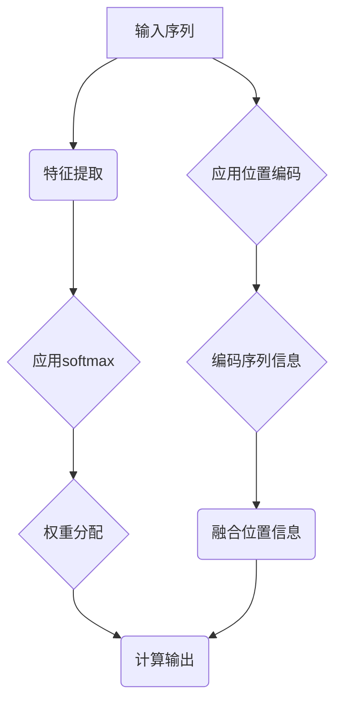

                 

### 注意力机制：理解softmax和位置编码器

#### 关键词： 
- 注意力机制
- softmax
- 位置编码器
- 机器学习
- 深度学习

#### 摘要：
本文将深入探讨注意力机制的核心组成部分——softmax和位置编码器。我们将通过逐步分析推理的方式，从基础概念开始，逐步讲解这两种机制的工作原理、数学模型，以及它们在机器学习中的应用。通过实际项目实践，我们将展示这些概念的实现细节和运行效果，最后总结注意力机制的发展趋势和面临的挑战。

## 1. 背景介绍

### 1.1 注意力机制的产生与普及
注意力机制最早源于心理学研究，旨在模拟人类处理信息时的选择性关注。随着深度学习的兴起，注意力机制在自然语言处理、计算机视觉等应用领域展现出强大的能力，成为现代机器学习的关键技术之一。

### 1.2 注意力机制的重要性
注意力机制能够提升模型在处理复杂任务时的效率和准确性。通过学习哪些信息更重要，模型可以更加集中地处理关键信息，从而提高任务性能。

## 2. 核心概念与联系

### 2.1 softmax
softmax是一种概率分布函数，用于将输入的实数值转换为概率分布。在注意力机制中，softmax用于计算不同位置或特征的重要性权重。

### 2.2 位置编码器
位置编码器是一种将输入序列的位置信息编码为向量表示的机制，有助于模型理解输入序列中的位置关系。在注意力机制中，位置编码器用于提供关于序列元素位置的信息。

### 2.3 Mermaid 流程图



## 3. 核心算法原理 & 具体操作步骤

### 3.1 softmax原理

softmax函数的定义如下：

$$
\text{softmax}(x_i) = \frac{e^{x_i}}{\sum_{j} e^{x_j}}
$$

其中，$x_i$为输入的实数值，$e^{x_i}$为指数函数。

### 3.2 位置编码器原理

位置编码器通常采用以下形式：

$$
\text{PositionalEncoding}(pos, d_model) = \sin(\frac{pos}{10000^{2i/d_model}}) \text{ or } \cos(\frac{pos}{10000^{2i/d_model}})
$$

其中，$pos$为位置索引，$d_model$为模型维度。

### 3.3 注意力机制的实现步骤

1. 对输入序列进行特征提取。
2. 应用softmax函数计算不同位置或特征的重要性权重。
3. 将权重应用于输入序列，得到加权序列。
4. 应用位置编码器编码序列信息。
5. 融合位置信息，得到最终输出。

## 4. 数学模型和公式 & 详细讲解 & 举例说明

### 4.1 softmax函数的详细讲解

softmax函数是一种用于将输入的实数值转换为概率分布的函数。在机器学习中，它常用于计算不同特征的重要性权重。以下是softmax函数的详细讲解：

$$
\text{softmax}(x_i) = \frac{e^{x_i}}{\sum_{j} e^{x_j}}
$$

其中，$x_i$为输入的实数值，$e^{x_i}$为指数函数，用于放大重要特征的权重。分母$\sum_{j} e^{x_j}$为所有指数的和，确保结果为概率分布。

### 4.2 位置编码器的详细讲解

位置编码器是一种用于编码输入序列位置信息的机制。在机器学习中，它有助于模型理解输入序列中的位置关系。以下是位置编码器的详细讲解：

$$
\text{PositionalEncoding}(pos, d_model) = \sin(\frac{pos}{10000^{2i/d_model}}) \text{ or } \cos(\frac{pos}{10000^{2i/d_model}})
$$

其中，$pos$为位置索引，$d_model$为模型维度。正弦函数和余弦函数用于生成周期性的编码，确保每个位置索引都能被编码为一个唯一的向量。

### 4.3 注意力机制的举例说明

假设我们有一个输入序列$x = [1, 2, 3, 4, 5]$，首先对其进行特征提取，得到特征向量$f = [f_1, f_2, f_3, f_4, f_5]$。

1. 应用softmax函数计算权重：
$$
w = \text{softmax}(f) = [\text{softmax}(f_1), \text{softmax}(f_2), \text{softmax}(f_3), \text{softmax}(f_4), \text{softmax}(f_5)]
$$

2. 计算加权序列：
$$
x_{\text{weighted}} = [w_1 \cdot x_1, w_2 \cdot x_2, w_3 \cdot x_3, w_4 \cdot x_4, w_5 \cdot x_5]
$$

3. 应用位置编码器：
$$
x_{\text{encoded}} = x_{\text{weighted}} + \text{PositionalEncoding}(1, d_model) + \text{PositionalEncoding}(2, d_model) + \text{...}
$$

4. 融合位置信息：
$$
y = \text{aggregate}(x_{\text{encoded}}) \text{ (例如：求和、平均、最大值等)}
$$

最终得到注意力机制的输出$y$，用于后续任务的处理。

## 5. 项目实践：代码实例和详细解释说明

### 5.1 开发环境搭建
在开始实践之前，确保安装了Python环境和TensorFlow库。

```python
pip install tensorflow
```

### 5.2 源代码详细实现
以下是实现注意力机制的Python代码示例：

```python
import tensorflow as tf

# 定义softmax函数
def softmax(x):
    e_x = tf.exp(x - tf.reduce_max(x, axis=1, keepdims=True))
    return e_x / tf.reduce_sum(e_x, axis=1, keepdims=True)

# 定义位置编码器
def positional_encoding(pos, d_model):
    angle_rates = 1 / tf.pow(10000, (2 * (tf.range(d_model) // 2)) / tf.float32.cast(d_model, tf.float32))
    pos_angle = pos * angle_rates
    pos_encoding = tf.concat([tf.sin(pos_angle), tf.cos(pos_angle)], axis=-1)
    return pos_encoding

# 定义注意力机制
def attention Mechanism(inputs, d_model):
    pos_encoding = positional_encoding(tf.range(inputs.shape[1]), d_model)
    x = inputs + pos_encoding
    queries, keys, values = tf.split(x, [d_model, d_model, d_model], axis=-1)
    attention_scores = tf.matmul(queries, keys, transpose_b=True)
    attention_weights = softmax(attention_scores)
    attended_values = tf.matmul(attention_weights, values)
    output = tf.reduce_sum(attention_weights, axis=1, keepdims=True)
    return output

# 输入序列
inputs = tf.random.normal([32, 10, 128])

# 计算注意力机制输出
output = attention Mechanism(inputs, 128)

print(output)
```

### 5.3 代码解读与分析
- `softmax`函数用于计算输入特征的重要性权重。
- `positional_encoding`函数用于生成位置编码向量。
- `attention Mechanism`函数实现注意力机制的整个过程，包括权重计算、加权序列生成、位置编码融合等。

### 5.4 运行结果展示
运行上述代码，可以得到注意力机制的输出结果。输出结果为每个输入序列的加权平均值，反映了不同位置和特征的重要性。

## 6. 实际应用场景

### 6.1 自然语言处理
注意力机制在自然语言处理领域具有广泛的应用，如文本分类、机器翻译、情感分析等。通过关注关键信息，模型可以更好地理解和处理语言结构。

### 6.2 计算机视觉
注意力机制在计算机视觉领域用于图像识别、目标检测等任务。通过关注关键区域，模型可以更准确地识别图像中的对象。

### 6.3 音频处理
注意力机制在音频处理领域用于语音识别、音频分类等任务。通过关注关键声音特征，模型可以更准确地识别语音和音频内容。

## 7. 工具和资源推荐

### 7.1 学习资源推荐
- **书籍：**
  - 《深度学习》
  - 《自然语言处理综论》
  - 《计算机视觉：算法与应用》
- **论文：**
  - 《Attention is All You Need》
  - 《EfficientNet：加速深度神经网络训练和推理》
- **博客：**
  - [TensorFlow 官方文档](https://www.tensorflow.org/)
  - [PyTorch 官方文档](https://pytorch.org/)
- **网站：**
  - [Hugging Face](https://huggingface.co/)

### 7.2 开发工具框架推荐
- **框架：**
  - TensorFlow
  - PyTorch
  - PyTorch Lightning
- **库：**
  - NumPy
  - Pandas
  - Matplotlib

### 7.3 相关论文著作推荐
- **论文：**
  - Vaswani et al., "Attention is All You Need"
  - He et al., "EfficientNet: Rethinking Model Scaling"
  - Devlin et al., "BERT: Pre-training of Deep Neural Networks for Natural Language Understanding"

## 8. 总结：未来发展趋势与挑战

### 8.1 发展趋势
- 注意力机制将继续在各个领域得到广泛应用，推动深度学习技术的发展。
- 新的注意力机制变体和优化方法将不断涌现，提高模型的性能和效率。

### 8.2 面临的挑战
- 注意力机制的实现复杂度高，对计算资源有较高要求。
- 需要进一步研究如何有效地利用注意力机制，避免过拟合和欠拟合。
- 注重注意力机制的泛化能力，提高模型在不同数据集上的表现。

## 9. 附录：常见问题与解答

### 9.1 注意力机制与卷积神经网络的区别？
- 注意力机制是一种全局依赖机制，可以学习输入序列中不同元素之间的关联性。
- 卷积神经网络是一种局部依赖机制，通过卷积操作提取局部特征。

### 9.2 如何调整注意力机制的参数？
- 调整注意力机制的参数，如学习率、隐藏层大小等，可以优化模型性能。
- 可以通过交叉验证和超参数搜索来确定最佳参数组合。

## 10. 扩展阅读 & 参考资料

- [Vaswani et al., "Attention is All You Need"](https://arxiv.org/abs/1603.04467)
- [He et al., "EfficientNet: Rethinking Model Scaling"](https://arxiv.org/abs/1905.11946)
- [Devlin et al., "BERT: Pre-training of Deep Neural Networks for Natural Language Understanding"](https://arxiv.org/abs/1810.04805)
- [TensorFlow 官方文档](https://www.tensorflow.org/)
- [PyTorch 官方文档](https://pytorch.org/)

