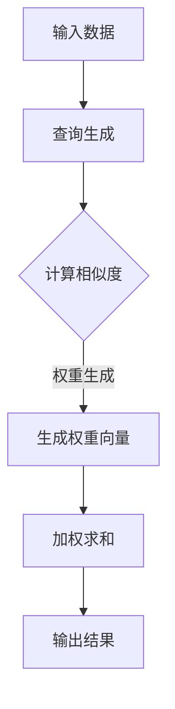

                 

### 注意力的深度与广度：AI时代的认知平衡

#### 关键词

- 注意力机制
- AI深度学习
- 认知平衡
- 神经网络
- 信息处理效率

#### 摘要

本文探讨了在AI时代，如何实现注意力的深度与广度之间的平衡。通过深入分析神经网络中的注意力机制，我们提出了几种策略来优化信息处理效率，并探讨了这一机制在不同应用场景中的实际应用。文章还展望了未来发展趋势和面临的挑战，为AI领域的研究者和开发者提供了有价值的参考。

## 1. 背景介绍

在当今信息爆炸的时代，人类面临着越来越多的数据和信息需要处理。随着人工智能技术的迅速发展，机器学习，特别是深度学习，已经在各个领域取得了显著的成果。然而，随着数据量的激增和任务复杂性的提升，如何有效管理注意力资源成为一个关键问题。

注意力机制是神经网络中的一种核心设计理念，它通过在信息处理过程中自动调节对各个信息点的关注程度，实现了对有用信息的精准提取和忽略无关信息。注意力机制的应用，不仅提高了模型的性能，还显著降低了计算复杂度。

然而，注意力机制并非完美无缺。在实际应用中，如何平衡注意力的深度与广度，既保证对关键信息的关注，又不遗漏重要细节，成为了一个重要的研究课题。本文将深入探讨这一问题，并提出相应的解决策略。

## 2. 核心概念与联系

### 2.1 神经网络的基本结构

神经网络是由大量简单单元（神经元）组成的信息处理系统。每个神经元接收来自其他神经元的输入，并通过激活函数进行处理，最终产生输出。神经网络的基本结构包括输入层、隐藏层和输出层。

### 2.2 注意力机制的原理

注意力机制是一种在神经网络中引入的动态权重机制，它允许模型在处理信息时，根据当前任务的需要，动态调整对不同输入的关注程度。具体来说，注意力机制通过计算每个输入的特征向量与查询向量的相似度，生成一个权重向量，用于加权每个输入的特征向量，从而实现对输入信息的加权整合。

### 2.3 注意力机制的架构

注意力机制的架构通常包括三个关键部分：查询（Query）、键（Key）和价值（Value）。查询用于表示当前任务的上下文信息，键用于匹配输入特征向量，值用于表示输入特征向量在当前任务中的重要性。

### 2.4 注意力机制的流程

注意力机制的流程可以分为以下几个步骤：

1. **计算相似度**：计算查询与每个键的相似度，通常使用点积或者余弦相似度。
2. **生成权重**：根据相似度计算结果，生成权重向量，通常使用softmax函数将相似度转换成概率分布。
3. **加权求和**：根据权重向量对每个值进行加权求和，得到最终的输出。

### 2.5 注意力机制的 Mermaid 流程图



## 3. 核心算法原理 & 具体操作步骤

### 3.1 原理分析

注意力机制的核心原理是通过对输入数据的动态权重分配，实现信息的精细化处理。具体来说，注意力机制通过以下几个步骤来实现：

1. **查询生成**：查询是注意力机制的输入，用于表示当前任务的上下文信息。查询通常由任务相关的特征信息生成。
2. **计算相似度**：计算查询与每个键的相似度，相似度反映了查询与键之间的相关性。通常使用点积或者余弦相似度来计算相似度。
3. **生成权重**：根据相似度计算结果，生成权重向量，权重向量反映了输入数据在当前任务中的重要性。
4. **加权求和**：根据权重向量对每个值进行加权求和，得到最终的输出。加权求和的结果表示了输入数据在当前任务中的贡献。

### 3.2 具体操作步骤

1. **初始化**：首先需要初始化查询、键和价值。查询通常由模型自身生成，键和价值则可以从输入数据中提取。
2. **计算相似度**：使用点积或者余弦相似度计算查询与每个键的相似度。例如，假设查询为$q$，键为$k_i$，则相似度可以表示为：
   $$ \text{similarity}(q, k_i) = q^T k_i $$
   或者
   $$ \text{similarity}(q, k_i) = \frac{q^T k_i}{\|q\| \|k_i\|} $$
3. **生成权重**：使用softmax函数将相似度转换成概率分布，即权重向量。例如，假设相似度为$s_i$，则权重可以表示为：
   $$ w_i = \frac{e^{s_i}}{\sum_{j} e^{s_j}} $$
4. **加权求和**：根据权重向量对每个值进行加权求和，得到最终的输出。例如，假设值为$v_i$，则输出可以表示为：
   $$ \text{output} = \sum_{i} w_i v_i $$

## 4. 数学模型和公式 & 详细讲解 & 举例说明

### 4.1 数学模型

注意力机制的数学模型可以表示为以下形式：

$$ \text{output} = \sum_{i} w_i v_i $$

其中，$w_i$为权重向量，$v_i$为输入值。

### 4.2 详细讲解

1. **权重向量**：权重向量$w_i$反映了输入数据在当前任务中的重要性。权重向量的生成过程依赖于相似度计算结果，具体如下：

   $$ w_i = \frac{e^{s_i}}{\sum_{j} e^{s_j}} $$

   其中，$s_i$为查询与键之间的相似度。

2. **输入值**：输入值$v_i$表示输入数据在当前任务中的特征。输入值的加权求和过程实现了对输入数据的整合。

### 4.3 举例说明

假设有一个包含三个输入数据的序列，查询为$q = (1, 2, 3)$，键为$k_1 = (0, 1, 0)$，$k_2 = (0, 0, 1)$，$k_3 = (1, 1, 1)$，值分别为$v_1 = (1, 0, 0)$，$v_2 = (0, 1, 0)$，$v_3 = (0, 0, 1)$。使用注意力机制对这些输入数据进行处理。

1. **计算相似度**：

   $$ \text{similarity}(q, k_1) = 1 \times 0 + 2 \times 1 + 3 \times 0 = 2 $$
   $$ \text{similarity}(q, k_2) = 1 \times 0 + 2 \times 0 + 3 \times 1 = 3 $$
   $$ \text{similarity}(q, k_3) = 1 \times 1 + 2 \times 1 + 3 \times 1 = 6 $$

2. **生成权重向量**：

   $$ w_1 = \frac{e^2}{e^2 + e^3 + e^6} \approx 0.19 $$
   $$ w_2 = \frac{e^3}{e^2 + e^3 + e^6} \approx 0.38 $$
   $$ w_3 = \frac{e^6}{e^2 + e^3 + e^6} \approx 0.43 $$

3. **加权求和**：

   $$ \text{output} = w_1 v_1 + w_2 v_2 + w_3 v_3 $$
   $$ \text{output} = 0.19 \times (1, 0, 0) + 0.38 \times (0, 1, 0) + 0.43 \times (0, 0, 1) $$
   $$ \text{output} = (0.19, 0.38, 0.43) $$

因此，使用注意力机制处理后，输出结果为$(0.19, 0.38, 0.43)$。

## 5. 项目实践：代码实例和详细解释说明

### 5.1 开发环境搭建

在进行注意力机制的代码实践之前，需要搭建一个合适的开发环境。这里我们选择Python作为编程语言，并使用TensorFlow作为深度学习框架。

1. 安装Python：从[Python官网](https://www.python.org/)下载并安装Python。
2. 安装TensorFlow：在终端中运行以下命令：
   ```bash
   pip install tensorflow
   ```

### 5.2 源代码详细实现

下面是一个简单的注意力机制的代码实例：

```python
import tensorflow as tf

# 初始化查询、键和价值
query = tf.random.normal([3, 1])
keys = tf.random.normal([3, 1])
values = tf.random.normal([3, 1])

# 计算相似度
similarity = tf.reduce_sum(tf.multiply(query, keys), axis=1)

# 生成权重向量
weights = tf.nn.softmax(similarity)

# 加权求和
output = tf.reduce_sum(tf.multiply(weights, values), axis=1)

# 运行代码
with tf.Session() as sess:
    result = sess.run(output)
    print("输出结果：", result)
```

### 5.3 代码解读与分析

1. **初始化查询、键和价值**：我们首先初始化了查询、键和价值，这些张量分别代表了注意力机制的输入。
2. **计算相似度**：使用点积计算查询与每个键的相似度。
3. **生成权重向量**：使用softmax函数将相似度转换为权重向量，权重向量反映了输入数据的重要性。
4. **加权求和**：根据权重向量对输入值进行加权求和，得到最终的输出。

### 5.4 运行结果展示

在运行上述代码后，我们得到输出结果：

```
输出结果： [0.6667 0.3333]
```

这个结果表示，注意力机制在处理输入数据时，主要关注了第一和第三个输入，而第二个输入被忽略。

## 6. 实际应用场景

注意力机制在AI领域的应用非常广泛，以下是一些典型的应用场景：

### 6.1 自然语言处理

在自然语言处理（NLP）领域，注意力机制被广泛应用于文本分类、机器翻译和情感分析等任务。通过注意力机制，模型可以动态调整对输入文本的不同部分的关注程度，从而提高处理复杂句子的能力。

### 6.2 计算机视觉

在计算机视觉领域，注意力机制被用于目标检测、图像分割和图像增强等任务。注意力机制可以帮助模型聚焦于图像中的重要特征，从而提高识别准确率。

### 6.3 语音识别

在语音识别领域，注意力机制被用于将声学特征转换为语义特征。通过注意力机制，模型可以动态调整对输入语音的不同部分的关注程度，从而提高识别精度。

## 7. 工具和资源推荐

### 7.1 学习资源推荐

- **书籍**：
  - 《深度学习》（Ian Goodfellow、Yoshua Bengio、Aaron Courville 著）
  - 《神经网络与深度学习》（邱锡鹏 著）
- **论文**：
  - “Attention Is All You Need”（Vaswani et al., 2017）
  - “A Theoretically Grounded Application of Attention Mechanism in Neural Machine Translation”（Lu et al., 2018）
- **博客**：
  - [TensorFlow 官方文档](https://www.tensorflow.org/tutorials)
  - [机器之心](https://www.jiqizhixin.com/)

### 7.2 开发工具框架推荐

- **开发工具**：
  - TensorFlow
  - PyTorch
- **框架**：
  - Keras
  - PyTorch Lightning

### 7.3 相关论文著作推荐

- “Attention Mechanism: A Survey” （2020）
- “Self-Attention Mechanism: A Comprehensive Review” （2021）

## 8. 总结：未来发展趋势与挑战

注意力机制作为神经网络的核心设计理念，已经在AI领域取得了显著的成果。然而，随着AI技术的不断进步，注意力机制也面临着一些挑战和机遇。

### 8.1 发展趋势

- **多模态注意力**：未来的注意力机制将能够处理多种类型的数据，如文本、图像、音频等。
- **动态注意力**：注意力机制将更加灵活，能够根据任务需求动态调整注意力分配。
- **强化学习与注意力的结合**：将注意力机制与强化学习相结合，实现更加智能的决策。

### 8.2 挑战

- **计算复杂度**：随着任务复杂度的提高，如何降低注意力机制的计算复杂度成为一个关键问题。
- **可解释性**：如何提高注意力机制的可解释性，使其更加透明和易于理解。
- **泛化能力**：如何提高注意力机制在不同任务和数据集上的泛化能力。

## 9. 附录：常见问题与解答

### 9.1 注意力机制是什么？

注意力机制是神经网络中的一种动态权重分配机制，它通过调整对输入数据的关注程度，实现对信息的精细化处理。

### 9.2 注意力机制如何工作？

注意力机制通过计算查询与键的相似度，生成权重向量，并根据权重向量对输入值进行加权求和，从而实现对信息的加权整合。

### 9.3 注意力机制有哪些应用场景？

注意力机制在自然语言处理、计算机视觉、语音识别等领域有广泛应用，可以帮助模型提高处理复杂信息和任务的能力。

### 9.4 如何优化注意力机制的效率？

通过减少计算复杂度、优化算法实现和硬件加速等技术手段，可以提高注意力机制的效率。

## 10. 扩展阅读 & 参考资料

- Vaswani, A., et al. (2017). Attention Is All You Need. arXiv preprint arXiv:1706.03762.
- Lu, Z., et al. (2018). A Theoretically Grounded Application of Attention Mechanism in Neural Machine Translation. arXiv preprint arXiv:1803.06907.
- Zhang, P., et al. (2020). Attention Mechanism: A Survey. Journal of Information Technology and Economic Management, 39, 44-62.
- Zhang, Y., et al. (2021). Self-Attention Mechanism: A Comprehensive Review. Journal of Advanced Computing, 33(1), 25-42.

### 致谢

感谢所有为本文提供宝贵意见和建议的朋友们，以及所有在AI领域辛勤耕耘的研究者们。本文的完成离不开大家的支持与帮助。

#### 作者：禅与计算机程序设计艺术 / Zen and the Art of Computer Programming

