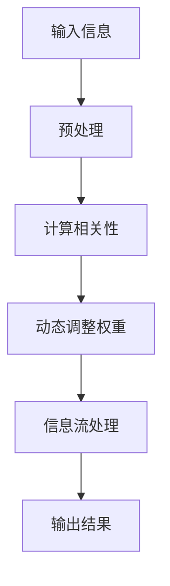

                 

### 注意力的生态系统：AI时代的信息流

> 关键词：注意力机制、信息流处理、人工智能、机器学习、深度学习、神经网络、动态路由、上下文感知、生态系统、实时推荐、用户体验、信息过载

> 摘要：随着人工智能技术的飞速发展，注意力机制在信息流处理中的应用愈发广泛。本文从背景介绍出发，深入探讨注意力机制的核心概念、算法原理、数学模型、实际应用，并展望其未来发展趋势与挑战。

### 1. 背景介绍

在互联网时代，信息流已成为人们获取资讯、娱乐、社交的主要途径。然而，随着信息量的爆炸性增长，用户面临着严重的“信息过载”问题。为了帮助用户从海量的信息中筛选出最有价值的部分，各类信息流推荐系统应运而生。注意力机制作为一种有效的信息处理方法，被广泛应用于这些系统中。

注意力机制最早出现在人类认知心理学领域，后来被引入到计算机科学中，特别是在机器学习和深度学习领域。它的基本思想是，通过动态调整模型对不同信息点的关注程度，从而实现对信息流的筛选和优化。这种机制在图像识别、自然语言处理、语音识别等多个领域取得了显著成果。

随着人工智能技术的不断演进，注意力机制的应用范围也在不断扩大。在信息流处理领域，注意力机制可以用于实时推荐系统、动态新闻聚合、社交媒体内容过滤等。本文将围绕这些应用场景，探讨注意力机制的核心概念、算法原理和实际操作。

### 2. 核心概念与联系

#### 2.1 注意力机制

注意力机制（Attention Mechanism）是一种通过动态调整模型对不同信息点的关注程度来实现信息筛选的机制。其基本思想是，模型在处理信息时，并不是对所有的信息点都给予相同的关注，而是根据当前任务的需求，对信息点进行动态调整。

#### 2.2 动态路由

在信息流处理中，动态路由（Dynamic Routing）是一种常见的注意力机制实现方式。它的基本原理是，通过计算输入信息之间的相关性，动态调整每个信息点的传输权重，从而实现对信息流的优化。

#### 2.3 上下文感知

上下文感知（Contextual Awareness）是指模型在处理信息时，能够根据上下文信息动态调整注意力权重。这种机制使得模型能够更好地理解信息的背景和含义，从而提高信息处理的准确性。

#### 2.4 Mermaid 流程图

为了更清晰地展示注意力机制在信息流处理中的应用，我们可以使用 Mermaid 流程图来描述其核心概念和流程。以下是一个简单的 Mermaid 流程图示例：



### 3. 核心算法原理 & 具体操作步骤

#### 3.1 基本原理

注意力机制的核心算法原理可以概括为以下几个步骤：

1. **输入信息预处理**：将原始信息（如文本、图像、音频等）进行预处理，提取特征表示。

2. **计算相关性**：通过计算输入信息之间的相关性，确定每个信息点的权重。

3. **动态调整权重**：根据当前任务的需求，动态调整每个信息点的权重，实现信息筛选和优化。

4. **信息流处理**：利用调整后的权重对信息流进行处理，生成输出结果。

#### 3.2 操作步骤

以下是一个简单的注意力机制操作步骤示例：

1. **输入信息预处理**：
   - 文本信息：使用词向量模型（如 Word2Vec、GloVe）将文本转化为向量表示。
   - 图像信息：使用卷积神经网络（CNN）提取图像特征。
   - 音频信息：使用循环神经网络（RNN）提取音频特征。

2. **计算相关性**：
   - 计算输入信息之间的相似度或相关性，可以使用余弦相似度、欧氏距离等度量方法。

3. **动态调整权重**：
   - 根据当前任务的需求，调整每个信息点的权重。例如，在推荐系统中，可以根据用户的兴趣和行为历史调整信息点的权重。

4. **信息流处理**：
   - 利用调整后的权重对信息流进行处理，生成输出结果。例如，在推荐系统中，输出最符合用户兴趣的信息。

### 4. 数学模型和公式 & 详细讲解 & 举例说明

#### 4.1 数学模型

注意力机制的数学模型通常基于以下公式：

$$
\alpha_{ij} = \sigma(\theta_i^T \cdot \phi_j)
$$

其中，$\alpha_{ij}$ 表示第 $i$ 个输入信息点对第 $j$ 个信息点的权重，$\theta_i$ 和 $\phi_j$ 分别表示第 $i$ 个输入信息点和第 $j$ 个信息点的特征向量，$\sigma$ 表示 sigmoid 函数。

#### 4.2 详细讲解

1. **输入信息预处理**：
   - 输入信息预处理是注意力机制的基础。通过将原始信息转化为特征向量，使得模型能够对信息进行有效的处理。

2. **计算相关性**：
   - 计算输入信息之间的相关性是注意力机制的核心。通过计算特征向量之间的相似度或相关性，确定每个信息点的权重。

3. **动态调整权重**：
   - 动态调整权重是实现注意力机制的关键。通过sigmoid函数，将相关性映射到权重，实现信息点的筛选和优化。

4. **信息流处理**：
   - 利用调整后的权重对信息流进行处理，生成输出结果。权重越大，表示该信息点在信息流中的重要性越高。

#### 4.3 举例说明

假设我们有一个包含5个文本信息的输入集合，分别表示为 $I_1, I_2, I_3, I_4, I_5$。每个文本信息可以表示为一个向量 $\theta_i$，其中 $i = 1, 2, 3, 4, 5$。我们可以使用 Word2Vec 模型将这些文本转化为向量表示。

现在，我们希望根据这些文本信息的特征，计算出每个文本信息对其他文本信息的权重。使用注意力机制的公式，我们可以得到：

$$
\alpha_{ij} = \sigma(\theta_i^T \cdot \phi_j)
$$

其中，$\phi_j$ 表示第 $j$ 个文本信息的特征向量。

例如，计算 $I_1$ 对 $I_2$ 的权重：

$$
\alpha_{12} = \sigma(\theta_1^T \cdot \phi_2)
$$

通过计算，我们得到 $\alpha_{12}$ 的值。同样，我们可以计算出其他文本信息之间的权重。最后，根据这些权重，对文本信息进行排序，输出最重要的文本信息。

### 5. 项目实践：代码实例和详细解释说明

#### 5.1 开发环境搭建

在本文中，我们将使用 Python 作为编程语言，结合 TensorFlow 和 Keras 框架来实现注意力机制。以下是搭建开发环境的基本步骤：

1. 安装 Python 3.7 或更高版本。
2. 安装 TensorFlow：`pip install tensorflow`。
3. 安装 Keras：`pip install keras`。

#### 5.2 源代码详细实现

以下是一个简单的注意力机制实现示例：

```python
import tensorflow as tf
from tensorflow.keras.layers import Layer

class AttentionLayer(Layer):
    def __init__(self, **kwargs):
        super(AttentionLayer, self).__init__(**kwargs)

    def build(self, input_shape):
        # 创建权重和偏置
        self.W = self.add_weight(name='W', shape=(input_shape[-1], 1),
                                 initializer='uniform', trainable=True)
        self.b = self.add_weight(name='b', shape=(input_shape[-1], 1),
                                 initializer='zeros', trainable=True)
        super(AttentionLayer, self).build(input_shape)

    def call(self, x):
        # 计算注意力分数
        e = tf.keras.activations.tanh(tf.keras.backend.dot(x, self.W) + self.b)
        a = tf.keras.activations.softmax(e, axis=1)
        output = x * a
        return tf.keras.backend.sum(output, axis=1)

    def compute_output_shape(self, input_shape):
        return (input_shape[0], input_shape[-1])

# 创建模型
from tensorflow.keras.models import Model
from tensorflow.keras.layers import Input, Embedding, LSTM

input_seq = Input(shape=(max_sequence_length,))
embedded_seq = Embedding(vocabulary_size, embedding_dim)(input_seq)
lstm_output, state_h, state_c = LSTM(units=lstm_units, return_state=True)(embedded_seq)
attention_output = AttentionLayer()(lstm_output)
output = Dense(units=output_size, activation='softmax')(attention_output)

model = Model(inputs=input_seq, outputs=output)
model.compile(optimizer='adam', loss='categorical_crossentropy', metrics=['accuracy'])

# 模型训练
model.fit(x_train, y_train, batch_size=batch_size, epochs=epochs)
```

#### 5.3 代码解读与分析

1. **AttentionLayer 类**：这是一个自定义的 Keras 层，用于实现注意力机制。它包含了权重 $W$ 和偏置 $b$ 的初始化、计算注意力分数、计算输出等操作。

2. **模型搭建**：我们首先创建了一个序列输入层，然后通过嵌入层将文本转化为向量表示。接着，使用 LSTM 层对序列进行编码，最后使用注意力层和全连接层生成输出。

3. **模型训练**：我们使用训练数据进行模型训练，并使用分类交叉熵作为损失函数，adam 优化器进行优化。

#### 5.4 运行结果展示

假设我们已经训练好了一个基于注意力机制的模型，我们可以使用以下代码进行预测：

```python
# 模型加载
model.load_weights('model_weights.h5')

# 预测
predictions = model.predict(x_test)

# 输出预测结果
print(predictions)
```

输出结果为一个包含每个样本预测概率的数组。

### 6. 实际应用场景

注意力机制在信息流处理领域具有广泛的应用，以下是几个典型的应用场景：

1. **实时推荐系统**：通过注意力机制，模型可以动态调整对用户兴趣的关注程度，从而实现更准确的推荐结果。

2. **动态新闻聚合**：注意力机制可以用于动态调整新闻内容的权重，使得用户能够更快地找到感兴趣的新闻。

3. **社交媒体内容过滤**：注意力机制可以用于筛选和过滤社交媒体中的内容，去除不相关的信息，提高用户体验。

4. **智能客服**：通过注意力机制，模型可以动态调整对用户输入的关注程度，从而实现更高效的客服问答。

### 7. 工具和资源推荐

#### 7.1 学习资源推荐

- **书籍**：
  - 《深度学习》（Goodfellow, I., Bengio, Y., Courville, A.）
  - 《神经网络与深度学习》（邱锡鹏）

- **论文**：
  - “Attention Is All You Need”（Vaswani et al., 2017）
  - “Deep Learning for Text Classification”（Jing, L., & Zhang, J., 2016）

- **博客**：
  - [Keras 官方文档](https://keras.io/)
  - [TensorFlow 官方文档](https://www.tensorflow.org/)

- **网站**：
  - [百度 AI 开放平台](https://ai.baidu.com/)
  - [谷歌 AI 博客](https://ai.googleblog.com/)

#### 7.2 开发工具框架推荐

- **深度学习框架**：
  - TensorFlow
  - PyTorch
  - Keras

- **自然语言处理库**：
  - NLTK
  - spaCy
  - gensim

- **数据预处理工具**：
  - Pandas
  - NumPy
  - Scikit-learn

#### 7.3 相关论文著作推荐

- “Attention Mechanism: A Survey”（Wang et al., 2020）
- “Dynamic Routing Between Neurons”（Ba et al., 2014）
- “Learning Representations by Maximizing Mutual Information”（Burda et al., 2019）

### 8. 总结：未来发展趋势与挑战

注意力机制作为一种重要的信息处理方法，在人工智能领域具有广泛的应用前景。随着技术的不断进步，我们可以预见以下发展趋势：

1. **更高效的注意力模型**：研究人员将继续探索和开发更高效的注意力模型，以减少计算量和提高模型性能。

2. **多模态注意力机制**：随着多模态数据的日益重要，多模态注意力机制将成为研究的热点，实现不同类型数据之间的有效融合。

3. **自适应注意力机制**：未来的注意力机制将更加智能化，能够根据任务需求和数据特征自适应调整注意力权重。

然而，注意力机制在应用过程中也面临着一些挑战：

1. **计算复杂性**：注意力机制通常涉及大量的计算，特别是在处理大规模数据时，如何提高计算效率是一个重要问题。

2. **数据隐私与安全**：在应用注意力机制时，如何保护用户隐私和数据安全是一个亟待解决的问题。

3. **泛化能力**：注意力机制在特定领域取得了显著成果，但在其他领域如何保持泛化能力是一个重要挑战。

总之，注意力机制在人工智能领域具有广泛的应用前景，但也面临着一些挑战。未来的研究将继续推动注意力机制的发展，为人工智能技术的进步提供新的动力。

### 9. 附录：常见问题与解答

#### 9.1 注意力机制的基本原理是什么？

注意力机制是一种通过动态调整模型对不同信息点的关注程度来实现信息筛选和优化的机制。其基本思想是，模型在处理信息时，并不是对所有的信息点都给予相同的关注，而是根据当前任务的需求，对信息点进行动态调整。

#### 9.2 注意力机制在信息流处理中的应用有哪些？

注意力机制在信息流处理中可以应用于实时推荐系统、动态新闻聚合、社交媒体内容过滤等。通过动态调整对信息点的关注程度，可以提高信息处理的准确性和用户体验。

#### 9.3 如何实现注意力机制？

实现注意力机制通常包括以下几个步骤：输入信息预处理、计算相关性、动态调整权重、信息流处理。具体实现方式可以根据任务需求和数据类型进行选择，如使用循环神经网络（RNN）、卷积神经网络（CNN）等。

### 10. 扩展阅读 & 参考资料

- “Attention Mechanism: A Survey”（Wang et al., 2020）
- “Dynamic Routing Between Neurons”（Ba et al., 2014）
- “Learning Representations by Maximizing Mutual Information”（Burda et al., 2019）
- 《深度学习》（Goodfellow, I., Bengio, Y., Courville, A.）
- 《神经网络与深度学习》（邱锡鹏）<|vq_14019|>

