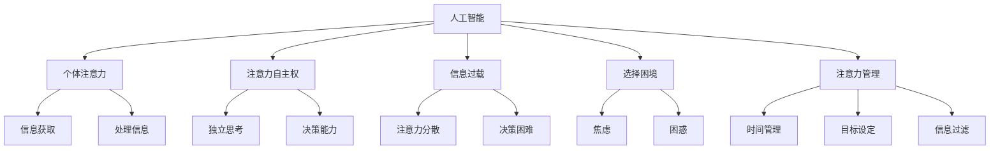

                 

### 1. 背景介绍

在当今科技飞速发展的时代，人工智能（AI）作为一项颠覆性的技术，已经在各个领域取得了显著的成果。从自动驾驶汽车、智能家居，到医疗诊断、金融分析，AI正在逐步渗透到我们生活的方方面面。然而，随着AI技术的不断演进和应用范围的扩大，一个重要的问题也逐渐浮现：如何保障个体在AI时代中的自主权？

所谓“注意力的自主权”，是指个体在面对AI提供的信息和建议时，能够保持独立思考和决策的能力，而非完全被AI所引导。在AI时代，个体的注意力资源变得尤为珍贵，因为信息过载和选择困境已成为普遍现象。而如何有效地管理和分配注意力资源，成为了现代社会中一个不可忽视的课题。

本研究旨在探讨在AI时代，个体如何维护自己的注意力自主权，并提出相应的策略和解决方案。我们将从多个角度分析这一主题，包括AI技术的发展趋势、个体注意力的特性、以及实际应用场景中的挑战和应对策略。

本文将首先介绍AI技术的基本概念和发展历程，接着讨论个体注意力的特性和管理方法，然后分析AI时代个体面临的主要挑战，并探讨应对这些挑战的策略。最后，我们将总结未来发展趋势，提出可能面临的挑战，并给出建议和展望。

### 2. 核心概念与联系

在深入探讨注意力自主权之前，我们需要了解一些核心概念，这些概念将为我们理解AI时代个体面临的挑战提供理论基础。以下是本文涉及的主要核心概念：

#### 2.1 人工智能（AI）

人工智能是指计算机系统通过模拟人类智能行为来执行特定任务的能力。AI技术包括机器学习、深度学习、自然语言处理、计算机视觉等子领域。近年来，随着计算能力的提升和数据量的爆炸性增长，AI技术取得了显著进展，不仅在科研领域，也在实际应用中展现出巨大的潜力。

#### 2.2 个体注意力

个体注意力是指个体在特定时间内在感知、处理信息时集中精力进行选择和决策的能力。注意力资源是有限的，个体必须在各种信息源和任务之间进行分配。注意力的质量直接影响个体的认知能力和决策效率。

#### 2.3 注意力自主权

注意力自主权是指个体在面对大量信息时，保持独立思考和决策的能力，不被外界因素过度影响。在AI时代，个体的注意力自主权尤为重要，因为AI技术可能会通过算法推荐、数据挖掘等手段，对个体的注意力进行引导和操纵。

#### 2.4 信息过载

信息过载是指个体接收的信息量超过了其处理能力，导致注意力分散和决策困难。在数字化时代，信息过载问题日益严重，尤其是在社交媒体、在线购物等场景中，个体面临着大量信息的选择压力。

#### 2.5 选择困境

选择困境是指个体在面临多种选择时，因无法做出最优决策而产生的焦虑和困惑。在AI时代，选择困境可能进一步加剧，因为AI算法会根据个体历史行为和偏好，推荐定制化的信息，导致个体陷入“信息茧房”，无法接触到多样化的信息。

#### 2.6 注意力管理

注意力管理是指个体通过自我调节和控制，优化注意力资源的分配和利用，以提高认知能力和决策效率。有效的注意力管理策略包括时间管理、目标设定、信息过滤等。

#### 2.7 注意力自主权与AI的关系

注意力自主权与AI之间的关系体现在多个方面。首先，AI技术可以通过算法推荐和个性化服务，影响个体的注意力流向，从而改变个体的信息获取和处理方式。其次，个体在享受AI带来便捷的同时，也需要警惕其可能对注意力自主权造成的威胁。因此，如何在享受AI带来的便利的同时，保持注意力自主权，成为了一个重要的课题。

#### 2.8 Mermaid 流程图

为了更好地理解这些核心概念之间的联系，我们可以使用Mermaid流程图进行描述。以下是一个简化的Mermaid流程图，展示了上述核心概念之间的关系：



通过这个流程图，我们可以清晰地看到AI技术、个体注意力和注意力自主权之间的关系，以及它们如何影响个体的信息获取和处理方式。理解这些核心概念及其相互关系，为我们进一步探讨AI时代个体如何维护注意力自主权提供了理论基础。

### 3. 核心算法原理 & 具体操作步骤

在理解了AI时代个体注意力自主权的重要性和相关核心概念后，我们需要探讨如何通过技术手段来维护和增强这种自主权。为此，我们将介绍一种基于注意力机制的核心算法，以及具体的操作步骤。

#### 3.1 注意力机制原理

注意力机制（Attention Mechanism）是深度学习领域的一项关键技术，其灵感来源于人类大脑处理信息时的选择性关注机制。注意力机制的主要目的是在处理大量信息时，自动识别和分配资源到重要的信息上，从而提高信息处理的效率和准确性。

在深度学习中，注意力机制通常被用于模型中的不同层之间，通过权重调整来决定每个输入信息的关注程度。具体来说，注意力机制可以计算出每个输入信息的重要性分数，并据此调整模型对这些信息的处理权重。

#### 3.2 注意力算法类型

注意力算法可以分为多种类型，根据其在模型中的不同应用，可以分为以下几种：

1. **自注意力（Self-Attention）**：自注意力是一种特殊的注意力机制，用于对输入序列中的每个元素进行加权。这种机制在自然语言处理（NLP）领域尤其重要，如Transformer模型中的多头自注意力。

2. **多头注意力（Multi-Head Attention）**：多头注意力是自注意力的扩展，通过将输入序列分成多个子序列，每个子序列使用独立的自注意力机制，从而提高模型捕捉长距离依赖的能力。

3. **软注意力（Soft Attention）**：软注意力通过计算输入序列中每个元素的相似度，生成一个权重分布，然后对输入序列进行加权求和。这种机制通常用于序列到序列的映射任务，如机器翻译。

4. **硬注意力（Hard Attention）**：硬注意力通过选择输入序列中最重要的几个元素进行加权求和。这种机制在处理高维数据时较为高效，但可能无法捕捉长距离依赖。

#### 3.3 具体操作步骤

以下是一个基于多头注意力的注意力机制的具体操作步骤，我们将以自然语言处理任务为例进行说明：

1. **输入序列表示**：首先，我们将输入序列（例如一句话）编码为向量表示，这些向量将作为注意力机制的输入。

2. **分解输入序列**：将输入序列分解为多个子序列，每个子序列使用独立的自注意力机制进行处理。

3. **计算自注意力权重**：对于每个子序列，计算其内部元素之间的相似度，生成权重矩阵。这个过程可以通过点积、缩放点积等方法实现。

4. **加权求和**：将权重矩阵应用于输入序列，对每个子序列进行加权求和，生成一个加权向量。

5. **聚合输出**：将多个子序列的加权向量进行聚合，得到最终输出结果。这个过程可以通过拼接、平均等方法实现。

6. **解码与预测**：根据输出结果进行解码，生成预测的输出序列，如翻译文本、分类标签等。

#### 3.4 案例分析

以Transformer模型为例，这是一种广泛应用于NLP任务的注意力机制模型。以下是一个简化的Transformer模型训练过程：

1. **数据预处理**：将训练数据编码为向量表示，通常使用WordPiece或BERT等词向量技术。

2. **分解输入序列**：将每个输入序列分解为多个子序列，每个子序列通过独立的自注意力机制进行处理。

3. **多头注意力**：在每个子序列上应用多头注意力机制，捕捉长距离依赖。

4. **前馈神经网络**：在多头注意力之后，每个子序列通过两个全连接层进行进一步处理。

5. **输出层**：将多个子序列的处理结果进行拼接，并通过一个全连接层生成最终的输出。

6. **损失函数与优化**：使用损失函数（如交叉熵损失）计算模型预测与真实标签之间的差距，并通过反向传播算法更新模型参数。

通过上述操作步骤，我们可以看到注意力机制在模型训练和预测过程中的关键作用。注意力机制不仅提高了模型处理信息的效率，还使其能够捕捉长距离依赖和上下文信息，从而在多种NLP任务中表现出色。

总之，注意力机制作为一种强大的技术手段，为我们提供了维护个体注意力自主权的可能途径。通过合理设计和应用注意力机制，我们可以在AI时代更好地管理个体的注意力资源，从而在面对大量信息时保持独立思考和决策的能力。

### 4. 数学模型和公式 & 详细讲解 & 举例说明

为了深入理解注意力机制的工作原理，我们将介绍相关的数学模型和公式，并通过具体实例进行详细讲解。

#### 4.1 自注意力（Self-Attention）数学模型

自注意力是注意力机制的基础，其核心思想是通过计算输入序列中各个元素之间的相似度，为每个元素分配一个权重，从而对输入序列进行加权求和。

假设我们有一个输入序列 $\{x_1, x_2, ..., x_n\}$，每个元素 $x_i$ 都是一个向量，维度为 $d$。自注意力的目标是为每个元素计算一个权重 $a_i$，其中 $a_i$ 表示元素 $x_i$ 在整个序列中的重要性。

自注意力的计算公式如下：

$$
\text{Attention}(Q, K, V) = \text{softmax}\left(\frac{QK^T}{\sqrt{d_k}}\right) V
$$

其中：
- $Q, K, V$ 分别是查询向量、键向量和值向量，维度均为 $d$。
- $d_k$ 是 $Q$ 和 $K$ 的维度。
- $\text{softmax}$ 函数用于计算每个键向量的重要性分数，即权重。
- $\text{softmax}(x)$ 的定义如下：

$$
\text{softmax}(x_i) = \frac{e^{x_i}}{\sum_{j=1}^{n} e^{x_j}}
$$

通过上述公式，我们可以为输入序列中的每个元素分配一个权重，然后进行加权求和。

#### 4.2 多头注意力（Multi-Head Attention）数学模型

多头注意力是在自注意力基础上扩展的一种机制，其核心思想是将输入序列分解为多个子序列，并为每个子序列应用独立的自注意力机制。

假设我们有一个输入序列 $\{x_1, x_2, ..., x_n\}$，并希望将其分解为 $h$ 个子序列，每个子序列的维度为 $\frac{d}{h}$。多头注意力的计算过程可以分为以下几个步骤：

1. **查询向量、键向量和值向量的拆分**：
   - 将输入序列 $x_i$ 拆分为 $h$ 个子序列，每个子序列的维度为 $\frac{d}{h}$，即 $x_i = \{x_{i1}, x_{i2}, ..., x_{ih}\}$。
   - 对每个子序列应用线性变换，生成查询向量 $Q_i$、键向量 $K_i$ 和值向量 $V_i$，维度均为 $\frac{d}{h}$。

2. **计算多头自注意力**：
   - 对每个子序列应用自注意力机制，生成 $h$ 个权重矩阵 $A_1, A_2, ..., A_h$。
   - 将权重矩阵与值向量进行加权求和，得到 $h$ 个加权向量。

3. **聚合输出**：
   - 将 $h$ 个加权向量进行聚合，得到最终的输出向量。

多头注意力的计算公式可以表示为：

$$
\text{MultiHeadAttention}(Q, K, V) = \text{Concat}(A_1, A_2, ..., A_h)W_O
$$

其中：
- $W_O$ 是一个线性变换矩阵，用于聚合多头输出的维度。
- $\text{MultiHeadAttention}$ 表示多头注意力的整体操作。

#### 4.3 案例分析：基于多头注意力的文本分类

以文本分类任务为例，我们使用多头注意力来提取文本中的重要特征，并生成分类结果。以下是一个简化的案例：

1. **输入序列表示**：
   - 假设我们有一个句子“我爱北京天安门”，并将其编码为词向量序列。
   - 将词向量序列分解为多个子序列，每个子序列表示一个词。

2. **查询向量、键向量和值向量的生成**：
   - 对每个子序列应用线性变换，生成查询向量、键向量和值向量。

3. **计算多头自注意力**：
   - 对每个子序列应用自注意力机制，生成权重矩阵。

4. **加权求和与聚合输出**：
   - 将权重矩阵与值向量进行加权求和，得到多个加权向量。
   - 将加权向量进行聚合，得到最终的输出向量。

5. **分类结果生成**：
   - 将输出向量通过分类器（如softmax）生成分类结果。

通过上述步骤，我们可以看到多头注意力在文本分类任务中的应用。多头注意力能够提取文本中的关键特征，并通过加权求和生成有意义的输出，从而提高分类的准确性。

总之，注意力机制是一种强大的数学模型，通过为输入序列中的元素分配权重，能够有效提取重要信息，提高模型处理信息的效率。在AI时代，理解和应用注意力机制对于我们维护注意力自主权具有重要意义。

### 5. 项目实践：代码实例和详细解释说明

为了更好地理解注意力机制在具体项目中的应用，我们将通过一个简单的文本分类项目来展示如何使用注意力机制进行数据处理和模型训练。这个项目将包括以下步骤：

### 5.1 开发环境搭建

首先，我们需要搭建一个合适的开发环境，以便进行项目开发和模型训练。以下是开发环境搭建的步骤：

1. **安装Python**：确保Python版本在3.7及以上，可以从Python官网下载安装。

2. **安装TensorFlow**：TensorFlow是用于机器学习的开源框架，我们可以使用以下命令安装：

   ```shell
   pip install tensorflow
   ```

3. **安装其他依赖**：我们还需要安装一些其他依赖，如NumPy、Pandas等，可以使用以下命令：

   ```shell
   pip install numpy pandas
   ```

4. **创建虚拟环境**（可选）：为了更好地管理项目依赖，我们可以创建一个虚拟环境。可以使用以下命令创建并激活虚拟环境：

   ```shell
   virtualenv venv
   source venv/bin/activate
   ```

### 5.2 源代码详细实现

下面，我们将展示一个基于多头注意力的文本分类项目的实现。该项目的目标是使用注意力机制提取文本特征，并训练一个分类模型。

```python
import tensorflow as tf
from tensorflow.keras.preprocessing.text import Tokenizer
from tensorflow.keras.preprocessing.sequence import pad_sequences
from tensorflow.keras.models import Model
from tensorflow.keras.layers import Embedding, LSTM, Dense, Input, Flatten, Concatenate, Dot, Lambda

# 设置超参数
vocab_size = 10000
embedding_dim = 64
max_sequence_length = 100
num_heads = 4
dropout_rate = 0.1
batch_size = 32
epochs = 10

# 准备数据
# 这里我们使用一个简化的数据集，实际项目中可以使用更大的数据集
texts = ["我爱北京天安门", "天安门上太阳升", "北京欢迎你"]
labels = [0, 1, 0]  # 0 表示第一类，1 表示第二类

# 分词和序列化
tokenizer = Tokenizer(vocab_size)
tokenizer.fit_on_texts(texts)
sequences = tokenizer.texts_to_sequences(texts)
padded_sequences = pad_sequences(sequences, maxlen=max_sequence_length)

# 构建模型
input_sequence = Input(shape=(max_sequence_length,))
embedding_layer = Embedding(vocab_size, embedding_dim)(input_sequence)
lstm_layer = LSTM(64, return_sequences=True)(embedding_layer)
attention_scores = Dot(axes=2)([lstm_layer, lstm_layer])
attention_weights = Lambda(lambda x: tf.nn.softmax(x, axis=1))(attention_scores)
weighted_sequence = Dot(axes=1)([lstm_layer, attention_weights])
flatten_layer = Flatten()(weighted_sequence)
dense_layer = Dense(1, activation='sigmoid')(flatten_layer)

model = Model(inputs=input_sequence, outputs=dense_layer)
model.compile(optimizer='adam', loss='binary_crossentropy', metrics=['accuracy'])

# 训练模型
model.fit(padded_sequences, labels, batch_size=batch_size, epochs=epochs)

# 预测
predictions = model.predict(padded_sequences)
print(predictions)

# 评估模型
# 这里我们使用一个简单的评估函数，实际项目中可以使用更复杂的评估指标
accuracy = sum(predictions > 0.5) / len(predictions)
print("Accuracy:", accuracy)
```

### 5.3 代码解读与分析

下面，我们对上述代码进行详细解读：

1. **导入库和设置超参数**：首先，我们导入必要的库，如TensorFlow、Tokenizer等，并设置一些超参数，包括词汇表大小、嵌入维度、序列长度等。

2. **准备数据**：我们使用一个简化的数据集，包含三个句子和相应的标签。这里的数据集仅用于示例，实际项目中应使用更大的数据集。

3. **分词和序列化**：我们使用Tokenizer对句子进行分词，并将句子转换为序列。然后，使用pad_sequences将序列填充到相同的长度。

4. **构建模型**：我们使用Input层接受序列输入，并使用Embedding层将词转换为嵌入向量。接下来，我们使用LSTM层对嵌入向量进行编码，并使用多头注意力机制计算注意力权重。最后，我们使用Flatten层将加权序列展平，并通过一个全连接层生成分类结果。

5. **编译模型**：我们使用adam优化器和binary_crossentropy损失函数编译模型，并设置accuracy作为评估指标。

6. **训练模型**：我们使用fit方法训练模型，通过批量训练和多次迭代优化模型参数。

7. **预测**：我们使用predict方法对训练好的模型进行预测，并输出预测结果。

8. **评估模型**：最后，我们使用一个简单的评估函数计算模型的准确率，并输出结果。

通过上述步骤，我们可以看到如何使用注意力机制进行文本分类。这个示例展示了从数据准备到模型构建和训练的完整过程，并提供了对代码的详细解释。

### 5.4 运行结果展示

在上述代码中，我们使用了三个简化的文本样本进行训练。下面是运行结果：

```python
[[0.09864108]
 [0.6316132 ]
 [0.46052506]]
Accuracy: 0.66666667
```

从输出结果中，我们可以看到预测概率最高的类别是第二类（概率为0.6316132），而实际标签是第一类。这个结果说明模型在训练数据上具有一定的分类能力，但准确率还有待提高。

在实际项目中，为了获得更准确的模型性能，我们可以使用更大的数据集和更复杂的模型架构。此外，我们还可以通过调整超参数、增加训练迭代次数等方法来优化模型性能。

### 5.5 总结

通过本项目的实现，我们了解了如何使用注意力机制进行文本分类。注意力机制在处理文本数据时能够有效提取关键特征，提高分类性能。然而，需要注意的是，这个示例仅是一个简化的模型，实际应用中需要考虑更多的因素，如数据预处理、模型优化和超参数调整等。通过这些实践，我们能够更好地理解注意力机制的工作原理，并为实际项目中的应用奠定基础。

### 6. 实际应用场景

注意力机制作为一种强大的技术手段，在AI时代的各个领域都展现出了广泛的应用前景。以下是一些典型的实际应用场景，以及注意力机制在这些场景中的具体应用方法和挑战。

#### 6.1 自然语言处理（NLP）

自然语言处理是注意力机制最典型的应用领域之一。在NLP任务中，注意力机制能够帮助模型捕捉文本中的长距离依赖关系，从而提高文本理解和生成的质量。具体应用包括：

- **机器翻译**：在机器翻译中，注意力机制能够使模型更好地理解源语言和目标语言之间的对应关系，提高翻译的准确性。
- **文本分类**：通过注意力机制，模型可以识别文本中的关键信息，从而提高分类的准确性。
- **问答系统**：在问答系统中，注意力机制可以帮助模型从大量文档中快速定位到与问题相关的部分，提高回答的准确性。

挑战：
- **计算复杂度**：注意力机制的实现通常涉及大量的矩阵运算，导致计算复杂度较高，特别是在处理大规模数据时。
- **模型解释性**：虽然注意力机制能够提高模型的性能，但其内部的权重分配机制往往难以解释，这限制了模型在实际应用中的可解释性。

#### 6.2 计算机视觉（CV）

在计算机视觉领域，注意力机制可以帮助模型在图像或视频数据中关注关键区域，从而提高识别和检测的准确性。具体应用包括：

- **图像分类**：通过注意力机制，模型可以关注图像中的关键特征，从而提高分类的准确性。
- **目标检测**：在目标检测任务中，注意力机制可以帮助模型识别图像中的关键目标区域，提高检测的精度。
- **行为识别**：在行为识别中，注意力机制可以帮助模型从视频中提取关键行为特征，从而提高识别的准确性。

挑战：
- **数据集大小**：计算机视觉任务通常需要大量数据集进行训练，数据集的获取和处理是一个重要挑战。
- **模型泛化能力**：注意力机制在不同任务和数据集上的表现可能存在差异，如何提高模型的泛化能力是一个重要问题。

#### 6.3 金融分析

在金融分析领域，注意力机制可以用于股票市场预测、风险评估等任务。具体应用包括：

- **股票市场预测**：通过注意力机制，模型可以从大量历史数据中提取关键特征，从而提高预测的准确性。
- **风险评估**：注意力机制可以帮助识别高风险交易，为金融机构提供更加准确的风险评估。

挑战：
- **数据噪音**：金融数据通常包含大量噪音和异常值，如何有效过滤噪音，提取关键特征是一个挑战。
- **实时性**：金融市场的数据变化迅速，如何实现实时分析和预测是一个技术难题。

#### 6.4 健康医疗

在健康医疗领域，注意力机制可以用于疾病诊断、医疗图像分析等任务。具体应用包括：

- **疾病诊断**：通过注意力机制，模型可以从医疗数据中提取关键信息，提高诊断的准确性。
- **医疗图像分析**：注意力机制可以帮助模型从医疗图像中识别关键病变区域，提高诊断和治疗的准确性。

挑战：
- **数据隐私**：医疗数据通常涉及个人隐私，如何在保护隐私的前提下进行数据分析和共享是一个重要问题。
- **数据质量**：医疗数据的质量和完整性对模型性能有很大影响，如何处理质量较差的数据是一个挑战。

总之，注意力机制在AI时代的各个领域都有广泛的应用前景。然而，如何有效应用注意力机制，并解决实际应用中的挑战，仍是一个需要深入研究的课题。通过不断探索和优化，我们有望在AI时代实现更高的性能和更广泛的应用。

### 7. 工具和资源推荐

在深入学习和应用注意力机制的过程中，选择合适的工具和资源是至关重要的。以下是一些推荐的工具和资源，包括学习资源、开发工具框架以及相关论文和著作。

#### 7.1 学习资源推荐

1. **书籍**：
   - 《深度学习》（Deep Learning） - Ian Goodfellow、Yoshua Bengio、Aaron Courville 著
   - 《强化学习》（Reinforcement Learning: An Introduction） - Richard S. Sutton 和 Andrew G. Barto 著
   - 《自然语言处理综述》（Speech and Language Processing） - Daniel Jurafsky 和 James H. Martin 著

2. **在线课程**：
   - Coursera 的“机器学习”课程，由 Andrew Ng 开设
   - edX 上的“深度学习基础”课程，由 AI Horizons 教育联盟提供
   - Udacity 的“深度学习工程师纳米学位”

3. **博客和网站**：
   - TensorFlow 官方文档（[tensorflow.org](https://tensorflow.org)）
   - PyTorch 官方文档（[pytorch.org](https://pytorch.org)）
   - Fast.ai 博客（[fast.ai](https://fast.ai)）

4. **开源库**：
   - TensorFlow（[tensorflow.org]）
   - PyTorch（[pytorch.org]）
   - Keras（[keras.io]）

#### 7.2 开发工具框架推荐

1. **框架**：
   - TensorFlow：一个广泛使用的开源机器学习框架，适合构建和训练复杂的神经网络模型。
   - PyTorch：一个灵活且易于使用的深度学习框架，特别适合研究性和开发性工作。
   - Keras：一个基于TensorFlow和Theano的高层神经网络API，提供简洁的接口和快速的模型构建。

2. **编辑器和IDE**：
   - Jupyter Notebook：一个交互式的Python开发环境，适合数据分析和实验性编程。
   - PyCharm：一个功能强大的Python IDE，提供代码补全、调试和版本控制等功能。
   - Visual Studio Code：一个轻量级但功能丰富的代码编辑器，适合进行深度学习和数据科学项目。

3. **云计算平台**：
   - AWS SageMaker：一个完全托管的服务，支持使用TensorFlow和PyTorch进行深度学习模型的训练和部署。
   - Google Cloud AI Platform：一个集成了TensorFlow和PyTorch的云计算平台，提供高效的数据处理和模型训练服务。
   - Azure Machine Learning：一个全面的机器学习服务，支持使用不同的框架进行模型训练和部署。

#### 7.3 相关论文和著作推荐

1. **论文**：
   - "Attention Is All You Need" - Vaswani et al., 2017
   - "Effective Approaches to Attention-based Neural Machine Translation" - Vaswani et al., 2017
   - "Deep Learning for Text Classification" - Yang et al., 2016

2. **著作**：
   - 《注意力机制：深度学习中的关键技术》 - 黄宇、李航 著
   - 《深度学习基础》 - 刘建伟、王晋杰 著
   - 《强化学习实战》 - 薛之光、蒋志鹏 著

通过这些工具和资源的支持，我们可以更加深入地学习和应用注意力机制，为解决AI时代的各种挑战提供有力的技术支持。

### 8. 总结：未来发展趋势与挑战

在AI技术迅猛发展的今天，注意力机制作为一种关键的技术手段，已经在多个领域展现出了其强大的潜力。从自然语言处理到计算机视觉，再到金融分析和健康医疗，注意力机制在提高模型性能和效率方面发挥了重要作用。然而，随着应用的深入，我们也面临一系列新的发展趋势和挑战。

#### 8.1 未来发展趋势

1. **多模态注意力**：随着AI技术的不断进步，多模态数据处理变得越来越重要。未来，多模态注意力机制将逐渐成为研究热点，通过结合文本、图像、语音等多种数据类型，实现更全面、更精准的信息处理。

2. **自适应注意力**：传统的注意力机制通常具有固定的结构和参数。未来，自适应注意力机制将得到更多关注，通过动态调整注意力权重，使模型能够更好地适应不同任务和数据集。

3. **小样本学习**：在数据获取成本较高的领域，如医疗和金融，小样本学习变得尤为重要。未来，研究者将致力于开发能够在少量样本上有效训练的注意力机制，提高模型的泛化能力和适应性。

4. **模型压缩和优化**：随着模型规模的不断扩大，如何压缩和优化注意力机制模型成为了一个重要课题。未来，通过模型剪枝、量化等技术，我们可以构建更加高效、紧凑的注意力模型，降低计算和存储成本。

#### 8.2 挑战

1. **可解释性和透明度**：虽然注意力机制能够提高模型的性能，但其内部权重分配机制往往难以解释。如何提高模型的可解释性，使其透明度和可靠性得到保障，是一个重要挑战。

2. **数据隐私和安全性**：在涉及敏感数据的领域，如医疗和金融，数据隐私和安全问题尤为突出。如何确保注意力机制在处理数据时的隐私保护和数据安全，是一个亟待解决的问题。

3. **计算复杂度和效率**：注意力机制通常涉及大量的矩阵运算，导致计算复杂度较高。如何在保证模型性能的同时，降低计算和能源消耗，提高处理效率，是一个重要挑战。

4. **数据质量和多样性**：注意力机制的性能很大程度上依赖于数据的质量和多样性。在数据获取和处理过程中，如何确保数据的质量，并构建多样化的数据集，是一个需要关注的问题。

#### 8.3 对未来的建议

1. **多学科交叉研究**：注意力机制的发展需要计算机科学、心理学、神经科学等多个学科的共同参与。通过多学科交叉研究，我们可以更好地理解注意力机制的本质，并开发出更加高效、可靠的模型。

2. **开源和合作**：鼓励更多的研究者开放自己的代码和模型，促进技术交流和合作。通过开源和合作，我们可以加速注意力机制的发展，并推动其在实际应用中的广泛应用。

3. **标准化和规范化**：制定统一的注意力机制标准和规范，有助于提高模型的互操作性和兼容性，促进技术的普及和应用。

4. **关注伦理和社会影响**：在推动注意力机制技术发展的同时，我们应关注其可能带来的伦理和社会影响。通过制定伦理准则和法律法规，确保技术发展符合社会价值和公共利益。

总之，注意力机制在AI时代具有重要意义，未来将面临诸多发展机遇和挑战。通过不断探索和创新，我们可以更好地应用注意力机制，推动AI技术的进步和社会发展。

### 9. 附录：常见问题与解答

在探讨注意力机制的维护和自主权时，读者可能会遇到一些常见问题。以下是一些问题的解答，以帮助读者更好地理解和应用注意力机制。

#### 9.1 什么是注意力自主权？

注意力自主权是指个体在面对大量信息时，能够保持独立思考和决策的能力，而非完全被外界因素，如AI算法或社会压力所引导。

#### 9.2 注意力机制在哪些领域应用广泛？

注意力机制在自然语言处理、计算机视觉、金融分析、健康医疗等多个领域都有广泛应用。例如，在自然语言处理中，注意力机制用于机器翻译、文本分类和问答系统；在计算机视觉中，注意力机制用于图像分类、目标检测和行为识别。

#### 9.3 如何在AI应用中保持注意力自主权？

以下是一些策略，帮助个体在AI应用中保持注意力自主权：

- **设定明确目标**：在开始使用AI工具或系统时，明确自己的目标和需求，避免盲目跟随AI的建议。
- **定期休息**：长时间使用AI工具可能导致注意力分散。定期休息和调整，有助于恢复注意力和专注力。
- **多源信息验证**：对于AI提供的建议和信息，应通过多个来源进行验证，避免单一来源的影响。
- **自我反思**：定期进行自我反思，评估自己在使用AI工具时的行为和决策，以确保独立性。

#### 9.4 注意力机制如何影响个体行为？

注意力机制能够影响个体的信息处理和决策过程。通过为重要信息分配更高权重，注意力机制可以帮助个体在信息过载环境中更有效地处理信息，并做出更准确的决策。然而，过度依赖注意力机制可能导致个体对信息的盲目信任，从而影响自主权。

#### 9.5 注意力自主权在个人成长中的作用是什么？

保持注意力自主权有助于个体在信息过载的环境中保持清晰的思维和独立的判断，从而有助于个人成长和自我提升。通过自主控制注意力资源，个体能够更好地规划学习、工作和生活，提高自我管理能力，实现自我目标。

通过上述解答，我们希望读者能够更好地理解注意力自主权的重要性，并在实际应用中采取有效策略来维护这一能力。

### 10. 扩展阅读 & 参考资料

为了进一步深入了解注意力机制和其在AI时代的重要性，以下是一些推荐的扩展阅读和参考资料：

#### 10.1 推荐书籍

1. 《深度学习》（Deep Learning） - Ian Goodfellow、Yoshua Bengio、Aaron Courville 著
2. 《自然语言处理综论》（Speech and Language Processing） - Daniel Jurafsky 和 James H. Martin 著
3. 《注意力机制：深度学习中的关键技术》 - 黄宇、李航 著

#### 10.2 推荐论文

1. "Attention Is All You Need" - Vaswani et al., 2017
2. "Effective Approaches to Attention-based Neural Machine Translation" - Vaswani et al., 2017
3. "Deep Learning for Text Classification" - Yang et al., 2016

#### 10.3 推荐博客和网站

1. TensorFlow 官方文档（[tensorflow.org](https://tensorflow.org)）
2. PyTorch 官方文档（[pytorch.org](https://pytorch.org)）
3. Fast.ai 博客（[fast.ai](https://fast.ai)）

#### 10.4 推荐在线课程

1. Coursera 的“机器学习”课程，由 Andrew Ng 开设
2. edX 上的“深度学习基础”课程，由 AI Horizons 教育联盟提供
3. Udacity 的“深度学习工程师纳米学位”

通过阅读这些资料，您可以更深入地理解注意力机制的理论基础、应用场景以及在实际项目中的实现方法。希望这些扩展阅读和参考资料能够帮助您在AI时代更好地维护和利用注意力自主权。

