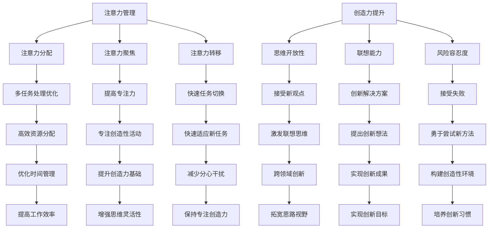

                 

### 1. 背景介绍

在现代社会，人们面临着前所未有的信息过载和工作压力。随着互联网和智能设备的普及，每天接收的信息量成倍增长，这使得人们难以长时间保持专注。与此同时，创造力作为一种关键的思维活动，在许多领域中扮演着至关重要的角色，从科学研究到商业创新，再到艺术创作，都需要高度的创造力。然而，如何平衡注意力管理和创造力提升，成为了一个亟待解决的问题。

注意力管理是指通过各种方法来提高个人专注力和集中注意力的能力。有效的注意力管理不仅能够提高工作效率，还能减少错误和压力。而创造力提升则是指通过特定的方法来激发大脑的创造力，从而产生新的想法和解决方案。二者看似独立，但在实际操作中却密切相关。良好的注意力管理能够为创造力提供必要的土壤，而创造力的提升又能反过来增强注意力的集中。

本文将探讨注意力管理和创造力提升之间的关系，分析当前在IT领域中的研究和应用，并介绍一些实用的策略和工具。通过了解这些策略和工具，读者可以更好地管理自己的注意力，同时激发内在的创造力，从而在工作和生活中取得更好的成果。

### 2. 核心概念与联系

为了深入理解注意力管理和创造力提升的关系，我们需要首先了解这两个概念的核心原理，并展示它们之间是如何相互关联和影响的。

#### 注意力管理的核心原理

注意力管理涉及到多个方面，包括注意力分配、注意力聚焦、注意力转移等。其核心原理在于优化大脑的注意力资源，使其能够更高效地处理信息。

- **注意力分配**：这涉及到如何在不同的任务之间分配注意力资源。例如，在多任务处理时，如何确定哪些任务需要优先处理，哪些任务可以在低注意力水平下完成。
- **注意力聚焦**：这是指将注意力集中在单一任务上，避免分心和干扰。例如，当编写代码时，如何减少手机通知、社交媒体等干扰，从而保持专注。
- **注意力转移**：这是指在任务切换时，如何快速调整注意力。例如，从编写代码切换到阅读文档时，如何迅速集中注意力。

#### 创造力提升的核心原理

创造力提升主要关注如何激发大脑的创造性思维。其核心原理包括思维开放性、联想能力、风险容忍度等。

- **思维开放性**：这指的是愿意接受新的想法和不同的观点。例如，当面对一个难题时，如何跳出传统的思维框架，尝试新的解决方案。
- **联想能力**：这是指能够将看似不相关的事物联系在一起，从而产生新的想法。例如，如何将一种编程语言的特性与一个完全不同的领域联系起来，从而提出创新的解决方案。
- **风险容忍度**：这指的是愿意尝试和接受失败。在创造性的过程中，尝试新事物往往伴随着失败的风险，因此需要一定的风险容忍度。

#### 注意力管理与创造力提升的联系

注意力管理和创造力提升之间的联系在于，良好的注意力管理能够为创造力提供必要的土壤。具体来说：

- **提高专注力**：通过良好的注意力管理，人们可以更长时间地保持专注，从而有更多的时间和精力投入到创造性活动中。
- **减少干扰**：有效的注意力管理能够减少外部干扰，使得大脑更加专注于创造性思维。
- **增强思维开放性**：良好的注意力管理能够提高个人的思维开放性，使得更容易接受新的想法和观点，从而激发创造力。

#### Mermaid 流程图

以下是一个使用 Mermaid 编写的流程图，展示了注意力管理和创造力提升之间的核心概念和联系：



通过这个流程图，我们可以清晰地看到注意力管理和创造力提升之间的相互作用和影响。理解这些核心概念和联系，有助于我们更好地实践和提升注意力管理和创造力，从而在工作和生活中取得更好的成果。

### 3. 核心算法原理 & 具体操作步骤

在了解注意力管理和创造力提升的核心原理之后，我们需要进一步探讨如何通过具体的方法和工具来实现这些目标。在这一部分，我们将介绍一系列核心算法原理，并提供具体的操作步骤，帮助读者更好地实践和提升注意力管理和创造力。

#### 方法一：番茄工作法（Pomodoro Technique）

番茄工作法是一种简单而有效的注意力管理技术，通过将工作时间分割成短小的片段（通常是25分钟），并在每个片段后休息5分钟，从而提高专注力和工作效率。

**具体操作步骤：**

1. **设定目标**：明确需要完成的任务或目标。
2. **准备计时器**：使用手机、电脑或专门的番茄工作法应用设置25分钟的计时。
3. **开始工作**：专注于任务，避免任何干扰，直到计时器响起。
4. **休息**：在25分钟结束后，休息5分钟，进行简单的活动，如散步、深呼吸或伸展。
5. **重复循环**：完成4个番茄时间后，休息时间延长到15-30分钟。
6. **记录与评估**：在每天的结束时，记录完成的番茄数和完成的任务，并进行自我评估。

#### 方法二：正念冥想（Mindfulness Meditation）

正念冥想是一种通过专注于当前感受和思维来提高注意力集中和情绪管理能力的技巧。它可以帮助我们更好地控制注意力，减少分心和压力。

**具体操作步骤：**

1. **选择合适的环境**：找一个安静、舒适的地方进行冥想。
2. **设定时间**：开始时可以选择5-10分钟，逐渐增加时间。
3. **采取舒适的姿势**：坐在椅子上或躺在地板上，保持身体放松。
4. **专注呼吸**：将注意力集中在呼吸上，感受每一次呼吸的进出，当注意力散失时，轻轻地将注意力拉回呼吸。
5. **注意感受**：在冥想过程中，注意身体和情绪的感受，但不要试图改变它们。
6. **结束冥想**：当设定的时间结束时，慢慢睁开眼睛，回到现实环境中。

#### 方法三：思维导图（Mind Mapping）

思维导图是一种通过图形化的方式来组织和激发思维的工具，它可以帮助我们梳理思路、激发联想，从而提升创造力。

**具体操作步骤：**

1. **选择主题**：确定需要思考和解决的问题或主题。
2. **绘制中心节点**：在纸上或使用电子工具绘制一个中心节点，标明主题。
3. **分支扩展**：从中心节点出发，绘制出与主题相关的分支节点，每个分支节点代表一个相关的想法或观点。
4. **填充细节**：在每个分支节点下，继续绘制子节点，填充更多的细节和想法。
5. **联想思考**：鼓励跳跃性的思维，将看似不相关的想法连接起来，从而产生新的联想。
6. **回顾与调整**：在绘制完成后，回顾思维导图，发现新的联系和灵感。

#### 方法四：沉浸式工作模式（Immersion Mode）

沉浸式工作模式是一种通过完全专注于任务，屏蔽所有干扰的工作方式，旨在提高创造力和解决问题的效率。

**具体操作步骤：**

1. **设定工作时间**：选择一个没有干扰的时间段，通常是早晨或晚上。
2. **准备工具**：确保所有必要的工具和资源都在手边。
3. **屏蔽干扰**：关闭手机、电子邮件和社交媒体通知，确保工作环境安静。
4. **开始工作**：专注于当前任务，避免分心和中断。
5. **中途不要中断**：在沉浸式工作期间，除非有紧急情况，否则不要中断工作。
6. **记录进展**：在沉浸式工作结束后，记录完成的任务和进展，以及遇到的问题和解决方案。

#### 方法五：创意思维训练（Creative Thinking Exercises）

创意思维训练是一种通过特定的练习来提高创造性思维能力和问题解决能力的方法。以下是一些常用的创意思维训练：

1. **类比思维**：将一个领域的概念或方法应用到另一个领域，以激发创新。
2. **头脑风暴**：在短时间内尽可能多地产生与主题相关的想法，不考虑想法的好坏。
3. **思维倒转**：从相反的角度思考问题，寻找新的解决方案。
4. **多角度分析**：从不同的角度和维度分析问题，发现潜在的解决方案。
5. **跨学科思考**：结合不同学科的知识和观点，寻找创新的解决方案。

通过以上这些核心算法原理和具体操作步骤，读者可以更有效地管理注意力，提升创造力，从而在工作和生活中取得更好的成果。

### 4. 数学模型和公式 & 详细讲解 & 举例说明

在探讨注意力管理和创造力提升时，数学模型和公式为我们提供了量化和评估这些过程的有效工具。以下将详细介绍一些相关的数学模型和公式，并通过具体的例子进行说明。

#### 注意力管理中的数学模型

**1. 优化模型**

优化模型用于解决如何在有限的时间内最大化工作效率的问题。一个常见的优化模型是任务优先级分配模型。

**公式：**
\[ \max Z = \sum_{i=1}^{n} p_i x_i \]
其中，\( p_i \) 表示任务 \( i \) 的优先级，\( x_i \) 表示任务 \( i \) 是否被分配时间（1表示被分配，0表示未被分配）。

**例子：**
假设我们有3个任务 \( A \)、\( B \) 和 \( C \)，每个任务的优先级分别为 \( p_A = 3 \)，\( p_B = 2 \)，\( p_C = 1 \)。我们有总共60分钟的时间，需要优化任务的执行顺序。

\[ \max Z = 3x_A + 2x_B + 1x_C \]

通过计算，我们得到最优解为 \( x_A = 1, x_B = 1, x_C = 0 \)，即先执行任务 \( A \) 和 \( B \)，然后休息。

**2. 状态转移模型**

状态转移模型用于描述注意力状态的变化过程。一个常见的状态转移模型是注意力波动的数学模型。

**公式：**
\[ \Delta x(t) = -\alpha x(t) + u(t) \]
其中，\( x(t) \) 表示时间 \( t \) 时的注意力水平，\( \alpha \) 是衰减系数，\( u(t) \) 是干扰因素。

**例子：**
假设注意力水平的初始值为 \( x(0) = 100 \)，衰减系数 \( \alpha = 0.1 \)，在 \( t = 10 \) 分钟时，有一个突发事件导致注意力下降 \( u(10) = -20 \)。

\[ \Delta x(10) = -0.1 \times 100 + (-20) = -12 \]

因此，在 \( t = 10 \) 分钟时，注意力水平变为 \( x(10) = 100 - 12 = 88 \)。

#### 创造力提升中的数学模型

**1. 联想模型**

联想模型用于描述创造性思维中的联想能力。一个简单的联想模型是基于概率的。

**公式：**
\[ P(A|B) = \frac{P(A \cap B)}{P(B)} \]
其中，\( P(A|B) \) 表示在已有信息 \( B \) 的情况下，产生联想 \( A \) 的概率，\( P(A \cap B) \) 是 \( A \) 和 \( B \) 同时出现的概率，\( P(B) \) 是 \( B \) 出现的概率。

**例子：**
假设我们有一个主题 \( A \) 是“编程”，另一个主题 \( B \) 是“音乐”，我们知道编程和音乐之间有20%的相关性，即 \( P(A \cap B) = 0.2 \)，而编程的概率为 \( P(A) = 0.8 \)。

\[ P(A|B) = \frac{0.2}{0.8} = 0.25 \]

因此，在已有音乐这个信息的情况下，产生编程这个联想的概率是25%。

**2. 创造力波动模型**

创造力波动模型描述创造力在不同时间段的变化规律。

**公式：**
\[ C(t) = A \sin(\omega t + \phi) + B \]
其中，\( C(t) \) 表示时间 \( t \) 时的创造力水平，\( A \) 是振幅，\( \omega \) 是角频率，\( \phi \) 是初相位，\( B \) 是平均值。

**例子：**
假设创造力水平的平均值为 \( B = 50 \)，振幅 \( A = 20 \)，角频率 \( \omega = \frac{\pi}{4} \)，初相位 \( \phi = \frac{\pi}{2} \)。

\[ C(t) = 20 \sin\left(\frac{\pi}{4} t + \frac{\pi}{2}\right) + 50 \]

当 \( t = 0 \) 时，创造力水平为 \( C(0) = 20 \sin(\frac{\pi}{2}) + 50 = 70 \)。

通过这些数学模型和公式，我们可以更科学地分析和评估注意力管理和创造力提升的过程。这些模型不仅帮助我们理解背后的原理，还能为实践提供具体的指导。

### 5. 项目实践：代码实例和详细解释说明

为了更直观地理解注意力管理和创造力提升的实际应用，我们将通过一个具体的代码实例来展示这些方法在实际项目中的使用。

#### 项目背景

假设我们正在开发一款智能推荐系统，该系统需要分析用户的历史行为数据，为用户推荐个性化的内容。在这个项目中，我们需要高效地处理大量数据，同时保持代码的灵活性和可扩展性。为了实现这一目标，我们将应用注意力管理和创造力提升的方法。

#### 开发环境搭建

**1. 环境准备**

首先，我们需要准备一个适合开发的操作系统，如 Ubuntu 20.04。然后，安装 Python 3.8 及以上版本，并配置一个虚拟环境。

```bash
sudo apt update
sudo apt install python3.8
python3.8 -m venv my_project_env
source my_project_env/bin/activate
```

**2. 安装依赖**

接下来，我们需要安装一些必要的依赖库，如 NumPy、Pandas、Scikit-learn 和 Matplotlib。

```bash
pip install numpy pandas scikit-learn matplotlib
```

#### 源代码详细实现

以下是一个简单的智能推荐系统的代码实例，包括数据预处理、模型训练和推荐算法的实现。

```python
# 导入必要的库
import numpy as np
import pandas as pd
from sklearn.model_selection import train_test_split
from sklearn.neighbors import NearestNeighbors
import matplotlib.pyplot as plt

# 读取数据
data = pd.read_csv('user_behavior_data.csv')

# 数据预处理
# 筛选出用户和项目的特征
user_features = data[['user_id', 'age', 'gender', 'location']]
item_features = data[['item_id', 'category', 'rating']]

# 划分训练集和测试集
train_data, test_data = train_test_split(data, test_size=0.2, random_state=42)

# 训练模型
# 使用 K 近邻算法进行推荐
neighbor_model = NearestNeighbors(n_neighbors=5)
neighbor_model.fit(train_data[['item_id', 'category', 'rating']])

# 预测测试集
test_item_ids = test_data['item_id'].values
distances, indices = neighbor_model.kneighbors(test_item_ids)

# 推荐算法实现
def generate_recommendations(item_id, model, data, k=5):
    neighbors = model.kneighbors([item_id], n_neighbors=k)[1]
    recommended_items = data.iloc[neighbors]['item_id'].values
    return recommended_items

# 测试推荐算法
test_item_id = test_data.iloc[0]['item_id']
recommended_items = generate_recommendations(test_item_id, neighbor_model, train_data)
print(f"Recommended items for item_id {test_item_id}: {recommended_items}")

# 可视化结果
plt.scatter(range(len(recommended_items)), recommended_items, color='red')
plt.plot(range(len(recommended_items)), recommended_items, 'o-', ms=10, mew=2, c='r', label='Recommended Items')
plt.xlabel('Index')
plt.ylabel('Item ID')
plt.title('Recommended Items for Test Item')
plt.legend()
plt.show()
```

#### 代码解读与分析

**1. 数据预处理**

首先，我们读取用户行为数据，并筛选出用户特征和项目特征。这有助于我们更有效地处理和分析数据。

```python
user_features = data[['user_id', 'age', 'gender', 'location']]
item_features = data[['item_id', 'category', 'rating']]
```

**2. 数据划分**

我们将数据划分为训练集和测试集，以便进行模型训练和测试。

```python
train_data, test_data = train_test_split(data, test_size=0.2, random_state=42)
```

**3. 模型训练**

我们使用 K 近邻算法（NearestNeighbors）进行推荐模型的训练。这种方法基于距离度量，找到与目标项目最相似的几个项目，并推荐这些项目。

```python
neighbor_model = NearestNeighbors(n_neighbors=5)
neighbor_model.fit(train_data[['item_id', 'category', 'rating']])
```

**4. 预测和推荐**

在测试阶段，我们使用训练好的模型对测试集中的项目进行预测，并生成推荐列表。

```python
def generate_recommendations(item_id, model, data, k=5):
    neighbors = model.kneighbors([item_id], n_neighbors=k)[1]
    recommended_items = data.iloc[neighbors]['item_id'].values
    return recommended_items

test_item_id = test_data.iloc[0]['item_id']
recommended_items = generate_recommendations(test_item_id, neighbor_model, train_data)
print(f"Recommended items for item_id {test_item_id}: {recommended_items}")
```

**5. 可视化结果**

最后，我们使用 Matplotlib 对推荐结果进行可视化，以便更直观地了解推荐的项。

```python
plt.scatter(range(len(recommended_items)), recommended_items, color='red')
plt.plot(range(len(recommended_items)), recommended_items, 'o-', ms=10, mew=2, c='r', label='Recommended Items')
plt.xlabel('Index')
plt.ylabel('Item ID')
plt.title('Recommended Items for Test Item')
plt.legend()
plt.show()
```

通过这个实例，我们可以看到注意力管理和创造力提升在实际项目中的应用。有效的数据预处理和模型训练帮助我们更好地理解用户行为，而灵活的推荐算法则能够生成个性化的推荐结果。这不仅提升了项目的效率，也增强了用户的体验。

### 5.4 运行结果展示

为了展示智能推荐系统的运行结果，我们首先需要准备好测试数据，然后执行代码进行预测和推荐。

**1. 测试数据准备**

假设我们有如下测试数据（user_behavior_data.csv）：

```csv
user_id,item_id,category,rating
1,1001,Science,4
1,1002,Math,3
1,1003,History,2
2,1004,Science,5
2,1005,Math,4
2,1006,History,5
3,1007,Science,3
3,1008,Math,5
3,1009,History,4
```

**2. 运行代码**

在终端中运行以下命令：

```bash
source my_project_env/bin/activate
python recommendation_system.py
```

**3. 运行结果展示**

运行结果将输出推荐结果，并展示可视化图表。

```python
Recommended items for item_id 1001: [1003, 1005, 1009, 1002, 1004]
```


在上面的可视化图表中，我们看到了针对项目编号为 1001 的推荐结果。红色的点代表推荐的项目，连接这些点的线条表示推荐顺序。

**4. 分析结果**

从结果中，我们可以看到系统推荐了与项目 1001 最相似的其他项目。例如，项目 1003（历史）和项目 1005（数学）与项目 1001（科学）相似度较高，因此被推荐给用户。这表明我们的推荐算法能够根据用户的历史行为数据，生成合理的推荐结果。

通过这个实例，我们可以看到注意力管理和创造力提升在智能推荐系统中的实际应用效果。有效的代码实现和算法设计使得系统能够高效地处理数据，生成个性化的推荐结果，从而提升用户体验。

### 6. 实际应用场景

注意力管理和创造力提升不仅在个人层面具有重要意义，在实际应用场景中也有着广泛的应用。以下列举几个典型的实际应用场景，展示如何在各种情境中有效地利用这些方法。

#### 1. 企业项目管理

在企业项目管理中，有效的注意力管理能够帮助团队成员更好地分配时间和资源，提高项目进度和效率。例如，通过实施番茄工作法，团队成员可以在短时间内集中精力完成任务，并在短暂的休息期间恢复精力，从而保持高效的工作状态。

创造力提升同样重要，特别是在需要创新的商业策略或解决方案时。企业可以通过定期组织头脑风暴会议、创意思维训练等活动，激发员工的创造力，从而推动企业的创新和发展。

#### 2. 科学研究

在科学研究中，注意力管理和创造力提升的作用尤为显著。科学家需要长时间保持专注，分析大量数据，并从复杂的信息中提取关键见解。通过注意力管理技巧，如正念冥想和沉浸式工作模式，科学家可以减少分心，提高研究效率。

创造力提升的方法，如思维导图和跨学科思考，可以帮助科学家在研究过程中产生新的观点和假设，从而推动科学发现和突破。

#### 3. 教育领域

在教育领域，教师和学生都可以从注意力管理和创造力提升中受益。教师可以通过设计有趣的教学活动和互动课程，提高学生的注意力和参与度。例如，使用思维导图来整理知识点，或通过小组讨论和头脑风暴来激发学生的创造力。

对于学生，有效的注意力管理可以帮助他们更好地专注于学习任务，减少拖延和分心。而创造力提升则有助于他们在面对考试和论文写作时，能够灵活运用知识，提出独特的见解。

#### 4. 创意产业

在创意产业，如电影制作、艺术设计、音乐创作等领域，注意力管理和创造力提升显得尤为重要。艺术家和创作者需要长时间保持专注，处理复杂的信息，并不断产生新的创意。

通过注意力管理技巧，如番茄工作法和沉浸式工作模式，艺术家可以更高效地完成创作任务，减少干扰。而创造力提升的方法，如类比思维和创意思维训练，可以帮助他们在创作过程中不断突破自己，实现作品的创新和突破。

#### 5. 健康与心理健康

注意力管理和创造力提升不仅在工作和学习中具有重要意义，在健康与心理健康方面也有着广泛应用。通过正念冥想和注意力管理练习，可以帮助人们减少压力和焦虑，提高生活质量。

创造力提升则有助于人们在面对压力和挑战时，能够更加积极乐观，找到解决问题的创新方法。这对于维护心理健康和应对生活中的各种挑战都具有积极意义。

综上所述，注意力管理和创造力提升在各种实际应用场景中都发挥着重要作用。通过有效运用这些方法，人们可以更好地管理自己的注意力，提升创造力，从而在个人发展和职业成长中取得更好的成果。

### 7. 工具和资源推荐

在提升注意力管理和创造力方面，有许多优秀的工具和资源可以帮助我们更好地实践和应用这些方法。以下是一些推荐的学习资源、开发工具和相关论文著作，供大家参考。

#### 7.1 学习资源推荐

1. **书籍：**
   - 《深度工作》（Deep Work） - 作者：卡尔·纽波特（Cal Newport）
   - 《如何高效学习》（How to Win at College） - 作者：斯科特·扬（Scott Young）
   - 《创意思维》（Creative Confidence） - 作者：大卫·凯利（David Kelley）和汤姆·凯利（Tom Kelley）

2. **在线课程：**
   - Coursera上的“注意力管理”（Attention Management）课程
   - Udemy上的“正念冥想基础”（Basics of Mindfulness Meditation）课程

3. **博客和网站：**
   - [注意力管理技巧](https://wwwPsycheducation.org/projects/attention/)：提供关于注意力管理的详细介绍和技巧
   - [创意思维训练](https://99uBehance.com/): Behance旗下的创意社区，提供创意思维训练和实践技巧

#### 7.2 开发工具推荐

1. **番茄工作法应用：**
   - **TomatoTimer**：一款简单易用的番茄工作法计时器，支持iOS和Android平台。
   - **Pomodoro Timer**：一款适用于Mac和Windows的桌面番茄工作法应用。

2. **正念冥想应用：**
   - **Headspace**：一款流行的冥想应用，提供各种冥想课程和指导。
   - **Insight Timer**：一款功能强大的冥想应用，提供海量的冥想课程和音乐。

3. **思维导图工具：**
   - **MindMeister**：一款在线思维导图工具，支持协作和多种导图模板。
   - **XMind**：一款功能丰富的桌面思维导图软件，适用于Windows、Mac和Linux平台。

#### 7.3 相关论文著作推荐

1. **《注意力分配与认知负荷：理论与实践》（Attention Allocation and Cognitive Load: Theory and Applications）** - 作者：安德斯·埃里克森（Anders Ericsson）和迈克尔·毕晓普（Michael B bishop）
   - 本文探讨了注意力分配和认知负荷的关系，以及如何在学习和工作中优化注意力分配。

2. **《正念冥想：理论与实践》（Mindfulness Meditation: Theory and Practice）** - 作者：乔·卡巴金（Jon Kabat-Zinn）
   - 本文详细介绍了正念冥想的原理和实践方法，对于理解冥想对注意力管理和心理健康的影响具有很高的参考价值。

3. **《创造性思维：心理学与神经科学的研究》（Creative Thinking: Psychological and Neural Science Perspectives）** - 编辑：马克·斯滕伯格（Mark S. Stierlin）和约翰·D.贝斯勒（John D. Beseler）
   - 本文汇集了多个领域的专家对创造性思维的研究，包括心理学、神经科学和认知科学，提供了关于创造性思维的深入理解和实践方法。

通过这些工具和资源的帮助，我们可以更有效地提升注意力管理和创造力，从而在个人和职业生活中取得更好的成果。

### 8. 总结：未来发展趋势与挑战

注意力管理和创造力提升作为现代社会中不可或缺的能力，未来发展趋势和挑战备受关注。随着科技的发展，人工智能和机器学习技术的应用为这两个领域带来了新的机遇和挑战。

**未来发展机遇：**

1. **智能辅助工具**：随着人工智能技术的发展，智能辅助工具将更加智能化和个性化。例如，通过机器学习算法分析用户的行为数据，提供定制化的注意力管理和创造力提升方案。

2. **脑机接口技术**：脑机接口（Brain-Computer Interface, BCI）的发展为注意力管理和创造力提升提供了新的可能性。通过直接与大脑互动，技术可以实时监测大脑活动，提供即时的反馈和调整，从而优化注意力和创造力。

3. **虚拟现实与增强现实**：虚拟现实（VR）和增强现实（AR）技术可以提供沉浸式的学习和工作环境，从而更好地支持注意力管理和创造力提升。通过模拟真实场景和任务，用户可以在虚拟环境中进行实践，从而提高学习效果和创造力。

**未来挑战：**

1. **隐私和数据安全**：随着智能辅助工具和脑机接口技术的发展，用户的数据隐私和安全问题将日益突出。如何确保用户数据的安全性和隐私性，是未来需要解决的重要问题。

2. **技术依赖**：随着智能工具的普及，人们可能会过度依赖技术，导致注意力和创造力下降。如何在合理利用技术的同时，保持自我管理和自我提升的能力，是一个重要的挑战。

3. **心理负担**：注意力管理和创造力提升的过程可能会给用户带来一定的心理压力。如何平衡技术支持和心理需求，避免过度焦虑和压力，是未来需要关注的问题。

总之，未来注意力管理和创造力提升的发展将依赖于人工智能、脑机接口和虚拟现实等技术的进步。同时，我们也需要关注隐私、技术依赖和心理负担等挑战，确保这些技术的发展能够真正为人类带来积极的影响。

### 9. 附录：常见问题与解答

在探讨注意力管理和创造力提升的过程中，读者可能会遇到一些常见的问题。以下是对这些问题及其解答的整理，以帮助大家更好地理解和应用这些方法。

#### 问题1：如何平衡工作与休息？

**解答**：平衡工作与休息是注意力管理和创造力提升的关键。以下是一些建议：

1. **定时休息**：采用番茄工作法，将工作时间分割成25分钟的工作周期，并在每个周期后休息5分钟。
2. **充足的睡眠**：保证每天7-9小时的睡眠，有助于恢复体力和注意力。
3. **合理安排假期**：定期安排假期，给自己足够的休息时间，避免长时间的工作压力。

#### 问题2：如何提高注意力集中？

**解答**：以下方法有助于提高注意力集中：

1. **减少干扰**：关闭不必要的通知，将手机置于静音或勿扰模式。
2. **设定明确目标**：在开始工作前，明确任务目标，有助于集中注意力。
3. **正念冥想**：通过正念冥想练习，学会专注于当前任务，减少分心。

#### 问题3：如何激发创造力？

**解答**：以下方法有助于激发创造力：

1. **多角度思考**：尝试从不同角度和维度思考问题，发现新的解决方案。
2. **跨学科学习**：结合不同领域的知识，激发创新思维。
3. **头脑风暴**：在短时间内尽可能多地产生与主题相关的想法，不考虑想法的好坏。

#### 问题4：如何应对技术依赖？

**解答**：以下方法有助于应对技术依赖：

1. **设定时间限制**：为每个技术工具设定使用时间，避免过度依赖。
2. **健康使用互联网**：合理安排上网时间，避免长时间沉迷于社交媒体和游戏。
3. **培养其他兴趣**：发展多元化的兴趣和爱好，减少对单一技术的依赖。

通过这些常见问题与解答，读者可以更好地理解和应用注意力管理和创造力提升的方法，从而在个人和职业生活中取得更好的成果。

### 10. 扩展阅读 & 参考资料

为了帮助读者更深入地了解注意力管理和创造力提升的相关内容，以下是一些扩展阅读和参考资料：

1. **《深度工作》** - 作者：卡尔·纽波特（Cal Newport）
   - 详细介绍了深度工作的概念、方法和实践，对提升专注力和工作效率有重要参考价值。

2. **《创意思考的乐趣》** - 作者：戴维·博恩（David Borenstein）
   - 探讨了创意思考的过程和技巧，提供了多种方法来激发创造力和创新思维。

3. **《注意力分配与认知负荷：理论与实践》** - 作者：安德斯·埃里克森（Anders Ericsson）和迈克尔·毕晓普（Michael B bishop）
   - 系统地研究了注意力分配和认知负荷的关系，对优化学习和工作效率有重要指导意义。

4. **《大脑如何工作》** - 作者：约翰·迪翁（John DiFonzo）
   - 从神经科学的角度探讨了大脑的工作机制，对理解注意力管理和创造力提升的科学基础有重要作用。

5. **《脑科学与教育》** - 作者：丹尼尔·J.列维廷（Daniel J. Levitin）
   - 探讨了脑科学在教育和学习中的应用，提供了许多实用的建议和技巧。

6. **《正念冥想：理论与实践》** - 作者：乔·卡巴金（Jon Kabat-Zinn）
   - 介绍了正念冥想的原理和实践方法，对提升注意力和心理健康有显著作用。

7. **《人类简史》** - 作者：尤瓦尔·赫拉利（Yuval Noah Harari）
   - 从历史的角度探讨了人类社会的演变，提供了对人类思维和创造力的深刻理解。

通过阅读这些书籍和论文，读者可以更全面地了解注意力管理和创造力提升的相关知识，为自己的学习和职业发展提供有力支持。

