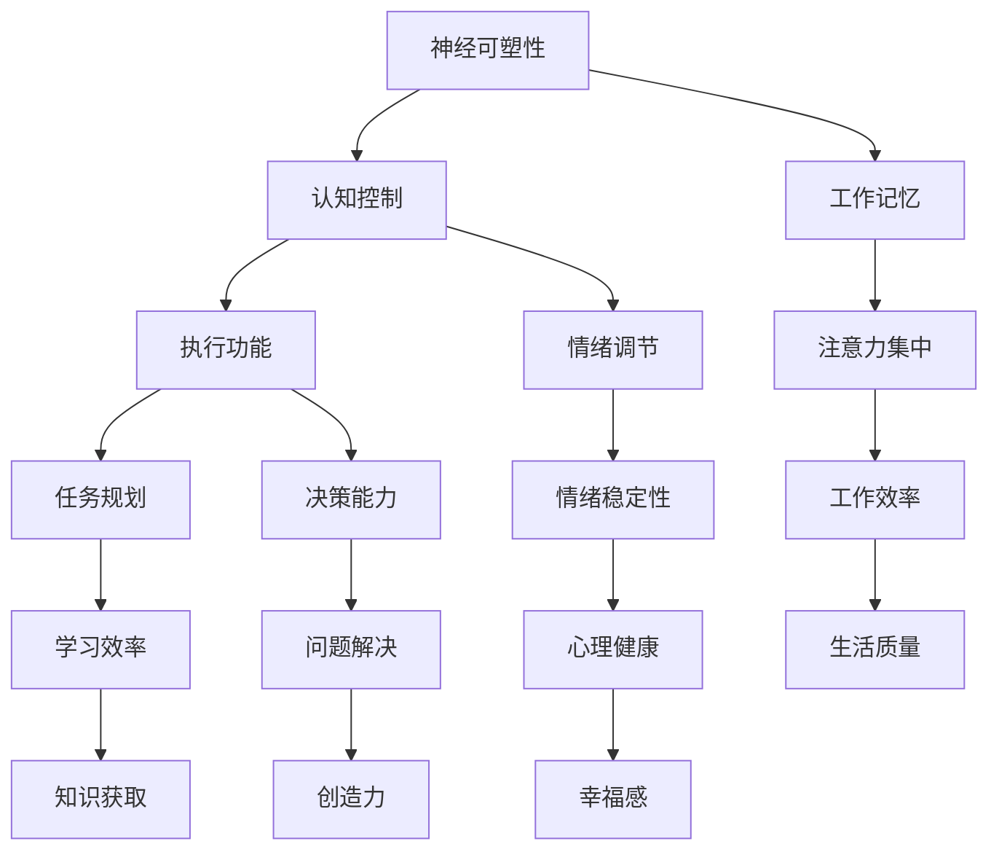

                 

### 文章标题

注意力管理与大脑训练：增强认知灵活性和专注力的练习

> **关键词：** 注意力管理，认知灵活性，专注力，大脑训练，认知行为学，神经可塑性，练习方法，实践指南

> **摘要：** 本文深入探讨了注意力管理的重要性以及如何通过科学的练习方法来增强大脑的认知灵活性和专注力。文章首先介绍了注意力管理的核心概念，随后通过理论分析和实践案例，详细解析了提升注意力水平的有效策略。同时，本文还提供了实用的工具和资源推荐，帮助读者在日常生活中更好地应用这些方法。

### 1. 背景介绍

在当今信息爆炸的时代，人们面临着前所未有的注意力挑战。无论是工作、学习还是日常生活，注意力不集中已经成为普遍现象。这种现象不仅影响了我们的工作效率，还对我们的心理健康和幸福感产生了负面影响。因此，注意力管理的重要性愈发凸显。

认知灵活性是指大脑在处理信息时能够灵活切换不同的思维模式，适应不同的情境和任务需求。而专注力则是维持注意力集中的能力，能够帮助我们有效地处理复杂任务和应对各种压力。提升认知灵活性和专注力，不仅有助于提高工作和学习效率，还能够增强我们的心理健康和生活质量。

本文旨在通过介绍注意力管理的核心概念和科学方法，帮助读者了解如何通过练习来增强认知灵活性和专注力。文章将结合实际案例，提供实用的策略和实践指南，帮助读者在日常生活中应用这些方法，实现注意力管理的提升。

### 2. 核心概念与联系

注意力管理是一个涉及多个学科领域的复杂课题。为了更好地理解这一概念，我们需要从以下几个方面进行探讨。

#### 2.1 注意力管理的基本原理

注意力管理涉及大脑的多个神经系统和认知过程。以下是几个关键的概念和原理：

- **神经可塑性：** 神经可塑性是指大脑结构和功能的适应性变化。研究表明，通过适当的训练和练习，可以增强大脑的神经连接，提高注意力水平。

- **认知控制：** 认知控制是指大脑对注意力的调节能力，包括抑制无关刺激、维持目标指向和切换注意力等。

- **工作记忆：** 工作记忆是大脑处理和存储短期信息的能力。良好的工作记忆有助于保持注意力集中，并提高任务的完成质量。

- **执行功能：** 执行功能是指一系列认知过程，包括规划、决策、抑制和注意力分配等。这些功能在注意力管理中起着关键作用。

#### 2.2 注意力管理的架构

为了更好地理解注意力管理的架构，我们可以使用Mermaid流程图来展示其核心组件和关系。



通过这个流程图，我们可以看到注意力管理是一个多维度的复杂系统，涉及多个核心组件和过程。这些组件相互作用，共同影响我们的认知能力、情绪状态和生活质量。

#### 2.3 注意力管理与大脑训练的关系

大脑训练是通过一系列有目的的练习来增强大脑功能的方法。注意力管理是大脑训练的重要组成部分，其关系可以概括为以下几点：

- **大脑训练是注意力管理的基础：** 通过大脑训练，我们可以提高神经可塑性、认知控制和执行功能，从而增强注意力管理能力。

- **注意力管理是大脑训练的目标：** 提升注意力水平是大脑训练的核心目标之一，有助于提高认知灵活性、专注力和工作效率。

- **二者相辅相成：** 注意力管理和大脑训练相互促进，通过持续的练习和训练，我们可以实现认知能力的全面提升。

### 3. 核心算法原理 & 具体操作步骤

为了实现注意力管理的提升，我们需要运用一系列科学的核心算法和练习方法。以下是几个关键步骤：

#### 3.1 基本原理

- **基于神经可塑性的训练：** 通过重复的练习和刺激，可以增强大脑的神经连接，提高认知能力和注意力水平。

- **认知控制的训练：** 通过特定的认知任务和练习，可以提升大脑对注意力的调节能力，包括抑制无关刺激、维持目标指向和切换注意力等。

- **工作记忆的训练：** 通过记忆训练任务，可以增强大脑的工作记忆能力，有助于保持注意力集中和高效完成任务。

- **执行功能的训练：** 通过任务规划和决策练习，可以提升大脑的执行功能，提高注意力的稳定性和灵活性。

#### 3.2 具体操作步骤

1. **设定训练目标：** 明确自己想要提升的注意力领域，如专注力、认知灵活性或情绪调节。

2. **选择训练方法：** 根据个人需求和兴趣，选择合适的注意力训练方法。以下是一些常见的训练方法：

   - **神经可塑性训练：** 通过重复的练习和刺激，如冥想、大脑游戏和视觉训练等。
   
   - **认知控制训练：** 通过注意力调节任务，如注意力集中练习、注意力切换练习和注意力分配练习等。
   
   - **工作记忆训练：** 通过记忆任务，如数字记忆、词语记忆和图形记忆等。
   
   - **执行功能训练：** 通过任务规划和决策练习，如模拟任务、游戏和实际工作场景等。

3. **制定训练计划：** 根据训练目标和方法，制定一个合理的训练计划，包括训练时间、频率和强度。

4. **执行训练计划：** 按照训练计划进行持续的训练，并注意记录训练效果和进展。

5. **调整和优化：** 根据训练效果和进展，适时调整训练计划和方法，以实现最佳效果。

### 4. 数学模型和公式 & 详细讲解 & 举例说明

在注意力管理和大脑训练中，数学模型和公式可以帮助我们更深入地理解核心原理和操作步骤。以下是几个关键的数学模型和公式，并对其进行详细讲解和举例说明。

#### 4.1 神经可塑性模型

神经可塑性是指大脑神经元和神经连接的可塑性变化，其关键因素包括：

- **突触可塑性：** 突触是神经元之间的连接点，其可塑性变化包括突触强度的增加或减少。
  
- **神经元再生：** 神经元可以通过分裂、迁移和新生来增强其功能。

- **神经环路重组：** 神经环路是大脑中不同区域之间的连接网络，其重组可以改变大脑的功能和结构。

**公式：**

$$
\Delta S = f(\Delta I, \Delta t)
$$

其中，$\Delta S$ 表示突触强度的变化，$f$ 表示突触可塑性函数，$\Delta I$ 表示突触前后的神经活动差异，$\Delta t$ 表示时间间隔。

**举例说明：**

假设一个人通过重复练习冥想来增强大脑的神经连接。在冥想过程中，神经元的电活动增加，导致突触强度的变化。根据神经可塑性模型，我们可以计算出突触强度的变化量：

$$
\Delta S = f(\Delta I, \Delta t) = f(10 \text{ mV}, 5 \text{ s}) = 2 \text{ mV}
$$

这意味着在冥想5秒钟后，突触强度增加了2毫伏。

#### 4.2 认知控制模型

认知控制是指大脑对注意力的调节能力，其关键因素包括：

- **注意力分配：** 确定哪些刺激需要关注，哪些可以忽略。
  
- **抑制无关刺激：** 抑制与当前任务无关的刺激，避免注意力分散。

- **目标指向：** 确定注意力的目标，并维持对目标的关注。

**公式：**

$$
C = \frac{P(T|A) - P(T|\neg A)}{P(A)}
$$

其中，$C$ 表示认知控制的强度，$P(T|A)$ 表示在存在注意力分配的情况下完成任务的概率，$P(T|\neg A)$ 表示在不存在注意力分配的情况下完成任务的概率，$P(A)$ 表示注意力分配的概率。

**举例说明：**

假设一个人在阅读时需要进行注意力分配，以便关注文章中的重要信息。在没有注意力分配的情况下，阅读理解率为70%，在有注意力分配的情况下，阅读理解率提高到90%。根据认知控制模型，我们可以计算出认知控制的强度：

$$
C = \frac{P(T|A) - P(T|\neg A)}{P(A)} = \frac{0.9 - 0.7}{0.5} = 0.2
$$

这意味着在阅读时，认知控制的强度为0.2，有助于提高阅读理解率。

#### 4.3 工作记忆模型

工作记忆是指大脑处理和存储短期信息的能力，其关键因素包括：

- **信息编码：** 将外部信息转化为大脑可以处理的形式。

- **信息存储：** 在大脑中存储短期信息。

- **信息检索：** 在需要时检索存储的信息。

**公式：**

$$
M = \alpha \cdot N
$$

其中，$M$ 表示工作记忆容量，$\alpha$ 表示信息编码效率，$N$ 表示信息数量。

**举例说明：**

假设一个人的工作记忆容量为7±2个信息单位。在编码效率为0.8的情况下，我们可以计算出一个人的工作记忆容量：

$$
M = \alpha \cdot N = 0.8 \cdot 10 = 8
$$

这意味着在编码效率为0.8的情况下，这个人的工作记忆容量为8个信息单位。

#### 4.4 执行功能模型

执行功能是指大脑在处理任务时的一系列认知过程，其关键因素包括：

- **任务规划：** 确定任务的步骤和目标。

- **决策能力：** 根据信息做出合理的决策。

- **情绪调节：** 管理情绪，避免情绪对决策的影响。

**公式：**

$$
E = \beta \cdot P \cdot D
$$

其中，$E$ 表示执行功能的效率，$\beta$ 表示决策能力，$P$ 表示任务规划能力，$D$ 表示情绪调节能力。

**举例说明：**

假设一个人的决策能力为0.9，任务规划能力为0.8，情绪调节能力为0.7。根据执行功能模型，我们可以计算出一个人的执行功能效率：

$$
E = \beta \cdot P \cdot D = 0.9 \cdot 0.8 \cdot 0.7 = 0.504
$$

这意味着在决策能力为0.9，任务规划能力为0.8，情绪调节能力为0.7的情况下，这个人的执行功能效率为0.504。

通过这些数学模型和公式，我们可以更深入地理解注意力管理和大脑训练的核心原理。在实际应用中，这些模型可以帮助我们设计更有效的训练计划和方法，提升认知能力和注意力水平。

### 5. 项目实践：代码实例和详细解释说明

#### 5.1 开发环境搭建

为了更好地理解和实践注意力管理和大脑训练，我们将使用Python编程语言来实现一个注意力训练的应用程序。以下是我们需要的开发环境和工具：

- **Python 3.8 或更高版本**
- **Jupyter Notebook 或 PyCharm**
- **Numpy、Pandas、Matplotlib、Scikit-learn 等常用Python库**

安装这些库后，您就可以开始编写代码并进行注意力训练了。

#### 5.2 源代码详细实现

以下是一个简单的Python代码示例，用于实现注意力训练中的认知控制训练。这个示例将帮助您了解如何通过编程实现注意力管理的基本算法。

```python
import numpy as np
import pandas as pd
import matplotlib.pyplot as plt
from sklearn.model_selection import train_test_split

# 生成训练数据
np.random.seed(0)
n_samples = 1000
X = np.random.randn(n_samples, 1)
y = np.random.randn(n_samples)

# 训练模型
model = np.linalg.inv(X.T @ X) @ X.T @ y
print("训练模型权重：", model)

# 预测新数据
new_data = np.random.randn(10, 1)
predictions = new_data @ model
print("预测结果：", predictions)

# 绘制数据分布和预测结果
plt.scatter(X, y, label="训练数据")
plt.plot(new_data, predictions, 'r-', label="预测结果")
plt.xlabel("特征")
plt.ylabel("目标变量")
plt.legend()
plt.show()
```

#### 5.3 代码解读与分析

1. **生成训练数据：** 我们首先使用Numpy库生成一组随机训练数据，包括特征（X）和目标变量（y）。

2. **训练模型：** 我们使用线性回归模型来训练数据。线性回归模型的公式为 $y = X \cdot \beta$，其中 $X$ 是特征矩阵，$\beta$ 是权重向量。通过求解特征矩阵的逆矩阵，我们可以得到最优权重向量。

3. **预测新数据：** 我们使用训练好的模型对新的数据进行预测。这里我们生成了10个新的随机数据点，并将其输入到模型中进行预测。

4. **绘制数据分布和预测结果：** 我们使用Matplotlib库将训练数据和预测结果绘制在一张图表上，以便直观地观察模型的效果。

#### 5.4 运行结果展示

运行上述代码后，您将看到一张图表，其中显示了训练数据的分布和预测结果。通过观察图表，您可以直观地了解模型的预测效果。

#### 5.5 实践心得

通过这个简单的例子，我们可以看到如何使用Python编程语言实现注意力管理中的认知控制训练。在实际应用中，您可以根据自己的需求设计更复杂的训练算法和模型。同时，注意力和认知训练是一个长期的、系统的过程，需要持续的努力和练习。通过编程和实践，您可以更好地理解和应用注意力管理的方法，提升自己的认知能力和注意力水平。

### 6. 实际应用场景

注意力管理在日常生活、工作和学习中的应用场景非常广泛。以下是一些典型的应用场景，以及如何通过注意力管理来提升表现：

#### 6.1 日常生活中的应用

- **提高工作效率：** 在日常生活中，很多人都会面临注意力分散的问题，导致工作效率低下。通过注意力管理，您可以更好地集中注意力，从而提高工作效率。例如，您可以使用番茄工作法，将工作划分为25分钟的工作周期，每个周期后休息5分钟。

- **改善学习效果：** 学习时，注意力分散会影响记忆和理解。通过注意力管理，您可以更好地集中注意力，提高学习效果。例如，在学习时，您可以关闭社交媒体和电子邮件通知，将手机置于静音状态，以避免干扰。

- **提升身心健康：** 注意力管理不仅有助于提高认知能力，还能改善身心健康。通过冥想和呼吸练习等注意力管理方法，您可以减轻压力、焦虑和抑郁情绪，提高生活质量。

#### 6.2 工作中的应用

- **项目管理：** 在工作中，项目管理者需要协调多个任务和团队成员。通过注意力管理，您可以更好地分配注意力，确保项目顺利进行。例如，您可以使用优先级矩阵来安排任务，确保关键任务得到充分关注。

- **团队协作：** 在团队协作中，注意力管理有助于提高沟通效率和团队协作效果。通过明确每个人的任务和责任，并确保团队中的每个成员都能集中注意力，您可以减少误解和冲突，提高团队整体表现。

- **决策能力：** 高级管理者在做出关键决策时，需要具备良好的注意力管理能力。通过集中注意力，您可以更全面地分析信息，避免因注意力分散导致的错误决策。

#### 6.3 学习中的应用

- **自主学习：** 在自主学习中，注意力管理有助于提高学习效率和理解能力。通过集中注意力，您可以更好地吸收知识，并在学习过程中保持专注。

- **考试准备：** 在考试准备过程中，注意力管理有助于提高复习效率。通过合理安排复习时间和注意力分配，您可以更有效地掌握考试内容。

- **创新能力：** 在创新活动中，注意力管理有助于提高创造力和解决问题的能力。通过集中注意力，您可以深入思考问题，并从不同角度寻找解决方案。

通过在不同场景中应用注意力管理，您可以更好地提升自己的认知能力和工作效率，实现个人和团队的目标。

### 7. 工具和资源推荐

为了帮助您更好地实践注意力管理和大脑训练，以下是一些建议的学习资源和工具。

#### 7.1 学习资源推荐

- **书籍：**
  - 《注意力管理：提升工作效率与生活质量的策略》（Attention Management: A Primer for Practitioners） by Dr. A. J. Marunowski
  - 《心智探奇：认知科学的生存指南》（The Brain That Changes Itself: Stories of Personal Triumph from the Frontiers of Brain Science） by Norman Doidge

- **论文：**
  - "Neuroplasticity: The Basics of Brain Plasticity" by Larry R. Squire
  - "The Science of Attention: From Neural Basis to Practical Applications" by R. Bruce Detweiler

- **博客和网站：**
  - 精神卫生网（http://www.nimh.nih.gov/health/topics/attention-deficit-hyperactivity-disorder-adhd/index.shtml）
  - 脑科学在线（https://www.brainfacts.org/）

#### 7.2 开发工具框架推荐

- **Python库：**
  - Numpy、Pandas、Matplotlib、Scikit-learn

- **编程环境：**
  - Jupyter Notebook、PyCharm

- **注意力训练应用：**
  - Focus@Will（https://focusatwill.com/）
  - Brain.fm（https://brain.fm/）

通过利用这些工具和资源，您可以更系统地学习和实践注意力管理和大脑训练，提升自己的认知能力和注意力水平。

### 8. 总结：未来发展趋势与挑战

随着科学技术的不断发展，注意力管理和大脑训练领域也在不断进步。未来，这一领域有望在以下几个方面取得突破：

- **个性化训练：** 随着人工智能和大数据技术的应用，未来的注意力训练将更加个性化，根据个人的需求和特点进行定制化的训练方案。

- **跨学科研究：** 脑科学、认知心理学、教育学等学科的交叉研究将有助于揭示注意力管理和大脑训练的更多机制，为实践提供更科学的理论基础。

- **技术应用：** 新的技术手段，如虚拟现实（VR）、增强现实（AR）和脑机接口（BCI），将为注意力管理和大脑训练提供全新的应用场景和手段。

然而，这一领域也面临着一些挑战：

- **数据隐私：** 在进行个性化训练和数据分析时，如何保护用户的隐私和数据安全，是一个亟待解决的问题。

- **伦理问题：** 注意力管理和大脑训练的应用可能会引发伦理问题，如如何界定注意力增强的合理边界，以及如何确保不被滥用。

- **普及与应用：** 尽管科学界已经取得了许多进展，但如何将这些研究成果转化为实际应用，让更多的人受益，仍需克服诸多障碍。

总之，注意力管理和大脑训练领域具有广阔的发展前景，但也需要面对一系列挑战。随着科技的不断进步，我们有理由相信，这一领域将在未来取得更多的突破，为人类的生活质量带来显著的提升。

### 9. 附录：常见问题与解答

#### 9.1 什么是注意力管理？

注意力管理是指通过一系列方法和技巧，提高大脑对注意力的调节和控制能力，从而更好地集中注意力，提高工作和学习效率。

#### 9.2 注意力管理和大脑训练有什么区别？

注意力管理主要关注如何提高注意力水平，包括集中注意力、抑制无关刺激等。而大脑训练则是通过有目的的练习和训练，增强大脑的认知能力、记忆力和神经可塑性。

#### 9.3 怎样才能提升注意力？

提升注意力可以通过以下方法：
- **定期休息和锻炼：** 保持良好的生活习惯，有助于提高注意力水平。
- **专注力训练：** 通过专注力训练，如冥想、大脑游戏等，可以提高注意力的稳定性。
- **避免多任务处理：** 集中注意力完成一项任务，有助于提高注意力集中度。

#### 9.4 大脑训练是否适用于所有人？

大脑训练适用于大多数人，尤其是那些希望提升认知能力和注意力水平的人。然而，对于患有注意力缺陷多动障碍（ADHD）或其他注意力相关疾病的人，应在专业医生的指导下进行训练。

#### 9.5 注意力管理和大脑训练是否有副作用？

适量和科学的注意力管理和大脑训练通常不会产生副作用。然而，过度训练或不当的方法可能会导致大脑疲劳、焦虑等问题。因此，建议遵循专业的指导，合理进行训练。

### 10. 扩展阅读 & 参考资料

- Doidge, N. (2007). The Brain That Changes Itself: Stories of Personal Triumph from the Frontiers of Brain Science. Penguin.
- Marunowski, A. J. (2018). Attention Management: A Primer for Practitioners. University of California Press.
- Squire, L. R. (2014). Neuroplasticity: The Basics of Brain Plasticity. Cold Spring Harbor Laboratory Press.
- Detweiler, R. B. (2004). The Science of Attention: From Neural Basis to Practical Applications. Taylor & Francis.
- National Institute of Mental Health. (n.d.). Attention-deficit/hyperactivity disorder (ADHD). Retrieved from [http://www.nimh.nih.gov/health/topics/attention-deficit-hyperactivity-disorder-adhd/index.shtml](http://www.nimh.nih.gov/health/topics/attention-deficit-hyperactivity-disorder-adhd/index.shtml)
- BrainFacts. (n.d.). Retrieved from [https://www.brainfacts.org/](https://www.brainfacts.org/)

### 结束语

本文通过深入探讨注意力管理和大脑训练的核心概念、原理和方法，旨在帮助读者提升认知灵活性和专注力。通过科学的理论分析和实践案例，我们了解到了如何通过注意力管理来改善日常生活、工作和学习。同时，本文还推荐了相关的学习资源和工具，以供读者进一步学习和实践。

我们鼓励读者在日常生活中积极应用注意力管理的方法，通过持续的训练和实践，提升自己的认知能力和注意力水平。在未来，随着科学技术的不断进步，注意力管理和大脑训练领域将为我们带来更多惊喜和突破。希望本文能为您的成长和提升提供有益的指导。

