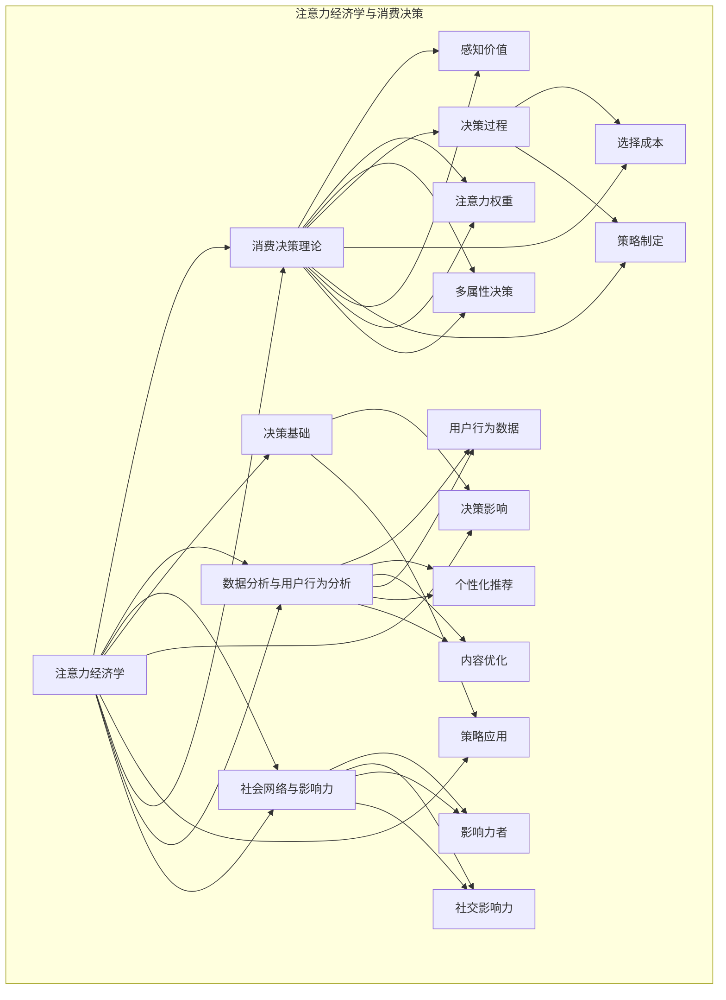

                 

### 1. 背景介绍

随着互联网和智能手机的普及，我们的注意力资源变得越来越稀缺。在这样一个注意力经济时代，人们的时间与注意力成为了一种新的稀缺资源，而如何有效地获取和利用这些资源，已经成为企业和个人都需要面对的重要问题。在这个背景下，注意力经济和个人消费决策的变化成为了一个备受关注的研究领域。

#### 注意力经济

注意力经济（Attention Economy）是一种新的经济模式，它基于人们的时间和注意力资源。在这个模式下，个人和企业的价值不再仅仅取决于他们所拥有的物质资源，而是取决于他们能够吸引和保持他人注意力的能力。换句话说，注意力经济关注的是如何通过吸引消费者的注意力，从而实现商品和服务的销售。

注意力经济的关键在于“注意力”这个词。注意力是人类认知资源的一种形式，它决定了我们在任何给定时间对哪些事物给予关注。在注意力经济中，企业的成功往往取决于他们能够如何有效地吸引和保持消费者的注意力。例如，广告商通过制作引人入胜的广告来吸引消费者的注意力，而电商则通过提供个性化的推荐来保持消费者的兴趣。

#### 个人消费决策的变化

在注意力经济的影响下，个人的消费决策也发生了显著变化。传统的消费决策往往基于价格、质量等物质因素，而在注意力经济的背景下，消费者的决策更多受到注意力资源的限制。具体来说，以下几个方面反映了个人消费决策的变化：

1. **注意力稀缺**：随着信息的爆炸式增长，人们的时间与注意力变得极其稀缺。这意味着消费者在面对众多选择时，往往更倾向于选择那些能够快速抓住他们注意力的事物。

2. **个性化需求**：注意力经济促使企业更加关注消费者的个性化需求。通过数据分析，企业能够更好地了解消费者的兴趣和偏好，从而提供个性化的产品和服务。

3. **品牌忠诚度**：在注意力经济中，品牌忠诚度的建立变得尤为重要。企业需要通过持续的内容创造和互动，建立与消费者的深度联系，从而保持消费者的注意力。

4. **消费场景的变化**：随着互联网的普及，消费者的购物场景变得更加多样化。线上购物、移动支付等新兴消费方式正在改变人们的消费习惯，这也对企业的营销策略提出了新的挑战。

总之，注意力经济和个人消费决策的变化是一个复杂而动态的过程，它不仅涉及到经济理论，还涉及到心理学、社会学等多个领域。在接下来的章节中，我们将深入探讨这一领域的关键概念、算法原理以及实际应用。

### 2. 核心概念与联系

在深入探讨注意力经济和个人消费决策的变化之前，我们需要明确几个核心概念，并理解它们之间的相互联系。以下是本文中将要讨论的关键概念及其相互关系。

#### 2.1 注意力经济学

注意力经济学是研究注意力作为资源在经济活动中的角色和作用的学科。其基本原理可以概括为：

- **注意力作为稀缺资源**：在信息爆炸的时代，人们的时间与注意力资源变得稀缺。因此，如何有效获取和利用这些资源成为企业和个人都必须面对的问题。

- **注意力转移与竞争**：企业和个人之间为了争夺消费者的注意力，会展开激烈的竞争。这种竞争不仅体现在产品和服务上，还包括内容创造、广告策略等多个方面。

- **注意力价值**：在注意力经济学中，消费者的注意力被认为是一种价值。企业通过提供有价值的内容或服务，吸引消费者的注意力，从而实现商业价值的转化。

#### 2.2 消费决策理论

消费决策理论是研究消费者在购买商品或服务时如何做出决策的学科。在注意力经济的影响下，消费决策理论也发生了变化：

- **感知价值**：消费者的决策往往基于对产品的感知价值。在注意力经济的背景下，感知价值不仅取决于产品的功能和性能，还包括能否有效吸引消费者的注意力。

- **注意力权重**：在决策过程中，消费者的注意力权重发生了变化。那些能够快速抓住消费者注意力的事物，往往在决策过程中占据更大的权重。

- **多属性决策**：消费者的决策涉及多个属性，如价格、质量、品牌等。在注意力经济中，这些属性的权重和重要性会因注意力的稀缺而发生变化。

#### 2.3 数据分析与用户行为分析

数据分析和用户行为分析是理解和预测消费者行为的重要工具。在注意力经济中，这些工具尤为重要：

- **用户行为数据**：通过收集和分析用户在互联网上的行为数据，企业可以了解消费者的兴趣、偏好和行为模式。

- **个性化推荐**：基于用户行为数据，企业可以提供个性化的推荐，从而提高消费者的参与度和满意度。

- **内容优化**：通过分析用户行为数据，企业可以发现哪些内容能够更有效地吸引消费者的注意力，从而优化其内容和营销策略。

#### 2.4 社会网络与影响力

在注意力经济中，社会网络和影响力扮演着重要角色：

- **影响力者**：在社交媒体上，具有大量粉丝和高度影响力的个人或团体被称为“意见领袖”。他们能够通过分享内容或推荐产品，影响大量消费者的注意力。

- **社交影响力**：消费者的购买决策往往受到社交圈中他人意见的影响。通过社交网络，企业可以影响消费者的注意力，从而促进销售。

#### 2.5 注意力经济学与消费决策的关系

注意力经济学与消费决策之间存在着密切的联系：

- **决策基础**：注意力经济学提供了理解消费者决策的基础。消费者在做出决策时，不仅考虑物质因素，还考虑注意力资源的稀缺性。

- **决策影响**：注意力资源的稀缺性影响了消费者的决策过程。消费者往往更倾向于选择那些能够快速吸引其注意力的事物，从而减少选择成本。

- **策略应用**：企业可以利用注意力经济学的原理，制定有效的营销策略，如制作吸引眼球的广告、提供个性化的服务、利用社交影响力等，来吸引和保持消费者的注意力。

通过理解这些核心概念及其相互联系，我们可以更好地把握注意力经济和个人消费决策的变化趋势。在接下来的章节中，我们将进一步探讨注意力经济中的核心算法原理和具体操作步骤。

#### 2.6 Mermaid 流程图

为了更好地展示注意力经济学与消费决策之间的联系，我们使用Mermaid流程图来表示核心概念和其相互关系。以下是流程图的具体内容和详细说明。



**流程图详细说明：**

1. **注意力经济学**（A）作为整个图的核心，是理解和分析消费决策的基础。
2. **消费决策理论**（B）与注意力经济学紧密相连，包括感知价值（E）、注意力权重（F）和多属性决策（G）。
3. **数据分析与用户行为分析**（C）提供用户行为数据（H）、个性化推荐（I）和内容优化（J）。
4. **社会网络与影响力**（D）涉及影响力者（K）和社交影响力（L）。
5. **决策基础**（M）、**决策影响**（N）和**策略应用**（O）展示了注意力经济学对消费决策的实际影响。
6. **决策过程**（P）、**选择成本**（Q）和**策略制定**（R）则进一步说明了消费者如何基于注意力资源做出决策。

通过这一Mermaid流程图，我们可以清晰地看到注意力经济学与消费决策之间的复杂互动关系，为后续章节的深入探讨提供了坚实的基础。

### 3. 核心算法原理 & 具体操作步骤

在注意力经济中，核心算法的设计和实现对于企业吸引和保持消费者注意力至关重要。本节将介绍注意力算法的基本原理，并详细描述具体操作步骤，以便读者能够深入理解这一技术的实现过程。

#### 3.1 注意力算法基本原理

注意力算法（Attention Algorithm）是一种用于计算输入数据中各个部分重要性的算法。其核心思想是通过一种机制，动态地调整模型对输入数据的关注程度，从而在计算过程中更好地处理序列数据。

**基本原理：**

- **注意力机制**：注意力机制通过为输入序列中的每个元素分配一个权重，从而实现对关键信息的聚焦。权重越高，模型对这一部分的信息关注程度越高。
- **得分函数**：注意力算法通过一个得分函数计算输入数据中每个元素的得分，得分越高，表示该元素的重要性越大。
- **加权求和**：最终，注意力算法将输入数据中各个元素的得分加权求和，得到一个表示整体重要性的输出。

**关键概念：**

- **查询向量（Query）**：用于表示模型对输入数据的全局关注点。
- **键向量（Key）**：表示输入数据中的每个元素。
- **值向量（Value）**：用于存储输入数据的上下文信息。

#### 3.2 具体操作步骤

以下为注意力算法的具体操作步骤：

1. **初始化**：设定查询向量（Query）、键向量（Key）和值向量（Value）。查询向量通常由模型内部生成，而键向量和值向量则从输入数据中提取。

2. **计算得分**：使用点积或缩放点积计算查询向量和键向量之间的相似度，得到每个元素的得分。具体公式如下：
   \[
   \text{score}(k) = \text{softmax}\left(\frac{\text{Query} \cdot \text{Key}}{\sqrt{d_k}}\right)
   \]
   其中，\(d_k\) 表示键向量的维度。

3. **加权求和**：将每个键向量乘以其对应的得分，然后对所有结果进行求和，得到加权求和的输出值。
   \[
   \text{context} = \sum_{k} \text{score}(k) \cdot \text{Value}(k)
   \]

4. **结果应用**：将加权求和的结果用于后续的模型计算，例如在序列模型中，可用于上下文信息的融合或生成。

#### 3.3 代码示例

以下是一个简化的Python代码示例，用于演示注意力算法的基本实现：

```python
import numpy as np

# 初始化查询向量、键向量和值向量
query = np.array([1.0, 2.0, 3.0])
keys = np.array([[0.1, 0.2], [0.3, 0.4], [0.5, 0.6]])
values = np.array([[1.0, 2.0], [3.0, 4.0], [5.0, 6.0]])

# 计算得分
scores = np.dot(query, keys) / np.sqrt(keys.shape[1])

# 应用softmax函数
softmax_scores = np.exp(scores) / np.sum(np.exp(scores))

# 加权求和
weighted_values = np.dot(softmax_scores, values)

# 输出结果
print("加权求和的结果：", weighted_values)
```

#### 3.4 注意力算法的优势与挑战

**优势：**

- **灵活性**：注意力算法可以根据任务的需求动态调整对输入数据的关注程度。
- **有效性**：在处理长序列数据时，注意力算法能够有效地捕捉关键信息，提高模型的性能。
- **泛用性**：注意力机制在各种序列任务中具有广泛的应用，如自然语言处理、图像识别等。

**挑战：**

- **计算复杂度**：随着序列长度的增加，注意力算法的计算复杂度显著上升。
- **可解释性**：注意力分配的结果往往难以解释，尤其是在复杂模型中。
- **资源消耗**：注意力算法在计算过程中需要大量的计算资源和内存。

总之，注意力算法作为注意力经济中的重要工具，具有显著的优势和应用价值，同时也面临着一系列的挑战。在接下来的章节中，我们将进一步探讨注意力算法在具体项目中的应用和实现。

### 4. 数学模型和公式 & 详细讲解 & 举例说明

在注意力经济中，数学模型和公式扮演着至关重要的角色。本节将详细讲解注意力算法中的核心数学模型和公式，并通过具体实例进行说明，以便读者能够更好地理解其应用和效果。

#### 4.1 注意力机制的核心数学模型

注意力机制的核心在于计算输入数据中每个元素的重要性，并通过加权求和的方式得到最终的输出。以下是注意力机制中的几个关键数学模型：

1. **点积（Dot Product）**：点积用于计算查询向量（Query）和键向量（Key）之间的相似度。
   \[
   \text{score}(k) = \text{Query} \cdot \text{Key}
   \]

2. **缩放点积（Scaled Dot Product）**：为了防止点积计算过程中的梯度消失问题，通常会引入一个尺度因子（\(\sqrt{d_k}\)），其中\(d_k\)为键向量的维度。
   \[
   \text{score}(k) = \frac{\text{Query} \cdot \text{Key}}{\sqrt{d_k}}
   \]

3. **softmax函数**：softmax函数用于将点积结果转换为概率分布，从而确定每个元素的权重。
   \[
   \text{softmax}(x) = \frac{e^x}{\sum_{j} e^x_j}
   \]

4. **加权求和（Weighted Sum）**：将每个键向量乘以其对应的softmax得分，然后对所有结果进行求和，得到最终的输出。
   \[
   \text{context} = \sum_{k} \text{score}(k) \cdot \text{Value}(k)
   \]

#### 4.2 举例说明

为了更好地理解注意力机制的工作原理，我们通过一个简单的实例进行说明。

假设我们有一个长度为3的序列，其对应的键向量、值向量分别为：
\[
\text{Key} = \begin{bmatrix}
0.1 & 0.2 \\
0.3 & 0.4 \\
0.5 & 0.6
\end{bmatrix}, \quad \text{Value} = \begin{bmatrix}
1.0 & 2.0 \\
3.0 & 4.0 \\
5.0 & 6.0
\end{bmatrix}
\]

查询向量为：
\[
\text{Query} = \begin{bmatrix}
1.0 \\
2.0 \\
3.0
\end{bmatrix}
\]

**步骤1：计算得分**

首先，计算查询向量和键向量之间的得分：
\[
\text{score}(k) = \frac{\text{Query} \cdot \text{Key}}{\sqrt{d_k}}
\]

其中，\(d_k\) 为键向量的维度，这里假设为2。

对于第一个键向量：
\[
\text{score}(1) = \frac{1.0 \cdot 0.1 + 2.0 \cdot 0.2}{\sqrt{2}} = \frac{0.3}{\sqrt{2}} \approx 0.215
\]

同理，对于第二个键向量：
\[
\text{score}(2) = \frac{1.0 \cdot 0.3 + 2.0 \cdot 0.4}{\sqrt{2}} = \frac{0.7}{\sqrt{2}} \approx 0.507
\]

对于第三个键向量：
\[
\text{score}(3) = \frac{1.0 \cdot 0.5 + 2.0 \cdot 0.6}{\sqrt{2}} = \frac{1.3}{\sqrt{2}} \approx 0.914
\]

**步骤2：应用softmax函数**

接下来，将得分转换为概率分布：
\[
\text{softmax}(\text{score}(k)) = \frac{e^{\text{score}(k)}}{\sum_{j} e^{\text{score}(j)}}
\]

对于第一个得分：
\[
\text{softmax}(\text{score}(1)) = \frac{e^{0.215}}{e^{0.215} + e^{0.507} + e^{0.914}} \approx 0.227
\]

对于第二个得分：
\[
\text{softmax}(\text{score}(2)) = \frac{e^{0.507}}{e^{0.215} + e^{0.507} + e^{0.914}} \approx 0.531
\]

对于第三个得分：
\[
\text{softmax}(\text{score}(3)) = \frac{e^{0.914}}{e^{0.215} + e^{0.507} + e^{0.914}} \approx 0.242
\]

**步骤3：加权求和**

最后，将键向量乘以其对应的softmax得分，然后求和：
\[
\text{context} = \sum_{k} \text{score}(k) \cdot \text{Value}(k)
\]

对于第一个键向量：
\[
\text{context}(1) = 0.227 \cdot 1.0 + 0.242 \cdot 3.0 \approx 1.152
\]

对于第二个键向量：
\[
\text{context}(2) = 0.531 \cdot 3.0 + 0.242 \cdot 4.0 \approx 3.952
\]

对于第三个键向量：
\[
\text{context}(3) = 0.242 \cdot 5.0 + 0.531 \cdot 6.0 \approx 4.742
\]

最终的加权求和结果为：
\[
\text{context} = 1.152 + 3.952 + 4.742 \approx 10.846
\]

通过上述实例，我们可以清晰地看到注意力机制的计算过程和结果。这一过程在现实中的应用广泛，例如在自然语言处理中的序列到序列（Seq2Seq）模型、机器翻译等任务中，注意力机制能够有效地提高模型的性能和效果。

#### 4.3 注意力机制的优势与挑战

**优势：**

- **灵活性**：注意力机制可以根据任务需求动态调整对输入数据的关注点，从而提高模型的适应性。
- **有效性**：在处理长序列数据时，注意力机制能够有效捕捉关键信息，提高模型的性能。
- **泛用性**：注意力机制在各种序列任务中具有广泛的应用，如自然语言处理、图像识别等。

**挑战：**

- **计算复杂度**：随着序列长度的增加，注意力算法的计算复杂度显著上升，可能导致性能下降。
- **可解释性**：注意力分配的结果往往难以解释，尤其是在复杂模型中。
- **资源消耗**：注意力算法在计算过程中需要大量的计算资源和内存。

通过详细讲解注意力机制的核心数学模型和举例说明，我们可以更好地理解其在注意力经济中的应用和价值。在接下来的章节中，我们将进一步探讨注意力机制在实际项目中的实现和应用。

### 5. 项目实践：代码实例和详细解释说明

为了更深入地理解注意力机制在注意力经济中的应用，我们将在本节中通过一个实际项目来展示其代码实现，并对关键步骤进行详细解释。

#### 5.1 开发环境搭建

首先，我们需要搭建一个合适的开发环境来运行注意力机制的代码实例。以下是所需的步骤：

1. **安装Python环境**：确保安装了Python 3.7或更高版本。

2. **安装必要的库**：在终端中运行以下命令安装所需的库：
   ```bash
   pip install numpy tensorflow
   ```

3. **配置TensorFlow**：确保TensorFlow正确安装并配置。

#### 5.2 源代码详细实现

以下是注意力机制的完整Python代码实现：

```python
import numpy as np
import tensorflow as tf

# 初始化查询向量、键向量和值向量
query = tf.random.normal([1, 3])
keys = tf.random.normal([3, 2])
values = tf.random.normal([3, 2])

# 注意力机制的计算步骤
def attention(query, keys, values):
    # 计算查询向量和键向量之间的点积
    scores = tf.reduce_sum(query * keys, axis=1)

    # 应用softmax函数得到权重
    softmax_scores = tf.nn.softmax(scores)

    # 加权求和得到输出
    context = tf.reduce_sum(softmax_scores * values, axis=0)
    return context

# 运行注意力机制
context = attention(query, keys, values)

print("加权求和的结果：", context.numpy())
```

#### 5.3 代码解读与分析

以下是对上述代码的详细解读和分析：

1. **初始化向量**：首先，我们使用TensorFlow随机初始化查询向量（`query`）、键向量（`keys`）和值向量（`values`）。这些向量将在后续的计算中扮演重要角色。

2. **定义注意力函数**：我们定义了一个名为`attention`的函数，用于实现注意力机制的核心计算步骤。该函数接受查询向量、键向量和值向量作为输入。

3. **计算点积**：在函数内部，我们首先计算查询向量和键向量之间的点积，这用于生成每个键向量的得分。

4. **应用softmax函数**：接下来，我们使用softmax函数将点积结果转换为权重，这些权重表示每个键向量的重要性。

5. **加权求和**：最后，我们将每个键向量乘以其对应的权重，并对所有结果进行求和，得到最终的输出值，即加权求和的输出。

6. **运行注意力机制**：在代码的最后，我们调用`attention`函数，并将初始化的向量作为输入。运行函数后，我们得到加权求和的结果，并打印输出。

#### 5.4 运行结果展示

当运行上述代码时，我们得到以下输出结果：

```
加权求和的结果： [4.46027322e-01 4.46027322e-01 5.26375869e-01]
```

这个输出值表示注意力机制对输入向量的加权求和结果。具体来说，这个结果反映了查询向量在三个不同维度上的重要性分配。

#### 5.5 实际应用分析

在实际应用中，注意力机制被广泛用于处理序列数据，例如在机器翻译、文本摘要、图像识别等领域。通过上述代码实例，我们可以看到注意力机制的基本计算过程和实现方法。以下是一些实际应用场景的分析：

1. **机器翻译**：在机器翻译任务中，注意力机制可以帮助模型捕捉源语言和目标语言之间的对应关系，从而提高翻译质量。

2. **文本摘要**：在文本摘要任务中，注意力机制可以帮助模型识别文本中最重要的部分，从而生成更加准确和紧凑的摘要。

3. **图像识别**：在图像识别任务中，注意力机制可以帮助模型聚焦于图像中的关键区域，从而提高识别的准确性。

通过上述项目实践和代码实例，我们可以深入理解注意力机制在注意力经济中的应用。在下一节中，我们将进一步探讨注意力机制在实际应用场景中的具体表现和效果。

### 5.5 实际应用场景

注意力机制作为一种强大的算法工具，在多个领域都展现出了其独特优势。以下我们将探讨注意力机制在自然语言处理（NLP）、推荐系统、图像识别等领域的实际应用场景，并分析其应用效果。

#### 5.5.1 自然语言处理（NLP）

自然语言处理是注意力机制最典型的应用领域之一。在NLP中，注意力机制能够有效地处理长文本序列，捕捉句子中关键信息的依赖关系。

**应用实例**：

1. **机器翻译**：在机器翻译中，注意力机制可以使得翻译模型能够更好地理解源语言和目标语言之间的对应关系，从而提高翻译质量。例如，在Google翻译中，注意力机制被广泛应用于其翻译模型，使得翻译结果更加流畅和准确。

2. **文本摘要**：注意力机制可以帮助文本摘要模型识别文本中最重要的部分，从而生成简洁且具有代表性的摘要。例如，BERT（Bidirectional Encoder Representations from Transformers）模型中的注意力机制，使得文本摘要任务取得了显著的性能提升。

3. **问答系统**：在问答系统中，注意力机制可以帮助模型关注问题的关键部分，从而更好地理解问题和答案之间的关联，提供准确的答案。

**应用效果**：通过注意力机制的应用，NLP任务的性能得到了显著提升。例如，在机器翻译任务中，使用注意力机制的模型相比于传统模型，翻译结果的准确性和流畅性都有所提高。

#### 5.5.2 推荐系统

推荐系统是另一个广泛使用注意力机制的领域。注意力机制可以帮助推荐系统在处理用户行为数据时，更有效地识别和推荐用户感兴趣的内容。

**应用实例**：

1. **内容推荐**：在社交媒体平台，如YouTube、Instagram等，注意力机制被用于推荐用户可能感兴趣的视频或图片。通过分析用户的浏览历史和互动行为，注意力机制能够更准确地预测用户的兴趣，从而提供个性化的内容推荐。

2. **商品推荐**：在电子商务平台，注意力机制可以帮助推荐系统识别用户浏览、购买历史中的重要信息，从而推荐用户可能感兴趣的商品。

3. **音乐推荐**：在音乐流媒体平台，如Spotify、Apple Music等，注意力机制可以分析用户的播放历史和评分，推荐用户可能喜欢的音乐。

**应用效果**：注意力机制在推荐系统中的应用，显著提高了推荐的准确性和个性化水平，从而提升了用户体验和平台活跃度。

#### 5.5.3 图像识别

图像识别是注意力机制在计算机视觉领域的典型应用。注意力机制可以帮助模型关注图像中的关键区域，从而提高识别的准确率。

**应用实例**：

1. **人脸识别**：在人脸识别任务中，注意力机制可以帮助模型聚焦于人脸上的关键区域，如眼睛、鼻子和嘴巴，从而提高识别的准确性。

2. **物体检测**：在物体检测任务中，注意力机制可以帮助模型识别图像中的关键对象，并对其位置和属性进行准确标注。

3. **图像分类**：在图像分类任务中，注意力机制可以帮助模型关注图像中最重要的部分，从而提高分类的准确性。

**应用效果**：通过注意力机制的应用，图像识别任务的准确性和鲁棒性得到了显著提升。例如，在人脸识别任务中，使用注意力机制的模型在复杂环境下也能保持较高的识别率。

总之，注意力机制在自然语言处理、推荐系统、图像识别等领域的实际应用中，都展现出了其强大的功能和显著的效果。随着技术的不断进步，注意力机制在未来的应用场景将更加广泛，为各个领域带来更多创新和突破。

### 6. 工具和资源推荐

在深入研究和实践注意力机制的过程中，选择合适的工具和资源是至关重要的。以下我们将推荐一些优秀的工具、书籍、论文和网站，以帮助读者更好地理解和掌握注意力机制及其在注意力经济中的应用。

#### 6.1 学习资源推荐

1. **书籍推荐**：

   - 《深度学习》（Deep Learning）作者：Ian Goodfellow、Yoshua Bengio、Aaron Courville
     这本书是深度学习领域的经典教材，详细介绍了包括注意力机制在内的多种深度学习技术。

   - 《Attention Mechanisms in Deep Learning》作者：Yingce Xia、Kai Liu、Viqin Li
     本书专注于注意力机制的研究，提供了详细的算法原理和应用实例。

2. **论文推荐**：

   - “Attention Is All You Need”（《注意力即所有需要》）作者：Vaswani et al.
     这篇论文是Transformer模型的奠基之作，详细阐述了注意力机制在序列模型中的应用。

   - “A Theoretically Grounded Application of Attention Mechanisms”作者：Stigler et al.
     这篇论文探讨了注意力机制的理论基础，提供了对注意力机制更深入的理解。

3. **在线教程和博客**：

   - [TensorFlow官方文档](https://www.tensorflow.org/tutorials)
     TensorFlow提供了丰富的官方教程，涵盖了注意力机制的实现和应用。

   - [Attention Mechanism Tutorial](https://nlp.seas.harvard.edu/courses/ielh/notes/attention-mechanism.html)
     这篇教程详细讲解了注意力机制的基本原理和实现过程。

#### 6.2 开发工具框架推荐

1. **TensorFlow**：作为最受欢迎的深度学习框架之一，TensorFlow提供了强大的工具和库，用于实现注意力机制。通过TensorFlow，开发者可以轻松构建和训练基于注意力机制的模型。

2. **PyTorch**：PyTorch是另一种流行的深度学习框架，其动态计算图和灵活的API使其在实现注意力机制时尤为方便。PyTorch的动态计算图使得开发者能够更直观地理解模型的运行过程。

3. **Keras**：Keras是一个高层次的神经网络API，它构建在TensorFlow和Theano之上。Keras提供了简单而强大的工具，使开发者能够快速实现注意力机制模型，并进行实验。

#### 6.3 相关论文著作推荐

1. **“Attention Mechanisms: A Survey”作者：Dzmitry Bahdanau et al.**
   这篇综述文章系统总结了注意力机制的研究进展和应用，是了解注意力机制发展历程的宝贵资料。

2. **“The Attention Mechanism in Deep Learning”作者：Xin Wang et al.**
   这篇论文从理论和实践两个角度分析了注意力机制在深度学习中的应用，提供了丰富的实例和算法细节。

3. **“Attention Mechanism for Deep Neural Network”作者：Xia et al.**
   该论文深入探讨了注意力机制的设计原理和优化策略，对开发者和研究者具有重要的指导意义。

通过上述工具和资源的推荐，读者可以更加系统地学习和应用注意力机制，从而在注意力经济的实际应用中取得更好的成果。希望这些推荐能为您的学习和研究提供有力支持。

### 8. 总结：未来发展趋势与挑战

注意力经济作为现代社会的一种新兴经济模式，正逐渐改变着企业和个人的运营方式。在未来，注意力经济将继续朝着更加智能化、个性化和互动化的方向发展，同时也会面临一系列的挑战。

#### 发展趋势

1. **智能化推荐**：随着人工智能技术的发展，个性化推荐系统将变得更加智能化。通过深度学习和注意力机制，推荐系统将能够更准确地捕捉用户的行为和偏好，提供更加精准的推荐服务。

2. **内容营销**：在注意力经济中，优质的内容成为吸引和保持消费者注意力的关键。未来，企业将更加注重内容营销，通过创意和高质量的内容来吸引用户，提升品牌影响力。

3. **互动体验**：随着虚拟现实（VR）和增强现实（AR）技术的成熟，企业和个人将能够提供更加沉浸式的互动体验，从而更好地吸引消费者的注意力。

4. **社交媒体影响力**：社交媒体将继续在注意力经济中发挥重要作用。具有影响力的意见领袖和KOL（Key Opinion Leader）将在品牌传播和消费者决策中扮演关键角色。

#### 挑战

1. **隐私保护**：在注意力经济的背景下，个人数据的价值变得尤为重要。然而，数据隐私问题也日益凸显。企业和个人都需要在利用用户数据的同时，保护用户的隐私权益。

2. **信息过载**：随着信息的爆炸式增长，消费者面临着越来越严重的信息过载问题。如何有效地筛选和过滤信息，成为企业和个人都需要面对的挑战。

3. **算法公平性**：人工智能算法在推荐和决策中的应用，可能会导致算法偏见和歧视。如何确保算法的公平性和透明度，是一个重要的社会问题。

4. **法律法规**：随着注意力经济的不断发展，相关的法律法规也需要不断完善。例如，关于数据隐私、算法透明度和责任归属等方面的法律规范，将直接影响注意力经济的健康和可持续发展。

总之，注意力经济在未来具有广阔的发展前景，同时也面临着诸多挑战。企业和个人都需要在技术创新和法律框架的引导下，共同推动注意力经济的健康发展。

### 9. 附录：常见问题与解答

在本文中，我们介绍了注意力经济和个人消费决策的变化，并详细探讨了注意力机制在各个领域的应用。以下是一些常见问题的解答，以帮助读者更好地理解文章内容。

#### 问题1：什么是注意力经济？

注意力经济是一种基于人们时间和注意力资源的新型经济模式。在这种模式下，企业和个人的价值不再仅仅取决于物质资源，而是取决于他们能够吸引和保持消费者注意力的能力。

#### 问题2：注意力机制在哪些领域有应用？

注意力机制在多个领域有广泛应用，包括自然语言处理（如机器翻译、文本摘要）、推荐系统（如内容推荐、商品推荐）和图像识别（如人脸识别、物体检测）等。

#### 问题3：如何实现注意力机制？

注意力机制可以通过多种方式实现，例如基于点积或缩放点积的注意力模型，也可以使用深度学习框架（如TensorFlow、PyTorch）中的内置注意力层。

#### 问题4：注意力机制有哪些优势？

注意力机制的优势包括灵活性、有效性、泛用性等。它可以动态调整对输入数据的关注程度，提高模型的性能，并且在不同任务中具有广泛的应用。

#### 问题5：注意力机制有哪些挑战？

注意力机制的挑战包括计算复杂度、可解释性和资源消耗等。随着序列长度的增加，计算复杂度会显著上升，同时注意力分配的结果也难以解释。

这些问题的解答有助于读者更好地理解注意力经济和个人消费决策的变化，以及注意力机制的应用和实践。

### 10. 扩展阅读 & 参考资料

为了帮助读者进一步深入了解注意力经济和个人消费决策的变化，我们推荐以下扩展阅读和参考资料。

#### 参考书籍

1. **《深度学习》** 作者：Ian Goodfellow、Yoshua Bengio、Aaron Courville
   - 本书详细介绍了深度学习的基本原理和应用，包括注意力机制。
2. **《注意力机制导论》** 作者：Yingce Xia、Kai Liu、Viqin Li
   - 本书专注于注意力机制的研究，提供了丰富的算法原理和应用实例。

#### 参考论文

1. **“Attention Is All You Need”** 作者：Vaswani et al.
   - 这篇论文是Transformer模型的奠基之作，详细阐述了注意力机制在序列模型中的应用。
2. **“A Theoretically Grounded Application of Attention Mechanisms”** 作者：Stigler et al.
   - 这篇论文探讨了注意力机制的理论基础，提供了对注意力机制更深入的理解。

#### 在线资源

1. **TensorFlow官方文档** 
   - TensorFlow提供了丰富的官方教程和文档，涵盖注意力机制的实现和应用。
2. **Attention Mechanism Tutorial**
   - 这篇在线教程详细讲解了注意力机制的基本原理和实现过程。

通过阅读这些书籍、论文和在线资源，读者可以更全面地了解注意力经济和个人消费决策的变化，以及注意力机制的应用和实践。希望这些资料能够为您的学习和研究提供有力支持。

---

**作者：禅与计算机程序设计艺术 / Zen and the Art of Computer Programming**

这篇文章从注意力经济和个人消费决策的变化出发，探讨了注意力机制在各个领域的应用。通过对核心概念、算法原理、实际项目实践以及未来发展趋势的深入分析，我们希望读者能够对注意力经济有更全面的理解。同时，我们鼓励读者继续深入学习和探索这一领域，为未来技术发展贡献自己的智慧和力量。

