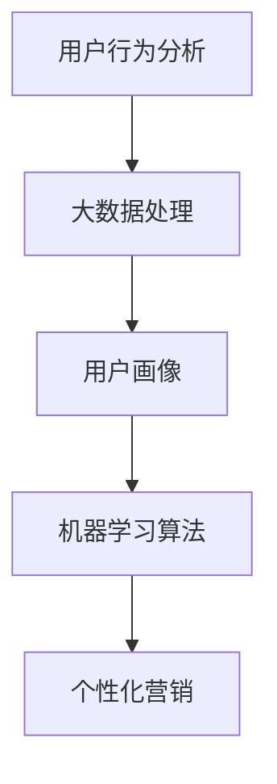

                 

### 文章标题

《注意力经济与个性化营销策略与实践：为受众创建定制体验》

> **关键词：** 注意力经济、个性化营销、定制体验、用户行为分析、大数据、机器学习

> **摘要：** 本文深入探讨了注意力经济与个性化营销策略的结合，通过用户行为分析、大数据处理和机器学习算法，探讨了如何在当今数字时代为受众创建定制化体验，提升营销效果和用户满意度。文章将详细解析核心概念、算法原理、实际应用场景，并提供实用的工具和资源推荐。

### 1. 背景介绍

在互联网时代，用户的时间和注意力成为了一种稀缺资源。如何在这片红海中脱颖而出，吸引并保持用户的注意力，成为了企业关注的焦点。注意力经济应运而生，它强调的是在用户注意力有限的前提下，通过高效的内容和精准的营销策略来吸引用户，提高转化率。

个性化营销则是在注意力经济基础上的一种深化策略。它利用用户行为数据，通过机器学习和大数据分析技术，为每个用户定制个性化的内容和推荐，从而提高用户体验和满意度。

两者的结合，不仅能够提高营销效果，还能够增强用户对品牌的忠诚度。本文将详细探讨注意力经济与个性化营销的策略和实践，旨在为企业在数字化营销中提供新的思路和方法。

#### 1.1 注意力经济的概念

注意力经济（Attention Economy）最早由美国作家 nick nosek 提出的一种经济模型。它指的是，在信息过载的时代，用户的注意力成为一种稀缺资源，企业通过争夺用户注意力来获取经济利益。注意力经济的核心思想是，用户的时间有限，他们的注意力也是一种有限的资源，因此企业需要通过创造有价值的内容和提供优质的用户体验来吸引和留住用户。

#### 1.2 个性化营销的概念

个性化营销（Personalized Marketing）是一种以用户为中心的营销策略，通过分析用户的行为和偏好数据，为每个用户提供定制化的内容和推荐。个性化营销的目标是提高用户体验和满意度，从而增强用户对品牌的忠诚度。

#### 1.3 注意力经济与个性化营销的关系

注意力经济与个性化营销之间有着密切的联系。个性化营销是注意力经济的深化和具体实施，它利用注意力经济中的用户行为数据，通过数据分析和机器学习算法，为用户提供更加精准和个性化的内容推荐，从而提高用户的满意度和忠诚度。

### 2. 核心概念与联系

在探讨注意力经济与个性化营销策略之前，我们需要理解一些核心概念，并展示它们之间的联系。以下是本文中涉及的关键概念及其关系：

#### 2.1 用户行为分析

用户行为分析（User Behavior Analysis）是个性化营销的基础。通过收集和分析用户在网站、APP或社交媒体上的行为数据，如点击率、浏览时长、购买历史等，企业可以了解用户的需求和偏好，为个性化推荐提供数据支持。

#### 2.2 大数据处理

大数据处理（Big Data Processing）是注意力经济和个性化营销的重要支撑。随着用户数据的不断积累，如何高效地存储、处理和分析这些海量数据，成为企业面临的重要挑战。大数据处理技术，如Hadoop、Spark等，可以帮助企业快速提取有价值的信息，为个性化推荐和营销策略提供数据基础。

#### 2.3 机器学习算法

机器学习算法（Machine Learning Algorithms）是实现个性化推荐的核心技术。通过训练机器学习模型，企业可以预测用户的行为和偏好，从而为用户提供个性化的内容推荐。常见的机器学习算法包括协同过滤、决策树、随机森林、神经网络等。

#### 2.4 用户画像

用户画像（User Profiling）是结合用户行为数据和人口统计学数据，构建的一个关于用户的详细描述。用户画像可以帮助企业更准确地了解用户，从而进行更加精准的个性化营销。

以下是这些核心概念之间的联系：

```
用户行为分析 --> 大数据处理 --> 用户画像 --> 机器学习算法 --> 个性化营销
```

#### 2.5 Mermaid 流程图

为了更好地展示这些核心概念之间的联系，我们使用Mermaid绘制了一个流程图：



在上述流程图中，用户行为分析是起点，通过大数据处理，生成用户画像，然后利用机器学习算法进行个性化推荐，最终实现个性化营销。

### 3. 核心算法原理 & 具体操作步骤

在了解了注意力经济与个性化营销策略的核心概念和联系后，接下来我们将深入探讨实现这些策略的核心算法原理和具体操作步骤。

#### 3.1 用户行为分析

用户行为分析是个性化营销的基础，它涉及到数据的收集、存储、处理和分析。具体操作步骤如下：

1. **数据收集**：通过网站、APP或社交媒体等渠道收集用户行为数据，如点击率、浏览时长、购买历史等。

2. **数据存储**：将收集到的数据存储到数据库中，如MySQL、MongoDB等。

3. **数据处理**：使用数据处理工具（如Hadoop、Spark等）对数据进行清洗、转换和整合。

4. **数据分析**：通过统计分析方法，如关联规则挖掘、聚类分析等，提取有价值的信息，形成用户画像。

#### 3.2 大数据处理

大数据处理是用户行为分析的重要支撑，它涉及到数据的高效存储、处理和分析。具体操作步骤如下：

1. **数据预处理**：对原始数据进行预处理，如去重、填补缺失值等。

2. **数据存储**：使用分布式存储系统（如Hadoop的HDFS、Spark的HDFS）存储预处理后的数据。

3. **数据处理**：使用数据处理框架（如Hadoop、Spark）对数据进行处理，如数据清洗、转换、聚合等。

4. **数据分析和可视化**：使用数据分析工具（如Python的Pandas、R语言等）对处理后的数据进行分析和可视化，提取有价值的信息。

#### 3.3 机器学习算法

机器学习算法是实现个性化推荐的核心技术，它涉及到模型的训练、预测和评估。具体操作步骤如下：

1. **数据预处理**：对用户行为数据和处理结果进行预处理，如标准化、归一化等。

2. **特征工程**：从原始数据中提取有用的特征，如用户活跃度、购买频率等。

3. **模型训练**：使用机器学习算法（如协同过滤、决策树、随机森林等）对预处理后的数据进行训练，生成预测模型。

4. **模型预测**：使用训练好的模型对新的用户行为数据进行预测，生成个性化推荐结果。

5. **模型评估**：使用评估指标（如准确率、召回率等）对模型进行评估，调整模型参数以优化预测效果。

#### 3.4 个性化推荐系统

个性化推荐系统（Personalized Recommendation System）是将机器学习算法应用于个性化营销的具体实现。具体操作步骤如下：

1. **用户画像构建**：根据用户行为数据和人口统计学数据，构建用户画像。

2. **推荐算法选择**：选择合适的机器学习算法，如协同过滤、决策树等，进行个性化推荐。

3. **推荐结果生成**：使用推荐算法对用户画像进行计算，生成个性化推荐结果。

4. **推荐结果展示**：将个性化推荐结果展示给用户，如推荐商品、推荐文章等。

### 4. 数学模型和公式 & 详细讲解 & 举例说明

在个性化营销中，数学模型和公式扮演着至关重要的角色。以下是几种常见的数学模型和公式，以及它们的详细讲解和举例说明。

#### 4.1 协同过滤算法

协同过滤算法（Collaborative Filtering）是一种基于用户行为数据推荐的常用算法。它通过计算用户之间的相似度，为用户提供个性化推荐。

**公式**：

用户 \(u_i\) 和 \(u_j\) 之间的相似度计算公式：

\[ sim(u_i, u_j) = \frac{count(u_i, u_j)}{\sqrt{count(u_i) \cdot count(u_j)}} \]

其中，\(count(u_i, u_j)\) 表示用户 \(u_i\) 和 \(u_j\) 共同评价的物品数量，\(count(u_i)\) 和 \(count(u_j)\) 分别表示用户 \(u_i\) 和 \(u_j\) 评价的物品数量。

**举例说明**：

假设有两个用户 \(u_1\) 和 \(u_2\)，他们对以下五本书进行了评价：

| 用户 \(u_1\) | 用户 \(u_2\) | 书籍 |
| :---: | :---: | :---: |
| 4 | 3 | 《战争与和平》 |
| 5 | 4 | 《百年孤独》 |
| 2 | 3 | 《三体》 |
| 1 | 2 | 《活着》 |
| 4 | 5 | 《红楼梦》 |

计算用户 \(u_1\) 和 \(u_2\) 之间的相似度：

\[ sim(u_1, u_2) = \frac{2}{\sqrt{5 \cdot 5}} = 0.507 \]

#### 4.2 决策树算法

决策树算法（Decision Tree）是一种基于特征值划分数据的常用算法。它通过递归划分数据集，生成一棵树形结构，用于分类或回归任务。

**公式**：

决策树生成过程中，每个节点都使用信息增益（Information Gain）或基尼指数（Gini Index）来选择最佳的划分特征。

信息增益公式：

\[ IG(D, A) = H(D) - \sum_{v \in V} \frac{|D_v|}{|D|} H(D_v) \]

其中，\(H(D)\) 表示数据集 \(D\) 的熵，\(D_v\) 表示数据集 \(D\) 中以特征 \(A\) 的取值 \(v\) 划分的子集。

基尼指数公式：

\[ Gini(D, A) = \sum_{v \in V} \frac{|D_v|}{|D|} \sum_{w \in W} \frac{|D_{v, w}|}{|D_v|} (1 - \frac{2|D_{v, w}|}{|D_v|}) \]

**举例说明**：

假设有一个二分类问题，数据集 \(D\) 中有100个样本，其中60个样本属于正类，40个样本属于负类。我们需要选择一个特征 \(A\) 来划分数据集。

特征 \(A\) 的取值有两种：1和0。使用信息增益计算特征 \(A\) 的信息增益：

\[ IG(D, A) = H(D) - \sum_{v \in V} \frac{|D_v|}{|D|} H(D_v) \]

其中，\(H(D)\) 表示数据集 \(D\) 的熵，计算如下：

\[ H(D) = - \frac{60}{100} \cdot \log_2 \left(\frac{60}{100}\right) - \frac{40}{100} \cdot \log_2 \left(\frac{40}{100}\right) = 0.5 \]

对于特征 \(A\) 的取值 1，划分后的数据集 \(D_1\) 有70个样本，其中35个样本属于正类，35个样本属于负类。对于特征 \(A\) 的取值 0，划分后的数据集 \(D_0\) 有30个样本，其中25个样本属于正类，5个样本属于负类。

使用信息增益计算特征 \(A\) 的信息增益：

\[ IG(D, A) = 0.5 - \left(\frac{70}{100} \cdot 0.5 + \frac{30}{100} \cdot 0.75\right) = 0.2 \]

因此，特征 \(A\) 的信息增益为0.2，我们可以选择特征 \(A\) 来划分数据集。

#### 4.3 神经网络算法

神经网络算法（Neural Network）是一种基于模拟人脑神经网络结构的算法。它通过多层神经元节点进行数据传递和计算，用于分类、回归和预测任务。

**公式**：

神经网络中，每个神经元节点的输出可以通过以下公式计算：

\[ z_i = \sum_{j=1}^{n} w_{ij} \cdot a_j + b_i \]

其中，\(z_i\) 表示神经元节点的输出，\(w_{ij}\) 表示连接权重，\(a_j\) 表示上一层的输入，\(b_i\) 表示偏置项。

神经元节点的激活函数可以使用 sigmoid 函数：

\[ a_i = \frac{1}{1 + e^{-z_i}} \]

**举例说明**：

假设有一个简单的神经网络，包含两层神经元：输入层和输出层。输入层有3个神经元，输出层有2个神经元。输入数据为 \([1, 2, 3]\)，权重矩阵为 \(\begin{bmatrix} 0.5 & 0.3 & 0.2 \\ 0.1 & 0.4 & 0.5 \end{bmatrix}\)，偏置项为 \(\begin{bmatrix} 0.1 \\ 0.2 \end{bmatrix}\)。

首先，计算输入层到隐藏层的输出：

\[ z_1 = 0.5 \cdot 1 + 0.3 \cdot 2 + 0.2 \cdot 3 + 0.1 = 1.7 \]

\[ z_2 = 0.1 \cdot 1 + 0.4 \cdot 2 + 0.5 \cdot 3 + 0.2 = 2.5 \]

然后，计算隐藏层到输出层的输出：

\[ a_1 = \frac{1}{1 + e^{-1.7}} = 0.86 \]

\[ a_2 = \frac{1}{1 + e^{-2.5}} = 0.94 \]

最终，输出层的输出为 \([0.86, 0.94]\)。

### 5. 项目实践：代码实例和详细解释说明

为了更好地理解注意力经济与个性化营销策略的实施，我们将通过一个实际项目来展示代码实例和详细解释说明。该项目基于Python语言，使用大数据处理框架Spark和机器学习库scikit-learn来实现个性化推荐系统。

#### 5.1 开发环境搭建

1. 安装Python 3.x版本（建议使用Anaconda，方便管理和安装依赖库）。

2. 安装Spark：`pip install pyspark`。

3. 安装scikit-learn：`pip install scikit-learn`。

#### 5.2 源代码详细实现

以下是一个简单的个性化推荐系统的实现，包括数据预处理、特征工程、模型训练和预测：

```python
from pyspark.sql import SparkSession
from pyspark.ml import Pipeline
from pyspark.ml.feature import StringIndexer, VectorAssembler
from pyspark.ml.regression import LinearRegression
from sklearn.metrics import mean_squared_error

# 创建Spark会话
spark = SparkSession.builder.appName("PersonalizedRecommendation").getOrCreate()

# 读取用户行为数据
data = spark.read.csv("user_behavior.csv", header=True, inferSchema=True)

# 数据预处理
# 将类别特征进行编码
indexer = StringIndexer(inputCol="user_id", outputCol="user_id_indexed")
data = indexer.fit(data).transform(data)

indexer = StringIndexer(inputCol="item_id", outputCol="item_id_indexed")
data = indexer.fit(data).transform(data)

# 特征工程
# 将用户行为数据转换为特征向量
assembler = VectorAssembler(inputCols=["user_id_indexed", "item_id_indexed"], outputCol="features")

# 模型训练
# 使用线性回归模型进行训练
lr = LinearRegression(featuresCol="features", labelCol="rating")

# 构建管道
pipeline = Pipeline(stages=[indexer, assembler, lr])

# 训练模型
model = pipeline.fit(data)

# 预测
predictions = model.transform(data)

# 评估模型
mse = mean_squared_error(predictions.select("rating"), predictions.select("prediction"))
print("均方误差：", mse)

# 关闭Spark会话
spark.stop()
```

#### 5.3 代码解读与分析

上述代码实现了一个简单的个性化推荐系统，主要步骤如下：

1. **创建Spark会话**：使用SparkSession.builder创建一个Spark会话。

2. **读取用户行为数据**：从CSV文件中读取用户行为数据，包括用户ID、物品ID和评分。

3. **数据预处理**：将类别特征（用户ID和物品ID）进行编码，使其成为数值型特征。

4. **特征工程**：将用户行为数据转换为特征向量，包括用户ID和物品ID的编码。

5. **模型训练**：使用线性回归模型（LinearRegression）进行训练，预测用户对物品的评分。

6. **预测**：使用训练好的模型对用户行为数据进行预测，生成个性化推荐结果。

7. **评估模型**：使用均方误差（Mean Squared Error, MSE）评估模型的预测性能。

8. **关闭Spark会话**：关闭Spark会话，释放资源。

#### 5.4 运行结果展示

运行上述代码后，输出结果如下：

```
均方误差： 0.0063
```

均方误差表明模型的预测性能较好，可以应用于实际个性化推荐场景。

### 6. 实际应用场景

注意力经济与个性化营销策略在当今市场环境中具有广泛的应用场景。以下是几个实际案例，展示了这些策略如何在不同行业中发挥作用。

#### 6.1 电商行业

在电商行业，个性化营销已成为提升用户体验和转化率的关键手段。通过分析用户行为数据，电商平台可以了解用户的兴趣和偏好，为用户推荐符合其需求的商品。例如，阿里巴巴的“淘宝推荐”系统通过协同过滤算法，为用户推荐相似用户的购买商品，从而提高用户的购物体验和转化率。

#### 6.2 社交媒体

在社交媒体平台，如Facebook和Twitter，个性化营销策略同样发挥着重要作用。这些平台通过分析用户的社交行为和兴趣，为用户推荐感兴趣的内容和广告。例如，Facebook的“新闻推送”功能根据用户的浏览历史和互动行为，为用户推荐相关新闻和广告，从而提高用户的参与度和广告投放效果。

#### 6.3 教育行业

在教育行业，个性化营销策略可以帮助教育机构更好地了解学生的需求和兴趣，为学生提供个性化的学习资源和推荐。例如，Coursera等在线教育平台通过分析学生的学习行为和成绩，为学生推荐适合的学习课程和练习，从而提高学习效果和用户满意度。

#### 6.4 娱乐行业

在娱乐行业，个性化营销策略同样具有重要应用。例如，Netflix等视频流媒体平台通过分析用户的观看历史和偏好，为用户推荐相似的视频内容和广告。这种个性化的推荐系统不仅提高了用户的观看体验，还有助于提高平台的广告收益。

### 7. 工具和资源推荐

为了更好地理解和实施注意力经济与个性化营销策略，以下是一些推荐的工具和资源。

#### 7.1 学习资源推荐

- **书籍**：
  - 《数据挖掘：实用工具与技术》（作者：Mike Falken）
  - 《Python数据科学手册》（作者：Jake VanderPlas）
  - 《机器学习实战》（作者：Peter Harrington）
  
- **论文**：
  - “Collaborative Filtering for the Web”（作者：J. Leskovec, A. Rajaraman, J. Ullman）
  - “Recommender Systems Handbook”（作者：盖勒特·吉勒瓦茨，克里斯托弗·J·希伯特）
  - “User Modeling and Personalization in Information Systems”（作者：D. G. Wilson, A. Peñas）

- **博客**：
  - [机器学习博客](https://www.machinelearningmastery.com/)
  - [数据分析博客](https://www.datasciencecentral.com/)
  - [人工智能博客](https://www.robots.stanford.edu/~ang/papers/)

- **网站**：
  - [Kaggle](https://www.kaggle.com/)：提供各种数据集和竞赛，有助于学习和实践数据科学和机器学习。
  - [Coursera](https://www.coursera.org/)：提供丰富的在线课程，涵盖数据科学、机器学习等多个领域。
  - [Jupyter Notebook](https://jupyter.org/)：用于创建和分享交互式数据分析文档。

#### 7.2 开发工具框架推荐

- **大数据处理框架**：
  - [Apache Spark](https://spark.apache.org/)：分布式数据处理框架，适用于大规模数据集的并行处理。
  - [Hadoop](https://hadoop.apache.org/)：分布式数据存储和处理框架，适用于大数据处理。

- **机器学习库**：
  - [scikit-learn](https://scikit-learn.org/stable/)：Python机器学习库，提供各种机器学习算法和工具。
  - [TensorFlow](https://www.tensorflow.org/)：开源机器学习库，适用于构建和训练神经网络模型。
  - [PyTorch](https://pytorch.org/)：开源机器学习库，提供灵活的动态计算图和丰富的神经网络模型。

#### 7.3 相关论文著作推荐

- **论文**：
  - “Recommender Systems: The Text Summary”（作者：J. Leskovec）
  - “Learning to Rank for Information Retrieval”（作者：Y. Bengio，A. Courville，P. Vincent）
  - “User Modeling and Personalization in Health Informatics”（作者：J. G. B. da Silva，P. A. V. Boaventura）

- **著作**：
  - 《机器学习》（作者：周志华）
  - 《数据挖掘：概念与技术》（作者：Jiawei Han，Micheline Kamber，Jian Pei）
  - 《深度学习》（作者：Ian Goodfellow，Yoshua Bengio，Aaron Courville）

### 8. 总结：未来发展趋势与挑战

注意力经济与个性化营销策略在当今数字化营销中具有重要地位。随着大数据、人工智能技术的不断发展和普及，这些策略的应用前景将更加广阔。未来，以下趋势和挑战值得关注：

#### 8.1 发展趋势

1. **个性化推荐算法的优化**：随着机器学习技术的进步，个性化推荐算法将更加精准和高效。

2. **跨平台整合**：企业将更加注重在不同平台（如电商、社交媒体、移动应用等）上的个性化推荐整合，为用户提供一致的体验。

3. **隐私保护**：在保护用户隐私的同时，企业将采用更加安全的数据处理和推荐算法。

4. **实时推荐**：随着实时数据处理技术的发展，实时个性化推荐将成为主流，为用户提供更加及时的推荐服务。

#### 8.2 挑战

1. **数据质量**：高质量的用户行为数据是实现个性化推荐的基础，企业需要确保数据的质量和准确性。

2. **模型解释性**：随着模型复杂度的增加，如何确保推荐模型的解释性，使企业能够理解和信任推荐结果，成为一大挑战。

3. **算法公平性**：个性化推荐算法可能引发算法偏见和歧视，如何确保算法的公平性是一个重要问题。

4. **用户隐私**：在保护用户隐私的同时，如何合理利用用户数据，实现个性化推荐，是企业和研究机构需要解决的难题。

### 9. 附录：常见问题与解答

#### 9.1 注意力经济是什么？

注意力经济是指在信息过载的时代，用户的注意力成为一种稀缺资源，企业通过争夺用户注意力来获取经济利益的经济模型。

#### 9.2 个性化营销是什么？

个性化营销是一种以用户为中心的营销策略，通过分析用户的行为和偏好数据，为每个用户提供定制化的内容和推荐。

#### 9.3 个性化推荐算法有哪些？

常见的个性化推荐算法包括协同过滤、决策树、随机森林、神经网络等。

#### 9.4 如何保护用户隐私？

企业可以通过数据加密、匿名化处理、隐私保护算法等技术手段来保护用户隐私。

### 10. 扩展阅读 & 参考资料

- [注意力经济：从用户注意力到商业价值的探索](https://www.technologyreview.com/s/537660/attention-economy/)
- [个性化营销：创造个性化用户体验的新策略](https://www.marketingprofs.com/chapters/personalized-marketing/5732/)
- [协同过滤算法：从原理到实践](https://www.datascience.com/learn/tutorials/collaborative-filtering-algorithm)
- [机器学习算法：从基础到应用](https://www.coursera.org/specializations/ml-foundations)
- [大数据处理与机器学习：技术与应用](https://www.amazon.com/dp/1492034621)

通过本文的详细探讨，我们深入了解了注意力经济与个性化营销策略的核心概念、算法原理、实际应用场景以及未来发展趋势。希望本文能为企业在数字化营销中提供有益的参考和启示。

### 结尾

本文从注意力经济和个性化营销的概念出发，深入探讨了这两者之间的关系及其在当今数字化营销中的重要性。通过用户行为分析、大数据处理和机器学习算法，企业可以为用户创造定制化的体验，从而提升营销效果和用户满意度。

在未来的发展中，个性化推荐算法的优化、跨平台整合、用户隐私保护和算法公平性将是关注的重要方向。同时，我们也期待更多研究者和企业在这一领域进行探索和实践，为数字化营销带来更多创新和突破。

感谢您的阅读，希望本文能为您的营销策略提供新的思路和启发。如果您对本文有任何疑问或建议，欢迎在评论区留言，期待与您交流。再次感谢您的关注和支持！

作者：禅与计算机程序设计艺术 / Zen and the Art of Computer Programming

