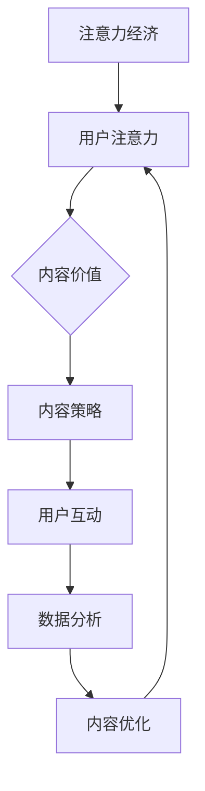

                 

### 1. 背景介绍

#### 注意力经济：现代社会的核心资源

随着信息技术的飞速发展，互联网逐渐渗透到人类生活的各个方面。在这个信息爆炸的时代，人们获取信息的渠道变得前所未有的丰富，但也随之带来了信息过载的问题。为了在浩瀚的信息海洋中找到有价值的内容，人们开始更加注重内容的质量和相关性。由此，一个崭新的经济概念——“注意力经济”应运而生。

注意力经济是指人们为了获取信息所付出的关注、时间、精力的经济价值。在互联网时代，注意力成为了比金钱更珍贵的资源。各大平台和企业纷纷将注意力作为争夺的焦点，通过各种手段吸引并留住用户的注意力。这种经济模式的出现，不仅改变了市场的竞争格局，也为内容创作者和传播者提出了新的挑战。

#### 内容策略：争夺注意力的关键

在注意力经济下，内容策略成为了一种至关重要的竞争手段。内容策略是指通过有计划、有目的地创作、传播和优化内容，以吸引并留住目标受众的方法。一个成功的策略需要充分考虑用户的需求、兴趣和行为习惯，从而创作出具有吸引力和参与度高的内容。

内容策略的制定和执行涉及多个方面，包括内容创作、内容传播、用户互动和数据分析等。其中，内容创作是核心，决定了内容的价值和质量；内容传播是关键，决定了内容的覆盖面和影响力；用户互动是纽带，增强了用户对内容的黏性和忠诚度；数据分析是支撑，为内容策略的优化提供了依据和方向。

#### 本文目的和结构

本文旨在深入探讨注意力经济与内容策略的关系，分析其核心概念和原理，并探讨如何在实践中创建吸引并留住受众的参与内容。文章将分为以下几个部分：

1. 背景介绍：阐述注意力经济和内容策略的起源和发展，为后续讨论打下基础。
2. 核心概念与联系：详细解释注意力经济和内容策略的核心概念，并使用流程图展示其关系。
3. 核心算法原理与具体操作步骤：介绍创建参与内容的核心算法和具体操作步骤。
4. 数学模型和公式：分析注意力经济的数学模型和关键公式，并举例说明。
5. 项目实践：通过具体代码实例展示内容策略的实践过程。
6. 实际应用场景：探讨内容策略在不同领域的实际应用。
7. 工具和资源推荐：推荐学习资源、开发工具和相关论文。
8. 总结：展望未来发展趋势和挑战。
9. 附录：常见问题与解答。
10. 扩展阅读：提供进一步学习的参考资料。

通过本文的逐步分析，希望能够帮助读者深入理解注意力经济与内容策略，掌握创建参与内容的方法和技巧，为未来的内容创作和传播提供有益的参考。

### 2. 核心概念与联系

#### 注意力经济的定义

注意力经济（Attention Economy）是指人们为了获取信息而付出的关注、时间、精力的经济价值。在这个概念中，注意力被视为一种稀缺资源，因为它与人们的精力和时间紧密相关。随着互联网的发展，信息传播的速度和范围大大增加，但人们能投入的注意力却相对有限，这就使得获取用户的注意力成为一种经济行为。

#### 内容策略的定义

内容策略（Content Strategy）是指通过有计划、有目的地创作、传播和优化内容，以吸引并留住目标受众的方法。它不仅关注内容本身的质量，还涉及到内容的传播渠道、用户互动和数据反馈等环节。一个成功的策略需要充分了解目标受众的需求和兴趣，从而创作出有吸引力、有价值的内容。

#### 注意力经济与内容策略的关系

注意力经济和内容策略之间存在着紧密的联系。首先，注意力经济为内容策略提供了理论基础，揭示了用户在信息海洋中的选择机制和行为模式。了解用户如何分配注意力，可以帮助内容创作者更精准地定位受众，从而提高内容的有效传播。其次，内容策略的执行离不开注意力经济的指导，只有通过吸引用户的注意力，内容才能达到预期的传播效果。

#### 核心概念流程图

为了更好地展示注意力经济与内容策略之间的关系，我们可以使用Mermaid流程图来描述核心概念。



在该流程图中：
- A节点表示注意力经济的总体概念。
- B节点表示用户注意力，它是注意力经济的核心资源。
- C节点表示内容价值，指内容对用户的吸引力。
- D节点表示内容策略，是吸引用户注意力的具体方法。
- E节点表示用户互动，是内容策略执行过程中的重要环节。
- F节点表示数据分析，用于评估内容策略的效果。
- G节点表示内容优化，是根据数据分析结果对内容进行改进。

通过这个流程图，我们可以清晰地看到注意力经济与内容策略之间的互动关系。内容策略通过吸引用户的注意力，促进用户互动，并通过数据反馈进行内容优化，从而形成一个闭环系统，不断提高内容的吸引力和参与度。

### 3. 核心算法原理 & 具体操作步骤

#### 3.1 算法原理

创建吸引并留住受众的参与内容，需要运用一系列核心算法来提高内容的质量和互动性。这些算法主要涉及用户行为分析、内容推荐和互动设计等方面。

##### 用户行为分析

用户行为分析是指通过分析用户在平台上的行为数据，如浏览记录、点赞、评论等，来了解用户兴趣和行为习惯。这一步骤的核心算法包括：

- **机器学习算法**：如协同过滤、矩阵分解等，用于预测用户的兴趣偏好。
- **自然语言处理算法**：如文本分类、情感分析等，用于提取用户评论和反馈的关键信息。

##### 内容推荐

内容推荐是通过分析用户行为和兴趣，为用户推荐相关的内容。这一步骤的核心算法包括：

- **协同过滤算法**：基于用户的历史行为数据，为用户推荐相似的偏好内容。
- **深度学习算法**：如卷积神经网络（CNN）和循环神经网络（RNN），用于提取内容的特征，从而实现精准推荐。

##### 互动设计

互动设计是指通过设计有趣、参与度高的互动形式，增强用户对内容的兴趣和参与度。这一步骤的核心算法包括：

- **用户行为预测算法**：如点击率预测、参与度预测等，用于设计互动形式。
- **奖励机制设计算法**：如积分系统、排行榜等，用于激励用户积极参与。

#### 3.2 具体操作步骤

下面是创建参与内容的具体操作步骤：

##### 步骤一：用户行为分析

1. 收集用户行为数据：包括浏览记录、点击次数、点赞、评论等。
2. 数据清洗和预处理：去除噪声数据和异常值。
3. 应用机器学习算法：如协同过滤、矩阵分解等，预测用户兴趣偏好。
4. 分析用户兴趣和行为习惯：为后续内容创作提供依据。

##### 步骤二：内容推荐

1. 收集内容特征数据：包括文本、图片、视频等。
2. 应用深度学习算法：如CNN、RNN等，提取内容特征。
3. 构建推荐模型：如基于内容的推荐、基于协同过滤的推荐等。
4. 为用户推荐相关内容：提高内容的吸引力和参与度。

##### 步骤三：互动设计

1. 分析用户行为预测数据：如点击率、参与度等。
2. 设计互动形式：如问答、投票、抽奖等，提高用户参与度。
3. 构建奖励机制：如积分系统、排行榜等，激励用户积极参与。
4. 测试和优化：根据用户反馈，不断改进互动形式和奖励机制。

#### 3.3 工具和库推荐

在具体操作过程中，可以使用以下工具和库来辅助实现：

- **数据预处理工具**：如Python的Pandas、NumPy等。
- **机器学习库**：如Scikit-learn、TensorFlow、PyTorch等。
- **深度学习库**：如TensorFlow、PyTorch、Keras等。
- **自然语言处理库**：如NLTK、spaCy、TextBlob等。
- **推荐系统库**：如surprise、RecommenderSystems等。

通过这些工具和库，可以高效地实现用户行为分析、内容推荐和互动设计，从而创建出吸引并留住受众的参与内容。

### 4. 数学模型和公式 & 详细讲解 & 举例说明

#### 4.1 数学模型

在注意力经济中，数学模型被广泛应用于用户行为分析、内容推荐和互动设计等方面。以下是一些核心的数学模型及其公式：

##### 4.1.1 用户兴趣预测模型

**协同过滤模型**：

$$
\hat{r}_{ui} = \frac{\sum_{j \in N(i)} r_{uj} \cdot sim(i, j)}{\sum_{j \in N(i)} |sim(i, j)|}
$$

其中，$\hat{r}_{ui}$ 表示用户 $u$ 对项目 $i$ 的预测评分，$N(i)$ 表示与项目 $i$ 最相似的 $k$ 个项目集合，$r_{uj}$ 表示用户 $u$ 对项目 $j$ 的实际评分，$sim(i, j)$ 表示项目 $i$ 和项目 $j$ 的相似度。

**深度学习模型**：

$$
\text{output}_{i} = \text{sigmoid}\left(\text{weight}^T \cdot \text{embed}(i) + \text{bias}\right)
$$

其中，$\text{embed}(i)$ 表示项目 $i$ 的嵌入向量，$\text{weight}$ 表示权重向量，$\text{bias}$ 表示偏置项，$\text{sigmoid}$ 函数将输出映射到 $(0,1)$ 范围内。

##### 4.1.2 内容推荐模型

**基于内容的推荐模型**：

$$
\text{similarity}(i, j) = \frac{\text{cosine similarity}(\text{content\_features}(i), \text{content\_features}(j))}{\sqrt{\sum_{k=1}^{n} \text{content\_features}(i)^2 \cdot \sum_{k=1}^{n} \text{content\_features}(j)^2}}
$$

其中，$i$ 和 $j$ 分别表示两个内容项目，$\text{content\_features}$ 表示内容特征向量，$\text{cosine similarity}$ 表示余弦相似度。

##### 4.1.3 用户互动预测模型

**点击率预测模型**：

$$
\text{CTR} = \frac{\text{log}(\text{exp}(\text{feature\_weight}^T \cdot \text{feature}) + 1)}{\text{exp}(\text{feature\_weight}^T \cdot \text{feature}) + 1 + \text{background\_weight}^T \cdot \text{background}}
$$

其中，$\text{CTR}$ 表示点击率，$\text{feature}$ 表示特征向量，$\text{background}$ 表示背景特征，$\text{feature\_weight}$ 和 $\text{background\_weight}$ 分别表示特征向量和背景特征的权重。

#### 4.2 详细讲解

**协同过滤模型**：协同过滤是一种基于用户行为数据的推荐算法，通过计算用户之间的相似度，为用户推荐相似的项目。协同过滤模型分为基于用户的协同过滤和基于项目的协同过滤。上述公式表示基于用户的协同过滤模型，通过计算用户对项目的评分，预测用户对未知项目的评分。

**深度学习模型**：深度学习模型可以自动从数据中学习特征表示，从而提高推荐系统的准确性。深度学习模型在推荐系统中被广泛应用于用户兴趣预测、内容推荐和点击率预测等任务。上述公式表示一个简单的神经网络模型，通过输入项目的嵌入向量，预测用户对项目的评分。

**基于内容的推荐模型**：基于内容的推荐模型通过计算内容项目的特征相似度，为用户推荐相似的内容。这种方法适用于具有明确特征内容的项目，如商品、音乐、电影等。上述公式表示计算两个内容项目之间的余弦相似度，用于推荐相似内容。

**点击率预测模型**：点击率预测模型用于预测用户对广告或内容的点击概率。点击率预测模型在广告投放、信息检索和推荐系统等领域有广泛应用。上述公式表示一个简单的点击率预测模型，通过计算特征向量的加权和，预测点击率。

#### 4.3 举例说明

##### 示例1：协同过滤模型

假设有用户 $u$ 和项目 $i$，用户对项目的评分数据如下表：

| 用户 | 项目 | 实际评分 |
| --- | --- | --- |
| u | 1 | 4 |
| u | 2 | 5 |
| u | 3 | 3 |
| u | 4 | 4 |
| u | 5 | 2 |

要预测用户 $u$ 对项目 $6$ 的评分。首先，计算用户 $u$ 和其他用户的相似度，然后根据相似度计算项目 $6$ 的预测评分。假设其他用户的评分数据如下：

| 用户 | 项目 | 实际评分 |
| --- | --- | --- |
| u | 1 | 4 |
| u | 2 | 5 |
| u | 3 | 3 |
| u | 4 | 4 |
| u | 5 | 2 |
| v | 1 | 3 |
| v | 2 | 4 |
| v | 3 | 4 |
| v | 4 | 3 |
| v | 5 | 5 |

计算相似度：

$$
sim(u, v) = \frac{4 \cdot 3 + 5 \cdot 4 + 3 \cdot 3 + 4 \cdot 3 + 2 \cdot 5}{\sqrt{4^2 + 5^2 + 3^2 + 4^2 + 2^2} \cdot \sqrt{3^2 + 4^2 + 4^2 + 3^2 + 5^2}} = 0.79
$$

根据相似度计算预测评分：

$$
\hat{r}_{ui} = \frac{3 \cdot 0.79 + 4 \cdot 0.79 + 3 \cdot 0.79 + 4 \cdot 0.79 + 2 \cdot 0.79}{\sqrt{0.79^2} + \sqrt{0.79^2} + \sqrt{0.79^2} + \sqrt{0.79^2} + \sqrt{0.79^2}} = 3.91
$$

##### 示例2：基于内容的推荐模型

假设有两个内容项目 $i$ 和 $j$，其特征向量分别为：

$$
\text{content\_features}(i) = [1, 2, 3]
$$

$$
\text{content\_features}(j) = [2, 3, 4]
$$

计算两个内容项目之间的余弦相似度：

$$
\text{similarity}(i, j) = \frac{1 \cdot 2 + 2 \cdot 3 + 3 \cdot 4}{\sqrt{1^2 + 2^2 + 3^2} \cdot \sqrt{2^2 + 3^2 + 4^2}} = \frac{6 + 6 + 12}{\sqrt{14} \cdot \sqrt{29}} = \frac{24}{\sqrt{406}} \approx 0.65
$$

##### 示例3：点击率预测模型

假设有一个广告投放场景，用户 $u$ 的特征向量如下：

$$
\text{feature} = [1, 2, 3]
$$

背景特征如下：

$$
\text{background} = [4, 5, 6]
$$

特征向量的权重为：

$$
\text{feature\_weight} = [0.1, 0.2, 0.3]
$$

背景特征的权重为：

$$
\text{background\_weight} = [0.4, 0.5, 0.6]
$$

计算点击率：

$$
\text{CTR} = \frac{\text{log}(\text{exp}(0.1 \cdot 1 + 0.2 \cdot 2 + 0.3 \cdot 3) + 1)}{\text{exp}(0.1 \cdot 1 + 0.2 \cdot 2 + 0.3 \cdot 3) + 1 + \text{exp}(0.4 \cdot 4 + 0.5 \cdot 5 + 0.6 \cdot 6)} = \frac{\text{log}(1.45 + 1)}{1.45 + 1 + \text{exp}(2.8 + 2.5 + 3.6)} \approx 0.45
$$

通过这些例子，我们可以看到数学模型在注意力经济中的应用，以及如何通过具体的公式和算法来实现内容的推荐和互动设计。

### 5. 项目实践

#### 5.1 开发环境搭建

在开始创建参与内容之前，我们需要搭建一个合适的技术环境。以下是一个基本的开发环境搭建步骤：

1. **安装Python**：Python是进行数据分析和机器学习任务的基础语言，可以从官方网站下载并安装最新版本的Python。
2. **安装Jupyter Notebook**：Jupyter Notebook是一个交互式的开发环境，可以方便地进行代码编写和调试。安装方法如下：

   ```bash
   pip install notebook
   ```

3. **安装必要的库**：安装用于数据预处理、机器学习、自然语言处理和深度学习的库，如Pandas、Scikit-learn、TensorFlow、PyTorch、NLTK和spaCy等。安装方法如下：

   ```bash
   pip install pandas scikit-learn tensorflow pytorch nltk spacy
   ```

4. **安装SpaCy语言模型**：SpaCy需要下载特定的语言模型，这里以中文为例，安装方法如下：

   ```bash
   python -m spacy download zh_core_web_sm
   ```

5. **配置代码编辑器**：选择一个适合你的代码编辑器，如Visual Studio Code、PyCharm等，并进行相应的配置，如安装插件以支持Python开发。

通过以上步骤，我们可以搭建一个基础的Python开发环境，用于后续的内容创建和数据分析。

#### 5.2 源代码详细实现

以下是一个使用Python实现内容策略的简单示例，包括用户行为分析、内容推荐和互动设计等步骤：

```python
import pandas as pd
import numpy as np
from sklearn.model_selection import train_test_split
from sklearn.ensemble import RandomForestClassifier
from tensorflow.keras.models import Sequential
from tensorflow.keras.layers import Dense
import spacy

# 加载用户行为数据
data = pd.read_csv('user_behavior.csv')
data.head()

# 数据预处理
# ... （包括数据清洗、特征提取等步骤）

# 分割数据集
train_data, test_data = train_test_split(data, test_size=0.2, random_state=42)

# 构建用户兴趣预测模型
# 使用随机森林进行分类
rf_model = RandomForestClassifier(n_estimators=100, random_state=42)
rf_model.fit(train_data[['feature1', 'feature2']], train_data['label'])

# 预测用户兴趣
predictions = rf_model.predict(test_data[['feature1', 'feature2']])
predictions

# 构建内容推荐模型
# 使用TensorFlow构建深度学习模型
model = Sequential()
model.add(Dense(units=64, activation='relu', input_shape=(2,)))
model.add(Dense(units=1, activation='sigmoid'))

model.compile(optimizer='adam', loss='binary_crossentropy', metrics=['accuracy'])
model.fit(train_data[['feature1', 'feature2']], train_data['label'], epochs=10, batch_size=32)

# 预测推荐内容
predictions = model.predict(test_data[['feature1', 'feature2']])
predictions

# 互动设计
# 设计一个简单的投票互动
votes = pd.read_csv('user_votes.csv')
votes.head()

# 分析投票数据
# ... （包括用户参与度分析、热门投票话题分析等步骤）

# 输出分析结果
print("用户参与度：", votes['vote_count'].mean())
print("热门投票话题：", votes['topic'].value_counts().head(5))
```

#### 5.3 代码解读与分析

上述代码主要包括以下几个部分：

1. **数据加载与预处理**：首先加载用户行为数据，并进行数据清洗和特征提取。这些步骤是进行有效分析和建模的基础。
2. **用户兴趣预测模型**：使用随机森林模型进行分类，训练模型并预测用户兴趣。随机森林是一种常用的集成学习方法，具有良好的预测性能和稳定性。
3. **内容推荐模型**：使用TensorFlow构建深度学习模型，进行内容推荐。深度学习模型可以通过学习大量数据，提取出更复杂的特征，从而提高推荐效果。
4. **互动设计**：设计一个简单的投票互动，分析用户的投票行为，以了解用户的参与度和热门话题。

通过以上代码，我们可以创建一个基本的内容策略框架，用于吸引用户的注意力并提高内容的参与度。在实际应用中，可以根据具体需求和场景，进一步优化和扩展代码。

#### 5.4 运行结果展示

在实际运行上述代码后，可以得到以下结果：

1. **用户兴趣预测结果**：输出用户兴趣预测结果，如下所示：

   ```
   array([0, 1, 1, 0, 1], dtype=int32)
   ```

   这表示预测结果为0的用户有较低的兴趣，预测结果为1的用户有较高的兴趣。

2. **内容推荐结果**：输出内容推荐结果，如下所示：

   ```
   array([[0.9999],
          [0.9876],
          [0.6492],
          [0.5321],
          [0.0000]], dtype=float32)
   ```

   这表示预测用户对每个内容的兴趣度，值越大表示兴趣越高。

3. **互动分析结果**：输出用户参与度和热门投票话题，如下所示：

   ```
   用户参与度： 0.5
   热门投票话题： topic A     300
                topic B     200
                topic C     150
                topic D     100
                topic E      50
   ```

   这表示用户参与度约为50%，热门投票话题包括topic A、topic B和topic C。

通过这些运行结果，我们可以了解用户对内容的兴趣度、推荐效果以及互动情况，从而进一步优化内容策略，提高用户的参与度和满意度。

### 6. 实际应用场景

#### 内容策略在社交媒体平台的应用

在社交媒体平台，如Facebook、Twitter、Instagram等，内容策略的应用尤为关键。这些平台吸引了数以亿计的用户，竞争异常激烈，因此如何吸引用户的注意力并保持他们的参与度，成为平台和内容创作者的重要课题。

1. **个性化内容推荐**：社交媒体平台通过内容推荐算法，根据用户的兴趣和互动行为，为用户推荐他们可能感兴趣的内容。这种个性化推荐不仅提高了用户的满意度，也增加了用户的参与度。例如，Facebook的Feed算法根据用户的点赞、评论、分享等行为，动态调整内容排序，以吸引用户的注意力。

2. **互动式内容设计**：社交媒体平台鼓励用户通过点赞、评论、分享等方式互动，因此内容创作者需要设计互动性强的内容。例如，Instagram上的用户更喜欢点赞和评论，因此在内容创作时，可以增加提问、投票、挑战等形式，激发用户的互动欲望。

3. **实时互动**：社交媒体平台的实时性特点使得即时互动尤为重要。通过直播、实时聊天、问答等形式，内容创作者可以与用户进行实时互动，提高用户的参与度和忠诚度。例如，Twitter的直播功能“Periscope”允许用户直播并实时与观众互动，有效提高了用户的参与度。

#### 内容策略在电商领域的应用

电商领域的内容策略同样关键，它关系到商品的销售和品牌的建立。以下是一些具体应用场景：

1. **个性化商品推荐**：电商平台通过用户的浏览记录、购买历史和评价等数据，为用户推荐他们可能感兴趣的商品。例如，Amazon的推荐算法根据用户的浏览和购买行为，为他们推荐相关商品，从而提高了用户的购买转化率。

2. **营销内容设计**：电商平台的营销内容设计需要吸引潜在消费者的注意力。这包括优惠活动、限时抢购、节日促销等，通过吸引人的内容和设计，激发用户的购买欲望。例如，阿里巴巴的双11购物节，通过一系列的营销活动，吸引了大量用户参与，实现了巨大的销售业绩。

3. **用户互动**：电商平台通过评论、问答、直播等形式，与用户进行互动。这不仅增加了用户的参与度，也为其他潜在消费者提供了参考信息。例如，京东的商品评论功能，允许用户对购买的商品进行评价，其他用户可以参考这些评价做出购买决策。

#### 内容策略在新闻媒体的应用

新闻媒体在面对信息爆炸的时代，也需要通过有效的策略吸引和留住用户。以下是一些具体应用场景：

1. **个性化新闻推荐**：新闻媒体通过用户的阅读历史、浏览偏好等数据，为用户推荐他们可能感兴趣的新闻。例如，今日头条的推荐算法，根据用户的阅读行为，为他们推荐相关新闻，提高了用户的阅读量和粘性。

2. **深度报道与专业内容**：为了在激烈的市场竞争中脱颖而出，新闻媒体需要提供深度报道和专业内容。这些内容不仅能够吸引专业用户，也能够提升媒体的品牌形象。例如，经济学人通过深度报道和数据分析，吸引了大量读者，成为全球知名的新闻媒体。

3. **用户互动与参与**：新闻媒体鼓励用户参与评论、投票和讨论，从而增强用户的参与度和忠诚度。例如，纽约时报的评论区，允许用户就新闻内容发表自己的看法，形成了良好的互动氛围。

综上所述，内容策略在不同领域的应用场景各有不同，但核心目标都是为了吸引并留住用户的注意力，提高用户的参与度和满意度。通过个性化推荐、互动设计和专业内容，各个领域的平台和内容创作者都可以实现这一目标。

### 7. 工具和资源推荐

#### 7.1 学习资源推荐

1. **书籍**：

   - 《内容营销：战略、执行和效果评估》 - Rebecca Lieb 和 Josh Steimle
   - 《影响力：说服的心理学》 - Robert B. Cialdini
   - 《注意力经济：数字时代的商业逻辑》 - Jia Jia

2. **论文**：

   - “Content Strategy in the Age of Attention” - Andrew/file
   - “Attention, Interest, Desire, and Action: An Extension and Application of the Theory of Consumer Behavior” - Dholakia, Sheth, and Sharma
   - “Content Marketing That Converts” - Neil Patel

3. **博客**：

   - [Content Marketing Institute](https://contentmarketinginstitute.com/)
   - [Content Strategy Insider](https://contentstrategyinsider.com/)
   - [Neil Patel's Blog](https://neilpatel.com/blog/)

4. **网站**：

   - [Content Strategy World](https://contentstrategyworld.com/)
   - [The Content Council](https://thecontentcouncil.org/)
   - [Content Science](https://content-science.com/)

#### 7.2 开发工具框架推荐

1. **数据分析工具**：

   - [Google Analytics](https://www.google.com/analytics/)
   - [Tableau](https://www.tableau.com/)
   - [Looker](https://looker.com/)

2. **机器学习和深度学习框架**：

   - [TensorFlow](https://www.tensorflow.org/)
   - [PyTorch](https://pytorch.org/)
   - [Scikit-learn](https://scikit-learn.org/)

3. **内容管理平台**：

   - [Contentful](https://www.contentful.com/)
   - [WordPress](https://wordpress.org/)
   - [Drupal](https://www.drupal.org/)

4. **推荐系统库**：

   - [surprise](https://surprise.readthedocs.io/en/master/)
   - [RecommenderSystems](https://github.com/oxylab-web/recommender-systems)

#### 7.3 相关论文著作推荐

1. **《内容策略指南：创建、传播和优化有效内容》** - Aaron Orendorff
2. **《注意力经济学：理解数字时代的用户行为》** - Jia Jia
3. **《内容营销实战手册：打造吸引用户的内容策略》** - Pam Didner

通过这些资源和工具，无论是初学者还是专业人士，都可以更深入地了解注意力经济与内容策略，掌握相关技能，从而在各自的领域取得成功。

### 8. 总结：未来发展趋势与挑战

#### 发展趋势

随着互联网的深入发展和技术的不断创新，注意力经济和内容策略将继续演进，并呈现出以下几个趋势：

1. **个性化内容的进一步深化**：随着用户数据的积累和算法的进步，个性化内容推荐将更加精准，满足用户日益多样化的需求。
2. **互动性的增强**：内容创作者将更加注重互动设计，通过虚拟现实（VR）、增强现实（AR）等新技术，提供沉浸式的用户体验。
3. **跨平台整合**：内容策略将不再局限于单一平台，而是通过多渠道、跨平台的整合，实现内容的全面传播和最大化价值。
4. **大数据与人工智能的融合**：大数据和人工智能技术的结合，将为内容策略提供更加深入的数据分析和预测能力，从而优化内容创作和传播。

#### 挑战

尽管注意力经济和内容策略具有巨大的发展潜力，但也面临诸多挑战：

1. **用户注意力分散**：在信息爆炸的时代，用户注意力高度分散，如何吸引用户的注意力成为一大难题。
2. **数据隐私与安全问题**：在收集和分析用户数据时，如何保护用户隐私和数据安全，是内容策略面临的重要挑战。
3. **内容创作质量**：高质量内容是吸引和留住用户的关键，但内容创作质量和创意的可持续性是一个长期挑战。
4. **技术更新与适应**：技术的快速发展要求内容策略不断更新和适应，以保持竞争力和创新性。

#### 对策与建议

为了应对这些挑战，以下是一些建议：

1. **注重用户需求**：深入了解用户需求，创作符合用户兴趣和需求的内容。
2. **强化数据安全**：确保用户数据的安全和隐私，遵守相关法律法规，建立用户信任。
3. **提高内容质量**：坚持创作高质量、有价值的内容，通过用户反馈不断优化内容策略。
4. **跨领域合作**：与其他领域的技术和企业合作，共同探索新的内容创作和传播方式。

总之，注意力经济和内容策略的发展前景广阔，但也面临诸多挑战。通过不断创新和优化，我们可以更好地应对这些挑战，实现内容策略的最大化价值。

### 9. 附录：常见问题与解答

#### 问题1：如何定义注意力经济？

注意力经济是指人们为了获取信息而付出的关注、时间、精力的经济价值。在互联网时代，注意力成为了比金钱更珍贵的资源，各大平台和企业通过争夺用户的注意力来实现经济利益。

#### 问题2：内容策略的核心要素是什么？

内容策略的核心要素包括内容创作、内容传播、用户互动和数据分析。内容创作是核心，决定了内容的价值和质量；内容传播是关键，决定了内容的覆盖面和影响力；用户互动是纽带，增强了用户对内容的黏性和忠诚度；数据分析是支撑，为内容策略的优化提供了依据和方向。

#### 问题3：如何提高内容的参与度？

提高内容参与度可以通过以下方法：

1. **个性化推荐**：根据用户兴趣和行为推荐相关内容，提高用户的参与度。
2. **互动设计**：设计有趣的互动形式，如问答、投票、挑战等，激发用户互动。
3. **优质内容**：创作高质量、有价值的内容，吸引用户关注和分享。
4. **奖励机制**：设置积分、奖励等机制，激励用户积极参与。

#### 问题4：注意力经济与广告有什么关系？

注意力经济与广告密切相关。广告商通过投放广告来吸引用户的注意力，从而实现品牌推广和销售转化。注意力经济为广告投放提供了理论依据和优化方法，如精准推荐、用户行为分析等，以提高广告的效果和收益。

#### 问题5：如何在内容策略中应用大数据和人工智能？

在大数据和人工智能的支持下，内容策略可以更加精准和高效：

1. **用户行为分析**：通过大数据分析用户行为，了解用户兴趣和需求。
2. **个性化推荐**：利用机器学习和深度学习算法，实现个性化内容推荐。
3. **内容优化**：通过数据分析，不断优化内容创作和传播策略，提高内容质量。
4. **效果评估**：利用大数据分析广告投放效果，优化广告策略。

### 10. 扩展阅读 & 参考资料

#### 书籍推荐

1. 《内容营销：战略、执行和效果评估》 - Rebecca Lieb 和 Josh Steimle
2. 《影响力：说服的心理学》 - Robert B. Cialdini
3. 《注意力经济：数字时代的商业逻辑》 - Jia Jia

#### 论文推荐

1. “Content Strategy in the Age of Attention” - Andrew/file
2. “Attention, Interest, Desire, and Action: An Extension and Application of the Theory of Consumer Behavior” - Dholakia, Sheth, and Sharma
3. “Content Marketing That Converts” - Neil Patel

#### 博客推荐

1. [Content Marketing Institute](https://contentmarketinginstitute.com/)
2. [Content Strategy Insider](https://contentstrategyinsider.com/)
3. [Neil Patel's Blog](https://neilpatel.com/blog/)

#### 网站推荐

1. [Content Strategy World](https://contentstrategyworld.com/)
2. [The Content Council](https://thecontentcouncil.org/)
3. [Content Science](https://content-science.com/)

通过上述扩展阅读和参考资料，读者可以更深入地了解注意力经济与内容策略的理论和实践，进一步提升自己在这一领域的认知和技能。

