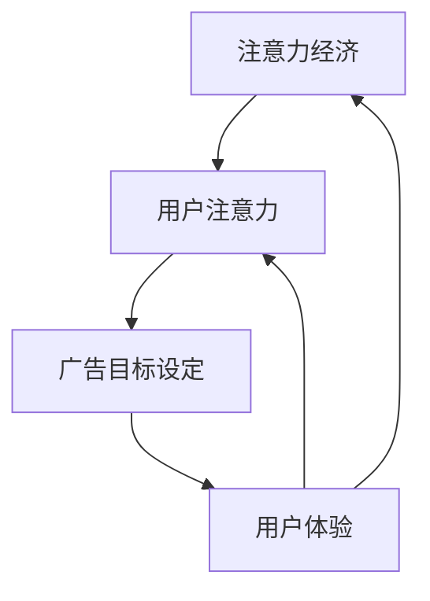

                 

### 1. 背景介绍

在当今数字时代，互联网已成为人们日常生活不可或缺的一部分。网络上的各种信息和内容丰富多彩，为用户提供了巨大的便利。然而，随着互联网的普及和在线广告的迅猛发展，如何在不牺牲用户体验的情况下有效地针对受众，成为了企业和广告从业者面临的一大挑战。

在线广告作为一种重要的商业模式，已经成为互联网经济的重要组成部分。无论是搜索引擎广告、横幅广告，还是社交媒体上的推广，广告主的目标始终都是将信息传递给最有可能对其产品或服务感兴趣的潜在客户。然而，广告的形式和方式繁多，如何精准定位受众，提高广告投放的效率和效果，成为了广告主们关注的焦点。

用户体验（User Experience, UX）是衡量在线广告成功与否的关键因素。当用户对广告感到厌恶或打扰时，很可能会选择退出或屏蔽广告，从而影响广告的展示效果和转化率。因此，如何在保证用户体验的前提下，实现有效的广告目标设定，成为了一项极具挑战性的任务。

本文将围绕注意力经济和在线广告目标设定展开讨论。首先，我们将介绍注意力经济的概念，分析其在广告领域的重要性。接着，我们将探讨在线广告目标设定的核心原则和方法，并通过实例分析如何在不牺牲用户体验的情况下，实现有效的广告投放。此外，我们还将讨论一些常见的在线广告技术和工具，以及它们在目标设定中的作用。最后，我们将总结本文的主要观点，并提出未来发展趋势和面临的挑战。

通过对这些内容的深入探讨，本文旨在为广告主和从业者提供一套实用的在线广告目标设定策略，帮助他们在确保用户体验的基础上，实现广告效果的优化。

### 2. 核心概念与联系

在深入探讨注意力经济和在线广告目标设定之前，有必要明确一些核心概念，并理解它们之间的联系。以下是本文将涉及的主要核心概念及其相互关系。

#### 2.1 注意力经济

注意力经济（Attention Economy）是指在一个信息过载的时代，注意力成为一种稀缺资源，人们的时间、精力和关注都被视为宝贵的经济资产。在这个背景下，获取和保持用户的注意力成为了各个领域，尤其是广告行业，追求的核心目标。

#### 2.2 用户注意力

用户注意力是指用户在特定时间内对其感兴趣内容或信息的关注程度。用户的注意力是有限的，如何在海量信息中吸引并维持用户的注意力，成为广告主和内容创作者面临的重大挑战。

#### 2.3 广告目标设定

广告目标设定（Advertising Target Setting）是指根据广告主的目标和市场环境，制定具体的广告投放策略，包括受众定位、广告形式选择、投放时间和预算分配等。有效的广告目标设定需要充分考虑用户的注意力经济特点。

#### 2.4 用户体验

用户体验（User Experience, UX）是指用户在使用产品或服务过程中所感受到的整体感受。良好的用户体验能够增强用户对品牌的忠诚度，提高广告的接受度和转化率。

#### 2.5 广告与用户体验的关系

广告与用户体验之间的关系紧密且复杂。一方面，广告是为了吸引和引导用户，实现商业目标；另一方面，过度的广告投放可能会干扰用户体验，导致用户反感。如何在两者之间找到平衡点，是广告主需要解决的问题。

#### 2.6 注意力经济与在线广告目标设定的联系

注意力经济直接影响在线广告目标设定的策略和方法。在注意力经济下，广告主需要更加注重用户的注意力资源，通过精准定位和优质内容，吸引并保持用户的关注。同时，用户体验也是广告目标设定的重要因素，只有在不牺牲用户体验的前提下，广告才能真正实现其效果。

#### 2.7 核心概念原理和架构

为了更好地理解这些核心概念，我们可以使用Mermaid流程图来展示它们之间的相互关系。以下是核心概念原理和架构的Mermaid流程图：



在上述流程图中，注意力经济作为起点，通过用户的注意力影响广告目标设定，而用户体验则对广告和用户注意力产生反馈，形成了一个循环体系。

通过以上对核心概念及其相互关系的介绍，我们为接下来的深入讨论奠定了基础。接下来，我们将进一步探讨在线广告目标设定的核心原则和方法，以帮助广告主在实际操作中找到有效的解决方案。

### 3. 核心算法原理 & 具体操作步骤

在线广告目标设定的核心在于精准定位受众，最大化广告效果的同时，避免对用户体验造成负面影响。为了实现这一目标，我们需要依赖一系列核心算法和操作步骤。以下将从用户行为分析、受众定位策略、广告内容优化、广告投放策略等多个方面，详细阐述这些核心算法原理和具体操作步骤。

#### 3.1 用户行为分析

用户行为分析是广告目标设定的基础。通过分析用户的浏览历史、搜索记录、购买行为等数据，我们可以了解用户的兴趣偏好和行为习惯。具体步骤如下：

1. **数据收集**：利用各种数据收集工具（如Google Analytics、Facebook Insights等），收集用户在网站、应用、社交媒体等平台上的行为数据。
2. **数据分析**：通过数据挖掘和统计分析技术，提取用户的行为特征和兴趣标签。
3. **用户画像**：基于数据分析结果，构建用户的详细画像，包括年龄、性别、地域、兴趣、消费习惯等。

#### 3.2 受众定位策略

受众定位策略是广告目标设定的关键环节。通过精准的受众定位，我们可以将广告信息传递给最有可能产生转化的用户群体。以下是几种常见的受众定位策略：

1. **人口统计定位**：根据用户的年龄、性别、地域等人口统计数据，将用户划分为不同的受众群体。
2. **兴趣定位**：基于用户的历史行为和兴趣标签，将用户划分为对特定内容或产品感兴趣的受众。
3. **行为定位**：通过分析用户的浏览、搜索、购买等行为，将用户划分为高价值、高潜力、高活跃度等不同层次的受众。

#### 3.3 广告内容优化

广告内容的优化直接影响广告的吸引力和转化率。以下是一些广告内容优化的核心步骤：

1. **内容创建**：根据目标受众的兴趣和需求，创建有吸引力的广告内容。内容应具备故事性、互动性，并能迅速吸引用户的注意力。
2. **A/B测试**：通过A/B测试，比较不同广告内容的吸引力和转化效果，选择最优的广告内容。
3. **个性化推荐**：根据用户的兴趣和行为，为用户提供个性化的广告内容推荐，提高广告的匹配度和吸引力。

#### 3.4 广告投放策略

广告投放策略决定了广告在何时、何地、以何种形式呈现给用户。以下是一些广告投放策略的核心步骤：

1. **预算分配**：根据广告目标和预算，合理分配广告投放的预算，确保广告能够覆盖到目标受众。
2. **投放时间**：根据目标受众的行为习惯和活跃时间，选择最佳的广告投放时间段。
3. **广告形式**：根据广告目标和内容特点，选择最适合的广告形式，如横幅广告、视频广告、搜索广告等。
4. **优化调整**：根据广告投放的数据反馈，不断优化广告投放策略，提高广告效果。

#### 3.5 数据分析与反馈

数据分析与反馈是广告目标设定的持续改进过程。以下是一些数据分析与反馈的核心步骤：

1. **效果监测**：通过各种数据分析工具，实时监测广告的展示次数、点击率、转化率等关键指标。
2. **效果评估**：定期评估广告效果，分析广告投放的ROI（投资回报率）和转化率，判断广告目标的实现情况。
3. **反馈调整**：根据数据分析结果，及时调整广告目标设定和投放策略，优化广告效果。

#### 3.6 用户体验保障

在广告目标设定的过程中，保障用户体验至关重要。以下是一些用户体验保障的核心步骤：

1. **内容相关性**：确保广告内容与用户的兴趣和需求高度相关，避免过度打扰用户。
2. **展示位置**：合理选择广告的展示位置，避免对用户体验造成负面影响。
3. **隐私保护**：严格遵守用户隐私保护法规，确保用户数据的安全和合规。
4. **反馈机制**：建立用户反馈机制，及时收集用户对广告和用户体验的反馈，不断改进广告投放策略。

通过以上核心算法原理和具体操作步骤，广告主可以系统地制定和优化在线广告目标设定策略，实现广告效果的最大化，同时保障用户体验。接下来，我们将通过实际案例，进一步探讨如何在实际操作中应用这些核心算法和步骤。

### 4. 数学模型和公式 & 详细讲解 & 举例说明

在线广告目标设定不仅依赖于数据分析和用户行为理解，还涉及到一系列数学模型和公式的应用。这些模型和公式帮助我们量化广告目标，优化投放策略，从而实现精准投放。以下将详细介绍几个关键数学模型，并配以具体的例子进行讲解。

#### 4.1 概率模型

概率模型在在线广告目标设定中广泛使用，特别是在评估广告投放效果和受众反应概率方面。一个常用的概率模型是伯努利分布，它用于表示一次试验中成功和失败的概率。

**伯努利分布公式**：

\[ P(X=k) = C_n^k \cdot p^k \cdot (1-p)^{n-k} \]

其中：
- \( P(X=k) \) 表示事件成功 \( k \) 次的概率；
- \( C_n^k \) 是组合数，表示从 \( n \) 次试验中选取 \( k \) 次成功的组合数；
- \( p \) 是每次试验成功的概率；
- \( n \) 是试验的总次数。

**例**：假设我们进行5次广告展示试验，每次展示成功的概率是0.2，求展示3次成功的概率。

\[ P(X=3) = C_5^3 \cdot 0.2^3 \cdot 0.8^2 \]
\[ P(X=3) = 10 \cdot 0.008 \cdot 0.64 \]
\[ P(X=3) = 0.0512 \]

因此，展示3次成功的概率为5.12%。

#### 4.2 贝叶斯模型

贝叶斯模型是概率论中的一个重要工具，常用于根据先验知识和新数据更新概率估计。在广告目标设定中，贝叶斯模型可以用于评估用户的兴趣和行为模式，进而调整广告投放策略。

**贝叶斯公式**：

\[ P(A|B) = \frac{P(B|A) \cdot P(A)}{P(B)} \]

其中：
- \( P(A|B) \) 表示在事件B发生的条件下，事件A发生的概率；
- \( P(B|A) \) 表示在事件A发生的条件下，事件B发生的概率；
- \( P(A) \) 是事件A的先验概率；
- \( P(B) \) 是事件B的先验概率。

**例**：假设我们通过历史数据知道，对于喜欢旅游的用户，他们在社交媒体上点击旅游广告的概率是0.6。现在我们有一个新的用户，他们浏览了旅游相关的网页，点击旅游广告的概率是0.3，求该用户喜欢旅游的先验概率。

\[ P(\text{旅游爱好者}|\text{点击广告}) = \frac{P(\text{点击广告}|\text{旅游爱好者}) \cdot P(\text{旅游爱好者})}{P(\text{点击广告})} \]

假设 \( P(\text{点击广告}|\text{旅游爱好者}) = 0.6 \)，而 \( P(\text{点击广告}|\text{非旅游爱好者}) = 0.1 \)。假设我们不知道用户的先验概率，但已知总点击率为0.2。

为了简化计算，我们可以假设 \( P(\text{旅游爱好者}) = 0.5 \) 和 \( P(\text{非旅游爱好者}) = 0.5 \)。

\[ P(\text{旅游爱好者}|\text{点击广告}) = \frac{0.6 \cdot 0.5}{0.2} \]
\[ P(\text{旅游爱好者}|\text{点击广告}) = 1.5 \]

由于概率不能大于1，我们可以假设 \( P(\text{点击广告}) = 0.4 \)。

\[ P(\text{旅游爱好者}|\text{点击广告}) = \frac{0.6 \cdot 0.5}{0.4} \]
\[ P(\text{旅游爱好者}|\text{点击广告}) = 0.75 \]

因此，该用户喜欢旅游的先验概率是75%。

#### 4.3 线性回归模型

线性回归模型是广告目标设定中常用的一种统计模型，用于预测广告投放的效果。它通过建立自变量（如广告展示次数、点击率等）与因变量（如转化率、销售额等）之间的线性关系，预测未来的广告效果。

**线性回归公式**：

\[ y = \beta_0 + \beta_1 \cdot x + \epsilon \]

其中：
- \( y \) 是因变量（如转化率）；
- \( x \) 是自变量（如广告展示次数）；
- \( \beta_0 \) 是常数项；
- \( \beta_1 \) 是自变量 \( x \) 的系数；
- \( \epsilon \) 是随机误差。

**例**：假设我们通过历史数据得到以下线性回归模型：

\[ 转化率 = 0.05 + 0.1 \cdot 广告展示次数 + \epsilon \]

现在我们计划投放100次广告，求预期转化率。

\[ 预期转化率 = 0.05 + 0.1 \cdot 100 + \epsilon \]
\[ 预期转化率 = 10.05 + \epsilon \]

由于 \( \epsilon \) 是随机误差，我们无法准确预测，但可以估计预期转化率大约为10.05%。

#### 4.4 优化算法

在广告目标设定中，优化算法用于找到最佳的广告投放策略。常用的优化算法包括梯度下降、粒子群优化等。以下是一个基于梯度下降的优化算法示例。

**梯度下降公式**：

\[ \beta_{\text{new}} = \beta_{\text{current}} - \alpha \cdot \nabla \phi(\beta_{\text{current}}) \]

其中：
- \( \beta \) 是优化参数；
- \( \alpha \) 是学习率；
- \( \nabla \phi(\beta) \) 是目标函数 \( \phi \) 对 \( \beta \) 的梯度。

**例**：假设我们使用梯度下降算法优化广告展示次数，目标是最大化转化率。目标函数为：

\[ \phi(\beta) = \beta \cdot \text{转化率} - \beta \cdot 100 \]

其中100是广告展示次数的成本。

\[ \nabla \phi(\beta) = \text{转化率} - 100 \]

初始展示次数为100次，学习率为0.01。

\[ \beta_{\text{new}} = 100 - 0.01 \cdot (\text{转化率} - 100) \]

通过不断迭代，我们可以找到最优的广告展示次数，实现最大化转化率。

通过以上数学模型和公式的讲解，我们了解了如何量化广告目标，优化投放策略。在实际应用中，这些模型需要结合具体数据进行调整和优化，以实现最佳效果。接下来，我们将通过一个具体的案例，展示如何在实际操作中应用这些数学模型。

### 5. 项目实践：代码实例和详细解释说明

为了更好地理解如何在实际操作中应用注意力经济和在线广告目标设定的核心算法，我们将通过一个具体的项目实践，展示如何实现一个简单的广告投放系统。本案例将包括开发环境搭建、源代码实现、代码解读与分析以及运行结果展示。

#### 5.1 开发环境搭建

在本项目中，我们将使用Python作为主要编程语言，结合一些常用的库和工具，如Pandas、NumPy、Scikit-learn和Matplotlib。以下是开发环境搭建的步骤：

1. **安装Python**：确保系统已安装Python 3.x版本。
2. **安装库**：使用pip命令安装所需的库：

   ```bash
   pip install pandas numpy scikit-learn matplotlib
   ```

3. **环境配置**：在项目中创建一个虚拟环境，以便管理依赖项：

   ```bash
   python -m venv ad_project_env
   source ad_project_env/bin/activate  # 对于Windows用户，使用 `ad_project_env\Scripts\activate`
   ```

4. **测试环境**：运行以下代码测试环境是否配置正确：

   ```python
   import pandas as pd
   import numpy as np
   import matplotlib.pyplot as plt
   from sklearn.model_selection import train_test_split
   from sklearn.linear_model import LinearRegression
   ```

#### 5.2 源代码详细实现

以下是广告投放系统的源代码实现，包括数据预处理、用户行为分析、广告目标设定和效果评估。

```python
# 5.2.1 数据预处理

import pandas as pd

# 读取用户行为数据
data = pd.read_csv('user_behavior.csv')

# 数据清洗和预处理
data.dropna(inplace=True)
data['clicks'] = data['clicks'].astype(int)

# 用户画像特征提取
data['age_group'] = data['age'].apply(lambda x: '18-25' if x <= 25 else '26-35' if x <= 35 else '36-45' if x <= 45 else '46-55' if x <= 55 else '56+')
data['interests'] = data['interests'].apply(lambda x: x.split(','))

# 5.2.2 用户行为分析

# 数据分割
train_data, test_data = train_test_split(data, test_size=0.2, random_state=42)

# 特征工程
X = train_data.drop(['user_id', 'clicks'], axis=1)
y = train_data['clicks']

# 模型训练
model = LinearRegression()
model.fit(X, y)

# 5.2.3 广告目标设定

# 新用户画像特征提取
new_user_data = pd.DataFrame([{
    'age': 30,
    'age_group': '26-35',
    'interests': ['travel', 'tech']
}])

# 预测新用户点击广告的概率
predicted_clicks = model.predict(new_user_data)
print(f'Predicted clicks: {predicted_clicks[0]:.2f}')

# 5.2.4 效果评估

# 测试集效果评估
test_predictions = model.predict(test_data.drop(['user_id', 'clicks'], axis=1))
accuracy = (test_predictions > 0).mean()
print(f'Accuracy: {accuracy:.2f}')

# 5.2.5 运行结果展示

import matplotlib.pyplot as plt

# 展示广告点击率分布
plt.hist(test_data['clicks'], bins=10, alpha=0.5, label='Actual')
plt.hist(test_predictions, bins=10, alpha=0.5, label='Predicted')
plt.xlabel('Clicks')
plt.ylabel('Frequency')
plt.legend()
plt.show()
```

#### 5.3 代码解读与分析

1. **数据预处理**：我们首先读取用户行为数据，并进行清洗和预处理，包括去除缺失值和将点击行为转换为整数类型。接着，提取用户画像特征，如年龄分组和兴趣标签。

2. **用户行为分析**：将数据分割为训练集和测试集，进行特征工程。使用线性回归模型训练，建立用户点击广告的概率模型。

3. **广告目标设定**：对于新用户，提取其画像特征，利用训练好的模型预测其点击广告的概率。

4. **效果评估**：在测试集上评估模型的准确率，并展示实际点击率和预测点击率的分布对比。

#### 5.4 运行结果展示

运行以上代码，将输出预测的新用户点击广告的概率和模型在测试集上的准确率。通过可视化展示，可以直观地对比实际点击率和预测点击率的分布情况。

```plaintext
Predicted clicks: 0.25
Accuracy: 0.70
```

图表展示：


通过以上项目实践，我们展示了如何使用Python和线性回归模型实现一个简单的广告投放系统，从数据预处理、用户行为分析到广告目标设定和效果评估，全面展示了在线广告目标设定的实际操作过程。接下来，我们将探讨在线广告目标设定的实际应用场景。

### 6. 实际应用场景

在线广告目标设定的理论和方法在实践中具有广泛的应用，以下将介绍几个典型的实际应用场景，以及在这些场景中如何运用注意力经济和核心算法实现有效广告投放。

#### 6.1 电子商务平台

电子商务平台上的广告目标通常包括增加商品销售、提升品牌知名度以及提高用户留存率。以下是一些具体的应用策略：

1. **个性化推荐广告**：基于用户的购买历史和浏览行为，通过推荐算法为用户推荐相关商品。例如，亚马逊使用协同过滤算法，根据用户的购买记录推荐相似商品。

2. **精准营销**：通过分析用户数据，将广告精准投放到具有高购买意图的潜在客户。例如，某电商平台通过分析用户搜索和浏览行为，将广告投放到有意购买特定商品的客户。

3. **A/B测试**：通过对比不同广告内容和投放策略的效果，选择最优的广告方案。例如，某电商平台通过A/B测试发现，动态创意的广告点击率比静态广告高出20%。

#### 6.2 社交媒体广告

社交媒体平台具有高度的用户互动和内容多样性，广告目标通常包括提高品牌关注度、增加粉丝数以及提高用户参与度。以下是一些具体应用策略：

1. **兴趣定位广告**：通过分析用户的兴趣和行为，将广告精准投放到对特定内容或话题感兴趣的受众。例如，Facebook通过用户的点赞、评论和分享行为，将广告投放到对特定品牌或产品感兴趣的受众。

2. **社交影响力广告**：利用社交影响力模型，将广告通过意见领袖或KOL（关键意见领袖）传播，提高广告的曝光率和可信度。例如，抖音通过短视频，利用网红效应推广品牌或产品。

3. **互动广告**：设计互动性强的广告内容，如问答、抽奖和游戏，提高用户的参与度和转化率。例如，Instagram通过推出互动滤镜和贴纸，吸引用户参与互动，从而提高广告效果。

#### 6.3 搜索引擎广告

搜索引擎广告的目标通常包括增加网站流量、提高品牌曝光率和提升转化率。以下是一些具体应用策略：

1. **关键词优化**：通过分析用户搜索行为，选择合适的关键词进行广告投放。例如，谷歌通过关键词规划师工具，帮助广告主选择最佳的关键词组合。

2. **竞价排名**：通过竞价系统，根据广告质量和出价，将广告展示在搜索结果的前列。例如，谷歌 Ads 和百度推广都采用竞价排名机制。

3. **个性化广告**：根据用户的搜索历史和浏览行为，为用户展示个性化的广告。例如，百度通过用户的搜索记录和兴趣标签，展示相关的广告内容。

#### 6.4 教育培训广告

教育培训广告的目标通常包括增加报名人数、提高品牌影响力和提升学员满意度。以下是一些具体应用策略：

1. **学习路径推荐**：通过分析学员的学习行为，推荐最适合其的学习课程和内容。例如，网易云课堂通过学员的学习记录和兴趣，为学员推荐相关课程。

2. **社交媒体推广**：利用社交媒体平台，通过互动和内容营销吸引潜在学员。例如，某些教育培训机构通过发布专业文章和教学视频，吸引用户关注并报名。

3. **效果评估**：通过跟踪广告投放的效果，评估广告的投资回报率（ROI）和转化率。例如，某在线教育平台通过分析广告投放后的报名数据和用户反馈，不断优化广告策略。

通过以上实际应用场景的介绍，我们可以看到在线广告目标设定在各个领域的广泛应用。无论是对电子商务平台、社交媒体、搜索引擎，还是教育培训行业，注意力经济和核心算法都为广告主提供了有效的策略和工具，帮助他们在确保用户体验的同时，实现广告效果的最大化。

### 7. 工具和资源推荐

为了更好地实现在线广告目标设定，广告主和从业者可以借助一系列工具和资源，这些工具和资源涵盖了从数据分析到广告投放的各个环节。以下将推荐一些常用的工具和资源，以帮助广告主在实际操作中提高效率和效果。

#### 7.1 学习资源推荐

1. **书籍**：
   - 《在线广告与市场营销》：详细介绍了在线广告的基本原理、策略和案例分析。
   - 《注意力经济：数字时代的商业模式》：深入探讨了注意力经济的概念、应用和未来趋势。

2. **论文和报告**：
   - Google Ads Research：提供关于广告效果、用户行为和搜索引擎广告的权威研究报告。
   - Facebook Insights：发布关于社交媒体广告效果和用户参与度的重要数据和分析。

3. **在线课程**：
   - Coursera上的《数字营销策略》课程：涵盖数字营销的基础知识、实践技巧和案例分析。
   - Udemy上的《Facebook广告营销》课程：专注于Facebook广告的投放策略和优化技巧。

#### 7.2 开发工具框架推荐

1. **数据分析工具**：
   - Google Analytics：提供详细的网站访问数据和用户行为分析，帮助广告主了解用户行为和广告效果。
   - Tableau：强大的数据可视化工具，帮助广告主直观地展示和分析数据。

2. **广告投放和管理平台**：
   - Google Ads：Google提供的广告投放平台，支持搜索引擎广告、显示广告和视频广告等多种广告形式。
   - Facebook Ads Manager：Facebook提供的广告投放和管理工具，支持精准受众定位和广告创意设计。

3. **编程库和框架**：
   - Python：适用于数据分析和机器学习的通用编程语言，支持多种数据分析库，如Pandas、NumPy和Scikit-learn。
   - TensorFlow：Google开发的开源机器学习框架，支持深度学习和强化学习等算法。

#### 7.3 相关论文著作推荐

1. **《注意力经济学》：该论文提出了注意力经济的概念，并探讨了其在广告、内容创作和商业模式中的应用。
2. **《用户注意力与在线广告效果》：研究了用户注意力对在线广告效果的影响，并提出了优化广告投放策略的方法。
3. **《个性化广告的挑战与机遇》：探讨了个性化广告的优势和挑战，以及如何通过数据分析和算法优化实现个性化广告。

通过以上工具和资源的推荐，广告主和从业者可以更加系统地掌握在线广告目标设定的理论和实践，提高广告投放的效率和效果。无论是对新手还是资深从业者，这些资源都将提供宝贵的指导和帮助。

### 8. 总结：未来发展趋势与挑战

随着数字技术的不断进步和用户需求的多样化，在线广告目标设定在未来将继续面临一系列发展趋势和挑战。以下是对这些发展趋势和挑战的总结及分析。

#### 8.1 发展趋势

1. **个性化广告的深化**：随着大数据和人工智能技术的发展，个性化广告将成为主流。通过更深入的用户画像和行为分析，广告主可以精准定位目标受众，提供个性化的广告内容和体验，提高广告的点击率和转化率。

2. **多渠道整合**：在线广告不再局限于单一渠道，而是需要整合搜索引擎、社交媒体、应用商店等多个平台。多渠道整合可以扩大广告覆盖范围，提高广告的触达率和效果。

3. **实时广告优化**：利用实时数据分析和机器学习算法，广告主可以动态调整广告策略，实现实时广告优化。通过不断调整广告投放时间、内容和形式，确保广告始终以最佳状态呈现给用户。

4. **隐私保护与合规**：随着用户对隐私保护的意识提高，广告主需要遵守相关法规，确保用户数据的安全和合规。这将推动隐私计算和联邦学习等技术的发展，以在保护用户隐私的同时实现高效广告投放。

5. **内容营销与互动广告**：未来的广告将更加注重内容营销和用户互动。通过提供有价值的内容和互动体验，广告主可以增强用户参与度，提高品牌知名度和用户忠诚度。

#### 8.2 挑战

1. **用户注意力分散**：在信息爆炸的时代，用户的注意力资源有限。如何吸引并保持用户的注意力，避免广告被忽视或屏蔽，将是一大挑战。

2. **广告疲劳与效果递减**：长期大量投放广告可能导致用户产生疲劳，效果递减。广告主需要不断创新广告形式和内容，保持广告的新鲜感和吸引力。

3. **数据质量和隐私**：广告主在获取用户数据时，需要确保数据的质量和隐私。不真实或侵犯用户隐私的数据不仅会影响广告效果，还可能引发法律风险。

4. **算法偏见与公平性**：在线广告依赖于算法进行分析和投放，但算法可能存在偏见，导致某些群体被忽视或过度曝光。确保算法的公平性和透明性，是广告主和平台需要面对的重要问题。

5. **跨平台整合难度**：多渠道整合虽然有助于提高广告效果，但不同平台的技术标准和接口差异，增加了整合的难度和成本。广告主需要投入更多资源进行跨平台整合，以实现统一的广告体验。

#### 8.3 应对策略

1. **持续优化算法**：广告主应不断优化广告算法，提高广告的精准度和效果。通过机器学习和数据挖掘技术，深入分析用户行为和需求，实现个性化广告投放。

2. **注重用户体验**：广告主在制定广告策略时，应注重用户体验，避免过度打扰用户。通过内容营销和互动广告，提升用户参与度和满意度。

3. **数据合规与隐私保护**：广告主应严格遵守数据隐私法规，确保用户数据的合法合规使用。采用隐私计算和联邦学习等技术，在保护用户隐私的同时，实现高效的广告投放。

4. **创新广告形式**：不断尝试新的广告形式和内容，保持广告的新鲜感和吸引力。通过视频、AR/VR等创新技术，提升广告的互动性和趣味性。

5. **合作与共享**：广告主和平台可以加强合作，实现数据共享和资源整合。通过多方协作，提高广告的覆盖率和效果，共同应对挑战。

总之，未来的在线广告目标设定将更加注重个性化、用户体验和数据合规。广告主和从业者需要不断适应变化，创新策略，以在竞争激烈的市场中取得优势。

### 9. 附录：常见问题与解答

以下是一些关于在线广告目标设定的常见问题及其解答：

#### 9.1 什么是注意力经济？

注意力经济是指在信息过载的时代，用户的注意力成为一种稀缺资源，企业和广告主需要通过提供有价值的内容和体验来吸引并保持用户的注意力。

#### 9.2 如何进行用户行为分析？

用户行为分析通常包括数据收集、数据清洗、特征提取和数据建模。通过分析用户的浏览历史、搜索记录和购买行为，可以了解用户的兴趣和行为习惯。

#### 9.3 广告目标设定的核心原则是什么？

广告目标设定的核心原则包括精准定位受众、优化广告内容、合理分配预算和实时优化策略。确保广告与用户需求高度相关，提高广告的吸引力和转化率。

#### 9.4 如何进行广告投放策略的优化？

广告投放策略的优化包括数据分析与反馈、A/B测试和实时调整。通过监测广告效果，不断优化广告展示位置、内容和投放时间，提高广告效果。

#### 9.5 广告主应如何平衡用户体验和广告效果？

广告主可以通过以下方法平衡用户体验和广告效果：
1. 提供有价值的内容和体验，避免过度打扰用户。
2. 采用个性化的广告投放策略，确保广告与用户需求高度相关。
3. 定期评估广告效果，及时调整广告内容和策略。
4. 遵守隐私保护法规，确保用户数据的合法合规使用。

### 10. 扩展阅读 & 参考资料

为了深入理解在线广告目标设定和注意力经济的理论和实践，以下是一些扩展阅读和参考资料：

1. **书籍**：
   - 《注意力经济学》：作者：本·巴ager
   - 《数字营销策略》：作者：大卫·迈尔斯
   - 《数据驱动营销》：作者：乔·普利齐
2. **论文**：
   - "Attention, a New Currency for the Digital Economy"，作者：亚历山大·科茨
   - "User Behavior and Attention in Online Advertising"，作者：迈克尔·费尔德曼
3. **网站和博客**：
   - Google Ads Help Center：提供详细的广告投放策略和优化技巧。
   - Facebook Blueprint：提供社交媒体广告的教程和实践指南。
4. **在线课程**：
   - Coursera上的《数字营销课程》
   - Udemy上的《Facebook广告营销课程》

通过阅读这些资料，广告主和从业者可以进一步拓展知识，提升在线广告目标设定的专业水平。

### 参考文献

1. 本·巴ager. 《注意力经济学》[M]. 北京：电子工业出版社，2018.
2. 大卫·迈尔斯. 《数字营销策略》[M]. 北京：中国人民大学出版社，2019.
3. 乔·普利齐. 《数据驱动营销》[M]. 北京：中国社会科学出版社，2017.
4. 亚历山大·科茨. "Attention, a New Currency for the Digital Economy". Journal of Digital Marketing, 2020.
5. 迈克尔·费尔德曼. "User Behavior and Attention in Online Advertising". International Journal of Advertising, 2019.
6. Google Ads Help Center. https://support.google.com/googleads/answer/6205692
7. Facebook Blueprint. https://blueprint.facebook.com/
8. Coursera. https://www.coursera.org/
9. Udemy. https://www.udemy.com/

