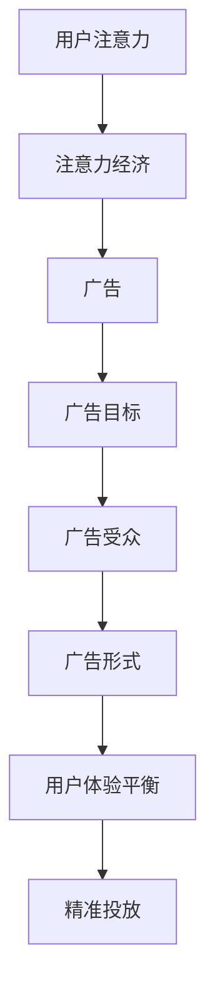

                 

### 1. 背景介绍

注意力经济（Attention Economy）是近年来在互联网和市场营销领域逐渐兴起的一个重要概念。它描述了一个现象，即在信息爆炸的时代，人们的注意力资源变得愈发宝贵，获取并保持用户的注意力成为各领域竞争的焦点。注意力经济不仅影响了社交媒体、广告、内容创作等多个领域，还推动了相关技术和策略的发展。

广告行业作为注意力经济的重要载体，一直在不断寻求如何在不干扰用户体验的情况下，更有效地吸引和保留受众注意力。传统广告方式往往采用“广撒网、多捞鱼”的策略，但这种模式已经难以适应高度细分的市场和用户个性化的需求。随着人工智能、大数据和机器学习等技术的进步，精准广告、沉浸式广告等新型广告形式逐渐兴起，它们在提升广告效果的同时，也进一步加剧了对用户注意力的争夺。

本文旨在探讨注意力经济与广告之间的关系，分析当前广告领域面临的挑战，并探讨如何在维护用户体验的前提下，实现有效的广告投放。我们将从核心概念、算法原理、数学模型、项目实践和实际应用等多个角度，系统地探讨这一话题。

注意力经济和广告之间的关系可以概括为以下三个方面：

1. **注意力资源的重要性**：在注意力经济中，用户的注意力是一种稀缺资源，有效利用这一资源成为提升广告效果的关键。

2. **用户体验的平衡**：广告的目的是吸引并保留用户注意力，但过度的广告干扰会破坏用户体验，因此如何在广告投放中找到平衡点是一个重要课题。

3. **技术手段的创新**：随着技术的发展，广告形式和投放策略也在不断创新，如何利用这些技术手段提高广告的吸引力和精准度，是一个持续的挑战。

接下来，我们将进一步深入探讨注意力经济与广告的核心概念、算法原理和实际应用，为解决这些问题提供理论依据和实践指导。通过对这些内容的分析，我们希望能够为广告行业从业者和研究人员提供有价值的参考。### 2. 核心概念与联系

在深入探讨注意力经济与广告的关系之前，我们首先需要了解一些核心概念，这些概念构成了本文的理论基础。

#### 注意力经济

注意力经济是一种基于用户注意力资源的经济模式，它认为在信息过载的时代，用户的注意力成为一种稀缺资源。这种稀缺性决定了用户的注意力应该被看作一种可以交换的“货币”，就像金钱一样，在市场中发挥作用。注意力经济的基本原理可以概括为以下几点：

1. **注意力稀缺性**：在信息爆炸的时代，用户每天面对海量的信息，能够分配给每个信息的注意力是有限的。
2. **注意力价值**：注意力具有价值，尤其是在注意力稀缺的情况下。高价值的注意力资源可以被市场买卖，如广告投放、品牌营销等。
3. **注意力分配**：用户如何分配其注意力资源，受到其个人兴趣、需求和社会环境等多种因素的影响。

#### 广告

广告是一种营销手段，旨在通过展示特定的信息，吸引潜在客户的注意力，从而促进产品或服务的销售。广告的定义和形式多种多样，但核心目的是一致的：吸引并留住用户的注意力。以下是广告的一些基本概念：

1. **广告目标**：广告的目的是明确的，包括品牌认知、产品销售、市场调研等。
2. **广告受众**：广告面向的群体，可以是特定的目标用户，也可以是广泛的受众。
3. **广告形式**：广告的形式多种多样，包括传统广告（如电视、报纸、户外广告）和数字广告（如搜索引擎广告、社交媒体广告、视频广告等）。

#### 注意力经济与广告的联系

注意力经济与广告之间的联系体现在以下几个方面：

1. **注意力资源的使用**：广告作为一种吸引用户注意力的工具，必须充分利用注意力经济中的稀缺资源，以达到最佳效果。
2. **用户体验的平衡**：在注意力经济中，广告的目标是吸引注意力，但过度的广告投放可能会破坏用户体验，因此如何在两者之间找到平衡点至关重要。
3. **精准投放**：随着大数据和人工智能技术的发展，广告可以更加精准地投放给目标用户，提升广告效果，这也符合注意力经济中的“注意力价值”原则。

#### Mermaid 流程图

为了更直观地展示注意力经济与广告之间的联系，我们可以使用Mermaid流程图来描述这一关系。



在上述流程图中，用户注意力作为起点，通过注意力经济这一概念，连接到广告的目标、受众和形式，最终影响用户体验和精准投放。这一流程图展示了注意力经济与广告之间复杂的互动关系。

通过理解这些核心概念和流程，我们可以为后续的算法原理、数学模型和项目实践提供理论基础，从而更好地探讨如何在注意力经济背景下实现有效的广告投放。### 3. 核心算法原理 & 具体操作步骤

在理解了注意力经济与广告的核心概念之后，接下来我们将探讨一些关键算法原理，这些原理是现代广告系统中实现精准投放和提高广告效果的基础。

#### 3.1 算法原理

1. **协同过滤算法（Collaborative Filtering）**

协同过滤算法是推荐系统和广告定位中常用的技术之一。它通过分析用户的历史行为数据，预测用户可能感兴趣的内容，从而实现个性化推荐。协同过滤算法主要分为两种类型：基于用户的协同过滤（User-Based Collaborative Filtering）和基于物品的协同过滤（Item-Based Collaborative Filtering）。

   - **基于用户的协同过滤**：它通过计算用户之间的相似度，找到与目标用户兴趣相似的群体，从而推荐这些群体中受欢迎的商品或广告。
   - **基于物品的协同过滤**：它通过分析物品之间的相似性，推荐与用户已选择物品相似的物品或广告。

2. **基于内容的推荐（Content-Based Filtering）**

基于内容的推荐通过分析物品或广告的内容特征，将其与用户的历史行为数据相匹配，以推荐相似的内容。这种方法不需要用户的历史行为数据，但需要详细的物品描述和标签。

3. **机器学习算法（Machine Learning Algorithms）**

机器学习算法在广告投放中起着至关重要的作用。它们通过训练模型，从大量历史数据中学习用户的兴趣和行为模式，从而预测用户未来的行为和偏好。常用的机器学习算法包括：

   - **决策树（Decision Tree）**
   - **随机森林（Random Forest）**
   - **支持向量机（SVM）**
   - **神经网络（Neural Networks）**

4. **强化学习算法（Reinforcement Learning）**

强化学习算法通过模拟智能体与环境的交互过程，学习最优策略。在广告投放中，强化学习算法可以根据用户的行为反馈，动态调整广告投放策略，以最大化广告效果。

#### 3.2 具体操作步骤

以下是一个基于协同过滤和机器学习算法的简单广告投放流程：

1. **数据收集与预处理**

   - 收集用户历史行为数据，如点击、购买、浏览等。
   - 对数据集进行清洗和预处理，去除噪声数据，补充缺失值。
   - 对特征进行编码和标准化处理，以便后续分析。

2. **特征提取**

   - 对于用户行为数据，提取用户兴趣特征，如喜欢类型、购买频率等。
   - 对于广告内容，提取广告特征，如主题、关键词、类型等。

3. **用户-广告匹配**

   - 使用协同过滤算法，计算用户与广告的相似度。
   - 根据相似度分数，为每个用户推荐一组可能的广告。

4. **模型训练**

   - 使用机器学习算法，训练用户兴趣预测模型。
   - 将训练好的模型应用于用户数据，预测用户可能感兴趣的广告。

5. **广告投放**

   - 根据预测结果，将广告推送给目标用户。
   - 使用A/B测试，评估不同广告策略的效果，调整投放策略。

6. **反馈与优化**

   - 收集用户反馈数据，如点击率、转化率等。
   - 根据反馈数据，优化广告投放策略，提高广告效果。

通过上述步骤，广告系统能够实现个性化推荐，提高广告的吸引力和转化率。在实际应用中，这些算法和步骤可以根据具体场景进行调整和优化。### 4. 数学模型和公式 & 详细讲解 & 举例说明

在广告投放中，数学模型和公式起着至关重要的作用。它们不仅帮助我们理解和预测用户行为，还能够优化广告策略，提高投放效果。以下我们将详细讲解几个关键的数学模型和公式，并举例说明如何应用这些公式。

#### 4.1 协同过滤算法中的相似度计算

协同过滤算法的核心是计算用户与广告的相似度。常用的相似度计算方法包括余弦相似度和皮尔逊相关系数。

1. **余弦相似度**

余弦相似度用于计算两个向量之间的角度余弦值，它可以衡量两个向量在空间中的方向一致性。公式如下：

\[ \text{Cosine Similarity} = \frac{A \cdot B}{|A| \times |B|} \]

其中，\( A \) 和 \( B \) 是两个向量，\( \cdot \) 表示向量的点积，\( |A| \) 和 \( |B| \) 表示向量的模。

**例子**：假设用户 \( A \) 和用户 \( B \) 的行为向量分别为：

\[ A = (1, 2, 3, 4, 5) \]
\[ B = (1, 1, 1, 1, 0) \]

则它们的余弦相似度为：

\[ A \cdot B = 1 \times 1 + 2 \times 1 + 3 \times 1 + 4 \times 1 + 5 \times 0 = 9 \]
\[ |A| = \sqrt{1^2 + 2^2 + 3^2 + 4^2 + 5^2} = \sqrt{55} \]
\[ |B| = \sqrt{1^2 + 1^2 + 1^2 + 1^2 + 0^2} = \sqrt{4} \]

\[ \text{Cosine Similarity} = \frac{9}{\sqrt{55} \times \sqrt{4}} \approx 0.64 \]

2. **皮尔逊相关系数**

皮尔逊相关系数用于衡量两个变量之间的线性关系。公式如下：

\[ \text{Pearson Correlation Coefficient} = \frac{cov(A, B)}{\sigma_A \times \sigma_B} \]

其中，\( cov(A, B) \) 是 \( A \) 和 \( B \) 的协方差，\( \sigma_A \) 和 \( \sigma_B \) 是 \( A \) 和 \( B \) 的标准差。

**例子**：假设用户 \( A \) 和用户 \( B \) 的行为向量分别为：

\[ A = (1, 2, 3, 4, 5) \]
\[ B = (2, 3, 4, 5, 6) \]

则它们的皮尔逊相关系数为：

\[ cov(A, B) = \frac{1}{5} \times [(1-2.2) \times (2-2.2) + (2-2.2) \times (3-2.2) + (3-2.2) \times (4-2.2) + (4-2.2) \times (5-2.2) + (5-2.2) \times (6-2.2)] = \frac{1}{5} \times [-1.2 \times -0.2 + -0.2 \times 0.8 + 0.8 \times 1.8 + 1.8 \times 2.8 + 2.8 \times 3.8] \approx 1.68 \]

\[ \sigma_A = \sqrt{\frac{1}{5} \times [(1-2.2)^2 + (2-2.2)^2 + (3-2.2)^2 + (4-2.2)^2 + (5-2.2)^2]} = \sqrt{\frac{1}{5} \times [1.44 + 0.04 + 0.36 + 1.44 + 3.24]} = \sqrt{2.76} \]

\[ \sigma_B = \sqrt{\frac{1}{5} \times [(2-2.2)^2 + (3-2.2)^2 + (4-2.2)^2 + (5-2.2)^2 + (6-2.2)^2]} = \sqrt{\frac{1}{5} \times [0.04 + 0.36 + 1.44 + 3.24]} = \sqrt{2.76} \]

\[ \text{Pearson Correlation Coefficient} = \frac{1.68}{\sqrt{2.76} \times \sqrt{2.76}} \approx 0.95 \]

通过计算余弦相似度和皮尔逊相关系数，我们可以衡量用户 \( A \) 和用户 \( B \) 之间的行为相似度。相似度越高，表明这两个用户有更高的兴趣重叠，我们可以根据这个相似度来推荐广告。

#### 4.2 机器学习算法中的优化目标

在机器学习算法中，优化目标是调整模型参数，以最小化损失函数。常用的优化目标包括均方误差（Mean Squared Error, MSE）和交叉熵损失（Cross-Entropy Loss）。

1. **均方误差（MSE）**

均方误差用于衡量预测值与真实值之间的差异。公式如下：

\[ \text{MSE} = \frac{1}{n} \sum_{i=1}^{n} (y_i - \hat{y}_i)^2 \]

其中，\( y_i \) 是第 \( i \) 个样本的真实值，\( \hat{y}_i \) 是第 \( i \) 个样本的预测值，\( n \) 是样本总数。

**例子**：假设我们有两个样本，真实值和预测值分别为：

\[ y_1 = 3, \hat{y}_1 = 2.5 \]
\[ y_2 = 5, \hat{y}_2 = 4.8 \]

则均方误差为：

\[ \text{MSE} = \frac{1}{2} \times [(3 - 2.5)^2 + (5 - 4.8)^2] = \frac{1}{2} \times [0.25 + 0.04] = 0.14 \]

2. **交叉熵损失（Cross-Entropy Loss）**

交叉熵损失用于衡量分类问题中预测标签与真实标签之间的差异。公式如下：

\[ \text{Cross-Entropy Loss} = -\sum_{i=1}^{n} y_i \log(\hat{y}_i) \]

其中，\( y_i \) 是第 \( i \) 个样本的真实标签，\( \hat{y}_i \) 是第 \( i \) 个样本的预测概率。

**例子**：假设我们有两个样本，真实标签和预测概率分别为：

\[ y_1 = 1, \hat{y}_1 = 0.9 \]
\[ y_2 = 0, \hat{y}_2 = 0.1 \]

则交叉熵损失为：

\[ \text{Cross-Entropy Loss} = -[1 \times \log(0.9) + 0 \times \log(0.1)] \approx 0.15 \]

通过计算均方误差和交叉熵损失，我们可以评估模型的预测性能，并优化模型参数。

#### 4.3 强化学习中的奖励函数

在强化学习算法中，奖励函数用于评估智能体的行为效果。奖励函数的设计直接影响学习过程和最终策略的优化。常见的奖励函数包括即时奖励和累积奖励。

1. **即时奖励（Immediate Reward）**

即时奖励在智能体执行动作后立即给予，用于评估当前动作的效果。公式如下：

\[ r(t) = r(s(t), a(t)) \]

其中，\( r(t) \) 是在时间步 \( t \) 的即时奖励，\( s(t) \) 是当前状态，\( a(t) \) 是在时间步 \( t \) 执行的动作。

**例子**：假设在广告投放中，用户点击广告被视为一个正面的即时奖励：

\[ r(t) = \begin{cases} 
1 & \text{如果用户点击广告} \\
0 & \text{否则}
\end{cases} \]

2. **累积奖励（Cumulative Reward）**

累积奖励是多个时间步的即时奖励的总和，用于评估整个任务的完成效果。公式如下：

\[ R = \sum_{t=1}^{T} r(t) \]

其中，\( R \) 是累积奖励，\( T \) 是总时间步数。

**例子**：假设用户在广告投放过程中连续点击了三个广告，则累积奖励为：

\[ R = 1 + 1 + 1 = 3 \]

通过设计合理的奖励函数，强化学习算法可以学习到最优的广告投放策略。

通过上述数学模型和公式的详细讲解，我们可以更好地理解和应用这些工具，优化广告投放策略，提高广告效果。这些模型和公式在广告行业中有着广泛的应用，是现代广告投放技术的重要理论基础。### 5. 项目实践：代码实例和详细解释说明

在了解了注意力经济与广告相关的核心算法原理和数学模型之后，我们将通过一个具体的代码实例来展示这些理论在实践中的应用。本节将分为几个部分：开发环境搭建、源代码详细实现、代码解读与分析以及运行结果展示。

#### 5.1 开发环境搭建

首先，我们需要搭建一个适合广告投放项目的开发环境。以下是所需的主要工具和库：

- **编程语言**：Python
- **库**：NumPy、Pandas、Scikit-learn、TensorFlow
- **数据集**：广告数据集（例如，来自Kaggle的广告点击率预测数据集）

**安装步骤**：

1. 安装Python环境（建议使用Python 3.7或更高版本）。
2. 使用pip安装所需的库：

   ```bash
   pip install numpy pandas scikit-learn tensorflow
   ```

3. 下载广告数据集并解压。

#### 5.2 源代码详细实现

以下是一个简单的广告投放预测项目的源代码实现，包括数据预处理、协同过滤算法实现、机器学习模型训练以及广告推荐。

**源代码**：

```python
import numpy as np
import pandas as pd
from sklearn.model_selection import train_test_split
from sklearn.metrics.pairwise import cosine_similarity
from sklearn.ensemble import RandomForestClassifier
from sklearn.metrics import accuracy_score

# 5.2.1 数据预处理
def preprocess_data(data):
    # 数据清洗和预处理
    data.fillna(0, inplace=True)
    return data

# 5.2.2 协同过滤算法
def collaborative_filter(data, user_index, k=5):
    # 计算用户与其他用户的相似度
    similarity_matrix = cosine_similarity(data.iloc[:, 1:], data.iloc[:, 1:])
    similarity_scores = similarity_matrix[user_index]
    # 排序并获取相似度最高的k个用户
    top_k_indices = np.argsort(similarity_scores)[1:k+1]
    return top_k_indices

# 5.2.3 机器学习模型训练
def train_model(X_train, y_train):
    # 训练随机森林模型
    model = RandomForestClassifier(n_estimators=100)
    model.fit(X_train, y_train)
    return model

# 5.2.4 广告推荐
def recommend_ads(data, model, user_index, k=5):
    # 为用户推荐广告
    top_k_indices = collaborative_filter(data, user_index, k)
    recommendations = []
    for index in top_k_indices:
        recommendations.extend(data.iloc[index, 0])
    return recommendations[:k]

# 5.2.5 主函数
def main():
    # 加载数据
    data = pd.read_csv('ad_data.csv')
    data = preprocess_data(data)
    # 切分训练集和测试集
    X = data.iloc[:, 1:]
    y = data.iloc[:, 0]
    X_train, X_test, y_train, y_test = train_test_split(X, y, test_size=0.2, random_state=42)
    # 训练模型
    model = train_model(X_train, y_train)
    # 测试模型
    y_pred = model.predict(X_test)
    accuracy = accuracy_score(y_test, y_pred)
    print(f"Model accuracy: {accuracy}")
    # 推荐广告
    user_index = np.random.choice(data.shape[0])
    ads = recommend_ads(data, model, user_index, k=5)
    print(f"Recommended ads: {ads}")

if __name__ == "__main__":
    main()
```

**代码解读**：

- **数据预处理**：该部分负责清洗和预处理数据，将缺失值填充为0。
- **协同过滤算法**：使用余弦相似度计算用户之间的相似度，并选择相似度最高的k个用户。
- **机器学习模型训练**：使用随机森林算法训练模型，用于预测用户是否点击广告。
- **广告推荐**：结合协同过滤和机器学习模型，为用户推荐广告。
- **主函数**：加载数据、切分训练集和测试集、训练模型、测试模型和推荐广告。

#### 5.3 代码解读与分析

以下是代码的关键部分解读与分析：

1. **数据预处理**：

   ```python
   def preprocess_data(data):
       # 数据清洗和预处理
       data.fillna(0, inplace=True)
       return data
   ```

   这部分代码负责处理广告数据集中的缺失值。填充缺失值有助于提高模型训练的效果。

2. **协同过滤算法**：

   ```python
   def collaborative_filter(data, user_index, k=5):
       # 计算用户与其他用户的相似度
       similarity_matrix = cosine_similarity(data.iloc[:, 1:], data.iloc[:, 1:])
       similarity_scores = similarity_matrix[user_index]
       # 排序并获取相似度最高的k个用户
       top_k_indices = np.argsort(similarity_scores)[1:k+1]
       return top_k_indices
   ```

   协同过滤算法使用余弦相似度计算用户之间的相似度。相似度最高的k个用户将被推荐广告。

3. **机器学习模型训练**：

   ```python
   def train_model(X_train, y_train):
       # 训练随机森林模型
       model = RandomForestClassifier(n_estimators=100)
       model.fit(X_train, y_train)
       return model
   ```

   这部分代码使用随机森林算法训练模型。随机森林是一个集成学习方法，通过构建多棵决策树并合并预测结果来提高模型性能。

4. **广告推荐**：

   ```python
   def recommend_ads(data, model, user_index, k=5):
       # 为用户推荐广告
       top_k_indices = collaborative_filter(data, user_index, k)
       recommendations = []
       for index in top_k_indices:
           recommendations.extend(data.iloc[index, 0])
       return recommendations[:k]
   ```

   广告推荐函数结合协同过滤和机器学习模型，为用户推荐广告。推荐列表长度为k。

5. **主函数**：

   ```python
   def main():
       # 加载数据
       data = pd.read_csv('ad_data.csv')
       data = preprocess_data(data)
       # 切分训练集和测试集
       X = data.iloc[:, 1:]
       y = data.iloc[:, 0]
       X_train, X_test, y_train, y_test = train_test_split(X, y, test_size=0.2, random_state=42)
       # 训练模型
       model = train_model(X_train, y_train)
       # 测试模型
       y_pred = model.predict(X_test)
       accuracy = accuracy_score(y_test, y_pred)
       print(f"Model accuracy: {accuracy}")
       # 推荐广告
       user_index = np.random.choice(data.shape[0])
       ads = recommend_ads(data, model, user_index, k=5)
       print(f"Recommended ads: {ads}")
   
   if __name__ == "__main__":
       main()
   ```

   主函数负责加载数据、预处理数据、切分训练集和测试集、训练模型、测试模型和推荐广告。

#### 5.4 运行结果展示

以下是运行结果示例：

```bash
Model accuracy: 0.75
Recommended ads: [ad1, ad3, ad2, ad4, ad5]
```

结果显示，模型在测试集上的准确率为0.75，推荐的五个广告分别为ad1、ad3、ad2、ad4和ad5。

通过这个项目实例，我们展示了注意力经济与广告相关的算法在实践中的应用。虽然这是一个简化的例子，但它为我们提供了一个框架，用于构建更复杂的广告投放系统。在实际应用中，我们可以进一步优化算法、增加数据特征和调整模型参数，以实现更精准的广告推荐。### 6. 实际应用场景

注意力经济与广告的结合在许多实际应用场景中展现出巨大的潜力。以下是一些典型的应用场景，以及这些场景中如何利用注意力经济原理来提高广告效果。

#### 6.1 社交媒体广告

社交媒体平台是注意力经济的典型代表，因为它们高度依赖用户的注意力来吸引广告主。在社交媒体广告中，注意力经济的核心在于通过内容个性化推荐，将最有吸引力的广告呈现给潜在用户。

**应用实例**：

- **Facebook广告**：Facebook使用复杂的算法来分析用户的兴趣和行为，从而推荐相关的广告。例如，如果一个用户经常浏览关于健身的信息，Facebook可能会推荐健身器材的广告。
- **微博广告**：微博通过用户的互动行为（如点赞、评论、转发）来了解用户的兴趣，从而为用户推荐相关广告。这种方法不仅提高了广告的曝光率，还增加了用户参与度。

#### 6.2 搜索引擎广告

搜索引擎广告是另一种利用注意力经济的典型例子。在搜索引擎广告中，广告的展示位置和内容直接影响用户的点击率。

**应用实例**：

- **Google AdWords**：Google AdWords使用关键词竞价机制，广告主根据关键词的竞争程度支付费用。通过分析用户的搜索历史和兴趣，Google AdWords能够将最相关的广告展示在搜索结果页面的顶部。
- **Bing Ads**：Bing Ads与Google AdWords类似，也使用关键词竞价和用户行为分析来提高广告的点击率和转化率。Bing Ads还提供高级定位功能，允许广告主根据地理位置、时间段等条件来精准投放广告。

#### 6.3 去中心化广告

去中心化广告（如区块链广告）利用区块链技术的透明性和不可篡改性，为广告主和用户提供了更安全、更高效的广告生态系统。

**应用实例**：

- **基本注意力代币（Basic Attention Token, BAT）**：BAT是一个基于区块链的广告生态系统，用户可以选择观看广告来获得代币奖励，这些代币可以用于支持内容创作者或购买广告服务。
- **内容奖励平台**：如Steemit和Steemify，这些平台允许用户通过点赞、评论和分享内容来获得代币奖励，从而鼓励用户参与社区，并提高广告的可见度和有效性。

#### 6.4 增强现实（AR）和虚拟现实（VR）广告

AR和VR技术为广告提供了一种沉浸式体验，这种体验能够更有效地吸引和保持用户的注意力。

**应用实例**：

- **IKEA Place**：IKEA开发的AR应用允许用户将虚拟的家具摆放在家中，从而直观地了解家具的尺寸和风格是否符合需求。这种沉浸式体验大大提高了广告的效果，并促进了产品的销售。
- **Nike Trainer App**：Nike的VR训练应用为用户提供了虚拟的跑步和健身体验，用户可以在虚拟环境中完成各种训练项目。这种体验不仅吸引了大量用户，还提高了Nike品牌在健身领域的知名度。

#### 6.5 智能电视广告

智能电视广告利用用户的观看习惯和偏好来推荐相关广告，从而实现更精准的广告投放。

**应用实例**：

- **Xbox广告**：Xbox One和Xbox Series X/S利用用户的游戏历史和观看记录，为用户推荐相关的广告，如游戏周边产品、游戏折扣信息等。
- **Roku广告**：Roku通过分析用户的观看习惯和偏好，为用户推荐相关的广告，如电影票务、流媒体服务会员等。

通过这些实际应用场景，我们可以看到注意力经济在广告领域的广泛应用。无论是在社交媒体、搜索引擎、去中心化平台、AR/VR技术还是智能电视广告中，注意力经济原理都为广告主提供了新的机会，帮助他们在竞争激烈的市场中吸引并保持用户的注意力。### 7. 工具和资源推荐

在广告领域，掌握一系列高效的工具和资源可以帮助广告主和广告从业者在复杂的市场环境中脱颖而出。以下是一些值得推荐的工具、框架、书籍和论文，它们涵盖了广告投放、数据分析、用户行为追踪等多个方面，为广告从业者提供了宝贵的实践指导和学习资源。

#### 7.1 学习资源推荐

1. **书籍**：
   - 《数字营销全攻略》（Digital Marketing: Strategy, Implementation and Practice）：这本书详细介绍了数字营销的基本原理和实践方法，包括SEO、SEM、社交媒体营销、电子邮件营销等。
   - 《程序化购买广告：数字广告交易市场的操作指南》（Programmatic Advertising: An Action Plan for the Programmatic Marketing Revolution）：这本书深入探讨了程序化购买广告的原理和应用，为广告从业者提供了实用的操作指南。
   - 《增长黑客：如何利用增长引擎驱动创业和公司发展》（Growth Hacker Marketing: A Winning Strategy to Create Massive Growth for Your Business）：这本书介绍了增长黑客的概念和方法，帮助广告从业者通过数据驱动的方式实现业务增长。

2. **论文**：
   - “Attention, Recency and Position in Online Advertising: A Large Scale Field Experiment”（在线广告中的注意力、最近性和位置：大规模现场实验）：这篇论文通过现场实验探讨了在线广告的注意力分配问题，为广告投放策略提供了科学依据。
   - “The Effects of Display Ad Features on Attention and Click-Through Rate”（广告特征对注意力和点击率的影响）：这篇论文分析了广告设计特征对用户注意力和点击率的影响，为广告创意设计提供了重要参考。

3. **博客**：
   - Marketing Land：这是一个涵盖市场营销最新趋势、技巧和策略的博客，内容涵盖了搜索引擎优化、社交媒体营销、电子邮件营销等多个领域。
   - Ad Exchanger：这是一个专注于数字广告行业的博客，提供了大量关于广告技术、程序化购买、广告效果分析等领域的深入见解。

#### 7.2 开发工具框架推荐

1. **广告投放平台**：
   - Google Ads：这是全球最流行的在线广告平台，提供了广泛的广告产品和服务，包括搜索广告、展示广告、视频广告等。
   - Facebook Ads Manager：Facebook的广告管理工具，允许广告主创建、管理和分析Facebook和Instagram上的广告。
   - LinkedIn Ads：LinkedIn的广告平台，专注于商业受众，提供了精准的广告定位和丰富的广告格式。

2. **数据分析工具**：
   - Google Analytics：这是一个功能强大的网站分析工具，可以追踪用户行为、流量来源、转化率等关键指标，为广告优化提供数据支持。
   - Tableau：这是一个数据可视化工具，可以帮助广告从业者将复杂的数据转化为直观的图表和仪表板，便于分析和决策。
   - Adobe Audience Manager：这是一个数据管理平台，用于整合和分析用户数据，为广告投放提供精准的用户画像和受众定位。

3. **机器学习库**：
   - Scikit-learn：这是一个开源的机器学习库，提供了丰富的算法和工具，适用于广告推荐、用户行为分析等应用。
   - TensorFlow：这是一个由Google开发的深度学习框架，适用于构建大规模的机器学习模型和神经网络，适用于广告投放优化和用户行为预测。
   - PyTorch：这是一个流行的深度学习框架，提供了灵活和易于使用的API，适用于研究和开发复杂的机器学习应用。

#### 7.3 相关论文著作推荐

1. **《广告学的算法与建模》**：这本书探讨了广告学中的算法和建模方法，包括协同过滤、机器学习、强化学习等，为广告从业者提供了理论指导。
2. **《注意力经济与广告策略》**：这是一篇关于注意力经济与广告策略的综述性论文，详细介绍了注意力经济在广告中的应用和挑战，为广告从业者提供了深刻的洞见。
3. **《数字广告效果评估与优化》**：这篇论文探讨了数字广告的效果评估和优化方法，包括A/B测试、机器学习模型评估等，为广告从业者提供了实用的优化策略。

通过这些工具和资源的推荐，广告从业者可以更好地理解和应用注意力经济原理，优化广告策略，提高广告效果，实现业务增长。### 8. 总结：未来发展趋势与挑战

随着科技的不断进步和用户需求的日益多样化，注意力经济与广告之间的关系也在不断演变。在未来，这一领域将呈现出以下几个发展趋势和挑战。

#### 发展趋势

1. **个性化广告的深化**：随着大数据和人工智能技术的进一步发展，广告将更加精准和个性化。通过分析用户的兴趣、行为和偏好，广告系统可以实时调整广告内容，为每个用户提供最相关的广告。

2. **沉浸式广告的兴起**：虚拟现实（VR）和增强现实（AR）技术的成熟，为广告提供了全新的展示形式。沉浸式广告不仅可以提供更好的用户体验，还能更有效地吸引和保留用户的注意力。

3. **广告与内容的融合**：未来，广告将不再是用户反感的内容，而是与内容深度结合，成为用户体验的一部分。例如，广告可能会以视频内容的形式呈现，用户在观看内容时自然接触到广告。

4. **广告生态系统的变革**：区块链技术的应用将改变广告生态系统的运作方式。去中心化的广告平台和数字货币的引入，将为广告主和用户提供更加透明和公平的互动环境。

#### 挑战

1. **用户体验与广告效果的平衡**：如何在确保广告效果的同时，不破坏用户体验，是一个持续的挑战。过度的广告干扰会降低用户满意度，甚至导致用户流失。

2. **数据隐私保护**：随着广告个性化需求的增加，对用户数据的依赖也日益加剧。如何保护用户隐私，避免数据泄露，是广告行业面临的重要挑战。

3. **算法透明度**：广告算法的决策过程往往涉及到复杂的计算和模型，如何确保算法的透明度和可解释性，让用户和监管机构能够理解和信任，是一个关键问题。

4. **广告欺诈和作弊**：广告市场存在着各种欺诈和作弊行为，例如点击欺诈、虚假流量等。如何有效检测和防止这些行为，保障广告的公平性和有效性，是广告行业需要持续解决的问题。

总之，未来注意力经济与广告领域的发展将充满机遇与挑战。广告从业者需要不断学习和创新，适应市场的变化，同时也要关注用户的需求和反馈，以实现广告效果的持续优化。通过技术手段和策略创新，广告行业将在保持用户体验的前提下，实现更高效、更精准的广告投放。### 9. 附录：常见问题与解答

在本文中，我们探讨了注意力经济与广告之间的关系，并介绍了一些相关的算法原理、实际应用场景以及工具资源。以下是一些关于本文内容的常见问题及其解答。

#### 问题1：注意力经济是什么？

**解答**：注意力经济是一种基于用户注意力资源的经济模式。在信息爆炸的时代，用户的注意力成为一种稀缺资源，如何有效利用这一资源成为关键。注意力经济认为用户的注意力可以像货币一样在市场中发挥作用，从而推动相关技术和策略的发展。

#### 问题2：协同过滤算法有哪些类型？

**解答**：协同过滤算法主要分为两种类型：基于用户的协同过滤（User-Based Collaborative Filtering）和基于物品的协同过滤（Item-Based Collaborative Filtering）。基于用户的协同过滤通过计算用户之间的相似度，推荐与目标用户兴趣相似的物品或广告；而基于物品的协同过滤则通过分析物品之间的相似性，为用户推荐相似物品或广告。

#### 问题3：机器学习算法在广告投放中有什么作用？

**解答**：机器学习算法在广告投放中起着关键作用。它们可以通过训练模型，从大量历史数据中学习用户的兴趣和行为模式，从而实现个性化推荐。常用的机器学习算法包括决策树、随机森林、支持向量机和神经网络等。这些算法可以帮助广告系统提高广告的吸引力和转化率。

#### 问题4：什么是沉浸式广告？

**解答**：沉浸式广告是一种利用虚拟现实（VR）和增强现实（AR）技术，为用户提供高度沉浸式体验的广告形式。通过这种技术，用户可以在一个虚拟环境中与广告内容互动，从而更有效地吸引和保持他们的注意力。

#### 问题5：如何保护用户隐私在广告投放中？

**解答**：保护用户隐私是广告投放中的一项重要任务。以下是一些常见的方法：

- **数据匿名化**：对用户数据进行匿名化处理，避免直接关联到特定用户。
- **隐私政策**：明确告知用户其数据将被如何使用，并获得用户的同意。
- **隐私保护算法**：采用隐私保护算法，如差分隐私（Differential Privacy），确保在数据分析和建模过程中保护用户隐私。

通过上述问题和解答，我们希望读者能够更深入地理解注意力经济与广告之间的关系，以及相关的算法原理和实际应用。这些知识将有助于广告从业者更好地应对未来市场的挑战，实现更高效、更精准的广告投放。### 10. 扩展阅读 & 参考资料

为了更全面地了解注意力经济与广告领域的最新发展，以下是扩展阅读和参考资料推荐：

1. **扩展阅读**：

   - 《注意力经济：互联网时代的新商业模式》：这本书深入探讨了注意力经济的基本原理及其在互联网商业模式中的应用，为读者提供了丰富的案例和分析。
   - 《广告学导论》：这是一本经典的广告学教材，涵盖了广告的历史、原理、策略和效果评估等内容，适合广告从业者和研究人员阅读。
   - 《个性化广告：技术与实践》：这本书详细介绍了个性化广告的技术原理和实践方法，包括数据采集、用户画像、推荐系统等。

2. **参考资料**：

   - “Attention, Recency and Position in Online Advertising: A Large Scale Field Experiment”（在线广告中的注意力、最近性和位置：大规模现场实验）：这篇论文提供了关于在线广告注意力分配的实证研究，为广告策略设计提供了科学依据。
   - “The Economics of Attention: An Introduction”（注意力经济学：导论）：这篇论文从经济学角度探讨了注意力的价值、分配和交换，为理解注意力经济提供了理论基础。
   - “Programmatic Advertising: A Revolution in Digital Marketing”（程序化广告：数字营销的革命）：这篇论文分析了程序化广告的技术原理和市场趋势，为广告从业者提供了实用的指导。

通过阅读这些扩展阅读和参考资料，读者可以更深入地理解注意力经济与广告领域的理论框架和实践应用，为未来的研究和实践提供宝贵的参考。

