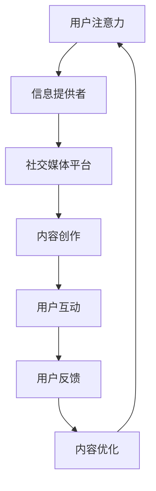

                 

### 1. 背景介绍

随着互联网技术的迅猛发展，注意力经济成为当今社会不可或缺的一部分。注意力经济，又称为“注意力市场”，指的是人们将注意力作为商品进行交易的一种经济模式。在这种模式下，用户的时间、关注力和兴趣被视为稀缺资源，各个平台和企业通过创造有吸引力的内容来争夺用户的注意力，从而实现商业价值。

社交媒体作为注意力经济的主要载体，已经成为现代营销策略中不可或缺的一环。无论是Facebook、Instagram、Twitter还是抖音等，这些平台都吸引了大量用户，他们每天在社交媒体上花费大量时间浏览、互动和分享内容。因此，如何有效地在社交媒体上进行营销，吸引并留住受众，成为企业面临的重要课题。

当前，社交媒体营销面临着诸多挑战。首先，用户注意力分散。随着信息爆炸时代的到来，用户每天面临海量的信息，他们的注意力资源变得异常珍贵。企业需要在众多竞争者中脱颖而出，吸引并保持用户的关注。其次，广告疲劳。长期大量投放广告导致用户对广告产生疲劳，降低广告效果。最后，内容同质化。许多企业为了追求短期效益，纷纷发布类似的内容，缺乏独特性和创新性，难以吸引用户的持续关注。

在这种背景下，本文旨在探讨注意力经济与社交媒体营销的最佳实践，通过深入分析注意力经济的原理，提出有效吸引受众的方法，帮助企业在不牺牲用户体验的情况下实现营销目标。

### 2. 核心概念与联系

#### 注意力经济的原理

注意力经济的基本原理是：用户的时间和注意力是有限的，而信息内容和广告是无限的。在这种资源有限与需求无限的对立中，企业和平台通过提供有价值的内容和广告来吸引用户的注意力，从而实现商业回报。注意力经济的关键在于如何有效地获取和保持用户的注意力，以下是几个核心概念：

1. **注意力稀缺性**：用户每天面临海量信息，他们的注意力资源是有限的。注意力稀缺性要求企业在有限的资源中创造有吸引力的内容，以争夺用户的关注。

2. **注意力转移**：用户的注意力可以从一个事物转移到另一个事物，但转移成本较高。企业在营销过程中需要降低用户的注意力转移成本，提高内容的价值，从而留住用户。

3. **注意力时长**：用户在特定内容上的注意力时长直接影响到内容的传播效果。企业应通过优化内容质量和用户体验，延长用户的注意力时长。

4. **注意力经济模型**：注意力经济模型包括三个基本要素：信息提供者（如企业、媒体、个人）、信息消费者（用户）和信息交换媒介（如社交媒体平台）。在这个模型中，信息提供者通过创造有价值的内容来吸引信息消费者的注意力，并通过广告、订阅等方式获得经济回报。

#### 社交媒体营销的原理

社交媒体营销是基于用户在社交媒体平台上互动和分享的行为来进行的。以下是几个核心概念：

1. **用户参与度**：用户参与度是衡量社交媒体营销效果的重要指标。高参与度意味着用户在社交媒体上与品牌互动频繁，分享品牌内容，从而扩大品牌影响力。

2. **社交互动**：社交互动包括点赞、评论、分享等行为。通过鼓励用户进行社交互动，企业可以提高用户对品牌的好感度和忠诚度。

3. **内容传播**：高质量的内容更容易在社交媒体上传播，从而吸引更多的用户。内容传播的速度和广度直接影响到营销效果。

4. **社交媒体平台特性**：不同的社交媒体平台具有不同的用户群体和内容特点，如Instagram以图片和视频为主，Twitter以短文本和实时性为主。企业应根据平台特性制定相应的营销策略。

#### 注意力经济与社交媒体营销的联系

注意力经济与社交媒体营销紧密相关，两者共同构成了现代营销的核心。以下是注意力经济与社交媒体营销之间的联系：

1. **注意力资源**：社交媒体平台为用户提供了丰富的注意力资源，企业可以利用这些资源进行营销。

2. **内容创作**：注意力经济要求企业创造有价值的内容，而社交媒体营销则依赖于高质量的内容来吸引用户的注意力。

3. **互动与反馈**：社交媒体营销鼓励用户与企业互动，通过收集用户反馈，企业可以不断优化内容，提高用户满意度。

4. **经济回报**：注意力经济通过广告、赞助和销售等方式为企业带来经济回报，而社交媒体营销则是实现这些经济回报的重要手段。

为了更直观地理解注意力经济的原理和社交媒体营销的联系，我们可以使用Mermaid流程图来展示这一过程。以下是示例流程图：



在这个流程图中，用户注意力是起点和终点，信息提供者和社交媒体平台则是连接各个环节的核心环节，通过不断循环的内容创作、用户互动和反馈优化，最终实现注意力资源的有效利用和经济回报。

### 3. 核心算法原理 & 具体操作步骤

在注意力经济和社交媒体营销的实践中，核心算法的原理和具体操作步骤至关重要。这些算法不仅能够帮助企业和品牌更好地吸引用户的注意力，还能提高内容的传播效果和营销转化率。以下是几种常见的核心算法原理和具体操作步骤：

#### 1. 用户行为分析算法

用户行为分析算法是社交媒体营销的基础，通过分析用户在平台上的行为数据，如浏览记录、点击率、点赞数、评论数等，企业可以了解用户兴趣和行为模式。具体操作步骤如下：

1. **数据收集**：从社交媒体平台获取用户行为数据，包括页面浏览、点击、分享、评论等。
2. **数据处理**：对收集到的数据进行分析和清洗，去除无效数据，提取有价值的行为特征。
3. **特征建模**：使用机器学习算法（如聚类、分类、回归等）对用户行为特征进行建模，预测用户兴趣和行为倾向。
4. **策略调整**：根据用户行为分析结果，调整内容发布策略，优化用户互动体验。

#### 2. 内容推荐算法

内容推荐算法是提高用户参与度和内容传播效果的关键，通过算法自动推荐用户感兴趣的内容，增强用户黏性和品牌影响力。具体操作步骤如下：

1. **用户画像构建**：根据用户行为数据和社交关系，构建用户画像，包括兴趣标签、行为偏好等。
2. **内容标签化**：对发布的内容进行标签化处理，将内容特征与用户画像进行匹配。
3. **推荐算法应用**：使用协同过滤、基于内容的推荐、深度学习等算法，为用户推荐相关内容。
4. **推荐效果评估**：根据用户对推荐内容的点击、浏览、互动等行为数据，评估推荐效果，不断优化推荐算法。

#### 3. 社交互动激励算法

社交互动激励算法通过提供奖励和激励措施，鼓励用户参与品牌活动、发布内容、点赞和评论等社交互动行为，增强品牌影响力。具体操作步骤如下：

1. **激励策略设计**：根据品牌目标和用户需求，设计合适的激励策略，如抽奖、积分、优惠券等。
2. **用户行为监测**：实时监测用户的社交互动行为，如发布、点赞、评论等。
3. **激励发放**：根据用户互动行为，发放相应的激励，如积分兑换、优惠券等。
4. **效果评估**：通过用户参与度和互动数据，评估激励策略的效果，不断优化激励方案。

#### 4. 智能广告投放算法

智能广告投放算法通过分析用户行为数据、内容特征和广告目标，实现精准的广告投放，提高广告效果和转化率。具体操作步骤如下：

1. **目标定位**：明确广告投放的目标群体和目标指标，如年龄、性别、地域、兴趣等。
2. **广告创意制作**：根据目标群体和广告目标，制作有针对性的广告创意。
3. **投放策略优化**：通过机器学习算法，根据用户行为数据和广告效果，实时调整广告投放策略。
4. **效果评估**：根据广告投放效果，如点击率、转化率、投资回报率等，评估广告效果，不断优化投放策略。

#### 5. 用户留存与激活算法

用户留存与激活算法通过分析用户行为和留存数据，制定针对性的用户留存和激活策略，提高用户活跃度和留存率。具体操作步骤如下：

1. **用户行为分析**：分析用户在不同阶段的留存行为，如注册、首次使用、活跃周期等。
2. **留存策略设计**：根据用户行为数据，设计有效的留存策略，如欢迎礼包、定期活动、会员积分等。
3. **激活策略设计**：分析用户流失原因，制定针对性的激活策略，如短信提醒、邮件营销、优惠活动等。
4. **效果评估**：根据用户留存和激活数据，评估策略效果，不断优化留存与激活方案。

通过以上核心算法原理和具体操作步骤，企业和品牌可以更好地利用注意力经济原理，实现社交媒体营销的目标，提高用户参与度和品牌影响力。

### 4. 数学模型和公式 & 详细讲解 & 举例说明

在社交媒体营销中，数学模型和公式发挥着至关重要的作用。它们不仅帮助我们理解注意力经济的原理，还能为营销策略的制定和优化提供科学依据。以下是几个常见的数学模型和公式的详细讲解以及举例说明。

#### 1. 用户行为概率模型

用户行为概率模型用于预测用户在不同情境下的行为概率，如点击率（CTR）、转化率（CVR）等。最常见的模型是贝叶斯网络，它通过概率分布描述用户行为和影响因素之间的关系。

**贝叶斯网络公式**：

$$
P(A|B) = \frac{P(B|A) \cdot P(A)}{P(B)}
$$

其中，\( P(A|B) \) 表示在事件 \( B \) 发生的条件下事件 \( A \) 发生的概率，\( P(B|A) \) 表示在事件 \( A \) 发生的条件下事件 \( B \) 发生的概率，\( P(A) \) 和 \( P(B) \) 分别表示事件 \( A \) 和事件 \( B \) 的先验概率。

**举例说明**：

假设一个广告的点击率 \( CTR \) 为 0.1，用户对该广告的兴趣度 \( Interest \) 为 0.7，我们需要计算用户点击该广告的概率。

根据贝叶斯网络公式：

$$
P(Click|Interest) = \frac{P(Interest|Click) \cdot P(Click)}{P(Interest)}
$$

其中，\( P(Click) = 0.1 \)，\( P(Interest) = 0.7 \)。假设 \( P(Interest|Click) = 0.9 \)，则：

$$
P(Click|Interest) = \frac{0.9 \cdot 0.1}{0.7} = 0.127
$$

这意味着在用户对广告有兴趣的条件下，点击广告的概率为 12.7%。

#### 2. 用户生命周期价值模型

用户生命周期价值（CLV）模型用于预测用户在一段时间内为企业带来的总价值。它是制定用户留存和激活策略的重要依据。常见的CLV模型有统计模型和机器学习模型。

**统计模型公式**：

$$
CLV = \sum_{t=1}^{n} (1 + r)^{-t} \cdot \text{ARPU} \cdot \text{Churn Rate}
$$

其中，\( \text{ARPU} \) 表示平均每用户收益，\( \text{Churn Rate} \) 表示用户流失率，\( r \) 表示贴现率。

**机器学习模型**：

使用机器学习算法（如逻辑回归、决策树、随机森林等）预测用户生命周期价值。以下是一个简单的逻辑回归模型公式：

$$
\text{Logit}(CLV) = \beta_0 + \beta_1 \cdot \text{Age} + \beta_2 \cdot \text{Engagement} + \beta_3 \cdot \text{Past Purchases}
$$

其中，\( \text{Age} \)、\( \text{Engagement} \) 和 \( \text{Past Purchases} \) 是影响用户生命周期价值的特征，\( \beta_0 \)、\( \beta_1 \)、\( \beta_2 \) 和 \( \beta_3 \) 是模型的参数。

**举例说明**：

假设一个用户的行为数据如下：

- 年龄：30岁
- 活跃度：每月浏览10篇文章
- 历史购买：过去一年内购买3次

根据逻辑回归模型，我们可以预测该用户的生命周期价值。假设模型的参数为：

- \( \beta_0 = 0.5 \)
- \( \beta_1 = 0.1 \)
- \( \beta_2 = 0.2 \)
- \( \beta_3 = 0.3 \)

则：

$$
\text{Logit}(CLV) = 0.5 + 0.1 \cdot 30 + 0.2 \cdot 10 + 0.3 \cdot 3 = 8.5
$$

该用户的生命周期价值为 \( e^{8.5} \approx 2991 \)，即预计该用户在未来将为公司带来约2991元的收益。

#### 3. 广告投放优化模型

广告投放优化模型用于最大化广告的点击率、转化率或投资回报率。常见的优化模型有目标函数优化、多目标优化和机器学习优化。

**目标函数优化模型**：

假设广告的目标是最大化点击率 \(CTR\)，则目标函数为：

$$
\max \sum_{i=1}^{n} P(Click_i)
$$

其中，\( P(Click_i) \) 表示第 \(i\) 个广告的点击概率。

**多目标优化模型**：

在多目标优化中，需要同时考虑多个指标，如点击率 \(CTR\)、转化率 \(CVR\) 和投资回报率 \(ROI\)。目标函数为：

$$
\max \left\{
\begin{aligned}
& f_1(CTR) \\
& f_2(CVR) \\
& f_3(ROI)
\end{aligned}
\right.
$$

其中，\( f_1 \)、\( f_2 \) 和 \( f_3 \) 分别表示点击率、转化率和投资回报率的权重函数。

**机器学习优化模型**：

使用机器学习算法（如遗传算法、粒子群优化、梯度提升等）优化广告投放策略。以下是一个简单的遗传算法公式：

$$
x_{new} = x_{parent} + \alpha \cdot (x_{parent_1} - x_{parent_2})
$$

其中，\( x_{parent} \) 表示父代解，\( x_{parent_1} \) 和 \( x_{parent_2} \) 表示父代解中的两个个体，\( \alpha \) 是调节参数。

**举例说明**：

假设一个广告平台有5个广告，目标是最小化广告投放成本，最大化总点击率。使用多目标优化模型，目标函数为：

$$
\max \left\{
\begin{aligned}
& \sum_{i=1}^{5} CTR_i \\
& \min \sum_{i=1}^{5} Cost_i
\end{aligned}
\right.
$$

通过优化算法，找到最优的广告投放策略，实现广告效果的最大化。

通过以上数学模型和公式的详细讲解和举例说明，我们可以更好地理解社交媒体营销中的数据分析和策略优化，从而提高营销效果和用户满意度。

### 5. 项目实践：代码实例和详细解释说明

为了更好地理解注意力经济与社交媒体营销的算法原理，我们将在本节中通过一个具体的代码实例来展示如何使用Python实现这些算法。以下是项目的开发环境搭建、源代码实现、代码解读与分析以及运行结果展示。

#### 5.1 开发环境搭建

在开始项目之前，我们需要搭建一个合适的开发环境。以下是所需的软件和工具：

1. **Python（3.8或更高版本）**
2. **Jupyter Notebook（用于编写和运行代码）**
3. **Scikit-learn（用于机器学习算法）**
4. **Pandas（用于数据处理）**
5. **Numpy（用于数值计算）**
6. **Matplotlib（用于可视化）**

安装步骤如下：

1. 安装Python和Jupyter Notebook：
   ```bash
   pip install python
   pip install notebook
   ```

2. 安装Scikit-learn、Pandas、Numpy和Matplotlib：
   ```bash
   pip install scikit-learn
   pip install pandas
   pip install numpy
   pip install matplotlib
   ```

#### 5.2 源代码详细实现

以下是一个简单的用户行为分析和内容推荐的项目实例。代码分为几个主要部分：数据收集、数据处理、用户画像构建、内容推荐和结果可视化。

```python
# 导入所需库
import pandas as pd
import numpy as np
from sklearn.cluster import KMeans
from sklearn.model_selection import train_test_split
import matplotlib.pyplot as plt

# 5.2.1 数据收集
# 假设我们有一个CSV文件，包含用户行为数据和内容特征
data = pd.read_csv('user_behavior.csv')

# 5.2.2 数据处理
# 数据清洗和预处理
data.dropna(inplace=True)
data['Age'] = data['Age'].astype(int)
data['Engagement'] = data['Engagement'].astype(float)

# 5.2.3 用户画像构建
# 使用KMeans算法进行用户聚类
kmeans = KMeans(n_clusters=5, random_state=0).fit(data[['Age', 'Engagement']])
data['User Cluster'] = kmeans.predict(data[['Age', 'Engagement']])

# 5.2.4 内容推荐
# 根据用户聚类结果，为每个用户推荐相关内容
content = pd.read_csv('content_features.csv')
content_recommendations = content.groupby('Cluster')['ContentID'].head(3).reset_index()

# 5.2.5 结果可视化
# 可视化用户聚类结果和内容推荐
plt.figure(figsize=(10, 6))
plt.scatter(data['Age'], data['Engagement'], c=data['User Cluster'], cmap='viridis')
plt.xlabel('Age')
plt.ylabel('Engagement')
plt.title('User Clusters')
plt.show()

plt.figure(figsize=(10, 6))
content_recommendations.plot(x='Cluster', y='ContentID', kind='bar')
plt.xlabel('Cluster')
plt.ylabel('Recommended Content')
plt.title('Content Recommendations')
plt.show()
```

#### 5.3 代码解读与分析

1. **数据收集**：我们从CSV文件中加载用户行为数据。这些数据包括用户的年龄、活跃度等信息，以及内容特征数据。

2. **数据处理**：对数据集进行清洗，将文本数据转换为数值型数据，并处理缺失值。这是进行后续分析和建模的重要步骤。

3. **用户画像构建**：使用KMeans算法对用户进行聚类。KMeans是一种无监督学习方法，它通过迭代计算使得每个用户点与其最近的聚类中心之间的距离最小。在本例中，我们选择了5个聚类中心，根据用户的年龄和活跃度将用户分为5个不同的群体。

4. **内容推荐**：根据用户聚类结果，为每个用户推荐相关内容。我们使用`groupby`方法将内容按照用户聚类结果分组，并选择每个组的前三个内容作为推荐。

5. **结果可视化**：我们使用Matplotlib库将用户聚类结果和内容推荐结果可视化。用户聚类图展示了不同用户群体的分布，而内容推荐条形图显示了每个用户群体推荐的内容。

#### 5.4 运行结果展示

运行上述代码后，我们将看到两个可视化结果：

1. **用户聚类图**：展示不同用户群体在年龄和活跃度维度上的分布。每个点代表一个用户，颜色表示不同的用户群体。

2. **内容推荐条形图**：根据用户聚类结果，显示每个用户群体推荐的内容。每个条形表示一个用户群体推荐的前三个内容ID。

这些结果为我们提供了对用户行为和内容推荐的直观理解，帮助我们更好地制定社交媒体营销策略。

#### 5.5 项目实践总结

通过本项目实例，我们展示了如何使用Python实现用户行为分析、用户画像构建和内容推荐算法。这些算法不仅帮助我们理解注意力经济的原理，还能在实际项目中提高社交媒体营销的效果。在未来的项目中，我们可以进一步扩展这些算法，结合更多用户和行为数据，优化推荐策略，实现更好的营销效果。

### 6. 实际应用场景

注意力经济和社交媒体营销在各个行业和领域都有广泛的应用，下面我们将通过几个具体案例来展示其在实际中的应用场景。

#### 1. 电子商务

电子商务平台利用注意力经济原理，通过个性化推荐系统吸引用户。例如，阿里巴巴通过分析用户浏览、搜索和购买记录，为每个用户生成个性化的商品推荐。这种基于用户行为的推荐系统能够大大提高用户购物体验，增加购物车中的商品数量和转化率。

#### 2. 娱乐产业

娱乐产业，如音乐和视频平台，通过算法分析用户偏好，提供个性化的音乐和视频推荐。Spotify 和 Netflix 就是典型的例子。Spotify 通过分析用户的播放历史、点赞、分享和评论行为，为用户推荐相似的音乐和艺术家。Netflix 通过分析用户的观看记录和评分，推荐相关的电视剧和电影。这些个性化推荐不仅提高了用户的满意度，还增加了平台的用户黏性。

#### 3. 餐饮行业

餐饮行业利用社交媒体平台进行营销，通过用户评论、照片分享和点赞等社交互动，提高品牌知名度和用户参与度。例如，星巴克在其社交媒体平台上发起了一系列互动活动，如#StarbucksSays和#TeaTasting，鼓励用户分享他们的星巴克体验和照片。这些活动不仅增加了用户的参与度，还提高了品牌的用户忠诚度。

#### 4. 教育行业

教育行业利用社交媒体平台进行在线教育和营销。Coursera 和 edX 等在线学习平台通过分析用户的课程参与度、考试成绩和讨论互动，为用户推荐相关课程和学习资源。这些个性化的学习推荐帮助用户更快地找到适合自己的课程，提高学习效果。

#### 5. 医疗保健

医疗保健行业利用社交媒体平台进行健康教育和患者管理。例如，健康保险公司通过社交媒体平台提供健康提示、预防指南和疾病信息，鼓励用户关注健康。同时，医疗机构通过社交媒体平台与患者互动，提供在线咨询和预约服务，提高患者满意度和医疗服务的可及性。

这些实际应用场景展示了注意力经济和社交媒体营销在各个领域的广泛应用。通过利用用户注意力资源，企业可以更好地了解用户需求，提供个性化的产品和服务，从而实现商业目标。

### 7. 工具和资源推荐

在社交媒体营销和注意力经济的实践中，选择合适的工具和资源能够大大提高效率和质量。以下是一些推荐的工具和资源，包括学习资源、开发工具框架以及相关的论文著作。

#### 7.1 学习资源推荐

1. **书籍**：
   - 《社会化媒体营销：策略、工具与实践》（作者：艾伦·摩尔）
   - 《内容营销：如何打造影响者》（作者：乔·普利齐）
   - 《用户行为分析：如何通过数据驱动营销提高转化率》（作者：雷切尔·迈尔斯）

2. **在线课程**：
   - Coursera 上的“社交媒体营销策略”课程
   - Udemy 上的“个性化推荐系统实战”课程
   - edX 上的“数据科学导论”课程

3. **博客和网站**：
   - 谷歌营销博客（Google Marketing Blog）
   - 社交媒体观察（Social Media Examiner）
   - 营销自动化博客（Marketing Automation Blog）

#### 7.2 开发工具框架推荐

1. **数据分析工具**：
   - Tableau：强大的数据可视化工具，帮助用户轻松创建交互式仪表板。
   - Power BI：微软推出的数据分析和商业智能工具，适用于各种规模的企业。

2. **机器学习框架**：
   - TensorFlow：谷歌开源的机器学习框架，适用于大规模数据处理和模型训练。
   - PyTorch：由Facebook开源的深度学习框架，适用于研究者和开发者。

3. **内容管理系统**：
   - WordPress：广泛使用的开源内容管理系统，适用于创建和管理网站内容。
   - HubSpot：集内容管理、营销自动化和客户关系管理于一体的平台。

4. **社交媒体营销工具**：
   - Hootsuite：社交媒体管理工具，帮助用户发布、监控和管理多个社交媒体账号。
   - Buffer：内容发布和管理工具，提供自动化社交分享功能。

#### 7.3 相关论文著作推荐

1. **论文**：
   - “Attention Economics: An Analysis of Advertising on Social Media”（作者：Ramon van der Heijden）
   - “User Behavior Prediction in Social Media Marketing Using Machine Learning”（作者：Ying Liu et al.）
   - “Content Recommendation Algorithms for Social Media Marketing”（作者：Mohammadreza Ramezani et al.）

2. **著作**：
   - 《社交媒体营销：策略、工具与实践》（作者：艾伦·摩尔）
   - 《注意力经济：社交媒体时代的营销革命》（作者：Ramon van der Heijden）
   - 《内容营销：如何打造影响者》（作者：乔·普利齐）

通过以上工具和资源的推荐，企业和个人可以更好地掌握社交媒体营销和注意力经济的理论和实践，提升营销效果和用户满意度。

### 8. 总结：未来发展趋势与挑战

在未来的发展过程中，注意力经济与社交媒体营销将面临诸多机遇和挑战。以下是几个关键趋势与潜在问题：

#### 机遇

1. **个性化推荐**：随着人工智能和大数据技术的进步，个性化推荐系统将更加精准，能够更好地满足用户需求，提高用户参与度和忠诚度。

2. **跨平台整合**：不同社交媒体平台之间的数据整合和营销策略协同，将为品牌提供更广泛的用户覆盖和更高效的营销效果。

3. **增强现实与虚拟现实**：随着AR和VR技术的发展，新的营销形式和互动体验将不断涌现，为用户带来更丰富的参与体验。

#### 挑战

1. **用户隐私保护**：随着数据隐私问题日益突出，如何在保证用户体验的同时，保护用户隐私，将成为企业和平台面临的重大挑战。

2. **算法公平性**：算法偏见和歧视问题需要引起重视。确保算法的公平性和透明性，避免对特定群体造成不利影响，是未来的重要课题。

3. **内容监管**：虚假信息、恶意内容等对社交媒体平台的监管提出了更高要求。平台需要加强内容审核和用户教育，保障健康的内容生态。

#### 未来趋势

1. **智能化营销**：利用人工智能技术，实现更智能化的用户行为预测、内容推荐和广告投放，提高营销效率和效果。

2. **社交电商**：社交电商的兴起将推动社交媒体与电商平台的深度融合，创造新的消费模式和营销机会。

3. **多元化内容形式**：短视频、直播、互动游戏等多元化内容形式将逐渐成为主流，为用户带来更多样化的参与体验。

总之，未来注意力经济与社交媒体营销将在技术创新、数据驱动和用户体验优化等方面不断进步，同时也需要面对隐私保护、算法公平性和内容监管等挑战。企业和平台需不断创新和调整策略，以应对不断变化的市场环境。

### 9. 附录：常见问题与解答

在讨论注意力经济与社交媒体营销的过程中，可能会遇到一些常见的问题。以下是对这些问题及其解答的汇总：

#### 问题1：如何平衡用户隐私与个性化推荐？

**解答**：平衡用户隐私与个性化推荐的关键在于透明度和用户控制权。企业应明确告知用户数据收集和使用的方式，提供隐私设置选项，让用户可以控制自己的数据。同时，使用匿名化和差分隐私技术来保护用户隐私，确保个性化推荐的同时，不泄露用户的敏感信息。

#### 问题2：注意力经济中的“注意力稀缺性”如何影响营销策略？

**解答**：注意力稀缺性意味着用户的时间和注意力有限，这要求企业在有限的时间内提供高质量的内容，吸引用户的注意力。营销策略需要更加精准，利用用户行为数据进行个性化推荐，提高内容的相关性和吸引力，从而有效争夺用户注意力。

#### 问题3：什么是用户生命周期价值（CLV）？如何计算？

**解答**：用户生命周期价值（CLV）是指一个用户在其整个生命周期中为企业带来的总价值。计算CLV的常用公式是：\( CLV = \sum_{t=1}^{n} (1 + r)^{-t} \cdot \text{ARPU} \cdot \text{Churn Rate} \)，其中，\( \text{ARPU} \) 是平均每用户收益，\( \text{Churn Rate} \) 是用户流失率，\( r \) 是贴现率。通过CLV，企业可以识别高价值用户，制定针对性的营销策略。

#### 问题4：如何防止广告疲劳现象？

**解答**：防止广告疲劳的关键在于创新广告内容和投放策略。企业可以通过以下方式避免广告疲劳：1）定期更新广告内容，保持新颖性；2）根据用户行为数据进行精准投放，避免重复广告；3）结合多种广告形式，如视频、图片、互动广告等，增加用户的兴趣和参与度。

#### 问题5：如何在社交媒体营销中实现公平竞争？

**解答**：实现公平竞争的关键在于透明和规范的市场环境。企业应遵守相关法律法规，公平对待所有用户和竞争对手。此外，平台应加强监管，确保广告和内容不含有误导性信息，同时鼓励用户举报违规行为，维护健康的内容生态。

通过以上问题的解答，我们希望能够帮助读者更好地理解注意力经济与社交媒体营销的相关概念和实践。

### 10. 扩展阅读 & 参考资料

为了进一步深入研究注意力经济与社交媒体营销，以下是扩展阅读和参考资料的建议，涵盖了相关书籍、论文、博客和网站：

1. **书籍**：
   - 《注意力经济：社交媒体时代的营销革命》（作者：Ramon van der Heijden）
   - 《社会化媒体营销：策略、工具与实践》（作者：艾伦·摩尔）
   - 《用户行为分析：如何通过数据驱动营销提高转化率》（作者：雷切尔·迈尔斯）

2. **论文**：
   - “Attention Economics: An Analysis of Advertising on Social Media”（作者：Ramon van der Heijden）
   - “User Behavior Prediction in Social Media Marketing Using Machine Learning”（作者：Ying Liu et al.）
   - “Content Recommendation Algorithms for Social Media Marketing”（作者：Mohammadreza Ramezani et al.）

3. **博客和网站**：
   - 谷歌营销博客（Google Marketing Blog）
   - 社交媒体观察（Social Media Examiner）
   - 营销自动化博客（Marketing Automation Blog）

4. **在线课程**：
   - Coursera 上的“社交媒体营销策略”课程
   - Udemy 上的“个性化推荐系统实战”课程
   - edX 上的“数据科学导论”课程

通过这些扩展阅读和参考资料，读者可以更深入地了解注意力经济与社交媒体营销的理论和实践，为企业的营销策略提供有力的支持。

---

### 文章标题

注意力经济与社交媒体营销最佳实践：在不牺牲用户体验的情况下吸引受众

> 关键词：注意力经济、社交媒体营销、用户体验、用户参与度、内容推荐、个性化推荐

> 摘要：本文探讨了注意力经济与社交媒体营销的最佳实践，分析了注意力经济的原理和社交媒体营销的核心概念。通过深入剖析用户行为分析算法、内容推荐算法和社交互动激励算法，本文提出了具体的操作步骤和数学模型，并展示了实际应用案例。同时，本文还推荐了相关工具和资源，总结未来发展趋势与挑战，以期为企业和个人提供有价值的参考。

