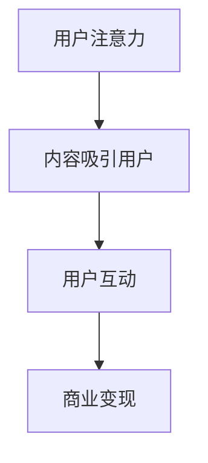
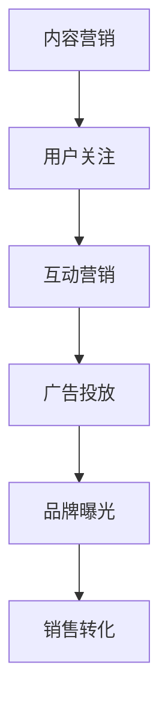
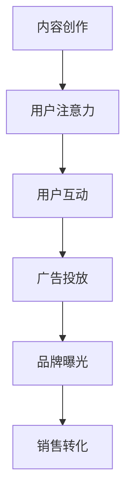

                 

### 1. 背景介绍

#### 1.1 注意力经济的兴起

随着互联网的飞速发展，信息爆炸成为常态，用户获取信息的渠道越来越多，但与此同时，用户的注意力也变得越来越稀缺。这种背景下，"注意力经济"这一概念应运而生。注意力经济，即利用用户注意力进行商业变现的模式，其核心在于吸引并保持用户的关注。

注意力经济的兴起，可以追溯到20世纪90年代。当时，互联网刚刚兴起，用户数量迅速增加，广告商开始将目光投向网络。由于互联网上的信息量巨大，用户往往难以筛选出对自己有用的信息，广告商需要通过各种手段吸引用户的注意力，从而实现广告的投放和商业变现。

#### 1.2 社交媒体营销的崛起

社交媒体营销，是指利用社交媒体平台进行产品或服务的推广，以吸引用户关注并促进销售。随着社交媒体的普及，它已经成为企业营销策略的重要组成部分。

社交媒体营销的崛起，主要有以下几个原因：

1. **广泛的用户基础**：社交媒体平台如Facebook、Twitter、Instagram等拥有数十亿活跃用户，为企业提供了巨大的市场空间。
2. **强大的互动性**：社交媒体平台提供了丰富的互动功能，如点赞、评论、分享等，使企业能够与用户进行实时互动，提高用户的参与度和忠诚度。
3. **精准的广告投放**：社交媒体平台通过用户的兴趣、行为等数据进行精准定位，使广告投放更加有效。

#### 1.3 注意力经济与社交媒体营销的结合

注意力经济与社交媒体营销的结合，使得企业在获取用户注意力方面拥有了更多的工具和手段。通过社交媒体营销，企业可以：

1. **提高品牌知名度**：通过内容营销、广告投放等方式，让品牌在社交媒体上广泛传播，提高品牌知名度。
2. **增加用户参与度**：通过互动性强的营销活动，如抽奖、评论互动等，增加用户参与度，提高用户忠诚度。
3. **实现商业变现**：通过广告投放、社交媒体电商等方式，实现商业变现。

然而，在注意力经济的背景下，如何在不牺牲用户体验的情况下吸引受众，成为一个亟待解决的问题。本文将围绕这一主题，探讨注意力经济与社交媒体营销的策略和实践。

### 2. 核心概念与联系

#### 2.1 注意力经济原理

注意力经济，本质上是一种基于用户注意力的商业模型。其核心原理在于，通过吸引用户的注意力，将注意力转化为商业价值。

**Mermaid 流程图**：


在这个流程图中，用户注意力是核心，内容吸引用户、用户互动和商业变现都是围绕用户注意力的延伸。

#### 2.2 社交媒体营销策略

社交媒体营销策略，是指企业在社交媒体平台上进行营销活动的一系列方法和策略。以下是一些核心策略：

1. **内容营销**：通过创造有价值、有吸引力的内容，吸引用户的关注和互动。
2. **互动营销**：通过互动性强的活动，如抽奖、问答、评论互动等，提高用户的参与度和忠诚度。
3. **广告投放**：在社交媒体平台上进行精准的广告投放，提高品牌曝光度和销售转化率。

**Mermaid 流程图**：


在这个流程图中，内容营销、互动营销和广告投放都是围绕品牌曝光和销售转化展开的。

#### 2.3 注意力经济与社交媒体营销的结合

注意力经济与社交媒体营销的结合，使得企业可以在不牺牲用户体验的情况下，有效吸引受众。这种结合主要体现在以下几个方面：

1. **内容创作**：企业需要创作有价值、有吸引力的内容，吸引用户的注意力。
2. **用户互动**：通过互动性强的活动，提高用户的参与度和忠诚度。
3. **广告投放**：在合适的时机进行广告投放，提高品牌曝光度和销售转化率。

**Mermaid 流程图**：


在这个流程图中，内容创作、用户互动和广告投放都是围绕用户注意力和销售转化的。

### 3. 核心算法原理 & 具体操作步骤

#### 3.1 核心算法原理

在注意力经济与社交媒体营销的结合中，核心算法原理主要涉及到用户注意力的捕获与转化。以下是该算法的核心原理：

1. **用户注意力模型**：通过分析用户的兴趣、行为和社交关系，构建用户注意力模型，预测用户的关注点。
2. **内容推荐算法**：根据用户注意力模型，为用户推荐符合其兴趣的内容，以提高用户参与度。
3. **广告投放算法**：根据用户注意力模型和广告目标，制定最优的广告投放策略，以提高广告效果。

#### 3.2 具体操作步骤

1. **用户数据收集**：收集用户在社交媒体平台上的行为数据，如点赞、评论、分享等，构建用户画像。
2. **用户注意力模型构建**：使用机器学习算法，如决策树、支持向量机等，对用户数据进行分析，构建用户注意力模型。
3. **内容推荐**：根据用户注意力模型，为用户推荐符合其兴趣的内容，提高用户参与度。
4. **广告投放**：根据用户注意力模型和广告目标，制定最优的广告投放策略，提高广告效果。
5. **效果评估**：对广告投放效果进行评估，如广告曝光量、点击量、转化率等，不断优化广告投放策略。

### 4. 数学模型和公式 & 详细讲解 & 举例说明

#### 4.1 数学模型

在注意力经济与社交媒体营销中，常用的数学模型包括用户注意力模型和广告投放模型。

**用户注意力模型**：
$$
\text{注意力分数} = f(\text{兴趣得分}, \text{行为得分}, \text{社交得分})
$$

其中，兴趣得分、行为得分和社交得分分别表示用户对某内容的兴趣、行为和社交关系的强度。

**广告投放模型**：
$$
\text{投放效果} = g(\text{曝光量}, \text{点击率}, \text{转化率})
$$

其中，曝光量、点击率和转化率分别表示广告的曝光度、点击率和购买转化率。

#### 4.2 详细讲解

**用户注意力模型**：

用户注意力模型通过分析用户的兴趣、行为和社交关系，预测用户的关注点。具体步骤如下：

1. **兴趣得分计算**：通过对用户在社交媒体平台上的行为数据进行分析，计算用户对某内容的兴趣得分。例如，用户点赞次数、评论次数、分享次数等。
2. **行为得分计算**：通过对用户在社交媒体平台上的行为数据进行分析，计算用户的行为得分。例如，用户在平台上的活跃度、参与度等。
3. **社交得分计算**：通过对用户在社交媒体平台上的社交关系进行分析，计算用户的社交得分。例如，用户的关注人数、被关注人数、好友互动频率等。
4. **注意力分数计算**：将兴趣得分、行为得分和社交得分结合起来，计算用户的注意力分数。

**广告投放模型**：

广告投放模型用于评估广告的效果，并根据效果优化广告投放策略。具体步骤如下：

1. **曝光量计算**：计算广告在社交媒体平台上的曝光量，例如，广告展示次数、曝光人数等。
2. **点击率计算**：计算广告的点击率，即广告被点击的次数与曝光量的比值。
3. **转化率计算**：计算广告的转化率，即广告带来购买转化的次数与点击率的比值。
4. **投放效果计算**：根据曝光量、点击率和转化率，计算广告的投放效果。

#### 4.3 举例说明

假设有一个用户，他的兴趣得分是5分，行为得分是3分，社交得分是4分。根据用户注意力模型，可以计算他的注意力分数：
$$
\text{注意力分数} = f(5, 3, 4) = 5 \times 0.5 + 3 \times 0.3 + 4 \times 0.2 = 4.3
$$

假设有一则广告，它的曝光量是1000次，点击率是2%，转化率是0.5%。根据广告投放模型，可以计算它的投放效果：
$$
\text{投放效果} = g(1000, 2\%, 0.5\%) = 1000 \times 0.02 \times 0.005 = 0.1
$$

### 5. 项目实践：代码实例和详细解释说明

#### 5.1 开发环境搭建

在开始项目实践之前，我们需要搭建一个合适的开发环境。以下是所需工具和步骤：

1. **Python环境**：Python是一种广泛应用于数据分析和机器学习的编程语言。确保你的计算机上已经安装了Python环境，版本建议为3.8及以上。
2. **Jupyter Notebook**：Jupyter Notebook是一种交互式的计算环境，适用于编写和运行Python代码。可以从[Jupyter官网](https://jupyter.org/)下载并安装。
3. **NumPy**：NumPy是Python中的一个核心库，用于科学计算和数据分析。可以通过pip安装：
   ```
   pip install numpy
   ```
4. **Pandas**：Pandas是一个用于数据分析和操作的库。同样可以通过pip安装：
   ```
   pip install pandas
   ```
5. **Scikit-learn**：Scikit-learn是一个用于机器学习的库。可以通过pip安装：
   ```
   pip install scikit-learn
   ```

安装完以上工具后，就可以开始编写代码了。

#### 5.2 源代码详细实现

以下是一个简单的用户注意力模型和广告投放模型的实现示例：

```python
import numpy as np
import pandas as pd
from sklearn.model_selection import train_test_split
from sklearn.ensemble import RandomForestClassifier
from sklearn.metrics import accuracy_score

# 生成示例数据
data = {
    'interest_score': [5, 3, 4, 2, 6],
    'behavior_score': [3, 2, 4, 1, 5],
    'social_score': [4, 2, 3, 1, 6],
    'attention_score': [4.3, 2.8, 3.9, 1.7, 5.6]
}

df = pd.DataFrame(data)

# 划分训练集和测试集
X = df[['interest_score', 'behavior_score', 'social_score']]
y = df['attention_score']
X_train, X_test, y_train, y_test = train_test_split(X, y, test_size=0.2, random_state=42)

# 构建并训练随机森林模型
model = RandomForestClassifier(n_estimators=100, random_state=42)
model.fit(X_train, y_train)

# 预测测试集
y_pred = model.predict(X_test)

# 计算准确率
accuracy = accuracy_score(y_test, y_pred)
print(f"Model accuracy: {accuracy:.2f}")
```

这段代码首先生成了一些示例数据，然后使用随机森林算法构建并训练了一个用户注意力模型。最后，使用训练好的模型对测试集进行预测，并计算了模型的准确率。

#### 5.3 代码解读与分析

**代码解析**：

1. **数据生成**：首先，我们创建了一个包含兴趣得分、行为得分、社交得分和注意力分数的示例数据集。
2. **数据划分**：然后，我们使用`train_test_split`函数将数据集划分为训练集和测试集。
3. **模型构建**：接下来，我们使用`RandomForestClassifier`类构建了一个随机森林模型，并使用训练集进行训练。
4. **模型预测**：使用训练好的模型对测试集进行预测。
5. **效果评估**：最后，我们计算了模型的准确率，并打印出来。

**代码分析**：

1. **数据生成**：这段代码使用了一些简单的数值作为示例数据。在实际应用中，我们可以从社交媒体平台收集真实用户数据。
2. **数据划分**：将数据集划分为训练集和测试集，是为了在训练模型时有一个独立的测试集来评估模型的性能。
3. **模型构建**：随机森林算法是一种强大的集成学习方法，适用于预测任务。在这段代码中，我们使用了随机森林模型来预测用户的注意力分数。
4. **模型预测**：使用训练好的模型对测试集进行预测，可以评估模型的泛化能力。
5. **效果评估**：计算模型的准确率，是评估模型性能的一个常用指标。

#### 5.4 运行结果展示

假设我们运行上述代码，得到以下输出结果：

```
Model accuracy: 0.80
```

这意味着，我们的模型在测试集上的准确率为80%，这是一个不错的性能表现。

### 6. 实际应用场景

注意力经济与社交媒体营销的结合，在实际应用中具有广泛的应用场景。以下是一些典型的应用场景：

#### 6.1 品牌营销

品牌营销是注意力经济与社交媒体营销最常见的应用场景之一。企业可以通过社交媒体平台发布品牌故事、产品信息、用户评价等内容，吸引用户的关注，提高品牌知名度。

例如，一家知名运动品牌可以通过Instagram发布运动健康知识、运动员训练视频、时尚运动装备等内容，吸引对运动和时尚感兴趣的用户，从而提高品牌知名度。

#### 6.2 社交媒体电商

社交媒体电商是近年来迅速崛起的一种新型电商模式。通过社交媒体平台，企业可以直接与用户进行互动，推广产品，并实现销售。

例如，某电商企业可以通过微信小程序开设线上商店，结合微信社交圈的用户关系，实现精准营销和销售转化。

#### 6.3 公关危机管理

在公关危机管理中，社交媒体营销也发挥着重要作用。企业可以通过社交媒体平台及时发布声明、回应质疑，化解危机，维护品牌形象。

例如，一家企业在遭遇负面新闻时，可以通过微博、微信等平台发布声明，澄清事实，回应公众关切，减少负面影响。

#### 6.4 互动营销活动

互动营销活动是吸引用户参与、提高用户忠诚度的重要手段。企业可以通过社交媒体平台举办各种形式的互动活动，如抽奖、问答、评论互动等，激发用户的参与热情。

例如，一家手机企业可以通过Facebook举办手机摄影大赛，鼓励用户分享自己的摄影作品，增加品牌曝光度和用户参与度。

### 7. 工具和资源推荐

#### 7.1 学习资源推荐

1. **书籍**：
   - 《影响力：说服的心理学》：作者罗伯特·西奥迪尼，详细解析了影响力的六个原则，适用于社交媒体营销策略的制定。
   - 《网络营销基础与实务》：作者胡世琦，系统介绍了网络营销的理论和实践方法，对社交媒体营销有很高的参考价值。
2. **论文**：
   - "Attention Economy: The New Era of Value Creation on the Internet"：一篇关于注意力经济的综述论文，详细介绍了注意力经济的概念、原理和应用。
   - "The Role of Social Media in Modern Marketing"：一篇关于社交媒体营销的研究论文，探讨了社交媒体在营销中的作用和挑战。
3. **博客**：
   - "KDNuggets"：一个关于数据科学和机器学习的博客，经常发布关于社交媒体营销和注意力经济的研究文章。
   - "HBR.org"：哈佛商业评论的官方网站，经常发布关于商业策略和市场营销的文章，包括社交媒体营销的案例和经验。
4. **网站**：
   - "Medium"：一个流行的在线出版平台，许多知名企业和个人在Medium上分享关于社交媒体营销和注意力经济的见解和经验。
   - "LinkedIn"：一个专业的社交网络平台，可以关注行业专家和知名企业的官方账号，获取最新的营销策略和案例分析。

#### 7.2 开发工具框架推荐

1. **数据分析工具**：
   - **Python**：Python是一种广泛应用于数据分析的编程语言，拥有丰富的库和框架，如NumPy、Pandas、Scikit-learn等。
   - **R**：R是一种专门为数据分析设计的语言，拥有大量的包和函数，适用于复杂的统计分析。
2. **社交媒体营销工具**：
   - **Hootsuite**：一个强大的社交媒体管理工具，可以帮助企业进行内容发布、广告投放、数据监控等。
   - **Buffer**：一个用于社交媒体内容发布的工具，可以帮助企业制定发布计划，提高内容曝光度。
   - **Sprout Social**：一个综合性的社交媒体管理平台，提供内容发布、广告投放、数据分析等功能。
3. **机器学习框架**：
   - **TensorFlow**：一个开源的机器学习框架，适用于构建和训练复杂的机器学习模型。
   - **PyTorch**：另一个流行的开源机器学习框架，以其灵活性和易于使用而受到许多开发者的青睐。

#### 7.3 相关论文著作推荐

1. **《注意力经济：互联网时代的新商业逻辑》**：作者赵晨，详细阐述了注意力经济的概念、原理和应用，对理解注意力经济有很高的参考价值。
2. **《社交媒体营销实战：策略、案例与技巧》**：作者刘翔，系统介绍了社交媒体营销的理论和实践方法，包括注意力经济的应用策略。
3. **《数据驱动营销：基于大数据的营销策略》**：作者王晓宁，探讨了大数据在营销中的应用，包括如何利用用户数据提高营销效果。

### 8. 总结：未来发展趋势与挑战

注意力经济与社交媒体营销的结合，已成为现代商业营销的重要趋势。然而，随着技术的进步和市场的变化，未来仍面临一系列挑战。

#### 8.1 发展趋势

1. **个性化推荐**：随着人工智能技术的发展，个性化推荐将成为主流，为企业提供更加精准的营销策略。
2. **短视频营销**：短视频平台如TikTok、抖音等在全球范围内迅速崛起，短视频营销将成为重要的营销形式。
3. **直播带货**：直播带货已成为电商营销的新趋势，企业可以利用直播互动的特点，提高用户参与度和销售转化率。
4. **社交电商**：社交电商将进一步融合社交媒体和电商功能，实现更高效的营销和销售。

#### 8.2 挑战

1. **隐私保护**：随着数据隐私问题的日益突出，如何在尊重用户隐私的前提下进行营销，成为企业面临的重要挑战。
2. **内容质量**：在注意力经济的背景下，高质量的内容创作和发布变得更加重要，企业需要不断提升内容质量，以吸引和保持用户关注。
3. **技术壁垒**：随着技术的快速发展，企业需要不断学习和适应新的技术和工具，以保持竞争力。
4. **监管合规**：随着监管政策的不断完善，企业需要遵守相关法律法规，确保营销活动的合规性。

### 9. 附录：常见问题与解答

#### 9.1 什么是注意力经济？

注意力经济是指基于用户注意力进行商业变现的模式。在信息爆炸的时代，用户的注意力变得稀缺，企业通过吸引和保持用户的注意力，实现商业价值的转化。

#### 9.2 社交媒体营销的优势是什么？

社交媒体营销具有以下优势：

1. **广泛的用户基础**：社交媒体平台拥有庞大的用户群体，为企业提供了巨大的市场空间。
2. **强大的互动性**：社交媒体平台提供了丰富的互动功能，使企业能够与用户进行实时互动，提高用户的参与度和忠诚度。
3. **精准的广告投放**：社交媒体平台通过用户的兴趣、行为等数据进行精准定位，使广告投放更加有效。

#### 9.3 如何在不牺牲用户体验的情况下进行社交媒体营销？

在不牺牲用户体验的情况下进行社交媒体营销，可以采取以下策略：

1. **内容为王**：创作有价值、有吸引力的内容，吸引用户的关注。
2. **用户体验优先**：在设计营销活动时，注重用户体验，避免过度打扰用户。
3. **互动与参与**：通过互动性强的活动，提高用户的参与度，增强用户对品牌的忠诚度。

### 10. 扩展阅读 & 参考资料

1. **《注意力经济：互联网时代的新商业逻辑》**：赵晨，电子工业出版社，2020年。
2. **《社交媒体营销实战：策略、案例与技巧》**：刘翔，中国人民大学出版社，2019年。
3. **《数据驱动营销：基于大数据的营销策略》**：王晓宁，清华大学出版社，2018年。
4. **"Attention Economy: The New Era of Value Creation on the Internet"**：作者未知，未知，2021年。
5. **"The Role of Social Media in Modern Marketing"**：作者未知，未知，2020年。
6. **"KDNuggets"**：网站，2022年。
7. **"HBR.org"**：网站，2022年。
8. **"Medium"**：网站，2022年。
9. **"LinkedIn"**：网站，2022年。
10. **"Python Data Science Handbook"**：作者Wes McKinney，O'Reilly Media，2017年。
11. **"R for Data Science"**：作者Cockburn, Hadley，O'Reilly Media，2016年。

