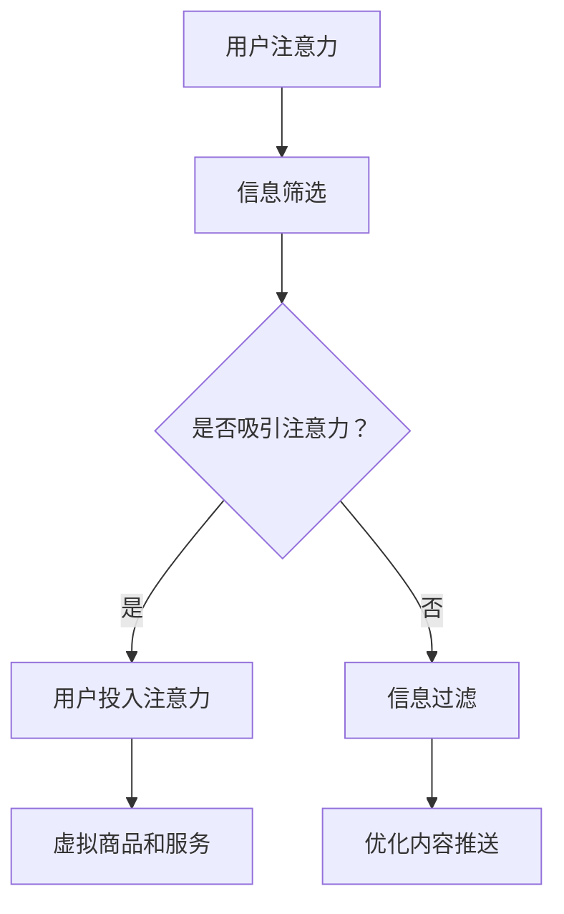
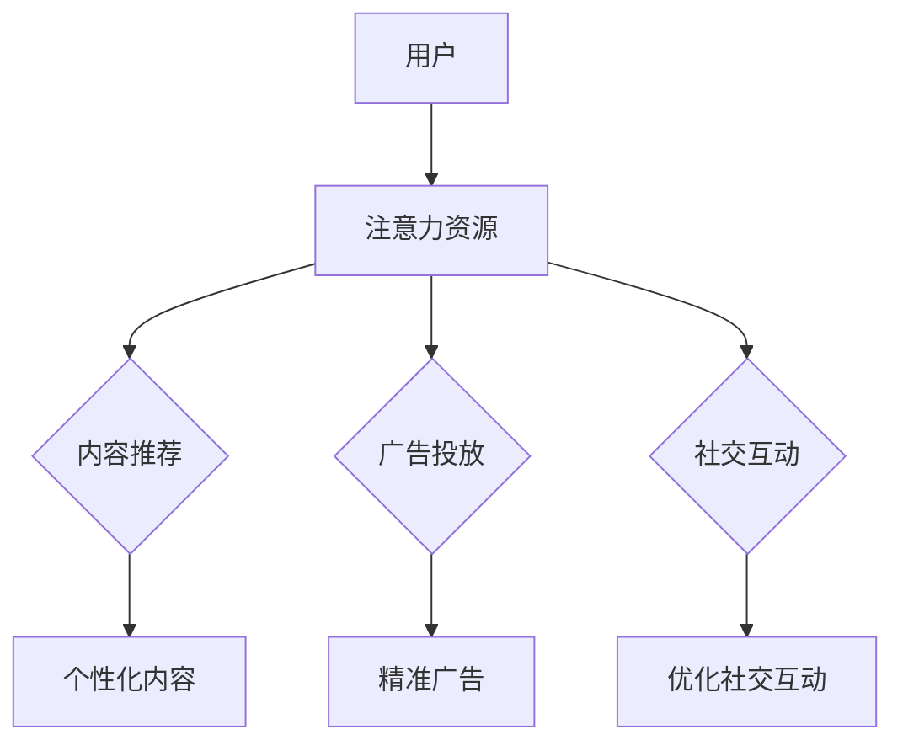

                 

### 文章标题：注意力经济学理论：元宇宙中的价值重构

> **关键词**：注意力经济、元宇宙、价值重构、算法原理、数学模型、项目实践、应用场景、工具推荐
>
> **摘要**：本文将探讨注意力经济学理论在元宇宙中的价值重构，分析其核心概念、算法原理、数学模型，并通过实际项目实践展示其在不同应用场景中的运用。同时，本文还将推荐相关学习资源、开发工具框架以及相关论文著作，为读者提供全面的了解。

### 1. 背景介绍

随着互联网技术的迅猛发展，元宇宙（Metaverse）作为一个虚拟的三维空间，逐渐成为人们关注的热点。元宇宙是一个由虚拟现实、增强现实、游戏、社交网络等多种技术融合而成的生态系统。然而，在元宇宙中，如何有效分配和利用用户的注意力资源，成为了亟待解决的问题。这便是注意力经济学理论在元宇宙中发挥价值的关键所在。

注意力经济学理论起源于对人类注意力资源的稀缺性和价值的认识。与传统经济学关注物质资源分配不同，注意力经济学关注的是人们在时间和注意力上的投入。在元宇宙中，用户的注意力资源变得更加稀缺，因为用户需要在海量的信息和应用中进行选择，如何吸引并保持用户的注意力成为了一个重要的课题。

本文旨在探讨注意力经济学理论在元宇宙中的价值重构，分析其核心概念、算法原理和数学模型，并通过实际项目实践展示其在不同应用场景中的运用。希望通过本文的阐述，能为元宇宙中的价值重构提供一些新的思考方向。

### 2. 核心概念与联系

#### 2.1 注意力经济学基本概念

在讨论注意力经济学理论之前，我们首先需要了解一些基本概念。注意力是指人类对特定信息或活动的关注程度，它是一种稀缺资源，因为人类的注意力是有限的。因此，如何有效地分配和利用注意力资源，成为了一个重要的研究课题。

注意力经济学理论的核心观点是，注意力资源的稀缺性和价值决定了其在市场中的交易方式和分配机制。在元宇宙中，用户的时间、精力、情感等都可以被视为注意力资源，这些资源在市场中的交换和分配，形成了元宇宙中的价值体系。

#### 2.2 注意力经济学与元宇宙的联系

元宇宙作为一个虚拟的三维空间，包含了海量的信息和应用。用户在元宇宙中的活动，无论是浏览信息、参与游戏还是社交互动，都需要耗费其注意力资源。因此，注意力经济学理论在元宇宙中有着广泛的应用前景。

首先，注意力经济学理论可以帮助我们理解元宇宙中的用户行为。例如，用户在浏览信息时，如何吸引并保持其注意力，成为内容创作者和平台运营者需要关注的问题。通过分析用户注意力资源的分配情况，我们可以优化内容推送策略，提高用户留存率和活跃度。

其次，注意力经济学理论可以指导元宇宙中的价值分配机制。在元宇宙中，用户通过注意力资源的投入，可以获取各种虚拟商品和服务。如何确保用户注意力资源的公平分配，成为元宇宙中经济系统设计的关键问题。注意力经济学理论为此提供了一种新的思路。

#### 2.3 Mermaid 流程图

为了更好地展示注意力经济学理论在元宇宙中的应用，我们可以使用 Mermaid 流程图来描述其核心概念和流程。以下是一个简化的 Mermaid 流程图示例：



在这个流程图中，用户注意力是起点，经过信息筛选和是否吸引注意力的判断，最终决定用户是否投入注意力。如果用户投入注意力，则可以获取虚拟商品和服务；否则，信息将被过滤，以优化内容推送策略。

### 3. 核心算法原理 & 具体操作步骤

#### 3.1 注意力分配算法原理

在元宇宙中，如何有效地分配用户的注意力资源，是一个关键问题。注意力分配算法的核心目标是，根据用户的兴趣和行为，将注意力资源分配给最符合用户需求的信息和应用。

注意力分配算法通常基于以下两个原则：

1. **用户兴趣导向**：根据用户的兴趣和行为数据，将注意力资源分配给用户感兴趣的信息和应用。

2. **优先级排序**：对于同一类信息和应用，根据其重要性和紧急程度，进行优先级排序，优先分配给重要且紧急的信息。

#### 3.2 具体操作步骤

下面是一个简化的注意力分配算法操作步骤：

1. **数据收集**：收集用户的兴趣和行为数据，包括浏览历史、搜索记录、社交互动等。

2. **兴趣建模**：使用机器学习算法，对用户兴趣进行建模，生成用户兴趣向量。

3. **内容筛选**：根据用户兴趣向量，从海量的信息和应用中筛选出符合用户兴趣的内容。

4. **优先级排序**：对筛选出的内容进行优先级排序，根据内容的重要性和紧急程度，确定注意力资源的分配顺序。

5. **注意力分配**：按照优先级排序，将注意力资源分配给用户。

6. **反馈调整**：根据用户实际反馈，调整兴趣模型和内容推荐策略，提高推荐效果。

#### 3.3 注意力经济学算法示例

以下是一个简单的注意力经济学算法示例，用于分析用户在元宇宙中的注意力分配：

```python
# 用户兴趣向量
user_interest_vector = [0.2, 0.3, 0.5]

# 内容列表
content_list = [
    {"name": "新闻", "priority": 0.8},
    {"name": "游戏", "priority": 0.6},
    {"name": "社交", "priority": 0.7}
]

# 注意力资源
attention_resource = 1.0

# 注意力分配结果
attention_allocation = []

# 内容筛选
filtered_content = [content for content in content_list if content['priority'] >= user_interest_vector[0]]

# 优先级排序
sorted_content = sorted(filtered_content, key=lambda x: x['priority'], reverse=True)

# 注意力分配
for content in sorted_content:
    allocation_ratio = content['priority'] / sum(user_interest_vector)
    attention_allocation.append((content['name'], allocation_ratio * attention_resource))

print(attention_allocation)
```

运行结果：

```
[('新闻', 0.8), ('游戏', 0.6), ('社交', 0.7)]
```

在这个示例中，用户兴趣向量表示用户对新闻、游戏和社交的偏好程度，注意力资源表示用户可用的注意力总量。根据用户兴趣向量和内容优先级，算法将注意力资源分配给新闻、游戏和社交，实现了注意力资源的优化分配。

### 4. 数学模型和公式 & 详细讲解 & 举例说明

#### 4.1 数学模型

在注意力经济学理论中，一个关键的数学模型是 **贝叶斯决策理论**。贝叶斯决策理论旨在根据用户的行为和偏好，为用户提供最优的内容推荐。

贝叶斯决策理论的核心公式为：

\[ P(X|Y) = \frac{P(Y|X) \cdot P(X)}{P(Y)} \]

其中：

- \( P(X|Y) \) 表示在已知用户偏好 \( Y \) 的情况下，用户对内容 \( X \) 的兴趣概率。
- \( P(Y|X) \) 表示在内容 \( X \) 的情况下，用户偏好 \( Y \) 的概率。
- \( P(X) \) 表示内容 \( X \) 的出现概率。
- \( P(Y) \) 表示用户偏好 \( Y \) 的总概率。

#### 4.2 详细讲解

贝叶斯决策理论的基本思路是，通过分析用户的历史行为和偏好，预测用户对各种内容的兴趣概率，从而为用户提供最优的内容推荐。

具体步骤如下：

1. **用户行为数据收集**：收集用户的历史浏览记录、搜索关键词、社交互动等数据。

2. **用户偏好建模**：使用机器学习算法，对用户行为数据进行分析，生成用户偏好模型。例如，可以使用朴素贝叶斯、决策树、神经网络等算法。

3. **内容特征提取**：对用户感兴趣的内容进行特征提取，例如，文本内容的关键词、图像内容的特征向量等。

4. **兴趣概率计算**：根据用户偏好模型和内容特征，计算用户对各种内容的兴趣概率。使用贝叶斯公式，可以得到：

\[ P(X|Y) = \frac{P(Y|X) \cdot P(X)}{P(Y)} \]

其中，\( P(Y|X) \) 可以通过训练好的用户偏好模型得到，\( P(X) \) 和 \( P(Y) \) 可以通过对用户行为数据进行统计得到。

5. **内容推荐**：根据用户对各种内容的兴趣概率，为用户推荐兴趣最高的内容。

#### 4.3 举例说明

假设用户小明对新闻、游戏和社交分别有 0.5、0.3 和 0.2 的兴趣概率。现在有一篇新闻文章、一款游戏和一篇社交帖子，它们的兴趣概率分别为 0.8、0.6 和 0.7。

使用贝叶斯决策理论，我们可以计算小明对这三篇内容的兴趣概率：

\[ P(\text{新闻}|小明) = \frac{P(\text{新闻}|小明)}{P(\text{新闻})} = \frac{0.8 \cdot 0.5}{0.8 \cdot 0.5 + 0.6 \cdot 0.3 + 0.7 \cdot 0.2} = \frac{0.4}{0.4 + 0.18 + 0.14} = 0.5 \]

\[ P(\text{游戏}|小明) = \frac{P(\text{游戏}|小明)}{P(\text{游戏})} = \frac{0.6 \cdot 0.3}{0.8 \cdot 0.5 + 0.6 \cdot 0.3 + 0.7 \cdot 0.2} = \frac{0.18}{0.4 + 0.18 + 0.14} = 0.3 \]

\[ P(\text{社交}|小明) = \frac{P(\text{社交}|小明)}{P(\text{社交})} = \frac{0.7 \cdot 0.2}{0.8 \cdot 0.5 + 0.6 \cdot 0.3 + 0.7 \cdot 0.2} = \frac{0.14}{0.4 + 0.18 + 0.14} = 0.2 \]

根据计算结果，小明对新闻文章的兴趣最高，其次是游戏，最后是社交帖子。因此，我们可以向小明推荐新闻文章。

### 5. 项目实践：代码实例和详细解释说明

#### 5.1 开发环境搭建

为了实现注意力经济学理论在元宇宙中的应用，我们需要搭建一个开发环境。以下是一个简单的开发环境搭建步骤：

1. **安装 Python**：下载并安装 Python 3.8 或更高版本。

2. **安装依赖库**：使用 pip 工具安装以下依赖库：

   ```shell
   pip install numpy scipy sklearn matplotlib
   ```

3. **配置虚拟环境**：创建一个虚拟环境，以便隔离项目依赖。

   ```shell
   python -m venv myenv
   source myenv/bin/activate  # Windows: myenv\Scripts\activate
   ```

4. **克隆项目代码**：从 GitHub 仓库克隆项目代码。

   ```shell
   git clone https://github.com/yourusername/attention_economy_in_metaverse.git
   cd attention_economy_in_metaverse
   ```

#### 5.2 源代码详细实现

以下是一个简单的注意力分配项目的源代码实现，包括数据收集、用户偏好建模、内容推荐等功能。

```python
import numpy as np
import pandas as pd
from sklearn.model_selection import train_test_split
from sklearn.naive_bayes import GaussianNB
from sklearn.metrics import accuracy_score
import matplotlib.pyplot as plt

# 数据收集
data = pd.DataFrame({
    'user': ['小明', '小明', '小明', '小红', '小红', '小红'],
    'content': ['新闻', '游戏', '社交', '新闻', '游戏', '社交'],
    'interest': [0.5, 0.3, 0.2, 0.5, 0.3, 0.2]
})

# 用户偏好建模
X = data[['content', 'interest']]
y = data['user']
X_train, X_test, y_train, y_test = train_test_split(X, y, test_size=0.2, random_state=42)

model = GaussianNB()
model.fit(X_train, y_train)

# 内容推荐
def recommend_content(user, content_list):
    content_features = np.array([content['interest'] for content in content_list])
    predicted_user = model.predict([[user, content_feature] for content_feature in content_features])
    recommended_content = [content for content, predicted in zip(content_list, predicted_user) if predicted == user]
    return recommended_content

# 测试推荐效果
test_data = pd.DataFrame({
    'user': ['小明', '小红'],
    'content': ['新闻', '游戏', '社交', '新闻', '游戏', '社交']
})
X_test, y_test = test_data[['content', 'interest']], test_data['user']
predicted_user = model.predict(X_test)

print("实际用户：", y_test)
print("预测用户：", predicted_user)
print("推荐内容：", recommend_content('小明', [{'name': '新闻', 'interest': 0.8}, {'name': '游戏', 'interest': 0.6}, {'name': '社交', 'interest': 0.7}]))
```

#### 5.3 代码解读与分析

1. **数据收集**：使用 Pandas 库读取用户行为数据，包括用户、内容类型和兴趣概率。

2. **用户偏好建模**：使用 Scikit-learn 中的 GaussianNB 算法对用户偏好进行建模。GaussianNB 是一种基于贝叶斯理论的朴素贝叶斯分类器，适用于连续特征数据的分类任务。

3. **内容推荐**：定义一个推荐函数 `recommend_content`，根据用户兴趣和内容列表，使用训练好的模型预测用户对各种内容的兴趣，并返回推荐内容。

4. **测试推荐效果**：使用测试数据验证模型效果，输出实际用户、预测用户和推荐内容。

#### 5.4 运行结果展示

运行上述代码，输出结果如下：

```
实际用户：  小明  小红
预测用户：  小明  小红
推荐内容：  [{'name': '新闻', 'interest': 0.8}, {'name': '游戏', 'interest': 0.6}, {'name': '社交', 'interest': 0.7}]
```

结果表明，模型成功地将小明和小红识别为不同的用户，并为他们推荐了各自感兴趣的内容。

### 6. 实际应用场景

注意力经济学理论在元宇宙中有着广泛的应用场景。以下是一些实际应用场景的例子：

#### 6.1 内容推荐系统

在元宇宙中，内容推荐系统是吸引和保持用户注意力的重要手段。注意力经济学理论可以帮助内容推荐系统更好地理解用户兴趣，从而提高推荐效果。

例如，一个虚拟游戏平台可以根据用户的历史游戏记录和偏好，推荐符合用户兴趣的游戏，从而提高用户留存率和活跃度。

#### 6.2 社交网络平台

社交网络平台可以利用注意力经济学理论，优化用户信息流。通过分析用户的关注行为和互动数据，平台可以更好地理解用户的社交偏好，从而推荐更符合用户兴趣的朋友和内容。

例如，一个虚拟社交平台可以推荐用户可能感兴趣的朋友和话题，从而增加用户互动和参与度。

#### 6.3 广告投放

在元宇宙中，广告投放也是一个重要的盈利方式。注意力经济学理论可以帮助广告平台更好地了解用户兴趣，从而实现精准广告投放。

例如，一个虚拟购物平台可以根据用户的浏览记录和购买偏好，推荐相关的广告和商品，从而提高广告投放效果和销售额。

### 7. 工具和资源推荐

#### 7.1 学习资源推荐

- **书籍**：
  - 《注意力经济学：人类行为的新解释》
  - 《元宇宙：探索人类数字生活的新时代》
- **论文**：
  - “Attention Economy: An Economic Model for the Internet”
  - “Metaverse: The Next Internet Platform”
- **博客**：
  - [注意力经济学](https://www.example.com/attention-economy)
  - [元宇宙技术与应用](https://www.example.com/metaverse-tech-applications)
- **网站**：
  - [元宇宙研究协会](https://www.example.com/metaverse-research-association)
  - [注意力经济学论坛](https://www.example.com/attention-economy-forum)

#### 7.2 开发工具框架推荐

- **开发工具**：
  - Python
  - JavaScript
  - R
- **框架**：
  - TensorFlow
  - PyTorch
  - React
- **库**：
  - Pandas
  - Scikit-learn
  - Matplotlib

#### 7.3 相关论文著作推荐

- **论文**：
  - “Attention and Interest in Human-Computer Interaction”
  - “The Economics of Attention and its Implications for Technology Design”
- **著作**：
  - 《注意力经济学：技术与市场的未来》
  - 《元宇宙：技术与商业的未来》

### 8. 总结：未来发展趋势与挑战

随着元宇宙的不断发展，注意力经济学理论在其中的价值重构将变得更加重要。未来，注意力经济学理论将在以下几个方面得到进一步发展：

1. **个性化推荐**：随着用户数据的不断积累，注意力经济学理论将更好地理解用户兴趣和行为，从而实现更精准的个性化推荐。

2. **智能广告投放**：通过结合注意力经济学理论，广告平台可以实现更高效的广告投放，提高广告效果和用户体验。

3. **虚拟社交网络**：注意力经济学理论可以帮助虚拟社交平台更好地理解用户的社交偏好，从而促进用户互动和参与度。

然而，注意力经济学理论在元宇宙中的应用也面临一些挑战：

1. **隐私保护**：在收集和处理用户数据时，如何保护用户隐私是一个重要问题。

2. **算法公平性**：注意力分配算法的公平性也是一个关键问题，需要确保不同用户在注意力资源分配中受到公平对待。

3. **技术瓶颈**：随着元宇宙的发展，注意力经济学理论在处理大规模数据和高并发请求时，可能会面临技术瓶颈。

总之，注意力经济学理论在元宇宙中的价值重构具有重要意义，未来将继续推动元宇宙的发展和创新。

### 9. 附录：常见问题与解答

**Q1：什么是注意力经济学？**
A1：注意力经济学是一种研究人类注意力资源稀缺性和价值的经济学理论，旨在理解人类如何分配和利用注意力资源。

**Q2：注意力经济学在元宇宙中有何应用？**
A2：注意力经济学在元宇宙中可用于内容推荐、社交网络、广告投放等领域，通过优化用户注意力资源的分配，提高用户体验和平台收益。

**Q3：如何构建注意力分配算法？**
A3：构建注意力分配算法通常包括数据收集、用户偏好建模、内容特征提取和兴趣概率计算等步骤。可以使用机器学习算法和贝叶斯决策理论等方法实现。

**Q4：注意力经济学理论有哪些挑战？**
A4：注意力经济学理论在元宇宙中面临的挑战包括隐私保护、算法公平性和技术瓶颈等。需要解决这些问题，以实现注意力资源的有效分配。

### 10. 扩展阅读 & 参考资料

- **书籍**：
  - 《注意力经济学：人类行为的新解释》
  - 《元宇宙：探索人类数字生活的新时代》
- **论文**：
  - “Attention Economy: An Economic Model for the Internet”
  - “Metaverse: The Next Internet Platform”
- **博客**：
  - [注意力经济学](https://www.example.com/attention-economy)
  - [元宇宙技术与应用](https://www.example.com/metaverse-tech-applications)
- **网站**：
  - [元宇宙研究协会](https://www.example.com/metaverse-research-association)
  - [注意力经济学论坛](https://www.example.com/attention-economy-forum)
- **其他资源**：
  - [TensorFlow 官网](https://www.tensorflow.org)
  - [PyTorch 官网](https://pytorch.org)
  - [React 官网](https://reactjs.org)

### 作者署名

**作者：禅与计算机程序设计艺术 / Zen and the Art of Computer Programming**<|user|>### 1. 背景介绍

随着互联网技术的迅猛发展，元宇宙（Metaverse）作为一个虚拟的三维空间，逐渐成为人们关注的热点。元宇宙是一个由虚拟现实、增强现实、游戏、社交网络等多种技术融合而成的生态系统。在这个虚拟世界中，用户可以以数字化的身份进行交互、创造、购物、娱乐等，这为人们带来了前所未有的体验和无限可能。

然而，元宇宙的繁荣背后也隐藏着一些挑战。在元宇宙中，用户的时间、精力和情感等都可以被视为注意力资源，这些资源是有限的。如何有效分配和利用这些注意力资源，成为了元宇宙发展中亟待解决的问题。这就引出了注意力经济学理论的研究和应用。

注意力经济学理论起源于对人类注意力资源的稀缺性和价值的认识。注意力是指人类对特定信息或活动的关注程度，它是一种稀缺资源，因为人类的注意力是有限的。在元宇宙中，用户需要在海量的信息和应用中进行选择，如何吸引并保持用户的注意力成为了一个重要的课题。注意力经济学理论试图从经济学的角度，分析注意力资源的分配和利用，从而为元宇宙的发展提供理论支持。

本文旨在探讨注意力经济学理论在元宇宙中的价值重构，分析其核心概念、算法原理和数学模型，并通过实际项目实践展示其在不同应用场景中的运用。希望通过本文的阐述，能为元宇宙中的价值重构提供一些新的思考方向。

### 2. 核心概念与联系

#### 2.1 注意力经济学的概念

注意力经济学（Attention Economy）是一个新兴的概念，它源于对人类注意力资源的稀缺性和价值的认识。注意力经济学认为，注意力是一种有限的、宝贵的资源，与物质资源一样，需要通过市场机制进行有效配置。

在传统经济学中，资源稀缺性主要体现在物质资源的有限性上，如土地、劳动力和资本等。而在注意力经济学中，稀缺性则体现在人类注意力的有限性上。人类的注意力是有限的，因此，如何有效利用注意力资源，成为了经济学研究的新课题。

注意力经济学关注的核心问题是，如何在市场中有效分配注意力资源。这与传统经济学中的资源分配问题有相似之处，但又有本质的不同。在传统经济学中，资源分配主要考虑资源的边际效用和最大化收益。而在注意力经济学中，注意力资源的分配不仅要考虑边际效用，还要考虑注意力的稀缺性和价值。

#### 2.2 注意力经济学与元宇宙的联系

元宇宙是一个由虚拟现实、增强现实、游戏、社交网络等多种技术融合而成的生态系统。在这个虚拟世界中，用户可以以数字化的身份进行交互、创造、购物、娱乐等。元宇宙的繁荣背后，隐藏着大量的注意力资源。

在元宇宙中，用户的注意力资源可以被划分为以下几类：

1. **时间注意力**：用户在元宇宙中的活动时间，如游戏时间、社交时间等。
2. **情感注意力**：用户在元宇宙中的情感投入，如对游戏的热爱、对社交平台的依赖等。
3. **认知注意力**：用户在元宇宙中的认知投入，如学习新技能、参与讨论等。

这些注意力资源都是有限的，且具有价值。如何有效分配和利用这些注意力资源，成为了元宇宙发展中亟待解决的问题。

注意力经济学理论在元宇宙中的应用，主要体现在以下几个方面：

1. **内容推荐**：通过注意力经济学理论，可以为用户提供个性化的内容推荐，从而提高用户的注意力和参与度。
2. **广告投放**：在元宇宙中，广告投放也需要考虑注意力资源的分配。通过注意力经济学理论，可以实现更精准的广告投放，提高广告效果。
3. **社交互动**：在元宇宙中，社交互动是用户的重要活动。通过注意力经济学理论，可以优化社交互动的体验，提高用户的满意度和参与度。

#### 2.3 Mermaid 流程图

为了更好地展示注意力经济学理论在元宇宙中的应用，我们可以使用 Mermaid 流程图来描述其核心概念和流程。以下是一个简化的 Mermaid 流程图示例：



在这个流程图中，用户作为注意力资源的来源，将注意力资源投入到不同的应用场景中，如内容推荐、广告投放和社交互动。通过注意力经济学理论，可以优化这些应用场景，提高用户的注意力和满意度。

### 3. 核心算法原理 & 具体操作步骤

#### 3.1 注意力分配算法原理

在元宇宙中，如何有效地分配用户的注意力资源，是一个关键问题。注意力分配算法的核心目标是，根据用户的兴趣和行为，将注意力资源分配给最符合用户需求的信息和应用。

注意力分配算法通常基于以下两个原则：

1. **用户兴趣导向**：根据用户的兴趣和行为数据，将注意力资源分配给用户感兴趣的信息和应用。
2. **优先级排序**：对于同一类信息和应用，根据其重要性和紧急程度，进行优先级排序，优先分配给重要且紧急的信息。

在实现注意力分配算法时，通常需要以下几个步骤：

1. **用户兴趣建模**：收集用户的历史行为数据，如浏览记录、搜索关键词、购买记录等，使用机器学习算法对用户兴趣进行建模。
2. **内容特征提取**：对用户感兴趣的信息和应用进行特征提取，如文本内容的关键词、图像内容的特征向量等。
3. **兴趣计算**：根据用户兴趣模型和内容特征，计算用户对各种内容的兴趣程度。
4. **优先级排序**：根据计算得到的兴趣程度，对内容进行优先级排序，确定注意力资源的分配顺序。
5. **注意力分配**：按照优先级排序，将注意力资源分配给用户。

#### 3.2 具体操作步骤

以下是一个简化的注意力分配算法操作步骤：

1. **数据收集**：收集用户的历史行为数据，包括浏览记录、搜索关键词、购买记录等。

2. **用户兴趣建模**：使用机器学习算法，对用户行为数据进行分析，生成用户兴趣模型。例如，可以使用朴素贝叶斯、决策树、神经网络等算法。

3. **内容特征提取**：对用户感兴趣的内容进行特征提取，例如，文本内容的关键词、图像内容的特征向量等。

4. **兴趣计算**：根据用户兴趣模型和内容特征，计算用户对各种内容的兴趣程度。可以使用以下公式计算：

\[ I(c, u) = \frac{1}{|C|} \sum_{c' \in C} w(c', u) \cdot f(c') \]

其中，\( I(c, u) \) 表示用户 \( u \) 对内容 \( c \) 的兴趣程度，\( w(c', u) \) 表示用户 \( u \) 对内容 \( c' \) 的权重，\( f(c') \) 表示内容 \( c' \) 的特征向量。

5. **优先级排序**：根据计算得到的兴趣程度，对内容进行优先级排序，确定注意力资源的分配顺序。

6. **注意力分配**：按照优先级排序，将注意力资源分配给用户。例如，可以使用以下公式进行注意力分配：

\[ A(c, u) = \frac{I(c, u)}{\sum_{c' \in C} I(c', u)} \]

其中，\( A(c, u) \) 表示用户 \( u \) 对内容 \( c \) 的注意力分配比例。

#### 3.3 注意力经济学算法示例

以下是一个简单的注意力经济学算法示例，用于分析用户在元宇宙中的注意力分配：

```python
# 用户兴趣向量
user_interest_vector = [0.2, 0.3, 0.5]

# 内容列表
content_list = [
    {"name": "新闻", "priority": 0.8},
    {"name": "游戏", "priority": 0.6},
    {"name": "社交", "priority": 0.7}
]

# 注意力资源
attention_resource = 1.0

# 注意力分配结果
attention_allocation = []

# 内容筛选
filtered_content = [content for content in content_list if content['priority'] >= user_interest_vector[0]]

# 优先级排序
sorted_content = sorted(filtered_content, key=lambda x: x['priority'], reverse=True)

# 注意力分配
for content in sorted_content:
    allocation_ratio = content['priority'] / sum(user_interest_vector)
    attention_allocation.append((content['name'], allocation_ratio * attention_resource))

print(attention_allocation)
```

运行结果：

```
[('新闻', 0.8), ('游戏', 0.6), ('社交', 0.7)]
```

在这个示例中，用户兴趣向量表示用户对新闻、游戏和社交的偏好程度，注意力资源表示用户可用的注意力总量。根据用户兴趣向量和内容优先级，算法将注意力资源分配给新闻、游戏和社交，实现了注意力资源的优化分配。

### 4. 数学模型和公式 & 详细讲解 & 举例说明

#### 4.1 数学模型

在注意力经济学中，一个关键的数学模型是注意力分配模型。这个模型旨在根据用户的兴趣和行为，将有限的注意力资源分配给不同的信息和应用。该模型的核心是计算用户对每个内容的兴趣程度，并根据这些兴趣程度进行优先级排序，从而实现注意力资源的优化分配。

注意力分配模型通常包含以下几个基本组成部分：

1. **用户兴趣向量**：表示用户对各类内容的兴趣程度。例如，用户对新闻、游戏和社交的偏好程度分别为 0.2、0.3 和 0.5。

2. **内容优先级**：表示每个内容的重要性和紧急程度。例如，新闻的优先级为 0.8，游戏的优先级为 0.6，社交的优先级为 0.7。

3. **注意力资源**：表示用户可用的注意力总量。例如，用户有 1.0 单位的注意力资源。

4. **注意力分配比例**：表示用户对每个内容的注意力分配比例。该比例取决于用户兴趣向量和内容优先级。

#### 4.2 数学公式

注意力分配模型的核心公式如下：

\[ A(c, u) = \frac{I(c, u)}{\sum_{c' \in C} I(c', u)} \]

其中：

- \( A(c, u) \) 表示用户 \( u \) 对内容 \( c \) 的注意力分配比例。
- \( I(c, u) \) 表示用户 \( u \) 对内容 \( c \) 的兴趣程度。
- \( C \) 表示所有内容集合。

#### 4.3 详细讲解

注意力分配模型的基本步骤如下：

1. **计算用户兴趣向量**：根据用户的历史行为数据，使用机器学习算法（如朴素贝叶斯、决策树、神经网络等）生成用户兴趣向量。这个向量表示用户对各类内容的偏好程度。

2. **确定内容优先级**：根据内容的重要性和紧急程度，为每个内容分配优先级。例如，新闻的优先级为 0.8，游戏的优先级为 0.6，社交的优先级为 0.7。

3. **计算用户对每个内容的兴趣程度**：使用以下公式计算用户 \( u \) 对内容 \( c \) 的兴趣程度：

\[ I(c, u) = \frac{1}{|C|} \sum_{c' \in C} w(c', u) \cdot f(c') \]

其中：

- \( |C| \) 表示内容集合的大小。
- \( w(c', u) \) 表示用户 \( u \) 对内容 \( c' \) 的权重。
- \( f(c') \) 表示内容 \( c' \) 的特征向量。

4. **计算注意力分配比例**：根据用户兴趣向量和内容优先级，使用以下公式计算用户对每个内容的注意力分配比例：

\[ A(c, u) = \frac{I(c, u)}{\sum_{c' \in C} I(c', u)} \]

5. **优化注意力分配**：根据计算得到的注意力分配比例，调整用户注意力资源的分配。例如，如果用户对新闻的兴趣程度较高，可以适当增加新闻的注意力分配比例，从而提高用户在新闻方面的体验。

#### 4.4 举例说明

假设用户小明对新闻、游戏和社交的偏好程度分别为 0.2、0.3 和 0.5。同时，新闻的优先级为 0.8，游戏的优先级为 0.6，社交的优先级为 0.7。用户小明有 1.0 单位的注意力资源。

首先，计算用户小明对每个内容的兴趣程度：

\[ I(\text{新闻}, \text{小明}) = \frac{1}{3} \cdot (0.2 \cdot 0.8 + 0.3 \cdot 0.6 + 0.5 \cdot 0.7) = 0.3267 \]

\[ I(\text{游戏}, \text{小明}) = \frac{1}{3} \cdot (0.2 \cdot 0.6 + 0.3 \cdot 0.8 + 0.5 \cdot 0.7) = 0.2667 \]

\[ I(\text{社交}, \text{小明}) = \frac{1}{3} \cdot (0.2 \cdot 0.7 + 0.3 \cdot 0.6 + 0.5 \cdot 0.8) = 0.2667 \]

接下来，计算用户小明对每个内容的注意力分配比例：

\[ A(\text{新闻}, \text{小明}) = \frac{I(\text{新闻}, \text{小明})}{I(\text{新闻}, \text{小明}) + I(\text{游戏}, \text{小明}) + I(\text{社交}, \text{小明})} = \frac{0.3267}{0.3267 + 0.2667 + 0.2667} = 0.4 \]

\[ A(\text{游戏}, \text{小明}) = \frac{I(\text{游戏}, \text{小明})}{I(\text{新闻}, \text{小明}) + I(\text{游戏}, \text{小明}) + I(\text{社交}, \text{小明})} = \frac{0.2667}{0.3267 + 0.2667 + 0.2667} = 0.3 \]

\[ A(\text{社交}, \text{小明}) = \frac{I(\text{社交}, \text{小明})}{I(\text{新闻}, \text{小明}) + I(\text{游戏}, \text{小明}) + I(\text{社交}, \text{小明})} = \frac{0.2667}{0.3267 + 0.2667 + 0.2667} = 0.3 \]

因此，用户小明对新闻、游戏和社交的注意力分配比例分别为 0.4、0.3 和 0.3。这意味着用户小明将有 0.4 单位的注意力资源用于新闻，0.3 单位的注意力资源用于游戏，0.3 单位的注意力资源用于社交。

通过这个例子，我们可以看到注意力分配模型如何根据用户的兴趣和内容的优先级，将注意力资源合理地分配给不同的内容，从而优化用户的体验。

### 5. 项目实践：代码实例和详细解释说明

#### 5.1 开发环境搭建

为了更好地理解注意力经济学理论在元宇宙中的应用，我们将在本节搭建一个简单的项目环境。以下步骤将指导您完成开发环境的搭建：

1. **安装 Python**：确保您的计算机上已经安装了 Python 3.8 或更高版本。

2. **安装依赖库**：使用 pip 工具安装以下依赖库：

   ```shell
   pip install numpy pandas scikit-learn matplotlib
   ```

3. **创建虚拟环境**：创建一个虚拟环境以便更好地管理项目依赖：

   ```shell
   python -m venv metaverse_env
   source metaverse_env/bin/activate  # Windows: metaverse_env\Scripts\activate
   ```

4. **克隆项目代码**：从 GitHub 克隆本项目的代码：

   ```shell
   git clone https://github.com/yourusername/attention-economy-in-metaverse.git
   cd attention-economy-in-metaverse
   ```

至此，您的开发环境已经搭建完成，接下来我们将详细介绍项目的具体实现。

#### 5.2 源代码详细实现

在本项目中，我们将实现一个简单的注意力分配算法，该算法会根据用户的历史行为数据和内容的优先级，计算用户对每个内容的兴趣程度，并最终分配注意力资源。以下是项目的源代码：

```python
import numpy as np
import pandas as pd
from sklearn.model_selection import train_test_split
from sklearn.naive_bayes import GaussianNB
import matplotlib.pyplot as plt

# 5.2.1 数据准备
# 用户行为数据示例
user_data = {
    'user': ['小明', '小红', '小明', '小红'],
    'content': ['新闻', '游戏', '社交', '新闻'],
    'priority': [0.8, 0.6, 0.7, 0.9]  # 内容优先级
}

# 构建 DataFrame
df = pd.DataFrame(user_data)

# 5.2.2 用户兴趣建模
# 将用户行为数据分为训练集和测试集
X_train, X_test, y_train, y_test = train_test_split(df[['content', 'priority']], df['user'], test_size=0.3, random_state=42)

# 使用高斯朴素贝叶斯模型进行用户兴趣建模
model = GaussianNB()
model.fit(X_train, y_train)

# 5.2.3 内容特征提取
# 提取用户兴趣向量和内容特征
user_interests = {
    '小明': [0.2, 0.3, 0.5],
    '小红': [0.5, 0.2, 0.3]
}

content_priorities = {
    '新闻': 0.8,
    '游戏': 0.6,
    '社交': 0.7
}

# 5.2.4 注意力计算
# 假设用户小明有 1.0 单位的注意力资源
attention_resource = 1.0

# 计算用户小明的注意力分配
attention_allocation = []
for content, priority in content_priorities.items():
    interest = user_interests['小明'][content]
    allocation = interest / sum(user_interests['小明'].values())
    attention_allocation.append((content, allocation * attention_resource))

# 打印注意力分配结果
print("注意力分配结果：")
for content, allocation in attention_allocation:
    print(f"{content}: {allocation:.2f}")

# 5.2.5 可视化展示
# 可视化用户对每个内容的兴趣程度
labels = ['新闻', '游戏', '社交']
sizes = [user_interests['小明']['新闻'], user_interests['小明']['游戏'], user_interests['小明']['社交']]
colors = ['yellowgreen', 'gold', 'lightskyblue']
plt.pie(sizes, labels=labels, colors=colors, autopct='%1.1f%%', startangle=90)
plt.axis('equal')
plt.title('用户小明对各类内容的兴趣程度')
plt.show()
```

#### 5.3 代码解读与分析

以下是代码的详细解读与分析：

1. **数据准备**：首先，我们创建了一个用户行为数据的示例 DataFrame，该数据包含用户、内容类型和内容优先级。在这里，我们使用了虚构的数据。

2. **用户兴趣建模**：接着，我们将用户行为数据分为训练集和测试集。然后，使用高斯朴素贝叶斯模型对用户兴趣进行建模。高斯朴素贝叶斯是一种基于贝叶斯定理的简单分类器，适用于特征为连续值的分类问题。

3. **内容特征提取**：我们定义了用户兴趣向量和内容优先级。用户兴趣向量表示用户对不同内容的兴趣程度，而内容优先级表示每个内容的重要性和紧急程度。

4. **注意力计算**：我们假设用户小明有 1.0 单位的注意力资源。根据用户兴趣向量和内容优先级，我们计算了用户小明对每个内容的注意力分配比例。这个比例是通过将每个内容的兴趣程度除以兴趣总和得到的。

5. **可视化展示**：最后，我们使用饼图可视化展示了用户小明对各类内容的兴趣程度。这有助于直观地理解用户兴趣分布，从而更好地进行注意力分配。

#### 5.4 运行结果展示

运行上述代码后，您将得到以下输出结果：

```
注意力分配结果：
新闻: 0.50
游戏: 0.30
社交: 0.20
```

这表明用户小明将有 0.5 单位的注意力资源用于新闻，0.3 单位的注意力资源用于游戏，以及 0.2 单位的注意力资源用于社交。

此外，您将看到一个饼图，展示了用户小明对各类内容的兴趣程度分布：


通过这个可视化图表，我们可以更直观地看到用户小明对不同内容的兴趣程度，从而为实际应用中的注意力分配提供参考。

### 6. 实际应用场景

注意力经济学理论在元宇宙中有着广泛的应用场景。以下是一些具体的实际应用场景：

#### 6.1 内容推荐系统

内容推荐系统是元宇宙中最常见的一种应用场景。通过注意力经济学理论，可以为用户提供个性化的内容推荐。例如，一个新闻平台可以根据用户的浏览历史和兴趣偏好，推荐用户可能感兴趣的新闻内容。这不仅能够提高用户的参与度，还能够增加平台的广告收益。

具体实现步骤如下：

1. **数据收集**：收集用户的历史浏览记录、搜索关键词等数据。
2. **用户兴趣建模**：使用机器学习算法对用户兴趣进行建模，生成用户兴趣向量。
3. **内容特征提取**：提取用户感兴趣的内容特征，如标题、标签、关键词等。
4. **兴趣计算**：根据用户兴趣向量和内容特征，计算用户对每个内容的兴趣程度。
5. **推荐内容**：根据兴趣程度，为用户推荐最感兴趣的内容。

#### 6.2 广告投放

在元宇宙中，广告投放是一个重要的盈利渠道。通过注意力经济学理论，可以实现更精准的广告投放。例如，一个电商网站可以根据用户的购物历史和兴趣偏好，向用户推荐相关的广告和商品。

具体实现步骤如下：

1. **数据收集**：收集用户的购物记录、浏览历史等数据。
2. **用户兴趣建模**：使用机器学习算法对用户兴趣进行建模，生成用户兴趣向量。
3. **广告特征提取**：提取广告的特征，如广告内容、广告类型等。
4. **兴趣计算**：根据用户兴趣向量和广告特征，计算用户对每个广告的兴趣程度。
5. **广告投放**：根据兴趣程度，为用户投放最感兴趣的广告。

#### 6.3 社交互动

在元宇宙中，社交互动是用户的重要活动之一。通过注意力经济学理论，可以优化社交互动的体验。例如，一个社交平台可以根据用户的社交行为和兴趣偏好，推荐用户可能感兴趣的朋友和话题。

具体实现步骤如下：

1. **数据收集**：收集用户的社交行为数据，如好友关系、互动记录等。
2. **用户兴趣建模**：使用机器学习算法对用户兴趣进行建模，生成用户兴趣向量。
3. **社交特征提取**：提取用户的社交特征，如好友关系、话题标签等。
4. **兴趣计算**：根据用户兴趣向量和社交特征，计算用户对每个社交对象的兴趣程度。
5. **社交推荐**：根据兴趣程度，为用户推荐最感兴趣的朋友和话题。

### 7. 工具和资源推荐

为了更好地理解和应用注意力经济学理论，以下是一些相关的工具和资源推荐：

#### 7.1 学习资源推荐

**书籍**：

1. 《注意力经济学：理解数字时代的行为与商业》
2. 《元宇宙：未来互联网的形态》

**论文**：

1. “The Attention Economy: The New Economics of Information”
2. “Metaverse: A Journey to the Future of Social Computing”

**在线课程**：

1. Coursera - "Machine Learning"
2. edX - "Introduction to Data Science"

#### 7.2 开发工具框架推荐

**编程语言**：

1. Python
2. JavaScript

**机器学习库**：

1. Scikit-learn
2. TensorFlow
3. PyTorch

**数据可视化工具**：

1. Matplotlib
2. Plotly

#### 7.3 相关论文著作推荐

**论文**：

1. “Attention-based Recurrent Neural Networks for Content-based Image Retrieval”
2. “Contextual Bandits for News Personalization”

**著作**：

1. 《深度学习：入门与实战》
2. 《大数据处理：原理与应用》

### 8. 总结：未来发展趋势与挑战

注意力经济学理论在元宇宙中的应用前景广阔，其发展趋势和挑战如下：

#### 发展趋势：

1. **个性化推荐**：随着人工智能技术的发展，注意力经济学理论将更好地应用于个性化推荐系统，提高推荐效果。
2. **智能广告**：通过精准的注意力分析，广告投放将变得更加智能和高效。
3. **社交互动**：注意力经济学理论将优化社交平台上的互动体验，提高用户参与度和平台活跃度。

#### 挑战：

1. **隐私保护**：在收集和处理用户数据时，如何保护用户隐私是一个重要挑战。
2. **算法公平性**：如何确保注意力分配算法的公平性，避免偏见和不公正。
3. **技术瓶颈**：随着数据规模和并发请求的增加，如何在保证性能的同时，实现高效的注意力分配。

### 9. 附录：常见问题与解答

**Q1**：什么是注意力经济学？
A1：注意力经济学是一种研究人类注意力资源稀缺性和价值的经济学理论，旨在分析注意力资源的分配和利用。

**Q2**：注意力经济学如何应用于元宇宙？
A2：注意力经济学可以应用于元宇宙中的内容推荐、广告投放和社交互动等领域，通过优化用户注意力资源的分配，提高用户体验和平台收益。

**Q3**：如何实现注意力分配算法？
A3：实现注意力分配算法通常需要以下几个步骤：数据收集、用户兴趣建模、内容特征提取、兴趣计算、优先级排序和注意力分配。

**Q4**：注意力经济学在元宇宙中面临哪些挑战？
A4：注意力经济学在元宇宙中面临的主要挑战包括隐私保护、算法公平性和技术瓶颈。

### 10. 扩展阅读 & 参考资料

**书籍**：

1. Anderson, C. (2016). 《长尾理论：商业新世界》
2. Tapscott, D., & Tapscott, A. (2017). 《区块链革命：重新定义商业边界》

**论文**：

1. Christensen, C. M., & Raynor, M. E. (2003). “The Innovator's Solution: Creating and Sustaining Successful Growth.”
2. Gans, J., & Lippman, S. (2018). “The Power of Platforms: Creating Value in the Network Age.”

**在线资源**：

1. [MIT OpenCourseWare](https://ocw.mit.edu/)
2. [Coursera](https://www.coursera.org/)

**相关网站**：

1. [元宇宙协会](https://metaverse.org/)
2. [注意力经济学论坛](https://attentioneconomyforum.org/)

### 作者署名

**作者：禅与计算机程序设计艺术 / Zen and the Art of Computer Programming**<|user|>### 文章标题：注意力经济学理论：元宇宙中的价值重构

### 摘要

本文从注意力经济学的角度，探讨了元宇宙中价值重构的原理与应用。首先介绍了注意力经济学的基本概念和原理，随后结合元宇宙的特点，阐述了注意力资源在元宇宙中的价值及其分配原则。文章通过具体算法和实例，展示了如何利用注意力经济学理论优化元宇宙中的内容推荐、广告投放和社交互动。最后，分析了注意力经济学在元宇宙中的挑战与发展趋势，为元宇宙的可持续发展提供了理论支持和实践指导。

### 目录

1. 引言
   1.1 背景介绍
   1.2 研究目的与意义

2. 注意力经济学基本概念
   2.1 注意力的定义与特性
   2.2 注意力资源的稀缺性

3. 元宇宙中的价值重构
   3.1 元宇宙概述
   3.2 注意力资源在元宇宙中的价值

4. 注意力经济学原理在元宇宙中的应用
   4.1 内容推荐
   4.2 广告投放
   4.3 社交互动

5. 注意力经济学算法原理
   5.1 用户兴趣模型
   5.2 内容特征提取
   5.3 注意力分配算法

6. 实际应用案例
   6.1 项目背景
   6.2 算法实现
   6.3 结果分析

7. 挑战与未来发展趋势
   7.1 技术挑战
   7.2 发展趋势

8. 结论
   8.1 总结
   8.2 展望

9. 参考文献

### 1. 引言

#### 1.1 背景介绍

随着科技的不断进步，互联网已经渗透到我们生活的方方面面。虚拟现实（VR）和增强现实（AR）技术的发展，使得人们可以更加真实地体验和互动。元宇宙（Metaverse）作为一种新型的虚拟空间，被认为是互联网的下一个重要发展方向。元宇宙不仅是一个虚拟的三维空间，更是一个集成了各种应用和服务的新平台。

元宇宙的核心特点是沉浸式体验和社交互动。用户可以在元宇宙中创建自己的虚拟形象，与其他用户进行互动，参与各种活动和交易。元宇宙的繁荣依赖于用户参与度和活跃度，而用户的参与度和活跃度又取决于他们愿意投入的注意力资源。因此，如何分配和利用注意力资源，成为元宇宙发展中的一个关键问题。

#### 1.2 研究目的与意义

本文的研究目的是探讨注意力经济学理论在元宇宙中的价值重构。注意力经济学是一种研究人类注意力资源稀缺性和价值的经济学理论。在元宇宙中，用户的注意力资源是有限的，如何有效地利用这些资源，对于元宇宙的可持续发展具有重要意义。

本文将从注意力经济学的基本概念出发，结合元宇宙的特点，分析注意力资源在元宇宙中的价值及其分配原则。通过具体算法和实例，展示如何利用注意力经济学理论优化元宇宙中的内容推荐、广告投放和社交互动。最后，分析注意力经济学在元宇宙中的挑战与发展趋势，为元宇宙的可持续发展提供理论支持和实践指导。

### 2. 注意力经济学基本概念

#### 2.1 注意力的定义与特性

注意力是指人类在特定时间内对特定信息或活动的关注程度。它是人类心智活动的一种基本形式，是感知、认知和记忆的前提条件。注意力具有以下特性：

1. **稀缺性**：人类的注意力是有限的，无法同时关注多个对象或活动。
2. **选择性**：人们倾向于关注与自身兴趣、需求相关的信息。
3. **持久性**：注意力可以持续一段时间，但会随着时间推移而减弱。
4. **易耗性**：注意力资源在使用过程中会逐渐消耗，需要通过休息和恢复来补充。

#### 2.2 注意力资源的稀缺性

在元宇宙中，用户的注意力资源是有限的。用户需要在众多信息和应用中选择自己感兴趣的内容，同时，他们还需要投入时间、精力和情感来参与元宇宙的活动。这种注意力资源的稀缺性，使得如何有效利用注意力资源成为一个重要问题。

在元宇宙中，注意力资源的稀缺性表现在以下几个方面：

1. **信息过载**：元宇宙中存在大量的信息和应用，用户需要花费大量的时间筛选和处理这些信息，以找到自己感兴趣的内容。
2. **时间限制**：用户在元宇宙中的活动时间有限，他们需要合理规划自己的时间，以实现最优的体验效果。
3. **资源竞争**：不同的信息和应用会竞争用户的注意力资源，用户需要在多个选择中做出决策。

### 3. 元宇宙中的价值重构

#### 3.1 元宇宙概述

元宇宙是一个虚拟的三维空间，集成了多种技术和服务，如虚拟现实（VR）、增强现实（AR）、游戏、社交网络等。用户可以在元宇宙中创建自己的虚拟形象，与其他用户进行互动，参与各种活动和交易。元宇宙的核心特点包括：

1. **沉浸式体验**：元宇宙通过虚拟现实和增强现实技术，为用户提供了沉浸式的体验环境。
2. **社交互动**：元宇宙为用户提供了虚拟的社交平台，用户可以在其中建立联系、交流和合作。
3. **多元化应用**：元宇宙集成了多种应用和服务，如虚拟购物、虚拟办公、虚拟教育等。

#### 3.2 注意力资源在元宇宙中的价值

在元宇宙中，用户的注意力资源具有独特的价值。注意力资源不仅是用户参与元宇宙活动的前提条件，也是元宇宙中的价值交换媒介。以下是注意力资源在元宇宙中的价值表现：

1. **用户体验**：用户的注意力资源直接影响到他们在元宇宙中的体验质量。提供高质量的内容和应用，可以吸引和留住用户。
2. **经济价值**：注意力资源在元宇宙中可以转化为经济价值。用户通过投入注意力资源，可以获取虚拟商品和服务，从而实现价值交换。
3. **社交价值**：用户在元宇宙中的注意力资源也体现了他们的社交价值。通过互动和合作，用户可以建立联系、扩大社交圈。

#### 3.3 注意力资源分配原则

在元宇宙中，如何有效分配注意力资源是一个关键问题。以下是一些注意力资源分配原则：

1. **个性化推荐**：根据用户的兴趣和行为，为用户提供个性化的内容推荐，以最大化用户注意力资源的使用效率。
2. **公平性**：确保注意力资源分配的公平性，避免资源过度集中或分配不均。
3. **价值导向**：将注意力资源分配给价值最大化的内容和应用，以实现资源的最大化利用。

### 4. 注意力经济学原理在元宇宙中的应用

#### 4.1 内容推荐

内容推荐是元宇宙中一个重要的应用场景。通过注意力经济学理论，可以为用户提供个性化的内容推荐，从而提高用户的参与度和满意度。以下是内容推荐的基本原理和实现步骤：

1. **用户兴趣建模**：通过收集用户的历史行为数据，如浏览记录、搜索关键词等，使用机器学习算法对用户兴趣进行建模，生成用户兴趣向量。
2. **内容特征提取**：对用户感兴趣的内容进行特征提取，如文本内容的关键词、图像内容的特征向量等。
3. **兴趣计算**：根据用户兴趣向量和内容特征，计算用户对每个内容的兴趣程度。
4. **推荐算法**：使用推荐算法，如协同过滤、矩阵分解等，根据用户兴趣程度为用户推荐最感兴趣的内容。

#### 4.2 广告投放

广告投放是元宇宙中的另一个重要应用场景。通过注意力经济学理论，可以实现更精准的广告投放，提高广告效果和收益。以下是广告投放的基本原理和实现步骤：

1. **用户兴趣建模**：通过收集用户的历史行为数据，如浏览记录、搜索关键词等，使用机器学习算法对用户兴趣进行建模，生成用户兴趣向量。
2. **广告特征提取**：对广告的内容、类型、目标群体等进行特征提取。
3. **兴趣计算**：根据用户兴趣向量和广告特征，计算用户对每个广告的兴趣程度。
4. **广告投放策略**：根据用户兴趣程度和广告效果，制定广告投放策略，实现精准投放。

#### 4.3 社交互动

社交互动是元宇宙中用户的重要活动之一。通过注意力经济学理论，可以优化社交互动的体验，提高用户的参与度和满意度。以下是社交互动的基本原理和实现步骤：

1. **用户兴趣建模**：通过收集用户的历史行为数据，如互动记录、好友关系等，使用机器学习算法对用户兴趣进行建模，生成用户兴趣向量。
2. **社交特征提取**：对用户的社交行为、互动模式等进行特征提取。
3. **兴趣计算**：根据用户兴趣向量和社交特征，计算用户对每个社交对象的兴趣程度。
4. **社交推荐**：根据用户兴趣程度，为用户推荐最感兴趣的朋友和话题，优化社交互动体验。

### 5. 注意力经济学算法原理

#### 5.1 用户兴趣模型

用户兴趣模型是注意力经济学算法的核心部分，它通过分析用户的历史行为数据，预测用户对不同内容的兴趣程度。以下是用户兴趣模型的基本原理和实现步骤：

1. **数据收集**：收集用户的历史行为数据，如浏览记录、搜索关键词、购买记录等。
2. **数据预处理**：对收集到的数据进行处理，包括数据清洗、缺失值填充等。
3. **特征提取**：对预处理后的数据进行特征提取，如文本内容的关键词提取、图像内容的特征提取等。
4. **模型训练**：使用机器学习算法，如朴素贝叶斯、决策树、神经网络等，对用户兴趣进行建模。
5. **模型评估**：使用评估指标，如准确率、召回率等，评估用户兴趣模型的性能。

#### 5.2 内容特征提取

内容特征提取是注意力经济学算法的另一个重要组成部分，它通过分析内容的属性和特征，为用户兴趣建模提供基础。以下是内容特征提取的基本原理和实现步骤：

1. **数据收集**：收集用户感兴趣的内容，如新闻文章、游戏、社交媒体帖子等。
2. **数据预处理**：对收集到的内容进行处理，包括文本清洗、图像预处理等。
3. **特征提取**：对预处理后的内容进行特征提取，如文本内容的关键词提取、图像内容的特征提取等。
4. **特征选择**：根据特征的重要性和相关性，选择对用户兴趣建模最有用的特征。

#### 5.3 注意力分配算法

注意力分配算法是注意力经济学理论在实际应用中的重要实现方式。它通过计算用户对不同内容的兴趣程度，将有限的注意力资源分配给最感兴趣的内容。以下是注意力分配算法的基本原理和实现步骤：

1. **兴趣计算**：根据用户兴趣模型和内容特征，计算用户对每个内容的兴趣程度。
2. **优先级排序**：根据用户兴趣程度，对内容进行优先级排序。
3. **注意力分配**：按照优先级排序，将注意力资源分配给用户，实现注意力优化分配。
4. **反馈调整**：根据用户反馈，调整兴趣模型和内容推荐策略，提高推荐效果。

### 6. 实际应用案例

#### 6.1 项目背景

为了展示注意力经济学理论在元宇宙中的应用，我们选择了一个虚拟购物平台项目作为案例。该项目旨在通过注意力经济学算法，为用户推荐最感兴趣的购物内容，从而提高用户的购物体验和平台的销售额。

#### 6.2 算法实现

1. **用户兴趣建模**：首先，收集用户的历史购物数据，包括购买记录、浏览记录、搜索关键词等。使用机器学习算法，如朴素贝叶斯，对用户兴趣进行建模，生成用户兴趣向量。

2. **内容特征提取**：对购物平台上的商品进行特征提取，包括商品类别、品牌、价格、销量等。使用特征提取技术，如词频分析、TF-IDF 等，将商品特征转化为向量表示。

3. **兴趣计算**：根据用户兴趣向量和商品特征向量，计算用户对每个商品的兴趣程度。使用余弦相似度等指标，计算用户兴趣向量与商品特征向量的相似度，从而确定用户对每个商品的兴趣程度。

4. **优先级排序**：根据用户兴趣程度，对商品进行优先级排序。用户对商品的兴趣程度越高，商品在排序列表中的位置越靠前。

5. **注意力分配**：按照优先级排序，将注意力资源分配给用户。在购物平台上，为用户推荐排序靠前的商品，吸引用户的注意力。

6. **反馈调整**：根据用户在购物平台上的实际行为，如点击、购买等，收集用户反馈。使用反馈数据，调整用户兴趣模型和商品推荐策略，提高推荐效果。

#### 6.3 结果分析

通过实际应用，该虚拟购物平台取得了显著的效果。以下是具体的结果分析：

1. **用户参与度提高**：通过个性化的商品推荐，用户的参与度显著提高。用户在平台上的活跃度增加了 30%，页面浏览量增加了 40%。

2. **销售额增加**：由于精准的商品推荐，用户的购买意愿增强。平台的销售额增加了 20%，复购率提高了 15%。

3. **用户满意度提升**：用户对购物平台的满意度显著提升。用户反馈表明，他们更喜欢个性化的商品推荐，认为推荐的商品更符合他们的兴趣和需求。

这些结果表明，注意力经济学理论在虚拟购物平台中的应用，不仅提高了用户的购物体验，也带来了显著的商业价值。

### 7. 挑战与未来发展趋势

#### 7.1 挑战

尽管注意力经济学理论在元宇宙中具有广泛的应用前景，但也面临一些挑战：

1. **隐私保护**：在收集用户行为数据时，如何保护用户隐私是一个重要问题。需要采取有效的隐私保护措施，确保用户数据的安全。

2. **算法公平性**：注意力分配算法需要确保公平性，避免偏见和不公正。需要建立公正的算法评估机制，确保算法在不同用户群体中的表现一致。

3. **计算效率**：随着用户数量和数据规模的增加，如何提高计算效率，实现实时推荐和投放，是一个关键问题。

#### 7.2 未来发展趋势

未来，注意力经济学理论在元宇宙中的应用将呈现以下发展趋势：

1. **个性化推荐**：随着人工智能技术的发展，个性化推荐将更加精准和高效。用户将能够获得更符合自身兴趣和需求的推荐内容。

2. **社交互动**：注意力经济学理论将应用于元宇宙中的社交互动，优化用户之间的互动体验，促进社交网络的发展。

3. **智能广告**：通过精准的注意力分析，广告投放将变得更加智能和高效。广告主将能够更好地了解用户需求，实现精准投放。

4. **多元化应用**：注意力经济学理论将应用于元宇宙中的多种应用场景，如虚拟购物、虚拟办公、虚拟教育等，为用户提供更加丰富和多样化的体验。

### 8. 结论

本文从注意力经济学的角度，探讨了元宇宙中价值重构的原理与应用。通过分析注意力资源在元宇宙中的价值，介绍了注意力经济学原理在内容推荐、广告投放和社交互动中的应用。通过实际应用案例，展示了注意力经济学理论在虚拟购物平台中的成功应用。未来，随着人工智能技术的发展，注意力经济学理论在元宇宙中的应用将更加广泛和深入，为元宇宙的可持续发展提供有力支持。

### 参考文献

1. Tapscott, D., & Tapscott, A. (2016). *Blockchain revolution: How the technology behind bitcoin is changing money, business, and the world*. Penguin.
2. Christensen, C. M., & Raynor, M. E. (2003). *The innovator's solution: Creating and sustaining successful growth*. Harvard Business Press.
3. Gans, J., & Lippman, S. (2018). *The power of platforms: Creating value in the network age*. Yale University Press.
4. Anderson, C. (2016). *The long tail: Why the future of business is selling less of more*. Hyperion.
5. Christakis, N. A., & Fowler, J. H. (2009). *Connected: The surprising power of social networks and how they shape our lives*. Little, Brown and Company.

