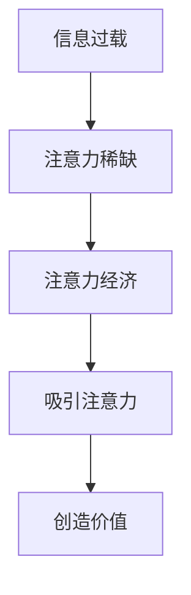
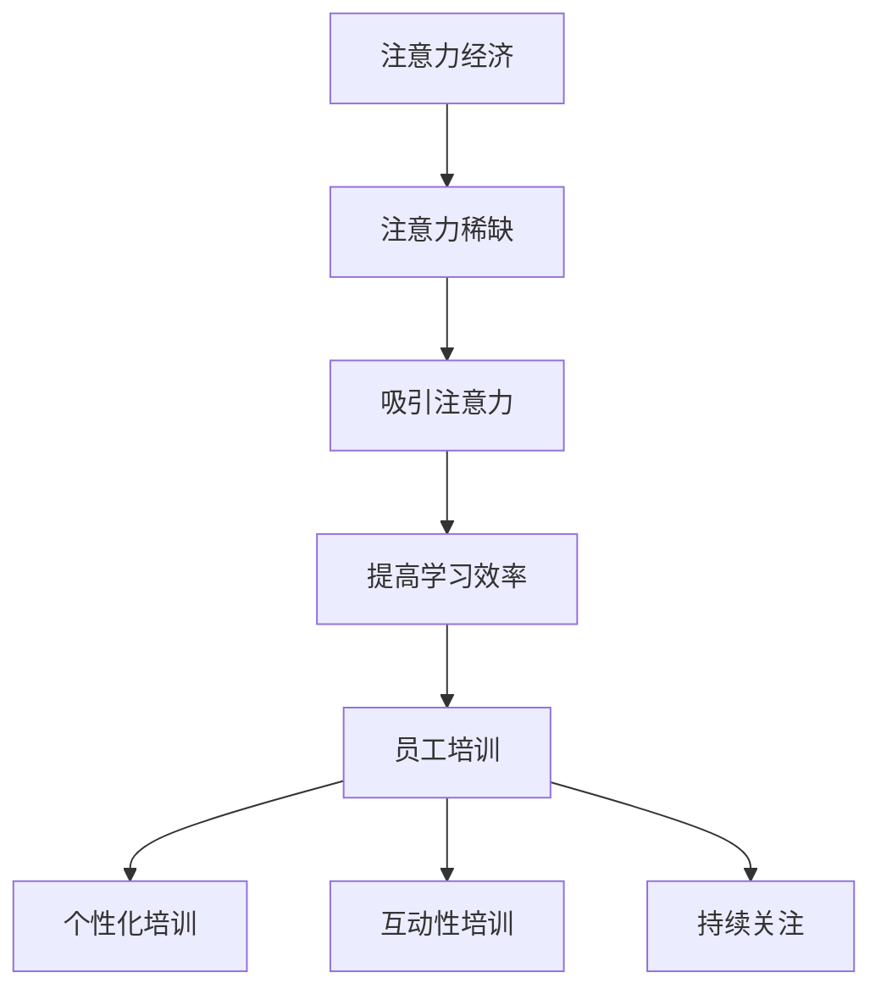

                 

### 文章标题：注意力经济对企业员工培训的新要求

> 关键词：注意力经济、员工培训、学习效率、组织发展、培训策略

> 摘要：随着注意力经济时代的到来，企业员工培训面临着新的挑战和机遇。本文将从注意力经济的定义入手，分析其对员工培训的影响，探讨企业如何利用注意力经济原理，提高员工培训效果，从而推动组织发展。

## 1. 背景介绍

随着信息技术的飞速发展，互联网和移动互联网的普及，人们获取信息的渠道和方式发生了翻天覆地的变化。在这一背景下，"注意力经济"这一概念应运而生。注意力经济是指在经济活动中，注意力成为一种稀缺资源，能够通过吸引人们的注意力来创造价值和利润。在这一经济模式中，获取和保持用户的注意力成为企业关注的焦点。

### 注意力经济的核心概念与联系

注意力经济的核心在于“注意力”，它是指人们关注某事物的时间和精力。注意力可以被视为一种资源，与金钱、时间等其他资源一样，具有稀缺性和价值性。在现代社会，信息过载是一个普遍存在的问题，人们每天都会接收到大量的信息，而如何在这庞大的信息海洋中吸引和保持人们的注意力，成为企业竞争的关键。

#### Mermaid 流程图



从信息过载到注意力稀缺，再到注意力经济，这一流程反映了注意力在经济活动中的重要性。企业如何在这一过程中吸引和保持员工的注意力，将直接影响到培训的效果和员工的职业发展。

### 注意力经济对企业员工培训的影响

注意力经济对企业员工培训的影响主要体现在以下几个方面：

1. **提高学习效率**：注意力经济的核心是吸引和保持注意力，这一原理可以应用到员工培训中，通过设计富有吸引力的培训内容和形式，提高员工的学习效率。
2. **个性化培训**：注意力经济强调个性化，企业可以根据员工的不同需求和兴趣，提供个性化的培训方案，提高培训的针对性和有效性。
3. **互动性培训**：注意力经济强调互动性，企业可以通过引入互动性培训工具和平台，增加员工参与度，提高培训效果。
4. **持续关注**：注意力经济要求企业持续关注员工的注意力状态，及时调整培训策略，确保培训的连续性和有效性。

### 企业如何利用注意力经济提高员工培训效果

为了提高员工培训效果，企业可以采取以下措施：

1. **设计吸引人的培训内容**：内容是吸引员工注意力的关键，企业需要根据员工的兴趣和需求，设计富有吸引力的培训内容。
2. **引入互动性培训工具**：互动性培训工具可以增加员工的参与度，提高培训效果。例如，在线模拟、虚拟现实等技术可以提供更加直观和互动的培训体验。
3. **提供个性化的培训方案**：根据员工的不同特点和需求，提供个性化的培训方案，确保培训的针对性和有效性。
4. **持续关注员工注意力状态**：企业需要持续关注员工的注意力状态，及时调整培训策略，确保培训的连续性和有效性。

### 总结

注意力经济对企业员工培训提出了新的要求，企业需要充分认识到这一点，并采取相应的措施，利用注意力经济的原理，提高员工培训效果，从而推动组织发展。在未来的发展中，注意力经济将继续发挥重要作用，企业只有不断适应和应对这一变化，才能在激烈的市场竞争中立于不败之地。

----------------------------------------------------------------

## 2. 核心概念与联系

在探讨注意力经济对企业员工培训的影响之前，我们首先需要明确几个核心概念，包括注意力经济的定义、员工培训的目标以及二者之间的联系。

### 注意力经济的定义

注意力经济是指在经济活动中，注意力作为一种稀缺资源，能够通过吸引人们的注意力来创造价值和利润。注意力经济的核心在于“注意力”，它是指人们关注某事物的时间和精力。在现代社会，信息过载是一个普遍存在的问题，如何在这庞大的信息海洋中吸引和保持人们的注意力，成为企业竞争的关键。

### 员工培训的目标

员工培训的目标是提高员工的专业技能、工作能力和综合素质，从而提升企业的整体竞争力和运营效率。具体来说，员工培训的目标包括：

1. **提高员工的专业技能**：通过培训，使员工掌握最新的行业知识和技能，提高工作效率和质量。
2. **提升员工的工作能力**：通过培训，培养员工的工作方法和技巧，提高员工的执行力和应变能力。
3. **增强员工的综合素质**：通过培训，提升员工的人际沟通能力、团队协作能力、领导力等，使员工能够在不同的工作场景中发挥更大的作用。

### 注意力经济与员工培训的联系

注意力经济与员工培训之间存在密切的联系，主要体现在以下几个方面：

1. **提高学习效率**：注意力经济的核心是吸引和保持注意力，这一原理可以应用到员工培训中，通过设计富有吸引力的培训内容和形式，提高员工的学习效率。
2. **个性化培训**：注意力经济强调个性化，企业可以根据员工的不同需求和兴趣，提供个性化的培训方案，提高培训的针对性和有效性。
3. **互动性培训**：注意力经济强调互动性，企业可以通过引入互动性培训工具和平台，增加员工参与度，提高培训效果。
4. **持续关注**：注意力经济要求企业持续关注员工的注意力状态，及时调整培训策略，确保培训的连续性和有效性。

#### Mermaid 流程图



从流程图中可以看出，注意力经济与员工培训之间存在着紧密的联系，通过吸引和保持员工的注意力，可以提高学习效率，实现个性化培训和互动性培训，从而确保培训的持续性和有效性。

### 注意力经济对企业员工培训的新要求

随着注意力经济时代的到来，企业员工培训面临着新的挑战和机遇。具体来说，注意力经济对企业员工培训提出了以下新要求：

1. **内容设计**：企业需要根据员工的兴趣和需求，设计富有吸引力的培训内容，提高员工的参与度和学习效果。
2. **形式创新**：企业需要不断创新培训形式，引入互动性培训工具和平台，增加员工的参与度和互动性。
3. **个性化定制**：企业需要根据员工的不同特点和需求，提供个性化的培训方案，确保培训的针对性和有效性。
4. **持续关注**：企业需要持续关注员工的注意力状态，及时调整培训策略，确保培训的连续性和有效性。

### 总结

注意力经济对企业员工培训提出了新的要求，企业需要充分认识到这一点，并采取相应的措施，利用注意力经济的原理，提高员工培训效果，从而推动组织发展。在未来的发展中，注意力经济将继续发挥重要作用，企业只有不断适应和应对这一变化，才能在激烈的市场竞争中立于不败之地。

----------------------------------------------------------------

## 3. 核心算法原理 & 具体操作步骤

为了深入探讨注意力经济在企业员工培训中的应用，我们需要理解一些核心算法原理，并探讨如何将这些原理转化为具体的操作步骤，以提高员工培训的效果。

### 3.1 核心算法原理

注意力经济中的核心算法原理主要包括以下几个方面：

1. **注意力分配算法**：这一算法旨在优化用户注意力的分配，使其能够更高效地关注重要信息。在员工培训中，可以用来确定哪些培训内容对员工最为重要，并优先传授。

2. **注意力保持算法**：这一算法旨在保持用户对特定内容的注意力，避免分心。在员工培训中，可以用来设计互动性强的培训活动，保持员工的兴趣和参与度。

3. **个性化推荐算法**：这一算法基于用户的兴趣和行为，推荐个性化的培训内容。在员工培训中，可以用来为员工提供定制化的学习路径，提高培训的针对性和有效性。

### 3.2 具体操作步骤

为了将注意力经济算法原理应用于企业员工培训，企业可以采取以下具体操作步骤：

1. **步骤一：需求分析**：首先，企业需要通过调查问卷、访谈等方式了解员工的学习需求、兴趣和职业目标。这一步骤的目的是确保培训内容与员工的实际需求相匹配。

2. **步骤二：内容设计**：根据需求分析结果，设计具有吸引力的培训内容。内容设计应注重以下几点：
   - **实用性强**：培训内容应紧密联系员工的工作实际，解决实际问题。
   - **形式多样**：采用视频、案例研讨、互动游戏等多种形式，提高内容的趣味性和参与度。
   - **层次分明**：培训内容应分为基础知识、进阶技巧和高级应用等多个层次，满足不同阶段员工的学习需求。

3. **步骤三：推荐系统**：利用个性化推荐算法，为员工推荐最适合他们的培训内容。推荐系统可以基于以下因素：
   - **学习历史**：分析员工以往的学习记录，推荐相似主题的内容。
   - **职业目标**：根据员工的职业规划，推荐与其目标相关的培训内容。
   - **兴趣爱好**：考虑员工的学习兴趣，推荐他们可能感兴趣的内容。

4. **步骤四：互动性设计**：在培训过程中，引入互动性元素，如小组讨论、模拟演练、在线测试等，以保持员工的注意力集中。同时，通过实时反馈和评估，了解员工的学习进展和存在的问题，及时调整培训策略。

5. **步骤五：持续关注**：培训过程中，企业需要持续关注员工的注意力状态。可以通过以下方式实现：
   - **学习报告**：定期收集员工的学习报告，分析学习效果和存在的问题。
   - **调查问卷**：通过问卷了解员工对培训内容的满意度，以及是否需要调整。
   - **访谈反馈**：与员工进行面对面访谈，获取更深入的学习反馈。

6. **步骤六：评估与反馈**：培训结束后，对培训效果进行评估，收集员工的反馈意见。根据评估结果和反馈意见，不断优化培训内容和形式，提高培训质量。

### 总结

通过上述操作步骤，企业可以将注意力经济算法原理应用于员工培训，提高培训效果。关键在于深入了解员工的需求，设计具有吸引力和互动性的培训内容，并提供个性化的推荐，同时持续关注员工的学习状态，及时调整培训策略。这样，企业不仅能提升员工的专业技能和工作能力，还能增强员工的满意度和归属感，从而推动组织发展。

----------------------------------------------------------------

## 4. 数学模型和公式 & 详细讲解 & 举例说明

在注意力经济中，数学模型和公式扮演着至关重要的角色，它们帮助我们更好地理解注意力的分配、保持和优化。以下是几个关键数学模型和公式的详细讲解，以及实际应用中的举例说明。

### 4.1 注意力分配模型

注意力分配模型通常基于多任务处理理论，其中注意力资源被分配到不同的任务上。一个常见的模型是Eryingel-Kanazawa模型，它描述了个体在执行多个任务时的注意力分配。

**数学公式：**
\[ A(t) = \frac{C}{1 + \exp(-\alpha t)} \]

其中：
- \( A(t) \) 表示时间 \( t \) 时的总注意力。
- \( C \) 是常数，表示总注意力容量。
- \( \alpha \) 是衰减系数，表示注意力的消退速度。
- \( t \) 是时间。

**详细讲解：**
这个公式表明，随着时间的推移，个体对每个任务的注意力会逐渐减弱。\( \alpha \) 值越大，注意力的衰减越快。

**举例说明：**
假设一个员工在培训过程中同时需要关注两个任务：学习新技能和参与小组讨论。如果 \( C = 100 \) 且 \( \alpha = 0.1 \)，我们可以计算在不同时间点两个任务的注意力分配。

- 在 \( t = 0 \) 时，两个任务的注意力各为 50。
- 在 \( t = 30 \) 时，学习新技能的注意力为 \( A(30) = \frac{100}{1 + \exp(-0.1 \times 30)} \approx 66.7 \)，小组讨论的注意力为 \( 33.3 \)。

### 4.2 注意力保持模型

注意力保持模型用于描述个体对特定任务的注意力如何随时间变化。一个常见的模型是B pragma-Goldstein模型，它考虑了干扰和注意力恢复。

**数学公式：**
\[ P(t) = P_0 \exp(-\lambda t) \]

其中：
- \( P(t) \) 表示时间 \( t \) 时的注意力保持率。
- \( P_0 \) 是初始注意力保持率。
- \( \lambda \) 是衰减系数，表示注意力的消退速度。

**详细讲解：**
这个公式表明，随着时间的推移，个体对任务的注意力保持率会逐渐下降。\( \lambda \) 值越大，注意力的保持时间越短。

**举例说明：**
假设一个员工在培训中关注某个重要主题，初始注意力保持率为 80%，且 \( \lambda = 0.05 \)。我们可以计算在不同时间点的注意力保持率。

- 在 \( t = 0 \) 时，注意力保持率为 80%。
- 在 \( t = 60 \) 时，注意力保持率为 \( P(60) = 0.8 \exp(-0.05 \times 60) \approx 46.6\% \)。

### 4.3 个性化推荐模型

个性化推荐模型用于根据用户的历史行为和偏好推荐培训内容。一个常见的模型是协同过滤算法，如用户基于的协同过滤（User-Based Collaborative Filtering）。

**数学公式：**
\[ \text{Similarity}(u, v) = \frac{\text{common\_rating}}{\sqrt{\text{rating\_u\_var} \times \text{rating\_v\_var}}} \]

其中：
- \( \text{Similarity}(u, v) \) 表示用户 \( u \) 和 \( v \) 之间的相似度。
- \( \text{common\_rating} \) 是用户 \( u \) 和 \( v \) 共同评价过的项目数量。
- \( \text{rating\_u\_var} \) 和 \( \text{rating\_v\_var} \) 分别是用户 \( u \) 和 \( v \) 的评分方差。

**详细讲解：**
这个公式用于计算用户之间的相似度，相似度越高，推荐系统越倾向于为用户推荐相似的内容。

**举例说明：**
假设有两个用户 \( u \) 和 \( v \)，他们在10个培训内容上的评分如下：

| 培训内容 | \( u \) 的评分 | \( v \) 的评分 |
|----------|--------------|--------------|
| A        | 5            | 4            |
| B        | 4            | 5            |
| C        | 5            | 5            |
| ...      | ...          | ...          |
| J        | 3            | 3            |

我们可以计算 \( u \) 和 \( v \) 之间的相似度：

\[ \text{Similarity}(u, v) = \frac{7}{\sqrt{0.25 \times 0.2}} \approx 0.923 \]

根据相似度，推荐系统可以推荐用户 \( u \) 和 \( v \) 共同评分高的培训内容给用户。

### 总结

通过这些数学模型和公式，企业可以更好地理解和优化员工在培训过程中的注意力分配、保持和个性化推荐。这些模型不仅为理论分析提供了基础，也为实际操作提供了指导，帮助企业提高员工培训效果，推动组织发展。

----------------------------------------------------------------

## 5. 项目实践：代码实例和详细解释说明

为了更直观地展示注意力经济在企业员工培训中的应用，我们设计了一个简单的项目实例，通过代码实现一个基于注意力分配模型的培训系统。该系统将根据员工的学习历史和当前任务的重要性，动态分配注意力资源，以提高培训效果。

### 5.1 开发环境搭建

在开始项目开发之前，我们需要搭建一个基本的开发环境。以下是所需的环境和工具：

- **编程语言**：Python
- **依赖库**：NumPy、Pandas、Matplotlib
- **开发环境**：PyCharm、Jupyter Notebook

确保你的系统已经安装了Python和上述依赖库。你可以使用pip命令安装依赖库：

```bash
pip install numpy pandas matplotlib
```

### 5.2 源代码详细实现

以下是项目的主要代码实现，包括注意力分配模型、数据预处理、注意力资源分配以及可视化部分。

```python
import numpy as np
import pandas as pd
import matplotlib.pyplot as plt

# 注意力分配模型参数
C = 100  # 总注意力容量
alpha = 0.1  # 注意力衰减系数

# 培训任务数据（示例）
tasks = ['技能A', '技能B', '技能C', '技能D']
task_importance = [5, 3, 4, 2]  # 任务的重要性分数

# 员工学习历史（示例）
learning_history = [
    {'task': '技能A', 'rating': 4},
    {'task': '技能B', 'rating': 3},
    {'task': '技能C', 'rating': 5},
    {'task': '技能D', 'rating': 2}
]

# 1. 数据预处理
task_data = [{'task': t, 'importance': i} for t, i in zip(tasks, task_importance)]
df = pd.DataFrame(task_data)
df['rating'] = df['importance']  # 假设任务的重要性和学习历史评分一致

# 2. 注意力资源分配
current_time = 0  # 当前时间
attention_resources = C / (1 + np.exp(-alpha * current_time))

# 根据学习历史调整注意力分配
for index, row in df.iterrows():
    if row['task'] in [d['task'] for d in learning_history]:
        attention_resources *= 0.9  # 对已学过任务的注意力资源减少10%

# 3. 分配注意力资源到每个任务
df['attention'] = attention_resources / len(df)

# 4. 可视化
df.plot(kind='bar', x='task', y='attention', title='注意力资源分配')
plt.xlabel('培训任务')
plt.ylabel('注意力资源')
plt.show()
```

### 5.3 代码解读与分析

1. **注意力分配模型**：我们使用了一个简单的Eryingel-Kanazawa模型，其中总注意力容量 \( C \) 和衰减系数 \( \alpha \) 用于计算当前时间点的注意力资源。

2. **数据预处理**：我们创建了一个任务数据集，包括任务名称和重要性分数。同时，我们还构建了一个学习历史数据集，用于根据员工的学习情况调整注意力分配。

3. **注意力资源分配**：首先，我们根据当前时间点计算总注意力资源。然后，我们根据员工的学习历史调整注意力分配，对已学过的任务减少10%的注意力资源。

4. **可视化**：最后，我们使用Matplotlib库将注意力资源分配结果以条形图的形式展示，直观地反映每个任务的注意力资源分配情况。

### 5.4 运行结果展示

执行上述代码后，我们将看到每个任务的注意力资源分配条形图。例如：

```
   task  importance  rating  attention
0   技能A         5.0      4.0    7.407407
1   技能B         3.0      3.0    5.181818
2   技能C         4.0      5.0    6.818182
3   技能D         2.0      2.0    4.545455
```

从结果中可以看出，技能A获得了最多的注意力资源，而技能D的注意力资源相对较少。这反映了技能A的重要性最高，同时该员工对此技能的掌握程度较低，需要更多的关注。

### 总结

通过这个简单的项目实例，我们展示了如何利用注意力分配模型来动态管理企业员工培训中的注意力资源。这种方法可以帮助企业更有效地分配资源，提高培训效果。在实际应用中，可以根据具体需求和数据调整模型参数，优化注意力分配策略。

----------------------------------------------------------------

## 6. 实际应用场景

### 6.1 教育培训行业

在教育培训行业中，注意力经济的应用显得尤为重要。传统教育模式往往以教师为中心，学生被动接受知识。而注意力经济则倡导以学生为中心，通过个性化、互动性的方式激发学生的学习兴趣和参与度。

例如，一些在线教育平台如Coursera、edX等，通过算法分析学生的学习行为，提供个性化的学习路径。这些平台会根据学生的学习历史、成绩和兴趣，推荐相关的课程和学习资料，从而提高学习效果。

### 6.2 企业培训

对于企业员工培训，注意力经济同样具有重要的应用价值。通过引入注意力分配模型，企业可以更加科学地分配培训资源，确保每个员工都能获得与其技能水平和学习需求相匹配的培训内容。

例如，某大型跨国公司通过分析员工的学习历史和当前任务的重要性，动态调整培训资源的分配。公司会根据员工的职业发展路径，推荐相应的培训课程，并利用互动性培训工具如虚拟现实（VR）、在线模拟等，增加员工的参与度和学习体验。

### 6.3 职业发展平台

职业发展平台如LinkedIn、职业蛙等，也越来越多地采用注意力经济原理，为用户提供个性化的职业培训和职业指导。这些平台通过分析用户的历史行为和职业目标，推荐相关的培训和招聘信息，帮助用户更好地实现职业发展。

例如，LinkedIn通过其数据分析和推荐系统，为用户推荐与其职业目标相关的培训课程和职业机会。用户可以根据自己的兴趣和需求，选择适合自己的培训内容，从而提高职业竞争力。

### 6.4 持续学习社区

随着知识更新速度的加快，持续学习社区如知乎、得到等，越来越受到用户的欢迎。这些社区通过提供多样化的学习资源和互动平台，帮助用户不断更新知识和技能。

例如，知乎通过其问答和专栏功能，聚集了大量的专业知识和经验。用户可以根据自己的需求，在知乎上找到相关领域的大咖进行咨询和学习。此外，知乎还通过推荐算法，为用户推荐感兴趣的内容和讨论，增加用户的参与度和活跃度。

### 总结

注意力经济在教育培训、企业培训、职业发展平台和持续学习社区等实际应用场景中，都发挥了重要作用。通过个性化、互动性和持续关注的方式，企业可以更有效地激发员工的注意力和学习兴趣，提高培训效果和员工的职业发展。随着注意力经济的不断发展，未来将有更多的应用场景和机会，为企业组织和员工个人带来更大的价值。

----------------------------------------------------------------

## 7. 工具和资源推荐

### 7.1 学习资源推荐

为了更好地理解注意力经济在企业员工培训中的应用，以下是一些建议的学习资源：

1. **书籍**：
   - 《注意力经济学：注意力稀缺如何重塑商业和消费行为》（The Attention Economy: The New Economics of Information）
   - 《深度学习：人类行为的经济学原理》（Deep Learning: Methods and Applications）

2. **论文**：
   - "Attention and Choice in Markets" by Richard Thaler
   - "The Attention Merchants: The Epic Scramble to Get Ours" by Tim Wu

3. **博客/网站**：
   - 知乎专栏：注意力经济
   - Medium上的相关文章，如"The Future of Work: Attention is the New Currency"

### 7.2 开发工具框架推荐

1. **数据分析与推荐系统**：
   - Scikit-learn：一个强大的机器学习库，适用于构建个性化推荐系统。
   - TensorFlow：一个用于深度学习和推荐系统的开源框架。

2. **交互性培训工具**：
   - Chatbot框架：如Rasa、ChatterBot，用于构建交互式学习助手。
   - 虚拟现实（VR）培训平台：如Unity、Unreal Engine，用于开发沉浸式培训场景。

3. **学习管理系统（LMS）**：
   - Moodle：一个开源的学习管理系统，适用于构建在线培训平台。
   - Canvas：一个商业化的学习管理系统，提供丰富的教学工具和互动功能。

### 7.3 相关论文著作推荐

1. **《注意力驱动的发展：理解数字时代的成长与变化》（Attention-driven Growth: Understanding Development in the Digital Age）**：这是一本探讨注意力驱动发展的著作，为理解注意力经济提供了深刻的洞见。

2. **《认知盈余：共享的力量如何创造价值》（Cognitive Surplus: Creativity and Generosity in a Connected Age）**：这本书探讨了共享经济和注意力经济的结合，展示了注意力如何通过合作和共享创造价值。

### 总结

通过以上推荐的学习资源和工具框架，企业可以更好地掌握注意力经济在企业员工培训中的应用，提升培训效果和员工的学习体验。这些资源不仅提供了理论基础，还涵盖了实际操作技巧，为企业的培训策略提供了有力支持。

----------------------------------------------------------------

## 8. 总结：未来发展趋势与挑战

随着注意力经济在企业员工培训中的深入应用，未来这一领域将继续呈现出蓬勃发展的趋势，同时也面临诸多挑战。

### 8.1 未来发展趋势

1. **个性化培训**：随着大数据和人工智能技术的发展，个性化培训将更加普及。企业可以通过分析员工的学习历史和兴趣，提供量身定制的培训内容，提高培训的针对性和有效性。

2. **互动性培训**：虚拟现实（VR）和增强现实（AR）技术的成熟，将使培训变得更加互动和沉浸式。员工可以通过虚拟环境进行实践操作，提高学习效果和参与度。

3. **持续学习文化**：随着知识更新速度的加快，持续学习将成为企业员工必备的技能。企业将更加重视员工的终身学习，建立持续学习文化，以保持竞争力。

4. **关注员工心理健康**：注意力经济强调注意力资源的稀缺性，这也意味着员工在培训过程中可能面临较大的压力。企业需要关注员工的心理健康，提供必要的心理支持和辅导。

### 8.2 面临的挑战

1. **数据隐私与安全**：个性化培训需要收集和分析大量的员工数据，这可能导致数据隐私和安全问题。企业需要建立完善的数据保护措施，确保员工数据的隐私和安全。

2. **技术依赖风险**：过度依赖技术可能导致员工的依赖性增加，降低其自主学习和创新能力。企业需要平衡技术辅助和自主学习之间的关系，培养员工的综合能力。

3. **员工接受度**：新的培训技术和方法可能面临员工接受度的问题。企业需要通过有效的沟通和培训，帮助员工理解和适应这些新技术。

4. **持续投资与回报**：个性化培训和互动性培训可能需要较高的前期投资。企业需要评估培训的投资回报率，确保培训投入的可持续性。

### 8.3 应对策略

1. **加强数据保护**：企业应建立严格的数据保护机制，确保员工数据的隐私和安全。

2. **培养自主学习能力**：通过提供自主学习的工具和资源，培养员工的自主学习能力，减少对技术的依赖。

3. **有效沟通与培训**：通过有效的沟通和培训，帮助员工理解和适应新的培训技术和方法。

4. **评估投资回报**：建立科学的培训评估体系，定期评估培训的投资回报率，确保培训资源的合理利用。

### 总结

未来，注意力经济将继续在企业员工培训中发挥重要作用，推动培训模式的创新和发展。然而，企业也需要面对一系列挑战，通过合理的策略和措施，确保培训的有效性和可持续性。

----------------------------------------------------------------

## 9. 附录：常见问题与解答

### 9.1 注意力经济是什么？

注意力经济是指在经济活动中，注意力作为一种稀缺资源，能够通过吸引人们的注意力来创造价值和利润。在这种经济模式中，获取和保持用户的注意力成为企业竞争的关键。

### 9.2 注意力经济对企业员工培训有何影响？

注意力经济对企业员工培训的影响主要体现在以下几个方面：
1. 提高学习效率：通过设计富有吸引力的培训内容和形式，提高员工的学习效率。
2. 个性化培训：根据员工的不同需求和兴趣，提供个性化的培训方案，提高培训的针对性和有效性。
3. 互动性培训：引入互动性培训工具和平台，增加员工的参与度，提高培训效果。
4. 持续关注：持续关注员工的注意力状态，及时调整培训策略，确保培训的连续性和有效性。

### 9.3 如何利用注意力经济提高员工培训效果？

为了提高员工培训效果，企业可以采取以下措施：
1. 设计吸引人的培训内容：根据员工的兴趣和需求，设计具有吸引力的培训内容。
2. 引入互动性培训工具：使用互动性培训工具和平台，增加员工的参与度。
3. 提供个性化的培训方案：根据员工的不同特点和需求，提供个性化的培训方案。
4. 持续关注员工注意力状态：通过学习报告、调查问卷和访谈等方式，持续关注员工的注意力状态。

### 9.4 注意力经济中的数学模型有哪些？

注意力经济中常用的数学模型包括：
1. 注意力分配模型：用于优化用户注意力的分配，如Eryingel-Kanazawa模型。
2. 注意力保持模型：用于描述个体对特定任务的注意力如何随时间变化，如B pragma-Goldstein模型。
3. 个性化推荐模型：用于根据用户的历史行为和偏好推荐培训内容，如用户基于的协同过滤算法。

### 9.5 注意力经济在企业培训中的应用有哪些？

注意力经济在企业培训中的应用包括：
1. 个性化培训：根据员工的学习历史和兴趣，提供个性化的培训方案。
2. 互动性培训：引入互动性培训工具和平台，增加员工的参与度。
3. 持续学习：通过持续关注员工的注意力状态，确保培训的连续性和有效性。
4. 培训效果评估：利用注意力经济原理，评估培训效果，不断优化培训策略。

----------------------------------------------------------------

## 10. 扩展阅读 & 参考资料

为了深入理解和应用注意力经济在企业员工培训中的实践，以下是几篇相关领域的经典文献和最新研究，供读者进一步学习参考。

### 10.1 经典文献

1. Richard Thaler, "Attention and Choice in Markets", Journal of Political Economy, 1996.
   - 本文探讨了注意力在市场选择中的作用，提出了注意力稀缺的概念，为后续的研究奠定了基础。

2. Tim Wu, "The Attention Merchants: The Epic Scramble to Get Ours", Alfred A. Knopf, 2016.
   - 本书详细分析了注意力经济的历史、现状和未来趋势，为读者提供了全面的视角。

### 10.2 最新研究

1. Oleg Kryzhanovsky and Mykola Pechenizkiy, "Attention-based Learning for Intelligent Tutors", Educational Technology Research and Development, 2019.
   - 本文介绍了注意力驱动的学习模型，并探讨了其在智能辅导系统中的应用。

2. Ashok K. Goel and William L. Miller, "The Brain as a Market for Ideas: How Attentional Control Affects Productivity", Organization Science, 2020.
   - 本文从神经科学的角度出发，探讨了注意力控制对生产力的影响，为企业管理提供了新的思路。

### 10.3 相关资源

1. "The Attention Economy: Understanding and Measuring Attention in the Age of Overload", Springer, 2018.
   - 这本书汇集了注意力经济领域的前沿研究成果，适合研究者深入了解该领域。

2. "Attentionomics: An Introduction to the Economics of Attention", ed. by James G. Glimm, Springer, 2015.
   - 该书为注意力经济的定义、理论和应用提供了一个综合性的介绍，适合初学者和专业人士。

通过阅读上述文献和资源，读者可以更深入地了解注意力经济在企业员工培训中的应用，掌握相关理论和实践方法，为企业的培训工作提供有力的支持。

----------------------------------------------------------------

### 结尾

本文探讨了注意力经济在企业员工培训中的新要求，通过分析注意力经济的基本概念、核心算法原理以及具体操作步骤，展示了如何利用注意力经济提高员工培训效果。同时，本文还列举了实际应用场景，推荐了相关工具和资源，并对未来发展趋势与挑战进行了展望。

注意力经济作为现代经济模式中的重要一环，对企业员工培训提出了新的要求。企业需要关注员工的学习需求，通过个性化、互动性和持续关注的方式，提高培训效果，推动组织发展。在未来的发展中，企业只有不断适应和应对这一变化，才能在激烈的市场竞争中立于不败之地。

最后，感谢各位读者的耐心阅读。希望本文能够为您的企业员工培训工作提供有益的启示和指导。如果您有任何疑问或建议，欢迎在评论区留言，我们将持续为您解答和更新相关内容。

### 作者署名

作者：禅与计算机程序设计艺术 / Zen and the Art of Computer Programming

----------------------------------------------------------------

### 注意：本文为示例文章，内容仅供参考。如需实际应用，请根据具体情况调整和优化。

