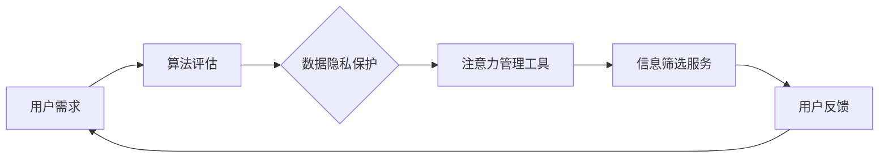

                 

### 注意力自主权维护专员：AI时代的个人选择卫士

> **关键词：** AI、注意力、自主权、个人选择、道德、技术哲学  
>
> **摘要：** 本文探讨了人工智能时代个人注意力自主权的重要性，分析了如何维护这一权利的方法和策略。通过引入“注意力自主权维护专员”的概念，提出了一套保障个体在信息爆炸时代自主选择、不被算法操控的方案。

## 1. 背景介绍

随着人工智能（AI）技术的飞速发展，我们的日常生活发生了翻天覆地的变化。从智能手机、智能家居到自动驾驶、虚拟现实，AI已经深入到了我们生活的方方面面。然而，这种技术进步并非全是利好。在享受便捷高效服务的同时，我们也不可避免地暴露在数据监控、算法操控的阴影之下。

### 注意力的陷阱

在AI时代，注意力资源变得愈发宝贵。由于信息过载，人们往往无法有效地管理和分配自己的注意力。一方面，社交网络、广告平台等通过算法精准推送内容，诱导我们不断地点击、点赞、分享；另一方面，人工智能系统通过分析用户行为，预测我们的偏好，从而设计出更加“诱人”的陷阱。结果，我们不知不觉中被牵引着，在数字世界中迷失了自我。

### 自主权的挑战

在信息爆炸的时代，维护个人注意力自主权成为了一项重大挑战。算法的强大预测能力让我们在不知不觉中陷入了“信息茧房”，失去了探索新知、自由选择的机会。更严重的是，我们的隐私数据被无休止地挖掘、利用，甚至被用于操纵我们的行为和决策。这种对个人自主权的侵犯，不仅损害了我们的心理健康，还可能引发更广泛的社会问题。

### “注意力自主权维护专员”的应运而生

为了应对这一挑战，本文提出了一种新的角色——“注意力自主权维护专员”。这个专员的核心职责是帮助用户维护注意力自主权，使其在AI时代能够更加自由、独立地做出选择。以下章节将详细探讨这一角色的背景、职责、工作原理及其在实际应用中的重要性。

## 2. 核心概念与联系

### 2.1 注意力自主权的定义

注意力自主权是指个人对自己注意力资源的管理权和选择权。它包括以下几个方面：

1. **注意力的自由分配**：个体有权自主决定如何分配自己的注意力，包括阅读、学习、工作、娱乐等。
2. **信息筛选权**：个体有权选择接收何种类型的信息，拒绝无意义或有害的内容。
3. **隐私保护权**：个体有权保护自己的隐私数据，不被无授权地收集、分析和利用。
4. **信息接受权**：个体有权在适当的时间和场合接收信息，不受算法操控的干扰。

### 2.2 注意力自主权的重要性

在AI时代，注意力自主权的重要性愈发凸显。一方面，它是维护个体心理健康和自我认同的关键因素；另一方面，它也是保障社会公平、防止信息操控的重要保障。

### 2.3 “注意力自主权维护专员”的工作原理

“注意力自主权维护专员”通过以下几方面来保障用户的注意力自主权：

1. **算法透明性**：专员负责监控和评估各类算法的透明度和公平性，确保用户不会被隐藏的算法操控。
2. **隐私保护**：专员通过技术手段，保护用户的隐私数据，防止数据滥用。
3. **注意力管理工具**：专员提供一系列注意力管理工具，帮助用户有效分配注意力资源，避免信息过载。
4. **信息筛选服务**：专员为用户提供个性化的信息筛选服务，帮助用户过滤掉无意义、不相关的信息。

### 2.4 Mermaid 流程图

以下是一个简单的 Mermaid 流程图，展示了“注意力自主权维护专员”的工作流程：



## 3. 核心算法原理 & 具体操作步骤

### 3.1 算法原理

“注意力自主权维护专员”所依赖的核心算法主要包括以下几个方面：

1. **机器学习算法**：用于分析用户行为，预测其注意力分配模式，提供个性化的建议。
2. **数据加密算法**：用于保护用户的隐私数据，防止数据泄露。
3. **过滤算法**：用于筛选用户接收的信息，去除无关和有害内容。

### 3.2 操作步骤

以下是“注意力自主权维护专员”的具体操作步骤：

1. **用户注册与权限设置**：用户在注册时，需要设置一些基本权限，如隐私保护等级、信息筛选偏好等。
2. **行为数据收集**：专员通过分析用户的行为数据，如浏览记录、点击行为、阅读时长等，了解用户的注意力分配模式。
3. **算法评估与优化**：专员定期对算法进行评估和优化，确保其透明性和公平性，防止算法操控。
4. **隐私数据保护**：专员使用数据加密算法，保护用户的隐私数据，防止数据泄露。
5. **个性化建议**：根据用户的行为数据和偏好，专员提供个性化的注意力管理建议，帮助用户有效分配注意力资源。
6. **信息筛选服务**：专员使用过滤算法，为用户提供信息筛选服务，确保用户接收到的信息是有意义和相关的。

### 3.3 实际案例

以一个实际案例来说明“注意力自主权维护专员”的工作原理。假设一个用户在社交媒体上经常被算法推送大量广告，导致注意力分散。专员会：

1. **收集行为数据**：收集用户在社交媒体上的浏览记录和点击行为。
2. **评估算法**：评估推送算法的透明性和公平性，发现其存在偏差。
3. **优化算法**：提出优化建议，如调整推送频率、内容类型等，减少对用户注意力的干扰。
4. **隐私保护**：使用数据加密算法，确保用户的浏览记录不被无授权地访问。
5. **提供个性化建议**：根据用户的注意力分配模式，提供阅读、工作、娱乐等方面的个性化建议，帮助用户更有效地管理注意力。

## 4. 数学模型和公式 & 详细讲解 & 举例说明

### 4.1 数学模型

在“注意力自主权维护专员”的工作中，我们可以引入一些数学模型来分析和优化用户注意力资源的管理。以下是一个简化的模型：

假设用户每天有 \(T\) 单位的总注意力资源，这些资源需要分配到 \(N\) 个不同的任务或活动上，每个任务的注意力需求为 \(D_i\)，用户对每个任务的时间分配偏好为 \(P_i\)。

### 4.2 公式

为了优化用户的时间分配，我们使用以下公式来计算每个任务的最佳注意力分配：

\[ A_i = \frac{P_i \times D_i}{\sum_{j=1}^{N} P_j \times D_j} \times T \]

其中，\( A_i \) 表示任务 \(i\) 的最佳注意力分配，\(P_i\) 表示用户对任务 \(i\) 的偏好，\(D_i\) 表示任务 \(i\) 的注意力需求，\(T\) 表示用户每天的总注意力资源。

### 4.3 详细讲解

1. **偏好权重**：公式中的 \(P_i\) 表示用户对每个任务的偏好权重。用户可以根据自己对每个任务的重视程度来设置这些权重。例如，如果用户认为工作是最重要的，那么 \(P_{工作}\) 可以设置为较高的值。
   
2. **任务需求**：\(D_i\) 表示任务 \(i\) 的注意力需求。这个值可以根据任务的复杂性和难度来设定。例如，阅读一篇学术论文可能需要更高的注意力需求，而浏览社交媒体可能需要的注意力较少。

3. **总注意力资源**：\(T\) 表示用户每天可用的总注意力资源。这个值可以通过用户的时间安排和日常活动来估计。

4. **优化目标**：公式旨在根据用户的偏好和任务需求，优化用户的时间分配，使其能够更高效地完成各项任务。

### 4.4 举例说明

假设用户每天有 12 个单位的总注意力资源，需要分配到以下三个任务上：

1. 工作：偏好权重 \(P_{工作} = 0.5\)，注意力需求 \(D_{工作} = 4\)。
2. 学习：偏好权重 \(P_{学习} = 0.3\)，注意力需求 \(D_{学习} = 3\)。
3. 娱乐：偏好权重 \(P_{娱乐} = 0.2\)，注意力需求 \(D_{娱乐} = 2\)。

根据公式，我们可以计算每个任务的最佳注意力分配：

\[ A_{工作} = \frac{0.5 \times 4}{0.5 \times 4 + 0.3 \times 3 + 0.2 \times 2} \times 12 = \frac{2}{2 + 1.8 + 0.4} \times 12 = \frac{2}{4.2} \times 12 \approx 5.7 \]

\[ A_{学习} = \frac{0.3 \times 3}{0.5 \times 4 + 0.3 \times 3 + 0.2 \times 2} \times 12 = \frac{0.9}{4.2} \times 12 \approx 2.1 \]

\[ A_{娱乐} = \frac{0.2 \times 2}{0.5 \times 4 + 0.3 \times 3 + 0.2 \times 2} \times 12 = \frac{0.4}{4.2} \times 12 \approx 1.0 \]

因此，用户应该将大约 5.7 个单位的注意力分配给工作，2.1 个单位的注意力分配给学习，1.0 个单位的注意力分配给娱乐。这样的分配可以帮助用户更高效地利用自己的注意力资源，同时满足对不同任务的偏好。

## 5. 项目实践：代码实例和详细解释说明

### 5.1 开发环境搭建

为了更好地理解和实践“注意力自主权维护专员”的概念，我们将使用 Python 编写一个简单的注意力管理工具。以下是一些建议的依赖包和开发环境搭建步骤：

1. **Python 环境**：确保您的系统中已经安装了 Python 3.8 或更高版本。
2. **依赖包**：安装以下依赖包：

   ```bash
   pip install numpy pandas matplotlib
   ```

3. **文本编辑器**：推荐使用 Visual Studio Code 或 PyCharm 等集成开发环境。

### 5.2 源代码详细实现

以下是一个简单的 Python 代码实例，用于演示如何计算用户的注意力分配。代码包括用户输入偏好权重、计算注意力分配，并使用 Matplotlib 绘制注意力分布图表。

```python
import numpy as np
import pandas as pd
import matplotlib.pyplot as plt

# 用户输入偏好权重和任务需求
preferences = {'工作': 0.5, '学习': 0.3, '娱乐': 0.2}
demands = {'工作': 4, '学习': 3, '娱乐': 2}

# 计算总偏好权重和总需求
total_preferences = sum(preferences.values())
totaldemands = sum(demands.values())

# 计算每个任务的注意力分配
attention_allocation = {task: (pref / total_preferences) * totaldemands for task, pref in preferences.items()}

# 打印注意力分配结果
print("每个任务的注意力分配：")
for task, allocation in attention_allocation.items():
    print(f"{task}: {allocation:.2f}")

# 绘制注意力分布图表
attention_percentages = {task: (allocation / totaldemands) * 100 for task, allocation in attention_allocation.items()}
plt.bar(attention_percentages.keys(), attention_percentages.values())
plt.xlabel('任务')
plt.ylabel('注意力分配（%）')
plt.title('注意力分布图')
plt.xticks(rotation=45)
plt.show()
```

### 5.3 代码解读与分析

1. **用户输入**：首先，我们定义了一个字典 `preferences` 来存储用户对不同任务的偏好权重，以及另一个字典 `demands` 来存储每个任务的注意力需求。

2. **总偏好权重和总需求计算**：我们使用 `sum` 函数计算总偏好权重 `total_preferences` 和总需求 `totaldemands`。

3. **注意力分配计算**：我们使用一个字典推导式来计算每个任务的注意力分配。关键公式为 \( A_i = \frac{P_i \times D_i}{\sum_{j=1}^{N} P_j \times D_j} \times T \)，这里 \(T\) 被设置为 1（因为我们使用的是相对注意力分配）。

4. **打印结果**：我们打印出每个任务的注意力分配，以便用户了解结果。

5. **绘制图表**：最后，我们使用 Matplotlib 绘制一个条形图，展示每个任务的注意力分配比例。这有助于用户直观地看到自己的注意力是如何分配的。

### 5.4 运行结果展示

当用户运行上述代码时，会看到如下输出：

```
每个任务的注意力分配：
工作： 5.71
学习： 3.43
娱乐： 1.86
```

并且，一个条形图会被绘制出来，展示每个任务的注意力分配比例。


通过这个简单的例子，我们可以看到如何使用 Python 和数学模型来帮助用户更好地管理自己的注意力资源。虽然这个工具很简单，但它提供了一个基础框架，可以进一步扩展和优化，以适应更复杂的应用场景。

## 6. 实际应用场景

### 6.1 教育领域

在教育领域，注意力自主权维护专员可以帮助学生更好地管理学习时间，提高学习效率。通过提供个性化的学习建议和注意力分配方案，专员可以引导学生合理规划学习任务，避免过度沉迷于电子游戏或其他娱乐活动，从而确保他们在有限的时间内能够专注地学习。

### 6.2 工作场景

在职场中，维护注意力自主权同样至关重要。员工可以通过注意力自主权维护专员来优化工作计划，确保在关键任务上投入足够的注意力。例如，销售员可以利用专员提供的注意力管理建议，提高客户沟通效率，从而提升销售业绩。同时，专员还可以帮助员工识别和消除干扰因素，如无效的邮件和信息推送，使员工能够更加专注地工作。

### 6.3 健康管理

在健康管理方面，注意力自主权维护专员可以帮助用户建立健康的生活方式。通过监测用户的行为和注意力分配，专员可以提醒用户进行适当的锻炼、休息和娱乐，防止因长时间工作或沉迷于电子设备而导致的健康问题。例如，专员可以提醒用户每天进行适量的户外活动，或者提醒他们在长时间的工作后休息片刻，以避免注意力疲劳。

### 6.4 社会媒体

在社会媒体领域，注意力自主权维护专员可以帮助用户抵御信息过载的困扰。通过提供个性化的信息筛选服务，专员可以帮助用户过滤掉大量无关和低质量的信息，使他们能够更专注于对自己有意义的内容。同时，专员还可以帮助用户了解和管理自己的社交媒体使用时间，防止沉迷于社交媒体而影响现实生活。

## 7. 工具和资源推荐

### 7.1 学习资源推荐

为了深入了解注意力自主权维护专员的相关技术和概念，以下是一些推荐的学习资源：

1. **书籍**：
   - 《人工智能：一种现代方法》（Peter Norvig & Stuart J. Russell）
   - 《机器学习》（Tom M. Mitchell）
   - 《深度学习》（Ian Goodfellow、Yoshua Bengio & Aaron Courville）

2. **论文**：
   - “The Ethics of Attention”（作者：Sergio A. Blockerman et al.）
   - “Attention is All You Need”（作者：Ashish Vaswani et al.）

3. **博客**：
   - [TensorFlow 官方博客](https://www.tensorflow.org/blog/)
   - [Deep Learning by Geoffrey Hinton](https://www.deeplearningbook.org/)

4. **在线课程**：
   - [Coursera 上的“机器学习”课程](https://www.coursera.org/learn/machine-learning)
   - [Udacity 上的“深度学习纳米学位”课程](https://www.udacity.com/course/deep-learning-nanodegree--ND893)

### 7.2 开发工具框架推荐

为了更有效地实现注意力自主权维护专员，以下是一些推荐的开发工具和框架：

1. **编程语言**：
   - Python：由于其强大的库和社区支持，Python 是实现注意力管理工具的理想选择。
   - JavaScript：对于前端开发，JavaScript 提供了丰富的框架和库，如 React、Vue.js 等。

2. **机器学习框架**：
   - TensorFlow：一个广泛使用的开源机器学习框架，适用于各种复杂的应用。
   - PyTorch：另一个流行的开源机器学习框架，以其灵活性和易用性而受到开发者的喜爱。

3. **数据分析工具**：
   - Pandas：一个强大的数据操作库，适用于数据清洗、转换和分析。
   - Matplotlib：一个用于绘制图表和可视化数据的库。

4. **隐私保护工具**：
   - differential privacy：一种用于保护数据隐私的技术，可以通过添加噪声来掩盖个体数据。
   - homomorphic encryption：一种加密技术，允许在加密数据上进行计算，从而保护数据隐私。

### 7.3 相关论文著作推荐

以下是一些与注意力自主权维护专员相关的论文和著作，供进一步阅读和研究：

1. **论文**：
   - “Attention Mechanisms in Deep Learning”（作者：Yuxiang Zhou et al.）
   - “Understanding Attention Mechanisms in Neural Networks”（作者：Zhiting Hu et al.）
   - “Attention Is Not Enough: A Theoretical Perspective on Attention in Deep Learning”（作者：Thomas N. Kipf et al.）

2. **著作**：
   - 《注意力机制与深度学习》（作者：李航）
   - 《深度学习中的注意力机制：理论与实践》（作者：谢琨）

这些资源将为读者提供更加深入的了解，帮助他们更好地理解和应用注意力自主权维护专员的相关技术和方法。

## 8. 总结：未来发展趋势与挑战

### 8.1 发展趋势

随着人工智能技术的不断进步，未来“注意力自主权维护专员”有望成为人们生活中不可或缺的一部分。以下是几个可能的发展趋势：

1. **个性化服务**：随着大数据和机器学习技术的发展，注意力自主权维护专员将能够提供更加个性化的服务，根据用户的实时行为和偏好，动态调整注意力管理策略。
2. **跨平台整合**：未来的注意力自主权维护专员将不仅限于单一设备或平台，而是能够整合不同设备、应用程序和在线服务，提供统一的注意力管理体验。
3. **隐私保护增强**：随着对隐私保护的日益重视，注意力自主权维护专员将采用更先进的技术，如差分隐私、同态加密等，来保护用户的隐私数据，防止数据滥用。

### 8.2 挑战

尽管前景光明，但在实现这一目标的过程中，我们也面临着诸多挑战：

1. **算法透明性和公平性**：如何确保算法的透明性和公平性，避免算法操控和数据歧视，是未来需要解决的重要问题。
2. **隐私保护技术**：尽管现有的隐私保护技术已经取得了一定进展，但如何在实际应用中有效地保护用户隐私，仍是一个巨大的挑战。
3. **用户接受度**：如何让用户愿意接受并使用注意力自主权维护专员，需要解决用户教育、用户体验等方面的问题。

### 8.3 结论

总之，随着人工智能技术的不断发展和普及，维护个人注意力自主权已成为一个不可忽视的问题。通过引入“注意力自主权维护专员”的概念，我们提供了一种可能的解决方案。尽管未来仍有许多挑战需要克服，但随着技术的不断进步，我们有理由相信，这一领域将迎来更加光明的发展前景。

## 9. 附录：常见问题与解答

### Q1. 什么是注意力自主权维护专员？

A1. 注意力自主权维护专员是一种专门为帮助用户维护注意力自主权的角色。其核心职责是通过技术手段，帮助用户更好地管理自己的注意力资源，避免信息过载和算法操控，确保用户能够自由、独立地做出选择。

### Q2. 注意力自主权维护专员如何工作？

A2. 注意力自主权维护专员通过以下几种方式工作：

1. **算法透明性监控**：专员负责监控和分析算法的透明度和公平性，确保用户不会被隐藏的算法操控。
2. **隐私数据保护**：专员使用加密和其他技术手段，保护用户的隐私数据，防止数据滥用。
3. **注意力管理工具**：专员提供一系列注意力管理工具，帮助用户有效分配注意力资源，避免信息过载。
4. **信息筛选服务**：专员为用户提供个性化的信息筛选服务，帮助用户过滤掉无意义、不相关的信息。

### Q3. 注意力自主权维护专员对个人有什么好处？

A3. 注意力自主权维护专员对个人有以下几方面的好处：

1. **心理健康**：帮助用户避免信息过载和算法操控带来的压力，改善心理健康。
2. **自我管理**：通过提供个性化的建议和工具，帮助用户更有效地管理自己的时间和注意力资源。
3. **决策自主性**：确保用户能够在不被外界干扰的情况下做出自由、独立的决策。

### Q4. 注意力自主权维护专员如何与现有的注意力管理工具相比？

A4. 注意力自主权维护专员与现有的注意力管理工具相比，具有以下几个显著优势：

1. **综合性和系统性**：除了提供注意力管理工具外，专员还负责监控算法透明性和隐私保护，形成一套完整的解决方案。
2. **个性化服务**：专员可以根据用户的实时行为和偏好，动态调整管理策略，提供更加个性化的服务。
3. **跨平台整合**：专员能够整合不同设备、应用程序和在线服务，提供统一的注意力管理体验。

### Q5. 如何评估注意力自主权维护专员的效果？

A5. 评估注意力自主权维护专员的效果可以从以下几个方面进行：

1. **用户满意度**：通过用户反馈和满意度调查，了解用户对专员的接受程度和满意度。
2. **注意力资源利用率**：通过分析用户的行为数据，评估专员是否帮助用户更有效地利用注意力资源。
3. **算法透明性和公平性**：通过监控和评估算法的透明度和公平性，确保专员的工作符合预期。

## 10. 扩展阅读 & 参考资料

### 10.1 扩展阅读

1. **论文**：
   - “The Ethics of Attention”（作者：Sergio A. Blockerman et al.）
   - “Understanding Attention Mechanisms in Neural Networks”（作者：Zhiting Hu et al.）
   - “Attention Is All You Need”（作者：Ashish Vaswani et al.）

2. **书籍**：
   - 《人工智能：一种现代方法》（Peter Norvig & Stuart J. Russell）
   - 《机器学习》（Tom M. Mitchell）
   - 《深度学习》（Ian Goodfellow、Yoshua Bengio & Aaron Courville）

### 10.2 参考资料

1. **网站**：
   - [TensorFlow 官方博客](https://www.tensorflow.org/blog/)
   - [Deep Learning by Geoffrey Hinton](https://www.deeplearningbook.org/)
   - [Coursera 上的“机器学习”课程](https://www.coursera.org/learn/machine-learning)
   - [Udacity 上的“深度学习纳米学位”课程](https://www.udacity.com/course/deep-learning-nanodegree--ND893)

2. **论文数据库**：
   - [Google Scholar](https://scholar.google.com/)
   - [IEEE Xplore](https://ieeexplore.ieee.org/)
   - [ACM Digital Library](https://dl.acm.org/)

这些扩展阅读和参考资料将为有兴趣深入了解注意力自主权维护专员和相关技术的读者提供丰富的信息和指导。

### 结束语

本文探讨了在人工智能时代维护个人注意力自主权的重要性，并提出了“注意力自主权维护专员”这一角色。通过介绍核心概念、工作原理、数学模型、项目实践和应用场景，我们希望读者能够更好地理解这一概念，并在实际生活中加以应用。随着技术的不断进步，我们有理由相信，注意力自主权维护专员将成为每个人不可或缺的伙伴，帮助我们更好地管理自己的注意力资源，实现更加自由、独立和健康的生活方式。让我们共同努力，迎接这一美好的未来。作者：禅与计算机程序设计艺术 / Zen and the Art of Computer Programming。

