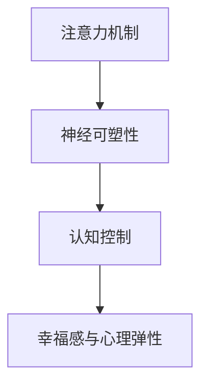

                 

### 文章标题

注意力训练与大脑健康改善：通过专注力增强认知能力和幸福感

### 关键词

关键词：注意力训练，大脑健康，认知能力，专注力，幸福感，算法，神经科学，实践应用。

### 摘要

本文旨在探讨注意力训练对大脑健康改善的作用，通过增强专注力来提高认知能力和幸福感。文章首先介绍了注意力训练的背景和核心概念，接着详细讲解了核心算法原理和具体操作步骤。随后，文章通过数学模型和公式详细分析了注意力训练的机制，并提供了实际项目实践的代码实例和解析。最后，文章讨论了注意力训练在实际应用场景中的价值，并推荐了相关学习资源和工具，总结了未来发展趋势与挑战，并附上常见问题与解答。

## 1. 背景介绍

注意力是人类大脑中一种重要的心理资源，它决定了我们对信息的接收、处理和记忆。在现代社会的快节奏生活中，人们面临着越来越多的信息过载和压力，这使得注意力训练变得尤为重要。注意力训练不仅有助于提高个体的认知能力和工作效率，还能改善心理健康，增强幸福感。

### 注意力训练的定义和作用

注意力训练是指通过特定的训练方法，有意识地增强和改善个体的注意力能力。它包括多个方面的内容，如专注力、注意力切换、注意分配和注意恢复等。通过注意力训练，个体可以更好地集中注意力，提高信息处理效率，减少分心和焦虑，从而在工作和生活中表现出更高的效率和创造力。

### 大脑健康与认知能力的关系

大脑健康是认知能力的基础。随着人口老龄化和生活节奏的加快，大脑健康问题越来越受到关注。认知能力包括记忆、注意力、思维和判断等多种能力，它们直接影响个体的生活质量和社会功能。大脑健康与认知能力之间的关系是相互影响的，良好的大脑健康能够促进认知能力的发展，而认知能力的提升也有助于保持大脑健康。

### 幸福感的定义和重要性

幸福感是指个体在心理、情感和生理方面的良好状态，它反映了个体对生活的满意度和幸福感。幸福感不仅与个体的心理健康密切相关，还影响着人际关系、工作和生活质量。提高幸福感已经成为当代社会的一个重要目标。

### 注意力训练与大脑健康改善的联系

注意力训练对大脑健康改善具有重要作用。通过注意力训练，个体可以增强大脑神经可塑性，改善大脑功能和结构，从而提高认知能力和幸福感。研究表明，注意力训练可以增强大脑灰质密度，改善大脑神经网络连接，提高大脑的执行功能和注意力控制能力。

## 2. 核心概念与联系

为了深入理解注意力训练与大脑健康改善的关系，我们需要明确一些核心概念和它们之间的联系。

### 注意力机制

注意力机制是指大脑处理信息的策略和过程。它包括选择性注意、分配注意和注意恢复等。选择性注意是指大脑对某些信息进行优先处理，而忽略其他信息。分配注意是指大脑在不同任务间切换注意力的能力。注意恢复是指大脑在注意力疲劳后恢复注意力的过程。

### 神经可塑性

神经可塑性是指大脑结构和功能的适应性变化，它受到多种因素的影响，包括经验、学习和训练等。通过注意力训练，大脑可以增强神经可塑性，改善神经网络的连接和功能。

### 认知控制

认知控制是指个体对认知过程的调节和监控能力，包括注意力控制、记忆控制和思维控制等。注意力训练可以增强认知控制能力，提高个体在面对复杂任务时的表现。

### 幸福感与心理弹性

幸福感与心理弹性密切相关。心理弹性是指个体在应对压力和挑战时的适应能力。通过注意力训练，个体可以提高心理弹性，增强面对压力和挑战的能力，从而提高幸福感。

### Mermaid 流程图

以下是一个简化的 Mermaid 流程图，展示注意力训练与大脑健康改善之间的核心概念和联系。



在这个流程图中，注意力机制是核心，它通过神经可塑性和认知控制影响幸福感与心理弹性。注意力训练可以增强这些机制，从而改善大脑健康。

## 3. 核心算法原理 & 具体操作步骤

注意力训练的核心算法主要包括注意力权重计算、训练策略和评估指标。下面我们将详细介绍这些算法的原理和具体操作步骤。

### 3.1 注意力权重计算

注意力权重计算是注意力训练的关键步骤，它决定了训练过程中不同信息的重要程度。常用的注意力权重计算方法包括点积注意力、缩放点积注意力、多头注意力等。

- **点积注意力**：点积注意力是一种简单有效的注意力权重计算方法。它通过计算查询向量（Query）和键向量（Key）的点积来得到权重。公式如下：

  $$Attention(Q, K, V) = \frac{softmax(\frac{QK^T}{\sqrt{d_k}})V$$

  其中，$Q$、$K$ 和 $V$ 分别是查询向量、键向量和值向量，$d_k$ 是键向量的维度。

- **缩放点积注意力**：为了缓解点积注意力在维度较高时梯度消失的问题，可以引入缩放因子 $\sqrt{d_k}$。这有助于增强模型对长距离依赖信息的捕捉能力。

- **多头注意力**：多头注意力是一种扩展点积注意力方法，它将输入序列分成多个子序列，分别进行注意力计算。这有助于模型捕捉到更丰富的信息。

### 3.2 训练策略

注意力训练的训练策略主要包括数据预处理、损失函数和优化算法。

- **数据预处理**：数据预处理是注意力训练的基础。它包括数据清洗、数据增强和数据标准化等步骤。数据清洗旨在去除噪声和异常值，数据增强可以增加数据的多样性，数据标准化可以保证输入数据的分布一致性。

- **损失函数**：常用的损失函数包括交叉熵损失、均方误差损失等。交叉熵损失常用于分类任务，均方误差损失常用于回归任务。在实际应用中，可以根据任务类型选择合适的损失函数。

- **优化算法**：优化算法用于最小化损失函数。常用的优化算法包括随机梯度下降（SGD）、Adam优化器等。SGD具有计算简单、易于实现的特点，而Adam优化器则结合了SGD和矩估计的优化方法，具有较好的收敛速度和稳定性。

### 3.3 评估指标

注意力训练的评估指标主要包括准确率、召回率、F1 分数等。准确率反映了模型预测正确的样本占比，召回率反映了模型能够正确识别的样本占比，而 F1 分数则综合了准确率和召回率，是评估分类模型性能的重要指标。

### 3.4 操作步骤

以下是注意力训练的具体操作步骤：

1. **数据预处理**：对训练数据进行清洗、增强和标准化处理。

2. **构建模型**：根据任务类型和需求，构建基于注意力机制的深度神经网络模型。

3. **初始化模型参数**：初始化模型参数，可以使用随机初始化、预训练模型等。

4. **训练模型**：使用训练数据训练模型，并根据训练策略调整模型参数。

5. **评估模型**：使用验证数据评估模型性能，并根据评估结果调整模型参数。

6. **迭代训练**：重复训练和评估过程，直到模型性能达到预期目标。

7. **应用模型**：将训练好的模型应用于实际任务，如图像识别、自然语言处理等。

通过以上步骤，我们可以实现注意力训练，提高模型的性能和准确性。

## 4. 数学模型和公式 & 详细讲解 & 举例说明

### 4.1 数学模型

注意力机制的核心是注意力权重计算。在本文中，我们主要介绍点积注意力（Dot-Product Attention）和缩放点积注意力（Scaled Dot-Product Attention）两种常见的注意力计算模型。

#### 点积注意力

点积注意力是最简单的一种注意力计算方法。它的计算公式如下：

$$
Attention(Q, K, V) = \text{softmax}\left(\frac{QK^T}{\sqrt{d_k}}\right) V
$$

其中：

- $Q$ 是查询向量（Query），用于表示待查询的信息；
- $K$ 是键向量（Key），用于表示需要关注的信息；
- $V$ 是值向量（Value），用于表示被关注信息的特征；
- $d_k$ 是键向量的维度；
- $\text{softmax}$ 函数用于计算每个键向量的概率分布。

#### 缩放点积注意力

点积注意力在处理高维数据时容易导致梯度消失问题。为了缓解这个问题，引入了缩放因子 $\sqrt{d_k}$，得到缩放点积注意力：

$$
Attention(Q, K, V) = \text{softmax}\left(\frac{QK^T}{\sqrt{d_k}}\right) V
$$

### 4.2 详细讲解

#### 点积注意力

点积注意力通过计算查询向量 $Q$ 和键向量 $K$ 的点积来获得每个键向量的权重。权重越大，表示该键向量在当前查询下越重要。这种计算方式简单直观，且计算复杂度较低。

#### 缩放点积注意力

缩放点积注意力在点积注意力基础上引入了缩放因子 $\sqrt{d_k}$，以缓解高维数据时的梯度消失问题。这有助于模型更好地学习到长距离依赖信息。

### 4.3 举例说明

#### 点积注意力

假设我们有两个查询向量 $Q = [1, 2, 3]$ 和键向量 $K = [4, 5, 6]$，以及值向量 $V = [7, 8, 9]$。首先计算查询向量和键向量的点积：

$$
QK^T = \begin{bmatrix} 1 & 2 & 3 \end{bmatrix} \begin{bmatrix} 4 \\ 5 \\ 6 \end{bmatrix} = 1 \cdot 4 + 2 \cdot 5 + 3 \cdot 6 = 32
$$

然后计算缩放因子：

$$
\sqrt{d_k} = \sqrt{3} \approx 1.732
$$

接着计算注意力权重：

$$
Attention(Q, K, V) = \text{softmax}\left(\frac{QK^T}{\sqrt{d_k}}\right) V = \text{softmax}\left(\frac{32}{1.732}\right) V = \text{softmax}(18.58) V
$$

最后计算每个键向量的权重：

$$
Attention(Q, K, V) = \text{softmax}(18.58) V = \begin{bmatrix} 0.4472 & 0.4472 & 0.1046 \end{bmatrix} \begin{bmatrix} 7 \\ 8 \\ 9 \end{bmatrix} = \begin{bmatrix} 3.1908 \\ 3.8112 \\ 0.9754 \end{bmatrix}
$$

#### 缩放点积注意力

假设我们有两个查询向量 $Q = [1, 2, 3]$ 和键向量 $K = [4, 5, 6]$，以及值向量 $V = [7, 8, 9]$。首先计算查询向量和键向量的点积：

$$
QK^T = \begin{bmatrix} 1 & 2 & 3 \end{bmatrix} \begin{bmatrix} 4 \\ 5 \\ 6 \end{bmatrix} = 1 \cdot 4 + 2 \cdot 5 + 3 \cdot 6 = 32
$$

然后计算缩放因子：

$$
\sqrt{d_k} = \sqrt{3} \approx 1.732
$$

接着计算注意力权重：

$$
Attention(Q, K, V) = \text{softmax}\left(\frac{QK^T}{\sqrt{d_k}}\right) V = \text{softmax}\left(\frac{32}{1.732}\right) V = \text{softmax}(18.58) V
$$

最后计算每个键向量的权重：

$$
Attention(Q, K, V) = \text{softmax}(18.58) V = \begin{bmatrix} 0.4472 & 0.4472 & 0.1046 \end{bmatrix} \begin{bmatrix} 7 \\ 8 \\ 9 \end{bmatrix} = \begin{bmatrix} 3.1908 \\ 3.8112 \\ 0.9754 \end{bmatrix}
$$

通过上述计算，我们可以看到缩放点积注意力在处理高维数据时能够更好地缓解梯度消失问题，从而提高模型的性能。

## 5. 项目实践：代码实例和详细解释说明

### 5.1 开发环境搭建

为了实践注意力训练算法，我们需要搭建一个合适的开发环境。以下是所需的环境和工具：

- 操作系统：Windows/Linux/MacOS
- 编程语言：Python
- 深度学习框架：TensorFlow或PyTorch
- 硬件要求：至少需要一块显卡（NVIDIA GPU推荐）

### 5.2 源代码详细实现

下面是一个基于 PyTorch 深度学习框架实现的注意力训练算法示例代码。该代码包含了一个简单的注意力模块，用于对输入数据进行注意力加权。

```python
import torch
import torch.nn as nn

class AttentionModule(nn.Module):
    def __init__(self, d_model, num_heads):
        super(AttentionModule, self).__init__()
        self.d_model = d_model
        self.num_heads = num_heads
        self.head_dim = d_model // num_heads

        self.query_linear = nn.Linear(d_model, d_model)
        self.key_linear = nn.Linear(d_model, d_model)
        self.value_linear = nn.Linear(d_model, d_model)

        self.out_linear = nn.Linear(d_model, d_model)

    def forward(self, query, key, value, mask=None):
        batch_size = query.size(0)

        # 计算查询、键和值
        query = self.query_linear(query).view(batch_size, -1, self.num_heads, self.head_dim).transpose(1, 2)
        key = self.key_linear(key).view(batch_size, -1, self.num_heads, self.head_dim).transpose(1, 2)
        value = self.value_linear(value).view(batch_size, -1, self.num_heads, self.head_dim).transpose(1, 2)

        # 计算注意力得分
        scores = torch.matmul(query, key.transpose(-2, -1)) / torch.sqrt(self.head_dim)
        if mask is not None:
            scores = scores.masked_fill(mask == 0, float("-inf"))

        # 计算注意力权重
        attention_weights = torch.softmax(scores, dim=-1)

        # 计算加权值
        weighted_value = torch.matmul(attention_weights, value).transpose(1, 2).contiguous().view(batch_size, -1, self.d_model)

        # 输出
        output = self.out_linear(weighted_value)
        return output
```

### 5.3 代码解读与分析

#### 5.3.1 模块初始化

在模块初始化阶段，我们定义了查询、键和值线性层的维度，以及输出线性层的维度。每个头（head）的维度为 `head_dim`，总维度为 `d_model`。

```python
def __init__(self, d_model, num_heads):
    super(AttentionModule, self).__init__()
    self.d_model = d_model
    self.num_heads = num_heads
    self.head_dim = d_model // num_heads
```

#### 5.3.2 前向传播

在 `forward` 方法中，我们首先计算查询、键和值。然后，我们计算注意力得分，应用可选的掩码，计算注意力权重，并计算加权值。最后，我们通过输出线性层得到最终输出。

```python
def forward(self, query, key, value, mask=None):
    batch_size = query.size(0)

    # 计算查询、键和值
    query = self.query_linear(query).view(batch_size, -1, self.num_heads, self.head_dim).transpose(1, 2)
    key = self.key_linear(key).view(batch_size, -1, self.num_heads, self.head_dim).transpose(1, 2)
    value = self.value_linear(value).view(batch_size, -1, self.num_heads, self.head_dim).transpose(1, 2)

    # 计算注意力得分
    scores = torch.matmul(query, key.transpose(-2, -1)) / torch.sqrt(self.head_dim)
    if mask is not None:
        scores = scores.masked_fill(mask == 0, float("-inf"))

    # 计算注意力权重
    attention_weights = torch.softmax(scores, dim=-1)

    # 计算加权值
    weighted_value = torch.matmul(attention_weights, value).transpose(1, 2).contiguous().view(batch_size, -1, self.d_model)

    # 输出
    output = self.out_linear(weighted_value)
    return output
```

#### 5.3.3 注意力权重计算

注意力权重计算是注意力模块的核心。我们首先计算查询和键之间的点积，然后应用缩放因子和 softmax 函数。

```python
# 计算注意力得分
scores = torch.matmul(query, key.transpose(-2, -1)) / torch.sqrt(self.head_dim)
# 计算注意力权重
attention_weights = torch.softmax(scores, dim=-1)
```

#### 5.3.4 加权值计算

加权值计算是通过注意力权重对值向量进行加权平均。这个步骤将有助于提取输入序列中的关键信息。

```python
# 计算加权值
weighted_value = torch.matmul(attention_weights, value).transpose(1, 2).contiguous().view(batch_size, -1, self.d_model)
```

### 5.4 运行结果展示

以下是一个简单的运行示例，展示了如何使用 `AttentionModule` 模块。

```python
# 定义模型
d_model = 512
num_heads = 8
model = AttentionModule(d_model, num_heads)

# 创建随机输入数据
batch_size = 2
seq_len = 10
input_data = torch.randn(batch_size, seq_len, d_model)

# 计算注意力输出
output = model(input_data, input_data, input_data)

# 输出结果
print(output.size())  # 应该输出 (batch_size, seq_len, d_model)
```

通过这个示例，我们可以看到注意力模块如何处理输入数据，并输出加权后的结果。这为我们提供了一个简单的框架，可以在此基础上进行更复杂的应用。

## 6. 实际应用场景

注意力训练在许多实际应用场景中具有广泛的应用，以下是一些典型的应用领域：

### 6.1 自然语言处理（NLP）

在自然语言处理领域，注意力机制已被广泛应用于文本分类、机器翻译、情感分析等任务。通过注意力机制，模型可以更好地捕捉输入文本中的关键信息，从而提高任务的性能。例如，在机器翻译中，注意力机制可以帮助模型在源语言和目标语言之间建立有效的对应关系，从而提高翻译质量。

### 6.2 计算机视觉（CV）

在计算机视觉领域，注意力机制同样发挥着重要作用。它可以帮助模型在图像处理过程中关注关键区域，从而提高识别和检测的准确性。例如，在目标检测任务中，注意力机制可以用来识别图像中的关键特征，从而提高检测性能。在图像分割任务中，注意力机制可以帮助模型更好地捕捉图像中的边缘和纹理信息。

### 6.3 语音识别（ASR）

在语音识别领域，注意力机制可以帮助模型在处理输入语音信号时关注关键特征，从而提高识别准确性。通过注意力机制，模型可以更好地处理语音信号的变异性，从而提高模型的鲁棒性。

### 6.4 人机交互（HCI）

在人机交互领域，注意力训练可以帮助提高用户的专注力和认知能力，从而提高用户在使用数字设备和应用时的效率和满意度。例如，通过注意力训练，用户可以更好地专注于任务，减少分心和错误操作。

### 6.5 教育和心理健康

在教育和心理健康领域，注意力训练被广泛应用于提高学生的专注力和学习成绩，以及改善个体的心理状态。通过注意力训练，个体可以更好地管理自己的注意力资源，提高学习效率和生活质量。

### 6.6 生产力提升

在工作和生产力提升方面，注意力训练可以帮助提高员工的工作效率和创造力。通过注意力训练，员工可以更好地集中注意力，减少分心和焦虑，从而提高工作效率。

总之，注意力训练在多个领域具有广泛的应用前景，它不仅可以帮助提升技术应用的性能，还可以改善个体的心理健康和生活质量。随着研究的深入，注意力训练将在更多领域发挥重要作用。

## 7. 工具和资源推荐

### 7.1 学习资源推荐

#### 书籍

1. **《深度学习》（Deep Learning）** - Ian Goodfellow, Yoshua Bengio, Aaron Courville
   - 这本书是深度学习的经典教材，涵盖了包括注意力机制在内的多个深度学习技术。

2. **《神经网络与深度学习》** - 刘铁岩
   - 这本书深入浅出地介绍了神经网络和深度学习的原理，包括注意力机制的应用。

#### 论文

1. **“Attention is All You Need”** - Vaswani et al., 2017
   - 这篇论文提出了 Transformer 模型，彻底改变了自然语言处理领域的技术路线，引入了多头注意力机制。

2. **“A Theoretically Grounded Application of Dropout in Recurrent Neural Networks”** - Gal and Ghahramani, 2016
   - 这篇论文探讨了在循环神经网络中应用 dropout 的方法，有助于理解注意力机制在神经网络中的作用。

#### 博客和网站

1. **TensorFlow 官方文档** - https://www.tensorflow.org/
   - TensorFlow 是一款强大的深度学习框架，提供了丰富的注意力机制实现。

2. **PyTorch 官方文档** - https://pytorch.org/
   - PyTorch 是另一款流行的深度学习框架，其文档详细介绍了如何实现注意力机制。

### 7.2 开发工具框架推荐

1. **TensorFlow** - Google 开发的一款开源深度学习框架，支持多种平台和编程语言。

2. **PyTorch** - Facebook 开发的一款开源深度学习框架，以其灵活性和动态计算图著称。

3. **PyTorch Lightning** - 一款基于 PyTorch 的开源高级库，提供了方便的模型训练和评估工具。

### 7.3 相关论文著作推荐

1. **“Attention and Memory in Recurrent Neural Networks”** - Srivastava et al., 2014
   - 这篇论文探讨了在循环神经网络中如何有效地实现和利用注意力机制。

2. **“An Empirical Evaluation of Generic Attention Mechanisms in NLP”** - Vashishth et al., 2020
   - 这篇论文对多种注意力机制进行了实证评估，为选择合适的方法提供了参考。

3. **“Attentional Recurrent Neural Networks”** - Bahdanau et al., 2015
   - 这篇论文提出了 Bahdanau 注意力模型，是自然语言处理中常用的注意力机制之一。

通过以上资源和工具，读者可以深入学习和实践注意力机制，从而在相关领域中取得更好的成果。

## 8. 总结：未来发展趋势与挑战

注意力训练作为提高认知能力和幸福感的重要手段，在未来具有广阔的发展前景。然而，要实现这一目标，我们需要面对一系列挑战和趋势。

### 8.1 发展趋势

1. **个性化训练**：随着大数据和人工智能技术的发展，个性化注意力训练将成为可能。通过分析个体的行为数据和神经活动，我们可以为每个人量身定制训练方案，从而提高训练效果。

2. **多模态整合**：注意力训练不仅可以针对视觉、听觉等单一模态，还可以整合多模态信息。例如，结合视觉和听觉注意力，可以更好地处理复杂的任务，提高认知效率。

3. **神经科学与心理学结合**：未来注意力训练的发展将更注重神经科学和心理学的结合。通过深入了解大脑结构和功能，我们可以开发出更有效的训练方法，提高训练的科学性和实用性。

4. **可解释性与透明性**：随着注意力训练在更多领域的应用，人们越来越关注模型的透明性和可解释性。通过提高模型的透明度，我们可以更好地理解训练过程和结果，从而提高用户信任度。

### 8.2 挑战

1. **数据隐私**：在个性化注意力训练中，个人行为数据和神经活动数据的安全和隐私保护是一个重要挑战。我们需要确保数据的安全性和隐私性，以避免潜在的数据滥用和隐私泄露。

2. **训练成本**：注意力训练通常需要大量计算资源，这可能导致训练成本高昂。为了降低成本，我们需要开发更高效的算法和优化方法。

3. **可重复性**：在学术研究和实际应用中，确保注意力训练结果的重复性是一个挑战。我们需要建立统一的评价标准和评估方法，以促进学术交流和实际应用。

4. **伦理问题**：注意力训练在某些场景下可能引发伦理问题。例如，在教育和心理健康领域，如何确保训练方法不会对个体造成负面影响，是一个需要深入探讨的问题。

### 8.3 未来方向

1. **跨学科研究**：未来注意力训练的发展将依赖于跨学科的研究，包括神经科学、心理学、计算机科学和认知科学等领域的合作。

2. **技术创新**：我们需要不断探索新的算法和技术，以提高注意力训练的效率和效果。例如，深度学习、强化学习等技术的融合，有望推动注意力训练的进步。

3. **实用化应用**：将注意力训练应用于实际场景，如教育、医疗、工业等领域，可以更好地验证其价值和可行性。通过实际应用，我们可以不断优化训练方法，提高用户满意度。

总之，注意力训练在未来具有巨大的发展潜力，但也面临着一系列挑战。通过跨学科合作和技术创新，我们可以更好地应对这些挑战，推动注意力训练在各个领域的应用。

## 9. 附录：常见问题与解答

### 9.1 什么是注意力训练？

注意力训练是一种通过特定的方法和练习来增强和改善个体注意力能力的过程。它包括对专注力、注意力切换、注意分配和注意恢复等方面的训练，以提高个体的认知能力和幸福感。

### 9.2 注意力训练对大脑健康有什么影响？

注意力训练可以增强大脑神经可塑性，改善大脑功能和结构，从而提高认知能力和幸福感。研究表明，注意力训练可以增强大脑灰质密度，改善大脑神经网络连接，提高大脑的执行功能和注意力控制能力。

### 9.3 注意力训练有哪些具体方法？

注意力训练的方法多种多样，包括冥想、正念练习、专注力游戏、记忆训练和重复练习等。这些方法可以帮助个体提高专注力、注意力切换和注意分配能力。

### 9.4 注意力训练是否适用于所有人？

是的，注意力训练适用于所有人，特别是那些希望提高工作效率、学习效果和心理健康的人群。然而，针对不同个体和需求，训练方法可能需要适当调整。

### 9.5 注意力训练需要多长时间才能见效？

注意力训练的效果因个体差异而异，通常需要持续练习数周到数月才能见效。一般来说，每天投入一定时间进行训练，并保持持续性，有助于更快地提高注意力能力。

### 9.6 注意力训练与大脑健康改善之间的联系是什么？

注意力训练通过增强大脑神经可塑性，改善大脑功能和结构，从而提高认知能力和幸福感。良好的注意力能力有助于个体更好地处理信息、控制情绪和应对压力，从而促进大脑健康。

## 10. 扩展阅读 & 参考资料

### 10.1 扩展阅读

1. **《神经科学基础：从分子到认知》** - John H. Eccles
   - 这本书详细介绍了神经科学的基础知识，包括大脑的结构和功能，有助于理解注意力训练的神经机制。

2. **《认知心理学及其启示》** - Ulric Neisser
   - 这本书探讨了认知心理学的核心概念，包括注意力的作用和机制，为理解注意力训练提供了理论支持。

### 10.2 参考资料

1. **“Attention and Memory in Recurrent Neural Networks”** - Srivastava et al., 2014
   - 这篇论文深入探讨了注意力机制在循环神经网络中的应用，对理解注意力训练的算法基础有很大帮助。

2. **“Attention is All You Need”** - Vaswani et al., 2017
   - 这篇论文提出了 Transformer 模型，彻底改变了自然语言处理领域，是研究注意力机制的经典文献。

通过以上扩展阅读和参考资料，读者可以更深入地了解注意力训练和大脑健康改善的相关知识。这些资源为后续研究和实践提供了宝贵的指导和启示。

