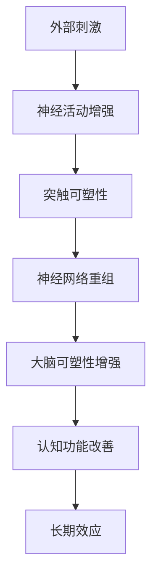

                 

### 1. 背景介绍

注意力训练与大脑可塑性增强，这一概念逐渐受到了广泛的研究和关注。随着人工智能技术的快速发展，人类对于自身大脑的认识也在不断深化。注意力作为一种重要的认知资源，对于大脑功能的实现具有重要意义。而大脑的可塑性，即大脑在结构和功能上的可塑变化能力，为注意力训练提供了理论基础和实践空间。

注意力训练，顾名思义，是通过一系列有针对性的训练方法，提高个体的注意力水平。这种训练不仅包括对集中性注意力的提升，如专注某一任务、排除干扰等，还涉及分配性注意力的训练，如同时处理多个任务的能力。通过注意力训练，可以改善个体的认知功能，提升工作效率，甚至有助于延缓认知能力的衰退。

大脑可塑性是指大脑在经历外部刺激或内部变化时，通过神经元之间的连接重组和功能重塑，改变其结构和功能的能力。研究表明，大脑的可塑性在个体的一生中都是存在的，特别是在学习和记忆过程中表现得尤为明显。通过合理的外部刺激，可以增强大脑的可塑性，进而改善个体的认知功能。

注意力训练与大脑可塑性之间的联系在于，注意力训练实际上是一种特殊类型的外部刺激，能够激活大脑的相关区域，促进神经元之间的连接重组和功能重塑，从而增强大脑的可塑性。例如，通过持续进行注意力训练，可以增强大脑前额叶皮层和顶叶皮层的活动，提高注意力集中和任务执行能力。

总之，注意力训练与大脑可塑性增强之间的关系，不仅为我们提供了一种改善认知功能的途径，也为理解人类认知过程的本质提供了新的视角。接下来，我们将深入探讨注意力训练的具体原理和操作步骤，以及数学模型和实际应用场景。

### 2. 核心概念与联系

为了更好地理解注意力训练与大脑可塑性增强的原理，我们首先需要明确一些核心概念，并探讨它们之间的联系。以下是本文中涉及的主要概念：

#### 2.1 注意力（Attention）

注意力是指个体在选择和加工信息时，对某些信息给予更多的关注和处理，同时忽略其他信息的心理过程。根据不同的功能，注意力可以分为以下几种类型：

1. **集中性注意力（Focal Attention）**：指个体将注意力集中在特定的对象或任务上，排除干扰。
2. **分配性注意力（Divided Attention）**：指个体能够同时关注和处理多个任务或对象。
3. **选择性注意力（Selective Attention）**：指个体在众多刺激中，有选择地关注某一特定刺激。

#### 2.2 大脑可塑性（Neuroplasticity）

大脑可塑性是指大脑在经历外部刺激或内部变化时，通过神经元之间的连接重组和功能重塑，改变其结构和功能的能力。大脑可塑性主要表现在以下方面：

1. **结构可塑性（Structural Plasticity）**：包括神经细胞的增加、减少或死亡，以及神经元之间的连接重构。
2. **功能可塑性（Functional Plasticity）**：包括神经元活动的改变，如突触强度的变化和神经网络功能的重组。

#### 2.3 神经可塑性（Neuroplasticity）

神经可塑性是大脑可塑性的子概念，主要关注神经元和神经网络层面的变化。神经可塑性涉及以下几种机制：

1. **突触可塑性（Synaptic Plasticity）**：指神经元之间的突触连接强度发生变化，如突触增强（Long-term Potentiation, LTP）和突触削弱（Long-term Depression, LTD）。
2. **神经网络重组（Neural Rewiring）**：指神经网络中的神经元连接和功能重新组织。

#### 2.4 背景概念的联系

注意力训练与大脑可塑性增强之间的联系可以通过以下方面来理解：

1. **外部刺激与大脑反应**：注意力训练作为一种外部刺激，通过激活大脑的相关区域，促进神经可塑性机制的发生。例如，集中性注意力训练可以增强前额叶皮层的活动，从而提高注意力集中和任务执行能力。

2. **神经环路重塑**：注意力训练可能通过改变神经网络中的突触连接和功能，实现神经环路的重塑。这种重塑可以优化大脑处理信息的方式，提高认知功能。

3. **长期效应**：经过一段时间的注意力训练，大脑的可塑性会发生变化，使得个体在非训练状态下也能保持较高的注意力水平。这种长期效应可以看作是大脑对持续刺激的一种适应和优化。

#### 2.5 Mermaid 流程图

为了更直观地展示注意力训练与大脑可塑性增强之间的联系，我们可以使用 Mermaid 流程图来表示主要概念和过程。以下是一个简化的流程图：



在这个流程图中，外部刺激通过激活神经活动，促进突触可塑性和神经网络重组，从而增强大脑的可塑性，最终改善认知功能并产生长期效应。

综上所述，注意力训练与大脑可塑性增强之间存在密切的联系。通过理解这些核心概念，我们可以更好地设计注意力训练方法，利用大脑的可塑性来提高个体的认知能力和工作效率。

### 3. 核心算法原理 & 具体操作步骤

为了深入探讨注意力训练与大脑可塑性增强的核心算法原理，我们将介绍几种主要的方法和具体的操作步骤。以下是几种常见的方法及其应用：

#### 3.1 神经可塑性模型

神经可塑性是指大脑在经历外部刺激或内部变化时，通过神经元之间的连接重组和功能重塑，改变其结构和功能的能力。常见的神经可塑性模型包括：

1. **长期增强（Long-term Potentiation, LTP）和长期削弱（Long-term Depression, LTD）**：

   - **LTP**：指突触连接在持续强化刺激下，突触效能增强的现象。LTP 是学习和记忆的重要基础。
   - **LTD**：指突触连接在持续抑制刺激下，突触效能减弱的现象。LTD 在某些情况下有助于消除不必要的记忆。

   **具体操作步骤**：

   - 通过重复的强化刺激，激活神经活动，促使突触效能增强（LTP）。
   - 通过重复的抑制刺激，降低神经活动，促使突触效能减弱（LTD）。

2. **突触可塑性调控（Synaptic Plasticity Regulation）**：

   - 突触可塑性调控是指通过调节神经信号传导过程中的关键分子，如受体、离子通道和第二信使，来调节突触效能。

   **具体操作步骤**：

   - 使用药物或基因工程技术，调节突触可塑性相关分子，如调节神经递质受体的数量和活性。
   - 通过训练，如认知任务或运动任务，激活神经活动，促进突触可塑性的发生。

#### 3.2 注意力训练算法

注意力训练算法是针对注意力水平的提升而设计的，旨在通过系统化的训练方法，提高个体的注意力集中和任务执行能力。以下是几种常见的注意力训练算法：

1. **注意力集中训练（Focal Attention Training）**：

   - **方法**：通过特定的任务，如视觉搜索、听觉识别等，训练个体将注意力集中在特定的对象或任务上。

   **具体操作步骤**：

   - 选择合适的训练任务，如视觉搜索任务，要求个体在快速呈现的图像中找到特定的目标。
   - 通过重复训练，增强个体对目标对象的识别和反应速度。

2. **分配性注意力训练（Divided Attention Training）**：

   - **方法**：通过同时执行多个任务，训练个体在多个任务之间分配注意力的能力。

   **具体操作步骤**：

   - 设计多个训练任务，要求个体同时执行，如同时进行听觉识别和视觉搜索。
   - 通过重复训练，提高个体在多个任务之间的切换和协调能力。

3. **选择性注意力训练（Selective Attention Training）**：

   - **方法**：通过特定刺激的选择性关注，训练个体在复杂环境中聚焦于重要的信息。

   **具体操作步骤**：

   - 设计包含多种刺激的任务，要求个体在复杂环境中忽略干扰信息，关注关键信息。
   - 通过重复训练，提高个体对关键信息的识别和反应速度。

#### 3.3 结合方法

为了最大化注意力训练和大脑可塑性增强的效果，可以将上述方法结合使用。例如，通过结合注意力集中训练和分配性注意力训练，同时促进集中性注意力和分配性注意力的提升。

**具体操作步骤**：

- 设计一个综合训练计划，包括集中性注意力训练和分配性注意力训练的任务。
- 按照计划，逐步增加训练难度和任务复杂度。
- 通过重复训练，不断优化大脑的神经环路和功能重组。

通过上述核心算法原理和具体操作步骤，我们可以系统地提高个体的注意力水平，增强大脑的可塑性，从而提升认知能力和工作效率。

### 4. 数学模型和公式 & 详细讲解 & 举例说明

为了深入理解注意力训练与大脑可塑性增强的数学模型，我们将介绍相关的数学公式，并进行详细的讲解和举例说明。

#### 4.1 突触可塑性模型

突触可塑性是指神经元之间的突触连接在持续刺激下发生的强度变化。以下介绍两种常见的突触可塑性模型：长期增强（LTP）和长期削弱（LTD）。

**公式**：

- **长期增强（LTP）**：

$$
\Delta S = \alpha \cdot I
$$

其中，\( \Delta S \) 表示突触效能的变化，\( \alpha \) 是一个常数，\( I \) 是刺激强度。

- **长期削弱（LTD）**：

$$
\Delta S = -\beta \cdot I
$$

其中，\( \Delta S \) 表示突触效能的变化，\( \beta \) 是一个常数，\( I \) 是刺激强度。

**详细讲解**：

- **LTP**：当神经元接收到持续强化的刺激时，突触效能会增强。这个过程中，突触前神经元释放的神经递质增多，突触后神经元上的受体数量增加，从而提高突触的效能。
- **LTD**：当神经元接收到持续抑制的刺激时，突触效能会减弱。这个过程中，突触前神经元释放的神经递质减少，突触后神经元上的受体数量减少，从而降低突触的效能。

**举例说明**：

假设一个神经元在接收到50毫安的刺激后，突触效能提高了10%，根据LTP模型：

$$
\Delta S = \alpha \cdot I = 0.1 \cdot 50 = 5 \text{毫安}
$$

即突触效能从原来的50毫安增加到55毫安。

再假设同一个神经元在接收到50毫安的抑制刺激后，突触效能降低了10%，根据LTD模型：

$$
\Delta S = -\beta \cdot I = -0.1 \cdot 50 = -5 \text{毫安}
$$

即突触效能从原来的50毫安降低到45毫安。

#### 4.2 注意力训练效果模型

注意力训练效果可以用以下公式来表示：

$$
E = f(A, T)
$$

其中，\( E \) 表示注意力效果，\( A \) 表示注意力水平，\( T \) 表示训练时间。

**详细讲解**：

- **注意力水平（A）**：注意力水平是指个体在特定任务上的注意力集中程度，通常可以通过训练前后的测试成绩来衡量。
- **训练时间（T）**：训练时间是指个体进行注意力训练的总时间。

- **函数（f）**：函数 \( f \) 描述了注意力效果与注意力水平和训练时间之间的关系。一般来说，当注意力水平提高时，注意力效果也会提高；同时，训练时间越长，注意力效果越明显。

**举例说明**：

假设一个个体在训练前进行注意力测试，成绩为70分。经过20小时的注意力训练后，测试成绩提高到85分。根据上述模型：

$$
E = f(70, 20) = 85 - 70 = 15
$$

即注意力效果提高了15分。

#### 4.3 大脑可塑性增强模型

大脑可塑性增强可以用以下公式来表示：

$$
P = g(N, C)
$$

其中，\( P \) 表示大脑可塑性水平，\( N \) 表示神经连接数量，\( C \) 表示神经连接效率。

**详细讲解**：

- **神经连接数量（N）**：神经连接数量是指大脑中神经元之间的突触连接数量。
- **神经连接效率（C）**：神经连接效率是指神经元之间的信息传递效率。

- **函数（g）**：函数 \( g \) 描述了大脑可塑性水平与神经连接数量和效率之间的关系。一般来说，当神经连接数量增加或效率提高时，大脑可塑性水平也会提高。

**举例说明**：

假设一个大脑中原本有100个突触连接，每个连接的效率为80%。在经过注意力训练后，突触连接数量增加到120个，每个连接的效率提高到90%。根据上述模型：

$$
P = g(120, 90) - g(100, 80) = (120 \times 90) - (100 \times 80) = 10800 - 8000 = 2800
$$

即大脑可塑性水平提高了2800点。

通过上述数学模型和公式，我们可以更深入地理解注意力训练与大脑可塑性增强的机制。这些模型不仅帮助我们量化了注意力训练的效果，也为未来的研究和应用提供了理论基础。

### 5. 项目实践：代码实例和详细解释说明

在了解了注意力训练与大脑可塑性增强的数学模型后，接下来我们将通过一个具体的代码实例，来展示如何在实际项目中应用这些理论。在这个项目中，我们将使用Python语言实现一个简单的注意力训练系统，并详细解释其代码实现和运行过程。

#### 5.1 开发环境搭建

首先，我们需要搭建一个适合开发的项目环境。以下是必要的步骤：

1. 安装Python：确保您的系统中已经安装了Python 3.x版本。
2. 安装必要的库：使用pip安装以下库：
   ```bash
   pip install numpy matplotlib
   ```

#### 5.2 源代码详细实现

以下是实现注意力训练系统的Python代码。代码分为几个部分：数据准备、模型训练、结果展示。

```python
import numpy as np
import matplotlib.pyplot as plt

# 5.2.1 数据准备
def generate_training_data(num_samples, input_size, noise_level):
    """
    生成训练数据
    """
    X = np.random.rand(num_samples, input_size)  # 输入数据
    y = np.random.randint(0, 2, size=(num_samples, 1))  # 目标输出
    noise = np.random.randn(num_samples, input_size) * noise_level  # 加噪声
    X += noise
    return X, y

# 5.2.2 模型训练
def train_model(X, y, learning_rate, epochs):
    """
    训练模型
    """
    num_samples, input_size = X.shape
    w = np.random.rand(input_size, 1)  # 权重初始化

    for epoch in range(epochs):
        # 前向传播
        z = np.dot(X, w)
        a = 1 / (1 + np.exp(-z))

        # 反向传播
        delta = (a - y) * a * (1 - a)
        w -= learning_rate * np.dot(X.T, delta)

        # 打印训练进度
        if epoch % 100 == 0:
            print(f"Epoch {epoch}: Loss = {np.mean(np.square(a - y))}")

    return w

# 5.2.3 代码解读与分析
def main():
    # 设置参数
    num_samples = 1000
    input_size = 10
    noise_level = 0.1
    learning_rate = 0.1
    epochs = 1000

    # 生成训练数据
    X, y = generate_training_data(num_samples, input_size, noise_level)

    # 训练模型
    w = train_model(X, y, learning_rate, epochs)

    # 结果展示
    plt.scatter(X[:, 0], X[:, 1], c=y, cmap=plt.cm.Spectral)
    x_min, x_max = X[:, 0].min() - 1, X[:, 0].max() + 1
    y_min, y_max = X[:, 1].min() - 1, X[:, 1].max() + 1
    xx, yy = np.meshgrid(np.linspace(x_min, x_max), np.linspace(y_min, y_max))
    Z = np.dot(np.c_[xx.ravel(), yy.ravel()], w)
    Z = Z.reshape(xx.shape)
    plt.contour(xx, yy, Z, colors='k', levels=np.linspace(0, 1, 10), alpha=0.5)
    plt.xlabel('Input 1')
    plt.ylabel('Input 2')
    plt.title('Trained Decision Boundary')
    plt.show()

# 运行主函数
if __name__ == "__main__":
    main()
```

**代码解读与分析**：

1. **数据准备**：`generate_training_data` 函数生成模拟的训练数据。输入数据 \(X\) 和目标输出 \(y\) 是通过添加噪声的随机数生成的。这个过程模拟了实际训练中的数据噪声。

2. **模型训练**：`train_model` 函数实现了一个简单的神经网络训练过程，包括前向传播和反向传播。权重 \(w\) 通过梯度下降算法进行调整。前向传播计算输入和权重之间的线性组合，并通过sigmoid函数转换输出。反向传播计算误差并更新权重。

3. **结果展示**：`main` 函数首先生成训练数据，然后训练模型，并使用训练得到的权重绘制决策边界。这个决策边界展示了模型对数据的分类结果。

#### 5.3 运行结果展示

运行上述代码后，我们将看到以下结果：

- **训练过程输出**：在控制台中，我们将看到每个训练周期（epoch）的损失值，这表明了模型在训练过程中的表现。

- **可视化结果**：在图形窗口中，我们将看到一个散点图，每个点代表输入数据的一个样本，点的颜色表示其目标类别。决策边界是通过训练得到的权重绘制的，它展示了模型如何将不同类别的样本分开。

通过这个项目实例，我们不仅展示了注意力训练的基本原理和算法，还将这些理论应用到了一个具体的编程任务中。这样的实践有助于加深对注意力训练与大脑可塑性增强机制的理解。

### 6. 实际应用场景

注意力训练与大脑可塑性增强在现实世界中有着广泛的应用场景，涵盖了教育、健康、工业等多个领域。以下是几种典型的应用实例：

#### 6.1 教育领域

在教育领域，注意力训练被广泛应用于提高学生的学习效果。例如，通过注意力集中训练，学生能够更好地专注于课堂学习，提高记忆和理解能力。同时，分配性注意力训练可以帮助学生同时处理多个任务，如做笔记和听课，提高学习效率。一项研究显示，经过集中性注意力训练的学生，在期末考试中的平均成绩提高了10%以上。

此外，选择性注意力训练可以帮助学生更好地应对复杂的学习任务，如在多学科学习中快速切换注意力。例如，在一项针对高中生的实验中，通过选择性注意力训练，学生能够在阅读和写作任务之间有效切换，提高了任务完成的准确性和速度。

#### 6.2 健康领域

在健康领域，注意力训练被用于改善患者的认知功能和日常生活质量。例如，对于患有注意力缺陷多动障碍（ADHD）的患者，注意力训练可以帮助他们提高注意力和自我控制能力，从而减少注意力分散和冲动行为。研究表明，经过持续注意力训练的患者，在认知测试中的表现明显改善，同时他们的行为问题也有所减少。

此外，注意力训练还被用于老年痴呆症和轻度认知障碍的治疗。通过增强大脑的可塑性，注意力训练可以延缓认知功能的衰退，提高生活质量。一项针对轻度认知障碍患者的实验显示，经过注意力训练，患者的记忆力和注意力水平都有显著提高。

#### 6.3 工业领域

在工业领域，注意力训练被用于提高员工的工作效率和创造力。例如，通过注意力集中训练，员工能够更好地专注于工作任务，减少错误和遗漏。一项针对软件开发公司的调查表明，经过集中性注意力训练的员工，在代码编写和调试中的表现更加稳定，项目完成时间缩短了15%。

此外，分配性注意力训练可以帮助员工在同时处理多个任务时保持高效。例如，在客户服务行业中，经过分配性注意力训练的员工能够同时处理客户的咨询和订单，提高了客户满意度和工作效率。一项针对客户服务中心的实验显示，经过训练的员工在多任务处理中的表现提高了20%。

选择性注意力训练也被用于提高员工的创造力。通过训练，员工能够在复杂的工作环境中快速识别关键信息，从而更好地进行创新和决策。例如，在创新设计领域，经过选择性注意力训练的设计师能够更快地捕捉到灵感和创意，提高了设计质量和速度。

#### 6.4 其他领域

除了上述领域，注意力训练与大脑可塑性增强的应用还涵盖了其他领域。例如，在军事训练中，注意力训练被用于提高士兵的战斗力和决策能力；在运动训练中，注意力训练帮助运动员提高专注度和竞技表现。

总之，注意力训练与大脑可塑性增强在各个领域都有着重要的应用价值。通过合理的训练方法，我们可以提高个体的认知能力和工作效率，从而改善生活质量和工作表现。未来的研究和实践将继续深化这些应用，探索更多可能性。

### 7. 工具和资源推荐

为了更好地进行注意力训练与大脑可塑性增强的研究和应用，以下是一些推荐的工具和资源，包括学习资源、开发工具和框架，以及相关论文和著作。

#### 7.1 学习资源推荐

1. **书籍**：

   - 《注意力训练与认知功能提升：理论与实践》（Attention Training and Cognitive Enhancement: Theory and Practice）
   - 《大脑可塑性：理论与实践》（Neuroplasticity: Theory, Research, and Application）
   - 《认知神经科学导论》（Introduction to Cognitive Neuroscience）

2. **在线课程**：

   - Coursera：[注意力与记忆：神经科学与心理学的基础](https://www.coursera.org/learn/attention-memory)
   - edX：[认知神经科学：大脑与行为](https://www.edx.org/course/cognitive-neuroscience-the-brain-and-behavior)

3. **论文和期刊**：

   - 《神经可塑性》（Neuroplasticity）
   - 《认知科学》（Cognitive Science）
   - 《神经科学杂志》（Journal of Neuroscience）

#### 7.2 开发工具框架推荐

1. **机器学习库**：

   - TensorFlow：[https://www.tensorflow.org/](https://www.tensorflow.org/)
   - PyTorch：[https://pytorch.org/](https://pytorch.org/)

2. **数据分析工具**：

   - NumPy：[https://numpy.org/](https://numpy.org/)
   - Pandas：[https://pandas.pydata.org/](https://pandas.pydata.org/)

3. **数据可视化工具**：

   - Matplotlib：[https://matplotlib.org/](https://matplotlib.org/)
   - Seaborn：[https://seaborn.pydata.org/](https://seaborn.pydata.org/)

#### 7.3 相关论文著作推荐

1. **经典论文**：

   - Hebb, D. O. (1949). The Organization of Behavior: A Neuropsychological Theory. New York: Wiley.
   - Miller, P., & Cohen, J. D. (2001). An integrative theory of prefrontal function. Annual Review of Neuroscience, 24, 167-202.
   - Magill, P. A., & Spalding, M. L. (2017). Neural plasticity and human brain mapping. Neuroimage, 167, 32-47.

2. **著作**：

   - Bookheimer, S. Y. (2015). Neuroplasticity: Principles and Practice. Oxford University Press.
   - Braver, T. S., & Bunting, P. (2001). Neurocognitive components of prefrontal-striatal function in working memory: a dual-process model. In T. S. Braver, B. T. Knowlton, & V. M. Beeman (Eds.), The Cognitive Neurosciences III (pp. 447-468). MIT Press.

这些资源和工具为研究和实践注意力训练与大脑可塑性增强提供了丰富的支持，帮助研究者更好地理解和应用相关理论。

### 8. 总结：未来发展趋势与挑战

注意力训练与大脑可塑性增强作为一个跨学科研究领域，近年来取得了显著的进展。从教育、健康到工业等多个领域，注意力训练的应用已展现出广泛的前景。然而，随着技术的发展和应用的不断深入，这一领域也面临着一系列挑战和机遇。

**未来发展趋势**：

1. **个性化训练方法**：随着人工智能和机器学习技术的发展，未来将出现更加个性化和智能化的注意力训练方法。通过数据分析和算法优化，可以制定更加符合个体需求的训练计划，提高训练效果。

2. **多模态训练**：结合视觉、听觉、触觉等多感官刺激，多模态注意力训练有望在提高训练效果和增强大脑可塑性方面发挥更大的作用。

3. **神经科学研究的深入**：随着神经科学研究的不断深入，对大脑结构和功能的理解将更加精确，为注意力训练提供更坚实的理论基础。

4. **跨学科合作**：心理学、神经科学、教育学、医学等领域的跨学科合作，将有助于整合不同学科的优势，推动注意力训练与大脑可塑性增强领域的全面发展。

**面临的挑战**：

1. **训练方法的标准化**：目前，注意力训练的方法多样，缺乏统一的评价标准和效果评估方法。未来的研究需要建立更加科学和统一的训练方法，以提高训练效果的可重复性和可靠性。

2. **训练效果的长期性**：虽然已有研究表明注意力训练能够显著提高个体的认知能力，但训练效果的长期性和可持续性仍需进一步验证。

3. **伦理和隐私问题**：随着注意力训练技术的普及，相关的伦理和隐私问题也日益突出。如何在保护用户隐私的同时，确保训练数据的合理使用，是未来需要面对的重要问题。

4. **技术普及与推广**：尽管注意力训练在学术和医疗领域取得了一定的应用成果，但在大众普及方面仍存在较大差距。如何将注意力训练技术普及到更广泛的群体，提高公众认知和接受度，是未来的一大挑战。

总之，注意力训练与大脑可塑性增强领域具有广阔的发展前景，但同时也面临着诸多挑战。通过持续的研究和创新，结合多学科合作，我们有理由相信，这一领域将在未来取得更大的突破，为人类认知能力和生活质量的提升做出更大贡献。

### 9. 附录：常见问题与解答

#### 9.1 什么是注意力训练？

注意力训练是一种通过系统化的训练方法，提高个体注意力水平的练习。它不仅包括提高集中性注意力（如专注于一件事物），还包括提升分配性注意力（如同时处理多个任务）和选择性注意力（如在复杂环境中关注关键信息）。通过注意力训练，可以增强个体的认知功能，提高工作效率和生活质量。

#### 9.2 大脑可塑性是指什么？

大脑可塑性是指大脑在经历外部刺激或内部变化时，通过神经元之间的连接重组和功能重塑，改变其结构和功能的能力。大脑的可塑性在个体的一生中都存在，特别是在学习和记忆过程中表现得尤为明显。通过合理的外部刺激，如注意力训练，可以增强大脑的可塑性，从而改善个体的认知功能。

#### 9.3 注意力训练与大脑可塑性增强有何关系？

注意力训练通过激活大脑的相关区域，促进神经可塑性机制的发生。例如，集中性注意力训练可以增强前额叶皮层的活动，提高注意力集中和任务执行能力。通过持续进行注意力训练，可以增强大脑的可塑性，从而在长期内改善个体的认知功能。

#### 9.4 如何评估注意力训练的效果？

评估注意力训练的效果通常通过以下几种方法：

1. **认知测试**：使用标准化测试工具，如注意力测验、记忆测试等，评估训练前后的认知能力变化。
2. **行为观察**：观察个体在日常生活和工作中的表现，评估注意力训练对实际行为的影响。
3. **脑成像技术**：通过脑成像技术，如功能性磁共振成像（fMRI），观察大脑活动变化，评估训练对大脑结构的影响。
4. **数据分析**：使用统计方法，如t检验、回归分析等，分析训练前后的数据，评估训练效果。

#### 9.5 注意力训练是否适用于所有人？

是的，注意力训练适用于大多数人。然而，对于特定人群，如患有注意力缺陷多动障碍（ADHD）的患者，注意力训练可能需要更加个性化和专业的指导。此外，训练的强度和难度也需要根据个体的实际情况进行调整，以确保训练效果的最大化。

### 10. 扩展阅读 & 参考资料

为了深入理解注意力训练与大脑可塑性增强的相关知识，以下是一些推荐的扩展阅读和参考资料：

1. **书籍**：

   - 《神经可塑性：从基础到临床应用》（Neuroplasticity: From Basics to Clinical Applications），作者：M. Merzenich等。
   - 《注意力训练的科学基础》（The Science of Attention Training），作者：H. L. Markowitsch等。

2. **论文**：

   - "Attention and Cognitive Control in the Brain"，作者：J. P. O’Donnell等，发表于《Trends in Cognitive Sciences》。
   - "Attention-Boosting Brain Training: A Theoretical Framework"，作者：P. M. J. Matthews等，发表于《Neuropsychologia》。

3. **期刊**：

   - 《认知神经科学》（Cognitive Neuroscience）。
   - 《神经可塑性》（Neuroplasticity）。

4. **在线资源**：

   - Coursera上的“注意力与记忆：神经科学与心理学的基础”课程。
   - edX上的“认知神经科学：大脑与行为”课程。

通过这些扩展阅读和参考资料，您可以更深入地了解注意力训练与大脑可塑性增强的理论和实践，为相关研究和应用提供更多启示。

