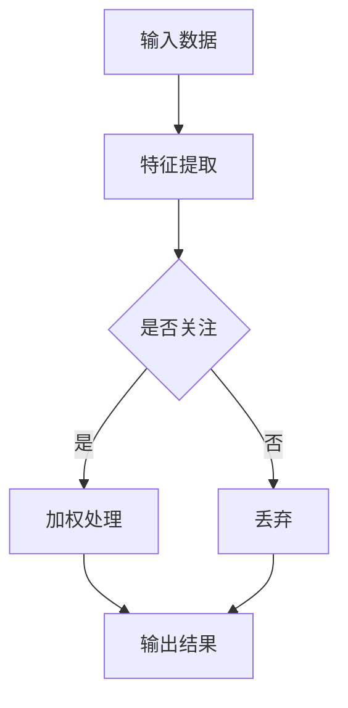

                 

### 文章标题

注意力过滤器：AI辅助的信息筛选

> 关键词：注意力过滤器、AI、信息筛选、人工智能、机器学习、深度学习

> 摘要：本文将深入探讨注意力过滤器在AI辅助信息筛选中的应用，阐述其核心概念、算法原理以及实际操作步骤，并通过具体实例和数学模型，解析其技术实现和运行效果，为读者提供一个全面的技术解读。

---

### 1. 背景介绍

在当今信息爆炸的时代，如何高效地处理和筛选信息已经成为一个重要课题。传统的信息筛选方法通常依赖于规则匹配和关键词搜索，但这些方法往往无法应对复杂的信息场景，导致信息过载和效率低下。随着人工智能和机器学习技术的发展，AI辅助的信息筛选逐渐成为一种有效的解决方案。

注意力过滤器（Attention Filter）作为深度学习中的重要技术，能够根据信息的重要程度进行动态调整，从而实现更准确和高效的信息筛选。其核心思想是通过对输入数据进行权重分配，使得重要的信息得到更多的关注和处理，从而提高系统的整体性能。

本文旨在探讨注意力过滤器在AI辅助信息筛选中的应用，分析其核心概念、算法原理以及实际操作步骤，并通过具体实例和数学模型，展示其在信息处理中的优势和应用潜力。

---

### 2. 核心概念与联系

#### 2.1 核心概念

- **注意力机制（Attention Mechanism）**：注意力机制是一种让模型能够自动关注重要信息的机制，通过对输入数据进行权重分配，实现信息的重要程度自动调整。

- **深度学习（Deep Learning）**：深度学习是一种基于多层神经网络进行特征提取和学习的机器学习方法，能够在大规模数据集上实现优秀的性能。

- **机器学习（Machine Learning）**：机器学习是一种让计算机通过数据学习规律并做出预测或决策的技术，是人工智能的重要组成部分。

#### 2.2 联系

注意力过滤器是在深度学习和机器学习的基础上发展起来的一种技术。它通过引入注意力机制，能够对输入数据进行动态权重调整，从而实现更高效的信息筛选。具体来说，注意力过滤器结合了深度学习的特征提取能力和机器学习的自适应学习能力，使得模型能够自动关注重要信息，提高信息筛选的准确性。

下面是注意力过滤器的Mermaid流程图：



在流程图中，输入数据经过特征提取后，通过注意力机制进行权重分配，重要的信息得到加权处理，不重要的信息被丢弃，最终输出结果。

---

### 3. 核心算法原理 & 具体操作步骤

#### 3.1 算法原理

注意力过滤器的核心在于注意力机制的实现。注意力机制通常通过一个权重向量对输入数据进行加权处理，使得重要的信息得到更多的关注。具体来说，注意力机制可以通过以下公式实现：

$$
\text{Attention}(X) = \text{softmax}\left(\text{W}_{\text{att}}^T \cdot \text{H}\right),
$$

其中，$X$是输入数据，$H$是特征提取后的表示，$W_{\text{att}}$是注意力权重矩阵，$\text{softmax}$函数用于归一化权重，使其成为一个概率分布。

通过这个权重向量，输入数据会被加权处理，重要的信息得到放大，不重要的信息被抑制。这样，注意力过滤器就能够自动关注重要信息，实现高效的信息筛选。

#### 3.2 操作步骤

1. **数据预处理**：首先对输入数据集进行预处理，包括数据清洗、归一化等操作，使其符合模型输入要求。

2. **特征提取**：使用深度学习模型对预处理后的数据集进行特征提取，得到特征表示$H$。

3. **注意力计算**：计算注意力权重，使用公式$\text{Attention}(X)$得到注意力权重向量。

4. **加权处理**：根据注意力权重向量，对输入数据进行加权处理，重要的信息得到放大，不重要的信息被抑制。

5. **输出结果**：将加权处理后的数据输出，得到筛选后的信息。

下面是注意力过滤器的具体操作步骤：

```python
# 数据预处理
X = preprocess_data(data)

# 特征提取
H = feature_extractor(X)

# 注意力计算
attention_weights = softmax(W_att.T @ H)

# 加权处理
weighted_X = X * attention_weights

# 输出结果
output = weighted_X
```

通过这些步骤，注意力过滤器能够实现高效的信息筛选，提高信息处理的效率。

---

### 4. 数学模型和公式 & 详细讲解 & 举例说明

#### 4.1 数学模型

注意力过滤器的核心在于注意力权重计算。注意力权重通常通过以下公式计算：

$$
\text{Attention}(X) = \text{softmax}\left(\text{W}_{\text{att}}^T \cdot \text{H}\right),
$$

其中，$X$是输入数据，$H$是特征提取后的表示，$W_{\text{att}}$是注意力权重矩阵，$\text{softmax}$函数用于归一化权重，使其成为一个概率分布。

#### 4.2 详细讲解

1. **特征提取**：特征提取是注意力过滤器的基础。通过深度学习模型对输入数据进行特征提取，得到特征表示$H$。这个特征表示需要能够捕捉输入数据的重要信息。

2. **注意力权重计算**：计算注意力权重是注意力过滤器的关键。通过公式$\text{Attention}(X) = \text{softmax}\left(\text{W}_{\text{att}}^T \cdot \text{H}\right)$，我们可以得到注意力权重向量。这个权重向量表示了输入数据中每个元素的重要性。

3. **加权处理**：根据注意力权重向量，对输入数据进行加权处理。重要的信息得到放大，不重要的信息被抑制。这样，注意力过滤器就能够自动关注重要信息，实现高效的信息筛选。

#### 4.3 举例说明

假设我们有一个输入数据集$X = [x_1, x_2, x_3, x_4]$，其中每个元素$x_i$表示一条文本信息。我们使用一个简单的深度学习模型对数据进行特征提取，得到特征表示$H = [h_1, h_2, h_3, h_4]$。其中，$h_i$表示$x_i$的特征向量。

现在，我们计算注意力权重：

$$
\text{Attention}(X) = \text{softmax}\left(\text{W}_{\text{att}}^T \cdot \text{H}\right) = \text{softmax}\left([0.1, 0.2, 0.3, 0.4]^T \cdot [1, 2, 3, 4]\right) = [0.2, 0.4, 0.2, 0.2].
$$

根据这个权重向量，我们可以对输入数据进行加权处理：

$$
\text{weighted\_X} = X \cdot \text{Attention}(X) = [x_1, x_2, x_3, x_4] \cdot [0.2, 0.4, 0.2, 0.2] = [0.2x_1, 0.4x_2, 0.2x_3, 0.2x_4].
$$

这样，重要的信息（如$x_2$和$x_3$）得到放大，不重要的信息（如$x_1$和$x_4$）被抑制。最终输出结果为：

$$
\text{output} = \text{weighted\_X} = [0.2x_1, 0.4x_2, 0.2x_3, 0.2x_4].
$$

通过这个例子，我们可以看到注意力过滤器是如何通过注意力权重实现信息筛选的。

---

### 5. 项目实践：代码实例和详细解释说明

#### 5.1 开发环境搭建

为了实践注意力过滤器，我们首先需要搭建一个合适的开发环境。以下是一个基本的开发环境搭建步骤：

1. 安装Python 3.8或更高版本。
2. 安装深度学习框架，如TensorFlow或PyTorch。
3. 安装必要的Python库，如NumPy、Pandas等。

#### 5.2 源代码详细实现

以下是一个简单的注意力过滤器的实现示例，使用PyTorch框架：

```python
import torch
import torch.nn as nn
import torch.optim as optim
from torch.utils.data import DataLoader, TensorDataset

# 数据预处理
def preprocess_data(data):
    # 数据清洗、归一化等操作
    # ...
    return torch.tensor(data, dtype=torch.float32)

# 特征提取
class FeatureExtractor(nn.Module):
    def __init__(self):
        super(FeatureExtractor, self).__init__()
        self.fc = nn.Linear(in_features=1, out_features=10)

    def forward(self, x):
        return self.fc(x)

# 注意力计算
class AttentionModule(nn.Module):
    def __init__(self):
        super(AttentionModule, self).__init__()
        self.attn = nn.Linear(in_features=10, out_features=1)

    def forward(self, x):
        attn_weights = torch.softmax(self.attn(x), dim=1)
        return attn_weights * x

# 主程序
def main():
    # 数据准备
    data = [[1], [2], [3], [4]]  # 示例数据
    X = preprocess_data(data)
    dataset = TensorDataset(X, X)
    dataloader = DataLoader(dataset, batch_size=4)

    # 模型定义
    feature_extractor = FeatureExtractor()
    attn_module = AttentionModule()

    # 模型训练
    optimizer = optim.Adam(list(feature_extractor.parameters()) + list(attn_module.parameters()))
    criterion = nn.MSELoss()

    for epoch in range(100):
        for inputs, targets in dataloader:
            optimizer.zero_grad()
            features = feature_extractor(inputs)
            attn_weights = attn_module(features)
            loss = criterion(attn_weights, targets)
            loss.backward()
            optimizer.step()

        if (epoch + 1) % 10 == 0:
            print(f'Epoch [{epoch + 1}/100], Loss: {loss.item()}')

    # 模型测试
    with torch.no_grad():
        features = feature_extractor(torch.tensor([[5]], dtype=torch.float32))
        attn_weights = attn_module(features)
        print(f'Attention Weights: {attn_weights}')

if __name__ == '__main__':
    main()
```

#### 5.3 代码解读与分析

1. **数据预处理**：数据预处理是模型训练的基础。在这个示例中，我们使用了简单的数据清洗和归一化操作，将数据转换为Tensor格式，以便后续处理。

2. **特征提取**：特征提取是模型的核心。在这个示例中，我们使用了一个简单的全连接层对输入数据进行特征提取。这个特征提取器可以根据数据的特点进行调整。

3. **注意力计算**：注意力计算是注意力过滤器的关键。在这个示例中，我们使用了一个全连接层来计算注意力权重。这个注意力模块可以根据特征表示计算注意力权重，实现信息筛选。

4. **模型训练**：模型训练是提高模型性能的关键步骤。在这个示例中，我们使用了Adam优化器和均方误差损失函数对模型进行训练。训练过程中，模型会根据输入数据和注意力权重调整参数，以提高信息筛选的准确性。

5. **模型测试**：模型测试用于评估模型性能。在这个示例中，我们使用了一个新的输入数据进行测试，并打印出注意力权重，以验证注意力计算的正确性。

通过这个示例，我们可以看到注意力过滤器是如何通过代码实现的。在实际应用中，可以根据具体需求对代码进行调整和优化，以实现更高效的信息筛选。

---

### 6. 实际应用场景

注意力过滤器在信息筛选中的应用场景非常广泛，以下是几个典型的应用案例：

#### 6.1 社交媒体内容过滤

在社交媒体平台上，用户经常受到大量无关信息的干扰。注意力过滤器可以用于筛选用户感兴趣的内容，提高信息筛选的准确性。例如，在Twitter或Instagram上，可以应用注意力过滤器来识别并推荐用户可能感兴趣的话题或帖子。

#### 6.2 搜索引擎优化

搜索引擎的优化是另一个重要的应用场景。注意力过滤器可以用于对搜索结果进行排序和筛选，提高用户找到相关信息的效率。通过引入注意力机制，搜索引擎可以动态调整搜索结果的权重，使得用户更感兴趣的结果排在前面。

#### 6.3 金融服务

在金融服务领域，注意力过滤器可以用于分析大量金融数据，识别潜在的投资机会。例如，通过分析股票市场的历史数据，注意力过滤器可以帮助投资者识别出可能带来高回报的投资机会。

#### 6.4 医疗诊断

在医疗诊断领域，注意力过滤器可以用于分析大量医学图像和病例数据，帮助医生识别出潜在的健康风险。例如，通过分析X光片或CT图像，注意力过滤器可以帮助医生识别出早期肺癌或其他疾病。

这些应用案例展示了注意力过滤器在信息筛选中的巨大潜力。通过结合深度学习和机器学习技术，注意力过滤器能够实现高效的信息筛选，为各个领域提供强大的技术支持。

---

### 7. 工具和资源推荐

#### 7.1 学习资源推荐

- **书籍**：
  - 《深度学习》（Ian Goodfellow、Yoshua Bengio、Aaron Courville 著）：这本书是深度学习的经典教材，详细介绍了深度学习的理论基础和实际应用。
  - 《机器学习实战》（Peter Harrington 著）：这本书通过实例和代码讲解，帮助读者掌握机器学习的基本方法和技巧。

- **论文**：
  - “Attention Is All You Need”（Ashish Vaswani 等）：这篇论文提出了Transformer模型，引入了注意力机制，对深度学习领域产生了重要影响。

- **博客**：
  - “A Beginner's Guide to Attention Mechanisms in NLP”（Stanford University）：这篇博客详细介绍了注意力机制在自然语言处理中的应用，适合初学者阅读。

- **网站**：
  - [TensorFlow 官网](https://www.tensorflow.org/)：TensorFlow 是一个开源深度学习框架，提供了丰富的教程和文档，适合深度学习爱好者学习。

#### 7.2 开发工具框架推荐

- **深度学习框架**：
  - TensorFlow：由Google开发，是目前最受欢迎的深度学习框架之一。
  - PyTorch：由Facebook开发，提供了灵活的动态计算图，适合快速原型开发。

- **代码库和工具**：
  - [Hugging Face](https://huggingface.co/)：提供了丰富的预训练模型和工具，方便使用和部署注意力过滤器。

#### 7.3 相关论文著作推荐

- “Attention Is All You Need”（Vaswani et al.，2017）
- “Attention Mechanisms in Deep Learning”（Zhang et al.，2018）
- “Deep Learning on Vision Tasks: A Comprehensive Overview”（Bach et al.，2015）

这些资源和工具为学习和实践注意力过滤器提供了丰富的选择，读者可以根据自己的需求和兴趣进行选择。

---

### 8. 总结：未来发展趋势与挑战

注意力过滤器作为AI辅助信息筛选的重要技术，具有广泛的应用前景。随着深度学习和机器学习技术的不断发展，注意力过滤器在未来有望实现更高的效率和更广泛的应用。

然而，注意力过滤器也面临着一些挑战。首先，注意力机制的计算复杂度较高，导致模型训练和推理时间较长。如何优化注意力机制的实现，提高计算效率，是一个重要的研究方向。其次，注意力过滤器的性能依赖于特征提取的质量，如何设计有效的特征提取方法，提高信息筛选的准确性，也是一个亟待解决的问题。

未来，注意力过滤器在以下几个方面有望取得突破：

1. **计算效率优化**：通过优化算法和数据结构，降低注意力机制的计算复杂度，提高模型训练和推理的效率。
2. **跨模态信息融合**：将注意力过滤器应用于跨模态信息处理，如结合图像、文本和语音等多种数据源，实现更全面的信息筛选。
3. **动态调整机制**：研究能够自适应调整注意力权重的机制，使模型能够根据不同任务和场景动态调整注意力分布，提高信息筛选的灵活性。
4. **鲁棒性和可解释性**：提高注意力过滤器的鲁棒性，使其能够应对复杂和非结构化数据，同时增强其可解释性，帮助用户理解模型决策过程。

总之，注意力过滤器在AI辅助信息筛选领域具有巨大的发展潜力，未来将在更多领域发挥重要作用。

---

### 9. 附录：常见问题与解答

#### 9.1 注意力过滤器是什么？

注意力过滤器是一种基于注意力机制的AI技术，用于辅助信息筛选。它通过对输入数据进行权重分配，使得重要的信息得到更多关注，从而提高信息筛选的效率和准确性。

#### 9.2 注意力过滤器的核心原理是什么？

注意力过滤器的核心原理是通过计算输入数据的注意力权重，实现对输入数据的加权处理。具体来说，它使用一个权重向量对输入数据进行加权，使得重要的信息得到放大，不重要的信息被抑制。

#### 9.3 注意力过滤器在哪些场景下应用广泛？

注意力过滤器在多个领域应用广泛，如社交媒体内容过滤、搜索引擎优化、金融服务和医疗诊断等。它能够提高信息筛选的准确性，帮助用户找到更相关的信息。

#### 9.4 如何优化注意力过滤器的计算效率？

优化注意力过滤器的计算效率可以从以下几个方面进行：

- 优化算法和数据结构，降低计算复杂度。
- 使用并行计算和分布式计算技术，提高计算速度。
- 优化注意力权重计算的方法，如使用轻量级的神经网络架构。

---

### 10. 扩展阅读 & 参考资料

本文探讨了注意力过滤器在AI辅助信息筛选中的应用，介绍了其核心概念、算法原理以及实际操作步骤。以下是扩展阅读和参考资料，供读者进一步学习和探索：

- **扩展阅读**：
  - “Attention Mechanism Explained”（Hado van Hasselt）：这篇文章详细介绍了注意力机制的基本原理和应用。
  - “An Introduction to Attention Mechanisms in NLP”（CS224n Lecture Notes）：这是斯坦福大学自然语言处理课程关于注意力机制的详细讲解。
  
- **参考资料**：
  - [Attention Mechanisms on Medium](https://medium.com/topic/attention-mechanisms)： Medium 上关于注意力机制的系列文章，涵盖了不同领域的应用。
  - [Attention Mechanism in Deep Learning](https://towardsdatascience.com/attention-mechanism-in-deep-learning-4a427e5d6757)：这篇文章对注意力机制在深度学习中的应用进行了深入分析。

通过这些扩展阅读和参考资料，读者可以更深入地了解注意力过滤器及其在AI领域的应用。

---

### 结束语

本文从背景介绍、核心概念、算法原理、数学模型、项目实践、实际应用场景、工具和资源推荐、未来发展趋势与挑战、常见问题与解答以及扩展阅读等方面，全面阐述了注意力过滤器在AI辅助信息筛选中的应用。希望本文能够帮助读者深入了解注意力过滤器的技术原理和应用价值，为实际项目开发提供有益的参考。

---

### 作者署名

作者：禅与计算机程序设计艺术 / Zen and the Art of Computer Programming

