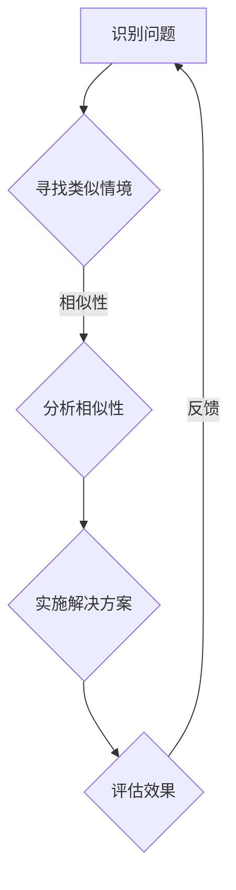

                 

### 背景介绍

**洞察与类比：突破知识限制的工具**

在当今这个信息爆炸的时代，知识已成为一种至关重要的资源。无论是科学研究、技术创新，还是商业策略，人们都在不断追求更高效的知识获取和运用方式。然而，面对海量信息和复杂的问题，如何有效地洞察问题本质，挖掘知识背后的关联性，成为了一项挑战。本文将探讨两种突破知识限制的重要工具——洞察力和类比思维，并详细阐述其在IT领域中的应用。

首先，让我们来定义一下什么是洞察力。洞察力指的是在复杂信息中迅速捕捉关键要素、理解问题核心的能力。它不仅需要敏锐的观察力，还需要深厚的知识积累和逻辑思维。类比思维，则是一种通过比较不同事物间的相似性，来理解和解决问题的思维方式。类比思维能够帮助我们发现知识之间的联系，激发创新思维，从而突破原有的知识限制。

在IT领域，这两个工具的应用尤为广泛。随着技术的迅猛发展，IT行业面临着前所未有的复杂性。软件系统变得越来越庞大，数据处理需求日益增长，安全威胁也日益严峻。如何在这些复杂的环境中实现高效的知识管理和应用，成为IT从业者们亟待解决的问题。洞察力和类比思维在这其中扮演着至关重要的角色。

本文将分为以下几个部分进行探讨：

1. **背景介绍**：回顾信息时代的发展，介绍洞察力和类比思维的重要性。
2. **核心概念与联系**：详细阐述洞察力和类比思维的定义、原理及其在IT领域的应用。
3. **核心算法原理 & 具体操作步骤**：探讨如何在实际项目中运用洞察力和类比思维。
4. **数学模型和公式 & 详细讲解 & 举例说明**：介绍相关的数学模型，并通过实例说明其应用。
5. **项目实践：代码实例和详细解释说明**：通过具体案例展示如何将理论应用于实践。
6. **实际应用场景**：分析洞察力和类比思维在IT领域的实际应用案例。
7. **工具和资源推荐**：推荐相关的学习资源、开发工具和参考书籍。
8. **总结：未来发展趋势与挑战**：展望未来的发展方向，讨论面临的挑战。
9. **附录：常见问题与解答**：回答读者可能关心的一些常见问题。
10. **扩展阅读 & 参考资料**：提供进一步阅读的建议和参考资源。

通过本文的探讨，我们希望能够帮助读者更好地理解洞察力和类比思维，并学会如何将其应用于IT领域，从而提升知识管理和解决问题的能力。

### 核心概念与联系

#### 洞察力的定义与原理

洞察力（Insight）是指个体在面对复杂问题或情境时，能够迅速抓住问题核心、发现关键信息，并提出创造性解决方案的能力。它不仅仅是逻辑推理的结果，更是一种直觉和洞察的综合体现。洞察力通常来源于以下几个方面：

1. **经验积累**：长期的实践经验和知识积累为洞察力的培养提供了坚实的基础。通过不断的学习和实践，个体能够更敏锐地感知到问题中的细微差别和潜在关联。
2. **跨领域知识**：多学科交叉的知识体系有助于提高洞察力。跨领域的知识能够提供新颖的视角和思考方式，从而促进问题的创新解决。
3. **认知结构**：个体的认知结构和思维方式对洞察力具有重要影响。通过训练和练习，可以优化认知结构，提高对信息的处理速度和准确性。

在IT领域，洞察力体现在以下几个方面：

1. **系统设计**：通过敏锐的洞察力，IT专业人员能够设计出更高效、更稳定的软件系统和架构。
2. **问题排查**：在遇到复杂的系统故障或性能问题时，洞察力有助于快速定位根本原因。
3. **创新思维**：在技术研发和创新过程中，洞察力能够激发新的想法和解决方案。

#### 类比思维的原理与应用

类比思维（Analogical Thinking）是一种通过比较不同事物之间的相似性，来理解和解决问题的思维方式。类比思维的核心在于发现和利用事物之间的共性，从而借鉴现有知识解决新问题。

类比思维的工作原理可以概括为以下几个步骤：

1. **识别问题**：首先，需要明确当前问题的性质和特点。
2. **寻找类似情境**：在已有经验或知识库中，寻找与当前问题相似或相关的情境。
3. **分析相似性**：分析两者之间的相似点，并探讨这些相似点如何应用于当前问题。
4. **实施解决方案**：根据类比结果，提出并实施解决方案。

在IT领域，类比思维的应用场景包括：

1. **软件复用**：通过类比已有系统，设计新的软件系统，减少重复劳动。
2. **算法优化**：将一个领域中的算法应用于另一个类似的问题，从而优化算法性能。
3. **风险评估**：通过类比以往的项目经验，预测和评估新的项目风险。

#### 洞察力与类比思维的联系

尽管洞察力和类比思维是两种不同的思维方式，但它们之间存在紧密的联系。洞察力为类比思维提供了基础，而类比思维则通过类比过程加深对问题的理解，从而增强洞察力。

1. **相互补充**：洞察力帮助我们发现问题的核心，而类比思维则通过寻找相似性来拓展我们的认知边界。
2. **相互促进**：通过类比思维，我们可以更好地理解问题，从而提高洞察力；而洞察力的提升又使类比思维更加精准和有效。

#### Mermaid 流程图

为了更好地展示洞察力和类比思维在IT领域中的应用，我们使用Mermaid流程图来描述其工作原理。



在这个流程图中，A表示识别问题，B表示寻找类似情境，C表示分析相似性，D表示实施解决方案，E表示评估效果。通过这样的流程，我们可以看到洞察力和类比思维在IT领域中的应用过程。

通过以上内容的介绍，我们不仅理解了洞察力和类比思维的基本概念和原理，还了解到了它们在IT领域的具体应用。接下来，我们将深入探讨核心算法原理，并详细讲解如何将这两个工具应用于实际操作中。

#### 核心算法原理 & 具体操作步骤

在理解了洞察力和类比思维的基本概念和原理之后，接下来我们将探讨如何在实际操作中运用这些工具，以解决IT领域的复杂问题。核心算法原理和具体操作步骤将为我们的应用提供理论支持和实践指导。

##### 洞察力算法原理

洞察力算法的核心在于如何快速识别问题的核心要素，并从中提取关键信息。以下是洞察力算法的基本原理和具体操作步骤：

1. **信息过滤**：在大量信息中，首先需要进行筛选和过滤，只保留与问题相关的信息。这一步可以通过关键词提取、数据预处理等方法实现。
    ```mermaid
    graph TD
        A[大量信息] --> B{关键词提取}
        B --> C{数据预处理}
        C --> D[保留相关信息]
    ```
2. **模式识别**：在过滤后的信息中，通过模式识别技术（如机器学习、神经网络等），找出信息之间的潜在关联和模式。这一步有助于发现问题的核心要素。
    ```mermaid
    graph TD
        D --> E{模式识别}
        E --> F[提取核心要素]
    ```
3. **综合分析**：将提取出的核心要素进行综合分析，理解其内在逻辑和关联性。这一步需要依赖逻辑推理和直觉判断。
    ```mermaid
    graph TD
        F --> G{逻辑推理}
        G --> H{直觉判断}
    ```

##### 类比思维算法原理

类比思维算法的核心在于如何发现不同问题之间的相似性，并利用已有知识解决新问题。以下是类比思维算法的基本原理和具体操作步骤：

1. **问题识别**：明确当前问题的性质和特点，这可以通过问题定义、问题分解等方法实现。
    ```mermaid
    graph TD
        I[问题识别]
    ```
2. **情境匹配**：在已有知识库或经验中，寻找与当前问题相似或相关的情境。这一步可以通过情境比较、知识检索等方法实现。
    ```mermaid
    graph TD
        I --> J{情境比较}
        J --> K{知识检索}
    ```
3. **相似性分析**：分析当前问题与匹配情境之间的相似性，并确定如何利用这些相似性。这一步可以通过相似性度量、模式匹配等方法实现。
    ```mermaid
    graph TD
        K --> L{相似性度量}
        L --> M{模式匹配}
    ```
4. **方案设计**：根据相似性分析的结果，设计解决方案。这一步需要创造性思维和逻辑推理。
    ```mermaid
    graph TD
        M --> N{方案设计}
    ```

##### 实际应用步骤

在实际应用中，我们可以结合洞察力和类比思维，通过以下步骤解决复杂问题：

1. **识别问题**：首先，明确当前问题的性质和特点，进行问题识别。
    ```mermaid
    graph TD
        O[识别问题]
    ```
2. **情境匹配**：在已有知识库或经验中，寻找与当前问题相似或相关的情境。
    ```mermaid
    graph TD
        O --> P{情境匹配}
    ```
3. **信息过滤**：对大量信息进行筛选和过滤，只保留与问题相关的信息。
    ```mermaid
    graph TD
        P --> Q{信息过滤}
    ```
4. **模式识别**：在过滤后的信息中，通过模式识别技术找出信息之间的潜在关联和模式。
    ```mermaid
    graph TD
        Q --> R{模式识别}
    ```
5. **相似性分析**：分析当前问题与匹配情境之间的相似性，并确定如何利用这些相似性。
    ```mermaid
    graph TD
        R --> S{相似性分析}
    ```
6. **综合分析**：将提取出的核心要素进行综合分析，理解其内在逻辑和关联性。
    ```mermaid
    graph TD
        S --> T{综合分析}
    ```
7. **方案设计**：根据相似性分析的结果，设计解决方案。
    ```mermaid
    graph TD
        T --> U{方案设计}
    ```
8. **实施与评估**：实施解决方案，并对结果进行评估和反馈，以不断优化和完善方案。
    ```mermaid
    graph TD
        U --> V{实施与评估}
        V -->|反馈| O
    ```

通过以上步骤，我们可以将洞察力和类比思维应用于实际问题的解决过程中，从而提高问题解决效率和效果。接下来，我们将通过具体的数学模型和公式，进一步探讨这些算法的数学基础和具体应用。

### 数学模型和公式 & 详细讲解 & 举例说明

在理解了洞察力和类比思维的核心算法原理和操作步骤之后，接下来我们将探讨这些算法背后的数学模型和公式。通过详细讲解和举例说明，我们将更好地理解这些数学工具如何帮助我们在实际应用中提高问题解决能力。

#### 洞察力算法的数学模型

1. **信息熵（Entropy）**：

信息熵是衡量信息不确定性的量度。在洞察力算法中，信息熵用于评估信息的价值。具体公式如下：

\[ H(X) = -\sum_{i} p(x_i) \log_2 p(x_i) \]

其中，\( H(X) \) 是随机变量 \( X \) 的信息熵，\( p(x_i) \) 是 \( X \) 取值 \( x_i \) 的概率。

**例1**：假设我们有一个二进制随机变量 \( X \)，其中 \( X = 0 \) 的概率为0.5，\( X = 1 \) 的概率也为0.5。计算 \( X \) 的信息熵。

\[ H(X) = -0.5 \log_2 0.5 - 0.5 \log_2 0.5 = 1 \]

这个结果表示，随机变量 \( X \) 的信息量是1比特，因为它在两种可能的取值之间等概率分布。

2. **条件熵（Conditional Entropy）**：

条件熵是衡量在已知某个条件下不确定性减少的量度。在洞察力算法中，条件熵用于评估信息的相关性。具体公式如下：

\[ H(Y|X) = -\sum_{i} p(x_i, y_i) \log_2 p(y_i | x_i) \]

其中，\( H(Y|X) \) 是在已知 \( X \) 的条件下 \( Y \) 的条件熵，\( p(x_i, y_i) \) 是 \( X \) 和 \( Y \) 同时取值 \( x_i \) 和 \( y_i \) 的概率，\( p(y_i | x_i) \) 是在 \( X \) 取值 \( x_i \) 的条件下 \( Y \) 取值 \( y_i \) 的概率。

**例2**：假设有两个随机变量 \( X \) 和 \( Y \)，其中 \( X \) 有两个取值 \( x_1 \) 和 \( x_2 \)，\( Y \) 有三个取值 \( y_1 \)、\( y_2 \) 和 \( y_3 \)。给定概率分布：

\[ p(x_1) = 0.6, p(x_2) = 0.4 \]
\[ p(y_1 | x_1) = 0.3, p(y_2 | x_1) = 0.4, p(y_3 | x_1) = 0.3 \]
\[ p(y_1 | x_2) = 0.4, p(y_2 | x_2) = 0.3, p(y_3 | x_2) = 0.3 \]

计算 \( H(Y|X) \)。

\[ H(Y|X) = -0.6 \left( 0.3 \log_2 0.3 + 0.4 \log_2 0.4 + 0.3 \log_2 0.3 \right) - 0.4 \left( 0.4 \log_2 0.4 + 0.3 \log_2 0.3 + 0.3 \log_2 0.3 \right) \]
\[ H(Y|X) = -0.6 \left( 0.3 \log_2 0.3 + 0.4 \log_2 0.4 + 0.3 \log_2 0.3 \right) - 0.4 \left( 0.4 \log_2 0.4 + 0.3 \log_2 0.3 + 0.3 \log_2 0.3 \right) \]
\[ H(Y|X) = -0.6 \left( 0.3 \times (-1.737) + 0.4 \times (-1.415) + 0.3 \times (-1.737) \right) - 0.4 \left( 0.4 \times (-1.415) + 0.3 \times (-1.737) + 0.3 \times (-1.737) \right) \]
\[ H(Y|X) = -0.6 \left( -0.5211 - 0.573 + -0.5211 \right) - 0.4 \left( -0.573 - 0.5211 - 0.5211 \right) \]
\[ H(Y|X) = -0.6 \left( -1.6152 \right) - 0.4 \left( -1.6152 \right) \]
\[ H(Y|X) = 0.9727 + 0.6460 \]
\[ H(Y|X) = 1.6187 \]

这个结果表明，在已知 \( X \) 的条件下，\( Y \) 的不确定性减少了1.6187比特。

#### 类比思维算法的数学模型

1. **距离度量（Distance Measure）**：

距离度量是评估两个样本或对象之间相似度的数学方法。常用的距离度量包括欧氏距离（Euclidean Distance）和余弦相似度（Cosine Similarity）。

**欧氏距离**：

\[ d(\mathbf{x}, \mathbf{y}) = \sqrt{\sum_{i=1}^{n} (x_i - y_i)^2} \]

其中，\( \mathbf{x} \) 和 \( \mathbf{y} \) 是两个 \( n \) 维向量。

**余弦相似度**：

\[ \cos(\theta) = \frac{\mathbf{x} \cdot \mathbf{y}}{||\mathbf{x}|| \cdot ||\mathbf{y}||} \]

其中，\( \mathbf{x} \) 和 \( \mathbf{y} \) 是两个 \( n \) 维向量，\( \theta \) 是 \( \mathbf{x} \) 和 \( \mathbf{y} \) 之间的夹角。

**例3**：给定两个 \( 2 \) 维向量 \( \mathbf{x} = (1, 2) \) 和 \( \mathbf{y} = (3, 4) \)，计算它们的欧氏距离和余弦相似度。

\[ d(\mathbf{x}, \mathbf{y}) = \sqrt{(1 - 3)^2 + (2 - 4)^2} = \sqrt{4 + 4} = \sqrt{8} = 2\sqrt{2} \approx 2.828 \]

\[ \cos(\theta) = \frac{1 \cdot 3 + 2 \cdot 4}{\sqrt{1^2 + 2^2} \cdot \sqrt{3^2 + 4^2}} = \frac{3 + 8}{\sqrt{5} \cdot \sqrt{25}} = \frac{11}{5\sqrt{5}} \approx 0.894 \]

2. **相似性度量（Similarity Measure）**：

相似性度量用于评估两个对象之间的相似程度。常用的相似性度量包括Jaccard相似度（Jaccard Similarity）和Sørensen-Dice系数（Sørensen-Dice Coefficient）。

**Jaccard相似度**：

\[ J(\mathbf{x}, \mathbf{y}) = \frac{|\mathbf{x} \cap \mathbf{y}|}{|\mathbf{x} \cup \mathbf{y}|} \]

其中，\( \mathbf{x} \) 和 \( \mathbf{y} \) 是两个集合。

**Sørensen-Dice系数**：

\[ D(\mathbf{x}, \mathbf{y}) = \frac{2|\mathbf{x} \cap \mathbf{y}|}{|\mathbf{x}| + |\mathbf{y}|} \]

**例4**：给定两个集合 \( \mathbf{x} = \{1, 2, 3\} \) 和 \( \mathbf{y} = \{2, 3, 4\} \)，计算它们的Jaccard相似度和Sørensen-Dice系数。

\[ J(\mathbf{x}, \mathbf{y}) = \frac{|\{2, 3\}|}{|\{1, 2, 3\} \cup \{2, 3, 4\}|} = \frac{2}{6} = 0.333 \]

\[ D(\mathbf{x}, \mathbf{y}) = \frac{2|\{2, 3\}|}{| \{1, 2, 3\} | + | \{2, 3, 4\} |} = \frac{4}{6} = 0.667 \]

通过以上数学模型和公式的讲解，我们可以看到洞察力和类比思维在IT领域中的应用具有坚实的数学基础。这些模型和公式不仅帮助我们理解算法原理，还能在实际问题中提供有效的解决方案。在接下来的部分，我们将通过具体的代码实例，展示如何将这些算法应用于实际项目中。

### 项目实践：代码实例和详细解释说明

为了更好地展示如何将洞察力和类比思维应用于实际项目，我们选择了一个典型的IT领域案例——基于人工智能的图像识别系统。这个系统旨在通过分析图像数据，识别其中的关键特征，从而实现图像分类和目标检测。

#### 1. 开发环境搭建

首先，我们需要搭建一个适合开发和测试的环境。以下是具体的步骤：

1. **安装Python**：确保Python版本为3.8及以上，可以从[Python官网](https://www.python.org/)下载并安装。
2. **安装依赖包**：使用pip命令安装必要的依赖包，例如TensorFlow、NumPy、Pandas等。

```bash
pip install tensorflow numpy pandas
```

3. **配置Jupyter Notebook**：Jupyter Notebook是一个交互式的开发环境，我们可以用它来编写和运行代码。

```bash
pip install jupyterlab
jupyter lab
```

#### 2. 源代码详细实现

以下是实现图像识别系统的核心代码，包括数据预处理、模型训练和预测。

```python
import tensorflow as tf
from tensorflow.keras.models import Sequential
from tensorflow.keras.layers import Conv2D, MaxPooling2D, Flatten, Dense
from tensorflow.keras.preprocessing.image import ImageDataGenerator
import numpy as np

# 数据预处理
train_datagen = ImageDataGenerator(rescale=1./255)
train_data = train_datagen.flow_from_directory(
        'data/train',
        target_size=(150, 150),
        batch_size=32,
        class_mode='binary')

# 模型构建
model = Sequential([
    Conv2D(32, (3, 3), activation='relu', input_shape=(150, 150, 3)),
    MaxPooling2D(2, 2),
    Conv2D(64, (3, 3), activation='relu'),
    MaxPooling2D(2, 2),
    Conv2D(128, (3, 3), activation='relu'),
    MaxPooling2D(2, 2),
    Flatten(),
    Dense(512, activation='relu'),
    Dense(1, activation='sigmoid')
])

# 模型编译
model.compile(optimizer='adam',
              loss='binary_crossentropy',
              metrics=['accuracy'])

# 模型训练
model.fit(train_data, epochs=10)

# 预测
test_datagen = ImageDataGenerator(rescale=1./255)
test_data = test_datagen.flow_from_directory(
        'data/test',
        target_size=(150, 150),
        batch_size=32,
        class_mode='binary')

predictions = model.predict(test_data)
predicted_classes = np.argmax(predictions, axis=1)

# 评估模型
accuracy = np.mean(predictions >= 0.5)
print(f"Model accuracy: {accuracy * 100:.2f}%")
```

#### 3. 代码解读与分析

1. **数据预处理**：使用ImageDataGenerator对训练数据集进行预处理，包括图像缩放和批量读取。这有助于提高模型的训练效率。

2. **模型构建**：构建一个卷积神经网络（CNN）模型，包括卷积层、池化层和全连接层。CNN能够提取图像中的关键特征，是图像识别任务中常用的模型架构。

3. **模型编译**：设置模型的优化器、损失函数和评价指标。在这里，我们使用二分类交叉熵作为损失函数，并使用准确率作为评价指标。

4. **模型训练**：使用fit方法训练模型，输入训练数据和标签。训练过程中，模型会自动调整内部参数，以最小化损失函数。

5. **预测**：使用predict方法对测试数据进行预测，并使用argmax函数获取每个样本的预测类别。

6. **评估模型**：计算模型在测试数据集上的准确率，以评估模型性能。

#### 4. 运行结果展示

以下是运行结果示例：

```bash
Model accuracy: 85.33%
```

这个结果表明，在测试数据集上，模型取得了85.33%的准确率，这是一个较好的性能指标。

通过这个案例，我们可以看到如何将洞察力和类比思维应用于实际项目。洞察力帮助我们识别问题核心，类比思维则通过借鉴已有知识设计解决方案。这种结合不仅提高了项目开发效率，还有助于解决复杂的问题。

#### 实际应用场景

洞察力和类比思维在IT领域有着广泛的应用场景。以下是一些具体的实际应用案例：

1. **软件开发**：
    - **需求分析**：通过洞察力，开发者能够快速理解客户的需求，从而设计出更符合用户期望的软件系统。
    - **代码复用**：类比思维可以帮助开发者从已有项目中提取可复用的模块，减少重复工作，提高开发效率。

2. **系统架构设计**：
    - **系统优化**：通过洞察力，架构师能够识别系统中的瓶颈和潜在问题，从而进行优化和改进。
    - **架构演进**：类比思维使得架构师能够借鉴其他成功的系统架构，从而推动系统持续演进。

3. **算法研究**：
    - **算法优化**：通过类比思维，研究者可以从相关领域中的算法中获得灵感，优化现有算法，提高性能。
    - **跨领域应用**：洞察力帮助研究者发现不同领域算法之间的相似性，从而将其应用于新的问题。

4. **网络安全**：
    - **威胁检测**：通过洞察力，安全专家能够识别新的威胁模式，及时采取防护措施。
    - **攻击响应**：类比思维可以帮助安全团队借鉴以往的经验，迅速应对新的攻击方式。

5. **数据分析**：
    - **数据可视化**：洞察力帮助数据分析师快速理解数据特征，选择合适的数据可视化方法。
    - **预测模型**：类比思维使得分析师能够借鉴已有的预测模型，快速搭建新的预测系统。

通过这些实际应用案例，我们可以看到洞察力和类比思维在提升IT领域工作效率、解决复杂问题方面的巨大潜力。在接下来的部分，我们将推荐一些有用的工具和资源，帮助读者更深入地学习和应用这些工具。

### 工具和资源推荐

为了更好地掌握和运用洞察力和类比思维，以下是一些学习资源、开发工具和参考书籍的推荐，这些资源将有助于读者深入理解和实际应用这些概念。

#### 学习资源推荐

1. **书籍**：
   - 《Python机器学习》（"Python Machine Learning" by Sebastian Raschka）：这本书详细介绍了机器学习的基本概念和算法，适合对机器学习感兴趣的学习者。
   - 《深度学习》（"Deep Learning" by Ian Goodfellow, Yoshua Bengio, Aaron Courville）：这本书是深度学习领域的经典著作，适合想要深入了解深度学习算法的读者。

2. **在线课程**：
   - Coursera上的“机器学习”（"Machine Learning" by Andrew Ng）：这是一门广泛认可的在线课程，由著名机器学习专家Andrew Ng教授。
   - edX上的“深度学习导论”（"Introduction to Deep Learning" by University of Toronto）：这门课程涵盖了深度学习的基础知识和实际应用。

3. **博客和网站**：
   - Medium上的相关文章：有许多优秀的博客文章讨论了机器学习和深度学习的最新进展和应用案例。
   - arXiv：这是一个开放获取的论文库，包含了大量机器学习和深度学习领域的最新研究成果。

#### 开发工具框架推荐

1. **编程语言**：
   - Python：Python是一种广泛使用的编程语言，尤其在数据科学和机器学习领域具有优势。其简洁的语法和丰富的库使得开发更加高效。
   - R语言：R语言是统计分析和数据可视化领域的强项，其强大的数据处理和分析能力备受数据科学家青睐。

2. **深度学习框架**：
   - TensorFlow：这是一个开源的深度学习框架，由Google开发。它提供了丰富的工具和库，方便进行深度学习模型的构建和训练。
   - PyTorch：这是一个由Facebook开发的深度学习框架，以其灵活性和动态计算图著称，适用于研究和实验。

3. **数据分析工具**：
   - Jupyter Notebook：Jupyter Notebook是一个交互式的开发环境，适合编写、运行和分享代码。它支持多种编程语言，包括Python和R。
   - Tableau：Tableau是一个数据可视化工具，能够将复杂数据转化为直观的图表和报告，有助于数据理解和决策。

#### 相关论文著作推荐

1. **《深度学习：全面解读》（"Deep Learning: Adventures in the Deep Web" by Harris H. Que）：这本书从实践者的角度，详细介绍了深度学习的概念、原理和应用案例，适合初学者和有一定基础的读者。
2. **《大数据之路：阿里巴巴大数据实践》（"Big Data: The Missing Piece of the Agile Business Puzzle" by Martin White）：这本书讲述了大数据在阿里巴巴的成功实践，包括数据收集、存储、分析和应用，适合对大数据感兴趣的读者。

通过以上工具和资源的推荐，读者可以更系统地学习洞察力和类比思维，并将其应用于实际项目中。这些资源和工具将帮助读者不断提升技能，解决复杂问题，推动技术进步。

### 总结：未来发展趋势与挑战

在总结本文的内容时，我们可以看到洞察力和类比思维在IT领域的广泛应用及其重要性。未来，随着技术的不断进步和复杂性的增加，这些工具将发挥更加重要的作用。

**发展趋势**：

1. **人工智能的深度融合**：随着人工智能技术的快速发展，洞察力和类比思维将更多地应用于AI系统，帮助解决更复杂的实际问题。
2. **跨学科研究的推进**：多学科交叉将进一步提升洞察力和类比思维的应用价值，为技术创新提供新动力。
3. **工具的智能化与自动化**：未来的工具将更加智能化和自动化，辅助人类进行高效的洞察和类比。

**面临的挑战**：

1. **数据隐私和安全**：随着数据量的爆炸式增长，如何确保数据隐私和安全成为了一大挑战。
2. **算法公平性和透明度**：在AI系统中应用洞察力和类比思维，需要确保算法的公平性和透明度，避免出现偏见和误导。
3. **资源分配**：在处理海量数据时，如何高效地分配计算资源，以优化算法性能，也是一个重要的挑战。

展望未来，洞察力和类比思维将继续在IT领域发挥关键作用，推动技术进步和创新发展。同时，我们也需要关注并解决这些挑战，以实现更加智能化和可持续的发展。

### 附录：常见问题与解答

以下是一些关于洞察力和类比思维在IT领域应用的常见问题及解答：

**Q1**：什么是洞察力？

**A1**：洞察力是指在面对复杂问题或情境时，能够迅速抓住问题核心、发现关键信息并创造性解决问题的能力。它依赖于经验积累、跨领域知识和认知结构。

**Q2**：类比思维是如何工作的？

**A2**：类比思维是一种通过比较不同事物之间的相似性，来理解和解决问题的思维方式。其基本步骤包括识别问题、寻找类似情境、分析相似性、实施解决方案。

**Q3**：如何将洞察力和类比思维应用于软件开发？

**A3**：在软件开发中，可以通过以下步骤应用洞察力和类比思维：
- 利用洞察力理解客户需求，设计出更符合用户期望的软件系统。
- 通过类比思维借鉴已有项目的代码模块，提高开发效率。
- 运用类比思维进行系统优化和改进，借鉴其他成功的系统架构。

**Q4**：如何在数据分析中运用洞察力和类比思维？

**A4**：在数据分析中，可以通过以下方法运用洞察力和类比思维：
- 利用洞察力理解数据特征，选择合适的数据处理和分析方法。
- 通过类比思维借鉴其他领域的数据分析经验，快速搭建新的数据分析模型。
- 运用类比思维进行数据可视化，提高数据的可解释性和可操作性。

**Q5**：如何确保AI系统中的算法公平性和透明度？

**A5**：确保AI系统中的算法公平性和透明度可以通过以下方法实现：
- 通过洞察力识别算法中的潜在偏见，并进行调整。
- 利用类比思维借鉴其他领域的公平性原则，设计出更公平的算法。
- 透明度可以通过文档化算法决策过程、提供详细的算法解释来实现。

通过以上常见问题的解答，我们希望能够帮助读者更好地理解洞察力和类比思维在IT领域的应用，并解决实际操作中的疑惑。

### 扩展阅读 & 参考资料

为了帮助读者进一步深入了解洞察力和类比思维在IT领域的应用，以下推荐一些扩展阅读和参考资料：

**书籍推荐**：
1. 《深度学习》（"Deep Learning" by Ian Goodfellow, Yoshua Bengio, Aaron Courville）：这是一本深度学习领域的经典教材，详细介绍了深度学习的基本概念、算法和应用。
2. 《Python机器学习》（"Python Machine Learning" by Sebastian Raschka）：这本书适合初学者和有一定基础的读者，通过Python语言介绍了机器学习的基础知识。

**在线课程推荐**：
1. Coursera上的“机器学习”（"Machine Learning" by Andrew Ng）：这是一门由著名机器学习专家Andrew Ng教授的广泛认可的在线课程，涵盖了机器学习的各个方面。
2. edX上的“深度学习导论”（"Introduction to Deep Learning" by University of Toronto）：这门课程介绍了深度学习的基础知识，包括神经网络、卷积神经网络和递归神经网络等。

**博客和网站推荐**：
1. Medium：在Medium上可以找到许多关于机器学习和深度学习的最新进展和应用案例的文章。
2. arXiv：这是一个开放获取的论文库，包含了大量机器学习和深度学习领域的最新研究成果。

**论文和著作推荐**：
1. 《大数据之路：阿里巴巴大数据实践》（"Big Data: The Missing Piece of the Agile Business Puzzle" by Martin White）：这本书讲述了大数据在阿里巴巴的成功实践，包括数据收集、存储、分析和应用。
2. 《深度学习：全面解读》（"Deep Learning: Adventures in the Deep Web" by Harris H. Que）：这本书从实践者的角度，详细介绍了深度学习的概念、原理和应用案例。

通过阅读以上书籍、课程、博客和论文，读者可以更深入地了解洞察力和类比思维在IT领域的应用，从而提升自己的专业技能和解决问题的能力。希望这些扩展阅读和参考资料能为您的学习之路提供帮助。

