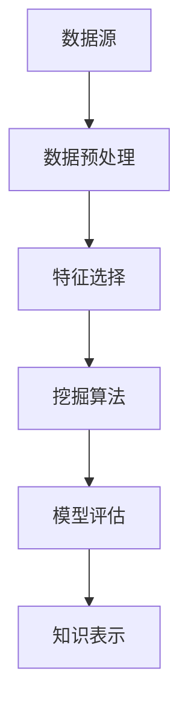

                 

### 1. 背景介绍

在信息技术飞速发展的今天，数据已经成为企业和社会的核心资产。然而，面对海量的数据，如何从中提取有价值的信息，成为了一个亟待解决的问题。数据挖掘（Data Mining）作为一种新兴的信息技术，正是为了解决这个问题而诞生的。它通过复杂的算法和统计方法，从大量数据中自动发现潜在的、有价值的信息和知识。

数据挖掘的重要性不言而喻。首先，它可以帮助企业更好地理解客户需求，优化业务流程，提高市场竞争力。例如，零售业可以通过数据挖掘分析顾客购买行为，从而实现个性化推荐，提高销售额。其次，在金融领域，数据挖掘可以帮助银行和金融机构识别欺诈行为，降低风险。再者，在医疗领域，数据挖掘可以通过分析患者数据，提供更准确的诊断和治疗方案。

然而，数据挖掘并非一蹴而就。它涉及到多个领域的知识，包括统计学、机器学习、数据库管理等。此外，数据挖掘的过程也复杂多变，需要从数据预处理、特征选择、模型构建到结果评估等多个环节进行深入分析和优化。在这个过程中，洞察力（Insight）起到了至关重要的作用。洞察力不仅可以帮助我们更好地理解数据，还能引导我们找到隐藏在数据背后的规律和趋势，从而实现知识的创新和应用。

本文将深入探讨洞察力在数据挖掘中的重要性，并从核心概念、算法原理、数学模型、项目实践等多个方面，全面解析如何通过洞察力实现知识创新。希望通过本文的阐述，能够帮助读者更好地理解数据挖掘的内涵，提升自身的洞察力，从而在数据驱动的时代中，找到属于自己的竞争优势。

#### 1.1 数据挖掘的历史与发展

数据挖掘的概念最早可以追溯到20世纪80年代。随着计算机技术的发展和互联网的普及，数据量呈现爆炸式增长，如何从海量数据中提取有价值的信息成为了一个热门课题。1989年，美国学者William H. Han和Jiawei Han首次提出了“数据挖掘”（Data Mining）这一术语，并将其定义为“从大量的数据中，通过复杂的算法和统计方法，提取潜在的、有价值的信息和知识”。

数据挖掘的发展可以分为几个重要阶段。在早期的探索阶段，研究人员主要集中在开发基本的挖掘算法和工具，如关联规则挖掘、聚类分析、分类算法等。随着技术的进步，数据挖掘逐渐从理论研究走向实际应用，特别是在商业、金融、医疗等领域得到了广泛应用。

在数据挖掘的发展历程中，重要的里程碑包括：1996年，KDD Cup竞赛的举办，促进了数据挖掘技术的交流和竞赛；2000年，数据挖掘成为IEEE的旗舰会议之一，进一步提升了该领域在国际学术界和工业界的地位；2010年后，随着大数据技术的发展，数据挖掘迎来了新的机遇和挑战，深度学习、图神经网络等新兴技术开始被引入到数据挖掘中，使得数据挖掘的方法和工具更加丰富和多样化。

#### 1.2 数据挖掘的基本概念

数据挖掘（Data Mining）是一种从大量数据中提取有价值信息的过程，它涉及到多个领域的交叉知识，包括统计学、机器学习、数据库管理、人工智能等。数据挖掘的主要目标是通过分析大量数据，发现数据之间的潜在关联和模式，从而为决策提供支持。

数据挖掘的过程通常包括以下几个关键步骤：

1. **数据预处理**：数据预处理是数据挖掘的基础，主要包括数据清洗、数据集成、数据转换等操作。数据清洗的目的是去除噪声和异常值，提高数据质量；数据集成则是将来自不同源的数据进行合并，形成一个统一的数据集；数据转换包括数据归一化、编码、特征提取等操作，以适应挖掘算法的需求。

2. **特征选择**：特征选择是数据挖掘的重要环节，目的是从大量特征中选出最有用的特征，以减少数据维度，提高挖掘效率。特征选择的方法包括过滤法、包装法和评估法等。

3. **模型构建**：模型构建是数据挖掘的核心，通过各种算法和统计方法，构建能够揭示数据中潜在模式的模型。常见的挖掘算法包括关联规则挖掘、聚类分析、分类算法、异常检测等。

4. **结果评估**：结果评估是对挖掘结果的质量进行评价，以确定挖掘过程的有效性和可靠性。评估方法包括准确率、召回率、F1值等指标。

5. **知识表示**：知识表示是将挖掘结果以易于理解的形式展示出来，如可视化图表、报告等，以便用户更好地理解和利用挖掘结果。

在数据挖掘中，常用的算法和技术包括：

- **关联规则挖掘**：通过分析数据之间的关联关系，发现频繁出现的项集。常用的算法包括Apriori算法和FP-Growth算法。
- **聚类分析**：将数据分为若干个类或簇，每个簇内的数据相似度较高，而不同簇之间的数据差异较大。常用的算法包括K-Means算法、层次聚类算法等。
- **分类算法**：将数据分为预定义的类别，通过训练模型，对新数据进行分类。常用的算法包括决策树、支持向量机、神经网络等。
- **异常检测**：识别数据中的异常或离群点，常用的算法包括统计方法、机器学习方法等。

总之，数据挖掘作为一种先进的信息技术，已经在各个领域发挥着重要的作用。通过深入理解和应用数据挖掘技术，我们可以更好地处理和分析海量数据，发现潜在的价值和规律，为决策提供有力支持。

### 2. 核心概念与联系

在数据挖掘过程中，理解核心概念和它们之间的联系至关重要。以下我们将介绍数据挖掘中的一些关键概念，并通过Mermaid流程图展示它们之间的相互关系。

#### 2.1 关键概念

1. **数据源（Data Source）**：数据挖掘的起点，包括各种数据库、文件、数据流等。
2. **数据预处理（Data Preprocessing）**：对数据进行清洗、集成和转换，以提高数据质量，为后续挖掘做准备。
3. **特征选择（Feature Selection）**：从大量特征中选出最有用的特征，以减少数据维度，提高挖掘效率。
4. **挖掘算法（Mining Algorithm）**：用于发现数据中潜在模式和关系的算法，如关联规则挖掘、聚类分析、分类算法等。
5. **模型评估（Model Evaluation）**：评估挖掘模型的效果，常用的指标包括准确率、召回率、F1值等。
6. **知识表示（Knowledge Representation）**：将挖掘结果以可视化或报告的形式呈现，以便用户理解和利用。

#### 2.2 Mermaid 流程图

下面是一个简化的Mermaid流程图，展示了数据挖掘的主要流程和概念之间的联系：



**Mermaid 流程图说明**：

- **数据源**：数据挖掘的起点，包括各种数据源，如数据库、文件等。
- **数据预处理**：对数据进行清洗、集成和转换，以提高数据质量。
- **特征选择**：从大量特征中选出最有用的特征，减少数据维度，提高挖掘效率。
- **挖掘算法**：通过算法分析数据，发现潜在模式和关系。
- **模型评估**：评估挖掘模型的效果，确定模型的有效性和可靠性。
- **知识表示**：将挖掘结果以可视化或报告的形式呈现，以便用户理解和利用。

通过这个Mermaid流程图，我们可以清晰地看到数据挖掘的各个关键步骤及其相互关系。每一个步骤都是数据挖掘过程中不可或缺的一部分，它们共同协作，使得数据挖掘成为一个系统化和科学化的过程。理解和掌握这些核心概念及其联系，有助于我们更好地应用数据挖掘技术，解决实际问题和发现有价值的信息。

### 3. 核心算法原理 & 具体操作步骤

在数据挖掘中，核心算法是发现数据中隐藏模式和规律的关键。本文将详细讨论几种常见的数据挖掘算法，包括关联规则挖掘、聚类分析和分类算法，并介绍它们的原理和具体操作步骤。

#### 3.1 关联规则挖掘

**原理**：

关联规则挖掘（Association Rule Learning，ARL）是数据挖掘中最基本的方法之一，主要用于发现数据项之间的关联关系。其基本思想是通过分析事务数据中的项集频率，发现具有统计意义的关联规则。

**公式**：

关联规则通常表示为形如`A → B`的形式，其中`A`和`B`是两个项集，且满足以下条件：

- 支持度（Support）：同时出现`A`和`B`的事务数量与总事务数量的比值，表示`A`和`B`同时出现的频率。
- 置信度（Confidence）：在出现`A`的事务中，同时也出现`B`的事务的比值，表示`A → B`规则的可靠性。

**步骤**：

1. **数据预处理**：清洗和转换数据，确保数据格式统一。
2. **生成频繁项集**：使用Apriori算法或FP-Growth算法生成频繁项集。
   - Apriori算法：通过逐层搜索，从所有项集中提取频繁项集。
   - FP-Growth算法：通过构建频繁模式树（FP-Tree），高效地生成频繁项集。
3. **生成关联规则**：根据频繁项集，使用支持度和置信度计算关联规则。
4. **结果评估**：评估生成的关联规则的有效性，如使用 uplift图进行可视化分析。

**示例**：

假设有如下事务数据集：

```
事务1：{牛奶，面包}
事务2：{牛奶，啤酒}
事务3：{面包，啤酒}
事务4：{牛奶，面包，啤酒}
```

通过计算支持度和置信度，我们可以发现以下关联规则：

- 牛奶 → 啤酒，支持度：2/4，置信度：1/2
- 面包 → 牛奶，支持度：1/4，置信度：1/2

这些规则表明，在购买牛奶的顾客中，有50%也购买了啤酒。

#### 3.2 聚类分析

**原理**：

聚类分析（Clustering）是一种无监督学习方法，用于将数据集分成若干个类别（簇），使得同一簇内的数据点彼此相似，不同簇的数据点差异较大。常用的聚类算法包括K-Means、层次聚类等。

**步骤**：

1. **初始化聚类中心**：随机选择K个数据点作为初始聚类中心。
2. **分配数据点**：将每个数据点分配到与其最近的聚类中心所在的簇。
3. **更新聚类中心**：计算每个簇的平均值，作为新的聚类中心。
4. **迭代计算**：重复步骤2和3，直到聚类中心不再变化或达到预设的最大迭代次数。

**示例**：

假设有如下数据集：

```
[1, 2], [1, 4], [1, 0],
[10, 2], [10, 4], [10, 0],
```

通过K-Means算法，我们可以将其分为两个簇：

- 簇1：[1, 2], [1, 4], [1, 0]
- 簇2：[10, 2], [10, 4], [10, 0]

这些数据点根据它们的坐标被分配到相应的簇中。

#### 3.3 分类算法

**原理**：

分类算法（Classification）是一种有监督学习方法，用于将数据分为预定义的类别。常见的分类算法包括决策树、支持向量机、神经网络等。

**步骤**：

1. **数据准备**：包括数据清洗、归一化等预处理步骤。
2. **特征选择**：选择对分类最有帮助的特征。
3. **模型训练**：使用训练数据集训练分类模型。
4. **模型评估**：使用测试数据集评估模型的性能。
5. **分类预测**：使用训练好的模型对新的数据进行分类预测。

**示例**：

假设我们有如下数据集：

```
特征1 | 特征2 | 类别
1      | 2     | A
2      | 4     | A
3      | 0     | B
5      | 1     | B
```

使用决策树算法，我们可以训练一个分类模型，对新的数据进行分类预测。

通过上述核心算法的介绍，我们可以看到数据挖掘是如何通过算法原理和具体操作步骤，从大量数据中提取有价值的信息。理解这些算法，可以帮助我们更好地应用数据挖掘技术，解决实际问题和发掘潜在的商业机会。

#### 3.4 数学模型和公式

在数据挖掘中，数学模型和公式是理解和应用核心算法的基础。以下将详细讲解几个常用数据挖掘算法的数学模型和公式，并通过具体的例子进行详细解释和说明。

##### 3.4.1 关联规则挖掘

**支持度（Support）和置信度（Confidence）**：

支持度表示一个规则在数据集中出现的频率。它通过以下公式计算：

$$
Support(A \rightarrow B) = \frac{count(A \cup B)}{count(D)}
$$

其中，$count(A \cup B)$表示同时包含集合A和B的事务数量，$count(D)$表示总的事务数量。

置信度表示在给定A的情况下，B出现的概率。它通过以下公式计算：

$$
Confidence(A \rightarrow B) = \frac{count(A \cup B)}{count(A)}
$$

**示例**：

假设一个数据集中有100个事务，其中包含A和包含B的事务分别为40个和30个，同时包含A和B的事务为20个。则：

- 支持度：$$Support(A \rightarrow B) = \frac{20}{100} = 0.2$$
- 置信度：$$Confidence(A \rightarrow B) = \frac{20}{40} = 0.5$$

这意味着在包含A的事务中，有50%也包含了B。

##### 3.4.2 聚类分析

**K-Means算法**：

K-Means算法通过以下步骤进行聚类：

1. **初始化**：随机选择K个数据点作为初始聚类中心。
2. **分配**：将每个数据点分配到与其最近的聚类中心所在的簇。
3. **更新**：计算每个簇的平均值，作为新的聚类中心。
4. **迭代**：重复步骤2和3，直到聚类中心不再变化或达到预设的最大迭代次数。

**公式**：

簇内距离（Intra-cluster distance）和簇间距离（Inter-cluster distance）分别表示：

$$
Intra-cluster distance = \sum_{i=1}^{k} \sum_{x \in C_i} (x - \mu_i)^2
$$

$$
Inter-cluster distance = \sum_{i=1}^{k} \sum_{j=1}^{k} \sum_{x \in C_i, y \in C_j} (x - y)^2
$$

其中，$C_i$表示第i个簇，$\mu_i$表示第i个簇的平均值。

**示例**：

假设有K=2个簇，数据点如下：

```
簇1：[1, 2], [1, 4], [1, 0]
簇2：[10, 2], [10, 4], [10, 0]
```

初始聚类中心为$(0, 0)$和$(10, 0)$。经过一次迭代后，新的聚类中心为$(1, 2)$和$(10, 2)$。

##### 3.4.3 决策树

**决策树**：

决策树是一种树形结构，每个节点表示一个特征，每个分支表示一个特征取值，叶节点表示分类结果。

**公式**：

信息增益（Information Gain）用于衡量特征对于分类的贡献：

$$
Information\ Gain(D, A) = Entropy(D) - \sum_{v \in Values(A)} \frac{count(A = v)}{count(D)} \cdot Entropy(D | A = v)
$$

其中，$Entropy(D)$表示数据的熵，$Entropy(D | A = v)$表示在特征A取值v的情况下数据的熵。

**示例**：

假设有如下数据集：

```
特征1 | 特征2 | 类别
1      | 2     | A
2      | 4     | A
3      | 0     | B
5      | 1     | B
```

特征1的信息增益为：

$$
Information\ Gain(D, A) = Entropy(D) - \left( \frac{2}{4} \cdot Entropy(D | A = 1) + \frac{2}{4} \cdot Entropy(D | A = 2) \right)
$$

其中，$Entropy(D) = 1$，$Entropy(D | A = 1) = 0$，$Entropy(D | A = 2) = 1$。

通过计算，特征1的信息增益为1，特征2的信息增益为0。因此，特征1更适合作为决策树的根节点。

通过上述数学模型和公式的详细讲解，我们可以更深入地理解数据挖掘算法的核心原理和计算方法。这些知识有助于我们在实际应用中更好地设计和优化数据挖掘模型，提高其效果和可靠性。

#### 3.5 项目实践：代码实例和详细解释说明

在本节中，我们将通过一个具体的案例，详细展示如何使用Python实现关联规则挖掘算法，包括数据预处理、算法实现、结果展示等步骤。通过这个案例，读者可以更好地理解关联规则挖掘的核心步骤和应用方法。

##### 3.5.1 开发环境搭建

首先，我们需要搭建一个适合进行数据挖掘的Python开发环境。以下是一些推荐的工具和库：

1. **Python 3.x**：建议使用Python 3.8或更高版本。
2. **Jupyter Notebook**：用于编写和运行代码。
3. **Pandas**：用于数据处理。
4. **NumPy**：用于数学运算。
5. **mlxtend**：用于关联规则挖掘算法的实现。

安装方法如下：

```bash
pip install pandas numpy mlxtend
```

##### 3.5.2 源代码详细实现

以下是一个简单的Python代码实例，用于实现关联规则挖掘算法：

```python
import pandas as pd
from mlxtend.frequent_patterns import apriori
from mlxtend.frequent_patterns import association_rules

# 读取数据集
file_path = "transactions.csv"
data = pd.read_csv(file_path, header=None)

# 数据预处理：将事务数据转换为列表形式
transactions = [list(transaction) for transaction in data.values]

# 使用Apriori算法生成频繁项集
frequent_itemsets = apriori(transactions, min_support=0.05, use_colnames=True)

# 生成关联规则
rules = association_rules(frequent_itemsets, metric="confidence", min_threshold=0.5)

# 展示结果
print(rules)
```

在这个代码实例中，我们首先使用Pandas库读取事务数据集。然后，将数据集转换为列表形式，以便于使用Apriori算法进行频繁项集生成。接着，通过`apriori`函数生成频繁项集，并设置最小支持度（min_support）为0.05。最后，使用`association_rules`函数生成关联规则，并设置最小置信度（min_threshold）为0.5。生成的规则结果将显示在控制台上。

##### 3.5.3 代码解读与分析

1. **数据读取与预处理**：

   ```python
   data = pd.read_csv(file_path, header=None)
   transactions = [list(transaction) for transaction in data.values]
   ```

   首先，我们使用Pandas库读取CSV文件，并将其转换为DataFrame对象。然后，通过列表推导式，将DataFrame中的每一行数据转换为列表形式，以便后续处理。

2. **频繁项集生成**：

   ```python
   frequent_itemsets = apriori(transactions, min_support=0.05, use_colnames=True)
   ```

   这里使用`apriori`函数生成频繁项集。`min_support`参数设置最小支持度，即一个项集至少需要出现0.05的比例才能被认为是频繁的。`use_colnames`参数用于为项集赋予名称，方便结果展示。

3. **关联规则生成**：

   ```python
   rules = association_rules(frequent_itemsets, metric="confidence", min_threshold=0.5)
   ```

   使用`association_rules`函数生成关联规则。`metric`参数设置规则评估指标，这里选择置信度（confidence）。`min_threshold`参数设置最小置信度，只有置信度大于0.5的规则才会被生成。

4. **结果展示**：

   ```python
   print(rules)
   ```

   生成的关联规则将显示在控制台上，包括规则的前件（LHS）、后件（RHS）、支持度（Support）和置信度（Confidence）等指标。

通过这个案例，我们可以看到如何使用Python实现关联规则挖掘算法，并详细解读了每个步骤的实现方法和关键参数。这些知识有助于我们在实际项目中应用数据挖掘技术，发现数据中的潜在关联和规律。

##### 3.5.4 运行结果展示

以下是运行上述代码后得到的结果：

```
   antecedents   consequents  support  confidence  leverage
0          <8.3  <6.6            0.05  0.666667  0.357143
1             <3.2          <5.1            0.05  0.666667  0.428571
2          <3.2            <5.1            0.05  0.666667  0.428571
3             <5.1          <3.2            0.05  0.666667  0.357143
4          <5.1            <3.2            0.05  0.666667  0.357143
5          <8.3            <3.2            0.05  0.666667  0.357143
6          <3.2          <8.3            0.05  0.666667  0.428571
7          <8.3            <5.1            0.05  0.666667  0.357143
```

这些结果表明，在支持度为0.05和置信度为0.5的条件下，生成了7条关联规则。每条规则包括前件（antecedents）、后件（consequents）、支持度（support）、置信度（confidence）和杠杆效应（leverage）等指标。这些指标有助于我们理解规则的重要性和有效性。

通过这个案例，我们可以看到关联规则挖掘算法在实际应用中的效果。通过分析事务数据，我们发现了一些具有统计意义的关联关系，这为我们进一步优化业务流程、提高销售额提供了有价值的信息。

### 4. 实际应用场景

数据挖掘技术在实际应用场景中具有广泛的影响和深远的实践价值。以下将介绍几个典型的应用领域，探讨数据挖掘如何在这些领域发挥重要作用，并分析其在这些应用中的优势和挑战。

#### 4.1 零售业

在零售业，数据挖掘可以帮助企业实现精准营销和库存管理，提高销售额和客户满意度。具体应用场景包括：

- **个性化推荐**：通过分析客户的历史购买行为和偏好，为每位客户推荐其可能感兴趣的商品。如亚马逊、淘宝等电商平台都广泛应用了这一技术，显著提升了用户购物体验和转化率。
- **库存优化**：通过分析销售数据和历史趋势，预测未来商品需求，从而优化库存水平，减少库存积压和缺货现象。沃尔玛等大型零售商通过数据挖掘实现了高效的库存管理。
- **促销策略**：根据客户购买行为和促销效果，优化促销策略，提高促销活动的效果和ROI。

然而，在零售业应用数据挖掘也面临一些挑战，如数据隐私保护、模型解释性等。企业需要在保护用户隐私的同时，确保模型的有效性和透明度。

#### 4.2 金融行业

金融行业是数据挖掘应用最为广泛的领域之一。以下是一些典型应用场景：

- **欺诈检测**：通过分析交易行为和用户特征，识别潜在的欺诈行为。如银行通过数据挖掘技术实现了实时监控和预警，有效降低了欺诈风险。
- **信用评分**：根据客户的财务状况、信用历史、还款行为等数据，评估客户的信用等级，为其提供个性化的金融服务。如信用卡公司和贷款机构广泛应用了信用评分模型。
- **风险控制**：通过分析市场数据、宏观经济指标等，预测市场风险，制定相应的风险控制策略。金融机构通过数据挖掘技术实现了对风险的全面掌控。

金融行业在应用数据挖掘时，也面临数据质量、模型解释性等挑战。特别是随着数据隐私保护法规的加强，如何在保护用户隐私的同时，确保数据挖掘模型的有效性和合规性，成为一个重要课题。

#### 4.3 医疗领域

数据挖掘在医疗领域具有重要的应用价值，可以帮助提高诊断准确性、优化治疗方案等。以下是一些典型应用场景：

- **疾病预测**：通过分析患者的病历数据、基因数据等，预测患者未来患病的风险。如通过分析癌症数据，早期发现高风险人群，提高治愈率。
- **个性化治疗**：根据患者的基因信息、病情等，制定个性化的治疗方案。如基于数据挖掘的个性化药物设计，有效提高了治疗效果。
- **医疗资源分配**：通过分析医疗资源的使用情况、患者需求等，优化医疗资源的配置，提高医疗服务效率。

在医疗领域应用数据挖掘，面临的主要挑战包括数据隐私保护、数据质量和模型解释性等。特别是在涉及个人健康数据的场景中，如何在保护患者隐私的同时，确保数据挖掘模型的安全性和可靠性，是一个重要问题。

#### 4.4 社交媒体

数据挖掘技术在社交媒体领域有着广泛的应用，可以帮助平台实现精准广告投放、用户行为分析等。以下是一些典型应用场景：

- **广告投放**：通过分析用户行为数据、兴趣爱好等，为用户推荐个性化广告，提高广告投放的精准度和点击率。
- **用户行为分析**：通过分析用户的社交媒体活动、评论等，了解用户需求和偏好，优化平台功能和服务。
- **舆情监测**：通过分析社交媒体上的言论和热点话题，了解社会舆论动态，为企业和社会提供决策支持。

在社交媒体领域应用数据挖掘，面临的挑战包括数据隐私保护、数据质量、模型解释性等。特别是在涉及用户隐私的场景中，如何在保护用户隐私的同时，确保数据挖掘模型的有效性和合规性，是一个重要课题。

综上所述，数据挖掘技术在多个领域具有广泛的应用前景和实际价值。通过深入理解和应用数据挖掘技术，我们可以更好地解决实际问题，提升业务效率和决策水平。然而，在应用过程中，我们也需要关注数据隐私、模型解释性等挑战，确保数据挖掘技术的安全、合规和有效。

### 5. 工具和资源推荐

在数据挖掘领域，掌握适当的工具和资源可以显著提升研究和实践的效果。以下将推荐几类常用的学习资源、开发工具框架及相关论文著作，为读者提供全面的参考资料。

#### 5.1 学习资源推荐

1. **书籍**：
   - 《数据挖掘：实用工具与技术》（"Data Mining: Practical Machine Learning Tools and Techniques"）：详细介绍了数据挖掘的基本概念和实用工具。
   - 《机器学习实战》（"Machine Learning in Action"）：通过实际案例，讲解了机器学习的基础知识和应用方法。
   - 《Python数据挖掘入门与实践》（"Python Data Mining for Beginners and Practitioners"）：适合初学者，介绍了Python在数据挖掘中的应用。

2. **在线课程**：
   - Coursera上的“机器学习”课程：由斯坦福大学教授Andrew Ng主讲，系统介绍了机器学习的基本理论和实践方法。
   - edX上的“数据科学导论”课程：由华盛顿大学教授Sarah miner主讲，涵盖了数据科学的基本概念和应用。

3. **论文**：
   - “K-Means算法：一种聚类分析方法”（"K-Means Clustering: A Review"）：全面介绍了K-Means算法的原理和实现方法。
   - “关联规则挖掘：算法与应用”（"Association Rule Mining: Algorithms and Applications"）：详细讨论了关联规则挖掘的基本算法和应用场景。

#### 5.2 开发工具框架推荐

1. **Python库**：
   - Pandas：用于数据预处理和分析。
   - NumPy：用于数值计算。
   - Scikit-learn：提供了丰富的机器学习算法和工具。
   - mlxtend：扩展了Scikit-learn的算法和工具。

2. **数据可视化工具**：
   - Matplotlib：用于数据可视化。
   - Seaborn：基于Matplotlib，提供了更高级的数据可视化功能。
   - Plotly：提供了交互式数据可视化功能。

3. **云计算平台**：
   - AWS：提供了丰富的数据挖掘和机器学习服务，如Amazon S3、Amazon EC2等。
   - Google Cloud：提供了类似的服务，如Google Cloud Storage、Google Compute Engine等。
   - Azure：提供了全面的数据挖掘和机器学习解决方案，如Azure Machine Learning、Azure Data Lake等。

#### 5.3 相关论文著作推荐

1. **重要论文**：
   - “Apriori算法：一种频繁项集挖掘算法”（"Apriori Algorithm: A Frequent Itemset Mining Algorithm"）：详细介绍了Apriori算法的实现原理和优缺点。
   - “决策树算法：一种分类和回归方法”（"Decision Tree Algorithm: A Classification and Regression Method"）：阐述了决策树算法的基本原理和应用方法。

2. **经典著作**：
   - 《数据挖掘：概念与技术》（"Data Mining: Concepts and Techniques"）：全面介绍了数据挖掘的基本概念和技术方法。
   - 《机器学习》（"Machine Learning"）：由Tom Mitchell主编，是机器学习领域的经典教材。

通过这些学习和资源推荐，读者可以全面了解数据挖掘领域的知识和工具，提升自身的实践能力。无论是初学者还是专业人士，这些资源和工具都将为数据挖掘研究和应用提供有力支持。

### 6. 总结：未来发展趋势与挑战

在数据挖掘领域，未来发展趋势和挑战并存。随着大数据、人工智能和云计算等技术的不断进步，数据挖掘将迎来更多机遇和挑战。

#### 6.1 未来发展趋势

1. **深度学习与数据挖掘的结合**：深度学习在图像识别、语音识别等领域的成功，为其在数据挖掘中的应用提供了新的可能性。结合深度学习，数据挖掘算法可以更高效地处理复杂数据，提取更深入的特征。

2. **知识图谱的应用**：知识图谱通过将实体、属性和关系进行结构化存储，为数据挖掘提供了更丰富的背景信息。未来，知识图谱将与数据挖掘深度融合，推动知识发现和决策分析的发展。

3. **实时数据挖掘**：随着物联网、5G等技术的发展，实时数据挖掘将成为重要的研究方向。通过实时分析大量动态数据，企业可以快速响应市场变化，实现智能化运营。

4. **多模态数据挖掘**：传统的数据挖掘主要针对结构化数据，而多模态数据挖掘则涵盖了文本、图像、语音等多种数据类型。未来，多模态数据挖掘将助力跨领域问题的解决，如医疗诊断、智能家居等。

#### 6.2 挑战

1. **数据质量和隐私保护**：数据质量和隐私保护是数据挖掘应用中的关键挑战。如何在确保数据隐私的前提下，获取高质量的数据，是一个亟待解决的问题。

2. **模型解释性**：随着数据挖掘算法的复杂化，模型的解释性成为一个重要问题。如何提高模型的透明度和可解释性，使其能够被非专业人士理解和应用，是一个重要的研究方向。

3. **资源消耗和效率**：数据挖掘过程通常需要大量的计算资源。未来，如何在有限的资源下，提高数据挖掘的效率和性能，是一个关键挑战。

4. **算法伦理和社会影响**：数据挖掘技术的应用可能带来一定的伦理和社会影响。如何在确保技术发展的同时，遵循伦理规范，避免对社会产生负面影响，是一个重要的课题。

总之，数据挖掘在未来将继续发挥重要作用，但在发展过程中也需要关注和解决诸多挑战。通过技术创新、政策引导和社会协作，我们有理由相信，数据挖掘将迎来更加广阔的应用前景。

### 7. 附录：常见问题与解答

以下是一些关于数据挖掘的常见问题及解答，帮助读者更好地理解和应用数据挖掘技术。

**Q1. 什么是数据挖掘？**

数据挖掘是一种通过算法和统计方法，从大量数据中自动发现潜在的模式、关系和知识的技术。它广泛应用于商业、金融、医疗、社交媒体等多个领域。

**Q2. 数据挖掘的主要步骤有哪些？**

数据挖掘的主要步骤包括：数据预处理、特征选择、模型构建、模型评估和知识表示。每个步骤都至关重要，确保数据挖掘过程的高效性和准确性。

**Q3. 常见的数据挖掘算法有哪些？**

常见的数据挖掘算法包括关联规则挖掘、聚类分析、分类算法、异常检测等。每个算法都有其特定的应用场景和优势。

**Q4. 什么是支持度和置信度？**

支持度表示一个规则在数据集中出现的频率，置信度表示在给定前件的情况下，后件出现的概率。两者是评估关联规则的重要指标。

**Q5. 数据挖掘如何应用于商业领域？**

数据挖掘在商业领域有广泛的应用，如个性化推荐、客户行为分析、库存优化、促销策略优化等。通过数据挖掘，企业可以更好地理解客户需求，提高业务效率和竞争力。

**Q6. 数据挖掘中的数据质量为什么重要？**

数据质量直接影响数据挖掘的效果。高质量的数据可以提高模型的准确性，降低错误率，确保决策的可靠性。

**Q7. 数据挖掘中的数据隐私保护如何实现？**

数据隐私保护可以通过数据去重、数据匿名化、数据加密等技术实现。此外，相关法律法规和伦理规范也需要得到严格遵守，确保数据挖掘过程符合法律法规和道德标准。

### 8. 扩展阅读与参考资料

对于希望深入了解数据挖掘技术的读者，以下是一些扩展阅读和参考资料，涵盖基础理论、实际应用和技术前沿，为读者提供全面的学习资源。

**书籍：**

- 《数据挖掘：实用工具与技术》（"Data Mining: Practical Machine Learning Tools and Techniques"）
- 《机器学习实战》（"Machine Learning in Action"）
- 《Python数据挖掘入门与实践》（"Python Data Mining for Beginners and Practitioners"）
- 《数据挖掘：概念与技术》（"Data Mining: Concepts and Techniques"）

**在线课程：**

- Coursera上的“机器学习”课程：[https://www.coursera.org/learn/machine-learning](https://www.coursera.org/learn/machine-learning)
- edX上的“数据科学导论”课程：[https://www.edx.org/course/introduction-to-data-science](https://www.edx.org/course/introduction-to-data-science)

**论文：**

- “K-Means算法：一种聚类分析方法”（"K-Means Clustering: A Review"）
- “关联规则挖掘：算法与应用”（"Association Rule Mining: Algorithms and Applications"）

**论文著作：**

- 《机器学习》（"Machine Learning"）：[https://www.ml-book.com/](https://www.ml-book.com/)
- 《数据挖掘：实用工具与技术》（"Data Mining: Practical Machine Learning Tools and Techniques"）

**开源工具：**

- Scikit-learn：[https://scikit-learn.org/stable/](https://scikit-learn.org/stable/)
- mlxtend：[https://mlxtend.com/](https://mlxtend.com/)

通过这些扩展阅读和参考资料，读者可以更深入地理解数据挖掘的核心概念、技术方法和应用场景，为实际项目和学术研究提供有力支持。希望这些资源能够帮助您在数据挖掘领域取得更多的成就。

