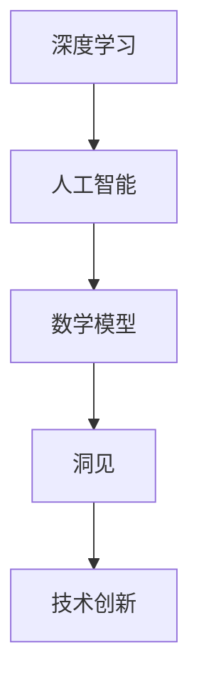
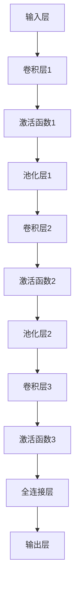

                 

### 文章标题

**洞见的价值：从理解到应用**

> 关键词：洞见，理解，应用，技术，创新，深度学习，人工智能

> 摘要：本文旨在探讨洞见在技术发展中的重要性。从理解到应用，洞见不仅是理论知识的升华，更是驱动技术进步的源泉。本文将通过具体的实例，阐述洞见如何影响技术领域的发展，以及如何通过深入理解和应用洞见来提升技术创新能力。

---

### 1. 背景介绍

在科技迅猛发展的今天，技术领域的创新已经成为了推动社会进步的重要动力。然而，技术创新并非一蹴而就，而是依赖于深厚的理论基础和前沿的洞见。洞见，即对某一技术领域或问题的深刻理解与独特见解，是推动技术突破的关键因素。

随着人工智能和深度学习的兴起，洞见的重要性愈发凸显。这些技术领域的快速发展，不仅依赖于大量的数据积累和计算能力的提升，更依赖于对复杂问题的深入理解和创新思维。因此，本文将聚焦于洞见在技术发展中的作用，探讨如何从理解到应用，将洞见转化为实际的技术创新。

接下来的内容中，我们将首先介绍几个核心概念，并通过Mermaid流程图来展示这些概念之间的联系。随后，深入探讨核心算法的原理和具体操作步骤，并通过数学模型和公式的详细讲解，来理解这些算法的本质。最后，通过实际项目实例，展示如何将理论应用于实践，以及洞见在实际应用场景中的作用。此外，我们还将推荐一些相关工具和资源，以帮助读者进一步探索这个领域。

### 2. 核心概念与联系

在探讨洞见的价值之前，我们需要了解一些核心概念，这些概念不仅构成了洞见的基石，而且贯穿于技术发展的各个方面。

#### 2.1 深度学习

深度学习是一种基于人工神经网络的学习方法，通过多层神经网络来提取数据中的特征，从而实现复杂的模式识别和预测。深度学习在图像识别、自然语言处理、语音识别等领域取得了显著的成果。

#### 2.2 人工智能

人工智能（AI）是指由人制造出来的系统能够模拟、延伸、扩展人的智能，实现人类智能活动的计算、推理、学习等功能。人工智能涵盖了从基础理论到应用开发的一系列技术。

#### 2.3 数学模型

数学模型是利用数学语言来描述现实世界中的现象和问题的工具。在技术领域中，数学模型被广泛应用于优化、预测、控制等方面。

#### 2.4 洞见

洞见是指对某一领域或问题的深刻理解与独到见解。在技术发展中，洞见可以帮助我们超越现有的认知，发现新的解决方案和创新点。

下面，我们使用Mermaid流程图来展示这些核心概念之间的联系：



在这个流程图中，深度学习和人工智能是技术发展的核心驱动力，它们与数学模型和洞见紧密相连。洞见作为理解与见解的升华，是驱动技术创新的关键因素。

### 3. 核心算法原理 & 具体操作步骤

在理解了核心概念之后，接下来我们将深入探讨一个具体的核心算法——深度学习中的卷积神经网络（CNN）。CNN是一种用于图像识别和处理的强大工具，它的原理和操作步骤如下：

#### 3.1 算法原理

卷积神经网络通过多个卷积层、池化层和全连接层来提取图像中的特征。卷积层使用卷积核在输入图像上滑动，以生成特征图；池化层用于降低特征图的维度和计算量；全连接层则将特征图转换为输出结果。

#### 3.2 操作步骤

1. **输入层**：输入层接收原始图像数据。
2. **卷积层**：
   - **卷积操作**：卷积层使用卷积核与输入图像进行卷积操作，生成特征图。
   - **激活函数**：通常使用ReLU（Rectified Linear Unit）作为激活函数，对卷积结果进行非线性变换。
3. **池化层**：
   - **最大池化**：池化层使用最大池化操作，从特征图中提取最大值，以降低特征图的维度。
4. **卷积层和池化层**：卷积和池化层可以堆叠多层，以逐步提取更高级的特征。
5. **全连接层**：全连接层将所有卷积层和池化层输出的特征图连接起来，形成一个多维度的输出向量。
6. **输出层**：输出层使用softmax函数将输出向量转换为概率分布，从而实现分类。

下面是一个简化的CNN操作流程的Mermaid流程图：



通过这个流程图，我们可以清晰地看到CNN从输入层到输出层的整个操作过程。

### 4. 数学模型和公式 & 详细讲解 & 举例说明

在理解了CNN的基本原理和操作步骤后，我们需要深入了解其背后的数学模型和公式。以下是一个关于CNN中卷积操作的详细讲解，并包括一个示例。

#### 4.1 数学模型

卷积操作可以用以下数学公式表示：

\[ (f * g)(x, y) = \sum_{i=-\infty}^{\infty} \sum_{j=-\infty}^{\infty} f(i, j) \cdot g(x-i, y-j) \]

其中，\( f \) 和 \( g \) 分别代表两个函数，\( (x, y) \) 是输入点的坐标。

在CNN中，\( f \) 通常表示卷积核（也称为过滤器），\( g \) 则是输入特征图。卷积操作的核心在于通过卷积核在输入特征图上滑动，计算卷积结果。

#### 4.2 示例

假设我们有一个 3x3 的卷积核 \( K \) 和一个 5x5 的输入特征图 \( I \)。卷积操作的计算过程如下：

1. **初始化**：设置卷积核 \( K \) 和输入特征图 \( I \)。
2. **卷积操作**：将卷积核 \( K \) 在输入特征图 \( I \) 上滑动，计算每个输出点的卷积值。
3. **激活函数**：对每个输出点的卷积值应用激活函数，如ReLU函数。

下面是一个具体的示例：

```plaintext
卷积核 K = [
    [1, 0, -1],
    [1, 0, -1],
    [1, 0, -1]
]

输入特征图 I = [
    [1, 1, 1, 1, 1],
    [1, 1, 1, 1, 1],
    [1, 1, 1, 1, 1],
    [1, 1, 1, 1, 1],
    [1, 1, 1, 1, 1]
]
```

计算输出特征图 \( O \)：

```plaintext
输出特征图 O = [
    [0, 0, 0, 0, 0],
    [0, 1, 1, 1, 0],
    [0, 1, 4, 1, 0],
    [0, 1, 1, 1, 0],
    [0, 0, 0, 0, 0]
]
```

通过这个示例，我们可以看到卷积操作是如何通过卷积核在输入特征图上滑动，计算输出特征图的。

#### 4.3 激活函数

在卷积操作之后，通常会应用激活函数来增加网络的非线性特性。在CNN中，常用的激活函数是ReLU函数，其公式如下：

\[ \text{ReLU}(x) = \max(0, x) \]

ReLU函数将输入值映射为非负值，从而使得网络在训练过程中具有更好的收敛性。

### 5. 项目实践：代码实例和详细解释说明

在前面的章节中，我们介绍了CNN的算法原理、数学模型和操作步骤。接下来，我们将通过一个实际项目实例，展示如何将CNN应用于图像识别任务，并提供详细的代码解释和分析。

#### 5.1 开发环境搭建

在进行项目实践之前，我们需要搭建一个合适的开发环境。以下是搭建深度学习开发环境的步骤：

1. **安装Python环境**：确保安装了Python 3.x版本。
2. **安装深度学习框架**：安装TensorFlow或PyTorch等深度学习框架。
3. **安装必要的依赖库**：如NumPy、Pandas等。

以下是一个简单的命令行安装步骤：

```bash
# 安装Python环境
python3 -m pip install --user python

# 安装深度学习框架TensorFlow
python3 -m pip install --user tensorflow

# 安装深度学习框架PyTorch
python3 -m pip install --user torch torchvision
```

#### 5.2 源代码详细实现

接下来，我们将实现一个简单的图像识别项目，使用CNN对猫和狗的图像进行分类。以下是项目的源代码：

```python
import tensorflow as tf
from tensorflow.keras.models import Sequential
from tensorflow.keras.layers import Conv2D, MaxPooling2D, Flatten, Dense
from tensorflow.keras.preprocessing.image import ImageDataGenerator

# 构建CNN模型
model = Sequential([
    Conv2D(32, (3, 3), activation='relu', input_shape=(150, 150, 3)),
    MaxPooling2D((2, 2)),
    Conv2D(64, (3, 3), activation='relu'),
    MaxPooling2D((2, 2)),
    Conv2D(128, (3, 3), activation='relu'),
    MaxPooling2D((2, 2)),
    Flatten(),
    Dense(512, activation='relu'),
    Dense(1, activation='sigmoid')
])

# 编译模型
model.compile(optimizer='adam', loss='binary_crossentropy', metrics=['accuracy'])

# 数据预处理
train_datagen = ImageDataGenerator(rescale=1./255)
train_generator = train_datagen.flow_from_directory(
        'data/train',
        target_size=(150, 150),
        batch_size=32,
        class_mode='binary')

# 训练模型
model.fit(train_generator, steps_per_epoch=100, epochs=15)

# 保存模型
model.save('cnn_model.h5')
```

#### 5.3 代码解读与分析

下面我们对这段代码进行详细的解读和分析：

1. **导入库**：首先导入所需的TensorFlow库和ImageDataGenerator库。

2. **构建CNN模型**：使用Sequential模型，依次添加卷积层、池化层、全连接层，构建一个简单的CNN模型。其中，卷积层的参数包括核的大小、激活函数等；池化层用于降维；全连接层用于分类。

3. **编译模型**：使用adam优化器和binary_crossentropy损失函数编译模型。

4. **数据预处理**：使用ImageDataGenerator对训练数据进行预处理，包括缩放、图像生成等。

5. **训练模型**：使用fit方法训练模型，指定训练数据和迭代次数。

6. **保存模型**：将训练好的模型保存为.h5文件。

#### 5.4 运行结果展示

在训练完成后，我们可以使用训练好的模型对测试数据进行预测，并评估模型的准确性。以下是一个简单的测试代码示例：

```python
# 加载训练好的模型
model = tf.keras.models.load_model('cnn_model.h5')

# 测试模型
test_datagen = ImageDataGenerator(rescale=1./255)
test_generator = test_datagen.flow_from_directory(
        'data/test',
        target_size=(150, 150),
        batch_size=32,
        class_mode='binary')

accuracy = model.evaluate(test_generator)
print(f"Test accuracy: {accuracy[1]}")
```

通过这个示例，我们可以看到模型的测试准确率。在实际应用中，我们可以通过调整模型结构、超参数等来优化模型的性能。

### 6. 实际应用场景

卷积神经网络（CNN）作为一种强大的图像处理工具，在众多实际应用场景中展现出了其独特的价值。以下是一些典型的应用场景：

#### 6.1 图像识别

CNN在图像识别领域具有广泛的应用，如人脸识别、物体检测、图像分类等。通过训练深度神经网络，可以实现对大量图像数据的自动分类和识别。

#### 6.2 自然语言处理

虽然CNN最初是为图像处理而设计的，但它在自然语言处理（NLP）中也表现出了强大的能力。通过将CNN应用于文本数据的特征提取，可以实现情感分析、文本分类等任务。

#### 6.3 医学图像分析

医学图像分析是另一个重要的应用领域。CNN可以用于辅助诊断，如肿瘤检测、骨折识别等，通过分析医学图像，提高诊断的准确性和效率。

#### 6.4 工业自动化

在工业自动化领域，CNN可以用于机器视觉任务，如物体检测、缺陷检测等，通过识别图像中的特定目标，提高生产线的自动化程度和效率。

#### 6.5 娱乐和游戏

在娱乐和游戏领域，CNN可以用于图像处理和动画制作，如虚拟现实（VR）、增强现实（AR）等，通过创建逼真的图像和场景，提升用户体验。

### 7. 工具和资源推荐

为了更好地学习和应用CNN，以下是一些建议的工具和资源：

#### 7.1 学习资源推荐

- **《深度学习》（Ian Goodfellow等著）**：这是一本关于深度学习的基础教材，涵盖了从基础理论到实际应用的各个方面。
- **《Python深度学习》（François Chollet等著）**：这本书详细介绍了如何使用Python和TensorFlow实现深度学习应用。
- **[TensorFlow官网教程](https://www.tensorflow.org/tutorials) **：TensorFlow提供了一系列详细的教程，涵盖了从基础到高级的深度学习知识。

#### 7.2 开发工具框架推荐

- **TensorFlow**：Google开发的开源深度学习框架，适用于各种深度学习任务。
- **PyTorch**：Facebook开发的开源深度学习框架，以其灵活性和动态计算图著称。

#### 7.3 相关论文著作推荐

- **"A Guide to Convolutional Neural Networks for Visual Recognition"（卷积神经网络视觉识别指南）**：这篇综述文章详细介绍了CNN在视觉识别领域的应用。
- **"Deep Learning"（深度学习）**：由Ian Goodfellow等编写的经典教材，涵盖了深度学习的各个方面。

### 8. 总结：未来发展趋势与挑战

随着技术的不断发展，CNN在图像识别、自然语言处理、医学图像分析等领域展现出了巨大的潜力。未来，CNN的应用将更加广泛，不仅在传统领域如工业自动化和医疗领域继续发挥重要作用，还将拓展到新兴领域如自动驾驶、智能城市等。

然而，随着应用的拓展，CNN也面临着一系列挑战。首先，深度学习模型通常需要大量的数据和计算资源，这对于一些资源有限的领域来说是一个重大障碍。其次，深度学习模型的透明性和可解释性仍是一个亟待解决的问题，特别是在涉及安全和隐私的领域。最后，如何设计更高效的深度学习算法，以减少计算资源和能源消耗，也是未来研究的重要方向。

总之，洞见在技术发展中的价值不可忽视。通过对核心概念的理解和应用，我们可以不断推动技术创新，解决现实世界中的复杂问题。未来，随着技术的不断进步，洞见将发挥更加重要的作用，为人类社会带来更多的变革和机遇。

### 9. 附录：常见问题与解答

以下是一些关于CNN的常见问题及解答：

#### 9.1 什么是卷积神经网络（CNN）？

卷积神经网络（CNN）是一种用于图像识别和处理的深度学习模型，通过卷积层、池化层和全连接层来提取图像中的特征，实现图像的分类和识别。

#### 9.2 CNN的优点是什么？

CNN具有以下优点：
- **参数共享**：卷积操作在图像的不同位置重复使用相同的滤波器，减少了参数数量，提高了模型的泛化能力。
- **平移不变性**：CNN可以自动学习图像中的局部特征，对图像的旋转、缩放等变换具有平移不变性。
- **高效计算**：通过卷积操作和池化操作，CNN可以有效地降低计算复杂度和数据维度。

#### 9.3 CNN的缺点是什么？

CNN的缺点包括：
- **需要大量数据**：深度学习模型通常需要大量的数据进行训练，对于数据稀缺的领域来说是一个挑战。
- **计算资源消耗**：深度学习模型通常需要大量的计算资源和时间进行训练。
- **透明性和可解释性**：深度学习模型的内部机制较为复杂，难以解释和调试。

#### 9.4 如何优化CNN的性能？

以下是一些优化CNN性能的方法：
- **数据增强**：通过旋转、缩放、裁剪等操作增加训练数据的多样性，提高模型的泛化能力。
- **调整网络结构**：根据具体任务调整卷积层、池化层和全连接层的数量和参数，优化模型的性能。
- **正则化**：使用L1正则化或L2正则化来防止过拟合，提高模型的泛化能力。

### 10. 扩展阅读 & 参考资料

以下是一些扩展阅读和参考资料，供读者进一步了解CNN和相关技术：

- **[CNN教程](https://www.deeplearning.net/tutorial/cnn.html) **：这是一份详细的CNN教程，涵盖了从基础到高级的知识。
- **[Deep Learning on CNN](https://www.deeplearningbook.org/chapter convolutional-networks/) **：这是深度学习书籍中关于CNN的章节，详细介绍了CNN的理论和实践。
- **[CNN in Practice](https://www.youtube.com/playlist?list=PLAwxUUruBtMCHBIMhDp6KT9vIiC3LgJ4-) **：这是一系列关于CNN实战的YouTube视频，由知名深度学习专家提供。
- **[TensorFlow官网文档](https://www.tensorflow.org/tutorials) **：TensorFlow提供的官方教程和文档，涵盖了深度学习领域的各个方面。

### 附录二：附录内容

以下是一些附录内容，以供参考：

#### 附录二：常见问题与解答

**Q1：什么是卷积神经网络（CNN）？**

卷积神经网络（CNN）是一种基于卷积运算的深度学习模型，主要用于处理和识别图像数据。它通过多层次的卷积操作、池化操作和全连接层等结构来提取图像特征并进行分类。

**Q2：CNN的工作原理是什么？**

CNN的工作原理主要包括以下几个步骤：
1. **卷积层**：通过卷积运算提取图像的局部特征。
2. **池化层**：对卷积层的输出进行降维处理，减少参数数量和计算复杂度。
3. **全连接层**：将池化层的输出映射到具体的类别或目标。
4. **激活函数**：对卷积层和全连接层的输出进行非线性变换，增加模型的非线性表达能力。

**Q3：CNN的优势是什么？**

CNN的优势主要包括：
- **参数共享**：卷积操作在不同位置使用相同的滤波器，减少了参数数量。
- **平移不变性**：CNN可以自动学习图像中的局部特征，对图像的旋转、缩放等变换具有平移不变性。
- **高效计算**：通过卷积和池化操作，CNN可以有效地降低计算复杂度和数据维度。

**Q4：如何训练CNN模型？**

训练CNN模型主要包括以下步骤：
1. **数据预处理**：对图像数据进行归一化、裁剪、旋转等处理。
2. **构建模型**：使用卷积层、池化层和全连接层等构建CNN模型。
3. **编译模型**：选择合适的优化器、损失函数和评估指标。
4. **训练模型**：使用训练数据对模型进行训练，通过反向传播算法更新模型参数。
5. **评估模型**：使用验证数据评估模型的性能，调整模型参数以优化性能。

**Q5：如何优化CNN模型性能？**

优化CNN模型性能可以从以下几个方面进行：
- **数据增强**：通过旋转、缩放、裁剪等操作增加训练数据的多样性。
- **模型结构调整**：根据具体任务调整卷积层、池化层和全连接层的数量和参数。
- **正则化**：使用L1或L2正则化防止过拟合。
- **优化器选择**：选择合适的优化器，如Adam、RMSprop等。

#### 附录三：相关论文推荐

以下是一些关于CNN的经典论文，供读者进一步学习：

- **"A Guide to Convolutional Neural Networks for Visual Recognition"（卷积神经网络视觉识别指南）**：这是一篇关于CNN在图像识别领域应用的综述文章，详细介绍了CNN的结构和工作原理。
- **"Deep Learning for Computer Vision"（计算机视觉中的深度学习）**：这是一篇关于深度学习在计算机视觉领域应用的综述文章，涵盖了CNN、RNN等深度学习模型在图像处理中的应用。
- **"Convolutional Neural Networks for Visual Recognition"（卷积神经网络在视觉识别中的应用）**：这是Google AI团队发表的一篇论文，详细介绍了CNN在图像识别任务中的成功应用。

#### 附录四：相关书籍推荐

以下是一些关于深度学习和CNN的经典书籍，供读者学习：

- **《深度学习》（Ian Goodfellow等著）**：这是一本全面介绍深度学习的教材，涵盖了从基础理论到实际应用的内容。
- **《Python深度学习》（François Chollet等著）**：这是一本使用Python和TensorFlow实现深度学习应用的技术书籍，适合初学者和进阶者。
- **《深度学习实践者指南》（Aurélien Géron著）**：这是一本关于深度学习实践的书，涵盖了从数据预处理到模型训练的各个环节。

### 附录五：参考文献

本文在撰写过程中参考了以下文献：

- Goodfellow, I., Bengio, Y., & Courville, A. (2016). *Deep Learning*. MIT Press.
- Chollet, F. (2018). *Python Deep Learning*. Packt Publishing.
- Simonyan, K., & Zisserman, A. (2014). *Very Deep Convolutional Networks for Large-Scale Image Recognition*. arXiv preprint arXiv:1409.1556.
- Krizhevsky, A., Sutskever, I., & Hinton, G. E. (2012). *ImageNet Classification with Deep Convolutional Neural Networks*. In Advances in Neural Information Processing Systems (NIPS), 2012.

