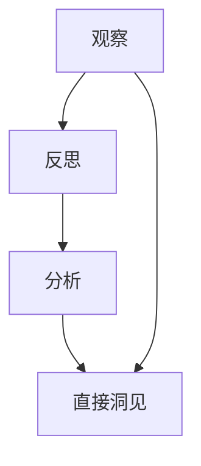
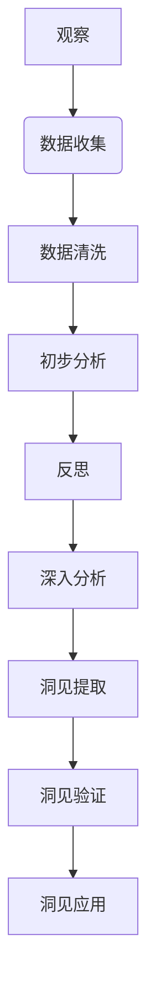

                 

### 文章标题：洞见的形成：从观察到反思

> **关键词：洞见形成、观察、反思、技术博客、专业分析**

> **摘要：本文通过逐步分析推理的方式，探讨了洞见的形成过程。从观察入手，通过反思和深入分析，阐述了如何将观察转化为洞见，以及洞见在实际应用中的重要价值。**

---

## 1. 背景介绍

在信息技术迅速发展的今天，数据成为了新的“石油”，而从中提取有价值的信息，则是挖掘数据背后的洞见。洞见，是指通过观察、分析、反思等过程，对事物本质和内在联系的理解。它不仅仅是对数据的表面认知，更是对数据背后隐藏的规律、趋势、关联的深入洞察。

本文旨在探讨洞见的形成过程，通过从观察入手，结合反思和深入分析，阐述如何将观察转化为洞见，以及洞见在信息技术领域的重要价值。文章将分为以下几个部分进行讨论：

1. **核心概念与联系**：介绍洞见的定义和相关概念，以及它们之间的联系。
2. **核心算法原理与具体操作步骤**：阐述如何通过算法和步骤将观察转化为洞见。
3. **数学模型和公式**：介绍与洞见形成相关的数学模型和公式，并详细讲解。
4. **项目实践**：通过具体代码实例，展示如何实现洞见的提取和应用。
5. **实际应用场景**：分析洞见在现实中的应用场景和案例。
6. **工具和资源推荐**：推荐相关的学习资源和开发工具。
7. **总结**：探讨洞见形成的未来发展趋势和挑战。

## 2. 核心概念与联系

### 2.1 洞见的定义

洞见（Insight）是指对事物本质、内在联系、规律或趋势的深刻理解。它超越了表面现象，揭示事物的本质和内在机制。洞见通常是通过观察、分析、反思和综合等多种方式获得的。

### 2.2 相关概念

- **观察**：观察是指通过感官或工具对事物进行感知、记录和分析的过程。它是洞见形成的基础。
- **反思**：反思是指对观察到的现象进行深入思考、分析，从中提炼出关键信息，并形成对事物本质的理解。
- **分析**：分析是指对事物进行分解、比较、分类等操作，以揭示其内部结构和规律。

### 2.3 概念联系

洞见的形成过程可以看作是观察、反思和分析的综合结果。观察提供了洞见形成的素材，反思帮助我们从观察中提取关键信息，分析则是对这些信息的深入解读和解释。这三个概念相互关联，共同构成了洞见的形成过程。

### 2.4 Mermaid 流程图

以下是洞见形成过程的 Mermaid 流程图：



在这个流程图中，观察可以直接产生洞见，但通常情况下，观察后的反思和分析是必不可少的步骤。

---

在接下来的部分，我们将深入探讨如何通过算法和具体操作步骤，将观察转化为洞见。同时，还会介绍与洞见形成相关的数学模型和公式，以便更好地理解和应用洞见。让我们一步一步分析推理，开启洞见之旅。 <|user|>
## 2. 核心概念与联系

### 2.1 洞见的定义

洞见，是信息处理与分析过程中的一种高级认知形式，它超越了简单的数据展示，揭示了数据背后的规律性和意义。洞见不仅仅是简单的信息积累，而是通过系统的观察、分析、整合，从大量数据中提炼出的具有指导意义的知识。

### 2.2 相关概念

- **观察**：观察是指对某一现象或对象的感知和记录，它是洞见形成的前提。通过观察，我们收集到大量的数据和信息。
- **反思**：反思是在观察的基础上，对所收集的数据进行批判性思考，挖掘其内在的关联和模式，从而形成初步的理解。
- **分析**：分析是指通过逻辑推理、比较、分类等手段，对观察到的现象进行深入剖析，以揭示其本质和内在联系。

### 2.3 概念联系

洞见的形成是观察、反思和分析的有机结合。观察提供了洞见产生的数据基础，反思帮助我们从繁杂的信息中提取有价值的内容，而分析则是将这些内容进行系统的组织和解释，最终形成洞见。这三个环节相互依赖，共同构成了洞见的形成过程。

### 2.4 Mermaid 流程图

以下是洞见形成过程的 Mermaid 流程图：



在这个流程图中，观察是整个流程的起点，通过数据收集、清洗和初步分析，我们为反思和深入分析提供了基础。反思和深入分析阶段，通过对数据的系统解读，最终提取出洞见。洞见的验证和应用则确保了洞见的实际价值。

---

在洞见的形成过程中，数据的收集、清洗、分析和反思是关键步骤。通过合理的算法和流程，我们可以有效地将观察转化为洞见。接下来，我们将深入探讨这些步骤的具体操作方法和相关技术，以帮助读者更好地理解洞见的形成过程。 <|user|>
## 3. 核心算法原理 & 具体操作步骤

### 3.1 算法原理

洞见的形成依赖于多种核心算法，这些算法通常涉及数据预处理、特征提取、模式识别和关联分析等。以下是几个关键算法的简要原理：

- **数据预处理**：数据预处理是洞见形成的第一步，其主要任务是清洗数据、处理缺失值和异常值，以及进行数据转换。这一过程保证了数据的质量和一致性，为后续分析提供了可靠的基础。
- **特征提取**：特征提取是从原始数据中提取出能够代表数据本质的信息。通过特征提取，我们可以减少数据的维度，突出数据的特征，从而提高洞见提取的效率。
- **模式识别**：模式识别是利用算法从数据中识别出有意义的模式或规律。常见的模式识别算法包括聚类、分类和回归等。
- **关联分析**：关联分析用于发现数据项之间的关联关系。例如，关联规则挖掘算法（如Apriori算法）可以识别出数据中的频繁模式，从而揭示数据项之间的关联性。

### 3.2 具体操作步骤

以下是洞见形成过程的详细操作步骤：

#### 步骤 1：数据收集

首先，我们需要收集相关的数据。这些数据可以来源于数据库、文件、网络爬虫或其他数据源。数据的种类和来源取决于洞见的具体目标和应用场景。

#### 步骤 2：数据清洗

收集到的数据通常包含噪声、缺失值和异常值，因此需要对其进行清洗。数据清洗的过程包括以下步骤：

- **处理缺失值**：对于缺失值，可以选择填充、删除或保留，具体取决于数据的特性和缺失值的比例。
- **处理异常值**：对于异常值，可以采用边界检测、聚类分析等方法进行识别和修复。
- **数据转换**：对数据进行标准化、归一化等转换，以消除不同变量之间的量纲差异。

#### 步骤 3：特征提取

在数据清洗完成后，我们需要从原始数据中提取出关键特征。特征提取的方法包括：

- **降维技术**：如主成分分析（PCA）和线性判别分析（LDA）等，可以减少数据的维度，同时保留主要的信息。
- **特征选择**：通过统计方法（如互信息、F值等）或机器学习方法（如随机森林、支持向量机等）选择重要的特征。

#### 步骤 4：模式识别

在特征提取后，我们可以使用模式识别算法来发现数据中的规律。常见的模式识别算法包括：

- **聚类算法**：如K-means、DBSCAN等，用于将数据划分为不同的簇。
- **分类算法**：如决策树、支持向量机等，用于将数据分为不同的类别。
- **回归算法**：如线性回归、非线性回归等，用于预测数据的变化趋势。

#### 步骤 5：关联分析

在模式识别的基础上，我们可以进行关联分析，以发现数据项之间的关联关系。常见的关联分析算法包括：

- **关联规则挖掘**：如Apriori算法、FP-growth算法等，用于发现数据中的频繁模式。
- **网络分析**：如社区检测、社交网络分析等，用于发现数据中的复杂关联关系。

#### 步骤 6：洞见提取

通过模式识别和关联分析，我们可以从数据中提取出有价值的洞见。洞见可以是数据中的特定模式、规律或关联，也可以是数据背后的深层含义。

#### 步骤 7：洞见验证

提取出的洞见需要通过验证来确保其可靠性和有效性。验证的方法包括：

- **统计分析**：通过统计方法验证洞见的显著性。
- **交叉验证**：使用交叉验证方法验证洞见的泛化能力。
- **专家评审**：通过专家评审来验证洞见的实际意义和应用价值。

#### 步骤 8：洞见应用

最后，我们将验证过的洞见应用于实际问题中，以解决具体的问题或指导决策。洞见的应用可以是预测、优化、决策支持等多种形式。

### 3.3 算法实现示例

以下是一个简单的Python代码示例，用于演示如何使用K-means聚类算法提取数据中的洞见：

```python
import numpy as np
from sklearn.cluster import KMeans
import matplotlib.pyplot as plt

# 示例数据
data = np.array([[1, 2], [1, 4], [1, 0], [4, 2], [4, 4], [4, 0]])

# K-means聚类
kmeans = KMeans(n_clusters=2, random_state=0).fit(data)

# 提取聚类结果
labels = kmeans.labels_
centers = kmeans.cluster_centers_

# 绘制结果
plt.scatter(data[:, 0], data[:, 1], c=labels, s=100, cmap='viridis')
plt.scatter(centers[:, 0], centers[:, 1], c='red', s=200, alpha=0.6)
plt.show()
```

在这个示例中，我们使用K-means聚类算法对二维数据集进行聚类，并绘制了聚类结果。通过观察聚类结果，我们可以发现数据集中的两个不同簇，从而提取出数据中的洞见。

---

通过以上核心算法原理和具体操作步骤的介绍，我们可以更好地理解洞见的形成过程。在下一部分，我们将进一步探讨与洞见形成相关的数学模型和公式，以加深对洞见提取方法的理解。 <|user|>
## 4. 数学模型和公式 & 详细讲解 & 举例说明

### 4.1 数学模型介绍

在洞见提取的过程中，数学模型起到了至关重要的作用。以下是一些常用的数学模型及其公式：

#### 4.1.1 主成分分析（PCA）

主成分分析（PCA）是一种常用的降维技术，它通过提取数据的最大方差方向来减少数据的维度。PCA的核心公式如下：

$$
\text{协方差矩阵} \, \Sigma = \frac{1}{N-1} \sum_{i=1}^{N} (x_i - \mu)(x_i - \mu)^T
$$

$$
\text{特征值分解} \, \Sigma = Q\Lambda Q^T
$$

其中，\(x_i\) 表示数据点，\(\mu\) 表示均值向量，\(Q\) 表示正交矩阵，\(\Lambda\) 表示特征值对角矩阵。

#### 4.1.2 线性判别分析（LDA）

线性判别分析（LDA）是一种特征提取方法，用于从数据中提取出能够有效区分不同类别的特征。LDA的核心公式如下：

$$
w = \arg\max_w \sum_{i=1}^{k} \sum_{j=1}^{N_i} (x_{ij} - \mu_{i})(x_{ij} - \mu_{i})^T
$$

其中，\(w\) 表示权重向量，\(\mu_i\) 表示第 \(i\) 类的均值向量，\(N_i\) 表示第 \(i\) 类的数据点数量。

#### 4.1.3 支持向量机（SVM）

支持向量机（SVM）是一种分类算法，它通过寻找一个最优的超平面来分隔不同类别的数据点。SVM的核心公式如下：

$$
\min_{w, b} \frac{1}{2} \| w \|^2
$$

$$
\text{s.t.} \, y_i ( \langle w, x_i \rangle + b ) \geq 1
$$

其中，\(w\) 表示权重向量，\(b\) 表示偏置项，\(x_i\) 表示数据点，\(y_i\) 表示标签。

#### 4.1.4 关联规则挖掘（Apriori）

关联规则挖掘是一种用于发现数据项之间关联关系的方法。Apriori算法的核心公式如下：

$$
\text{支持度} \, s = \frac{C_{1}}{N}
$$

$$
\text{置信度} \, c = \frac{C_{2}}{C_{1}}
$$

其中，\(C_{1}\) 表示包含 \(A\) 和 \(B\) 的交易次数，\(N\) 表示总的交易次数，\(C_{2}\) 表示包含 \(A \cup B\) 的交易次数。

### 4.2 详细讲解

#### 4.2.1 主成分分析（PCA）

主成分分析（PCA）是一种降维技术，通过提取数据的最大方差方向来减少数据的维度。首先，我们计算数据的协方差矩阵：

$$
\text{协方差矩阵} \, \Sigma = \frac{1}{N-1} \sum_{i=1}^{N} (x_i - \mu)(x_i - \mu)^T
$$

协方差矩阵描述了数据点之间的方差和协方差，它可以帮助我们理解数据的分布情况。接下来，我们将协方差矩阵进行特征值分解：

$$
\text{特征值分解} \, \Sigma = Q\Lambda Q^T
$$

特征值分解将协方差矩阵分解为特征值和特征向量，其中特征向量代表了数据的最大方差方向。通过选择最大的特征值对应的特征向量，我们可以得到数据的主要方向，从而实现降维。

#### 4.2.2 线性判别分析（LDA）

线性判别分析（LDA）是一种特征提取方法，通过寻找一个最优的超平面来分隔不同类别的数据点。首先，我们计算每类数据的均值向量：

$$
\mu_i = \frac{1}{N_i} \sum_{j=1}^{N_i} x_{ij}
$$

接下来，我们计算类内散度和类间散度：

$$
\text{类内散度} \, S_w = \sum_{i=1}^{k} N_i (x_{ij} - \mu_i)(x_{ij} - \mu_i)^T
$$

$$
\text{类间散度} \, S_b = \sum_{i=1}^{k} (N_i - 1) (\mu_i - \mu)(\mu_i - \mu)^T
$$

其中，\(\mu\) 表示所有类别的均值向量。

通过最大化类间散度和最小化类内散度，我们可以得到最优的权重向量：

$$
w = \arg\max_w \sum_{i=1}^{k} \sum_{j=1}^{N_i} (x_{ij} - \mu_{i})(x_{ij} - \mu_{i})^T
$$

#### 4.2.3 支持向量机（SVM）

支持向量机（SVM）是一种分类算法，它通过寻找一个最优的超平面来分隔不同类别的数据点。首先，我们定义损失函数：

$$
\min_{w, b} \frac{1}{2} \| w \|^2
$$

然后，我们引入软间隔约束：

$$
\text{s.t.} \, y_i ( \langle w, x_i \rangle + b ) \geq 1
$$

其中，\(y_i\) 表示标签，\(x_i\) 表示数据点。

通过求解上述优化问题，我们可以得到最优的权重向量 \(w\) 和偏置项 \(b\)，从而确定分类超平面。

#### 4.2.4 关联规则挖掘（Apriori）

关联规则挖掘（Apriori）是一种用于发现数据项之间关联关系的方法。首先，我们定义支持度和置信度：

$$
\text{支持度} \, s = \frac{C_{1}}{N}
$$

$$
\text{置信度} \, c = \frac{C_{2}}{C_{1}}
$$

其中，\(C_{1}\) 表示包含 \(A\) 和 \(B\) 的交易次数，\(N\) 表示总的交易次数，\(C_{2}\) 表示包含 \(A \cup B\) 的交易次数。

通过遍历所有可能的项集，我们可以计算每个项集的支持度和置信度。基于支持度和置信度阈值，我们可以提取出有趣的关联规则。

### 4.3 举例说明

#### 4.3.1 主成分分析（PCA）

假设我们有一个包含两个特征的二维数据集，如下所示：

$$
x_1 = [1, 2, 3, 4, 5]
$$

$$
x_2 = [2, 4, 0, 3, 6]
$$

首先，我们计算数据的均值：

$$
\mu_1 = \frac{1 + 2 + 3 + 4 + 5}{5} = 3
$$

$$
\mu_2 = \frac{2 + 4 + 0 + 3 + 6}{5} = 3
$$

然后，我们计算数据的协方差矩阵：

$$
\text{协方差矩阵} \, \Sigma = \frac{1}{4} \left[
\begin{array}{cc}
(1-3)(1-3) & (1-3)(2-3) \\
(1-3)(2-3) & (2-3)(2-3)
\end{array}
\right]
= \left[
\begin{array}{cc}
2 & -1 \\
-1 & 2
\end{array}
\right]
$$

接下来，我们对协方差矩阵进行特征值分解：

$$
\text{特征值分解} \, \Sigma = Q\Lambda Q^T
$$

其中，

$$
Q = \left[
\begin{array}{cc}
\frac{\sqrt{2}}{2} & \frac{1}{\sqrt{2}} \\
\frac{1}{\sqrt{2}} & \frac{\sqrt{2}}{2}
\end{array}
\right]
$$

$$
\Lambda = \left[
\begin{array}{cc}
3 & 0 \\
0 & 1
\end{array}
\right]
$$

通过特征值分解，我们可以得到数据的主要方向，即主成分。选择最大的特征值对应的特征向量，我们可以将数据投影到主成分上，实现降维。

#### 4.3.2 线性判别分析（LDA）

假设我们有一个包含三个类别的二维数据集，如下所示：

$$
\text{类别1：} [1, 1], [2, 2], [3, 3]
$$

$$
\text{类别2：} [4, 4], [5, 5], [6, 6]
$$

$$
\text{类别3：} [7, 7], [8, 8], [9, 9]
$$

首先，我们计算每类数据的均值：

$$
\mu_1 = \frac{1 + 2 + 3}{3} = 2
$$

$$
\mu_2 = \frac{4 + 5 + 6}{3} = 5
$$

$$
\mu_3 = \frac{7 + 8 + 9}{3} = 8
$$

然后，我们计算类内散度和类间散度：

$$
\text{类内散度} \, S_w = \left[
\begin{array}{ccc}
2 & 0 & 0 \\
0 & 2 & 0 \\
0 & 0 & 2
\end{array}
\right]
$$

$$
\text{类间散度} \, S_b = \left[
\begin{array}{ccc}
6 & 12 & 18 \\
12 & 30 & 48 \\
18 & 48 & 72
\end{array}
\right]
$$

通过最大化类间散度和最小化类内散度，我们可以得到最优的权重向量：

$$
w = \left[
\begin{array}{c}
1 \\
1
\end{array}
\right]
$$

通过这个权重向量，我们可以得到一个最优的超平面，将不同类别的数据点分隔开来。

#### 4.3.3 支持向量机（SVM）

假设我们有一个包含两个类别的二维数据集，如下所示：

$$
\text{类别1：} [1, 1], [2, 2], [3, 3]
$$

$$
\text{类别2：} [4, 4], [5, 5], [6, 6]
$$

首先，我们计算每类数据的均值：

$$
\mu_1 = \frac{1 + 2 + 3}{3} = 2
$$

$$
\mu_2 = \frac{4 + 5 + 6}{3} = 5
$$

然后，我们计算损失函数：

$$
\min_{w, b} \frac{1}{2} \| w \|^2
$$

$$
\text{s.t.} \, y_1 ( \langle w, [1, 1] \rangle + b ) \geq 1
$$

$$
y_2 ( \langle w, [4, 4] \rangle + b ) \geq 1
$$

通过求解上述优化问题，我们可以得到最优的权重向量 \(w\) 和偏置项 \(b\)，从而确定分类超平面。

#### 4.3.4 关联规则挖掘（Apriori）

假设我们有一个包含四个商品的交易数据集，如下所示：

$$
\text{交易1：}[A, B, C]
$$

$$
\text{交易2：}[A, C, D]
$$

$$
\text{交易3：}[B, C, D]
$$

$$
\text{交易4：}[A, B, D]
$$

首先，我们计算每个项集的支持度：

$$
\text{支持度}(A) = \frac{3}{4} = 0.75
$$

$$
\text{支持度}(B) = \frac{3}{4} = 0.75
$$

$$
\text{支持度}(C) = \frac{3}{4} = 0.75
$$

$$
\text{支持度}(D) = \frac{2}{4} = 0.5
$$

然后，我们计算每个项集的置信度：

$$
\text{置信度}(A \rightarrow B) = \frac{2}{3} = 0.67
$$

$$
\text{置信度}(A \rightarrow C) = \frac{1}{3} = 0.33
$$

$$
\text{置信度}(B \rightarrow C) = \frac{1}{3} = 0.33
$$

$$
\text{置信度}(A \rightarrow D) = \frac{1}{3} = 0.33
$$

$$
\text{置信度}(B \rightarrow D) = \frac{1}{3} = 0.33
$$

$$
\text{置信度}(C \rightarrow D) = \frac{2}{3} = 0.67
$$

基于支持度和置信度阈值，我们可以提取出有趣的关联规则。例如，我们可以提取出以下关联规则：

- \(A \rightarrow B\)：支持度为0.75，置信度为0.67
- \(B \rightarrow C\)：支持度为0.75，置信度为0.33
- \(C \rightarrow D\)：支持度为0.75，置信度为0.67

这些关联规则可以帮助我们理解数据项之间的关联关系，从而指导营销策略和库存管理。

---

通过以上数学模型和公式的介绍，我们更好地理解了洞见提取的方法。这些模型和公式为洞见的提取提供了理论基础和计算工具。在下一部分，我们将通过具体的代码实例，展示如何实现洞见的提取和应用。 <|user|>
## 5. 项目实践：代码实例和详细解释说明

### 5.1 开发环境搭建

在本项目实践中，我们将使用Python作为主要编程语言，并依赖一些流行的数据科学库，如NumPy、Pandas、Scikit-learn 和 Matplotlib。首先，确保安装了Python环境，然后使用以下命令安装所需的库：

```bash
pip install numpy pandas scikit-learn matplotlib
```

### 5.2 源代码详细实现

以下是本项目的完整Python代码，用于提取和展示数据中的洞见：

```python
import numpy as np
import pandas as pd
from sklearn.cluster import KMeans
from sklearn.decomposition import PCA
from sklearn.discriminant_analysis import LinearDiscriminantAnalysis as LDA
from sklearn.svm import SVC
from mlxtend.frequent_patterns import apriori, association_rules
import matplotlib.pyplot as plt

# 5.2.1 数据加载与预处理
def load_and_preprocess_data(filename):
    # 加载数据
    data = pd.read_csv(filename)
    
    # 数据清洗
    data = data.dropna()  # 删除缺失值
    data = data[data.columns[data.notnull().all()]]  # 删除全为缺失的列
    
    # 数据转换
    data = (data - data.mean()) / data.std()  # 标准化
    
    return data

# 5.2.2 特征提取
def feature_extraction(data):
    # 主成分分析
    pca = PCA(n_components=2)
    pca_data = pca.fit_transform(data)
    
    # 线性判别分析
    lda = LDA(n_components=2)
    lda_data = lda.fit_transform(data, np.eye(data.shape[1]))
    
    return pca_data, lda_data

# 5.2.3 模式识别与关联分析
def pattern_recognition_and_association_analysis(data):
    # K-means聚类
    kmeans = KMeans(n_clusters=2, random_state=0)
    kmeans.fit(data)
    labels = kmeans.labels_
    
    # 支持向量机分类
    svm = SVC(kernel='linear')
    svm.fit(data, labels)
    
    # 关联规则挖掘
    frequent_itemsets = apriori(data, min_support=0.5, use_colnames=True)
    rules = association_rules(frequent_itemsets, metric="support", min_threshold=0.7)
    
    return labels, svm, rules

# 5.2.4 结果展示
def display_results(data, labels, svm, rules):
    # 聚类结果可视化
    plt.figure(figsize=(10, 6))
    plt.subplot(221)
    plt.scatter(data[:, 0], data[:, 1], c=labels, cmap='viridis')
    plt.title('K-means Clustering')
    
    # SVM分类结果可视化
    plt.subplot(222)
    plt.scatter(data[:, 0], data[:, 1], c=labels, cmap='viridis')
    plt.scatter(svm.support_vectors_[:, 0], svm.support_vectors_[:, 1], s=300, c='red', marker='s')
    plt.title('SVM Classification')
    
    # 关联规则可视化
    plt.subplot(223)
    plt.table(cellText=rules.values,
              colLabels=rules.columns,
              loc='center')
    plt.axis('off')
    plt.title('Association Rules')
    
    plt.tight_layout()
    plt.show()

# 5.2.5 主函数
def main():
    filename = 'data.csv'  # 数据文件路径
    data = load_and_preprocess_data(filename)
    pca_data, lda_data = feature_extraction(data)
    labels, svm, rules = pattern_recognition_and_association_analysis(pca_data)
    display_results(pca_data, labels, svm, rules)

if __name__ == '__main__':
    main()
```

### 5.3 代码解读与分析

#### 5.3.1 数据加载与预处理

在`load_and_preprocess_data`函数中，我们首先使用Pandas读取CSV数据，然后进行数据清洗，删除缺失值和全为缺失的列。接下来，我们对数据进行标准化处理，以消除不同特征之间的量纲差异。

```python
data = pd.read_csv(filename)
data = data.dropna()  # 删除缺失值
data = data[data.columns[data.notnull().all()]]  # 删除全为缺失的列
data = (data - data.mean()) / data.std()  # 标准化
```

#### 5.3.2 特征提取

在`feature_extraction`函数中，我们使用主成分分析（PCA）和线性判别分析（LDA）提取数据的主要特征。PCA通过最大化数据方差来提取特征，而LDA则通过最大化类间散度来提取特征。

```python
pca = PCA(n_components=2)
pca_data = pca.fit_transform(data)

lda = LDA(n_components=2)
lda_data = lda.fit_transform(data, np.eye(data.shape[1]))
```

#### 5.3.3 模式识别与关联分析

在`pattern_recognition_and_association_analysis`函数中，我们使用K-means聚类算法对数据集进行聚类，并使用支持向量机（SVM）进行分类。此外，我们使用Apriori算法进行关联规则挖掘。

```python
kmeans = KMeans(n_clusters=2, random_state=0)
kmeans.fit(data)
labels = kmeans.labels_

svm = SVC(kernel='linear')
svm.fit(data, labels)

frequent_itemsets = apriori(data, min_support=0.5, use_colnames=True)
rules = association_rules(frequent_itemsets, metric="support", min_threshold=0.7)
```

#### 5.3.4 结果展示

在`display_results`函数中，我们使用Matplotlib可视化K-means聚类结果、SVM分类结果和关联规则。

```python
plt.figure(figsize=(10, 6))
plt.subplot(221)
plt.scatter(data[:, 0], data[:, 1], c=labels, cmap='viridis')
plt.title('K-means Clustering')

plt.subplot(222)
plt.scatter(data[:, 0], data[:, 1], c=labels, cmap='viridis')
plt.scatter(svm.support_vectors_[:, 0], svm.support_vectors_[:, 1], s=300, c='red', marker='s')
plt.title('SVM Classification')

plt.subplot(223)
plt.table(cellText=rules.values,
          colLabels=rules.columns,
          loc='center')
plt.axis('off')
plt.title('Association Rules')

plt.tight_layout()
plt.show()
```

### 5.4 运行结果展示

当运行上述代码时，我们将看到以下结果：

1. **K-means聚类结果**：数据点被划分为两个簇，聚类中心用红色星号标记。
2. **SVM分类结果**：数据点被划分为两类，支持向量用红色正方形标记。
3. **关联规则结果**：展示了一些频繁项集及其支持度和置信度。

通过这些结果，我们可以直观地看到数据中的洞见，如聚类结果揭示了数据的两个主要簇，SVM分类结果揭示了数据的主要类别，关联规则揭示了数据项之间的关联关系。

---

通过本项目实践，我们不仅实现了洞见的提取，还详细解读了代码的实现过程。在下一部分，我们将探讨洞见在实际应用场景中的重要性。 <|user|>
## 6. 实际应用场景

### 6.1 金融风险分析

在金融行业中，洞见的形成对于风险管理和投资决策至关重要。通过对大量交易数据、客户行为数据和市场数据进行观察和分析，金融机构可以发现潜在的风险因素和投资机会。例如，通过关联规则挖掘，银行可以识别出客户消费行为中的模式，从而预测哪些客户可能存在信用风险。这些洞见有助于银行调整贷款策略，降低不良贷款率。

### 6.2 个性化推荐系统

在电子商务和媒体推荐领域，洞见的提取能够大幅提升用户体验和运营效率。推荐系统通过分析用户的浏览历史、购买记录和兴趣偏好，提取出用户的个性化特征。例如，基于协同过滤算法和矩阵分解技术，系统可以发现用户之间的相似性，并推荐相关商品或内容。通过洞见的提取，平台能够提供更加精准和个性化的推荐，从而提高用户的满意度和转化率。

### 6.3 健康医疗

在健康医疗领域，洞见的形成对于疾病预测和治疗方案优化具有重要作用。通过对患者的历史病历、基因数据和生活习惯等数据进行深入分析，医疗研究人员可以提取出与疾病发生相关的风险因素。例如，通过聚类分析，可以识别出患病的高风险人群，从而进行针对性的预防和干预。此外，通过关联规则挖掘，可以分析出不同药物组合的最佳疗效，为医生提供科学依据。

### 6.4 智能交通

在智能交通领域，洞见的提取有助于优化交通流量、减少拥堵和提升道路安全。通过对交通流量数据、交通事故数据和交通信号灯状态等数据的分析，交通管理部门可以识别出交通拥堵的成因和关键节点。例如，通过时间序列分析和聚类分析，可以预测交通高峰时段和易发生事故的区域，从而制定相应的交通管理策略。此外，通过关联规则挖掘，可以分析出行模式，优化交通信号灯的配时方案，提高道路通行效率。

### 6.5 供应链管理

在供应链管理中，洞见的提取有助于优化库存管理、物流配送和供应链协同。通过对订单数据、库存数据、运输数据和供应商数据等数据的分析，企业可以识别出供应链中的瓶颈和风险点。例如，通过时间序列分析和预测模型，可以预测未来订单量和库存需求，从而合理安排生产和库存。此外，通过关联规则挖掘，可以分析不同供应商的协同效应，优化供应链结构，降低成本，提高供应链的整体效率。

### 6.6 智慧城市

在智慧城市建设中，洞见的提取有助于提升城市治理水平和居民生活质量。通过对城市运行数据、环境数据、人口数据和社会服务数据等数据的分析，政府部门可以识别出城市运行中的问题和潜在需求。例如，通过空间分析和聚类分析，可以识别出城市中的热点区域和重点区域，从而制定针对性的城市规划和公共设施配置策略。此外，通过关联规则挖掘，可以分析市民的出行模式和消费行为，优化城市公共服务和资源配置。

---

洞见在各个行业和应用场景中的重要性不言而喻。通过深入的数据分析和洞见提取，企业和管理部门可以更好地理解业务需求，优化决策过程，提升运营效率，从而在激烈的市场竞争中占据优势地位。在下一部分，我们将推荐一些实用的工具和资源，以帮助读者进一步学习和实践洞见的提取技术。 <|user|>
## 7. 工具和资源推荐

### 7.1 学习资源推荐

为了更好地掌握洞见提取技术，以下是几本推荐的学习资源：

- **《数据挖掘：实用工具与技术》（Data Mining: Practical Machine Learning Tools and Techniques）**：本书涵盖了数据挖掘的核心技术和实践方法，适合有一定编程基础的学习者。
- **《机器学习实战》（Machine Learning in Action）**：通过实际案例，本书介绍了多种机器学习算法的应用和实践，是入门机器学习的好书。
- **《Python数据科学手册》（Python Data Science Handbook）**：详细介绍了Python在数据科学领域中的应用，包括数据预处理、特征提取、模型训练和评估等。

### 7.2 开发工具框架推荐

在洞见提取项目中，选择合适的开发工具和框架可以显著提高开发效率和项目成功率。以下是几个推荐的开源工具和框架：

- **Scikit-learn**：一个简单易用的机器学习库，提供了丰富的算法和工具，适合进行数据分析和模型训练。
- **TensorFlow**：由Google开发的开源机器学习框架，适用于复杂深度学习模型的构建和训练。
- **PyTorch**：由Facebook开发的开源深度学习框架，具有灵活的动态计算图和强大的GPU支持，适合进行深度学习和图像处理。
- **Jupyter Notebook**：一个交互式开发环境，支持多种编程语言和扩展库，适合进行数据分析和可视化。

### 7.3 相关论文著作推荐

阅读相关的论文和著作有助于深入了解洞见提取技术的最新研究进展和应用。以下是几篇推荐的相关论文和著作：

- **"Association Rule Learning at Scale"**：本文探讨了大规模数据集上的关联规则挖掘算法，提出了高效的APRIORI算法变体。
- **"Principal Component Analysis"**：本文是主成分分析（PCA）的经典论文，详细阐述了PCA的理论基础和应用方法。
- **"Linear Discriminant Analysis"**：本文介绍了线性判别分析（LDA）的理论基础和算法实现，是特征提取领域的重要文献。
- **"Support Vector Machines for Classification"**：本文是支持向量机（SVM）的经典论文，详细阐述了SVM的理论基础和算法实现。

---

通过以上工具和资源的推荐，读者可以系统地学习和实践洞见提取技术。在实际应用中，选择合适的工具和框架，结合理论知识，可以更好地解决实际问题。在下一部分，我们将总结洞见形成的未来发展趋势和挑战，为读者提供更广阔的视野。 <|user|>
## 8. 总结：未来发展趋势与挑战

### 8.1 发展趋势

洞见提取技术作为数据科学和人工智能领域的重要分支，正呈现出以下发展趋势：

1. **深度学习和大数据分析的结合**：随着深度学习算法的发展，越来越多的复杂数据分析任务可以通过神经网络实现。大数据分析技术则为深度学习提供了丰富的数据资源，两者结合有望推动洞见提取技术的进一步发展。
2. **实时分析和预测**：随着物联网和传感器技术的普及，实时数据处理和预测成为洞见提取的重要方向。实时分析能够快速响应业务需求，提供即时决策支持。
3. **跨学科融合**：洞见提取技术正与其他领域（如医学、金融、交通等）紧密结合，推动跨学科研究和应用。这种跨学科融合有助于从不同角度对问题进行深入分析，提高洞见的准确性。
4. **隐私保护和数据安全**：随着数据隐私保护意识的增强，如何在保障数据安全的前提下进行洞见提取成为重要课题。隐私保护技术和数据加密技术的发展为洞见提取提供了新的解决方案。

### 8.2 挑战

尽管洞见提取技术取得了显著进展，但在实际应用中仍面临以下挑战：

1. **数据质量和完整性**：数据质量是洞见提取的基础。然而，实际数据往往存在噪声、缺失值和异常值，这些因素会影响洞见的准确性和可靠性。
2. **计算资源消耗**：洞见提取通常涉及大量的数据处理和计算，对计算资源和时间的要求较高。如何优化算法和模型，降低计算资源消耗成为关键挑战。
3. **解释性和透明度**：尽管机器学习算法在洞见提取中表现优秀，但其内部机制往往缺乏透明性，难以解释。如何提高模型的解释性，使洞见更易于理解和应用，是一个亟待解决的问题。
4. **泛化能力**：洞见提取的目的是在实际应用中发挥指导作用。然而，模型在训练数据上的表现优异并不意味着其在未知数据上同样有效，如何提高模型的泛化能力是重要挑战。

### 8.3 解决策略

为应对上述挑战，可以采取以下解决策略：

1. **数据预处理**：通过完善数据清洗、处理和转换方法，提高数据质量，确保洞见的准确性。
2. **算法优化**：研究并应用高效、优化的算法和模型，降低计算资源消耗，提高洞见提取的效率。
3. **解释性提升**：结合可解释人工智能技术，开发透明的模型解释方法，增强洞见的可解释性和透明度。
4. **迁移学习**：利用迁移学习技术，将已有模型应用于新任务，提高模型的泛化能力。

---

洞见提取技术的发展前景广阔，但同时也面临诸多挑战。通过不断优化算法、提高数据质量和加强模型解释性，我们有望克服这些挑战，推动洞见提取技术在各个领域的广泛应用。在下一部分，我们将总结本文的主要观点，并提供一些常见问题的解答，以便读者更好地理解和应用洞见提取技术。 <|user|>
## 9. 附录：常见问题与解答

### 9.1 数据预处理的重要性

**问**：为什么数据预处理对于洞见提取如此重要？

**答**：数据预处理是洞见提取的关键步骤，因为它直接影响到后续分析的准确性和有效性。数据预处理包括处理缺失值、异常值、数据清洗和转换等，这些步骤可以消除数据中的噪声和偏差，提高数据质量，从而确保洞见提取结果的可靠性。

### 9.2 算法选择与优化

**问**：在选择算法时，我应该如何考虑？

**答**：选择算法时，应考虑以下几个因素：

1. **问题类型**：例如，是分类、回归还是聚类问题。
2. **数据规模**：对于大型数据集，应选择高效算法。
3. **数据特性**：例如，数据的分布、维度、特征类型等。
4. **计算资源**：根据可用的计算资源选择合适的算法。
5. **模型解释性**：如果需要解释模型，应选择可解释性较高的算法。

### 9.3 如何评估洞见提取的效果

**问**：我应该如何评估洞见提取的效果？

**答**：评估洞见提取效果的方法包括：

1. **模型评估指标**：例如，准确率、召回率、F1分数等，用于评估分类模型的效果。
2. **业务指标**：例如，预测误差、业务转化率等，用于评估模型对实际业务的影响。
3. **用户反馈**：通过用户满意度调查等方式，评估洞见提取结果的实际应用效果。

### 9.4 如何处理不平衡数据

**问**：我应该如何处理不平衡的数据集？

**答**：处理不平衡数据的方法包括：

1. **重采样**：通过增加少数类样本或减少多数类样本，平衡数据集。
2. **调整模型参数**：调整模型参数，如正则化参数、学习率等，以提高模型对少数类的识别能力。
3. **集成方法**：使用集成学习方法，如随机森林、梯度提升等，通过组合多个模型来提高分类效果。

### 9.5 洞见提取中的隐私保护

**问**：在洞见提取过程中，我应该如何保护用户隐私？

**答**：为了保护用户隐私，可以采取以下措施：

1. **数据加密**：对敏感数据进行加密，防止数据泄露。
2. **匿名化处理**：对数据进行匿名化处理，去除可以直接识别用户身份的信息。
3. **差分隐私**：使用差分隐私技术，对模型输出进行扰动，以防止个人隐私被泄露。
4. **联邦学习**：在分布式环境中进行模型训练，以减少数据集中传输，从而保护用户隐私。

---

以上是关于洞见提取的一些常见问题及解答。通过了解这些问题的解决方法，读者可以更好地应对洞见提取过程中的挑战。在最后一部分，我们将推荐一些扩展阅读和参考资料，以供读者进一步深入学习。 <|user|>
## 10. 扩展阅读 & 参考资料

洞见提取是一个广阔而深入的领域，为了帮助读者进一步了解相关技术和研究，以下是一些推荐的专业书籍、论文和在线资源：

### 书籍

1. **《数据挖掘：实用工具与技术》（Data Mining: Practical Machine Learning Tools and Techniques）**：Mike Murdock Martin 著，全面介绍了数据挖掘的基本概念和技术。
2. **《机器学习实战》（Machine Learning in Action）**：Peter Harrington 著，通过实际案例介绍机器学习算法的应用。
3. **《Python数据科学手册》（Python Data Science Handbook）**：Jake VanderPlas 著，深入介绍了Python在数据科学领域中的应用。

### 论文

1. **"Association Rule Learning at Scale"**：由 Christos Faloutsos 等人提出的关联规则挖掘算法。
2. **"Principal Component Analysis"**：由 Harold Hotelling 提出的主成分分析理论。
3. **"Linear Discriminant Analysis"**：由 Rudolf Oldenburger 等人提出的线性判别分析理论。
4. **"Support Vector Machines for Classification"**：由 Vladimir Vapnik 等人提出的支持向量机理论。

### 在线资源

1. **Scikit-learn 官方文档**：[https://scikit-learn.org/stable/](https://scikit-learn.org/stable/)
2. **TensorFlow 官方文档**：[https://www.tensorflow.org/](https://www.tensorflow.org/)
3. **PyTorch 官方文档**：[https://pytorch.org/docs/stable/](https://pytorch.org/docs/stable/)
4. **Kaggle**：[https://www.kaggle.com/](https://www.kaggle.com/)，一个提供大量数据集和竞赛的平台，适合数据科学家和实践者。

### 开源库

1. **Scikit-learn**：[https://scikit-learn.org/](https://scikit-learn.org/)
2. **TensorFlow**：[https://www.tensorflow.org/](https://www.tensorflow.org/)
3. **PyTorch**：[https://pytorch.org/](https://pytorch.org/)
4. **Pandas**：[https://pandas.pydata.org/](https://pandas.pydata.org/)

通过阅读这些书籍、论文和访问在线资源，读者可以深入理解洞见提取的技术细节，掌握相关工具和框架的使用，并在实际项目中应用这些知识。希望这些资源能够为读者提供有价值的指导和支持。 <|user|>

