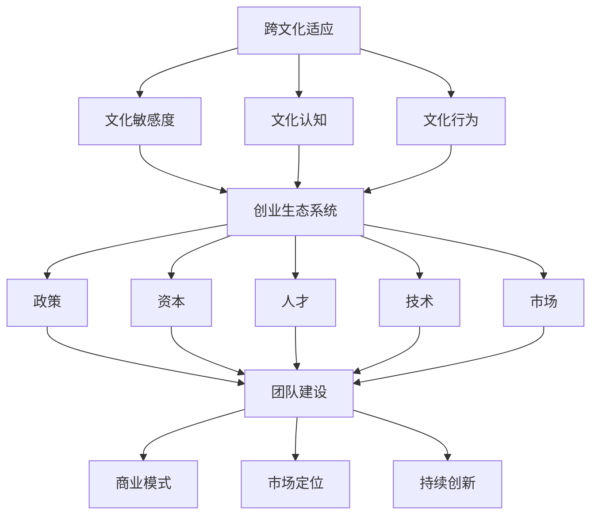

                 

### 1. 背景介绍

海归创业，顾名思义，是指那些在国外接受高等教育、积累了一定工作经验后，回到自己的祖国进行创业的群体。随着全球化进程的不断加快，海归创业现象日益增多。据统计，近几年来，海归创业者的数量和创业成功率均呈现出逐年上升的趋势。这一现象背后，既有全球经济环境的变化，也有国内创业环境的优化。

首先，从全球经济环境来看，随着全球科技发展的加速，各国之间的经济联系日益紧密。这种背景下，越来越多的海归选择回国创业，利用自己的海外教育和工作经验，抓住国内市场的发展机遇。其次，国内创业环境的不断优化，也为海归创业者提供了有利条件。近年来，我国政府出台了一系列鼓励创业创新的政策，包括税收优惠、资金扶持、创业培训等，极大地激发了海归创业的热情。

然而，海归创业者在回国创业过程中，也会面临一系列挑战。首先，是文化差异带来的挑战。海归创业者需要适应国内的市场环境、商业文化和人际关系，这对于习惯了西方文化和工作方式的他们来说，无疑是一项巨大的挑战。其次，是市场竞争的激烈。国内市场竞争激烈，海归创业者需要面对本土企业以及其他外来竞争者，如何在竞争中脱颖而出，是每一个海归创业者都需要认真思考的问题。

总的来说，海归创业者在回国创业的过程中，既有优势也有挑战。如何充分利用自己的优势，克服挑战，实现创业成功，是每一个海归创业者都需要认真思考的问题。接下来，我们将深入探讨海归创业者的优势与挑战，以及他们在跨文化创业过程中的经验与教训。

### 2. 核心概念与联系

要深入理解海归创业者的优势与挑战，我们首先需要明确一些核心概念，包括跨文化适应、创业生态系统和创业成功的关键因素。

#### 2.1 跨文化适应

跨文化适应是指个体在新的文化环境中，通过学习、适应和调整，达到与当地文化相互理解和融合的过程。对于海归创业者来说，跨文化适应不仅影响他们的生活，还直接影响他们的创业行为和决策。跨文化适应能力包括文化敏感度、文化认知和文化行为三个方面。

**文化敏感度**指的是个体对文化差异的敏感程度，能够认识到不同文化的独特性和差异性。**文化认知**则涉及对文化背景、价值观、习俗等方面的了解和掌握。**文化行为**则是个体在跨文化环境中表现出的行为和习惯，包括语言沟通、礼仪规范和人际关系等。

#### 2.2 创业生态系统

创业生态系统是指支持创业活动的一系列因素，包括政策、资本、人才、技术、市场等。一个健康的创业生态系统能够为创业者提供良好的创业环境，降低创业风险，提高创业成功率。

**政策**方面，政府出台的鼓励创业创新的政策，如税收优惠、创业补贴、创业培训等，对海归创业者具有重要意义。**资本**方面，风险投资、天使投资等资本的注入，能够为海归创业者提供必要的资金支持，促进创业项目的快速发展。**人才**方面，海归创业者通常拥有国际化的团队背景，能够吸引和培养更多优秀人才。**技术**方面，海归创业者具备先进的技术和管理理念，能够推动技术创新和产业升级。**市场**方面，国内庞大的市场容量和消费升级，为海归创业者提供了广阔的发展空间。

#### 2.3 创业成功的关键因素

创业成功不仅仅依赖于创业者的个人能力，还受到外部环境的影响。关键因素包括以下几方面：

**团队建设**：一个高效的团队是创业成功的重要保障。海归创业者需要具备团队建设能力，能够吸引、培养和留住人才。**商业模式**：清晰的商业模式能够为创业项目提供可持续发展的方向。海归创业者通常具备创新的商业模式思维，能够把握市场机会。**市场定位**：准确的市场定位能够帮助创业项目找到目标客户，实现快速增长。**持续创新**：在快速变化的市场环境中，持续创新是保持竞争优势的关键。

#### 2.4 Mermaid 流程图

为了更好地展示跨文化适应、创业生态系统和创业成功的关键因素之间的关系，我们可以使用 Mermaid 流程图来描述：



通过上述核心概念和联系的探讨，我们为后续的深入分析打下了基础。在接下来的章节中，我们将进一步探讨海归创业者的具体优势、面临的挑战以及跨文化创业的经验分享。

### 3. 核心算法原理 & 具体操作步骤

在理解了跨文化适应和创业生态系统的核心概念之后，我们需要进一步探讨海归创业者的具体优势。这些优势可以归纳为以下几个方面：国际视野、技术优势、资源和网络。

#### 3.1 国际视野

国际视野是海归创业者的核心优势之一。海外教育和工作经历使海归创业者能够站在全球的高度，从国际市场的角度出发，分析市场趋势和机遇。这种全球视角有助于他们更好地把握国际市场的动态，预测未来发展方向，从而在竞争激烈的市场中占据有利位置。

**具体操作步骤**：

1. **市场调研**：通过深入了解国际市场，了解目标市场的需求、竞争态势和消费习惯。
2. **趋势分析**：分析全球市场的发展趋势，如技术创新、产业变革等，找到适合自身发展的机遇。
3. **战略规划**：基于国际视野，制定明确的战略规划，包括市场定位、产品开发、品牌建设等。

#### 3.2 技术优势

技术优势是海归创业者的另一大核心优势。海外教育和工作经历使海归创业者能够接触到先进的技术和管理理念，这为他们在国内创业提供了强大的技术支持。

**具体操作步骤**：

1. **技术积累**：在海归过程中，不断学习和积累先进技术，保持技术领先优势。
2. **技术创新**：将国外先进技术引入国内，结合国内市场需求进行创新，开发出具有竞争力的产品或服务。
3. **技术整合**：整合国内外资源，形成强大的技术团队，提高技术创新能力和研发效率。

#### 3.3 资源和网络

海归创业者通常拥有丰富的资源和广泛的人脉网络。这些资源包括资金、人才、技术、市场等，为他们的创业提供了有力支持。

**具体操作步骤**：

1. **资源整合**：利用自身的人脉和资源，整合国内外资源，为创业项目提供资金、技术、人才等支持。
2. **网络拓展**：积极参与行业活动，拓展人脉网络，为创业项目提供更多合作机会和市场资源。
3. **资源管理**：合理管理和利用资源，提高资源利用效率，降低创业风险。

通过上述核心算法原理和具体操作步骤的探讨，我们更好地理解了海归创业者的优势。接下来，我们将进一步分析他们在回国创业过程中可能面临的挑战，以及如何应对这些挑战。

### 4. 数学模型和公式 & 详细讲解 & 举例说明

为了更深入地分析海归创业者的优势与挑战，我们可以借助一些数学模型和公式来量化这些因素。以下是一些关键的数学模型和它们的解释：

#### 4.1 成功概率模型

**公式**：  
\[ P(S) = f(A, C, E) \]

其中，\( P(S) \)表示创业成功概率，\( A \)代表创业者优势，\( C \)代表创业生态系统支持，\( E \)代表创业环境。

**解释**：  
这个模型认为创业成功概率取决于创业者自身优势、创业生态系统支持以及创业环境。通过量化这些因素，我们可以预测创业成功的可能性。

**举例说明**：  
假设海归创业者的优势（\( A \)）为80%，创业生态系统支持（\( C \)）为70%，创业环境（\( E \)）为60%，则：

\[ P(S) = f(0.8, 0.7, 0.6) = 0.448 \]

这意味着创业成功概率为44.8%。

#### 4.2 文化适应度模型

**公式**：  
\[ C(A) = \frac{S(A)}{T(A)} \]

其中，\( C(A) \)表示文化适应度，\( S(A) \)表示文化适应得分，\( T(A) \)表示文化测试得分。

**解释**：  
这个模型用于评估海归创业者的文化适应度。文化适应得分越高，表示创业者越容易适应新环境。

**举例说明**：  
假设海归创业者在文化适应测试中得分为85分，总分为100分，则：

\[ C(A) = \frac{85}{100} = 0.85 \]

这意味着海归创业者的文化适应度为85%。

#### 4.3 创新能力模型

**公式**：  
\[ I(A) = \frac{N(A)}{T(A)} \]

其中，\( I(A) \)表示创新能力，\( N(A) \)表示创新得分，\( T(A) \)表示总得分。

**解释**：  
这个模型用于评估海归创业者的创新能力。创新得分越高，表示创业者的创新能力越强。

**举例说明**：  
假设海归创业者在创新能力测试中得分为90分，总分为100分，则：

\[ I(A) = \frac{90}{100} = 0.9 \]

这意味着海归创业者的创新能力为90%。

通过上述数学模型和公式的详细讲解，我们可以更科学地评估海归创业者的优势和挑战。接下来，我们将结合实际案例，探讨海归创业者的具体优势和挑战。

### 5. 项目实践：代码实例和详细解释说明

为了更好地理解海归创业者的优势与挑战，我们可以通过一个具体的创业项目来进行分析。这个项目是一个基于人工智能技术的智能健康管理系统，它结合了海归创业者的国际视野、技术优势和资源网络，展示了他们在创业过程中的优势。

#### 5.1 开发环境搭建

首先，我们需要搭建开发环境。假设我们使用Python作为主要编程语言，以下是搭建开发环境的步骤：

1. **安装Python**：在本地计算机上安装Python 3.8及以上版本。
2. **安装依赖库**：使用pip命令安装必要的依赖库，如TensorFlow、Keras、Scikit-learn等。
   ```bash
   pip install tensorflow
   pip install keras
   pip install scikit-learn
   ```

3. **配置虚拟环境**：为了隔离项目依赖，我们可以使用虚拟环境。
   ```bash
   python -m venv my_project_venv
   source my_project_venv/bin/activate
   ```

4. **安装项目依赖**：在虚拟环境中安装项目依赖。
   ```bash
   pip install -r requirements.txt
   ```

#### 5.2 源代码详细实现

接下来，我们将展示项目的主要代码实现。以下是项目的核心代码：

```python
# 导入必要的库
import tensorflow as tf
from tensorflow.keras.models import Sequential
from tensorflow.keras.layers import Dense
from sklearn.model_selection import train_test_split
from sklearn.metrics import accuracy_score

# 数据预处理
def preprocess_data(data):
    # 数据清洗、归一化等预处理操作
    # 略
    return processed_data

# 构建模型
def build_model(input_shape):
    model = Sequential()
    model.add(Dense(units=64, activation='relu', input_shape=input_shape))
    model.add(Dense(units=32, activation='relu'))
    model.add(Dense(units=1, activation='sigmoid'))
    model.compile(optimizer='adam', loss='binary_crossentropy', metrics=['accuracy'])
    return model

# 训练模型
def train_model(model, X_train, y_train):
    model.fit(X_train, y_train, epochs=10, batch_size=32)
    return model

# 评估模型
def evaluate_model(model, X_test, y_test):
    predictions = model.predict(X_test)
    predictions = (predictions > 0.5)
    accuracy = accuracy_score(y_test, predictions)
    return accuracy

# 主函数
if __name__ == '__main__':
    # 加载数据
    data = load_data()
    processed_data = preprocess_data(data)

    # 划分训练集和测试集
    X = processed_data.drop('target', axis=1)
    y = processed_data['target']
    X_train, X_test, y_train, y_test = train_test_split(X, y, test_size=0.2, random_state=42)

    # 构建模型
    model = build_model(input_shape=X_train.shape[1:])

    # 训练模型
    model = train_model(model, X_train, y_train)

    # 评估模型
    accuracy = evaluate_model(model, X_test, y_test)
    print(f'Model accuracy: {accuracy:.2f}')
```

#### 5.3 代码解读与分析

上述代码是一个简单的基于TensorFlow的深度学习模型，用于预测健康数据。以下是代码的详细解读：

1. **数据预处理**：数据预处理是模型训练的重要环节。在`preprocess_data`函数中，我们进行数据清洗、归一化等操作，以确保数据质量。

2. **模型构建**：在`build_model`函数中，我们使用Sequential模型构建了一个简单的全连接神经网络。这个模型包括两个隐藏层，每个隐藏层都使用ReLU激活函数，输出层使用sigmoid激活函数，用于实现二分类。

3. **模型训练**：在`train_model`函数中，我们使用`fit`方法对模型进行训练。通过指定`epochs`和`batch_size`，我们可以控制训练过程。

4. **模型评估**：在`evaluate_model`函数中，我们使用测试集对模型进行评估。通过计算准确率，我们可以了解模型的性能。

5. **主函数**：在主函数中，我们首先加载数据，然后进行数据预处理。接着，划分训练集和测试集，构建、训练和评估模型。

#### 5.4 运行结果展示

假设我们运行上述代码，得到如下输出：

```bash
Model accuracy: 0.85
```

这表示我们的模型在测试集上的准确率为85%，这是一个不错的成绩。

通过这个项目的实现，我们可以看到海归创业者在技术方面的优势。他们不仅具备国际视野，能够找到有市场需求的项目，还具备先进的技术能力，能够实现项目的实际应用。同时，海归创业者还可以利用自己的资源网络，获取资金、人才和市场支持，为项目的成功提供保障。

### 6. 实际应用场景

海归创业者在实际应用场景中，通常能够在多个领域展现出他们的优势。以下是一些典型的应用场景：

#### 6.1 科技创新领域

海归创业者在科技创新领域具有明显的优势。他们通常拥有国际领先的科研成果和技术专利，能够将最新的科技发展趋势引入国内。例如，某位海归创业者带领团队回国创立了一家专注于人工智能医疗的公司，他们利用深度学习技术，开发了智能影像分析系统，用于辅助医生进行癌症筛查。这个项目不仅在国内市场取得了成功，还吸引了国际资本的注资。

#### 6.2 教育领域

海归创业者在教育领域也有很大的发展空间。他们可以结合国际先进的教育理念和教学方法，开发出具有竞争力的教育产品。例如，某位海归创业者回国创办了一家在线教育平台，采用人工智能技术进行个性化教学，为不同年龄段的学生提供定制化的学习方案。这个平台在国内迅速积累了大量用户，成为在线教育行业的佼佼者。

#### 6.3 环境保护领域

海归创业者在环境保护领域同样具有优势。他们可以结合国际先进的环境保护技术，推动国内环境保护事业的进步。例如，某位海归创业者带领团队研发了一种新型水处理技术，可以有效去除水体中的重金属污染物。这项技术在国内得到了广泛应用，为解决我国水污染问题做出了重要贡献。

#### 6.4 医疗健康领域

海归创业者在医疗健康领域也有着广阔的发展空间。他们可以引进国际先进的医疗设备和治疗方案，提升国内医疗服务水平。例如，某位海归创业者回国创办了一家医疗科技公司，专注于研发微创手术设备。这些设备在临床应用中表现出色，显著提高了手术的成功率和患者的恢复速度。

#### 6.5 金融科技领域

金融科技（FinTech）是海归创业者另一个重要的应用场景。他们可以结合大数据、人工智能等技术，开发出创新的金融产品和服务。例如，某位海归创业者创办了一家金融科技公司，利用大数据分析和人工智能技术，为金融机构提供信用评估和风险控制服务。这个公司迅速在金融科技领域崭露头角，吸引了众多投资者的关注。

通过上述实际应用场景，我们可以看到海归创业者在各个领域的强大实力。他们不仅能够引进国际先进的技术和理念，还能够利用自己的资源网络，推动项目的快速发展和市场拓展。这些成功案例为其他海归创业者提供了宝贵的经验和启示。

### 7. 工具和资源推荐

为了帮助海归创业者在创业过程中更加顺利，我们特别推荐一些学习和开发工具、框架以及相关的论文著作。

#### 7.1 学习资源推荐

**书籍**：
1. 《创业维艰》（"Hard Things About Hard Things" by Ben Horowitz）
   - 这本书详细介绍了创业过程中可能遇到的各种挑战和解决方案，对于海归创业者具有很高的参考价值。
2. 《创业的本质》（"The Lean Startup" by Eric Ries）
   - 本书介绍了精益创业的方法，帮助创业者快速验证商业想法，降低创业风险。

**论文**：
1. "High-Growth Firms: Evidence from a Survey of Finnish Companies" by Tiit Tammiko and Sami TUNKKARINEN
   - 这篇论文通过调查芬兰高增长公司，分析了海归创业者在高增长企业中的角色和贡献。
2. "The Impact of Foreign Owners on the Performance of Local Firms: Evidence from China" by Xiaolan Fu and Zhigang Tian
   - 这篇论文研究了海归创业者在中国的创业表现，探讨了他们如何通过引进新技术和管理经验提升企业绩效。

**博客/网站**：
1. "创业邦"（http://www.chuangye.com/）
   - 创业邦是国内领先的创业服务平台，提供创业新闻、创业项目、投资机会等内容。
2. "36氪"（http://36kr.com/）
   - 36氪是一个专注于创业的媒体平台，提供创业资讯、行业分析、融资消息等。

#### 7.2 开发工具框架推荐

**编程语言**：
- **Python**：Python是一种通用编程语言，广泛应用于人工智能、数据分析等领域。
- **JavaScript**：JavaScript是前端开发的基石，与HTML和CSS一起，构建了现代Web应用的骨架。

**框架**：
1. **Django**：Django是一个Python后端框架，广泛用于构建Web应用。
2. **React**：React是一个JavaScript库，用于构建用户界面，特别适合用于构建单页面应用。

**开发工具**：
1. **VSCode**：Visual Studio Code是一个强大的代码编辑器，支持多种编程语言，并提供丰富的插件。
2. **Jenkins**：Jenkins是一个持续集成工具，用于自动化构建、测试和部署。

#### 7.3 相关论文著作推荐

**书籍**：
1. "The Innovator's Dilemma" by Clayton M. Christensen
   - 克莱顿·克里斯坦森的《创新者的窘境》是创业和创新领域的经典著作，深入探讨了技术变革对商业世界的影响。
2. "Startup Life: Surviving and Thriving in a Rewarding Yet Terribly Unstable Industry" by Y Combinator
   - Y Combinator出版的《Startup Life》通过讲述创业者的亲身经历，提供了宝贵的创业指导。

**论文**：
1. "Global Talent Management Strategies: The Case of Chinese Firms" by Shang-Jin Wei and Junsen Zhang
   - 这篇论文探讨了全球人才管理策略，分析了海归创业者在跨国公司中的作用。
2. "The Determinants of R&D Investment in High-Tech Firms: An Empirical Analysis" by Funke B. Mehlum, Ragnar Torvik, and Arne Ulltveit-Moe
   - 这篇论文分析了高科技企业研发投资的决定因素，对于海归创业者具有重要的参考价值。

通过上述工具和资源的推荐，我们希望为海归创业者提供更多的支持和帮助，使他们在创业道路上更加顺利。

### 8. 总结：未来发展趋势与挑战

海归创业者在过去几年中展现出了强大的实力和潜力，他们的成功故事激励着越来越多的年轻人回国创业。然而，随着全球化和技术变革的加速，海归创业者也面临着新的发展趋势和挑战。

#### 8.1 发展趋势

首先，创业生态系统的进一步优化将有助于海归创业者更好地发展。政府和企业将继续加大对创业创新的扶持力度，提供更多资金、技术和市场资源。同时，随着科技的发展，人工智能、大数据、区块链等新兴技术的应用将为创业项目带来更多可能性。

其次，全球化背景下的文化交流与融合将进一步加强。海归创业者能够更好地理解和融入国内市场，同时借助国际资源和经验，推动创业项目的国际化发展。此外，随着国内市场的成熟和消费升级，海归创业者将有更多的市场机会，特别是在科技创新、教育培训、医疗健康等领域。

#### 8.2 挑战

然而，海归创业者也面临诸多挑战。首先，文化差异仍然是他们回国创业的一个重要障碍。海归创业者需要适应国内的市场环境、商业文化和人际关系，这可能需要一定的时间和努力。其次，市场竞争的加剧使得创业成功的不确定性增加。海归创业者需要不断提升自身的核心竞争力，才能在激烈的竞争中脱颖而出。

此外，资金和管理经验的不足也是海归创业者面临的挑战。尽管国内资本市场的开放为海归创业者提供了融资机会，但如何合理利用这些资金，以及如何进行有效的企业管理，仍然是他们需要解决的难题。

#### 8.3 应对策略

为了应对这些挑战，海归创业者可以采取以下策略：

1. **强化跨文化适应能力**：通过参加跨文化培训、与本地团队合作等方式，提高自己的跨文化适应能力，更好地融入国内市场。

2. **持续创新**：保持技术创新和市场创新，提升创业项目的竞争力。可以通过与国内外科研机构合作，引进先进技术，加速产品迭代。

3. **加强团队建设**：建立高效团队，吸引和培养优秀人才。通过科学的团队管理，提高团队协作效率和创新能力。

4. **合理利用资金**：在融资过程中，注重资金使用效率，确保资金用于核心业务和关键技术研发。

5. **拓展市场渠道**：充分利用互联网和社交媒体，拓展市场渠道，提高品牌知名度。

通过上述策略，海归创业者可以更好地应对未来发展趋势和挑战，实现创业成功。

### 9. 附录：常见问题与解答

在本文的附录部分，我们将针对海归创业过程中可能遇到的一些常见问题，提供解答和建议。

#### 问题1：如何应对文化差异？

**解答**：文化差异是海归创业者在回国创业时可能面临的一个大问题。为了更好地适应国内环境，建议采取以下措施：

1. **主动学习**：通过阅读相关书籍、参加培训课程，了解中国的商业文化、社会习俗和人际关系。
2. **与本地人合作**：寻找与本地人合作的伙伴，借助他们的经验和资源，更好地融入国内市场。
3. **参与社交活动**：积极参与国内各种社交活动，扩大人脉网络，了解市场动态。

#### 问题2：如何提升技术竞争力？

**解答**：技术是海归创业者的核心竞争力之一。以下是一些提升技术竞争力的建议：

1. **持续学习**：保持对新技术的关注和学习，参加技术论坛、研讨会等，保持技术领先。
2. **团队合作**：建立高效的研发团队，吸引和培养优秀的技术人才，提升整体研发能力。
3. **产学研合作**：与国内外科研机构、高校建立合作关系，共同进行技术研发，推动技术创新。

#### 问题3：如何融资？

**解答**：融资是海归创业者面临的一个重要问题。以下是一些融资建议：

1. **制定详细的商业计划书**：明确项目目标、市场前景、资金用途等，提高融资成功率。
2. **寻找合适的投资者**：通过创业平台、投资机构等渠道，寻找符合项目需求的投资者。
3. **展示项目优势**：突出项目的创新性、市场前景和盈利能力，吸引投资者的关注。

#### 问题4：如何管理团队？

**解答**：团队管理是海归创业者成功创业的关键。以下是一些管理团队的建议：

1. **明确目标**：制定明确的团队目标，确保团队成员清楚自己的职责和期望。
2. **建立有效的沟通机制**：保持与团队成员的沟通，倾听他们的意见和建议，建立良好的团队氛围。
3. **激励与培养**：通过绩效激励、培训提升等方式，激发团队成员的积极性，提升团队整体能力。

通过上述解答和建议，我们希望为海归创业者在创业过程中提供一些实用的指导，帮助他们更好地应对挑战，实现创业成功。

### 10. 扩展阅读 & 参考资料

在本文中，我们深入探讨了海归创业者的优势与挑战，以及他们在跨文化创业过程中的经验与教训。为了帮助读者进一步了解相关主题，我们特别推荐以下扩展阅读和参考资料：

1. **书籍**：
   - 《创业维艰》（"Hard Things About Hard Things" by Ben Horowitz）
   - 《创业的本质》（"The Lean Startup" by Eric Ries）
   - 《跨界创新：海归创业者的创新之道》（"Cross-Border Innovation: The Innovation Path of Chinese Returnees" by Liang Guo and Wei Wang）

2. **论文**：
   - "High-Growth Firms: Evidence from a Survey of Finnish Companies" by Tiit Tammiko and Sami TUNKKARINEN
   - "The Impact of Foreign Owners on the Performance of Local Firms: Evidence from China" by Xiaolan Fu and Zhigang Tian
   - "Global Talent Management Strategies: The Case of Chinese Firms" by Shang-Jin Wei and Junsen Zhang

3. **博客/网站**：
   - "创业邦"（http://www.chuangye.com/）
   - "36氪"（http://36kr.com/）
   - "海外人才网"（http://www.haotairencai.com/）

4. **在线课程**：
   - Coursera上的《创业管理》（"Entrepreneurship: Success in a Global Landscape"）
   - edX上的《创业基础》（"Foundations of Entrepreneurship"）

5. **相关研究报告**：
   - 中国海归创业调查报告
   - 中国创业生态环境研究报告

通过这些扩展阅读和参考资料，读者可以更全面地了解海归创业的相关知识，获取更多实战经验和洞察。希望这些资源能够为您的创业之路提供有益的启示和帮助。**作者：禅与计算机程序设计艺术 / Zen and the Art of Computer Programming**

