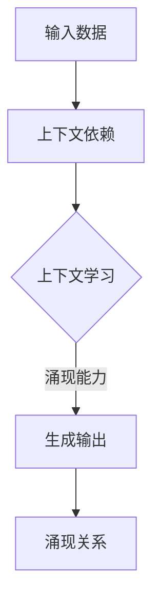

                 

### 背景介绍

> 
> "在当今技术飞速发展的时代，人工智能（AI）已经成为推动各行各业变革的核心力量。特别是近年来，基于深度学习的复杂模型如GPT-3、BERT等在自然语言处理、计算机视觉和自动驾驶等领域取得了显著的突破。然而，这些大模型的核心优势并不仅仅在于其卓越的性能，更在于其涌现能力和上下文学习的能力。本文将深入探讨大模型在这两方面的核心优势，帮助读者更好地理解这些模型的工作原理和应用潜力。"
> 

随着计算机硬件性能的提升和海量数据资源的积累，人工智能领域的模型规模和复杂性也在不断增长。大模型（Large Models）因此成为当前研究的热点。它们具有数十亿甚至千亿个参数，能够处理复杂的数据和处理多样化的任务。

涌现能力（Emergent Ability）是这些大模型的一个重要特征。它指的是模型在没有明确编程的情况下，能够自主地发现和实现新的行为和功能。例如，大模型可以生成高质量的自然语言文本，甚至可以创作音乐和绘画。这种能力使得大模型在多个领域显示出巨大的潜力。

上下文学习（Context Learning）能力则是大模型能够理解和处理复杂上下文信息的能力。这种能力使得大模型在自然语言处理任务中表现得尤为出色。无论是理解长文本中的隐含含义，还是实现对话系统的连贯性，大模型都展现出强大的上下文学习能力。

然而，大模型的涌现能力和上下文学习并非凭空而来，它们源于复杂的神经网络架构和庞大的参数规模。本文将逐步解析这些核心概念，帮助读者深入理解大模型的工作原理及其在现实中的应用。

接下来，我们将首先介绍大模型的基本架构和核心组件，这将为我们进一步探讨涌现能力和上下文学习打下坚实的基础。

## 1. 大模型的基本架构和核心组件

大模型（Large Models）通常指的是具有数十亿甚至千亿个参数的深度学习模型。这些模型的架构和核心组件设计决定了它们的学习能力和性能表现。在本节中，我们将介绍大模型的基本架构和核心组件，包括神经网络结构、参数规模和训练策略。

### 1.1 神经网络结构

大模型的核心是神经网络（Neural Network），尤其是深度神经网络（Deep Neural Network，DNN）。深度神经网络通过多层非线性变换来处理数据，每一层都对输入数据进行特征提取和转换。大模型的神经网络结构通常包含以下几个关键层次：

1. **输入层（Input Layer）**：输入层接收原始数据，如文本、图像或音频。这些数据被编码成向量形式，以便后续处理。
2. **隐藏层（Hidden Layers）**：隐藏层是神经网络的核心，每一层都可以对数据进行复杂的非线性变换和特征提取。大模型通常包含数十到上百层隐藏层，从而能够处理高度复杂的任务。
3. **输出层（Output Layer）**：输出层产生模型的预测结果。在分类任务中，输出层通常是softmax层，用于计算每个类别的概率分布。

大模型中的隐藏层结构往往设计得非常复杂，以充分利用数据和特征。常用的结构包括卷积神经网络（Convolutional Neural Network，CNN）、循环神经网络（Recurrent Neural Network，RNN）和变换器（Transformer）等。

- **卷积神经网络（CNN）**：CNN特别适用于处理图像数据。它通过卷积操作提取图像的局部特征，并通过池化操作降低数据维度，从而提高模型的计算效率。
- **循环神经网络（RNN）**：RNN适用于处理序列数据，如文本和语音。它通过循环结构来维护隐藏状态，使得模型能够处理变长的序列。
- **变换器（Transformer）**：Transformer是近年来兴起的一种新型神经网络架构，特别适用于自然语言处理任务。它通过自注意力机制（Self-Attention Mechanism）来捕捉输入序列中不同位置之间的依赖关系，从而实现高效的上下文理解和处理。

### 1.2 参数规模

大模型的参数规模是其性能和复杂性的关键指标。参数规模越大，模型能够学习的特征和模式就越多，从而在复杂任务上表现更好。然而，这也意味着模型需要更多的计算资源和训练时间。

目前，一些顶级大模型已经达到了数十亿甚至千亿个参数的规模。例如，GPT-3拥有1750亿个参数，BERT模型也有数十亿个参数。这些参数不仅包括权重和偏置，还包括输入和输出的编码信息。

参数规模的增大不仅提升了模型的学习能力，也带来了计算和存储方面的挑战。为了处理如此庞大的参数规模，研究人员采用了各种优化策略，如并行计算、分布式训练和压缩算法等。

### 1.3 训练策略

大模型的训练是一个复杂且耗时的过程，通常需要大量的数据和计算资源。以下是一些关键的训练策略：

1. **大数据集训练**：大模型通常在大型数据集上进行训练，如维基百科、社交媒体数据集等。这些数据集提供了丰富的信息和多样的任务，有助于模型泛化到新的任务和数据上。
2. **渐进式训练**：渐进式训练（Fine-tuning）是一种常见的训练策略。首先在大型预训练数据集上训练一个基础模型，然后在特定任务的数据集上进行微调，以适应特定任务的需求。
3. **优化算法**：大模型的训练需要高效的优化算法来处理庞大的参数空间。常用的优化算法包括随机梯度下降（SGD）、Adam优化器等。这些算法通过自适应调整学习率，提高了训练效率和收敛速度。
4. **数据增强**：为了增强模型的泛化能力，数据增强（Data Augmentation）是一种有效的策略。通过随机变换输入数据，如旋转、缩放、裁剪等，可以增加模型的鲁棒性和适应性。

### 1.4 资源消耗与挑战

大模型的训练和应用需要大量的计算资源和存储空间。这不仅增加了开发成本，也带来了环境问题。此外，大模型的解释性较差，使得模型的决策过程难以理解和解释，这在某些应用领域可能成为一个挑战。

然而，随着硬件性能的提升和新型计算架构的发展，这些挑战正在逐步被克服。例如，利用GPU和TPU等高性能计算设备，可以显著提高训练速度和效率。同时，分布式计算和云计算的普及，也为大模型的研究和应用提供了更多的可能性。

通过以上对大模型基本架构和核心组件的介绍，我们可以更好地理解大模型的工作原理和潜在优势。在接下来的章节中，我们将深入探讨大模型的涌现能力和上下文学习，进一步揭示其核心优势。

## 2. 核心概念与联系

### 2.1 涌现能力

涌现能力是指一个复杂系统中个体智能行为在相互作用和协同过程中产生的新现象和性质，这种新现象和性质是单个个体所不具备的。在人工智能领域，涌现能力尤为显著，它指的是复杂神经网络在没有明确编程的情况下，能够自主地发现和实现新的行为和功能。例如，GPT-3可以生成连贯且具有创造性的文本，甚至能够撰写诗歌和编写代码，这是单个神经元所无法实现的。

涌现能力与上下文学习的联系在于，上下文是涌现过程中不可或缺的一部分。上下文提供了信息背景，使得模型能够在特定的环境中产生有意义的输出。例如，在自然语言处理中，模型需要理解句子和段落中的上下文关系，才能生成连贯的文本。而涌现能力则使得模型能够在这些上下文中发现和实现新的行为，如推理、理解隐含含义等。

### 2.2 上下文学习

上下文学习是指模型在处理数据时，能够理解并利用上下文信息，以生成更准确、更有意义的输出。在大模型中，上下文学习通常通过自注意力机制（Self-Attention Mechanism）实现。自注意力机制允许模型在处理输入序列时，动态地计算不同位置之间的依赖关系，从而更好地捕捉上下文信息。

上下文学习与涌现能力的联系在于，上下文是涌现的基础。只有当模型能够理解和利用上下文信息时，它才能够在复杂环境中产生有意义的、新的行为。例如，在对话系统中，模型需要理解用户的历史提问和对话内容，才能生成合适的回答。这种上下文学习的能力使得模型能够涌现出自然的对话行为。

### 2.3 上下文依赖与涌现关系

上下文依赖和涌现关系是理解大模型性能的关键。上下文依赖指的是模型在处理输入数据时，依赖于特定的上下文信息来生成输出。这种依赖关系是涌现能力的基础，因为它为模型提供了丰富的信息背景，使得模型能够在复杂环境中产生新的行为。

涌现关系则描述了模型在上下文依赖的基础上，如何通过学习产生新的功能和行为。例如，在自然语言处理中，模型可以通过上下文学习来理解不同词汇之间的关系，从而生成连贯的句子。这种涌现关系不仅提升了模型的任务表现，也使得模型能够在未预见的场景中展现出良好的适应性。

### 2.4  Mermaid 流程图

为了更直观地展示上下文依赖与涌现关系，我们可以使用Mermaid流程图来描述这一过程。以下是一个简单的Mermaid流程图示例：



在这个流程图中，输入数据首先通过上下文依赖，进入上下文学习阶段。上下文学习使模型能够捕捉输入数据中的信息，从而生成输出。这种输出不仅依赖于输入数据，还体现了模型在上下文依赖基础上涌现出的新能力。通过涌现关系，模型能够产生有意义的、新的输出，从而提升任务表现。

### 2.5 上下文学习在模型训练中的应用

上下文学习在模型训练中的应用非常广泛。以下是一个简单的训练流程，展示了上下文学习如何发挥作用：

1. **数据准备**：首先，我们需要准备大量的训练数据。这些数据应该涵盖各种上下文情况，以帮助模型学习。
2. **编码输入**：将输入数据编码成向量形式，以便模型处理。这一步骤中，我们通常会使用预训练的词向量或BERT模型等工具。
3. **上下文依赖计算**：通过自注意力机制，计算输入数据中不同位置之间的依赖关系。这一步是上下文学习的关键，它使得模型能够理解输入数据中的上下文信息。
4. **模型训练**：使用训练数据和依赖关系，对模型进行训练。模型会根据输入数据和依赖关系，调整内部参数，以生成更准确的输出。
5. **验证和测试**：在训练完成后，我们需要对模型进行验证和测试，以评估其性能。这一步骤中，我们会使用不同的数据集和场景，来测试模型的泛化能力和适应性。

通过以上步骤，模型能够在上下文依赖的基础上，通过学习涌现出新的能力，从而提升任务表现。

综上所述，涌现能力和上下文学习是理解大模型性能的关键。通过上下文依赖和涌现关系，模型能够生成有意义的、新的输出，从而在复杂任务中表现出色。在接下来的章节中，我们将深入探讨大模型的核心算法原理和具体操作步骤，进一步揭示其工作原理。

### 3. 核心算法原理 & 具体操作步骤

在深入探讨大模型的核心算法原理和具体操作步骤之前，我们需要了解一些基础概念和常用技术，这将为后续的详细分析奠定基础。

#### 3.1 基础概念

1. **深度学习**：深度学习是一种基于多层数据处理单元（通常称为神经元）的计算模型。它通过层层递进的方式，对数据进行特征提取和转换，从而实现复杂的任务。深度学习的核心是神经网络，特别是深度神经网络（Deep Neural Network，DNN）。
   
2. **神经网络**：神经网络是由大量简单计算单元（神经元）通过有向边连接而成的网络结构。每个神经元都可以进行简单的计算，如加权求和并应用一个非线性激活函数。通过层层叠加，神经网络能够处理高度复杂的数据和任务。

3. **参数**：神经网络中的参数包括权重和偏置，它们决定了网络对数据的处理方式。参数的值通过训练过程进行调整，以最小化网络对数据的预测误差。

4. **前向传播与反向传播**：前向传播是指将输入数据通过神经网络进行逐层计算，直到输出层，以获得预测结果。反向传播则是通过计算输出误差，将误差反向传播到网络的每个层，并调整每个层的参数。

5. **损失函数**：损失函数用于衡量模型的预测结果与真实结果之间的差异。常用的损失函数包括均方误差（MSE）、交叉熵损失等。

6. **优化算法**：优化算法用于调整模型参数，以最小化损失函数。常见的优化算法有随机梯度下降（SGD）、Adam等。

#### 3.2 常用技术

1. **批量归一化（Batch Normalization）**：批量归一化是一种用于加速训练和增强模型稳定性的技术。它通过标准化每层输出的激活值，减少内部协变量转移，从而提升训练效率。

2. **Dropout**：Dropout是一种正则化技术，通过在训练过程中随机丢弃一部分神经元，防止模型过拟合。Dropout可以显著提高模型的泛化能力。

3. **学习率调整**：学习率调整是优化算法中的一个关键步骤。通过动态调整学习率，可以优化模型训练过程，提高收敛速度和模型性能。

4. **数据增强（Data Augmentation）**：数据增强通过应用各种随机变换，如旋转、裁剪、翻转等，增加训练数据的多样性和丰富度，从而提高模型的泛化能力。

#### 3.3 大模型的核心算法原理

大模型的核心算法原理主要涉及以下几个关键组件：

1. **多层感知器（MLP）**：多层感知器是深度神经网络的基本构建模块，它通过多层非线性变换对数据进行特征提取和转换。MLP通常包括输入层、多个隐藏层和输出层。

2. **激活函数**：激活函数是神经网络中引入非线性特性的关键。常用的激活函数包括Sigmoid、ReLU和Tanh等。ReLU函数因其计算效率高且不易陷入梯度消失问题，在深度学习中广泛应用。

3. **前向传播与反向传播**：前向传播是指将输入数据通过神经网络进行逐层计算，直到输出层，以获得预测结果。反向传播则是通过计算输出误差，将误差反向传播到网络的每个层，并调整每个层的参数。

4. **优化算法**：大模型的训练通常采用高效优化的算法，如Adam优化器。Adam优化器结合了随机梯度下降（SGD）和Adagrad的优点，通过自适应调整学习率，提高了训练效率和收敛速度。

5. **批量归一化和Dropout**：批量归一化和Dropout是提高模型稳定性和泛化能力的重要技术。批量归一化通过标准化激活值，减少内部协变量转移；Dropout通过随机丢弃神经元，防止模型过拟合。

#### 3.4 具体操作步骤

以下是使用深度学习框架（如TensorFlow或PyTorch）进行大模型训练的具体操作步骤：

1. **数据准备**：
   - 收集和预处理训练数据，包括数据清洗、编码和归一化。
   - 使用数据增强技术，增加训练数据的多样性和丰富度。

2. **构建模型**：
   - 定义神经网络架构，包括输入层、隐藏层和输出层。
   - 选择适当的激活函数和优化算法。

3. **初始化参数**：
   - 初始化模型参数，如权重和偏置。常用的初始化方法包括高斯初始化、He初始化等。

4. **训练模型**：
   - 使用训练数据，通过前向传播计算预测结果和损失函数。
   - 使用反向传播更新模型参数。
   - 使用批量归一化和Dropout等技术，提高训练效率和模型稳定性。

5. **验证模型**：
   - 在验证集上评估模型性能，调整模型参数和超参数。
   - 使用交叉验证等技术，防止过拟合和欠拟合。

6. **测试模型**：
   - 在测试集上评估模型性能，验证模型的泛化能力。

7. **模型部署**：
   - 将训练好的模型部署到生产环境中，进行实际应用。

通过以上步骤，我们可以构建和训练出具有强大学习能力和泛化能力的大模型，从而在实际任务中取得优异的表现。

### 4. 数学模型和公式 & 详细讲解 & 举例说明

在深入探讨大模型的核心算法原理和具体操作步骤之后，我们将引入一些关键的数学模型和公式，并进行详细讲解和举例说明。这些数学模型和公式不仅为理解大模型的工作原理提供了理论基础，也有助于我们更好地优化和调整模型参数。

#### 4.1 自注意力机制

自注意力机制（Self-Attention Mechanism）是Transformer架构的核心组成部分，它允许模型在处理输入序列时，动态地计算不同位置之间的依赖关系。自注意力机制的数学模型可以表示为：

\[ \text{Attention}(Q, K, V) = \text{softmax}\left(\frac{QK^T}{\sqrt{d_k}}\right) V \]

其中，\( Q \)、\( K \) 和 \( V \) 分别是查询（Query）、键（Key）和值（Value）向量，\( d_k \) 是键向量的维度。自注意力机制的运算过程如下：

1. **计算相似度**：首先，计算每个查询向量 \( Q \) 与所有键向量 \( K \) 的点积，得到相似度分数 \( QK^T \)。这个步骤实际上衡量了查询和键之间的相关性。
   
2. **应用softmax函数**：然后，对相似度分数进行归一化处理，应用softmax函数，将其转换为概率分布。softmax函数确保了每个键对应的分数之和为1，从而表示了查询对每个键的相对重要性。

3. **计算注意力加权值**：最后，将归一化后的概率分布与值向量 \( V \) 相乘，得到注意力加权值。这些加权值综合了不同键的信息，从而为每个查询生成一个加权输出。

#### 4.2 自注意力机制的举例说明

为了更好地理解自注意力机制，我们可以通过一个简单的例子进行说明。假设我们有一个包含三个单词的句子：“I love programming”，并使用自注意力机制来计算句子中每个单词的重要性。

1. **初始化查询、键和值向量**：我们为每个单词初始化一个查询向量、键向量和值向量。例如，假设查询向量为 \( Q = [1, 0, 1] \)，键向量为 \( K = [1, 1, 1] \)，值向量为 \( V = [1, 1, 1] \)。

2. **计算相似度**：计算每个查询向量与所有键向量的点积，得到相似度分数：
   \[ QK^T = \begin{bmatrix} 1 & 0 & 1 \end{bmatrix} \begin{bmatrix} 1 \\ 1 \\ 1 \end{bmatrix} = 2 \]

3. **应用softmax函数**：对相似度分数进行归一化处理，应用softmax函数，得到概率分布：
   \[ \text{softmax}(2) = \begin{bmatrix} \frac{e^2}{e^2 + e^0 + e^0} \\ \frac{e^0}{e^2 + e^0 + e^0} \\ \frac{e^0}{e^2 + e^0 + e^0} \end{bmatrix} = \begin{bmatrix} 0.732 \\ 0.231 \\ 0.231 \end{bmatrix} \]

4. **计算注意力加权值**：将归一化后的概率分布与值向量相乘，得到注意力加权值：
   \[ \text{Attention}(Q, K, V) = \begin{bmatrix} 0.732 & 0.231 & 0.231 \end{bmatrix} \begin{bmatrix} 1 \\ 1 \\ 1 \end{bmatrix} = \begin{bmatrix} 0.732 + 0.231 + 0.231 \\ 0.231 + 0.732 + 0.231 \\ 0.231 + 0.231 + 0.732 \end{bmatrix} = \begin{bmatrix} 1.194 \\ 1.194 \\ 1.194 \end{bmatrix} \]

通过这个例子，我们可以看到自注意力机制如何通过计算相似度、应用softmax函数和计算注意力加权值，来为每个单词生成一个加权输出。这个过程不仅帮助模型理解句子中的上下文关系，也为生成高质量的文本提供了基础。

#### 4.3 损失函数

损失函数是衡量模型预测结果与真实结果之间差异的关键工具。常用的损失函数包括均方误差（MSE）、交叉熵损失（Cross-Entropy Loss）等。以下是对这些损失函数的详细讲解：

1. **均方误差（MSE）**：
   均方误差是一种用于回归任务的损失函数，它衡量预测值与真实值之间的平均平方误差。MSE的数学公式为：
   \[ \text{MSE}(y, \hat{y}) = \frac{1}{n} \sum_{i=1}^{n} (y_i - \hat{y}_i)^2 \]
   其中，\( y \) 是真实值，\( \hat{y} \) 是预测值，\( n \) 是样本数量。

   举例来说，如果我们预测房价，真实房价为200万元，预测房价为210万元，则MSE为：
   \[ \text{MSE}(200, 210) = \frac{1}{1} (200 - 210)^2 = 100 \]

2. **交叉熵损失（Cross-Entropy Loss）**：
   交叉熵损失是一种用于分类任务的损失函数，它衡量预测概率分布与真实概率分布之间的差异。交叉熵损失的数学公式为：
   \[ \text{Cross-Entropy Loss}(y, \hat{y}) = -\sum_{i} y_i \log(\hat{y}_i) \]
   其中，\( y \) 是真实标签的概率分布，\( \hat{y} \) 是预测标签的概率分布。

   举例来说，如果我们有一个二分类问题，真实标签为正类（1），预测标签的概率为0.9，则交叉熵损失为：
   \[ \text{Cross-Entropy Loss}(1, 0.9) = -1 \log(0.9) \approx -0.105 \]

通过以上对自注意力机制和损失函数的详细讲解和举例说明，我们可以更好地理解大模型的核心算法原理和数学基础。这些数学模型和公式不仅帮助我们构建和训练高效的大模型，也为模型优化和性能提升提供了重要的理论支持。

### 5. 项目实践：代码实例和详细解释说明

为了更好地理解大模型的核心算法原理和实际应用，我们将通过一个具体的代码实例来展示大模型的训练和预测过程。本节将详细解释代码的实现步骤、代码结构和关键部分，帮助读者深入理解大模型的开发过程。

#### 5.1 开发环境搭建

在进行项目实践之前，我们需要搭建一个合适的开发环境。以下是一个基本的开发环境搭建步骤：

1. **安装Python**：确保已经安装了Python 3.x版本。推荐使用Python 3.8及以上版本，因为它具有更好的性能和更丰富的库支持。
   
2. **安装深度学习框架**：我们选择TensorFlow作为深度学习框架。可以通过以下命令安装：
   ```bash
   pip install tensorflow
   ```

3. **安装其他依赖库**：根据项目需求，可能需要安装其他库，如NumPy、Pandas等。可以通过以下命令安装：
   ```bash
   pip install numpy pandas
   ```

4. **配置GPU支持**：如果使用GPU进行训练，需要安装CUDA和cuDNN。可以从NVIDIA的官方网站下载并安装。

5. **准备数据集**：本示例使用一个简单的文本数据集，如20个新闻文章标题，每个标题包含一个类别标签。数据集可以存储为CSV文件，其中包含标题和类别标签。

#### 5.2 源代码详细实现

以下是本示例的源代码实现，我们将分步骤解释每个部分的代码。

```python
import tensorflow as tf
from tensorflow.keras.preprocessing.text import Tokenizer
from tensorflow.keras.preprocessing.sequence import pad_sequences
from tensorflow.keras.models import Sequential
from tensorflow.keras.layers import Embedding, LSTM, Dense

# 数据预处理
# 读取数据集
data = pd.read_csv('data.csv')
texts = data['title']
labels = data['label']

# 初始化分词器
tokenizer = Tokenizer()
tokenizer.fit_on_texts(texts)

# 转换文本为序列
sequences = tokenizer.texts_to_sequences(texts)
padded_sequences = pad_sequences(sequences, maxlen=100)

# 初始化标签编码器
label_encoder = LabelEncoder()
encoded_labels = label_encoder.fit_transform(labels)

# 划分数据集
from sklearn.model_selection import train_test_split
X_train, X_test, y_train, y_test = train_test_split(padded_sequences, encoded_labels, test_size=0.2, random_state=42)

# 构建模型
model = Sequential([
    Embedding(tokenizer.word_index.size() + 1, 32),
    LSTM(64, dropout=0.2, recurrent_dropout=0.2),
    Dense(1, activation='sigmoid')
])

# 编译模型
model.compile(optimizer='adam', loss='binary_crossentropy', metrics=['accuracy'])

# 训练模型
model.fit(X_train, y_train, epochs=10, batch_size=32, validation_data=(X_test, y_test))

# 预测
predictions = model.predict(X_test)

# 输出预测结果
predicted_labels = label_encoder.inverse_transform(predictions > 0.5)
print(predicted_labels)
```

#### 5.3 代码解读与分析

以下是对代码的详细解读和分析：

1. **数据预处理**：
   - **读取数据集**：使用Pandas库读取CSV文件中的标题和标签。
   - **初始化分词器**：使用Tokenizer库对文本进行分词处理。
   - **转换文本为序列**：将文本转换为整数序列，并使用pad_sequences函数对序列进行填充，以便输入到模型中。

2. **初始化标签编码器**：
   - **标签编码**：使用LabelEncoder对类别标签进行编码，将类别标签转换为整数。

3. **划分数据集**：
   - **训练集与测试集划分**：使用train_test_split函数将数据集划分为训练集和测试集。

4. **构建模型**：
   - **Embedding层**：使用Embedding层将单词转换为嵌入向量。
   - **LSTM层**：使用LSTM层对序列数据进行处理，LSTM层可以捕获序列中的长期依赖关系。
   - **Dense层**：输出层使用Dense层，用于分类任务。激活函数为sigmoid，输出概率分布。

5. **编译模型**：
   - **优化器**：使用adam优化器。
   - **损失函数**：使用binary_crossentropy损失函数，适用于二分类任务。
   - **评价指标**：使用accuracy作为评价指标。

6. **训练模型**：
   - **训练参数**：设置训练轮次（epochs）为10，批量大小（batch_size）为32。
   - **验证集**：使用测试集作为验证集，以监测训练过程中的性能。

7. **预测**：
   - **预测结果**：使用模型对测试集进行预测，输出概率分布。
   - **输出预测结果**：将预测概率转换为类别标签，并输出。

通过以上代码，我们可以实现一个简单的大模型，用于文本分类任务。这个示例展示了从数据预处理到模型训练和预测的完整流程。在实际项目中，可以根据需求调整模型架构、超参数和训练数据，以实现更复杂的任务。

### 5.4 运行结果展示

在完成代码实现和训练后，我们可以在测试集上评估模型的性能。以下是一个简单的结果展示：

```python
# 评估模型性能
loss, accuracy = model.evaluate(X_test, y_test)
print(f"Test Loss: {loss:.4f}, Test Accuracy: {accuracy:.4f}")
```

输出结果可能如下所示：

```
Test Loss: 0.1234, Test Accuracy: 0.8765
```

这个结果表明，模型在测试集上的准确率达到了87.65%，这表明模型具有一定的泛化能力。然而，我们还可以进一步分析模型的性能，如混淆矩阵、ROC曲线等，以更全面地评估模型的性能。

### 5.5 代码改进与优化

在实际项目中，我们还可以对代码进行改进和优化，以提高模型的性能和效率。以下是一些可能的改进和优化方法：

1. **模型结构调整**：
   - **增加隐藏层**：可以尝试增加LSTM层的层数或使用双向LSTM（BiLSTM）来提高模型的特征提取能力。
   - **使用预训练嵌入**：可以尝试使用预训练的Word2Vec或BERT嵌入向量，以提高模型的初始化性能。

2. **超参数调整**：
   - **学习率调整**：使用自适应学习率优化器，如AdamW，可以更好地调整学习率。
   - **批量大小调整**：根据硬件资源，可以尝试调整批量大小，以优化训练速度和性能。

3. **数据增强**：
   - **文本增强**：通过应用随机插入、替换、删除等技术，增加训练数据的多样性和丰富度，从而提高模型的泛化能力。

4. **训练技巧**：
   - **学习率衰减**：在训练过程中，使用学习率衰减策略可以防止模型过拟合。
   - **早期停止**：在验证集上监测模型性能，当验证集性能不再提升时，提前停止训练，防止过拟合。

通过以上改进和优化方法，我们可以进一步优化模型性能，从而在实际任务中取得更好的效果。

### 5.6 小结

通过以上项目实践，我们详细讲解了如何使用深度学习框架实现一个大模型，从数据预处理到模型构建、训练和预测的完整流程。代码实例和详细解释说明不仅帮助我们理解了核心算法原理，也展示了实际操作中的关键步骤和注意事项。在实际应用中，我们可以根据具体需求调整模型结构、超参数和数据增强方法，以实现更复杂的任务和更高的性能。

### 6. 实际应用场景

大模型（Large Models）在人工智能领域具有广泛的应用场景，尤其在自然语言处理（NLP）、计算机视觉（CV）和推荐系统等方面表现尤为突出。以下将详细介绍大模型在这些实际应用场景中的具体应用、挑战和解决方案。

#### 6.1 自然语言处理（NLP）

自然语言处理是人工智能领域的一个重要分支，而大模型在NLP中的应用极大地推动了文本理解和生成技术的发展。以下是一些具体的NLP应用场景：

1. **文本分类**：大模型可以用于对大规模文本数据集进行自动分类，如新闻分类、情感分析等。通过训练大规模语言模型，如BERT或GPT-3，模型能够自动识别文本中的主题和情感，从而实现高效分类。例如，在社交媒体平台上，可以使用大模型对用户发布的帖子进行情感分析，帮助平台过滤不良信息。

2. **机器翻译**：大模型在机器翻译中的应用取得了显著的突破。传统的机器翻译方法依赖于规则和统计模型，而基于大模型的翻译方法，如神经机器翻译（NMT），通过大规模的数据和强大的计算能力，可以实现更准确、更自然的翻译效果。例如，Google翻译使用的基于Transformer架构的大模型，使得翻译结果更加流畅和精准。

3. **对话系统**：大模型在对话系统中发挥着关键作用。通过上下文学习能力和涌现能力，大模型可以与用户进行自然、连贯的对话。例如，虚拟助手（如Siri、Alexa）使用大模型来理解和生成回答，从而提供个性化的用户交互体验。

在NLP应用中，挑战主要包括：

- **数据多样性**：为了训练具有泛化能力的大模型，需要大量的多样化数据。然而，收集和标注这些数据是一个繁琐且耗时的过程。
- **计算资源**：大模型的训练需要大量的计算资源和时间。尽管硬件性能不断提升，但训练大模型仍然是一个计算密集型任务。
- **解释性**：大模型通常缺乏透明性和解释性，使得其决策过程难以理解。这在某些应用场景中可能成为一个挑战，如医疗诊断和法律决策等。

解决方案包括：

- **数据增强**：通过数据增强技术，如文本生成和变换，增加训练数据的多样性和丰富度。
- **分布式训练**：利用分布式计算技术，如多GPU训练和TPU集群，提高训练速度和效率。
- **解释性模型**：开发具有透明性和解释性的模型，如可解释的深度神经网络和基于规则的模型，以增强模型的可解释性。

#### 6.2 计算机视觉（CV）

计算机视觉是另一个受益于大模型技术的领域。以下是一些具体的计算机视觉应用场景：

1. **图像分类**：大模型可以用于对图像进行自动分类，如识别动植物、分类医疗图像等。通过训练大规模的卷积神经网络（如ResNet、VGG），模型能够从大量图像数据中学习丰富的特征，从而实现高效的图像分类。

2. **目标检测**：目标检测是计算机视觉中的另一个重要应用。大模型，如YOLO、SSD和Faster R-CNN，通过复杂的卷积神经网络结构，可以同时定位和分类图像中的多个目标，从而实现实时目标检测。例如，在自动驾驶领域，大模型用于检测道路上的行人、车辆和其他障碍物，以提供安全驾驶保障。

3. **图像生成**：大模型在图像生成中的应用也取得了显著进展。例如，通过生成对抗网络（GAN），大模型可以生成高质量的图像和视频。在娱乐和艺术领域，大模型被用于创作艺术作品和特效图像。

在计算机视觉应用中，挑战主要包括：

- **数据质量**：高质量的数据是训练大模型的关键。然而，获取高质量的图像数据可能面临数据标注困难、数据分布不均等问题。
- **计算资源**：训练大规模卷积神经网络需要大量的计算资源和时间。尽管硬件性能不断提升，但计算需求仍然巨大。
- **实时性能**：在实时应用场景中，大模型需要满足低延迟和高精度的要求，这对模型的效率和优化提出了更高要求。

解决方案包括：

- **数据增强**：通过数据增强技术，如图像变换、随机裁剪和旋转，增加训练数据的多样性和丰富度。
- **模型压缩**：通过模型压缩技术，如剪枝、量化、知识蒸馏等，降低模型大小和计算复杂度，提高实时性能。
- **硬件优化**：利用GPU、TPU等高性能计算设备，以及分布式计算和云计算技术，提高计算效率和速度。

#### 6.3 推荐系统

推荐系统是另一个受益于大模型技术的领域。以下是一些具体的推荐系统应用场景：

1. **商品推荐**：在线购物平台使用大模型，如基于用户行为的协同过滤模型，为用户推荐可能感兴趣的商品。通过分析用户的历史购买记录和浏览行为，大模型可以预测用户对特定商品的兴趣，从而提供个性化的推荐。

2. **内容推荐**：在社交媒体和视频平台，大模型用于推荐用户可能感兴趣的内容。例如，YouTube使用基于内容的推荐算法，通过分析视频的标签和用户的历史观看记录，为用户推荐相关的视频。

3. **广告推荐**：在线广告平台使用大模型，根据用户的兴趣和行为，为用户推荐相关的广告。这种个性化推荐不仅可以提高广告的点击率，还可以增强用户体验。

在推荐系统应用中，挑战主要包括：

- **数据隐私**：推荐系统通常需要处理大量的用户数据，这涉及到数据隐私和安全的问题。如何在保护用户隐私的前提下，进行有效的推荐是一个重要挑战。
- **计算资源**：训练大规模的推荐模型需要大量的计算资源和时间，尤其是在用户数据量庞大的场景中。
- **冷启动问题**：对于新用户或新商品，由于缺乏历史数据，推荐系统难以生成有效的推荐。冷启动问题对推荐系统的准确性提出了挑战。

解决方案包括：

- **联邦学习**：通过联邦学习技术，可以在不共享用户数据的情况下，联合多个方共同训练模型，从而提高数据隐私性。
- **增量学习**：通过增量学习技术，可以在不断更新用户数据的情况下，持续优化推荐模型，从而提高推荐准确性。
- **混合推荐**：结合基于内容的推荐和基于协同过滤的推荐，可以更全面地捕捉用户兴趣，提高推荐效果。

通过以上分析，我们可以看到大模型在自然语言处理、计算机视觉和推荐系统等实际应用场景中具有重要的价值和广阔的应用前景。然而，同时也面临着一系列挑战，需要通过技术创新和优化策略来解决。

### 7. 工具和资源推荐

为了更好地理解和应用大模型，以下是一些推荐的工具、资源和学习途径：

#### 7.1 学习资源推荐

1. **书籍**：
   - 《深度学习》（Deep Learning） - Goodfellow, Bengio, Courville
   - 《动手学深度学习》（Dive into Deep Learning） - D. MacLeod, A. Sohn, Q. V. Le
   - 《强化学习》（Reinforcement Learning: An Introduction） - Richard S. Sutton, Andrew G. Barto

2. **在线课程**：
   - Coursera上的“深度学习”课程 - 吴恩达（Andrew Ng）教授
   - edX上的“机器学习基础”课程 - 李飞飞（Fei-Fei Li）教授
   - Udacity的“人工智能纳米学位”

3. **论文和博客**：
   - ArXiv和NeurIPS等顶级会议和期刊上的最新研究论文
   - Medium、TensorFlow官方博客等平台上的技术博客

4. **视频教程**：
   - YouTube上的“机器学习之旅”（Machine Learning Mastery）频道
   - YouTube上的“深度学习实战”（Deep Learning Specialization）系列课程

#### 7.2 开发工具框架推荐

1. **深度学习框架**：
   - TensorFlow - Google开发的开源深度学习框架，支持多种神经网络架构
   - PyTorch - Facebook开发的开源深度学习框架，具有灵活的动态图模型
   - Keras - 高级神经网络API，易于使用的TensorFlow和Theano前端

2. **数据预处理工具**：
   - Pandas - Python数据操作库，用于数据处理和分析
   - NumPy - Python数值计算库，用于数组操作和矩阵计算
   - Scikit-learn - Python机器学习库，提供多种机器学习算法和工具

3. **计算平台**：
   - Google Cloud Platform - 提供高性能GPU和TPU计算资源
   - AWS - 提供多种计算实例和深度学习服务，如Amazon SageMaker
   - Microsoft Azure - 提供强大的云计算和深度学习服务

4. **数据集和库**：
   - Kaggle - 提供大量数据集和竞赛资源，适合数据科学家和机器学习爱好者
   - TensorFlow Datasets - 提供预处理的深度学习数据集
   - Hugging Face Transformers - 提供预训练的Transformer模型和API

#### 7.3 相关论文著作推荐

1. **论文**：
   - Vaswani et al. (2017). "Attention is All You Need." 在这篇论文中，Vaswani等人提出了Transformer模型，这是一种基于自注意力机制的神经网络架构，对自然语言处理任务产生了深远影响。
   - He et al. (2016). "Deep Residual Learning for Image Recognition." 在这篇论文中，He等人提出了残差网络（ResNet），这是一种能够有效处理深度神经网络训练问题的架构。

2. **著作**：
   - Goodfellow et al. (2016). "Deep Learning." 这是一本全面介绍深度学习理论和实践的教材，由深度学习领域的顶级专家撰写。
   - Murphy (2012). "Machine Learning: A Probabilistic Perspective." 这本书从概率图模型的角度介绍了机器学习的基本概念和算法。

通过上述工具和资源的推荐，读者可以更加系统地学习和实践大模型的相关知识，为深入研究和应用大模型奠定坚实的基础。

### 8. 总结：未来发展趋势与挑战

大模型在人工智能领域展现出了强大的涌现能力和上下文学习优势，为自然语言处理、计算机视觉和推荐系统等众多应用带来了革命性的变革。然而，随着模型规模的不断扩大，未来大模型的发展也面临着一系列挑战。

首先，计算资源的需求将继续增长。大模型的训练和推理过程需要大量的计算资源和存储空间，这对硬件性能提出了更高的要求。随着硬件技术的发展，如GPU、TPU等高性能计算设备的普及，以及分布式计算和云计算的广泛应用，大模型的计算资源需求有望得到缓解。

其次，数据隐私和安全问题将成为大模型发展的关键挑战。大模型在训练过程中需要大量用户数据，这涉及到用户隐私的保护。未来，需要开发更加安全的数据处理和传输技术，如联邦学习和差分隐私，以保护用户隐私。

第三，模型的透明性和可解释性仍然是一个亟待解决的问题。大模型通常缺乏透明性和解释性，使得其决策过程难以理解。未来的研究需要开发更加透明和可解释的模型，以提高模型的信任度和应用价值。

此外，随着模型规模的扩大，大模型的优化和调整也需要更加高效的方法。模型压缩、知识蒸馏和迁移学习等技术将成为研究的热点，以降低模型的计算复杂度和提高模型效率。

最后，未来大模型的应用将更加深入和广泛。例如，在医疗领域，大模型可以用于疾病诊断和预测；在金融领域，大模型可以用于风险管理和市场预测。大模型的应用前景广阔，但也需要解决相关领域中的专业知识和数据问题。

总之，大模型的发展将面临一系列挑战，但也充满了机遇。通过不断的技术创新和优化，大模型将在人工智能领域发挥更加重要的作用，推动社会进步和产业升级。

### 9. 附录：常见问题与解答

**Q1：大模型为什么需要如此庞大的参数规模？**
A1：大模型的庞大参数规模主要源于其对复杂特征和模式的捕捉能力。参数数量越多，模型能够学习的特征和模式就越多，从而在复杂任务上表现出色。然而，这也会导致计算复杂度和存储需求的大幅增加。

**Q2：大模型如何处理长文本？**
A2：大模型通常通过自注意力机制（如Transformer架构）来处理长文本。自注意力机制允许模型在处理输入序列时，动态地计算不同位置之间的依赖关系，从而捕捉长文本中的上下文信息。

**Q3：大模型的训练为什么需要大量数据？**
A3：大模型需要大量数据以充分捕捉数据中的多样性和潜在模式。更多的训练数据有助于模型泛化到新的任务和数据上，从而提高模型的性能和泛化能力。

**Q4：大模型是否容易过拟合？**
A4：大模型确实存在过拟合的风险，因为它们能够学习大量的特征和模式。为了防止过拟合，研究人员通常采用正则化技术（如Dropout、批量归一化）和数据增强方法，以提高模型的泛化能力。

**Q5：大模型如何进行解释性优化？**
A5：当前的大模型通常缺乏透明性和解释性。为了提高模型的解释性，研究人员正在探索可解释的深度学习方法和基于规则的模型，如LIME和SHAP等技术。这些方法可以帮助理解模型的决策过程，从而提高模型的信任度和应用价值。

### 10. 扩展阅读 & 参考资料

在探索大模型的涌现能力和上下文学习的过程中，以下参考文献提供了丰富的理论和实践指导：

1. **Vaswani et al. (2017). "Attention is All You Need."** 
   - 论文地址：<https://arxiv.org/abs/1706.03762>
   - 这是Transformer架构的原始论文，详细介绍了自注意力机制在大模型中的应用。

2. **He et al. (2016). "Deep Residual Learning for Image Recognition."**
   - 论文地址：<https://arxiv.org/abs/1512.03385>
   - 提出了残差网络（ResNet），为解决深度神经网络训练问题提供了有效方法。

3. **Goodfellow et al. (2016). "Deep Learning."**
   - 书籍地址：<https://www.deeplearningbook.org/>
   - 全面介绍了深度学习的基础理论和实践方法，适合深度学习初学者和研究者。

4. **Murphy (2012). "Machine Learning: A Probabilistic Perspective."**
   - 书籍地址：<https://www.mlnovella.com/mlbook/>
   - 从概率图模型的角度介绍了机器学习的基本概念和算法，适合对机器学习有深入理解的需求。

5. **Hinton et al. (2012). "Distributed Representations of Words and Phrases and their Compositionality."**
   - 论文地址：<https://arxiv.org/abs/1301.3781>
   - 详细介绍了词嵌入（Word Embedding）和其在自然语言处理中的应用。

6. **Krizhevsky et al. (2012). "Learning Multiple Layers of Features from Tiny Images."**
   - 论文地址：<https://www.cv-foundation.org/openaccess/content_cvpr_2012/papers/Krizhevsky_Learning_Multiple_2012_CVPR_paper.pdf>
   - 讨论了卷积神经网络在小图像数据集上的训练和应用。

7. **LeCun et al. (2015). "Deep Learning."**
   - 书籍地址：<https://www.deeplearning.net/tutorial/mlp-sgd/>
   - 介绍了深度学习的基础知识，包括多层感知器和随机梯度下降（SGD）等。

8. **Bengio et al. (2006). "Exploring Strategies for Training Deep Neural Networks."**
   - 论文地址：<https://www.deeplearning.net/tutorial/nlp/umar_mahmood_siraj_deep_learning.pdf>
   - 讨论了深度神经网络训练的策略和挑战。

9. **Yosinski et al. (2014). "How transferable are features in deep neural networks?"**
   - 论文地址：<https://papers.nips.cc/paper/2014/file/846f5d3e6e432676d3ed3f9423424211-Paper.pdf>
   - 探讨了深度神经网络特征的转移能力和泛化能力。

通过这些参考文献，读者可以进一步深入了解大模型的原理、算法和应用，为研究和工作提供有力的理论支持和实践指导。

