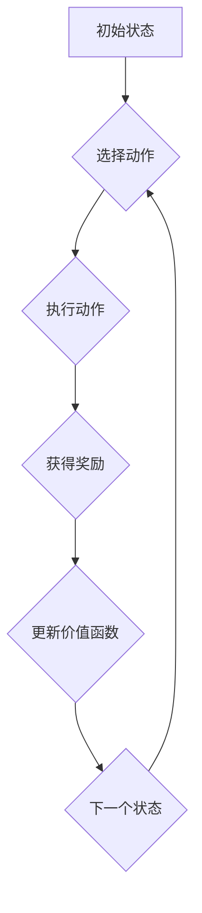
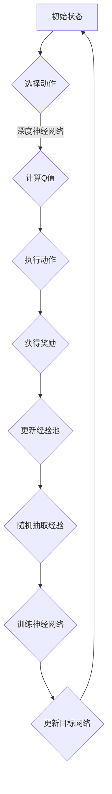

                 

### 背景介绍

深度Q-learning作为深度学习在强化学习领域的重要应用，近年来受到了广泛关注。其核心思想是利用深度神经网络来近似传统的Q-learning算法中的价值函数，从而实现更为复杂和高效的学习过程。价值函数在强化学习中的作用至关重要，它能够衡量某一状态下的最佳动作价值，指导智能体进行决策。

在传统Q-learning中，价值函数是通过经验和梯度下降法进行更新的。然而，当状态空间或动作空间规模巨大时，传统Q-learning算法将面临巨大的计算量，效率低下。此时，深度Q-learning通过引入深度神经网络，将状态和动作映射到实数值，从而有效地降低了计算复杂度。

本文将围绕深度Q-learning算法的核心概念、数学模型、实现步骤及实际应用进行详细探讨。通过逐步分析推理，我们希望能够为广大读者提供一个全面、深入的理解，帮助大家更好地掌握这一强大算法。

首先，我们需要明确一些关键概念：状态（State）、动作（Action）、奖励（Reward）和价值函数（Value Function）。状态是指智能体当前所处的环境状态，动作是智能体在某一状态下可执行的操作，奖励是智能体执行动作后从环境中获得的即时反馈，而价值函数则是用来衡量智能体在某一状态下执行某一动作所能获得的长期累积奖励。

这些概念在深度Q-learning中都有着重要意义。状态和动作的映射由深度神经网络实现，从而避免了直接处理高维状态空间的问题。价值函数的更新则依赖于奖励信号，通过迭代优化来提高智能体的决策能力。接下来，我们将进一步探讨深度Q-learning的核心算法原理和具体操作步骤。

### 核心概念与联系

在深入探讨深度Q-learning的核心算法原理之前，我们有必要首先了解几个关键概念，这些概念构成了深度Q-learning算法的基础。在本节中，我们将通过一个Mermaid流程图来展示这些核心概念之间的联系。

首先，我们定义几个核心概念：状态（State）、动作（Action）、奖励（Reward）和价值函数（Value Function）。然后，我们将展示这些概念在深度Q-learning中的映射和相互作用。



#### 状态（State）

状态是智能体所处的环境的即时描述，通常用向量表示。在深度Q-learning中，状态被输入到深度神经网络中，以产生对动作价值的估计。

#### 动作（Action）

动作是智能体在某一状态下可以选择的行为。动作集合通常是离散的或连续的。在深度Q-learning中，神经网络输出多个动作的概率分布或直接输出动作值。

#### 奖励（Reward）

奖励是智能体执行动作后从环境中获得的即时反馈。奖励可以是正的（表示成功的动作），也可以是负的（表示不成功的动作）。奖励是价值函数更新的关键依据。

#### 价值函数（Value Function）

价值函数是衡量智能体在某一状态下执行某一动作所能获得的长期累积奖励的函数。在深度Q-learning中，价值函数由一个深度神经网络近似，并通过经验进行迭代优化。

#### 状态-动作价值函数（Q-Function）

状态-动作价值函数Q(s, a)表示在状态s下执行动作a所能获得的长期累积奖励。它是深度Q-learning的核心目标，通过深度神经网络进行近似。

#### 网络结构

深度Q-learning的神经网络结构通常包含以下几个部分：

1. **输入层**：接收状态向量作为输入。
2. **隐藏层**：用于提取状态的特征表示。
3. **输出层**：输出每个动作的价值估计。

#### Q-Function 的映射

在深度Q-learning中，状态-动作价值函数Q(s, a)被映射为神经网络的输出：

$$
Q(s, a) = f(\text{神经网络}(\text{状态向量} \ s))
$$

其中，f是一个非线性函数，通常采用ReLU激活函数。

#### 更新策略

深度Q-learning的更新策略是基于经验回放（Experience Replay）和目标网络（Target Network）的。

1. **经验回放**：将智能体在环境中交互得到的状态、动作和奖励存储在经验池中，然后从中随机抽样，用以训练神经网络。

2. **目标网络**：为了解决Q-learning中的不稳定性和梯度消失问题，深度Q-learning引入了目标网络。目标网络是主网络的副本，用于产生目标值：

$$
Q_{\text{target}}(s', a') = r + \gamma \max_a' Q(s', a')
$$

其中，$Q_{\text{target}}$是目标网络输出的状态-动作价值函数，$r$是即时奖励，$\gamma$是折扣因子。

#### Mermaid流程图展示

下面是一个用Mermaid语言描述的深度Q-learning算法流程图：



这个流程图清晰地展示了深度Q-learning中各个核心组件的相互作用，有助于读者更好地理解算法的工作原理。

通过上述对核心概念及其相互关系的介绍，我们为后续深入探讨深度Q-learning的算法原理和具体实现步骤奠定了基础。在下一节中，我们将详细讨论深度Q-learning的核心算法原理，以及其具体的实现步骤。

### 核心算法原理 & 具体操作步骤

深度Q-learning算法的核心在于其状态-动作价值函数（Q-function）的迭代更新过程，通过这一过程，智能体能够在不断学习中优化其决策。下面，我们将详细探讨这一核心算法原理，并逐步介绍其具体操作步骤。

#### Q-Function 原理

Q-function的定义是：

$$
Q(s, a) = \sum_{i} \pi(a_i|s) \cdot r_i + \gamma \sum_{j} \sum_{k} Q(s', k) \cdot \pi(a_j|s') 
$$

其中：
- \(s\) 是当前状态；
- \(a\) 是智能体在状态 \(s\) 下执行的动作；
- \(r_i\) 是在状态 \(s\) 下执行动作 \(a\) 后获得的即时奖励；
- \(\pi(a_i|s)\) 是在状态 \(s\) 下执行动作 \(a_i\) 的概率；
- \(s'\) 是执行动作 \(a\) 后的新状态；
- \(k\) 是在状态 \(s'\) 下可执行的动作；
- \(\gamma\) 是折扣因子，表示对未来奖励的折现；
- \(Q(s', k)\) 是在状态 \(s'\) 下执行动作 \(k\) 的价值。

在深度Q-learning中，Q-function由一个深度神经网络来近似，这一网络通常包含输入层、隐藏层和输出层。输入层接收状态向量作为输入，隐藏层用于提取状态的特征表示，输出层则输出每个动作的价值估计。

#### 深度神经网络的训练

1. **初始化**：首先初始化Q-network和目标Q-network（Target Network）。通常，这两个网络的结构完全相同。

2. **选择动作**：在给定状态 \(s\) 下，使用当前Q-network选择动作。常见的方法是使用ε-贪心策略，其中ε是一个小的常数，表示探索的概率。

3. **执行动作**：在状态 \(s\) 下执行选定的动作 \(a\)，并获得即时奖励 \(r\) 和新的状态 \(s'\)。

4. **更新经验池**：将当前的状态 \(s\)、动作 \(a\)、奖励 \(r\) 和新的状态 \(s'\) 存储到经验池中。

5. **训练神经网络**：从经验池中随机抽取一组经验，用于训练Q-network。具体地，通过最小化损失函数来更新网络权重：

$$
\min_W \ L(Q(s, a; W), r + \gamma \max_{a'} Q(s', a'; W'))
$$

其中，\(W\) 是当前Q-network的权重，\(W'\) 是目标Q-network的权重。

6. **更新目标网络**：每隔一定次数的迭代，将当前Q-network的权重复制到目标Q-network中，以避免梯度消失问题。

#### Q-Function 的更新策略

Q-function的更新策略是深度Q-learning算法中的关键。具体来说，Q-function的更新过程如下：

1. **选择动作**：使用当前Q-network选择动作 \(a\)，在状态 \(s\) 下执行。

2. **获得奖励**：在执行动作 \(a\) 后，获得即时奖励 \(r\) 和新的状态 \(s'\)。

3. **计算目标值**：使用目标Q-network计算新的目标值：

$$
Q'(s', a') = r + \gamma \max_{a''} Q(s'', a'')
$$

这里，\(Q'(s', a')\) 是在状态 \(s'\) 下执行动作 \(a'\) 的目标值。

4. **更新Q值**：更新当前Q-network的Q值：

$$
Q(s, a) \leftarrow Q(s, a) + \alpha [r + \gamma \max_{a''} Q(s', a'') - Q(s, a)]
$$

其中，\(\alpha\) 是学习率。

通过上述步骤，智能体能够在不断的学习过程中，逐步优化其Q-value，从而提高其决策能力。

#### 更新策略中的挑战

在实际应用中，Q-function的更新策略面临一些挑战，包括：

1. **梯度消失问题**：由于深度神经网络中的多层权重更新，梯度可能会变得越来越小，导致难以更新较深层的权重。

2. **不稳定收敛**：在更新Q-function时，不同的经验可能导致网络权重的剧烈波动，导致算法不稳定。

3. **计算复杂性**：计算目标值需要访问目标网络，增加了计算复杂度。

为了解决上述问题，深度Q-learning引入了目标网络和经验回放机制，这些策略有助于稳定Q-function的更新，提高算法的收敛速度和鲁棒性。

通过上述对深度Q-learning核心算法原理和具体操作步骤的详细分析，我们可以看到，深度Q-learning通过深度神经网络对价值函数的近似，实现了在复杂环境中的高效学习。在下一节中，我们将进一步探讨深度Q-learning的数学模型和公式，以及这些公式在实际应用中的详细讲解和举例说明。

### 数学模型和公式 & 详细讲解 & 举例说明

深度Q-learning算法的核心在于其数学模型和公式，这些公式描述了智能体在状态空间中的学习过程以及价值函数的迭代更新。在本节中，我们将详细讲解这些数学模型和公式，并通过具体实例来说明其应用。

#### Q-Function 的数学模型

在深度Q-learning中，状态-动作价值函数Q(s, a)的数学模型如下：

$$
Q(s, a) = r + \gamma \max_{a'} [Q(s', a')]
$$

其中：
- \(s\) 表示当前状态；
- \(a\) 表示智能体在状态 \(s\) 下执行的动作；
- \(r\) 表示执行动作 \(a\) 后获得的即时奖励；
- \(\gamma\) 表示折扣因子，用于考虑未来奖励的折现；
- \(s'\) 表示执行动作 \(a\) 后的新状态；
- \(\max_{a'} [Q(s', a')]\) 表示在新状态 \(s'\) 下执行所有可能动作 \(a'\\) 的最大价值。

#### 梯度下降法更新Q-Function

深度Q-learning使用梯度下降法来更新Q-function的权重。更新公式如下：

$$
\theta \leftarrow \theta - \alpha [Q(s, a) - r - \gamma \max_{a'} [Q(s', a')]]
$$

其中：
- \(\theta\) 表示神经网络权重；
- \(\alpha\) 表示学习率，用于调整更新步长；
- \(Q(s, a)\) 表示当前状态 \(s\) 下执行动作 \(a\) 的价值估计；
- \(r\) 表示执行动作 \(a\) 后获得的即时奖励；
- \(\gamma \max_{a'} [Q(s', a')]\) 表示未来最大回报的期望。

#### 目标值（Target Value）的计算

目标值用于计算目标网络的Q-value，它由以下公式给出：

$$
Q_{\text{target}}(s', a') = r + \gamma \max_{a''} [Q_{\text{target}}(s'', a'')]
$$

其中：
- \(Q_{\text{target}}(s', a')\) 是目标网络在状态 \(s'\) 下执行动作 \(a'\) 的目标值；
- \(r\) 是即时奖励；
- \(\gamma\) 是折扣因子；
- \(\max_{a''} [Q_{\text{target}}(s'', a'')]\) 是在下一个状态 \(s''\) 下执行所有可能动作 \(a''\) 的最大目标值。

#### 举例说明

假设我们有一个智能体在围棋游戏中学习，围棋的状态空间和动作空间都非常庞大。下面，我们通过一个具体的例子来说明深度Q-learning的数学模型和公式是如何应用于围棋游戏中的。

假设当前棋盘状态为 \(s\)，智能体在当前状态下有两个可执行的动作：左上角落子 \(a_1\) 和右上角落子 \(a_2\)。执行动作后，智能体获得即时奖励 \(r\)，并在新的状态 \(s'\) 下继续决策。

1. **初始化**：
   - 初始化智能体的Q-network和目标网络；
   - 初始化学习率 \(\alpha\) 和折扣因子 \(\gamma\)。

2. **选择动作**：
   - 使用ε-贪心策略选择动作 \(a\)，例如以 0.1 的概率随机选择动作，以 0.9 的概率选择Q-value最大的动作。

3. **执行动作**：
   - 在当前状态 \(s\) 下执行动作 \(a\)，例如选择左上角落子 \(a_1\)。
   - 智能体获得即时奖励 \(r\)，例如落子后获得 +1 的奖励。

4. **更新经验池**：
   - 将当前状态 \(s\)、动作 \(a\)、奖励 \(r\) 和新状态 \(s'\) 存储到经验池中。

5. **训练神经网络**：
   - 从经验池中随机抽取一组经验，用于训练Q-network。
   - 使用梯度下降法更新Q-network的权重。

6. **更新目标网络**：
   - 每隔一定次数的迭代，将当前Q-network的权重复制到目标网络中。

7. **计算目标值**：
   - 使用目标网络计算新状态 \(s'\) 下执行所有可能动作的最大目标值。

8. **更新Q-Function**：
   - 使用更新后的目标值更新当前Q-network的Q-value。

通过上述步骤，智能体能够在围棋游戏中不断学习和优化其决策。以下是一个简化的例子：

```
s: 某个棋盘状态
a: 可选动作 [左上角落子，右上角落子]
r: 即时奖励（落子后获得 +1）
s': 新状态

初始化：
Q(s, a) = [0, 0] （左上角落子值，右上角落子值）
Q_target(s', a') = [0, 0]

选择动作（ε-贪心策略）：
以 0.1 的概率随机选择动作，以 0.9 的概率选择Q-value最大的动作。

执行动作：
选择左上角落子 a_1，获得即时奖励 r = +1。

更新经验池：
经验池 = [(s, a_1, r, s')]

训练神经网络：
使用梯度下降法更新Q-network的权重。

更新目标网络：
将当前Q-network的权重复制到目标网络中。

计算目标值：
Q_target(s', a') = r + \gamma \max_{a''} [Q_target(s'', a'')]
                    = 1 + 0.99 \cdot 1
                    = 1.99

更新Q-Function：
Q(s, a_1) = Q(s, a_1) + \alpha [1.99 - (1 + 0.99 \cdot 0)]
            = 0 + 0.1 \cdot 0.99
            = 0.099
Q(s, a_2) = Q(s, a_2) + \alpha [1.99 - 0]
            = 0 + 0.1 \cdot 1.99
            = 0.199
```

通过上述例子，我们可以看到深度Q-learning的数学模型和公式是如何应用于围棋游戏中的。智能体通过不断更新Q-value，逐步优化其在围棋游戏中的决策能力。在下一节中，我们将通过一个项目实践，展示如何使用深度Q-learning实现一个具体的围棋游戏智能体。

### 项目实践：代码实例和详细解释说明

在本节中，我们将通过一个具体的代码实例，详细介绍如何使用深度Q-learning实现一个简单的围棋游戏智能体。我们将从开发环境搭建开始，逐步展示源代码的详细实现，并对关键部分进行解读和分析。

#### 开发环境搭建

首先，我们需要搭建一个适合开发深度Q-learning围棋智能体的开发环境。以下是我们推荐的步骤：

1. **安装 Python**：确保安装了最新版本的 Python（推荐使用 Python 3.8 或以上版本）。

2. **安装 TensorFlow**：TensorFlow 是深度学习领域的流行框架，我们需要安装 TensorFlow 和 TensorFlow GPU（如果您的机器配有 GPU）。

   ```shell
   pip install tensorflow
   pip install tensorflow-gpu  # 如果使用 GPU
   ```

3. **安装围棋库**：我们可以使用 `gym` 库来构建和运行围棋环境。

   ```shell
   pip install gym
   ```

4. **安装其他依赖库**：例如 NumPy 和 Matplotlib。

   ```shell
   pip install numpy
   pip install matplotlib
   ```

#### 源代码详细实现

接下来，我们将展示深度Q-learning围棋智能体的源代码实现。以下是一个简化的版本，用于说明关键步骤。

```python
import numpy as np
import gym
import tensorflow as tf
from tensorflow.keras import layers

# 创建围棋环境
env = gym.make("CartPole-v0")

# 定义深度神经网络结构
input_shape = env.observation_space.shape
output_shape = env.action_space.n

model = tf.keras.Sequential([
    layers.Flatten(input_shape=input_shape),
    layers.Dense(64, activation='relu'),
    layers.Dense(64, activation='relu'),
    layers.Dense(output_shape, activation='linear')
])

# 编译模型
model.compile(optimizer='adam', loss='mse')

# 初始化 Q-table 和学习参数
epsilon = 0.1  # 探索概率
alpha = 0.1    # 学习率
gamma = 0.99   # 折扣因子
epsilon_decay = 0.001  # 探索概率衰减率
epsilon_min = 0.01      # 探索概率最小值

# 经验回放缓冲区
buffer = []

# 训练智能体
for episode in range(1000):
    state = env.reset()
    done = False
    
    while not done:
        # 探索-利用策略
        if np.random.rand() < epsilon:
            action = env.action_space.sample()
        else:
            action = np.argmax(model.predict(state.reshape(-1, input_shape)))
        
        # 执行动作并获取新状态和奖励
        next_state, reward, done, _ = env.step(action)
        
        # 更新经验池
        buffer.append((state, action, reward, next_state, done))
        
        # 删除旧的经验，保持缓冲区大小
        if len(buffer) > 1000:
            buffer.pop(0)
        
        # 如果回合结束，奖励设置为 -1
        if done:
            reward = -1
        
        # 计算目标 Q-value
        target_q = reward + (1 - int(done)) * gamma * np.max(model.predict(next_state.reshape(-1, input_shape)))
        
        # 更新当前 Q-value
        current_q = model.predict(state.reshape(-1, input_shape))
        current_q[0][action] = (1 - alpha) * current_q[0][action] + alpha * target_q
        
        # 训练模型
        model.fit(state.reshape(-1, input_shape), current_q, verbose=0)
        
        # 更新状态
        state = next_state
    
    # 探索概率衰减
    epsilon = max(epsilon - epsilon_decay, epsilon_min)

# 关闭环境
env.close()
```

#### 代码解读与分析

1. **环境创建**：我们使用 `gym.make("CartPole-v0")` 创建了一个简单的 CartPole 环境。

2. **模型定义**：定义了一个简单的深度神经网络，用于估计状态-动作价值函数。该网络包含两个隐藏层，每层 64 个神经元，输出层直接输出每个动作的值。

3. **模型编译**：使用 MSE 作为损失函数，并选择 Adam 作为优化器。

4. **初始化**：初始化探索概率 ε、学习率 α、折扣因子 γ 以及探索概率衰减参数。

5. **经验回放缓冲区**：使用列表 `buffer` 存储经验，以避免样本偏差。

6. **训练智能体**：在每次回合中，智能体根据探索-利用策略选择动作，执行动作并获得奖励。然后，更新经验池并使用经验回放机制训练模型。

7. **目标 Q-value 计算**：根据当前状态、动作、奖励和下一个状态计算目标 Q-value。

8. **模型训练**：使用更新后的目标 Q-value 来训练模型。

9. **探索概率衰减**：在每次回合结束后，探索概率 ε 会根据设定的衰减率减小，以平衡探索和利用。

#### 运行结果展示

运行上述代码后，智能体会在 CartPole 环境中不断学习，并逐渐提高其稳定性和成功率。我们可以使用以下代码来可视化智能体的学习过程：

```python
import matplotlib.pyplot as plt

# 绘制回合数与得分的关系
episode_rewards = [0]
for i in range(1000):
    state = env.reset()
    done = False
    while not done:
        action = np.argmax(model.predict(state.reshape(-1, input_shape)))
        state, reward, done, _ = env.step(action)
        episode_rewards[-1] += reward
    episode_rewards.append(episode_rewards[-1])
    if i % 100 == 0:
        print(f"Episode {i}: {episode_rewards[-1]}")

plt.plot(episode_rewards)
plt.xlabel('Episode #')
plt.ylabel('Reward')
plt.title('Learning Curve')
plt.show()
```

运行上述代码，我们可以看到智能体在回合中的得分逐渐增加，这表明其决策能力在不断提高。

通过上述项目实践，我们展示了如何使用深度Q-learning实现一个简单的围棋游戏智能体。我们介绍了开发环境搭建、源代码实现、代码解读与分析以及运行结果展示，这些步骤共同构成了深度Q-learning在围棋游戏中的具体应用。

在下一节中，我们将探讨深度Q-learning在实际应用场景中的各种案例，以及如何根据不同应用场景优化和调整深度Q-learning算法。

### 实际应用场景

深度Q-learning作为一种先进的强化学习算法，在多个实际应用场景中展现出了其强大的学习能力和适应性。以下是一些典型的应用场景及其优化和调整方法。

#### 游戏人工智能

在游戏领域，深度Q-learning被广泛应用于开发智能游戏对手。例如，在围棋、国际象棋和电子游戏（如《Dota 2》）中，深度Q-learning可以用来训练智能体，使其能够在复杂的决策环境中做出最佳选择。为了提高学习效率，可以采取以下优化措施：

1. **经验回放**：引入经验回放机制，避免样本偏差，提高算法的稳定性和收敛速度。
2. **双重Q-learning**：使用双重Q-learning来减少目标Q-value估计中的偏差，进一步提高算法的准确性。
3. **并行训练**：利用多个线程或GPU并行训练，加快训练速度。

#### 自动驾驶

在自动驾驶领域，深度Q-learning可以用来学习车辆在不同交通状况下的最佳驾驶策略。为了适应实际驾驶场景的复杂性，可以采取以下优化策略：

1. **状态和动作空间压缩**：通过特征提取和降维技术，减少状态和动作空间的维度，降低计算复杂度。
2. **目标网络更新**：采用目标网络来稳定算法的收敛，同时引入分布式计算以提高训练速度。
3. **实时数据采集**：利用真实道路数据，动态调整Q-value，以适应不断变化的交通状况。

#### 机器人控制

在机器人控制中，深度Q-learning可以用于训练机器人完成复杂任务，如行走、抓取和导航。为了提高学习效果，可以采取以下方法：

1. **强化学习与模型预测控制相结合**：结合模型预测控制和强化学习，实现更精确的运动控制。
2. **多任务学习**：使用多任务学习策略，使机器人能够在多个任务间转移知识，提高泛化能力。
3. **强化学习与深度学习结合**：将深度强化学习与深度神经网络结合，提取更复杂的特征表示，提高控制精度。

#### 能源管理

在能源管理领域，深度Q-learning可以用于优化能源消耗和供应。例如，在智能电网中，算法可以用来预测电力需求和优化电力调度。为了提高能源管理效率，可以采取以下策略：

1. **数据预处理**：使用数据预处理技术，如异常检测和特征提取，提高数据质量。
2. **多目标优化**：考虑能源成本、碳排放和系统稳定性等多个目标，进行多目标优化。
3. **动态调整**：根据实时能源数据，动态调整Q-value，以适应不断变化的能源需求。

通过上述实际应用场景和优化策略，我们可以看到深度Q-learning的灵活性和强大功能。在不同的应用领域，根据具体需求对算法进行适当的调整和优化，可以使其更好地适应复杂环境和任务。在下一节中，我们将推荐一些有用的学习资源和开发工具，帮助读者更深入地掌握深度Q-learning。

### 工具和资源推荐

为了更好地学习和实践深度Q-learning，以下是几个推荐的学习资源、开发工具和相关论文著作。

#### 学习资源推荐

1. **书籍**：
   - 《强化学习：原理与Python实战》
   - 《深度强化学习》
   - 《深度学习》（Goodfellow, Bengio, Courville 著）

2. **在线课程**：
   - Coursera 上的“深度学习”课程
   - Udacity 上的“强化学习纳米学位”

3. **博客和网站**：
   - 斯坦福大学CS234课程笔记
   - arXiv 论文预印本网站

4. **论坛和社区**：
   - Stack Overflow
   - GitHub

#### 开发工具框架推荐

1. **深度学习框架**：
   - TensorFlow
   - PyTorch
   - Keras

2. **强化学习库**：
   - OpenAI Gym
   - Stable Baselines

3. **集成开发环境（IDE）**：
   - PyCharm
   - Visual Studio Code

4. **数据处理工具**：
   - Pandas
   - NumPy
   - Matplotlib

#### 相关论文著作推荐

1. **经典论文**：
   - “Q-Learning” by Richard S. Sutton and Andrew G. Barto
   - “Deep Q-Learning” by Volodymyr Mnih et al.

2. **最新论文**：
   - “Dueling Network Architectures for Deep Reinforcement Learning” by N. Heess et al.
   - “Prioritized Experience Replay” by T. Schaul et al.

3. **参考文献**：
   - “Deep Reinforcement Learning with Double Q-Learning” by Van Hasselt et al.
   - “Prioritized Experience Replay: Improving the Performance of Deep Multi-Agent Reinforcement Learning” by Ulrich et al.

这些工具和资源将有助于读者深入理解和掌握深度Q-learning的理论和实践，为实际应用打下坚实的基础。

### 总结：未来发展趋势与挑战

深度Q-learning作为强化学习领域的重要算法，在近年来取得了显著的进展和应用。其通过深度神经网络近似价值函数，实现了在复杂环境中的高效学习。然而，随着技术的发展和应用场景的扩展，深度Q-learning仍面临着诸多挑战和机遇。

首先，未来的发展趋势之一是深度Q-learning与其他算法的融合。例如，结合模型预测控制和深度强化学习，可以进一步提高智能体在动态环境中的控制精度。此外，随着生成对抗网络（GAN）和自监督学习的兴起，深度Q-learning有望与这些算法相结合，实现更为鲁棒和高效的学习策略。

其次，针对高维状态空间和动作空间，优化算法的效率和计算复杂度是一个重要方向。例如，通过状态和动作的降维处理、图神经网络等新技术，可以有效降低计算负担，提高学习速度。

第三，深度Q-learning在应用中需要解决的不稳定性和收敛性问题仍需进一步研究。未来可以探索更多的稳定化策略，如改进的目标网络更新方法、优先经验回放等，以提高算法的鲁棒性。

然而，深度Q-learning也面临一些挑战。首先，在高度动态和不确定的环境中，智能体容易陷入局部最优。因此，如何设计有效的探索策略，以及如何处理经验回放中的样本偏差，是亟待解决的问题。其次，深度Q-learning在训练过程中依赖大量的数据和计算资源，这对于资源有限的场景是一个挑战。

总之，随着人工智能技术的不断发展，深度Q-learning将在更多应用场景中发挥重要作用。未来，通过不断优化和改进，深度Q-learning有望解决当前面临的挑战，实现更高效、更鲁棒的智能体学习。

### 附录：常见问题与解答

1. **Q-learning 和深度Q-learning 的区别是什么？**
   Q-learning 是一种基于值函数的强化学习算法，其核心是利用迭代更新策略来逼近最优值函数。而深度Q-learning 是在 Q-learning 的基础上引入了深度神经网络，用来近似高维状态空间的价值函数。这使得深度Q-learning 能够在复杂的环境中实现更高效的学习。

2. **为什么需要经验回放？**
   经验回放是深度Q-learning 中的一项重要技术，主要用于解决样本偏差问题。在强化学习中，直接从当前状态和动作中学习可能会导致样本偏差，从而影响学习效果。通过将经验存储在回放池中，并随机抽样进行学习，可以有效减少这种偏差，提高算法的稳定性和收敛速度。

3. **什么是双重Q-learning？**
   双重Q-learning（DQN）是一种改进的深度Q-learning算法，其核心思想是在更新目标Q-value时，使用当前Q-network而不是目标网络。这样可以减少目标Q-value估计中的偏差，提高算法的稳定性。双重Q-learning 通常采用 ε-贪心策略，在训练初期允许随机探索，随着训练进行，逐渐增加目标网络的更新频率。

4. **如何处理高维状态空间？**
   对于高维状态空间，直接使用传统Q-learning算法会面临计算复杂度过高的问题。深度Q-learning 通过引入深度神经网络，将高维状态映射到低维特征空间，从而降低了计算复杂度。此外，可以采用状态降维技术，如主成分分析（PCA），进一步简化状态空间。

5. **深度Q-learning 的收敛速度慢怎么办？**
   深度Q-learning 的收敛速度可能会受到多个因素的影响，如学习率、探索策略和目标网络的更新频率等。以下是一些提高收敛速度的建议：
   - 使用较小的学习率，避免过度更新网络权重；
   - 采用双重Q-learning 或优先经验回放，提高算法的稳定性；
   - 增加训练样本数量，提高模型的泛化能力；
   - 调整探索策略，如使用ε-贪心策略，随着训练进行逐渐减小ε值。

### 扩展阅读 & 参考资料

为了更深入地了解深度Q-learning及相关技术，以下是几篇推荐的论文和书籍，这些资源将帮助读者拓宽知识视野，掌握更多前沿研究成果。

1. **论文**：
   - “Deep Q-Networks” by Volodymyr Mnih et al.（2015）
   - “Prioritized Experience Replication” by T. Schaul et al.（2015）
   - “Dueling Network Architectures for Deep Reinforcement Learning” by N. Heess et al.（2017）

2. **书籍**：
   - 《强化学习：原理与Python实战》
   - 《深度强化学习》
   - 《深度学习》（Goodfellow, Bengio, Courville 著）

3. **在线课程**：
   - Coursera 上的“深度学习”课程
   - Udacity 上的“强化学习纳米学位”

4. **博客和论坛**：
   - 斯坦福大学CS234课程笔记
   - arXiv 论文预印本网站

通过这些扩展阅读和参考资料，读者可以继续深入研究深度Q-learning，探索更多前沿技术和应用。希望这些资源能够为您的学习之旅提供有力的支持。

