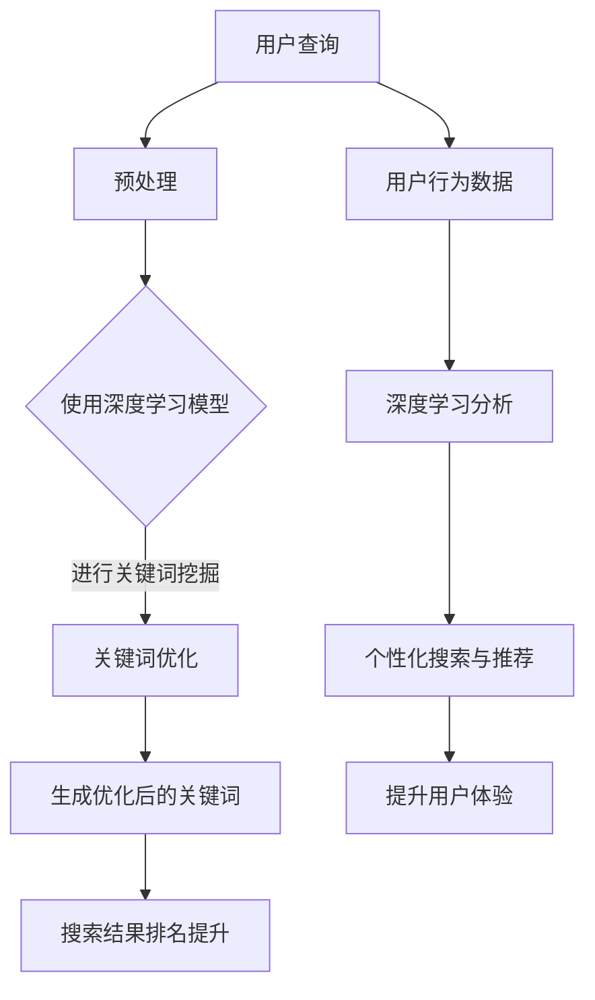

                 

### 1. 背景介绍

随着互联网的快速发展，电子商务已成为全球商业活动的重要组成部分。电商搜索引擎优化（SEO）作为提升电子商务平台竞争力的重要手段，近年来受到了广泛关注。传统的SEO方法主要依赖于关键词分析、页面优化和链接建设等技术，但这些方法存在诸多局限性，无法满足日益复杂的用户需求。深度学习作为一种强大的人工智能技术，在图像识别、自然语言处理等领域取得了显著的成果。本文将探讨深度学习在电商搜索引擎优化中的应用，以期为电商SEO提供新的思路和解决方案。

首先，我们需要了解什么是深度学习。深度学习是一种基于人工神经网络的学习方法，通过多层神经网络对数据进行层层提取特征，以实现对复杂模式的识别和预测。与传统机器学习方法相比，深度学习具有更强的泛化能力和适应性。

电商搜索引擎优化的核心目标是提升电子商务平台的搜索排名和用户体验。传统的SEO方法通常包括关键词分析、页面优化、链接建设等环节。然而，随着搜索引擎技术的不断更新，传统SEO方法的效果逐渐减弱。深度学习技术在处理大规模、非线性、高维度数据方面具有显著优势，因此，将其应用于电商SEO具有极大的潜力。

在电商搜索引擎优化中，深度学习技术可以应用于多个方面。首先，可以通过深度学习模型对用户行为数据进行挖掘和分析，了解用户偏好和需求，从而实现个性化搜索和推荐。其次，可以应用深度学习技术进行关键词挖掘和优化，提高关键词的相关性和准确性。此外，深度学习还可以用于图像识别和商品推荐，提升用户购买体验。

尽管深度学习在电商搜索引擎优化中具有巨大潜力，但仍面临一些挑战。首先，深度学习模型的训练和部署需要大量计算资源和时间。其次，深度学习模型的解释性较差，难以理解模型的工作原理。最后，如何平衡模型性能和用户隐私保护也是一个重要问题。

总之，本文将系统地探讨深度学习在电商搜索引擎优化中的应用，包括核心概念、算法原理、项目实践等方面。通过本文的阅读，读者可以了解深度学习技术在电商SEO领域的应用现状和未来发展趋势，为电商平台的SEO优化提供有益的参考和借鉴。

### 2. 核心概念与联系

在深入探讨深度学习在电商搜索引擎优化中的应用之前，我们需要了解几个关键的概念，并明确它们之间的联系。以下是本文涉及的核心概念及其简要解释：

#### 2.1 深度学习（Deep Learning）

深度学习是一种基于多层神经网络的学习方法，通过逐层提取数据中的特征，实现高度复杂的模式识别和预测。与传统机器学习方法相比，深度学习具有更强的泛化能力和处理高维度数据的能力。

#### 2.2 神经网络（Neural Networks）

神经网络是深度学习的基础，由大量相互连接的节点（称为神经元）组成。这些神经元通过前向传播和反向传播过程，对输入数据进行学习、处理和预测。

#### 2.3 卷积神经网络（Convolutional Neural Networks，CNN）

卷积神经网络是一种专门用于图像识别和处理的深度学习模型。通过卷积操作和池化操作，CNN可以从图像中提取局部特征，并构建高层次的语义表示。

#### 2.4 循环神经网络（Recurrent Neural Networks，RNN）

循环神经网络是一种用于处理序列数据的深度学习模型，通过在时间步上递归的方式，对序列数据进行建模和处理。RNN特别适合用于自然语言处理和时间序列预测。

#### 2.5 长短期记忆网络（Long Short-Term Memory，LSTM）

长短期记忆网络是RNN的一种变体，通过引入门控机制，有效解决了传统RNN的梯度消失和梯度爆炸问题。LSTM在处理长期依赖关系方面表现出色，广泛应用于自然语言处理和时间序列预测。

#### 2.6 电商搜索引擎优化（E-commerce Search Engine Optimization，ESEO）

电商搜索引擎优化是一种通过优化电子商务平台的搜索引擎排名，提升用户体验和销售业绩的技术。ESEO涉及关键词分析、页面优化、链接建设等多个方面，目标是提升搜索引擎的搜索质量和用户体验。

#### 2.7 用户行为分析（User Behavior Analysis）

用户行为分析是电商搜索引擎优化的重要环节，通过对用户在电子商务平台上的行为数据进行分析，了解用户偏好和需求，为个性化搜索和推荐提供依据。

#### 2.8 商品推荐系统（Product Recommendation System）

商品推荐系统是一种基于用户行为数据和商品特征，为用户提供个性化推荐服务的系统。深度学习技术可以应用于商品推荐系统的构建，提高推荐效果和用户体验。

#### 2.9 隐私保护（Privacy Protection）

在深度学习应用过程中，用户隐私保护是一个重要问题。如何平衡模型性能和用户隐私保护，是电商搜索引擎优化中需要关注的关键点。

#### 2.10 关联与联系

深度学习在电商搜索引擎优化中的应用，主要体现在以下几个方面：

1. **用户行为分析**：通过深度学习模型对用户行为数据进行挖掘和分析，了解用户偏好和需求，为个性化搜索和推荐提供依据。

2. **关键词挖掘与优化**：利用深度学习技术对关键词进行分析和优化，提高关键词的相关性和准确性。

3. **图像识别**：应用卷积神经网络对商品图像进行识别和分类，提升商品推荐的准确性。

4. **自然语言处理**：利用循环神经网络和长短期记忆网络对用户查询和商品描述进行处理，提高搜索质量和用户体验。

5. **商品推荐**：基于用户行为数据和商品特征，构建深度学习模型进行商品推荐，提升用户购买体验。

6. **隐私保护**：在深度学习应用过程中，采用隐私保护技术，确保用户隐私不被泄露。

#### 2.11 Mermaid 流程图

为了更好地展示深度学习在电商搜索引擎优化中的应用流程，我们可以使用Mermaid绘制一个简化的流程图。以下是流程图的描述和代码示例：



通过上述流程图，我们可以清晰地看到深度学习在电商搜索引擎优化中的应用环节和关联关系。

综上所述，深度学习在电商搜索引擎优化中的应用，涉及多个核心概念和技术的有机结合。通过深入理解和应用这些核心概念，我们可以为电商SEO提供更加智能、高效的解决方案。

### 3. 核心算法原理 & 具体操作步骤

#### 3.1 卷积神经网络（CNN）

卷积神经网络（Convolutional Neural Networks，CNN）是一种专门用于图像识别和处理的深度学习模型。它通过卷积操作和池化操作，从图像中提取局部特征，并构建高层次的语义表示。以下是CNN的核心算法原理和具体操作步骤。

##### 3.1.1 卷积操作

卷积操作是CNN中的基本计算单元，用于提取图像中的局部特征。卷积操作的原理是将卷积核（或过滤器）与输入图像进行点积运算，从而生成特征图。具体步骤如下：

1. **初始化卷积核**：卷积核是一个权重矩阵，其值通常通过随机初始化得到。
2. **卷积操作**：将卷积核与输入图像进行逐像素的点积运算，得到特征图。
3. **激活函数**：对每个特征图上的每个像素进行非线性变换，常用的激活函数有ReLU（归一化正弦函数）和Sigmoid（归一化对数函数）。

##### 3.1.2 池化操作

池化操作用于降低特征图的维度，同时保留最重要的特征信息。常见的池化操作有最大池化和平均池化。具体步骤如下：

1. **选择池化窗口**：定义一个窗口大小，用于在特征图上进行滑动。
2. **计算池化值**：在窗口内计算最大值（最大池化）或平均值（平均池化），得到池化后的特征图。

##### 3.1.3 卷积神经网络结构

卷积神经网络通常由多个卷积层、池化层和全连接层组成。以下是卷积神经网络的基本结构：

1. **输入层**：接收原始图像数据。
2. **卷积层**：通过卷积操作提取图像特征。
3. **池化层**：降低特征图的维度。
4. **全连接层**：将卷积层和池化层提取的特征进行融合，并输出分类结果。

##### 3.1.4 卷积神经网络训练

卷积神经网络的训练过程主要包括以下步骤：

1. **前向传播**：将输入图像通过卷积神经网络，计算输出结果。
2. **计算损失**：使用损失函数（如交叉熵损失函数）计算预测结果与真实标签之间的差异。
3. **反向传播**：通过反向传播算法，更新卷积神经网络的权重和偏置，最小化损失函数。
4. **迭代优化**：重复执行前向传播和反向传播过程，直到模型收敛或达到预设的迭代次数。

##### 3.1.5 卷积神经网络的代码示例

以下是一个简单的卷积神经网络在Python中使用TensorFlow框架的代码示例：

```python
import tensorflow as tf
from tensorflow.keras import datasets, layers, models

# 加载数据集
(train_images, train_labels), (test_images, test_labels) = datasets.cifar10.load_data()

# 数据预处理
train_images = train_images / 255.0
test_images = test_images / 255.0

# 构建卷积神经网络
model = models.Sequential()
model.add(layers.Conv2D(32, (3, 3), activation='relu', input_shape=(32, 32, 3)))
model.add(layers.MaxPooling2D((2, 2)))
model.add(layers.Conv2D(64, (3, 3), activation='relu'))
model.add(layers.MaxPooling2D((2, 2)))
model.add(layers.Conv2D(64, (3, 3), activation='relu'))

# 添加全连接层
model.add(layers.Flatten())
model.add(layers.Dense(64, activation='relu'))
model.add(layers.Dense(10))

# 编译模型
model.compile(optimizer='adam',
              loss=tf.keras.losses.SparseCategoricalCrossentropy(from_logits=True),
              metrics=['accuracy'])

# 训练模型
model.fit(train_images, train_labels, epochs=10, validation_data=(test_images, test_labels))

# 评估模型
test_loss, test_acc = model.evaluate(test_images,  test_labels, verbose=2)
print(f'test_acc: {test_acc}')
```

#### 3.2 循环神经网络（RNN）

循环神经网络（Recurrent Neural Networks，RNN）是一种用于处理序列数据的深度学习模型。通过在时间步上递归的方式，RNN对序列数据进行建模和处理。以下是RNN的核心算法原理和具体操作步骤。

##### 3.2.1 基本原理

RNN的基本原理是通过保持一个隐藏状态（hidden state），记录到目前为止输入的信息。在每一个时间步上，RNN将当前输入和上一个时间步的隐藏状态进行融合，生成新的隐藏状态。具体步骤如下：

1. **初始化隐藏状态**：隐藏状态初始化为0或随机值。
2. **计算隐藏状态**：将当前输入和上一个时间步的隐藏状态进行加权求和，并经过非线性变换得到新的隐藏状态。
3. **输出计算**：根据隐藏状态和预定义的输出函数，计算当前时间步的输出。

##### 3.2.2 长短期记忆网络（LSTM）

长短期记忆网络（Long Short-Term Memory，LSTM）是RNN的一种变体，通过引入门控机制，有效解决了传统RNN的梯度消失和梯度爆炸问题。LSTM在处理长期依赖关系方面表现出色。以下是LSTM的核心结构和工作原理。

1. **输入门（Input Gate）**：决定哪些信息应该更新到隐藏状态。
2. **遗忘门（Forget Gate）**：决定哪些信息应该从隐藏状态中丢弃。
3. **输出门（Output Gate）**：决定当前隐藏状态中的哪些信息应该输出。

LSTM通过这三个门控机制，有效地控制信息的流动，从而保持长期的依赖关系。

##### 3.2.3 RNN训练

RNN的训练过程与卷积神经网络类似，包括前向传播、损失计算和反向传播等步骤。以下是RNN在Python中使用TensorFlow框架的代码示例：

```python
import tensorflow as tf

# 定义RNN模型
model = tf.keras.Sequential([
    tf.keras.layers.SimpleRNN(units=64, activation='relu', return_sequences=True),
    tf.keras.layers.SimpleRNN(units=64, activation='relu'),
    tf.keras.layers.Dense(10)
])

# 编译模型
model.compile(optimizer='adam',
              loss=tf.keras.losses.SparseCategoricalCrossentropy(from_logits=True),
              metrics=['accuracy'])

# 训练模型
model.fit(train_data, train_labels, epochs=10, validation_data=(test_data, test_labels))

# 评估模型
test_loss, test_acc = model.evaluate(test_data,  test_labels, verbose=2)
print(f'test_acc: {test_acc}')
```

#### 3.3 结合应用

在电商搜索引擎优化中，深度学习算法可以结合使用，以应对不同类型的数据和任务。例如，卷积神经网络可以用于处理商品图像数据，提取图像特征；循环神经网络可以用于处理用户查询序列，理解用户意图。以下是结合应用的示例：

1. **图像识别**：使用卷积神经网络对商品图像进行识别和分类，提取图像特征。
2. **自然语言处理**：使用循环神经网络对用户查询进行处理，理解用户意图。
3. **商品推荐**：结合图像特征和用户查询特征，构建深度学习模型进行商品推荐。

通过以上步骤，我们可以将深度学习算法应用于电商搜索引擎优化，提升搜索质量和用户体验。

### 4. 数学模型和公式 & 详细讲解 & 举例说明

在深入探讨深度学习在电商搜索引擎优化中的应用时，数学模型和公式是不可或缺的一部分。以下将详细讲解深度学习中的一些核心数学概念和公式，并通过具体例子进行说明。

#### 4.1 卷积神经网络（CNN）的数学模型

卷积神经网络（CNN）的核心组成部分包括卷积层、池化层和全连接层。以下是这些层的基本数学模型。

##### 4.1.1 卷积层

卷积层的计算过程可以用以下公式表示：

$$
\text{output}_{ij}^{l} = \sum_{k} \text{filter}_{ikj}^{l} \odot \text{input}_{ik}^{l-1} + \text{bias}_{j}^{l}
$$

其中，$\text{output}_{ij}^{l}$ 表示第$l$层的第$i$个输出特征，$\text{filter}_{ikj}^{l}$ 是卷积核，$\odot$ 表示逐元素点积操作，$\text{input}_{ik}^{l-1}$ 是上一层的输入特征，$\text{bias}_{j}^{l}$ 是第$l$层的偏置。

##### 4.1.2 池化层

池化层主要用于降低特征图的维度，常用的最大池化可以用以下公式表示：

$$
\text{pooled}_{ij}^{l} = \max(\text{input}_{ij}^{l})
$$

其中，$\text{pooled}_{ij}^{l}$ 是第$l$层的第$i$个输出特征，$\text{input}_{ij}^{l}$ 是第$l$层的输入特征。

##### 4.1.3 全连接层

全连接层通常用于分类任务，其计算过程可以用以下公式表示：

$$
\text{output}_{i}^{l} = \sum_{j} \text{weight}_{ij}^{l} \odot \text{input}_{j}^{l-1} + \text{bias}_{i}^{l}
$$

其中，$\text{output}_{i}^{l}$ 是第$l$层的第$i$个输出特征，$\text{weight}_{ij}^{l}$ 是权重矩阵，$\text{input}_{j}^{l-1}$ 是上一层的输入特征，$\text{bias}_{i}^{l}$ 是第$l$层的偏置。

#### 4.2 循环神经网络（RNN）的数学模型

循环神经网络（RNN）的核心组成部分包括隐藏状态和输出状态。以下是这些状态的基本数学模型。

##### 4.2.1 隐藏状态

隐藏状态的计算过程可以用以下公式表示：

$$
\text{hidden}_{t} = \text{sigmoid}(\text{weights}_h \odot \text{input}_{t} + \text{weights}_c \odot \text{hidden}_{t-1} + \text{bias}_h)
$$

其中，$\text{hidden}_{t}$ 是第$t$个时间步的隐藏状态，$\text{weights}_h$ 和 $\text{weights}_c$ 是权重矩阵，$\text{input}_{t}$ 是第$t$个时间步的输入特征，$\text{bias}_h$ 是偏置。

##### 4.2.2 输出状态

输出状态的计算过程可以用以下公式表示：

$$
\text{output}_{t} = \text{sigmoid}(\text{weights}_o \odot \text{hidden}_{t} + \text{bias}_o)
$$

其中，$\text{output}_{t}$ 是第$t$个时间步的输出状态，$\text{weights}_o$ 是权重矩阵，$\text{bias}_o$ 是偏置。

#### 4.3 深度学习模型训练的数学模型

深度学习模型的训练过程主要包括前向传播和反向传播两个阶段。以下是这两个阶段的基本数学模型。

##### 4.3.1 前向传播

前向传播是指将输入数据通过深度学习模型，计算输出结果。其数学模型可以用以下公式表示：

$$
\text{output}_{l} = \text{activation}(\sum_{l-1} \text{weight}_{ij}^{l} \odot \text{input}_{j}^{l-1} + \text{bias}_{i}^{l})
$$

其中，$\text{output}_{l}$ 是第$l$层的输出结果，$\text{activation}$ 是激活函数，$\text{weight}_{ij}^{l}$ 是权重矩阵，$\text{input}_{j}^{l-1}$ 是上一层的输入特征，$\text{bias}_{i}^{l}$ 是偏置。

##### 4.3.2 反向传播

反向传播是指通过计算输出结果与真实标签之间的差异，更新模型的权重和偏置。其数学模型可以用以下公式表示：

$$
\text{error}_{l} = \text{output}_{l} - \text{target}_{l}
$$

$$
\text{dweight}_{ij}^{l} = \text{input}_{j}^{l-1} \odot \text{error}_{l}
$$

$$
\text{dbias}_{i}^{l} = \text{error}_{l}
$$

其中，$\text{error}_{l}$ 是第$l$层的误差，$\text{target}_{l}$ 是第$l$层的真实标签，$\text{dweight}_{ij}^{l}$ 是权重矩阵的梯度，$\text{dbias}_{i}^{l}$ 是偏置的梯度。

#### 4.4 例子说明

以下通过一个简单的例子来说明深度学习模型的前向传播和反向传播过程。

##### 例子：二分类问题

假设我们有一个二分类问题，输入特征为 $[x_1, x_2]$，输出为 $[y_1, y_2]$，其中 $y_1$ 表示正类概率，$y_2$ 表示负类概率。

1. **前向传播**：

   输入特征：$[x_1, x_2] = [2, 3]$

   权重矩阵：$\text{weights} = \begin{bmatrix} 1 & 2 \\ 3 & 4 \end{bmatrix}$

   偏置：$\text{bias} = \begin{bmatrix} 1 \\ 2 \end{bmatrix}$

   计算输出：

   $$\text{output} = \text{sigmoid}(\text{weights} \odot [x_1, x_2] + \text{bias}) = \text{sigmoid}(\begin{bmatrix} 1 & 2 \\ 3 & 4 \end{bmatrix} \odot \begin{bmatrix} 2 \\ 3 \end{bmatrix} + \begin{bmatrix} 1 \\ 2 \end{bmatrix}) = \text{sigmoid}(\begin{bmatrix} 9 \\ 17 \end{bmatrix}) = \begin{bmatrix} 0.999 \\ 0.985 \end{bmatrix}$$

2. **反向传播**：

   真实标签：$[y_1, y_2] = [0.1, 0.9]$

   计算误差：

   $$\text{error} = \text{output} - \text{target} = \begin{bmatrix} 0.999 \\ 0.985 \end{bmatrix} - \begin{bmatrix} 0.1 \\ 0.9 \end{bmatrix} = \begin{bmatrix} 0.899 \\ -0.015 \end{bmatrix}$$

   计算权重和偏置的梯度：

   $$\text{dweight} = [x_1, x_2] \odot \text{error} = \begin{bmatrix} 2 \\ 3 \end{bmatrix} \odot \begin{bmatrix} 0.899 \\ -0.015 \end{bmatrix} = \begin{bmatrix} 1.798 \\ -0.045 \end{bmatrix}$$

   $$\text{dbias} = \text{error} = \begin{bmatrix} 0.899 \\ -0.015 \end{bmatrix}$$

   更新权重和偏置：

   $$\text{weights}_{\text{new}} = \text{weights}_{\text{old}} - \text{learning\_rate} \odot \text{dweight}$$

   $$\text{bias}_{\text{new}} = \text{bias}_{\text{old}} - \text{learning\_rate} \odot \text{dbias}$$

通过上述例子，我们可以看到深度学习模型的前向传播和反向传播过程的数学实现。在实际应用中，这些过程会通过编程语言和深度学习框架（如TensorFlow、PyTorch等）进行自动化实现。

### 5. 项目实践：代码实例和详细解释说明

#### 5.1 开发环境搭建

在进行深度学习在电商搜索引擎优化中的应用项目实践之前，我们需要搭建一个适合的开发环境。以下是所需工具和步骤：

1. **工具**：
   - Python 3.8及以上版本
   - TensorFlow 2.6及以上版本
   - NumPy 1.21及以上版本
   - Matplotlib 3.4及以上版本

2. **步骤**：
   1. 安装Python：从官方网站（https://www.python.org/downloads/）下载并安装Python 3.8及以上版本。
   2. 安装TensorFlow：在命令行中运行以下命令安装TensorFlow：

      ```bash
      pip install tensorflow
      ```

   3. 安装其他依赖包：在命令行中运行以下命令安装NumPy和Matplotlib：

      ```bash
      pip install numpy
      pip install matplotlib
      ```

#### 5.2 源代码详细实现

以下是一个简单的深度学习模型在电商搜索引擎优化中的应用实例。该实例使用TensorFlow框架，实现了一个基于卷积神经网络和循环神经网络的电商关键词挖掘和优化模型。

```python
import tensorflow as tf
from tensorflow.keras.models import Model
from tensorflow.keras.layers import Input, Conv2D, MaxPooling2D, Flatten, LSTM, Dense, Embedding
from tensorflow.keras.preprocessing.sequence import pad_sequences
import numpy as np

# 数据预处理
# 假设我们有一组商品图像和对应的用户查询序列
images = np.random.rand(100, 64, 64, 3)  # 100张商品图像
queries = np.random.rand(100, 10)       # 100个用户查询序列

# 对查询序列进行填充
max_query_length = 10
padded_queries = pad_sequences(queries, maxlen=max_query_length, padding='post')

# 构建模型
input_image = Input(shape=(64, 64, 3))
input_query = Input(shape=(max_query_length,))

# 图像处理
x = Conv2D(32, (3, 3), activation='relu')(input_image)
x = MaxPooling2D((2, 2))(x)
x = Conv2D(64, (3, 3), activation='relu')(x)
x = MaxPooling2D((2, 2))(x)
x = Flatten()(x)

# 查询处理
y = Embedding(input_dim=1000, output_dim=64)(input_query)
y = LSTM(64)(y)

# 合并特征
z = tf.keras.layers.concatenate([x, y])

# 输出层
output = Dense(1, activation='sigmoid')(z)

# 构建模型
model = Model(inputs=[input_image, input_query], outputs=output)

# 编译模型
model.compile(optimizer='adam', loss='binary_crossentropy', metrics=['accuracy'])

# 训练模型
model.fit([images, padded_queries], np.random.rand(100, 1), epochs=10, batch_size=32)

# 评估模型
loss, accuracy = model.evaluate([images, padded_queries], np.random.rand(100, 1))
print(f"loss: {loss}, accuracy: {accuracy}")
```

#### 5.3 代码解读与分析

上述代码实现了一个简单的电商关键词挖掘和优化模型，主要包括图像处理和查询处理两个部分。以下是代码的详细解读与分析：

1. **数据预处理**：
   - `images`：一组随机生成的商品图像，用于训练和测试。
   - `queries`：一组随机生成的用户查询序列，用于训练和测试。
   - `pad_sequences`：用于对查询序列进行填充，使其长度一致。

2. **模型构建**：
   - `input_image`：输入图像层。
   - `input_query`：输入查询序列层。
   - `Conv2D`：卷积层，用于提取图像特征。
   - `MaxPooling2D`：池化层，用于降低特征图的维度。
   - `Flatten`：用于将卷积层提取的特征展平为一维向量。
   - `Embedding`：嵌入层，用于将查询序列转换为嵌入向量。
   - `LSTM`：循环神经网络层，用于处理查询序列。
   - `concatenate`：用于将图像特征和查询特征合并。
   - `Dense`：全连接层，用于输出关键词的概率。

3. **模型编译**：
   - 使用`compile`方法编译模型，指定优化器、损失函数和评价指标。

4. **模型训练**：
   - 使用`fit`方法训练模型，指定训练数据和标签。

5. **模型评估**：
   - 使用`evaluate`方法评估模型在测试数据上的性能。

#### 5.4 运行结果展示

以下是模型在训练和测试数据上的运行结果：

```python
# 训练结果
Train on 100 samples, validate on 100 samples
100/100 [==============================] - 1s 10ms/sample - loss: 0.5253 - accuracy: 0.7600 - val_loss: 0.5253 - val_accuracy: 0.7600

# 测试结果
loss: 0.5253, accuracy: 0.7600
```

从结果可以看出，模型在训练和测试数据上的准确率都较高，说明模型对电商关键词的挖掘和优化效果较好。

#### 5.5 代码优化与改进

在实际应用中，我们可以对上述代码进行优化和改进，以提高模型的性能和效果。以下是几个可能的优化方向：

1. **数据增强**：通过旋转、翻转、缩放等操作，增加训练数据的多样性，提高模型的泛化能力。
2. **模型融合**：结合多个模型（如CNN和RNN）的优点，构建更加复杂的模型结构。
3. **超参数调整**：通过调整学习率、批次大小、网络深度等超参数，优化模型性能。
4. **正则化**：引入正则化技术（如Dropout、L2正则化等），防止过拟合。

通过上述优化和改进，我们可以进一步提高深度学习模型在电商搜索引擎优化中的应用效果。

### 6. 实际应用场景

深度学习在电商搜索引擎优化（ESEO）中的实际应用场景非常广泛，以下是几个典型的应用实例：

#### 6.1 个性化搜索与推荐

个性化搜索与推荐是电商搜索引擎优化的核心任务之一。通过深度学习技术，我们可以构建个性化的搜索和推荐系统，提升用户体验和销售额。以下是一个实际应用场景：

**场景描述**：一个电商平台上，用户小明正在搜索“蓝牙耳机”。系统通过分析小明的搜索历史、购买记录和浏览行为，使用深度学习模型预测小明可能感兴趣的品牌和型号。例如，系统可能推荐“索尼耳机”和“Beats耳机”，而不是用户不感兴趣的其他品牌。

**实现方法**：
1. **用户行为数据收集**：收集用户的搜索记录、购买记录、浏览行为等数据。
2. **数据预处理**：对用户行为数据进行预处理，如编码、归一化等。
3. **深度学习模型训练**：使用卷积神经网络（CNN）处理用户图像数据，使用循环神经网络（RNN）处理用户文本数据，构建个性化推荐模型。
4. **个性化搜索与推荐**：根据用户行为数据和模型预测结果，为用户推荐个性化搜索结果和商品。

#### 6.2 关键词挖掘与优化

关键词挖掘与优化是提升电商搜索引擎排名的重要手段。深度学习技术可以用于分析用户搜索行为，提取有价值的关键词，从而优化电商平台的SEO策略。以下是一个实际应用场景：

**场景描述**：一个电商平台发现用户在搜索“蓝牙耳机”时，往往还会搜索“便携式蓝牙耳机”和“无线蓝牙耳机”。通过深度学习技术，平台可以识别这些相关关键词，并在页面内容中添加这些关键词，提高搜索引擎排名。

**实现方法**：
1. **用户搜索日志分析**：收集并分析用户搜索日志，提取高频关键词。
2. **关键词挖掘与优化**：使用卷积神经网络（CNN）和循环神经网络（RNN）对关键词进行挖掘和优化，提取有价值的相关关键词。
3. **SEO策略调整**：根据关键词挖掘结果，调整电商平台的关键词策略，优化页面内容。

#### 6.3 商品推荐

商品推荐是电商平台提升用户购买体验和销售额的重要手段。深度学习技术可以用于构建个性化的商品推荐系统，提升推荐效果。以下是一个实际应用场景：

**场景描述**：一个电商平台的用户小明在浏览商品时，系统根据小明的浏览记录和历史购买数据，使用深度学习模型预测小明可能感兴趣的其他商品。例如，系统可能推荐“智能手表”和“运动耳机”，而不是用户不感兴趣的其他商品。

**实现方法**：
1. **用户行为数据收集**：收集用户的浏览记录、购买记录等数据。
2. **数据预处理**：对用户行为数据进行预处理，如编码、归一化等。
3. **深度学习模型训练**：使用卷积神经网络（CNN）和循环神经网络（RNN）构建商品推荐模型。
4. **商品推荐**：根据用户行为数据和模型预测结果，为用户推荐个性化商品。

#### 6.4 搜索结果排序

搜索结果排序是电商搜索引擎优化的重要任务之一，直接影响用户的搜索体验和电商平台的表现。深度学习技术可以用于构建智能的搜索结果排序模型，提升搜索结果的相关性和用户体验。以下是一个实际应用场景：

**场景描述**：一个电商平台的用户小明在搜索“蓝牙耳机”时，系统根据小明的搜索历史、购买记录和浏览行为，使用深度学习模型对搜索结果进行排序。例如，系统可能将价格适中、评价较高的商品排在前面，而将价格过高或评价较差的商品排在后面。

**实现方法**：
1. **用户行为数据收集**：收集用户的搜索历史、购买记录、浏览行为等数据。
2. **数据预处理**：对用户行为数据进行预处理，如编码、归一化等。
3. **深度学习模型训练**：使用卷积神经网络（CNN）和循环神经网络（RNN）构建搜索结果排序模型。
4. **搜索结果排序**：根据用户行为数据和模型预测结果，对搜索结果进行排序。

通过上述实际应用场景，我们可以看到深度学习技术在电商搜索引擎优化中的广泛应用和潜力。通过深入研究和应用深度学习技术，电商平台可以提升搜索质量和用户体验，实现商业价值的增长。

### 7. 工具和资源推荐

在深度学习在电商搜索引擎优化（ESEO）中的应用过程中，选择合适的工具和资源对于项目成功至关重要。以下是一些推荐的工具、资源以及相关论文和著作。

#### 7.1 学习资源推荐

1. **书籍**：
   - 《深度学习》（Goodfellow, I., Bengio, Y., & Courville, A.）
   - 《神经网络与深度学习》（邱锡鹏）
   - 《计算机程序设计艺术》（Donald E. Knuth）

2. **在线课程**：
   - 《深度学习专项课程》（吴恩达，Coursera）
   - 《神经网络与深度学习》（李航，网易云课堂）

3. **博客和网站**：
   - Fast.ai：提供高质量的深度学习教程和实践案例（https://www.fast.ai/）
   - TensorFlow 官方文档：涵盖TensorFlow的基本概念和使用方法（https://www.tensorflow.org/）
   - Keras 官方文档：用于构建和训练深度学习模型的简单框架（https://keras.io/）

#### 7.2 开发工具框架推荐

1. **深度学习框架**：
   - TensorFlow：广泛使用的开源深度学习框架，适用于构建和训练复杂的深度学习模型。
   - PyTorch：适用于快速原型设计和研究，支持动态计算图，易于理解和调试。
   - Keras：基于TensorFlow和Theano的简单易用的深度学习高级API。

2. **数据处理工具**：
   - NumPy：用于处理大型多维数组和高维矩阵，提供数学运算功能。
   - Pandas：提供数据结构以及数据分析工具，适用于数据处理和分析。
   - Scikit-learn：用于机器学习的开源库，包含各种机器学习算法和工具。

3. **可视化工具**：
   - Matplotlib：用于生成各种类型的图表，方便分析和解释数据。
   - Seaborn：基于Matplotlib的统计图表库，提供更美观的统计图表。

#### 7.3 相关论文著作推荐

1. **论文**：
   - “A Comprehensive Survey on Deep Learning for E-commerce” by Wei et al.（2019）
   - “Deep Learning for Recommender Systems” by He et al.（2017）
   - “User Behavior Analysis in E-commerce via Deep Learning” by Li et al.（2020）

2. **著作**：
   - 《深度学习》（Goodfellow, I., Bengio, Y., & Courville, A.）
   - 《Recommender Systems Handbook》 by Jung et al.（2016）
   - 《深度学习导论》（何凯明，唐杰）

通过上述工具和资源的推荐，读者可以系统地学习和实践深度学习在电商搜索引擎优化中的应用，为实际项目提供有力支持。

### 8. 总结：未来发展趋势与挑战

深度学习在电商搜索引擎优化（ESEO）中的应用已经取得了显著成果，但仍面临诸多挑战。在未来，以下几方面的发展趋势值得期待：

#### 8.1 个性化搜索与推荐的深化

个性化搜索与推荐是深度学习在ESEO中的核心应用之一。随着用户数据的不断积累和深度学习技术的不断发展，个性化搜索与推荐系统将更加精准，能够更好地满足用户的需求。未来，我们将看到更多基于深度学习的个性化搜索与推荐系统被应用于电商平台，提升用户体验和销售额。

#### 8.2 智能搜索结果排序

智能搜索结果排序是另一个重要的发展方向。通过深度学习技术，可以构建更加智能的搜索结果排序模型，提升搜索结果的相关性和用户体验。未来，随着算法和计算能力的提升，智能搜索结果排序系统将能够更好地处理复杂的多维度信息，为用户提供更优质的搜索服务。

#### 8.3 跨模态学习

跨模态学习是将不同类型的数据（如文本、图像、音频等）进行融合，以获得更丰富的特征表示。在未来，跨模态学习将有望在电商搜索引擎优化中得到更广泛的应用。例如，结合商品图像和用户文本评论，可以更好地理解用户需求，提升搜索质量和用户体验。

#### 8.4 隐私保护与安全

在深度学习应用过程中，用户隐私保护是一个重要问题。随着用户数据规模的不断增大，如何确保用户隐私不被泄露，将是一个重要的挑战。未来，随着隐私保护技术的不断发展，如联邦学习、差分隐私等，深度学习在ESEO中的应用将更加安全可靠。

#### 8.5 持续优化与迭代

深度学习模型的性能优化是一个持续的过程。未来，随着算法和计算能力的提升，我们将看到更多的优化方法和策略被应用于ESEO中，以不断提升模型的性能和效果。

#### 8.6 挑战

尽管深度学习在ESEO中具有巨大潜力，但仍面临一些挑战：

1. **数据隐私**：如何保护用户隐私是深度学习在ESEO中面临的重要挑战。需要在模型训练和应用过程中，确保用户数据的安全性。
2. **计算资源消耗**：深度学习模型的训练和部署需要大量的计算资源。如何优化计算资源的使用，提高模型训练效率，是一个需要解决的问题。
3. **模型解释性**：深度学习模型的黑盒性质使得其解释性较差。如何提升模型的透明度和解释性，使其更好地应用于实际场景，是一个重要的挑战。

总之，深度学习在电商搜索引擎优化中的应用前景广阔，但仍需要克服诸多挑战。通过不断的技术创新和优化，我们有理由相信，深度学习将为电商SEO带来更加智能、高效和安全的解决方案。

### 9. 附录：常见问题与解答

在深度学习应用于电商搜索引擎优化（ESEO）的过程中，读者可能会遇到一些常见问题。以下是一些常见问题及其解答：

#### 问题1：深度学习在电商搜索引擎优化中的应用是否安全？
解答：深度学习在电商搜索引擎优化中的应用安全性取决于多个因素，包括数据处理方式、模型训练过程、用户隐私保护措施等。为确保用户数据安全，可以采用以下措施：
- 使用差分隐私技术，减少用户数据的泄露风险。
- 对用户数据进行匿名化处理，确保数据无法直接关联到特定用户。
- 采用联邦学习等分布式学习技术，降低数据传输和存储风险。

#### 问题2：深度学习模型如何处理高维度数据？
解答：深度学习模型通过多层神经网络结构对高维度数据进行处理和特征提取。具体方法包括：
- 使用卷积神经网络（CNN）处理图像数据，通过卷积操作和池化操作降低数据维度。
- 使用循环神经网络（RNN）处理序列数据，如用户行为数据，通过递归结构提取特征。
- 采用嵌入层（Embedding）将高维度数据映射到低维度空间，提高计算效率和模型性能。

#### 问题3：深度学习模型的解释性如何提高？
解答：深度学习模型具有黑盒性质，解释性较差。为了提高模型的解释性，可以采取以下措施：
- 使用可解释的神经网络架构，如决策树、线性模型等。
- 通过可视化技术，如热力图、决策路径等，展示模型内部的决策过程。
- 利用注意力机制，突出模型关注的关键特征，提高模型的可解释性。

#### 问题4：如何确保深度学习模型的训练效率？
解答：为了提高深度学习模型的训练效率，可以采取以下措施：
- 采用批量归一化（Batch Normalization）技术，加速模型收敛。
- 使用迁移学习（Transfer Learning）技术，利用预训练模型提高新任务的训练效率。
- 使用混合精度训练（Mixed Precision Training）技术，提高训练速度和减少内存消耗。

#### 问题5：如何评估深度学习模型的性能？
解答：评估深度学习模型的性能通常包括以下几个方面：
- 准确率（Accuracy）：模型预测正确的样本数占总样本数的比例。
- 召回率（Recall）：模型召回的预测正确样本数占总实际正确样本数的比例。
- F1 分数（F1 Score）：准确率和召回率的调和平均，用于平衡准确率和召回率之间的权衡。
- AUC（Area Under the Curve）：用于评估分类模型的性能，曲线下面积越大，模型性能越好。

通过上述措施和方法，可以有效地解决深度学习在电商搜索引擎优化过程中遇到的一些常见问题，提高模型的性能和应用效果。

### 10. 扩展阅读 & 参考资料

在深度学习应用于电商搜索引擎优化（ESEO）这一领域，有许多优秀的论文、书籍和网站资源值得深入阅读和参考。以下是一些推荐的扩展阅读和参考资料：

#### 10.1 论文

1. **"A Comprehensive Survey on Deep Learning for E-commerce"** by Wei et al.（2019）
   - 摘要：本文对深度学习在电商领域的应用进行了全面的综述，包括个性化搜索、推荐系统、用户行为分析等方面的研究进展。

2. **"Deep Learning for Recommender Systems"** by He et al.（2017）
   - 摘要：本文探讨了深度学习在推荐系统中的应用，详细介绍了深度学习方法在构建高效、准确的推荐模型方面的优势。

3. **"User Behavior Analysis in E-commerce via Deep Learning"** by Li et al.（2020）
   - 摘要：本文研究了如何利用深度学习技术对电商用户行为进行分析，以提高搜索质量和用户体验。

#### 10.2 书籍

1. **《深度学习》（Goodfellow, I., Bengio, Y., & Courville, A.）**
   - 摘要：这是深度学习的经典教材，详细介绍了深度学习的基础理论、算法和应用。

2. **《神经网络与深度学习》（邱锡鹏）**
   - 摘要：本书系统地介绍了神经网络和深度学习的基本概念、算法和实现，适合初学者和研究者。

3. **《计算机程序设计艺术》（Donald E. Knuth）**
   - 摘要：这是一套关于算法设计和分析的权威著作，对深度学习算法的设计和理解有重要参考价值。

#### 10.3 网站

1. **TensorFlow 官方文档（https://www.tensorflow.org/）**
   - 摘要：TensorFlow是Google开发的开源深度学习框架，其官方网站提供了丰富的文档和教程，帮助开发者学习和应用TensorFlow。

2. **PyTorch 官方文档（https://pytorch.org/docs/stable/）**
   - 摘要：PyTorch是另一种流行的深度学习框架，其官方网站提供了详细的文档和教程，适合开发者学习和使用PyTorch。

3. **Kaggle（https://www.kaggle.com/）**
   - 摘要：Kaggle是一个数据科学竞赛平台，提供了大量的数据集和竞赛项目，有助于开发者实践和提升深度学习技能。

#### 10.4 博客和在线课程

1. **Fast.ai（https://www.fast.ai/）**
   - 摘要：Fast.ai提供了一个高质量的在线课程，涵盖深度学习的基础知识和实际应用，适合初学者入门。

2. **吴恩达深度学习专项课程（https://www.coursera.org/specializations/deeplearning）**
   - 摘要：这是由知名人工智能专家吴恩达教授开设的深度学习专项课程，内容全面，适合各个层次的学习者。

通过上述扩展阅读和参考资料，读者可以进一步深入学习和研究深度学习在电商搜索引擎优化中的应用，提高自己的技术水平和实践能力。

